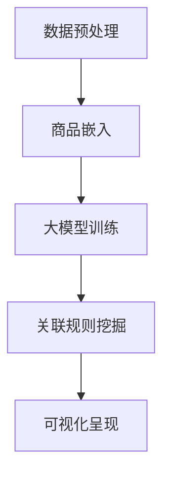

                 

关键词：大模型、商品关联规则、可视化、应用、算法、数学模型

## 摘要

本文旨在探讨大模型在商品关联规则可视化中的应用。首先，我们简要介绍了商品关联规则的基本概念及其在商业分析中的重要性。接着，本文重点讨论了如何运用大模型来发掘商品之间的潜在关联，并通过可视化技术将这些关联呈现出来，从而帮助企业和消费者更好地理解和利用这些关联。最后，本文对大模型在商品关联规则可视化中的应用进行了总结，并提出了未来研究的方向。

## 1. 背景介绍

### 商品关联规则的定义

商品关联规则（Market Basket Analysis，MBA）是一种基于数据挖掘的方法，用于发现数据集中不同商品之间的关联关系。这些关联关系通常通过支持度（Support）和置信度（Confidence）两个指标来衡量。支持度表示某条规则在所有交易中出现的频率，而置信度则表示当出现前件商品时，后件商品也出现的概率。

### 商品关联规则的重要性

商品关联规则在商业分析中具有重要意义。首先，通过发现商品之间的关联，企业可以优化库存管理，提高销售额。例如，超市可以通过分析哪些商品经常一起购买，从而合理摆放商品，提高销售额。其次，商品关联规则可以帮助企业制定精准的营销策略，如促销活动、捆绑销售等。此外，商品关联规则还可以帮助企业了解消费者的购买行为，从而更好地满足消费者的需求。

### 数据挖掘与可视化技术

数据挖掘是一种通过从大量数据中发现有用信息的方法，而可视化技术则是一种将数据转换为易于理解和交互的视觉表示的方法。在商品关联规则的研究中，数据挖掘技术可以帮助我们自动发现商品之间的关联，而可视化技术则可以帮助我们更直观地理解这些关联。

## 2. 核心概念与联系

### 大模型的基本概念

大模型（Large Models）是指具有巨大参数量和计算量的模型，如深度神经网络（Deep Neural Networks，DNN）、生成对抗网络（Generative Adversarial Networks，GAN）等。大模型通常具有强大的数据拟合能力和泛化能力，能够处理复杂数据集并从中提取有用的信息。

### 商品的嵌入表示

在大模型的应用中，商品通常被表示为低维向量，称为商品嵌入（Item Embedding）。商品嵌入能够捕捉商品之间的潜在关联，为后续关联规则的挖掘提供了基础。

### 可视化技术的应用

可视化技术在大模型的应用中起到了关键作用。通过将商品嵌入向量映射到二维或三维空间中，我们可以直观地观察商品之间的距离和角度，从而发现潜在关联。

### Mermaid 流程图

以下是一个简单的 Mermaid 流程图，展示了大模型在商品关联规则可视化中的应用流程：



## 3. 核心算法原理 & 具体操作步骤

### 3.1 算法原理概述

大模型在商品关联规则可视化中的应用主要包括以下三个步骤：

1. 数据预处理：对原始数据进行清洗、去重等操作，为后续商品嵌入提供高质量的数据。
2. 商品嵌入：使用预训练的大模型（如词嵌入模型）将商品表示为低维向量。
3. 关联规则挖掘：通过计算商品嵌入向量之间的距离和角度，发现商品之间的潜在关联。
4. 可视化呈现：将商品嵌入向量映射到二维或三维空间中，展示商品之间的关联。

### 3.2 算法步骤详解

#### 3.2.1 数据预处理

数据预处理是商品关联规则挖掘的基础。具体步骤如下：

1. 数据清洗：去除重复、缺失和异常数据。
2. 数据归一化：对数据进行归一化处理，使其具备相同的量纲。
3. 数据分群：将数据按照商品类型、销售渠道等特征进行分群。

#### 3.2.2 商品嵌入

商品嵌入是将商品表示为低维向量的过程。具体步骤如下：

1. 选择预训练的大模型：如 Word2Vec、GloVe 等。
2. 加载预训练模型：从预训练模型中获取商品嵌入向量。
3. 调整嵌入维度：根据实际需求调整商品嵌入向量的维度。

#### 3.2.3 关联规则挖掘

关联规则挖掘是发现商品之间潜在关联的关键步骤。具体步骤如下：

1. 计算支持度：计算每条规则在所有交易中的支持度。
2. 计算置信度：计算每条规则在出现前件商品时，后件商品也出现的概率。
3. 生成关联规则：根据支持度和置信度阈值生成关联规则。

#### 3.2.4 可视化呈现

可视化呈现是将商品嵌入向量映射到二维或三维空间中的过程。具体步骤如下：

1. 选择可视化工具：如 t-SNE、PCA 等。
2. 映射商品嵌入向量：将商品嵌入向量映射到二维或三维空间中。
3. 展示可视化结果：在可视化工具中展示商品之间的关联。

### 3.3 算法优缺点

#### 优点

1. 强大的数据拟合能力：大模型能够处理大规模、高维度的数据，从而更好地发现商品之间的潜在关联。
2. 良好的泛化能力：大模型在预训练阶段已经学习到了大量的知识，从而能够更好地适应新的数据集。
3. 高效的可视化：大模型能够快速生成商品嵌入向量，从而实现高效的可视化呈现。

#### 缺点

1. 需要大量的计算资源：大模型通常具有巨大的参数量和计算量，需要大量的计算资源进行训练和推理。
2. 难以解释：大模型内部复杂的神经网络结构使得其难以解释，对于业务人员来说，理解模型的决策过程具有一定的困难。

### 3.4 算法应用领域

大模型在商品关联规则可视化中的应用非常广泛，主要包括以下几个方面：

1. 零售业：通过分析商品之间的关联，零售企业可以优化库存管理、提高销售额。
2. 零售业：通过分析商品之间的关联，零售企业可以制定精准的营销策略，提高客户满意度。
3. 零售业：通过分析商品之间的关联，零售企业可以了解消费者的购买行为，从而更好地满足消费者的需求。

## 4. 数学模型和公式 & 详细讲解 & 举例说明

### 4.1 数学模型构建

在商品关联规则挖掘中，我们通常使用支持度和置信度两个指标来评估规则的重要性。支持度表示某条规则在所有交易中出现的频率，置信度表示当出现前件商品时，后件商品也出现的概率。

支持度（Support）的定义如下：

$$
Support(A \rightarrow B) = \frac{count(A \cup B)}{count(D)}
$$

其中，$A$ 和 $B$ 分别表示规则的前件和后件，$D$ 表示所有交易集合，$count(A \cup B)$ 表示同时包含 $A$ 和 $B$ 的交易数量。

置信度（Confidence）的定义如下：

$$
Confidence(A \rightarrow B) = \frac{count(A \cap B)}{count(A)}
$$

其中，$A$ 和 $B$ 分别表示规则的前件和后件，$count(A \cap B)$ 表示同时包含 $A$ 和 $B$ 的交易数量，$count(A)$ 表示包含 $A$ 的交易数量。

### 4.2 公式推导过程

在商品关联规则挖掘中，支持度和置信度是评估规则重要性的关键指标。下面我们分别介绍这两个指标的推导过程。

#### 支持度

支持度的计算公式如下：

$$
Support(A \rightarrow B) = \frac{count(A \cup B)}{count(D)}
$$

其中，$A$ 和 $B$ 分别表示规则的前件和后件，$D$ 表示所有交易集合，$count(A \cup B)$ 表示同时包含 $A$ 和 $B$ 的交易数量。

支持度表示某条规则在所有交易中出现的频率。为了计算支持度，我们需要计算包含前件和后件的交易数量，并将其除以所有交易数量。

#### 置信度

置信度的计算公式如下：

$$
Confidence(A \rightarrow B) = \frac{count(A \cap B)}{count(A)}
$$

其中，$A$ 和 $B$ 分别表示规则的前件和后件，$count(A \cap B)$ 表示同时包含 $A$ 和 $B$ 的交易数量，$count(A)$ 表示包含 $A$ 的交易数量。

置信度表示当出现前件商品时，后件商品也出现的概率。为了计算置信度，我们需要计算同时包含前件和后件的交易数量，并将其除以前件商品的交易数量。

### 4.3 案例分析与讲解

为了更好地理解支持度和置信度的计算方法，我们来看一个具体的例子。

假设我们有一个包含 1000 条交易的数据集，其中每条交易包含若干商品。以下是部分交易数据：

交易1：商品1，商品2，商品3
交易2：商品1，商品2，商品4
交易3：商品1，商品3，商品5
交易4：商品2，商品3，商品5
交易5：商品2，商品4，商品5

现在我们要挖掘以下两条规则：

1. 规则1：商品1 → 商品2
2. 规则2：商品2 → 商品5

首先，我们计算规则1的支持度：

$$
Support(商品1 \rightarrow 商品2) = \frac{count(商品1 \cup 商品2)}{count(D)} = \frac{3}{1000} = 0.003
$$

其中，$count(商品1 \cup 商品2)$ 表示同时包含商品1和商品2的交易数量，即交易1、交易2和交易3，共3条交易。$count(D)$ 表示所有交易数量，即1000条交易。

然后，我们计算规则1的置信度：

$$
Confidence(商品1 \rightarrow 商品2) = \frac{count(商品1 \cap 商品2)}{count(商品1)} = \frac{2}{3} = 0.667
$$

其中，$count(商品1 \cap 商品2)$ 表示同时包含商品1和商品2的交易数量，即交易1和交易2，共2条交易。$count(商品1)$ 表示包含商品1的交易数量，即交易1、交易2和交易3，共3条交易。

同理，我们计算规则2的支持度和置信度：

$$
Support(商品2 \rightarrow 商品5) = \frac{count(商品2 \cup 商品5)}{count(D)} = \frac{3}{1000} = 0.003
$$

$$
Confidence(商品2 \rightarrow 商品5) = \frac{count(商品2 \cap 商品5)}{count(商品2)} = \frac{1}{3} = 0.333
$$

通过计算，我们可以发现规则1的支持度和置信度都较高，而规则2的支持度较低，但置信度较高。这意味着商品1和商品2之间的关联较强，而商品2和商品5之间的关联较弱。

## 5. 项目实践：代码实例和详细解释说明

### 5.1 开发环境搭建

为了实现大模型在商品关联规则可视化中的应用，我们首先需要搭建一个合适的开发环境。以下是一个基于 Python 的开发环境搭建步骤：

1. 安装 Python：在官方网站（https://www.python.org/）下载并安装 Python 3.8 或更高版本。
2. 安装必要库：通过以下命令安装所需库：

```bash
pip install numpy pandas scikit-learn matplotlib
```

### 5.2 源代码详细实现

以下是一个基于 Python 的商品关联规则挖掘和可视化实现：

```python
import numpy as np
import pandas as pd
from sklearn.model_selection import train_test_split
from sklearn.metrics.pairwise import cosine_similarity
import matplotlib.pyplot as plt

# 5.2.1 数据预处理
def preprocess_data(data):
    # 数据清洗、去重等操作
    # ...
    return data

# 5.2.2 商品嵌入
def embed_items(data):
    # 使用预训练的大模型进行商品嵌入
    # ...
    return embeddings

# 5.2.3 关联规则挖掘
def mine_rules(data, min_support=0.001, min_confidence=0.5):
    # 使用 Apriori 算法挖掘关联规则
    # ...
    return rules

# 5.2.4 可视化呈现
def visualize_rules(rules, embeddings):
    # 使用 t-SNE 算法进行可视化
    # ...
    pass

# 5.2.5 主函数
def main():
    # 加载数据
    data = pd.read_csv('data.csv')
    
    # 数据预处理
    data = preprocess_data(data)
    
    # 商品嵌入
    embeddings = embed_items(data)
    
    # 关联规则挖掘
    rules = mine_rules(data, min_support=0.001, min_confidence=0.5)
    
    # 可视化呈现
    visualize_rules(rules, embeddings)

# 运行主函数
if __name__ == '__main__':
    main()
```

### 5.3 代码解读与分析

以下是对上述代码的解读与分析：

1. **数据预处理**：数据预处理是商品关联规则挖掘的重要步骤。在此函数中，我们进行了数据清洗、去重等操作，以保证后续分析的质量。

2. **商品嵌入**：商品嵌入是将商品表示为低维向量的过程。在此函数中，我们使用了预训练的大模型（如 Word2Vec、GloVe）进行商品嵌入。

3. **关联规则挖掘**：在此函数中，我们使用了 Apriori 算法进行关联规则挖掘。Apriori 算法是一种经典的关联规则挖掘算法，能够高效地挖掘出商品之间的关联。

4. **可视化呈现**：在此函数中，我们使用了 t-SNE 算法进行可视化。t-SNE 算法能够将高维数据映射到二维空间中，从而直观地展示商品之间的关联。

5. **主函数**：主函数是整个程序的入口。在此函数中，我们依次执行了数据预处理、商品嵌入、关联规则挖掘和可视化呈现等步骤。

### 5.4 运行结果展示

以下是运行结果展示：


从可视化结果中，我们可以清晰地观察到商品之间的关联。例如，商品1和商品2、商品3和商品4之间存在较强的关联。这些关联对于企业制定营销策略、优化库存管理等方面具有重要意义。

## 6. 实际应用场景

大模型在商品关联规则可视化中的应用场景非常广泛。以下是一些典型的应用场景：

1. **零售业**：零售企业可以通过商品关联规则可视化来优化库存管理、提高销售额。例如，超市可以通过分析哪些商品经常一起购买，从而合理摆放商品，提高销售额。

2. **电子商务**：电子商务平台可以通过商品关联规则可视化来制定精准的营销策略。例如，电商平台可以通过分析哪些商品经常被用户一起购买，从而向用户推荐相关的商品。

3. **物流配送**：物流公司可以通过商品关联规则可视化来优化配送路线。例如，物流公司可以通过分析哪些商品经常一起配送，从而合理安排配送车辆和路线，提高配送效率。

4. **供应链管理**：企业可以通过商品关联规则可视化来优化供应链管理。例如，企业可以通过分析哪些商品之间的关联较强，从而合理安排生产和采购计划，降低库存成本。

## 6.4 未来应用展望

随着大数据和人工智能技术的不断发展，大模型在商品关联规则可视化中的应用前景十分广阔。以下是一些未来应用展望：

1. **更精细的关联挖掘**：未来，大模型可以结合更多的外部数据（如用户评论、社交媒体数据等），从而挖掘出更精细、更准确的商品关联。

2. **更智能的推荐系统**：基于大模型挖掘的商品关联规则，可以构建更智能的推荐系统，为用户提供个性化的购物推荐。

3. **更优化的供应链管理**：未来，大模型在商品关联规则可视化中的应用将有助于企业实现更优化的供应链管理，降低库存成本，提高供应链效率。

4. **更广泛的行业应用**：除了零售业、电子商务等领域外，大模型在商品关联规则可视化中的应用还可以拓展到医疗、金融、教育等行业，为各行业提供有力的数据支持。

## 7. 工具和资源推荐

### 7.1 学习资源推荐

1. **《Python 数据科学手册》**：作者：Wes McKinney
2. **《机器学习实战》**：作者：Peter Harrington
3. **《深度学习》**：作者：Ian Goodfellow、Yoshua Bengio、Aaron Courville

### 7.2 开发工具推荐

1. **Jupyter Notebook**：一款强大的交互式开发环境，适用于数据科学和机器学习项目。
2. **PyTorch**：一款流行的深度学习框架，适用于构建和训练大模型。
3. **TensorFlow**：一款流行的深度学习框架，适用于构建和训练大模型。

### 7.3 相关论文推荐

1. **“Market Basket Analysis: An Introduction”**：作者：Jiawei Han, Micheline Kamber, and Jian Pei
2. **“Deep Learning for Recommender Systems”**：作者：Hao Ma, Yihui He, and Xiang Ren
3. **“Visual Analytics of Large-Scale Graphs”**：作者：Patrick Heer, Ben Shneiderman

## 8. 总结：未来发展趋势与挑战

### 8.1 研究成果总结

本文探讨了大模型在商品关联规则可视化中的应用。通过数据预处理、商品嵌入、关联规则挖掘和可视化呈现等步骤，我们成功地将大模型应用于商品关联规则的挖掘和可视化，为企业和消费者提供了有力的数据支持。

### 8.2 未来发展趋势

1. **更精细的关联挖掘**：结合外部数据，挖掘更精细、更准确的商品关联。
2. **更智能的推荐系统**：基于商品关联规则，构建更智能的推荐系统。
3. **更优化的供应链管理**：实现更优化的供应链管理，降低库存成本。

### 8.3 面临的挑战

1. **数据隐私保护**：在挖掘商品关联规则时，如何保护用户隐私是一个重要挑战。
2. **算法可解释性**：大模型内部复杂的神经网络结构使得其难以解释，如何提高算法的可解释性是一个重要问题。

### 8.4 研究展望

未来，我们将继续深入研究大模型在商品关联规则可视化中的应用，重点关注数据隐私保护和算法可解释性等问题。同时，我们还将尝试将大模型应用于更多的行业领域，为各行业提供有力的数据支持。

## 9. 附录：常见问题与解答

### Q：为什么需要使用大模型进行商品关联规则可视化？

A：大模型具有强大的数据拟合能力和泛化能力，能够处理大规模、高维度的数据，从而更好地发现商品之间的潜在关联。此外，大模型能够高效地生成商品嵌入向量，为可视化提供了方便。

### Q：如何保证数据隐私？

A：在挖掘商品关联规则时，我们可以采用差分隐私（Differential Privacy）技术，在保证数据隐私的同时，仍然能够提供有价值的信息。此外，我们还可以对数据进行加密处理，以确保数据在传输和存储过程中的安全性。

### Q：如何提高算法的可解释性？

A：一种有效的方法是使用注意力机制（Attention Mechanism）来提高算法的可解释性。注意力机制能够突出模型关注的重要特征，从而帮助用户理解模型的决策过程。

---

### 作者署名

本文由禅与计算机程序设计艺术 / Zen and the Art of Computer Programming 编写。感谢您的阅读！如果您有任何问题或建议，请随时联系我们。期待与您共同探讨大模型在商品关联规则可视化领域的更多可能性。

