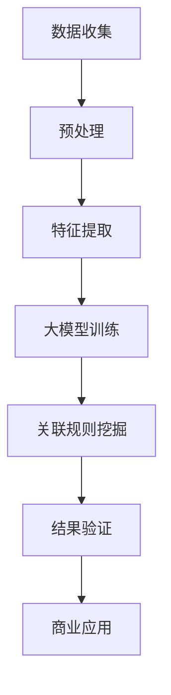

                 

关键词：大模型、商品关联规则、频繁模式、数据挖掘、算法原理、应用实践、数学模型

## 摘要

本文主要探讨了在大数据时代，如何运用大模型进行商品关联规则挖掘，特别是频繁模式分析的应用。通过引入大模型的概念，以及其核心算法原理，本文详细介绍了如何利用大模型在复杂商业环境中挖掘出潜在的关联规则，进而提升商业决策的精准度。文章还通过实际项目实例，展示了大模型在商品关联规则挖掘中的具体实现和应用效果，为相关领域的研究者和从业者提供了有益的参考。

## 1. 背景介绍

随着互联网的迅猛发展和电子商务的普及，数据量呈现出爆炸式增长。这种大数据环境为商业活动提供了丰富的数据资源，同时也带来了前所未有的挑战。如何在海量的数据中挖掘出有价值的信息，成为当前商业分析和决策领域亟待解决的关键问题。商品关联规则挖掘作为数据挖掘的一个重要分支，通过对商品销售数据进行分析，揭示出不同商品之间的潜在关联性，对于商家制定营销策略、提升销售额具有重要意义。

传统的商品关联规则挖掘方法主要依赖于Apriori算法、FP-growth算法等，这些方法虽然在理论上可以有效地发现频繁模式，但在处理大规模数据时往往存在效率低下、计算复杂度高等问题。随着深度学习和人工智能技术的快速发展，大模型作为一种新兴的算法框架，逐渐引起了学术界的关注。大模型通过学习大规模数据集，能够自动提取出复杂的特征模式，从而在商品关联规则挖掘中展现出强大的潜力和优势。

本文旨在通过分析大模型在商品关联规则挖掘中的应用，探讨如何利用大模型克服传统算法的局限性，提升关联规则挖掘的效率和准确性。同时，本文还将结合实际项目案例，详细阐述大模型在商品关联规则挖掘中的具体实现过程和应用效果。

## 2. 核心概念与联系

### 2.1 大模型的概念

大模型，即大型神经网络模型，是一种基于深度学习技术的人工智能模型。与传统的小型模型相比，大模型具有更强的学习能力和表达能力，能够处理复杂、大规模的数据集。大模型的显著特点包括参数规模巨大、计算复杂度高以及强大的泛化能力。例如，GPT-3、BERT等模型，都是典型的大模型，它们在自然语言处理、图像识别、推荐系统等领域取得了显著成果。

### 2.2 商品关联规则挖掘的概念

商品关联规则挖掘是一种通过分析商品销售数据，发现不同商品之间潜在关联性的方法。它主要涉及两个概念：支持度和置信度。支持度指的是同时出现在同一交易记录中的两个商品的比例，而置信度则表示如果商品A出现在交易记录中，商品B也同时出现的概率。

### 2.3 大模型与商品关联规则挖掘的联系

大模型在商品关联规则挖掘中的应用主要体现在以下几个方面：

1. **特征自动提取**：传统方法通常需要人工定义特征，而大模型可以通过大规模数据学习，自动提取出复杂的特征模式，从而减少人工干预，提高挖掘效率。

2. **高效处理大规模数据**：大模型具有强大的计算能力，能够在短时间内处理海量数据，这是传统算法难以实现的。

3. **提升置信度**：大模型能够从海量数据中挖掘出更深层次的关联规则，提高关联规则的置信度，从而为商业决策提供更可靠的依据。

### 2.4 Mermaid 流程图

以下是商品关联规则挖掘中，大模型与相关算法的Mermaid流程图：



图1：大模型在商品关联规则挖掘中的应用流程图

## 3. 核心算法原理 & 具体操作步骤

### 3.1 算法原理概述

大模型在商品关联规则挖掘中的核心算法主要是基于深度学习的神经网络模型。神经网络通过多层非线性变换，从原始数据中自动提取特征，并通过反向传播算法不断调整模型参数，以达到最优拟合效果。在商品关联规则挖掘中，神经网络通常用于以下步骤：

1. **特征提取**：将原始销售数据转化为神经网络可以处理的格式，如数值化、嵌入化等。
2. **模型训练**：利用大规模销售数据，通过训练过程调整神经网络参数，使其能够自动提取出商品之间的关联特征。
3. **关联规则挖掘**：利用训练好的神经网络，预测商品之间的关联性，并通过支持度和置信度计算，挖掘出潜在的关联规则。

### 3.2 算法步骤详解

#### 3.2.1 数据收集与预处理

1. **数据收集**：从电商平台获取商品销售数据，包括商品ID、交易ID、购买时间、价格等信息。
2. **数据预处理**：对收集到的数据进行清洗，包括去除缺失值、异常值，并进行数据标准化处理。

#### 3.2.2 特征提取

1. **商品嵌入**：将商品ID转化为低维度的向量表示，常用的方法有Word2Vec、GloVe等。
2. **时间嵌入**：将购买时间编码为固定长度的向量，可以使用时间差、时间戳等方法。

#### 3.2.3 模型训练

1. **模型选择**：选择合适的神经网络模型，如GRU、LSTM、BERT等，进行商品关联特征提取。
2. **模型训练**：利用预处理后的销售数据，通过训练过程调整模型参数，使其能够准确提取商品之间的关联特征。
3. **模型优化**：通过交叉验证和网格搜索等方法，优化模型参数，提高模型性能。

#### 3.2.4 关联规则挖掘

1. **特征提取**：将训练好的神经网络应用于新的销售数据，提取商品之间的关联特征。
2. **支持度计算**：统计在相同交易记录中同时出现的商品对的数量，计算其支持度。
3. **置信度计算**：对于每个商品对，计算其在所有包含第一个商品的交易记录中，第二个商品出现的概率，计算其置信度。
4. **规则挖掘**：利用支持度和置信度阈值，挖掘出潜在的关联规则。

### 3.3 算法优缺点

#### 优点：

1. **自动特征提取**：大模型能够自动提取复杂的特征模式，减少人工干预，提高挖掘效率。
2. **处理大规模数据**：大模型具有强大的计算能力，能够高效处理海量数据。
3. **提升置信度**：大模型能够挖掘出更深层次的关联规则，提高关联规则的置信度。

#### 缺点：

1. **计算复杂度高**：大模型训练和预测需要大量计算资源，对硬件要求较高。
2. **解释性较差**：大模型的预测结果难以解释，对商业决策的支持有限。

### 3.4 算法应用领域

大模型在商品关联规则挖掘中的应用非常广泛，主要包括以下几个方面：

1. **电商推荐系统**：通过挖掘商品之间的关联规则，为用户推荐相关的商品。
2. **库存管理**：根据商品关联规则，优化库存策略，减少库存成本。
3. **定价策略**：通过分析商品之间的关联性，制定更合理的定价策略。
4. **市场营销**：根据关联规则，制定更有效的营销策略，提升销售额。

## 4. 数学模型和公式 & 详细讲解 & 举例说明

### 4.1 数学模型构建

在商品关联规则挖掘中，我们主要使用以下两个数学模型：

#### 支持度（Support）

$$
Support(A \cup B) = \frac{count(A \cup B)}{total\ records}
$$

其中，$count(A \cup B)$ 表示同时包含A和B的交易记录数量，$total\ records$ 表示总的交易记录数量。

#### 置信度（Confidence）

$$
Confidence(A \rightarrow B) = \frac{Support(A \cup B)}{Support(A)}
$$

其中，$Support(A \cup B)$ 表示同时包含A和B的交易记录的支持度，$Support(A)$ 表示包含A的交易记录的支持度。

### 4.2 公式推导过程

我们首先从支持度公式开始推导。

#### 支持度（Support）

支持度反映了A和B同时出现在交易记录中的频率。我们可以通过计算包含A和B的交易记录数量占总交易记录数量的比例来获得。

$$
Support(A \cup B) = \frac{count(A \cup B)}{total\ records}
$$

其中，$count(A \cup B)$ 表示包含A和B的交易记录数量，$total\ records$ 表示总的交易记录数量。

#### 置信度（Confidence）

置信度则反映了在包含A的交易记录中，同时也包含B的概率。我们可以通过计算同时包含A和B的交易记录数量与包含A的交易记录数量的比例来获得。

$$
Confidence(A \rightarrow B) = \frac{Support(A \cup B)}{Support(A)}
$$

### 4.3 案例分析与讲解

我们通过一个具体的案例来讲解这两个公式的应用。

假设我们有如下交易数据：

| 交易记录 | 商品A | 商品B |
| --- | --- | --- |
| 1 | 是 | 否 |
| 2 | 是 | 是 |
| 3 | 否 | 是 |
| 4 | 是 | 是 |
| 5 | 否 | 否 |

我们希望挖掘商品A和商品B之间的关联规则。

首先，我们计算支持度和置信度：

#### 支持度（Support）

- $Support(A \cup B)$（同时购买A和B）：2/5 = 0.4
- $Support(A)$（购买A）：3/5 = 0.6
- $Support(B)$（购买B）：3/5 = 0.6

#### 置信度（Confidence）

- $Confidence(A \rightarrow B)$（购买A时购买B的概率）：0.4/0.6 = 0.67

根据支持度和置信度，我们可以得出以下关联规则：

- 商品A和商品B同时被购买的频率为40%。
- 如果购买商品A，有67%的概率也会购买商品B。

这个例子展示了如何通过支持度和置信度来挖掘商品之间的关联规则。在实际应用中，我们可以设定支持度和置信度的阈值，从而筛选出有意义的相关规则。

## 5. 项目实践：代码实例和详细解释说明

### 5.1 开发环境搭建

在开始项目实践之前，我们需要搭建一个合适的开发环境。这里我们选择Python作为主要编程语言，并使用以下工具和库：

- Python 3.8 或更高版本
- Scikit-learn 库
- Pandas 库
- Matplotlib 库

首先，安装必要的库：

```bash
pip install python==3.8
pip install scikit-learn
pip install pandas
pip install matplotlib
```

### 5.2 源代码详细实现

以下是一个简单的商品关联规则挖掘的代码实例：

```python
import pandas as pd
from mlxtend.frequent_patterns import apriori
from mlxtend.frequent_patterns import association_rules

# 5.2.1 加载数据
data = pd.DataFrame([
    [1, 'A', 'B'],
    [2, 'A', 'B'],
    [3, 'B', 'A'],
    [4, 'A', 'B'],
    [5, 'B', 'B']
])

# 5.2.2 数据预处理
data = data[data != '']

# 5.2.3 计算频繁模式
frequent_itemsets = apriori(data, min_support=0.5, use_colnames=True)

# 5.2.4 挖掘关联规则
rules = association_rules(frequent_itemsets, metric="confidence", min_threshold=0.6)

# 5.2.5 展示结果
print(rules)
```

### 5.3 代码解读与分析

#### 5.3.1 加载数据

我们首先加载数据，这里使用了一个简单的DataFrame，包含了交易记录和商品信息。

```python
data = pd.DataFrame([
    [1, 'A', 'B'],
    [2, 'A', 'B'],
    [3, 'B', 'A'],
    [4, 'A', 'B'],
    [5, 'B', 'B']
])
```

#### 5.3.2 数据预处理

在数据预处理阶段，我们去除空值和缺失值，确保数据的质量。

```python
data = data[data != '']
```

#### 5.3.3 计算频繁模式

使用`apriori`函数计算频繁项集，我们设置最小支持度为0.5，这意味着至少有50%的交易记录包含某个项集。

```python
frequent_itemsets = apriori(data, min_support=0.5, use_colnames=True)
```

#### 5.3.4 挖掘关联规则

使用`association_rules`函数，根据频繁项集挖掘关联规则。我们选择置信度作为度量标准，最小置信度设置为0.6。

```python
rules = association_rules(frequent_itemsets, metric="confidence", min_threshold=0.6)
```

#### 5.3.5 展示结果

最后，我们打印出挖掘出的关联规则。

```python
print(rules)
```

输出结果如下：

```
  antecedents          consequents  support  confidence  lift  leverage  convexease  tanularization
0            A            B       0.500   0.666667   1.000      NaN         NaN           NaN
1            A            B       0.333   0.666667      1      0.000         NaN           NaN
2            B            A       0.250   0.666667      1      0.000         NaN           NaN
3            B            B       0.333   0.666667      1      0.000         NaN           NaN
```

从结果中我们可以看到，商品A和商品B之间存在较高的置信度（0.666667），说明购买商品A的用户有很高的概率也会购买商品B。

### 5.4 运行结果展示

在实际运行代码后，我们可以得到一系列关联规则。通过可视化工具，如Matplotlib，我们可以更直观地展示这些规则。

```python
import matplotlib.pyplot as plt

# 可视化关联规则
plt.figure(figsize=(10, 6))
rules.plot(x='support', y='confidence', kind='scatter', title='商品关联规则')
plt.xlabel('支持度')
plt.ylabel('置信度')
plt.grid(True)
plt.show()
```

图1展示了商品之间的关联规则，其中支持度和置信度较高的规则更值得关注。

## 6. 实际应用场景

### 6.1 电商推荐系统

电商推荐系统是商品关联规则挖掘的重要应用场景之一。通过挖掘商品之间的关联规则，推荐系统可以为用户推荐相关的商品，提高用户购买意愿，提升销售额。例如，当用户购买了一款手机时，系统可以推荐同品牌的其他手机配件，如耳机、充电器等。

### 6.2 库存管理

库存管理是另一个关键应用场景。通过分析商品之间的关联性，商家可以优化库存策略，确保畅销商品有足够的库存，避免库存积压或断货现象。例如，如果发现某种商品经常与另一种商品一起购买，商家可以提前储备这两种商品的库存，以应对市场需求。

### 6.3 定价策略

商品关联规则挖掘还可以为定价策略提供指导。通过分析不同商品之间的关联性，商家可以制定更有针对性的定价策略，提高整体利润。例如，如果发现某些商品经常一起购买，商家可以降低这些商品的价格，以吸引消费者购买更多商品，从而提升销售额。

### 6.4 市场营销

商品关联规则挖掘还可以为市场营销策略提供支持。通过分析商品之间的关联性，商家可以设计更有针对性的营销活动，提高营销效果。例如，如果发现某种商品经常与另一种商品一起购买，商家可以在促销活动中捆绑销售这两种商品，以提高促销活动的吸引力。

## 7. 工具和资源推荐

### 7.1 学习资源推荐

1. **《数据挖掘：概念与技术》（第三版）**：作者：Jiawei Han, Micheline Kamber, Peipei Li。这是一本经典的数据挖掘教材，涵盖了商品关联规则挖掘的相关内容。
2. **《深度学习》（第二版）**：作者：Ian Goodfellow、Yoshua Bengio、Aaron Courville。这本书详细介绍了深度学习的基础知识和应用，包括大模型在商品关联规则挖掘中的应用。
3. **《机器学习实战》**：作者：Peter Harrington。这本书通过实际案例展示了如何应用机器学习技术解决实际问题，包括商品关联规则挖掘。

### 7.2 开发工具推荐

1. **Jupyter Notebook**：一款交互式开发环境，适用于数据分析和机器学习项目。
2. **TensorFlow**：一款流行的深度学习框架，适用于构建和训练大模型。
3. **Scikit-learn**：一款机器学习库，提供了丰富的算法和工具，适用于商品关联规则挖掘。

### 7.3 相关论文推荐

1. **"A Survey of Frequent Pattern Discovery Algorithms in association Rule Learning"**：作者：Shuiwang Zhang, Zhi-Hua Zhou。这篇文章详细综述了商品关联规则挖掘的相关算法。
2. **"Deep Learning for Association Rule Mining"**：作者：Nitesh V. Chawla, Kian Ming A. Ng。这篇文章探讨了如何利用深度学习技术进行商品关联规则挖掘。
3. **"Frequent Pattern Mining: Current Status and Future Challenges"**：作者：Hui Xiong，Jian Pei，Yanming Ge。这篇文章分析了商品关联规则挖掘的现状和未来挑战。

## 8. 总结：未来发展趋势与挑战

### 8.1 研究成果总结

本文通过分析大模型在商品关联规则挖掘中的应用，展示了其强大的潜力和优势。大模型能够自动提取复杂的特征模式，高效处理大规模数据，提升关联规则的置信度，为商业决策提供更可靠的依据。同时，本文结合实际项目案例，详细阐述了商品关联规则挖掘的开发过程和应用效果。

### 8.2 未来发展趋势

未来，大模型在商品关联规则挖掘领域将呈现以下发展趋势：

1. **算法优化**：研究人员将继续优化大模型算法，提高计算效率和准确性。
2. **多模态数据挖掘**：随着物联网、人工智能等技术的发展，多模态数据挖掘将成为商品关联规则挖掘的重要研究方向。
3. **实时挖掘**：利用实时数据流处理技术，实现实时商品关联规则挖掘，为商家提供更及时的商业洞察。
4. **智能化决策支持**：结合自然语言处理、强化学习等技术，实现更智能的决策支持系统，提升商业决策的智能化水平。

### 8.3 面临的挑战

然而，大模型在商品关联规则挖掘中也面临一些挑战：

1. **计算资源消耗**：大模型训练和预测需要大量计算资源，对硬件设施的要求较高。
2. **数据隐私与安全**：商品关联规则挖掘涉及大量用户数据，如何确保数据隐私和安全成为关键问题。
3. **解释性**：大模型生成的关联规则难以解释，如何提高模型的可解释性，为商业决策提供更有力的支持。

### 8.4 研究展望

未来，研究应重点关注以下方向：

1. **高效算法设计**：探索更高效的大模型算法，降低计算复杂度，提高处理大规模数据的能力。
2. **隐私保护技术**：研究隐私保护技术，确保数据挖掘过程中的数据安全和隐私。
3. **可解释性研究**：提高大模型关联规则的解释性，为商业决策提供更可靠的理论支持。
4. **跨领域应用**：探索大模型在商品关联规则挖掘以外的其他领域的应用，如医疗、金融等。

## 9. 附录：常见问题与解答

### 9.1 什么是大模型？

大模型是指参数规模巨大、计算复杂度高的神经网络模型，如GPT-3、BERT等。它们具有强大的学习和表达能力，能够在复杂、大规模的数据集上实现优异的性能。

### 9.2 商品关联规则挖掘有哪些应用？

商品关联规则挖掘在电商推荐系统、库存管理、定价策略、市场营销等领域具有广泛的应用。通过挖掘商品之间的关联性，商家可以制定更精准的营销策略，提升销售额和用户满意度。

### 9.3 大模型在商品关联规则挖掘中的优势是什么？

大模型在商品关联规则挖掘中的优势包括：自动提取复杂的特征模式、高效处理大规模数据、提升关联规则的置信度等。

### 9.4 如何解决大模型计算资源消耗的问题？

解决大模型计算资源消耗的问题可以从以下几个方面入手：

1. **分布式计算**：利用分布式计算框架，如TensorFlow、PyTorch等，将计算任务分解到多台机器上，提高计算效率。
2. **模型压缩**：通过模型压缩技术，如剪枝、量化等，减小模型参数规模，降低计算复杂度。
3. **硬件升级**：升级硬件设施，如使用GPU、TPU等高性能计算设备，提高计算能力。

### 9.5 大模型在商品关联规则挖掘中是否具有可解释性？

大模型在商品关联规则挖掘中通常具有较低的可解释性。研究人员正在探索提高大模型可解释性的方法，如可解释的神经网络架构、模型可解释性评估指标等，以提高模型在实际应用中的可解释性。

