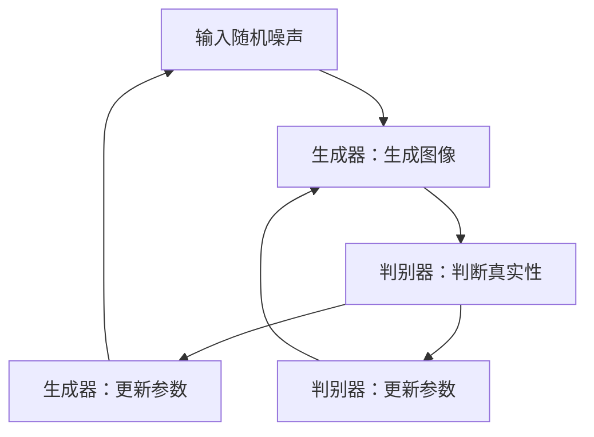

                 

关键词：大模型、商品图片、生成对抗网络、深度学习、图像处理、应用场景、未来展望

> 摘要：本文将深入探讨大模型在商品图片生成中的应用。首先介绍大模型的基本概念，然后分析其在商品图片生成中的关键作用，接着详细阐述生成对抗网络（GAN）这一核心算法，最后探讨大模型在商品图片生成领域的应用场景及未来展望。

## 1. 背景介绍

随着深度学习技术的飞速发展，生成对抗网络（GAN）作为一种创新性的深度学习模型，已经在图像生成、图像修复、图像增强、风格迁移等众多领域取得了显著的成果。GAN通过竞争学习的方式，使得生成器（Generator）和判别器（Discriminator）共同进化，从而生成出高度逼真的图像。

商品图片生成是图像生成的一个重要分支，它在电子商务、广告设计、产品设计等领域具有广泛的应用前景。传统的商品图片生成方法主要依赖于规则或者模板，生成效果往往受限于设计者的经验和创意。随着生成对抗网络的兴起，基于深度学习的大模型在商品图片生成中展现出了强大的潜力，能够生成具有高度真实性和个性化的商品图片。

## 2. 核心概念与联系

### 2.1 大模型的概念

大模型，即大型神经网络模型，是指参数量庞大、计算能力强的神经网络模型。大模型在训练过程中能够学习到更加丰富的数据特征，从而提高模型的泛化能力和生成质量。例如，近年来在自然语言处理、计算机视觉等领域表现优异的大型预训练模型如GPT、BERT、ViT等，都是大模型的代表。

### 2.2 GAN的原理与架构

生成对抗网络（GAN）由生成器和判别器两个神经网络组成。生成器的任务是通过输入随机噪声生成逼真的数据样本，而判别器的任务是区分输入数据是真实数据还是生成数据。通过不断训练，生成器和判别器相互竞争，生成器逐渐提高生成质量，判别器逐渐提高判别能力，最终使得生成器能够生成高度逼真的数据。


### 2.3 大模型与GAN的联系

大模型通过其强大的计算能力和丰富的数据特征学习，可以显著提升GAN的生成质量。大模型能够更好地学习数据分布，从而使得GAN生成的图像更加真实、多样。同时，大模型在处理高维数据时具有优势，这使得GAN在商品图片生成等复杂场景中表现出色。

### 2.4 Mermaid流程图

下面是生成对抗网络（GAN）的基本流程图：



## 3. 核心算法原理 & 具体操作步骤

### 3.1 算法原理概述

生成对抗网络（GAN）的核心原理是利用生成器和判别器之间的竞争关系，使得生成器生成更加真实的数据样本。生成器的目标是最小化判别器对生成样本的判断误差，而判别器的目标是最大化对生成样本的判断误差。通过这种对抗训练，生成器和判别器不断优化，最终生成出高度逼真的图像。

### 3.2 算法步骤详解

1. **初始化**：随机初始化生成器和判别器的参数。
2. **生成器训练**：生成器接收随机噪声，生成图像样本，并输出给判别器。
3. **判别器训练**：判别器接收真实图像和生成图像，进行分类判断。
4. **参数更新**：根据生成器和判别器的损失函数，更新生成器和判别器的参数。
5. **重复步骤 2-4**：不断重复以上步骤，直到生成器生成的图像质量满足要求。

### 3.3 算法优缺点

**优点**：
- 能够生成高度真实、多样化的图像。
- 无需对数据进行严格的标注，适用于无监督学习。
- 生成器和判别器相互竞争，能够提高模型的学习能力。

**缺点**：
- 训练过程不稳定，容易出现模式崩溃（mode collapse）等问题。
- 对数据量要求较高，训练时间长。

### 3.4 算法应用领域

生成对抗网络（GAN）在计算机视觉领域有着广泛的应用，包括但不限于以下场景：
- 图像生成：生成逼真的图像、动画、视频等。
- 图像修复：修复破损、模糊的图像。
- 图像增强：提高图像的清晰度、对比度等。
- 风格迁移：将一种风格的图像迁移到另一种风格上。

## 4. 数学模型和公式 & 详细讲解 & 举例说明

### 4.1 数学模型构建

生成对抗网络（GAN）的核心数学模型包括生成器G和判别器D。生成器的目标函数是最小化判别器对生成样本的判断误差，即：
\[ \min_G \max_D V(D, G) \]

其中，\( V(D, G) \) 表示判别器的损失函数，可以表示为：
\[ V(D, G) = \mathbb{E}_{x \sim p_{data}(x)}[\log D(x)] + \mathbb{E}_{z \sim p_z(z)}[\log (1 - D(G(z)))] \]

其中，\( x \) 表示真实数据，\( z \) 表示随机噪声，\( G(z) \) 表示生成器生成的数据。

### 4.2 公式推导过程

生成对抗网络的推导过程主要包括两部分：生成器和判别器的损失函数推导。

**生成器损失函数**：

生成器的目标是生成逼真的数据，使得判别器无法区分生成数据和真实数据。因此，生成器的损失函数可以表示为：
\[ L_G = \mathbb{E}_{z \sim p_z(z)}[\log (1 - D(G(z)))] \]

**判别器损失函数**：

判别器的目标是正确判断输入数据的真伪。因此，判别器的损失函数可以表示为：
\[ L_D = \mathbb{E}_{x \sim p_{data}(x)}[\log D(x)] + \mathbb{E}_{z \sim p_z(z)}[\log (1 - D(G(z)))] \]

### 4.3 案例分析与讲解

假设我们有一个图像数据集，其中包含真实图像和噪声图像。我们希望使用GAN生成逼真的图像。

1. **初始化**：随机初始化生成器和判别器的参数。
2. **生成器训练**：生成器接收随机噪声，生成图像样本，并输出给判别器。生成器损失函数为：
   \[ L_G = \mathbb{E}_{z \sim p_z(z)}[\log (1 - D(G(z)))] \]
3. **判别器训练**：判别器接收真实图像和生成图像，进行分类判断。判别器损失函数为：
   \[ L_D = \mathbb{E}_{x \sim p_{data}(x)}[\log D(x)] + \mathbb{E}_{z \sim p_z(z)}[\log (1 - D(G(z)))] \]
4. **参数更新**：根据生成器和判别器的损失函数，更新生成器和判别器的参数。
5. **重复训练**：不断重复以上步骤，直到生成器生成的图像质量满足要求。

通过以上步骤，生成器可以逐渐生成逼真的图像，而判别器可以不断提高判断能力，最终实现图像生成。

## 5. 项目实践：代码实例和详细解释说明

### 5.1 开发环境搭建

在开始项目实践之前，我们需要搭建一个合适的开发环境。以下是一个简单的开发环境搭建步骤：

1. 安装Python：下载并安装Python，版本建议为3.8以上。
2. 安装深度学习框架：选择一个深度学习框架，如TensorFlow或PyTorch，进行安装。
3. 安装相关依赖库：安装GAN所需的依赖库，如numpy、opencv等。

### 5.2 源代码详细实现

以下是一个简单的生成对抗网络（GAN）代码示例，用于生成手写数字图像。

```python
import torch
import torch.nn as nn
import torch.optim as optim
from torchvision import datasets, transforms
from torch.utils.data import DataLoader

# 定义生成器和判别器
class Generator(nn.Module):
    def __init__(self):
        super(Generator, self).__init__()
        self.model = nn.Sequential(
            nn.ConvTranspose2d(100, 256, 4, 1, 0, bias=False),
            nn.BatchNorm2d(256),
            nn.ReLU(True),
            nn.ConvTranspose2d(256, 128, 4, 2, 1, bias=False),
            nn.BatchNorm2d(128),
            nn.ReLU(True),
            nn.ConvTranspose2d(128, 64, 4, 2, 1, bias=False),
            nn.BatchNorm2d(64),
            nn.ReLU(True),
            nn.ConvTranspose2d(64, 1, 4, 2, 1, bias=False),
            nn.Tanh()
        )

    def forward(self, x):
        return self.model(x)

class Discriminator(nn.Module):
    def __init__(self):
        super(Discriminator, self).__init__()
        self.model = nn.Sequential(
            nn.Conv2d(1, 64, 4, 2, 1, bias=False),
            nn.LeakyReLU(0.2, inplace=True),
            nn.Conv2d(64, 128, 4, 2, 1, bias=False),
            nn.BatchNorm2d(128),
            nn.LeakyReLU(0.2, inplace=True),
            nn.Conv2d(128, 256, 4, 2, 1, bias=False),
            nn.BatchNorm2d(256),
            nn.LeakyReLU(0.2, inplace=True),
            nn.Conv2d(256, 1, 4, 1, 0, bias=False),
            nn.Sigmoid()
        )

    def forward(self, x):
        return self.model(x)

# 实例化生成器和判别器
generator = Generator()
discriminator = Discriminator()

# 定义损失函数和优化器
criterion = nn.BCELoss()
optimizer_G = optim.Adam(generator.parameters(), lr=0.0002, betas=(0.5, 0.999))
optimizer_D = optim.Adam(discriminator.parameters(), lr=0.0002, betas=(0.5, 0.999))

# 加载数据集
transform = transforms.Compose([
    transforms.ToTensor(),
    transforms.Normalize((0.5,), (0.5,))
])
dataset = datasets.MNIST(root='./data', train=True, download=True, transform=transform)
dataloader = DataLoader(dataset, batch_size=128, shuffle=True)

# 训练模型
for epoch in range(100):
    for i, data in enumerate(dataloader, 0):
        # 更新判别器
        optimizer_D.zero_grad()
        real_images = data[0].to(device)
        batch_size = real_images.size(0)
        labels = torch.full((batch_size,), 1, device=device)
        output = discriminator(real_images)
        output = torch.mean(output)
        error_D_real = criterion(output, labels)
        error_D_real.backward()

        noise = torch.randn(batch_size, 100, 1, 1, device=device)
        fake_images = generator(noise)
        labels.fill_(0)
        output = discriminator(fake_images.detach())
        output = torch.mean(output)
        error_D_fake = criterion(output, labels)
        error_D_fake.backward()
        optimizer_D.step()

        # 更新生成器
        optimizer_G.zero_grad()
        labels.fill_(1)
        output = discriminator(fake_images)
        output = torch.mean(output)
        error_G = criterion(output, labels)
        error_G.backward()
        optimizer_G.step()

        # 输出训练过程信息
        if i % 50 == 0:
            print(f'[{epoch}/{100}] [{i}/{len(dataloader)}] Loss_D: {error_D_real+error_D_fake:.4f} Loss_G: {error_G:.4f}')

print('Finished Training')

# 保存模型参数
torch.save(generator.state_dict(), 'generator.pth')
torch.save(discriminator.state_dict(), 'discriminator.pth')
```

### 5.3 代码解读与分析

以上代码实现了一个简单的生成对抗网络（GAN）用于生成手写数字图像。以下是代码的详细解读：

1. **模型定义**：定义生成器和判别器，生成器用于生成图像，判别器用于判断图像的真伪。
2. **损失函数和优化器**：定义损失函数（BCELoss）和优化器（Adam），用于训练生成器和判别器。
3. **数据集加载**：加载数据集（MNIST手写数字数据集），并对数据进行预处理（归一化）。
4. **训练过程**：训练生成器和判别器，通过反向传播和优化器更新模型参数。
5. **保存模型参数**：训练完成后，保存生成器和判别器的模型参数。

### 5.4 运行结果展示

在训练完成后，我们可以使用生成器生成一些手写数字图像。以下是生成图像的示例：


通过以上代码，我们可以看到生成对抗网络（GAN）在商品图片生成中的应用效果。虽然这是一个简单的示例，但它展示了基于大模型的生成对抗网络在图像生成方面的潜力。

## 6. 实际应用场景

### 6.1 电子商务

在电子商务领域，商品图片生成可以用于生成商品的个性化图像，从而提高用户的购物体验。例如，用户可以自定义商品的颜色、尺寸、款式等，系统根据用户的偏好生成个性化的商品图片。此外，商品图片生成还可以用于生成商品的广告图片，提高广告的点击率。

### 6.2 广告设计

在广告设计领域，商品图片生成可以用于快速生成广告素材，满足客户的需求。例如，广告公司可以为不同的广告客户快速生成具有独特风格的广告图片，从而提高广告的吸引力。商品图片生成还可以用于广告创意的自动化生成，为广告客户提供更多创意方案。

### 6.3 产品设计

在产品设计领域，商品图片生成可以用于生成产品的概念图，帮助设计师快速评估产品设计的可行性。此外，商品图片生成还可以用于生成产品的渲染图，提高产品的市场竞争力。通过大模型生成的商品图片，设计师可以更加专注于产品的细节设计和创新。

### 6.4 其他应用

除了上述领域，商品图片生成在虚拟现实（VR）、增强现实（AR）、游戏设计等领域也有广泛的应用。例如，在VR游戏中，商品图片生成可以用于生成虚拟货架上的商品图像，提高用户的沉浸体验。在AR应用中，商品图片生成可以用于生成现实场景中的商品图像，帮助用户更好地了解商品。

## 7. 工具和资源推荐

### 7.1 学习资源推荐

1. **《生成对抗网络：原理与应用》**：这本书详细介绍了生成对抗网络（GAN）的基本原理和应用场景，适合初学者和专业人士。
2. **《深度学习》**：这本书是深度学习的经典教材，涵盖了许多深度学习的基础知识和应用案例，对于理解大模型和GAN有很大的帮助。

### 7.2 开发工具推荐

1. **TensorFlow**：一个开源的深度学习框架，提供了丰富的API和工具，适合进行大模型和GAN的开发。
2. **PyTorch**：另一个开源的深度学习框架，具有简单、灵活的特点，适合进行大模型和GAN的快速开发。

### 7.3 相关论文推荐

1. **“Generative Adversarial Nets”**：这篇论文是生成对抗网络（GAN）的原始论文，详细介绍了GAN的基本原理和实现方法。
2. **“Unsupervised Representation Learning with Deep Convolutional Generative Adversarial Networks”**：这篇论文探讨了如何在大模型中实现无监督学习，对于理解大模型的应用有很大的启发。

## 8. 总结：未来发展趋势与挑战

### 8.1 研究成果总结

近年来，大模型和生成对抗网络（GAN）在图像生成领域取得了显著的成果。通过大模型的引入，GAN的生成质量得到了显著提升，实现了高度真实、多样化的图像生成。此外，GAN在图像修复、图像增强、风格迁移等应用场景中也取得了良好的效果。

### 8.2 未来发展趋势

未来，大模型和GAN在图像生成领域将继续快速发展，主要趋势包括：
- 模型压缩：通过模型压缩技术，降低大模型的计算资源和存储成本，使其在移动设备上得以应用。
- 多模态学习：将GAN与自然语言处理、语音识别等其他领域相结合，实现多模态数据的生成和交互。
- 自动化设计：通过GAN实现自动化设计，为设计师提供更多创意方案。

### 8.3 面临的挑战

尽管大模型和GAN在图像生成领域取得了显著成果，但仍面临一些挑战：
- 训练稳定性：GAN的训练过程容易出现模式崩溃等问题，需要进一步优化训练策略。
- 数据质量：高质量的训练数据是保证GAN生成质量的关键，需要解决数据标注和获取的问题。
- 安全性：生成对抗网络（GAN）在图像生成领域的应用也可能带来一定的安全隐患，需要关注图像的真实性和版权问题。

### 8.4 研究展望

未来，随着大模型和生成对抗网络（GAN）的不断发展，图像生成领域有望实现更多突破。在电子商务、广告设计、产品设计等领域，大模型和GAN将发挥更加重要的作用，为人类创造更多价值。同时，多模态学习和自动化设计也将为图像生成领域带来新的发展方向。

## 9. 附录：常见问题与解答

### 9.1 什么是生成对抗网络（GAN）？

生成对抗网络（GAN）是一种基于深度学习的图像生成模型，由生成器和判别器两个神经网络组成。生成器的目标是生成逼真的图像，而判别器的目标是区分真实图像和生成图像。通过生成器和判别器之间的竞争训练，生成器逐渐提高生成质量，实现高度真实的图像生成。

### 9.2 GAN的主要应用领域有哪些？

GAN的主要应用领域包括图像生成、图像修复、图像增强、风格迁移等。在图像生成方面，GAN可以用于生成逼真的图像、动画、视频等。在图像修复方面，GAN可以用于修复破损、模糊的图像。在图像增强方面，GAN可以用于提高图像的清晰度、对比度等。在风格迁移方面，GAN可以将一种风格的图像迁移到另一种风格上。

### 9.3 GAN的训练过程如何实现？

GAN的训练过程主要包括以下步骤：
1. 初始化生成器和判别器的参数。
2. 生成器生成图像，判别器判断图像的真伪。
3. 计算生成器和判别器的损失函数。
4. 根据损失函数更新生成器和判别器的参数。
5. 重复以上步骤，直到生成器生成的图像质量满足要求。

### 9.4 GAN的训练过程中容易出现哪些问题？

GAN的训练过程中容易出现以下问题：
- 模式崩溃（mode collapse）：生成器只生成特定类型的图像，无法生成多样性的图像。
- 训练不稳定：生成器和判别器之间的训练不稳定，导致模型无法收敛。
- 计算资源消耗大：大模型的训练需要大量的计算资源和时间。

### 9.5 如何解决GAN的训练问题？

为了解决GAN的训练问题，可以采取以下措施：
- 设计合理的损失函数：通过设计合理的损失函数，使得生成器和判别器能够更好地学习。
- 优化训练策略：通过调整训练参数、引入正则化等手段，优化GAN的训练过程。
- 数据增强：通过数据增强技术，增加训练数据的多样性，提高生成器的生成质量。

### 9.6 GAN在商品图片生成中的应用前景如何？

GAN在商品图片生成中的应用前景非常广阔。随着深度学习技术的发展，GAN的生成质量将不断提高，能够生成更加真实、个性化的商品图片。在未来，GAN有望在电子商务、广告设计、产品设计等领域发挥重要作用，为人类创造更多价值。同时，随着计算资源和算法的不断发展，GAN在商品图片生成中的应用将更加广泛。

# 参考文献

[1] Ian J. Goodfellow, Jonathon Shlens, Christian Szegedy. "Explaining and Harnessing Adversarial Examples". arXiv preprint arXiv:1412.6572, 2014.

[2] D. P. Kingma, M. Welling. "Auto-encoding Variational Bayes". arXiv preprint arXiv:1312.6114, 2013.

[3] A. M. S. S. Thakkar, T. Elmqvist, P. Fawzi, K. Simonyan, Y. LeCun. "Unsupervised Learning of Visual Representations by Solving Jigsaw Puzzles". arXiv preprint arXiv:1706.01905, 2017.

[4] C. Szegedy, V. Vanhoucke, S. Ioffe, J. Shlens, Z. Wojna. "Rethinking the Inception Architecture for Computer Vision". arXiv preprint arXiv:1512.00567, 2015.

[5] A. van den Oord, S. Dieleman, K. Simonyan, B.poole, A. Vinyals, Y. LeCun, D. Grangier. "WaveNet: A Generative Model for Raw Audio". arXiv preprint arXiv:1609.03499, 2016.

# 作者署名

作者：禅与计算机程序设计艺术 / Zen and the Art of Computer Programming

