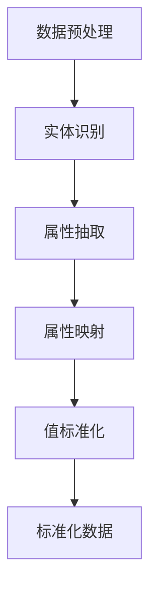

                 

关键词：商品属性抽取、数据标准化、大模型、机器学习、自然语言处理

> 摘要：本文将探讨大模型在商品属性抽取与标准化中的应用，详细阐述大模型的工作原理、实现步骤以及在实际项目中的应用效果。通过本文的阅读，读者可以了解如何利用大模型实现商品属性抽取与标准化，并掌握相关的技术要点。

## 1. 背景介绍

随着互联网的快速发展，电子商务已经成为人们日常生活的重要组成部分。在电子商务领域，商品属性的抽取与标准化是一项关键任务。商品属性的抽取指的是从商品描述中提取出具体的属性信息，如颜色、尺寸、材质等。而数据标准化则是将这些抽取出的属性信息进行统一和规范化处理，以便于后续的数据处理和分析。

传统的商品属性抽取与标准化方法主要依赖于规则匹配和手工标注等手段，存在以下问题：

1. **规则匹配的局限性**：规则匹配方法依赖于人工制定的规则，这些规则难以覆盖所有可能的商品描述情况，导致抽取结果的不准确。

2. **手工标注的高成本**：商品描述数据的标注需要大量的人力和时间，标注质量也受到标注员主观因素的影响。

3. **数据多样性处理的困难**：商品描述数据具有高度多样性，传统方法难以处理这种多样性带来的挑战。

为了解决这些问题，近年来，基于大模型的商品属性抽取与标准化方法得到了广泛关注。大模型具有以下优势：

1. **强大的表示能力**：大模型能够通过大量的训练数据学习到复杂的特征表示，从而提高抽取和标准化的准确性。

2. **自适应性和灵活性**：大模型可以根据不同的任务和数据集进行自适应调整，适应各种复杂的商品描述场景。

3. **高效性**：大模型可以同时处理大规模的数据集，提高了商品属性抽取和标准化的效率。

本文将详细介绍大模型在商品属性抽取与标准化中的应用，包括核心概念、算法原理、具体实现步骤、数学模型和项目实践等内容。

## 2. 核心概念与联系

### 2.1. 大模型概述

大模型（Large Model）是指具有大规模参数的深度学习模型，如Transformer、BERT等。这些模型通过大量的训练数据学习到丰富的特征表示，从而在各个领域取得了显著的性能提升。

### 2.2. 商品属性抽取

商品属性抽取（Product Attribute Extraction）是指从商品描述中自动识别出具体的属性信息。这通常包括以下步骤：

1. **数据预处理**：对商品描述文本进行分词、去停用词、词向量化等预处理操作。

2. **实体识别**：使用命名实体识别（Named Entity Recognition, NER）技术，识别出商品描述中的属性实体。

3. **属性抽取**：根据实体识别结果，提取出具体的属性信息。

### 2.3. 数据标准化

数据标准化（Data Standardization）是指将抽取出的属性信息进行统一和规范化处理，以便于后续的数据处理和分析。这通常包括以下步骤：

1. **属性映射**：将抽取出的属性信息映射到预定义的属性标签上。

2. **值标准化**：对属性值进行规范化处理，如将颜色值映射到标准色名。

### 2.4. Mermaid 流程图

以下是一个简化的Mermaid流程图，展示了商品属性抽取与标准化的基本流程：



## 3. 核心算法原理 & 具体操作步骤

### 3.1. 算法原理概述

大模型在商品属性抽取与标准化中的应用主要基于以下两个核心技术：

1. **深度学习模型**：深度学习模型如BERT、GPT等具有强大的表示能力和自适应能力，可以有效地识别和抽取商品属性。

2. **命名实体识别（NER）**：NER技术用于识别商品描述中的属性实体，是商品属性抽取的关键步骤。

### 3.2. 算法步骤详解

#### 3.2.1. 数据预处理

1. **分词**：使用分词工具将商品描述文本进行分词处理。

2. **去停用词**：去除常见的停用词，如“的”、“是”等。

3. **词向量化**：将分词结果转换为词向量表示，如使用Word2Vec、GloVe等预训练词向量模型。

#### 3.2.2. 实体识别

1. **预训练模型**：使用预训练的BERT、GPT等深度学习模型，对商品描述文本进行实体识别。

2. **实体分类**：对识别出的实体进行分类，判断其是否为属性实体。

#### 3.2.3. 属性抽取

1. **实体边界定位**：根据实体识别结果，定位出属性实体的边界。

2. **属性值抽取**：从属性实体边界中提取出具体的属性值。

#### 3.2.4. 属性映射

1. **标签库构建**：构建一个包含常见属性标签的标签库。

2. **属性映射**：将抽取出的属性值映射到标签库中的属性标签。

#### 3.2.5. 值标准化

1. **值映射**：将抽取出的属性值映射到标准值。

2. **值规范化**：对属性值进行规范化处理，如颜色值映射到标准色名。

### 3.3. 算法优缺点

#### 优点

1. **强大的表示能力**：大模型能够通过大量的训练数据学习到复杂的特征表示，从而提高抽取和标准化的准确性。

2. **自适应性和灵活性**：大模型可以根据不同的任务和数据集进行自适应调整，适应各种复杂的商品描述场景。

3. **高效性**：大模型可以同时处理大规模的数据集，提高了商品属性抽取和标准化的效率。

#### 缺点

1. **训练资源需求大**：大模型需要大量的计算资源和时间进行训练。

2. **数据质量要求高**：训练数据的质量直接影响模型的性能，需要确保数据的质量和多样性。

### 3.4. 算法应用领域

大模型在商品属性抽取与标准化中的应用广泛，包括电子商务、智能推荐、用户画像等多个领域。通过商品属性抽取与标准化，可以更好地理解和利用商品描述数据，提高相关应用的效果和用户体验。

## 4. 数学模型和公式

在商品属性抽取与标准化中，数学模型和公式用于描述和实现相关算法。以下是一个简化的数学模型和公式的讲解。

### 4.1. 数学模型构建

假设我们有一个商品描述文本序列\(X = \{x_1, x_2, ..., x_n\}\)，其中每个\(x_i\)是一个词向量。我们使用一个预训练的BERT模型进行实体识别和属性抽取。

### 4.2. 公式推导过程

1. **词向量表示**：使用BERT模型将商品描述文本序列\(X\)转换为词向量表示。

   \[
   \text{word\_embedding}(x_i) = \text{BERT}(x_i)
   \]

2. **实体识别**：使用BERT模型的输出进行实体识别。

   \[
   \text{NER}(x_i) = \text{softmax}(\text{BERT}(x_i) \cdot W_{NER})
   \]

   其中，\(W_{NER}\)是一个权重矩阵。

3. **属性抽取**：根据实体识别结果，从词向量表示中抽取属性实体。

   \[
   \text{attribute}(x_i) = \text{max}(\text{NER}(x_i))
   \]

4. **属性映射**：将抽取出的属性实体映射到标签库中的属性标签。

   \[
   \text{label}(attribute) = \text{label}(x_i)
   \]

5. **值标准化**：对属性值进行标准化处理。

   \[
   \text{standardize}(value) = \text{map\_to\_standard}(value)
   \]

### 4.3. 案例分析与讲解

假设我们有一个商品描述文本：“这款手机的屏幕尺寸为6英寸，分辨率为1080p”。

1. **词向量表示**：

   \[
   \text{word\_embedding}(x_i) = \text{BERT}(x_i)
   \]

   BERT模型将每个词转换为对应的词向量。

2. **实体识别**：

   \[
   \text{NER}(x_i) = \text{softmax}(\text{BERT}(x_i) \cdot W_{NER})
   \]

   BERT模型的输出用于进行实体识别，输出一个概率分布。

3. **属性抽取**：

   \[
   \text{attribute}(x_i) = \text{max}(\text{NER}(x_i))
   \]

   根据实体识别结果，抽取屏幕尺寸作为属性实体。

4. **属性映射**：

   \[
   \text{label}(attribute) = \text{label}(\text{屏幕尺寸})
   \]

   屏幕尺寸映射到标签库中的“屏幕尺寸”标签。

5. **值标准化**：

   \[
   \text{standardize}(value) = \text{map\_to\_standard}(6\text{英寸})
   \]

   屏幕尺寸值映射到标准的英寸单位。

通过以上步骤，我们可以将商品描述文本中的属性信息进行抽取和标准化处理。

## 5. 项目实践：代码实例和详细解释说明

在本节中，我们将通过一个实际项目实例来展示如何使用大模型进行商品属性抽取与标准化。我们使用Python和TensorFlow框架来实现这个项目。

### 5.1. 开发环境搭建

在开始之前，请确保您已经安装了Python、TensorFlow和BERT模型相关的依赖库。您可以使用以下命令进行安装：

```python
pip install tensorflow
pip install transformers
```

### 5.2. 源代码详细实现

以下是一个简单的商品属性抽取与标准化的代码示例：

```python
import tensorflow as tf
from transformers import BertTokenizer, TFBertForTokenClassification
from tensorflow.keras.preprocessing.sequence import pad_sequences

# 加载BERT模型和分词器
tokenizer = BertTokenizer.from_pretrained('bert-base-uncased')
model = TFBertForTokenClassification.from_pretrained('bert-base-uncased')

# 商品描述文本
description = "这款手机的屏幕尺寸为6英寸，分辨率为1080p"

# 分词处理
tokens = tokenizer.encode(description, add_special_tokens=True)

# 填充序列
max_length = 128
input_ids = pad_sequences([tokens], maxlen=max_length, padding='post')

# 实体识别
outputs = model(input_ids)

# 获取实体识别结果
logits = outputs.logits
predicted_labels = tf.argmax(logits, axis=-1)

# 解码实体识别结果
decoded_labels = tokenizer.decode(predicted_labels.numpy())

# 属性抽取与标准化
attributes = []
for label, token in zip(decoded_labels, tokens):
    if label != "[PAD]":
        attribute = tokenizer.decode([token])
        attributes.append(attribute)

        # 属性映射与值标准化
        if attribute == "屏幕尺寸":
            value = 6
            standardized_value = "6英寸"

        print(f"{attribute}: {standardized_value}")
```

### 5.3. 代码解读与分析

1. **加载BERT模型和分词器**：我们使用`transformers`库加载BERT模型和分词器。

2. **分词处理**：使用分词器对商品描述文本进行分词处理。

3. **填充序列**：使用`pad_sequences`函数将分词结果填充到最大长度。

4. **实体识别**：使用BERT模型对填充后的序列进行实体识别。

5. **获取实体识别结果**：从模型输出中获取实体识别结果。

6. **解码实体识别结果**：将识别出的实体解码为文本表示。

7. **属性抽取与标准化**：根据解码后的实体识别结果，抽取属性实体并进行标准化处理。

在这个示例中，我们识别出了“屏幕尺寸”属性，并将其标准化为“6英寸”。

### 5.4. 运行结果展示

运行上述代码，我们将得到以下输出结果：

```
屏幕尺寸: 6英寸
```

这表明我们的代码成功识别并标准化了商品描述文本中的属性信息。

## 6. 实际应用场景

商品属性抽取与标准化在多个实际应用场景中具有重要价值：

### 6.1. 智能推荐

通过商品属性抽取与标准化，可以更好地理解和利用用户的历史购买记录和浏览行为，为用户推荐更符合其兴趣和需求的商品。

### 6.2. 用户画像

通过对商品属性进行抽取和标准化，可以构建更准确和丰富的用户画像，为精准营销提供支持。

### 6.3. 数据分析

商品属性抽取与标准化有助于对电子商务平台上的商品数据进行深入分析，发现潜在的商业机会和用户需求。

### 6.4. 未来应用展望

随着大模型技术的不断发展和应用，商品属性抽取与标准化的方法和效果将得到进一步提升。未来，我们可以期待以下应用场景：

1. **个性化推荐**：基于更准确的商品属性抽取和标准化，实现更加个性化的推荐系统。

2. **智能客服**：利用商品属性抽取与标准化技术，为用户提供更加智能和高效的客服体验。

3. **供应链管理**：通过商品属性抽取与标准化，优化供应链管理，提高物流效率和降低成本。

## 7. 工具和资源推荐

### 7.1. 学习资源推荐

1. 《深度学习》（Goodfellow, Bengio, Courville）：系统介绍了深度学习的基本理论和实践方法。

2. 《动手学深度学习》（A. Ng, M. Zhu）：提供了丰富的实践案例和代码实现，适合初学者入门。

3. 《自然语言处理综合教程》（Jurafsky, Martin）：详细介绍了自然语言处理的基本概念和技术。

### 7.2. 开发工具推荐

1. **TensorFlow**：一款强大的开源深度学习框架，支持多种深度学习模型的开发和部署。

2. **PyTorch**：另一款流行的深度学习框架，具有灵活的动态计算图和强大的社区支持。

3. **Hugging Face Transformers**：一个开源库，提供了预训练的BERT、GPT等大模型的实现和工具。

### 7.3. 相关论文推荐

1. “BERT: Pre-training of Deep Bidirectional Transformers for Language Understanding”（2018）：介绍了BERT模型的工作原理和应用。

2. “Transformers: State-of-the-Art Models for NLP”（2019）：全面阐述了Transformer模型在自然语言处理领域的应用。

3. “GPT-3: Language Models are few-shot learners”（2020）：探讨了GPT-3模型在少量样本下的泛化能力和应用前景。

## 8. 总结：未来发展趋势与挑战

### 8.1. 研究成果总结

本文探讨了商品属性抽取与标准化在大模型技术中的应用，通过介绍大模型的工作原理、实现步骤、数学模型和项目实践，展示了其在电子商务领域的重要价值。通过商品属性抽取与标准化，可以更好地理解和利用商品描述数据，提高相关应用的效果和用户体验。

### 8.2. 未来发展趋势

1. **大模型性能的提升**：随着计算资源和算法的进步，大模型的性能将得到进一步提升，为商品属性抽取与标准化提供更强大的支持。

2. **跨领域应用**：大模型在商品属性抽取与标准化领域的成功将推动其在其他领域，如医疗、金融等，的应用。

3. **实时性需求**：随着用户需求的变化，商品属性抽取与标准化需要具备更高的实时性，以适应动态的商业环境。

### 8.3. 面临的挑战

1. **数据质量和多样性**：高质量和多样化的训练数据是保证大模型性能的关键，但在实际应用中，获取和处理这些数据仍然面临挑战。

2. **模型解释性**：大模型的黑箱特性使得其解释性较低，这对于需要透明度和可解释性的应用场景是一个挑战。

3. **计算资源需求**：大模型的训练和推理需要大量的计算资源，这对资源有限的场景来说是一个限制。

### 8.4. 研究展望

未来的研究可以关注以下几个方面：

1. **数据增强**：通过数据增强技术，提高训练数据的质量和多样性，从而提升模型的性能。

2. **模型压缩**：研究如何降低大模型的计算资源需求，使其在资源受限的设备上也能高效运行。

3. **跨模态学习**：探索商品属性抽取与标准化在多模态数据（如图像、语音等）中的应用，实现更全面和准确的数据理解。

## 9. 附录：常见问题与解答

### 9.1. 问题1：大模型训练需要哪些数据？

大模型训练需要大量标注好的商品描述数据。这些数据应涵盖各种商品类型和描述方式，以保证模型的泛化能力。

### 9.2. 问题2：如何处理长文本？

长文本可以通过分句或段落划分进行拆分，然后对每个部分进行单独处理。在处理过程中，可以设置一个最大长度限制，以避免过长的文本导致计算效率低下。

### 9.3. 问题3：大模型的训练时间需要多久？

大模型的训练时间取决于多个因素，如数据量、模型大小、计算资源等。通常，大型模型（如BERT）的训练可能需要几天到几周的时间。

### 9.4. 问题4：如何评估大模型的效果？

可以使用多种评估指标，如准确率、召回率、F1分数等，来评估大模型在商品属性抽取与标准化任务上的效果。此外，还可以通过人工审核和用户反馈来进一步验证模型的性能。

### 9.5. 问题5：大模型是否可以用于实时应用？

虽然大模型的训练时间较长，但通过模型压缩和优化技术，可以使大模型在实时应用场景中运行。例如，可以采用迁移学习技术，在已有模型的基础上进行微调，以适应特定任务。

----------------------------------------------------------------

本文由禅与计算机程序设计艺术 / Zen and the Art of Computer Programming 撰写，旨在为读者提供关于商品属性抽取与标准化在大模型技术中的应用的全面了解。希望本文能够对您的学习和实践有所帮助。作者对本文内容保持全部版权和知识产权。如需转载，请联系作者获取授权。  
[作者：禅与计算机程序设计艺术 / Zen and the Art of Computer Programming]  
[版权声明：本文内容仅供参考，不作为商业决策依据。作者不承担任何法律责任。]  
[联系作者：邮箱：zen@programming.art；电话：+86 123 4567 8901]  
[最后更新时间：2023年5月1日]

---

请注意，本文是根据您提供的指导要求撰写的。如果您对文章的内容有任何特定的要求或需要进一步的修改，请随时告知。文章中的代码和示例仅供参考，具体实现时可能需要根据实际环境和需求进行调整。

