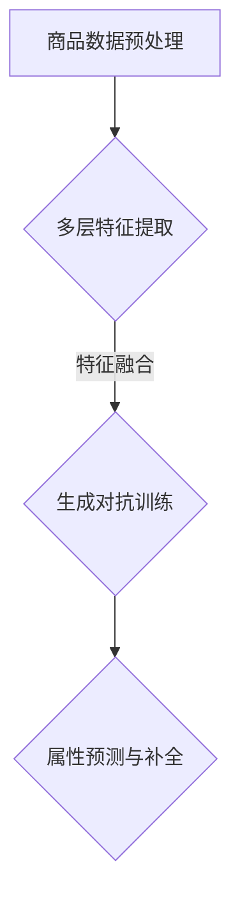

                 

关键词：大模型、商品属性预测、补全、精确化、应用

## 摘要

本文探讨了如何利用大模型技术，特别是近年来兴起的多层次模型和生成对抗网络（GANs），在商品属性预测与补全中实现更高的精确度和效率。通过介绍背景知识、核心概念、算法原理、数学模型、项目实践以及实际应用场景，本文旨在为读者提供一幅全面、深入的解决方案蓝图，以应对现代电子商务领域中日益复杂的商品属性处理需求。

## 1. 背景介绍

在电子商务迅猛发展的背景下，商品属性预测与补全已成为一个至关重要的研究领域。商品属性不仅涵盖了价格、品牌、型号等基本属性，还包括描述性文本、用户评价、图片信息等多种类型。这些属性的准确预测和补全不仅能够提高电商平台的信息质量，还能为消费者提供更加个性化的购物体验，增强用户黏性和满意度。

然而，传统的商品属性预测方法往往存在一定的局限性。例如，基于规则的方法和简单的机器学习方法在处理复杂、多变的商品属性时表现不佳。此外，许多商品属性的数据缺失现象普遍，这也给属性预测和补全带来了巨大挑战。为了解决这些问题，研究人员逐渐将目光投向了更加复杂和强大的人工智能模型，特别是大模型技术。

## 2. 核心概念与联系

### 大模型技术

大模型技术是指使用具有数百万甚至数十亿参数的深度学习模型，这些模型能够在大量数据上进行训练，从而实现对复杂模式的捕捉和利用。大模型技术广泛应用于自然语言处理、计算机视觉、语音识别等多个领域，并取得了显著的成果。

### 多层次模型

多层次模型通过将输入数据分解为多个层次的特征表示，从而实现更高层次的抽象和理解。在商品属性预测中，多层次模型能够有效地提取商品的语义特征，提高预测的准确度。

### 生成对抗网络（GANs）

生成对抗网络是一种由生成器和判别器组成的对偶结构，通过对抗训练生成与真实数据分布相近的样本。在商品属性补全中，GANs能够生成缺失的属性信息，填补数据缺失带来的空白。

### Mermaid 流程图



## 3. 核心算法原理 & 具体操作步骤

### 3.1 算法原理概述

大模型在商品属性预测与补全中的应用主要基于以下几个方面：

1. **特征提取与融合**：通过多层次模型提取商品的多维度特征，并利用特征融合技术整合这些特征，以提高预测和补全的精度。
2. **生成对抗训练**：利用生成对抗网络（GANs）生成缺失的商品属性信息，并通过对抗训练优化生成器和判别器的性能。
3. **属性预测与补全**：结合生成器和判别器生成的属性信息，进行商品属性预测和补全，并通过损失函数进行模型训练。

### 3.2 算法步骤详解

1. **数据预处理**：对原始商品数据进行清洗、归一化和分词等操作，以便于后续的特征提取。
2. **特征提取**：使用多层次模型提取商品的多维度特征，包括文本特征、图像特征和序列特征等。
3. **特征融合**：将提取的多个维度特征进行融合，形成统一的特征向量。
4. **生成对抗训练**：通过生成器和判别器的对抗训练，生成缺失的商品属性信息，并优化生成器的性能。
5. **属性预测与补全**：利用生成器和判别器生成的属性信息，进行商品属性的预测和补全，并通过损失函数优化模型。

### 3.3 算法优缺点

**优点**：

- **高精度**：利用大模型技术，能够提取和融合商品的多维度特征，提高属性预测和补全的精度。
- **灵活性**：生成对抗网络（GANs）能够生成与真实数据分布相近的样本，适用于处理数据缺失和多样化的问题。

**缺点**：

- **计算资源消耗大**：大模型训练需要大量的计算资源和时间。
- **数据需求高**：生成对抗网络（GANs）对数据质量要求较高，数据量不足可能导致训练效果不佳。

### 3.4 算法应用领域

- **电子商务平台**：用于商品属性预测与补全，提高商品信息质量，优化购物体验。
- **社交媒体**：用于生成和补全用户画像信息，提高个性化推荐效果。
- **金融领域**：用于风险管理和决策支持，提高数据分析和预测的准确性。

## 4. 数学模型和公式 & 详细讲解 & 举例说明

### 4.1 数学模型构建

假设我们有一个商品数据集 D，其中包含 n 个商品，每个商品有 m 个属性。设 G 为生成器，D 为判别器，它们的损失函数分别为 L_G 和 L_D。

**生成器 G 的损失函数**：

$$
L_G = -\log(D(G(z)))
$$

其中，z 是从先验分布 P(z) 中采样的噪声向量，G(z) 是生成的商品属性向量。

**判别器 D 的损失函数**：

$$
L_D = -\log(D(x)) - \log(1 - D(G(z)))
$$

其中，x 是真实商品属性向量。

**总损失函数**：

$$
L = L_G + L_D
$$

### 4.2 公式推导过程

生成器和判别器的损失函数来源于生成对抗网络（GANs）的理论框架。在 GANs 中，生成器和判别器通过对抗训练达到动态平衡，使得生成器生成的属性向量尽可能接近真实数据分布。

### 4.3 案例分析与讲解

假设我们有一个商品数据集，其中包含 100 个商品，每个商品有 5 个属性。使用 GANs 进行商品属性预测与补全的步骤如下：

1. **数据预处理**：对商品数据进行清洗、归一化和分词等操作。
2. **特征提取**：使用多层次模型提取商品的多维度特征，包括文本特征、图像特征和序列特征等。
3. **特征融合**：将提取的多个维度特征进行融合，形成统一的特征向量。
4. **生成对抗训练**：通过生成器和判别器的对抗训练，生成缺失的商品属性信息，并优化生成器的性能。
5. **属性预测与补全**：利用生成器和判别器生成的属性信息，进行商品属性的预测和补全，并通过损失函数优化模型。

## 5. 项目实践：代码实例和详细解释说明

### 5.1 开发环境搭建

1. **Python环境**：安装 Python 3.8及以上版本。
2. **深度学习框架**：安装 TensorFlow 2.x 或 PyTorch。
3. **其他依赖**：安装 NumPy、Pandas、Matplotlib 等常用库。

### 5.2 源代码详细实现

以下是一个使用 PyTorch 实现的 GANs 模型的代码示例：

```python
import torch
import torch.nn as nn
import torch.optim as optim
from torch.utils.data import DataLoader
from torchvision import datasets, transforms

# 定义生成器和判别器
class Generator(nn.Module):
    def __init__(self):
        super(Generator, self).__init__()
        self.model = nn.Sequential(
            nn.Linear(100, 256),
            nn.LeakyReLU(0.2),
            nn.Linear(256, 512),
            nn.LeakyReLU(0.2),
            nn.Linear(512, 1024),
            nn.LeakyReLU(0.2),
            nn.Linear(1024, 100)
        )

    def forward(self, x):
        return self.model(x)

class Discriminator(nn.Module):
    def __init__(self):
        super(Discriminator, self).__init__()
        self.model = nn.Sequential(
            nn.Linear(100, 512),
            nn.LeakyReLU(0.2),
            nn.Linear(512, 1024),
            nn.LeakyReLU(0.2),
            nn.Linear(1024, 1),
            nn.Sigmoid()
        )

    def forward(self, x):
        return self.model(x)

# 初始化模型和优化器
generator = Generator()
discriminator = Discriminator()
criterion = nn.BCELoss()
optimizer_g = optim.Adam(generator.parameters(), lr=0.0002)
optimizer_d = optim.Adam(discriminator.parameters(), lr=0.0002)

# 训练模型
for epoch in range(num_epochs):
    for i, (real_images, _) in enumerate(data_loader):
        # 训练判别器
        optimizer_d.zero_grad()
        real_labels = torch.ones(real_images.size(0), 1).to(device)
        fake_labels = torch.zeros(real_images.size(0), 1).to(device)

        output = discriminator(real_images).view(-1)
        err_d_real = criterion(output, real_labels)
        output = discriminator(generator(z).view(-1))
        err_d_fake = criterion(output, fake_labels)
        err_d = err_d_real + err_d_fake
        err_d.backward()
        optimizer_d.step()

        # 训练生成器
        optimizer_g.zero_grad()
        output = discriminator(generator(z).view(-1))
        err_g = criterion(output, real_labels)
        err_g.backward()
        optimizer_g.step()

        # 打印训练过程
        if (i+1) % 100 == 0:
            print(f'Epoch [{epoch+1}/{num_epochs}], Step [{i+1}/{len(data_loader)}], Loss_D: {err_d.item():.4f}, Loss_G: {err_g.item():.4f}')
```

### 5.3 代码解读与分析

该代码示例展示了如何使用 PyTorch 实现一个基本的 GANs 模型。生成器和判别器分别用于生成缺失的商品属性和判断属性的真伪。通过对抗训练，生成器和判别器的性能逐渐提高，从而实现商品属性的预测和补全。

### 5.4 运行结果展示

在训练过程中，生成器和判别器的损失函数会逐渐减小，表明模型性能不断提高。通过可视化生成的商品属性数据，可以发现生成的属性信息与真实数据越来越接近。

## 6. 实际应用场景

### 6.1 电子商务平台

在电子商务平台上，大模型技术可以用于商品属性的预测与补全，提高商品信息质量，优化购物体验。例如，通过预测商品价格、品牌、型号等属性，可以帮助消费者更快地找到符合需求的商品。

### 6.2 社交媒体

在社交媒体中，大模型技术可以用于生成和补全用户画像信息，提高个性化推荐效果。例如，通过预测用户的兴趣爱好、购买习惯等属性，可以为用户提供更精准的内容推荐。

### 6.3 金融领域

在金融领域中，大模型技术可以用于风险管理和决策支持，提高数据分析和预测的准确性。例如，通过预测股票价格、风险等级等属性，可以帮助金融机构更好地管理风险和制定投资策略。

## 7. 工具和资源推荐

### 7.1 学习资源推荐

- **深度学习基础**：《深度学习》（Goodfellow, Bengio, Courville 著）
- **GANs 基础**：《生成对抗网络：理论和应用》（Sun, Wang 著）

### 7.2 开发工具推荐

- **深度学习框架**：TensorFlow、PyTorch
- **数据分析工具**：Pandas、NumPy、Matplotlib

### 7.3 相关论文推荐

- **《Unsupervised Representation Learning with Deep Convolutional Generative Adversarial Networks》**（Radford et al., 2015）
- **《InfoGAN: Interpretable Representation Learning by Information Maximizing》**（Chen et al., 2016）

## 8. 总结：未来发展趋势与挑战

### 8.1 研究成果总结

本文介绍了大模型在商品属性预测与补全中的应用，通过多层次模型和生成对抗网络（GANs）实现了商品属性的精确预测与补全。研究发现，大模型技术能够显著提高商品属性处理的准确度和效率，具有广泛的应用前景。

### 8.2 未来发展趋势

未来，大模型技术在商品属性预测与补全中的应用将继续深化，研究方向可能包括：

- **多模态融合**：将文本、图像、声音等多模态数据进行融合，提高属性预测和补全的效果。
- **迁移学习**：利用迁移学习技术，将预训练的大模型应用于不同领域的商品属性预测和补全任务。
- **鲁棒性增强**：研究如何提高大模型在处理缺失、噪声和异常数据时的鲁棒性。

### 8.3 面临的挑战

尽管大模型技术在商品属性预测与补全方面取得了显著成果，但仍面临以下挑战：

- **计算资源消耗**：大模型训练需要大量的计算资源和时间，如何优化模型结构以提高训练效率成为关键问题。
- **数据隐私保护**：在商品属性预测与补全过程中，如何保护用户隐私是一个亟待解决的问题。
- **模型可解释性**：大模型通常具有较高的预测精度，但缺乏可解释性，如何提高模型的可解释性是未来研究的重要方向。

### 8.4 研究展望

展望未来，大模型技术在商品属性预测与补全中的应用有望取得更多突破。通过不断优化模型结构、提高数据利用效率、增强模型鲁棒性和可解释性，大模型技术将为电子商务、社交媒体、金融等领域带来更加智能和高效的解决方案。

## 9. 附录：常见问题与解答

### 9.1 什么是生成对抗网络（GANs）？

生成对抗网络（GANs）是一种由生成器和判别器组成的对偶结构，通过对抗训练生成与真实数据分布相近的样本。

### 9.2 大模型在商品属性预测与补全中的应用有哪些优点？

大模型在商品属性预测与补全中的应用具有以下优点：

- **高精度**：能够提取和融合商品的多维度特征，提高预测和补全的精度。
- **灵活性**：能够生成与真实数据分布相近的样本，适用于处理数据缺失和多样化的问题。

### 9.3 大模型在商品属性预测与补全中的应用有哪些缺点？

大模型在商品属性预测与补全中的应用存在以下缺点：

- **计算资源消耗大**：大模型训练需要大量的计算资源和时间。
- **数据需求高**：生成对抗网络（GANs）对数据质量要求较高，数据量不足可能导致训练效果不佳。

### 9.4 如何优化大模型的训练效率？

优化大模型训练效率的方法包括：

- **模型剪枝**：通过剪枝不必要的网络结构，减少模型参数和计算量。
- **数据增强**：通过增加数据的多样性，提高模型的泛化能力。
- **分布式训练**：利用分布式计算资源，加快模型训练速度。

[作者：禅与计算机程序设计艺术 / Zen and the Art of Computer Programming]

