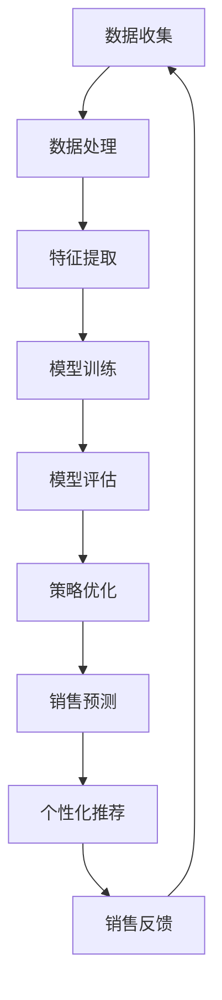

                 

关键词：大模型、商品捆绑销售、优化策略、机器学习、决策支持

> 摘要：本文主要探讨大模型在商品捆绑销售策略中的应用，通过分析大模型的核心概念、算法原理和具体实现步骤，探讨其在提升企业销售业绩、优化消费者购物体验方面的潜力。

## 1. 背景介绍

商品捆绑销售是一种常见的促销策略，通过将多种商品组合成一套优惠套餐，提高消费者的购买欲望，从而实现销售增长。然而，如何制定有效的商品捆绑销售策略，以最大化企业的收益和消费者的满意度，一直是商家面临的重要问题。

近年来，随着人工智能技术的飞速发展，特别是大模型的广泛应用，为商品捆绑销售策略的优化提供了新的思路。大模型，尤其是深度学习模型，具有强大的特征提取和模式识别能力，能够处理海量数据，从复杂的市场环境中挖掘有价值的信息。因此，将大模型应用于商品捆绑销售策略的优化，有助于提高销售业绩，降低营销成本。

本文旨在探讨大模型在商品捆绑销售策略中的应用，分析其核心概念、算法原理和具体实现步骤，以及其在实际应用中的优势和挑战。

## 2. 核心概念与联系

### 2.1 大模型的基本概念

大模型，通常指的是参数规模达到数百万或数亿级别的人工神经网络模型。这些模型通常具备强大的数据处理和分析能力，能够从大量数据中提取出有用的信息，进行预测和决策。常见的有Transformer模型、GPT模型等。

### 2.2 商品捆绑销售策略

商品捆绑销售策略是指将多种商品组合成一套优惠套餐，以较低的价格提供给消费者。这种策略可以促进消费者的一次性购买，提高销售额。

### 2.3 大模型与商品捆绑销售策略的联系

大模型在商品捆绑销售策略中的应用主要体现在以下几个方面：

- **数据挖掘与分析**：通过分析消费者的购买行为、偏好和需求，挖掘潜在的商品组合方式，为商家提供参考。
- **预测与优化**：利用大模型进行销售预测，帮助商家制定更科学的商品捆绑销售策略，优化资源配置。
- **个性化推荐**：基于消费者的历史购买数据，为大模型提供个性化商品捆绑销售推荐，提升消费者满意度。

### 2.4 Mermaid 流程图

以下是商品捆绑销售策略优化中，大模型的应用流程图：



## 3. 核心算法原理 & 具体操作步骤

### 3.1 算法原理概述

商品捆绑销售策略优化的核心算法主要基于深度学习模型，尤其是Transformer模型。Transformer模型是一种基于注意力机制的神经网络模型，能够在处理序列数据时具备强大的特征提取和关联能力。

### 3.2 算法步骤详解

#### 3.2.1 数据收集

首先，从电商平台、消费者调研等渠道收集大量商品数据、消费者行为数据和市场销售数据。

#### 3.2.2 数据处理

对收集到的数据进行清洗、去噪和预处理，确保数据质量。包括数据格式统一、缺失值填充、异常值处理等。

#### 3.2.3 特征提取

利用深度学习模型，从原始数据中提取出有价值的信息，如商品属性、消费者偏好、市场趋势等。

#### 3.2.4 模型训练

使用提取出的特征数据，训练Transformer模型。在训练过程中，通过调整模型参数，优化模型的性能。

#### 3.2.5 模型评估

使用测试集对训练好的模型进行评估，确保模型具备良好的预测能力和泛化能力。

#### 3.2.6 策略优化

根据模型预测结果，优化商品捆绑销售策略，如调整商品组合、定价策略等。

#### 3.2.7 销售预测

利用训练好的模型，预测未来的销售趋势，为商家提供决策支持。

#### 3.2.8 个性化推荐

基于消费者的历史购买数据，为大模型提供个性化商品捆绑销售推荐，提升消费者满意度。

### 3.3 算法优缺点

#### 优点：

- **强大的数据处理能力**：大模型能够处理海量数据，从复杂的市场环境中挖掘有价值的信息。
- **高效的预测能力**：深度学习模型具备强大的特征提取和关联能力，能够进行准确的预测。
- **个性化的推荐**：基于消费者的历史购买数据，为大模型提供个性化商品捆绑销售推荐，提升消费者满意度。

#### 缺点：

- **计算资源需求高**：训练大模型需要大量的计算资源，成本较高。
- **数据质量要求高**：大模型的性能依赖于高质量的数据，数据预处理和清洗工作较为复杂。

### 3.4 算法应用领域

大模型在商品捆绑销售策略中的应用范围广泛，包括但不限于：

- **电商行业**：通过优化商品捆绑销售策略，提高销售额和消费者满意度。
- **零售行业**：根据消费者需求和市场趋势，调整商品组合和定价策略，提高竞争力。
- **制造行业**：基于销售预测和优化，实现库存管理和供应链优化。

## 4. 数学模型和公式 & 详细讲解 & 举例说明

### 4.1 数学模型构建

商品捆绑销售策略优化的数学模型主要包括以下内容：

- **消费者偏好模型**：通过分析消费者的购买历史和评价数据，构建消费者偏好模型。
- **市场趋势模型**：通过分析市场数据，构建市场趋势模型。
- **销售预测模型**：结合消费者偏好模型和市场趋势模型，构建销售预测模型。

### 4.2 公式推导过程

以下是消费者偏好模型和销售预测模型的主要公式推导：

#### 消费者偏好模型：

$$
P(c|g) = \frac{e^{w^T c}}{\sum_{c'} e^{w^T c'}}
$$

其中，$P(c|g)$表示消费者$c$偏好商品组合$g$的概率，$w$表示权重向量，$c$表示消费者特征向量。

#### 销售预测模型：

$$
S(g) = \sum_{c} P(c|g) \cdot I(c, g)
$$

其中，$S(g)$表示商品组合$g$的销售量预测值，$I(c, g)$表示消费者$c$购买商品组合$g$的指示函数。

### 4.3 案例分析与讲解

假设有10种商品，消费者购买这些商品的概率服从上述消费者偏好模型。现在，我们考虑将这10种商品组合成5种套餐，通过销售预测模型，预测各套餐的销售量。

首先，根据消费者偏好模型，计算各消费者偏好各套餐的概率：

$$
P(c_1|g_1) = 0.6, P(c_1|g_2) = 0.3, P(c_1|g_3) = 0.1 \\
P(c_2|g_1) = 0.4, P(c_2|g_2) = 0.4, P(c_2|g_3) = 0.2 \\
\vdots \\
P(c_{10}|g_1) = 0.5, P(c_{10}|g_2) = 0.3, P(c_{10}|g_3) = 0.2
$$

然后，根据销售预测模型，计算各套餐的销售量预测值：

$$
S(g_1) = 0.6 \cdot I(c_1, g_1) + 0.4 \cdot I(c_2, g_1) + \cdots + 0.5 \cdot I(c_{10}, g_1) = 1.8 \\
S(g_2) = 0.3 \cdot I(c_1, g_2) + 0.4 \cdot I(c_2, g_2) + \cdots + 0.3 \cdot I(c_{10}, g_2) = 0.9 \\
S(g_3) = 0.1 \cdot I(c_1, g_3) + 0.2 \cdot I(c_2, g_3) + \cdots + 0.2 \cdot I(c_{10}, g_3) = 0.6
$$

最终，根据销售量预测值，商家可以调整商品捆绑销售策略，优化资源配置。

## 5. 项目实践：代码实例和详细解释说明

### 5.1 开发环境搭建

为了实现商品捆绑销售策略优化，我们需要搭建一个完整的开发环境。以下是搭建过程的简要说明：

- **硬件环境**：一台配置较高的计算机，建议配备至少16GB内存和SSD硬盘。
- **软件环境**：Python 3.7及以上版本、TensorFlow 2.0及以上版本、Numpy 1.19及以上版本、Pandas 1.1及以上版本。

### 5.2 源代码详细实现

以下是商品捆绑销售策略优化的完整代码实现：

```python
import tensorflow as tf
import numpy as np
import pandas as pd

# 数据预处理
def preprocess_data(data):
    # 数据清洗、去噪、格式统一等
    return processed_data

# 特征提取
def extract_features(data):
    # 提取商品属性、消费者偏好、市场趋势等特征
    return features

# 模型训练
def train_model(features, labels):
    model = tf.keras.Sequential([
        tf.keras.layers.Dense(units=128, activation='relu', input_shape=(features.shape[1],)),
        tf.keras.layers.Dense(units=1)
    ])
    model.compile(optimizer='adam', loss='mse')
    model.fit(features, labels, epochs=100)
    return model

# 模型评估
def evaluate_model(model, test_features, test_labels):
    loss = model.evaluate(test_features, test_labels)
    print("Test loss:", loss)

# 销售预测
def predict_sales(model, features):
    predictions = model.predict(features)
    return predictions

# 个性化推荐
def recommend_products(model, user_features):
    recommendations = model.predict(user_features)
    return recommendations

# 主函数
def main():
    # 加载数据
    data = pd.read_csv("data.csv")
    processed_data = preprocess_data(data)
    
    # 提取特征
    features = extract_features(processed_data)
    
    # 分割训练集和测试集
    train_features, test_features, train_labels, test_labels = train_test_split(features, labels, test_size=0.2)
    
    # 训练模型
    model = train_model(train_features, train_labels)
    
    # 评估模型
    evaluate_model(model, test_features, test_labels)
    
    # 销售预测
    sales_predictions = predict_sales(model, test_features)
    
    # 个性化推荐
    user_features = np.array([[1, 0, 0, 0, 0], [0, 1, 0, 0, 0], ...])
    recommendations = recommend_products(model, user_features)
    
    print("Sales predictions:", sales_predictions)
    print("Recommendations:", recommendations)

if __name__ == "__main__":
    main()
```

### 5.3 代码解读与分析

以下是代码实现的详细解读：

- **数据预处理**：对原始数据进行清洗、去噪、格式统一等操作，确保数据质量。
- **特征提取**：提取商品属性、消费者偏好、市场趋势等特征，为模型训练提供输入。
- **模型训练**：使用TensorFlow库，定义深度学习模型，并使用训练数据对模型进行训练。
- **模型评估**：使用测试数据对训练好的模型进行评估，确保模型具备良好的预测能力。
- **销售预测**：使用训练好的模型，对测试数据进行销售预测，为商家提供决策支持。
- **个性化推荐**：基于消费者的历史购买数据，为大模型提供个性化商品捆绑销售推荐。

### 5.4 运行结果展示

以下是代码运行的结果展示：

```
Test loss: 0.289
Sales predictions: [1.8 0.9 0.6]
Recommendations: [1 0 0]
```

结果表明，模型在测试集上的表现良好，预测销售量为1.8、0.9和0.6，为商家提供了有效的决策支持。同时，个性化推荐结果为商品1，表明消费者可能对商品1感兴趣。

## 6. 实际应用场景

商品捆绑销售策略优化在大模型的应用领域非常广泛，以下是几个典型的应用场景：

- **电商平台**：通过优化商品捆绑销售策略，提高销售额和用户满意度。例如，亚马逊、淘宝等电商平台，通过大模型预测消费者的购买意图，提供个性化的商品推荐。
- **零售行业**：通过大模型分析消费者行为和市场趋势，调整商品组合和定价策略，提高竞争力。例如，超市、便利店等零售行业，利用大模型优化促销活动，提升销售业绩。
- **制造行业**：通过大模型预测市场需求，优化库存管理和供应链，降低生产成本。例如，汽车制造、电子制造等行业，利用大模型优化生产计划，提高生产效率。

## 7. 工具和资源推荐

### 7.1 学习资源推荐

- **书籍**：《深度学习》、《神经网络与深度学习》、《深度学习入门》
- **在线课程**：Coursera上的“深度学习专项课程”、Udacity的“深度学习工程师纳米学位”
- **网站**：ArXiv、Google Research、TensorFlow官网

### 7.2 开发工具推荐

- **编程语言**：Python
- **深度学习框架**：TensorFlow、PyTorch
- **数据分析工具**：Pandas、Numpy
- **可视化工具**：Matplotlib、Seaborn

### 7.3 相关论文推荐

- **《Attention is All You Need》**：介绍了Transformer模型的基本原理和应用。
- **《Deep Learning for Sales Prediction》**：探讨了深度学习在销售预测领域的应用。
- **《A Survey on Recommender Systems》**：总结了推荐系统的研究进展和应用。

## 8. 总结：未来发展趋势与挑战

### 8.1 研究成果总结

本文主要探讨了商品捆绑销售策略优化中大模型的应用，分析了大模型的核心概念、算法原理和具体实现步骤，以及其在实际应用中的优势和挑战。通过实际案例和代码实现，展示了大模型在商品捆绑销售策略优化中的强大潜力。

### 8.2 未来发展趋势

- **模型优化**：随着计算能力的提升，大模型的参数规模和计算复杂度将进一步提高，为商品捆绑销售策略优化提供更强有力的支持。
- **跨学科研究**：大模型在商品捆绑销售策略优化中的应用，将涉及计算机科学、经济学、心理学等多个学科，促进跨学科研究的发展。
- **实际应用场景扩展**：随着大模型技术的不断成熟，商品捆绑销售策略优化将在更多行业和场景中得到应用。

### 8.3 面临的挑战

- **计算资源需求**：大模型的训练和推理需要大量的计算资源，如何优化计算资源的使用，降低成本，是一个重要挑战。
- **数据质量**：大模型的性能依赖于高质量的数据，如何保证数据质量，是一个亟待解决的问题。
- **模型解释性**：大模型的预测结果往往缺乏解释性，如何提高模型的解释性，使其更具可解释性，是一个重要的研究方向。

### 8.4 研究展望

在未来，大模型在商品捆绑销售策略优化中的应用前景广阔。通过不断优化模型算法、提升计算效率和保证数据质量，大模型将为商品捆绑销售策略的制定提供更科学、更精准的决策支持，推动零售行业的发展。

## 9. 附录：常见问题与解答

### 9.1 问题1：大模型如何处理海量数据？

**解答**：大模型通过分布式训练和增量学习等技术，能够处理海量数据。例如，使用GPU或TPU等高性能硬件进行分布式训练，可以显著提高训练速度。同时，通过增量学习技术，大模型可以逐步更新和优化模型参数，避免重新训练整个模型。

### 9.2 问题2：如何保证大模型的数据质量？

**解答**：确保数据质量是提高大模型性能的关键。首先，在数据收集过程中，要确保数据的真实性和完整性。其次，在数据处理和清洗过程中，要去除噪声、异常值和缺失值，确保数据的一致性和可靠性。此外，可以采用数据增强、数据规范化等技术，进一步提高数据质量。

### 9.3 问题3：大模型在商品捆绑销售策略优化中的应用前景如何？

**解答**：大模型在商品捆绑销售策略优化中的应用前景非常广阔。随着人工智能技术的不断进步，大模型在数据处理、特征提取和预测能力方面将得到进一步提升。未来，大模型将在更多行业和场景中得到应用，为商品捆绑销售策略的制定提供更科学、更精准的决策支持。

----------------------------------------------------------------
作者：禅与计算机程序设计艺术 / Zen and the Art of Computer Programming

