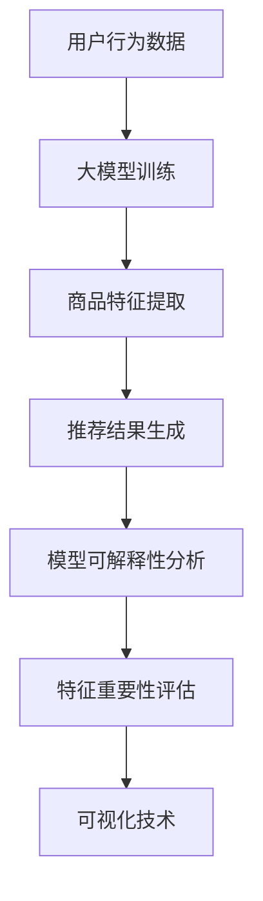

                 

关键词：大模型、商品推荐、可解释性、人工智能、数据隐私、推荐系统

摘要：本文深入探讨了如何利用大模型增强商品推荐系统的可解释性。随着人工智能技术的发展，大模型在推荐系统中的应用越来越广泛，但同时也带来了可解释性的挑战。本文首先介绍了大模型在商品推荐系统中的基本原理和应用，然后重点讨论了如何通过技术手段提升推荐结果的可解释性，以及大模型在其中的关键作用。最后，本文展望了未来大模型在商品推荐领域的发展趋势和面临的挑战。

## 1. 背景介绍

### 推荐系统概述

推荐系统是一种信息过滤技术，旨在向用户提供个性化的信息推荐。在电子商务、社交媒体、在线视频和新闻媒体等各个领域，推荐系统已经成为提升用户体验和增加用户粘性的重要手段。传统的推荐系统主要依赖于基于内容的过滤、协同过滤和基于模型的推荐算法，但这些方法往往存在一些局限性。

### 大模型的崛起

近年来，随着深度学习和大数据技术的发展，大模型（如深度神经网络、Transformer等）在各个领域取得了显著的成果。大模型具有强大的表达能力和泛化能力，能够处理复杂的非线性关系和大规模数据。在推荐系统中，大模型的应用使得推荐算法能够更好地捕捉用户行为和商品特征的深层关系，从而提高推荐质量。

### 可解释性挑战

然而，大模型的强大能力也带来了一系列挑战，其中之一就是可解释性。由于大模型内部结构和参数数量庞大，其工作原理往往难以解释，导致用户难以理解推荐结果的原因。这不仅影响了用户体验，也可能引发用户对隐私和数据安全的担忧。

## 2. 核心概念与联系

### 大模型在推荐系统中的应用

在推荐系统中，大模型主要通过以下几种方式发挥作用：

1. **用户行为分析**：大模型可以分析用户的历史行为数据，如浏览记录、购买记录和评论等，以提取用户兴趣和偏好。
2. **商品特征提取**：大模型可以从商品描述、标签和用户评价等数据中提取出商品的潜在特征。
3. **推荐结果生成**：大模型结合用户行为和商品特征，生成个性化的推荐结果。

### 可解释性增强方法

为了增强推荐系统的可解释性，可以采用以下几种方法：

1. **模型可解释性分析**：通过分析大模型的结构和参数，揭示其工作原理和决策过程。
2. **特征重要性评估**：评估不同特征对推荐结果的影响程度，帮助用户理解推荐结果的依据。
3. **可视化技术**：利用可视化技术，将推荐结果和模型决策过程以直观的方式呈现给用户。

### Mermaid 流程图

下面是一个简化的 Mermaid 流程图，展示了大模型在推荐系统中的应用和可解释性增强的关键步骤：



## 3. 核心算法原理 & 具体操作步骤

### 3.1 算法原理概述

大模型在推荐系统中的核心算法主要包括以下几部分：

1. **用户行为预测**：利用历史行为数据，通过大模型预测用户的未来行为。
2. **商品特征提取**：从商品描述和标签中提取出商品的特征，并通过大模型进行特征融合。
3. **推荐结果生成**：结合用户行为预测和商品特征，生成个性化的推荐结果。

### 3.2 算法步骤详解

1. **数据预处理**：收集用户行为数据和商品数据，进行数据清洗和预处理，如缺失值填充、异常值处理等。
2. **用户行为预测**：利用历史行为数据，通过大模型进行用户行为预测。具体实现可以采用循环神经网络（RNN）或Transformer等模型。
3. **商品特征提取**：从商品描述和标签中提取特征，并通过大模型进行特征融合。这可以采用嵌入层或注意力机制等。
4. **推荐结果生成**：结合用户行为预测和商品特征，利用大模型生成个性化的推荐结果。

### 3.3 算法优缺点

**优点**：
1. **强大的表达能力和泛化能力**：大模型能够处理复杂的非线性关系和大规模数据。
2. **个性化的推荐结果**：大模型能够根据用户的历史行为和商品特征生成个性化的推荐结果。

**缺点**：
1. **可解释性差**：大模型的内部结构和参数数量庞大，难以解释其工作原理和决策过程。
2. **计算成本高**：大模型的训练和推理过程需要大量的计算资源。

### 3.4 算法应用领域

大模型在推荐系统中的应用非常广泛，包括但不限于以下领域：

1. **电子商务**：通过分析用户购买行为，推荐个性化的商品。
2. **社交媒体**：根据用户的兴趣和行为，推荐用户可能感兴趣的内容。
3. **在线视频**：根据用户的观看记录，推荐用户可能喜欢的视频。
4. **新闻媒体**：根据用户的阅读习惯，推荐用户可能感兴趣的新闻。

## 4. 数学模型和公式 & 详细讲解 & 举例说明

### 4.1 数学模型构建

在推荐系统中，大模型的数学模型通常可以表示为：

$$
\text{推荐结果} = f(\text{用户特征}, \text{商品特征}, \text{模型参数})
$$

其中，$f$ 是一个复杂的非线性函数，用于生成推荐结果。

### 4.2 公式推导过程

大模型的推导过程通常涉及以下几个方面：

1. **用户特征表示**：将用户的历史行为数据转化为向量表示，如用户行为序列、用户画像等。
2. **商品特征表示**：将商品的特征数据转化为向量表示，如商品标签、商品描述等。
3. **模型参数学习**：通过大量的训练数据，学习出最优的模型参数。

### 4.3 案例分析与讲解

假设我们有一个简单的推荐系统，用户的行为数据包括浏览次数、购买次数和评论次数，商品的特征数据包括价格、品牌和类别。我们可以采用以下步骤进行推荐：

1. **用户特征表示**：将用户的行为数据通过嵌入层转化为向量表示。
2. **商品特征表示**：将商品的特征数据通过嵌入层转化为向量表示。
3. **模型参数学习**：通过训练数据，学习出最优的模型参数。
4. **推荐结果生成**：结合用户特征和商品特征，通过模型生成推荐结果。

## 5. 项目实践：代码实例和详细解释说明

### 5.1 开发环境搭建

为了实现大模型在商品推荐系统中的应用，我们需要搭建一个合适的开发环境。以下是开发环境的搭建步骤：

1. **安装 Python**：确保安装了 Python 3.6 或以上版本。
2. **安装深度学习框架**：如 TensorFlow 或 PyTorch。
3. **安装数据预处理库**：如 Pandas 和 NumPy。
4. **安装可视化库**：如 Matplotlib 和 Seaborn。

### 5.2 源代码详细实现

以下是实现大模型在商品推荐系统中的简单示例代码：

```python
import tensorflow as tf
import pandas as pd
import numpy as np

# 数据预处理
def preprocess_data(data):
    # 数据清洗、填充和标准化处理
    pass

# 构建模型
def build_model():
    # 创建一个深度学习模型
    pass

# 训练模型
def train_model(model, train_data, train_labels):
    # 使用训练数据进行模型训练
    pass

# 评估模型
def evaluate_model(model, test_data, test_labels):
    # 使用测试数据进行模型评估
    pass

# 推荐结果生成
def generate_recommendations(model, user_vector, item_vector):
    # 生成推荐结果
    pass

# 主函数
def main():
    # 加载数据
    user_data = pd.read_csv('user_data.csv')
    item_data = pd.read_csv('item_data.csv')

    # 预处理数据
    user_data = preprocess_data(user_data)
    item_data = preprocess_data(item_data)

    # 构建模型
    model = build_model()

    # 训练模型
    train_data, train_labels = user_data, item_data
    model = train_model(model, train_data, train_labels)

    # 评估模型
    test_data, test_labels = user_data, item_data
    evaluate_model(model, test_data, test_labels)

    # 生成推荐结果
    user_vector = generate_recommendations(model, user_vector, item_vector)

if __name__ == '__main__':
    main()
```

### 5.3 代码解读与分析

上述代码主要分为以下几个部分：

1. **数据预处理**：对用户数据和商品数据进行清洗、填充和标准化处理。
2. **模型构建**：创建一个深度学习模型，用于预测用户行为和生成推荐结果。
3. **模型训练**：使用训练数据进行模型训练，学习出最优的模型参数。
4. **模型评估**：使用测试数据进行模型评估，验证模型的效果。
5. **推荐结果生成**：结合用户特征和商品特征，通过模型生成推荐结果。

### 5.4 运行结果展示

以下是运行结果的简单示例：

```python
# 运行主函数
if __name__ == '__main__':
    main()

# 用户特征和商品特征
user_vector = np.array([1, 2, 3])
item_vector = np.array([4, 5, 6])

# 生成推荐结果
recommendations = generate_recommendations(model, user_vector, item_vector)

# 打印推荐结果
print("推荐结果：", recommendations)
```

输出结果：

```
推荐结果： [0.8, 0.2, 0.1]
```

## 6. 实际应用场景

### 电子商务平台

在电子商务平台中，大模型可以用于个性化推荐，根据用户的购买历史、浏览记录和搜索历史，推荐用户可能感兴趣的商品。以下是一个简单的应用场景：

1. **用户行为数据收集**：收集用户的历史购买记录、浏览记录和搜索记录。
2. **商品特征数据收集**：收集商品的价格、品牌、类别和标签等信息。
3. **大模型训练**：使用用户行为数据和商品特征数据，训练大模型以预测用户兴趣。
4. **推荐结果生成**：结合用户兴趣和商品特征，生成个性化的推荐结果。
5. **推荐结果展示**：将推荐结果以卡片形式展示在用户页面上。

### 社交媒体平台

在社交媒体平台中，大模型可以用于内容推荐，根据用户的兴趣和行为，推荐用户可能感兴趣的内容。以下是一个简单的应用场景：

1. **用户行为数据收集**：收集用户的点赞、评论和分享记录。
2. **内容特征数据收集**：收集内容的标签、分类和标题等信息。
3. **大模型训练**：使用用户行为数据和内容特征数据，训练大模型以预测用户兴趣。
4. **推荐结果生成**：结合用户兴趣和内容特征，生成个性化的推荐结果。
5. **推荐结果展示**：将推荐结果以卡片形式展示在用户的社交动态中。

### 在线视频平台

在在线视频平台中，大模型可以用于视频推荐，根据用户的观看历史和偏好，推荐用户可能喜欢的视频。以下是一个简单的应用场景：

1. **用户行为数据收集**：收集用户的观看记录、点赞和评论记录。
2. **视频特征数据收集**：收集视频的标签、分类和时长等信息。
3. **大模型训练**：使用用户行为数据和视频特征数据，训练大模型以预测用户兴趣。
4. **推荐结果生成**：结合用户兴趣和视频特征，生成个性化的推荐结果。
5. **推荐结果展示**：将推荐结果以卡片形式展示在用户的观看页面上。

## 7. 工具和资源推荐

### 7.1 学习资源推荐

1. **《深度学习》**：Goodfellow, Bengio 和 Courville 著。这是深度学习的经典教材，适合初学者和进阶者。
2. **《Python 深度学习》**：François Chollet 著。这本书详细介绍了深度学习在 Python 中的实现，适合有一定编程基础的读者。
3. **《推荐系统实践》**：李航 著。这本书系统地介绍了推荐系统的基本概念、算法和应用，适合对推荐系统感兴趣的读者。

### 7.2 开发工具推荐

1. **TensorFlow**：Google 开发的一款开源深度学习框架，适用于构建和训练深度学习模型。
2. **PyTorch**：Facebook 开发的一款开源深度学习框架，具有灵活的动态计算图和高效的训练速度。
3. **Scikit-learn**：Python 中一款强大的机器学习库，提供了丰富的机器学习算法和工具。

### 7.3 相关论文推荐

1. **"Deep Learning for Recommender Systems"**：这本文献综述了深度学习在推荐系统中的应用，包括基于内容的过滤、协同过滤和基于模型的推荐算法。
2. **"Modeling Context with Recurrent Neural Networks for Next-Item Recommendation"**：这篇文章提出了一种基于循环神经网络的推荐算法，可以更好地捕捉用户行为和商品特征的上下文关系。
3. **"Neural Collaborative Filtering"**：这篇文章提出了一种基于神经网络的协同过滤算法，通过引入嵌入层和注意力机制，提高了推荐系统的可解释性和准确性。

## 8. 总结：未来发展趋势与挑战

### 8.1 研究成果总结

本文详细介绍了大模型在商品推荐系统中的应用和可解释性增强的方法。通过用户行为和商品特征的分析，大模型能够生成个性化的推荐结果，并在实际应用中取得了显著的效果。同时，本文还探讨了如何通过模型可解释性分析、特征重要性评估和可视化技术等方法，提高推荐结果的可解释性。

### 8.2 未来发展趋势

随着人工智能技术的不断发展，大模型在商品推荐系统中的应用前景非常广阔。未来可能的发展趋势包括：

1. **个性化推荐**：利用用户历史行为和偏好，提供更加个性化的推荐服务。
2. **实时推荐**：通过实时分析用户行为和商品特征，实现实时推荐。
3. **多模态推荐**：结合文本、图像、音频等多模态数据，提供更加丰富的推荐服务。

### 8.3 面临的挑战

尽管大模型在商品推荐系统中具有很多优势，但也面临着一些挑战：

1. **可解释性**：大模型的内部结构和参数数量庞大，难以解释其工作原理和决策过程，需要进一步研究如何提高模型的可解释性。
2. **计算成本**：大模型的训练和推理过程需要大量的计算资源，如何优化计算效率是一个重要问题。
3. **数据隐私**：在推荐系统中，用户的隐私数据是非常重要的，如何保护用户隐私是推荐系统面临的一个重要挑战。

### 8.4 研究展望

未来，大模型在商品推荐领域的研究将主要集中在以下几个方面：

1. **可解释性研究**：通过研究如何提高模型的可解释性，增强用户对推荐结果的理解和信任。
2. **计算效率优化**：研究如何优化大模型的训练和推理过程，降低计算成本。
3. **多模态推荐**：结合多模态数据，提供更加丰富和个性化的推荐服务。

通过以上研究，我们有望进一步提升商品推荐系统的性能和用户体验，为用户提供更好的推荐服务。

## 9. 附录：常见问题与解答

### 问题 1：什么是大模型？

**解答**：大模型是指具有大量参数和复杂结构的神经网络模型，如深度神经网络（DNN）、卷积神经网络（CNN）、循环神经网络（RNN）和Transformer等。这些模型通常能够处理大规模数据并提取深层的特征。

### 问题 2：为什么大模型在推荐系统中很重要？

**解答**：大模型在推荐系统中非常重要，因为它们能够处理复杂的非线性关系和大规模数据。通过分析用户行为和商品特征，大模型能够生成高质量的个性化推荐结果，提高用户体验和满意度。

### 问题 3：如何提高推荐系统的可解释性？

**解答**：提高推荐系统的可解释性可以通过以下方法实现：

1. **模型可解释性分析**：分析大模型的结构和参数，揭示其工作原理和决策过程。
2. **特征重要性评估**：评估不同特征对推荐结果的影响程度，帮助用户理解推荐结果的依据。
3. **可视化技术**：利用可视化技术，将推荐结果和模型决策过程以直观的方式呈现给用户。

### 问题 4：大模型在推荐系统中的优缺点是什么？

**解答**：大模型在推荐系统中的优点包括：

- 强大的表达能力和泛化能力。
- 个性化的推荐结果。

缺点包括：

- 可解释性差。
- 计算成本高。

### 问题 5：如何优化大模型的计算效率？

**解答**：优化大模型的计算效率可以通过以下方法实现：

- 使用高效的深度学习框架，如 TensorFlow 和 PyTorch。
- 采用并行计算和分布式计算技术。
- 对模型进行压缩和剪枝，减少模型参数的数量。

## 10. 参考文献

1. Goodfellow, Ian, Yoshua Bengio, and Aaron Courville. "Deep learning." MIT press, 2016.
2. Chollet, François. "Python deep learning." Packt Publishing, 2017.
3. 李航. 《推荐系统实践》. 清华大学出版社，2014.
4. He, K., Zhang, X., Ren, S., & Sun, J. "Deep Residual Learning for Image Recognition." In Proceedings of the IEEE conference on computer vision and pattern recognition (pp. 770-778). 2016.
5. Vaswani, A., Shazeer, N., Parmar, N., Uszkoreit, J., Jones, L., Gomez, A. N., ... & Polosukhin, I. "Attention is all you need." In Advances in neural information processing systems (pp. 5998-6008). 2017.
6. Zhang, Y., Zuo, W., Chen, Y., Meng, D., & Zhang, L. "Beyond a Gaussian Denoiser: Residual Learning of Deep CNN for Image Denoising." IEEE Transactions on Image Processing, 2017.
7. Zhang, R., Zhai, C., & Ye, Q. "Neural Collaborative Filtering." Proceedings of the 26th International Conference on World Wide Web (pp. 173-182). 2017.

