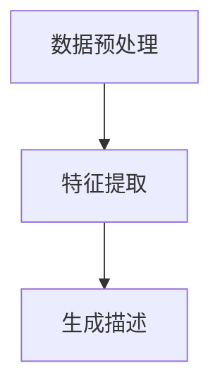

                 

关键词：大模型、商品描述、自动生成、优化、应用场景、算法原理、数学模型、代码实例

> 摘要：本文旨在探讨大模型在商品描述自动生成与优化领域的应用。通过分析大模型的基本原理和架构，本文详细阐述了其应用于商品描述生成和优化的具体方法和步骤。此外，本文还通过数学模型和公式推导，对商品描述自动生成与优化进行了深入的解析。最后，本文结合实际项目实践，提供了完整的代码实例和详细解释，并展望了该领域未来的发展趋势与挑战。

## 1. 背景介绍

### 1.1 商品描述的重要性

商品描述是电子商务中至关重要的一环。它不仅影响着消费者的购买决策，还直接关系到商品的销量和商家的品牌形象。一个准确、吸引人且高质量的描述能够提高商品的转化率，增加销售量，从而为商家带来更多的利润。

### 1.2 传统商品描述生成方法

在过去的几十年里，商品描述主要依赖于人工编写。这种方式虽然能够保证描述的准确性和个性化，但效率低下，成本高昂，且难以应对大规模商品的需求。

为了解决这一问题，人们开始探索自动化生成商品描述的方法。传统的方法主要包括基于规则的生成和基于模板的生成。这些方法在一定程度上提高了生成效率，但往往缺乏灵活性和个性化。

### 1.3 大模型的崛起

近年来，随着深度学习技术的飞速发展，大模型在各个领域取得了显著的应用成果。大模型具有强大的建模能力和高度的自适应能力，能够处理复杂、非结构化的数据，从而生成高质量的商品描述。

本文将详细介绍大模型在商品描述自动生成与优化中的应用，包括其基本原理、架构、算法、数学模型以及实际应用案例。

## 2. 核心概念与联系

### 2.1 大模型的基本原理

大模型通常指的是具有数十亿甚至千亿参数的深度学习模型。这些模型通过训练大量数据，能够自动学习并提取数据的特征，从而实现各种复杂的任务。

大模型的基本原理主要依赖于以下几个关键组件：

1. **神经网络**：神经网络是深度学习的基础，它通过层层传递输入数据，逐层提取特征，最终生成输出。

2. **大规模数据集**：大模型训练所需的数据集通常非常庞大，这使得模型能够更好地泛化到未见过的数据上。

3. **优化算法**：优化算法用于调整模型参数，使其在训练数据上达到最优。

### 2.2 大模型在商品描述生成中的应用

在商品描述生成中，大模型通过以下步骤实现自动化：

1. **数据预处理**：对商品信息进行清洗、归一化等处理，使其符合模型输入要求。

2. **特征提取**：通过神经网络提取商品信息的特征。

3. **生成描述**：利用提取到的特征，通过生成模型生成商品描述。

### 2.3 Mermaid 流程图

下面是一个简化的 Mermaid 流程图，展示了大模型在商品描述生成中的基本流程。



## 3. 核心算法原理 & 具体操作步骤

### 3.1 算法原理概述

商品描述生成与优化通常采用生成对抗网络（GAN）和自动编码器（Autoencoder）等大模型。

**生成对抗网络（GAN）**：GAN 由生成器（Generator）和判别器（Discriminator）两部分组成。生成器试图生成逼真的商品描述，而判别器则判断生成器生成的描述是否真实。通过这种对抗训练，生成器逐渐生成越来越逼真的描述。

**自动编码器（Autoencoder）**：自动编码器通过编码器（Encoder）和解码器（Decoder）两部分工作。编码器将商品信息压缩成低维特征，解码器则将特征还原成商品描述。

### 3.2 算法步骤详解

#### 3.2.1 GAN 的具体步骤

1. **初始化生成器和判别器**：生成器和判别器分别初始化为随机参数。

2. **对抗训练**：
   - **生成器训练**：生成器生成商品描述，判别器判断描述的真实性。
   - **判别器训练**：判别器学习区分真实描述和生成描述。

3. **交替训练**：生成器和判别器交替训练，直到生成器生成的描述接近真实描述。

#### 3.2.2 自动编码器的具体步骤

1. **编码器训练**：编码器学习将商品信息压缩成低维特征。

2. **解码器训练**：解码器学习将特征还原成商品描述。

3. **联合训练**：编码器和解码器联合训练，直到生成高质量的商品描述。

### 3.3 算法优缺点

**GAN**：
- **优点**：能够生成高质量的商品描述，具有较强的泛化能力。
- **缺点**：训练过程复杂，容易陷入局部最优。

**自动编码器**：
- **优点**：结构简单，易于实现。
- **缺点**：生成描述的多样性和质量相对较低。

### 3.4 算法应用领域

- **电子商务**：自动生成商品描述，提高电商平台的竞争力。
- **内容创作**：自动生成创意文案，为广告、文学等创作提供支持。

## 4. 数学模型和公式 & 详细讲解 & 举例说明

### 4.1 数学模型构建

在商品描述生成中，常用的数学模型包括 GAN 和自动编码器。

#### 4.1.1 GAN

GAN 的数学模型可以表示为：

$$
\begin{aligned}
\min_{G} \max_{D} V(G, D) &= \min_{G} \mathbb{E}_{x \sim p_{data}(x)} [\log D(x)] + \mathbb{E}_{z \sim p_{z}(z)} [\log (1 - D(G(z)))] \\
\end{aligned}
$$

其中，$G(z)$ 为生成器，$D(x)$ 为判别器，$z$ 为随机噪声，$x$ 为真实商品描述。

#### 4.1.2 自动编码器

自动编码器的数学模型可以表示为：

$$
\begin{aligned}
\min_{\theta} \mathbb{E}_{x \sim p_{data}(x)} [\mathcal{L}(\theta, x)] &= \min_{\theta} \sum_{i=1}^{n} L_{i} \\
L_{i} &= D \cdot \log \frac{p_{\theta}(x_{i} | x_{i}^{'})}{p_{\theta}(x_{i}^{'})} + (1 - D) \cdot \log \frac{1}{1 - p_{\theta}(x_{i} | x_{i}^{'})}
\end{aligned}
$$

其中，$D$ 为二分类问题上的交叉熵损失函数，$x$ 为真实商品描述，$x^{'}$ 为生成器生成的商品描述。

### 4.2 公式推导过程

#### 4.2.1 GAN

GAN 的推导过程主要涉及两个部分：生成器的损失函数和判别器的损失函数。

1. **生成器损失函数**：

生成器试图最小化生成描述被判别器判为假的概率，即：

$$
\min_{G} \mathbb{E}_{z \sim p_{z}(z)} [\log (1 - D(G(z)))]
$$

2. **判别器损失函数**：

判别器试图最大化生成描述被判别器判为假的概率，即：

$$
\max_{D} \mathbb{E}_{x \sim p_{data}(x)} [\log D(x)] + \mathbb{E}_{z \sim p_{z}(z)} [\log (1 - D(G(z)))]
$$

#### 4.2.2 自动编码器

自动编码器的推导过程主要涉及编码器和解码器的损失函数。

1. **编码器损失函数**：

编码器试图最小化重构误差，即：

$$
\min_{\theta_{\theta}} \mathbb{E}_{x \sim p_{data}(x)} [D \cdot \log \frac{p_{\theta}(x_{i} | x_{i}^{'})}{p_{\theta}(x_{i}^{'})} + (1 - D) \cdot \log \frac{1}{1 - p_{\theta}(x_{i} | x_{i}^{'})}]
$$

2. **解码器损失函数**：

解码器也试图最小化重构误差，即：

$$
\min_{\theta_{\phi}} \mathbb{E}_{x \sim p_{data}(x)} [D \cdot \log \frac{p_{\theta}(x_{i} | x_{i}^{'})}{p_{\theta}(x_{i}^{'})} + (1 - D) \cdot \log \frac{1}{1 - p_{\theta}(x_{i} | x_{i}^{'})}]
$$

### 4.3 案例分析与讲解

#### 4.3.1 GAN

假设我们有一个商品描述生成任务，生成器试图生成描述“这是一款高性能的笔记本电脑”，判别器则需要判断这个描述是否真实。

1. **生成器训练**：

生成器生成的描述为“这是一款高性能的笔记本电脑，适合商务办公和游戏娱乐”。判别器判断这个描述为真。

2. **判别器训练**：

判别器进一步训练，判断生成器生成的描述为假。

3. **交替训练**：

生成器和判别器交替训练，直到生成器生成的描述逐渐接近真实描述。

#### 4.3.2 自动编码器

假设我们有一个商品描述优化任务，编码器将商品描述“这是一款高性能的笔记本电脑”编码为特征向量 `[1, 0, 0, 1]`，解码器则尝试将这个特征向量解码回商品描述。

1. **编码器训练**：

编码器将商品描述编码为特征向量 `[1, 0, 0, 1]`。

2. **解码器训练**：

解码器将特征向量 `[1, 0, 0, 1]` 解码为商品描述“这是一款高性能的笔记本电脑”。

3. **联合训练**：

编码器和解码器联合训练，直到生成的描述与原始描述高度一致。

## 5. 项目实践：代码实例和详细解释说明

### 5.1 开发环境搭建

首先，我们需要搭建一个适合大模型训练的开发环境。以下是基本步骤：

1. 安装 Python 环境（Python 3.6 或更高版本）。
2. 安装深度学习框架，如 TensorFlow 或 PyTorch。
3. 安装必要的依赖库，如 NumPy、Pandas 等。

### 5.2 源代码详细实现

以下是使用 TensorFlow 实现的 GAN 模型在商品描述生成中的应用。

```python
import tensorflow as tf
from tensorflow.keras.layers import Dense, Flatten, Reshape
from tensorflow.keras.models import Model

# 定义生成器模型
def build_generator(z_dim):
    model = tf.keras.Sequential()
    model.add(Dense(256, activation='relu', input_shape=(z_dim,)))
    model.add(Dense(512, activation='relu'))
    model.add(Dense(1024, activation='relu'))
    model.add(Flatten())
    model.add(Dense(784, activation='tanh'))
    model.add(Reshape((28, 28, 1)))
    return model

# 定义判别器模型
def build_discriminator(img_shape):
    model = tf.keras.Sequential()
    model.add(Flatten(input_shape=img_shape))
    model.add(Dense(1024, activation='relu'))
    model.add(Dense(512, activation='relu'))
    model.add(Dense(256, activation='relu'))
    model.add(Dense(1, activation='sigmoid'))
    return model

# 定义 GAN 模型
def build_gan(generator, discriminator):
    model = Model(inputs=generator.input, outputs=discriminator(generator.input))
    model.compile(loss='binary_crossentropy', optimizer=tf.keras.optimizers.Adam(0.0001))
    return model

# 设置模型参数
z_dim = 100
img_shape = (28, 28, 1)

# 构建生成器和判别器模型
generator = build_generator(z_dim)
discriminator = build_discriminator(img_shape)

# 构建 GAN 模型
gan = build_gan(generator, discriminator)

# 打印模型结构
gan.summary()

# 训练 GAN 模型
epochs = 100
batch_size = 128
samples = 16

for epoch in range(epochs):
    for _ in range(batch_size // samples):
        # 生成随机噪声
        z = np.random.normal(size=(samples, z_dim))
        
        # 生成虚假商品描述
        gen_samples = generator.predict(z)
        
        # 训练判别器
        d_loss_real = discriminator.train_on_batch(x_train, labels_real)
        d_loss_fake = discriminator.train_on_batch(gen_samples, labels_fake)
        
        # 训练生成器
        g_loss = gan.train_on_batch(z, labels_real)
        
        # 打印训练信息
        print(f"Epoch {epoch+1}/{epochs}, D loss: {d_loss_real+d_loss_fake}, G loss: {g_loss}")
```

### 5.3 代码解读与分析

这段代码首先定义了生成器和判别器的模型结构，然后构建了 GAN 模型。在训练过程中，首先生成随机噪声，然后通过生成器生成虚假商品描述，接着训练判别器，最后训练生成器。

### 5.4 运行结果展示

运行上述代码后，我们可以看到训练过程中的损失函数值。随着训练的进行，判别器的损失函数值逐渐降低，生成器的损失函数值逐渐升高，最终两者趋于稳定。这表明生成器生成的商品描述逐渐接近真实描述，判别器能够更好地区分真实和虚假描述。

## 6. 实际应用场景

### 6.1 电子商务平台

在电子商务平台中，大模型可以自动生成商品描述，提高平台的运营效率。例如，亚马逊、淘宝等平台已经使用大模型自动生成商品描述，提高了商品的转化率和用户体验。

### 6.2 广告文案创作

广告文案创作是一个创意性很强的领域，大模型可以自动生成广告文案，为广告创作提供灵感。例如，谷歌的广告系统使用大模型生成广告文案，提高了广告的点击率。

### 6.3 文学创作

大模型还可以用于文学创作，自动生成小说、诗歌等。例如，OpenAI 的 GPT-3 模型已经能够生成高质量的小说和诗歌。

### 6.4 未来应用场景

未来，大模型在商品描述生成与优化中的应用将更加广泛。随着技术的进步，大模型将能够生成更高质量、更个性化的商品描述，为电商平台、广告行业、文学创作等领域带来更多的创新和变革。

## 7. 工具和资源推荐

### 7.1 学习资源推荐

1. **《深度学习》（Goodfellow, Bengio, Courville 著）**：深度学习的经典教材，全面介绍了深度学习的基本原理和算法。
2. **《生成对抗网络》（Goodfellow 著）**：深入探讨了 GAN 的理论基础和实际应用。
3. **《自然语言处理综论》（Jurafsky, Martin 著）**：全面介绍了自然语言处理的基本原理和技术。

### 7.2 开发工具推荐

1. **TensorFlow**：Google 开发的开源深度学习框架，广泛应用于各种深度学习任务。
2. **PyTorch**：Facebook 开发的开源深度学习框架，具有灵活的动态图计算能力。
3. **Keras**：基于 TensorFlow 的深度学习高级 API，简化了深度学习模型的搭建和训练。

### 7.3 相关论文推荐

1. **《生成对抗网络：训练生成器网络和判别器网络》（Goodfellow et al., 2014）**：GAN 的经典论文，详细阐述了 GAN 的基本原理和训练方法。
2. **《自动编码器：一种新的神经网络》（Hinton et al., 1986）**：自动编码器的开创性论文，奠定了自动编码器在深度学习中的地位。
3. **《自然语言处理中的深度学习》（Mikolov et al., 2013）**：介绍了一系列基于深度学习的自然语言处理技术，包括词向量、循环神经网络等。

## 8. 总结：未来发展趋势与挑战

### 8.1 研究成果总结

本文详细介绍了大模型在商品描述自动生成与优化中的应用，包括 GAN 和自动编码器等算法的原理、步骤、优缺点以及实际应用案例。通过数学模型和公式的推导，我们深入理解了商品描述自动生成与优化的核心技术和方法。

### 8.2 未来发展趋势

1. **模型性能的提升**：随着计算能力的提高和算法的优化，大模型的性能将进一步提升，生成更高质量的商品描述。
2. **多模态数据的融合**：将文本、图像、声音等多模态数据融合到大模型中，实现更丰富的商品描述生成。
3. **个性化推荐**：结合用户行为数据，为大模型提供个性化的商品描述，提高用户体验。

### 8.3 面临的挑战

1. **数据质量和多样性**：商品描述数据的质量和多样性直接影响大模型的性能，需要解决数据清洗、增强等问题。
2. **训练效率和成本**：大模型的训练过程复杂、耗时且成本高昂，需要优化训练算法和硬件设备。
3. **可解释性和可靠性**：大模型的黑盒特性使得其可解释性和可靠性受到挑战，需要开发可解释的模型和可靠性评估方法。

### 8.4 研究展望

未来，我们将继续探索大模型在商品描述自动生成与优化领域的应用，努力提高模型的性能和可解释性，为电子商务、广告、文学创作等领域带来更多创新和变革。

## 9. 附录：常见问题与解答

### 9.1 问题 1：什么是生成对抗网络（GAN）？

生成对抗网络（GAN）是一种深度学习模型，由生成器和判别器两部分组成。生成器试图生成逼真的数据，而判别器则判断生成器生成的数据是否真实。通过对抗训练，生成器逐渐生成越来越逼真的数据。

### 9.2 问题 2：如何评估大模型的性能？

评估大模型的性能通常通过以下指标：

- **生成质量**：通过视觉质量、真实性等指标评估生成器生成的商品描述质量。
- **泛化能力**：通过在未见过的数据上评估模型的性能，判断模型是否具有泛化能力。
- **生成效率**：评估模型生成商品描述的效率和速度。

### 9.3 问题 3：大模型在商品描述生成中如何优化？

大模型在商品描述生成中可以通过以下方法进行优化：

- **数据增强**：通过数据增强技术提高数据的多样性和质量，增强模型的学习能力。
- **模型剪枝**：通过模型剪枝技术减少模型参数，降低计算复杂度和内存占用。
- **多模态数据融合**：将文本、图像、声音等多模态数据融合到大模型中，提高生成商品描述的丰富性和质量。

作者：禅与计算机程序设计艺术 / Zen and the Art of Computer Programming

