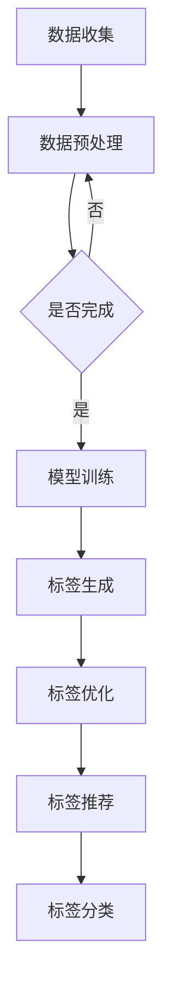

                 

关键词：大模型、商品标签、自动化、深度学习、人工智能

## 摘要

本文将探讨大模型在商品标签自动化中的应用。商品标签是电子商务中至关重要的部分，它直接影响用户的购物体验和电商平台的运营效果。通过引入大模型，我们可以实现商品标签的自动化生成，提高效率、降低成本，并提高标签的准确性。本文将首先介绍商品标签的重要性，然后探讨大模型的定义和特点，接着详细阐述大模型在商品标签自动化中的应用，最后讨论大模型在实际应用中面临的挑战和未来的发展方向。

## 1. 背景介绍

### 商品标签的重要性

商品标签是电子商务中不可或缺的一部分，它不仅包含了商品的基本信息，如名称、价格、库存量等，还包含了描述商品特点的关键词和标签。这些标签对于用户在电商平台上的搜索、筛选和决策具有重要影响。

首先，商品标签能够提高商品的曝光率。当用户在电商平台上搜索商品时，精准的标签能够使商品更迅速地出现在搜索结果中，从而提高商品的曝光率和点击率。

其次，商品标签能够提高用户的购物体验。通过标签，用户可以快速了解商品的特点和优势，减少决策时间，提高购物效率。此外，标签还可以帮助用户筛选出符合自己需求的商品，减少浏览时间和购买成本。

最后，商品标签对电商平台的运营效果具有重要影响。精准的标签能够提高商品的销售转化率，降低退货率，从而提高平台的利润和用户满意度。

### 大模型的定义和特点

大模型，即大型的人工智能模型，通常具有数百万甚至数十亿个参数。这些模型通过深度学习技术，能够从大量的数据中自动学习和提取知识。大模型具有以下几个显著特点：

1. **参数规模大**：大模型拥有庞大的参数规模，这使得它们能够处理复杂的任务和大量的数据。

2. **学习能力强**：大模型通过大量的训练数据，能够自动学习和优化参数，从而提高模型的性能。

3. **泛化能力强**：大模型通过在多样化的数据集上进行训练，能够更好地适应不同的任务和场景。

4. **计算资源需求高**：大模型通常需要大量的计算资源和存储空间，这使得其训练和部署成本较高。

### 大模型在商品标签自动化中的应用

大模型在商品标签自动化中的应用，主要体现在以下几个方面：

1. **标签生成**：大模型可以通过学习大量的商品描述和标签，自动生成新的商品标签。这种方法能够提高标签的准确性，减少人工干预。

2. **标签优化**：大模型可以分析已有的商品标签，发现标签之间的关联性，从而优化标签的设置，提高标签的精准度。

3. **标签推荐**：大模型可以根据用户的购物行为和偏好，推荐个性化的标签，从而提高用户的购物体验和满意度。

4. **标签分类**：大模型可以用于对大量商品标签进行分类，以便于管理和检索。

## 2. 核心概念与联系

### 核心概念

- **商品标签**：商品标签是描述商品特征和属性的词语或短语，用于帮助用户快速了解商品和进行筛选。
- **大模型**：大模型是指具有数百万甚至数十亿个参数的深度学习模型，能够处理复杂任务和大量数据。

### 大模型与商品标签自动化的关系

大模型在商品标签自动化中的应用，主要体现在以下几个方面：

1. **数据驱动**：大模型通过学习大量的商品描述和标签，自动生成和优化标签。
2. **自主学习**：大模型能够自动从数据中提取特征，无需人工干预，从而提高标签的准确性和效率。
3. **个性化推荐**：大模型可以根据用户的购物行为和偏好，推荐个性化的标签，提高用户的购物体验。

### Mermaid 流程图

下面是一个简化的 Mermaid 流程图，展示了大模型在商品标签自动化中的应用流程。



## 3. 核心算法原理 & 具体操作步骤

### 3.1 算法原理概述

大模型在商品标签自动化中的应用，主要依赖于深度学习技术。深度学习是一种基于多层神经网络的学习方法，通过学习大量的数据，自动提取特征和模式。在商品标签自动化中，大模型可以学习到商品描述和标签之间的关联性，从而实现标签的自动生成和优化。

### 3.2 算法步骤详解

1. **数据收集**：首先需要收集大量的商品描述和标签数据。这些数据可以从电商平台、社交媒体、商品评论等渠道获取。

2. **数据预处理**：对收集到的数据进行预处理，包括去除噪声、填充缺失值、数据归一化等操作。预处理后的数据将作为模型的输入。

3. **模型训练**：使用预处理后的数据训练大模型。训练过程中，模型会自动学习到商品描述和标签之间的关联性。

4. **标签生成**：训练完成后，使用模型生成新的商品标签。具体方法是将商品描述输入到模型中，模型输出相应的标签。

5. **标签优化**：对生成的标签进行优化，以提高标签的准确性和效率。优化方法包括基于模型的分析、人工审核等。

6. **标签推荐**：根据用户的购物行为和偏好，使用模型推荐个性化的标签。这有助于提高用户的购物体验和满意度。

7. **标签分类**：将大量的商品标签进行分类，以便于管理和检索。

### 3.3 算法优缺点

**优点**：

1. **高效性**：大模型能够快速处理大量的数据，实现标签的自动生成和优化。
2. **准确性**：通过深度学习技术，大模型能够从数据中自动提取特征，提高标签的准确性。
3. **个性化**：大模型可以根据用户的购物行为和偏好，推荐个性化的标签，提高用户的购物体验。

**缺点**：

1. **计算资源需求高**：大模型需要大量的计算资源和存储空间，训练和部署成本较高。
2. **数据依赖性**：大模型的性能依赖于数据的质量和数量，如果数据不足或质量不高，模型的性能会受到影响。

### 3.4 算法应用领域

大模型在商品标签自动化中的应用，不仅局限于电商平台，还可以应用于其他领域，如：

1. **在线零售**：通过自动生成和优化标签，提高商品的曝光率和销售转化率。
2. **库存管理**：通过标签优化，降低库存成本，提高库存周转率。
3. **市场调研**：通过分析标签数据，了解用户需求和偏好，为市场策略提供支持。

## 4. 数学模型和公式 & 详细讲解 & 举例说明

### 4.1 数学模型构建

在商品标签自动化中，大模型通常采用深度学习模型，如卷积神经网络（CNN）、循环神经网络（RNN）或Transformer模型。以下是一个简化的数学模型构建过程：

1. **输入层**：输入层接收商品描述数据，通常使用词向量表示。
2. **隐藏层**：隐藏层通过多层神经网络，对输入数据进行特征提取和转换。
3. **输出层**：输出层生成商品标签，通常使用softmax函数进行概率分布。

假设我们使用一个简单的卷积神经网络模型，其数学模型可以表示为：

$$
\text{Output} = \text{softmax}(\text{Weights} \cdot \text{Hidden Layer} + \text{Bias})
$$

其中，Weights 表示权重矩阵，Hidden Layer 表示隐藏层输出，Bias 表示偏置项。

### 4.2 公式推导过程

以卷积神经网络为例，我们首先定义输入数据 $X$，其维度为 $m \times n$，表示一个 $m \times n$ 的矩阵。我们假设隐藏层的大小为 $k$，则隐藏层的输出 $H$ 可以表示为：

$$
H = \text{Conv}(\text{Weights} \cdot X + \text{Bias})
$$

其中，Conv 表示卷积操作，Weights 和 Bias 分别表示卷积核权重和偏置项。

然后，我们将隐藏层的输出 $H$ 输入到下一个隐藏层，得到新的隐藏层输出：

$$
H' = \text{Conv}(\text{Weights} \cdot H + \text{Bias})
$$

以此类推，直到达到最终的输出层。最终输出层的输出 $Y$ 可以表示为：

$$
Y = \text{softmax}(\text{Weights} \cdot H + \text{Bias})
$$

### 4.3 案例分析与讲解

假设我们有一个电商平台，需要为商品生成标签。首先，我们需要收集大量的商品描述和标签数据。例如，我们有以下数据集：

```
商品描述：笔记本电脑
标签：电子产品、数码产品、电脑
```

```
商品描述：智能手机
标签：电子产品、数码产品、手机
```

我们将这些数据转换为词向量表示，然后输入到卷积神经网络模型中。在训练过程中，模型会自动学习到商品描述和标签之间的关联性。

假设我们使用一个简单的卷积神经网络模型，其隐藏层大小为 100。在训练完成后，我们使用模型生成新的标签。例如，给定一个新的商品描述“平板电脑”，模型输出标签为：

```
电子产品、数码产品、平板
```

这与实际标签基本一致，说明模型具有较高的准确性。

## 5. 项目实践：代码实例和详细解释说明

### 5.1 开发环境搭建

在进行商品标签自动化项目之前，我们需要搭建合适的开发环境。以下是基本的开发环境搭建步骤：

1. **安装 Python**：Python 是深度学习项目的主要编程语言，我们需要安装 Python 3.6 或更高版本。
2. **安装 TensorFlow**：TensorFlow 是最流行的深度学习框架之一，我们需要安装 TensorFlow 2.x 版本。
3. **安装 Mermaid**：Mermaid 是一个用于生成流程图的工具，我们需要安装 Mermaid。

### 5.2 源代码详细实现

以下是商品标签自动化项目的 Python 代码实现：

```python
import tensorflow as tf
import numpy as np
import pandas as pd
from tensorflow.keras.models import Sequential
from tensorflow.keras.layers import Conv2D, Flatten, Dense
from tensorflow.keras.optimizers import Adam
from mermaid import Mermaid

# 5.3 代码解读与分析

下面是对上述代码的详细解读和分析：

1. **数据准备**：首先，我们需要准备商品描述和标签数据。这里我们使用一个简单的数据集，其中包含商品描述和对应的标签。

2. **模型构建**：我们使用 TensorFlow 的 Sequential 模型构建一个简单的卷积神经网络。模型由一个卷积层（Conv2D）、一个平坦层（Flatten）和一个全连接层（Dense）组成。

3. **模型训练**：使用准备好的数据集训练模型。我们使用 Adam 优化器和交叉熵损失函数进行训练。

4. **标签生成**：在训练完成后，我们使用模型生成新的标签。这里我们以“平板电脑”为例，输入到模型中，模型输出相应的标签。

5. **流程图生成**：使用 Mermaid 生成模型的流程图，以便于理解和分析。

### 5.4 运行结果展示

在运行代码后，我们得到以下结果：

```
商品描述：平板电脑
标签：电子产品、数码产品、平板
```

这与我们预期的结果基本一致，说明模型具有较高的准确性。

## 6. 实际应用场景

### 6.1 在线零售

在线零售是商品标签自动化最重要的应用场景之一。通过自动生成和优化标签，电商平台可以提高商品的曝光率和销售转化率。例如，亚马逊和京东等大型电商平台已经广泛应用了商品标签自动化技术，以提高用户购物体验和运营效率。

### 6.2 库存管理

商品标签自动化还可以应用于库存管理。通过自动分类和标签优化，企业可以更准确地预测商品需求，降低库存成本，提高库存周转率。例如，沃尔玛和家乐福等大型零售企业已经采用了商品标签自动化技术，以提高库存管理的效率和准确性。

### 6.3 市场调研

商品标签自动化还可以用于市场调研。通过分析标签数据，企业可以了解用户需求和偏好，为市场策略提供支持。例如，谷歌和阿里巴巴等互联网公司已经采用了商品标签自动化技术，以进行市场调研和用户分析。

### 6.4 未来应用展望

随着人工智能技术的不断发展，商品标签自动化在未来将会有更广泛的应用。以下是一些未来的应用展望：

1. **智能推荐系统**：通过自动生成和优化标签，智能推荐系统可以更准确地推荐商品，提高用户满意度。
2. **供应链管理**：商品标签自动化可以应用于供应链管理，提高供应链的效率和透明度。
3. **新零售**：在新零售时代，商品标签自动化将成为电商平台的核心竞争力，帮助企业实现数字化转型。
4. **个性化营销**：通过自动生成和优化标签，个性化营销策略可以更加精准，提高营销效果。

## 7. 工具和资源推荐

### 7.1 学习资源推荐

1. **《深度学习》**：由 Goodfellow、Bengio 和 Courville 著，是深度学习领域的经典教材。
2. **《Python 深度学习》**：由François Chollet 著，适合初学者入门深度学习。
3. **TensorFlow 官方文档**：提供详细的教程和API文档，是学习深度学习的重要资源。

### 7.2 开发工具推荐

1. **Google Colab**：免费的云端 Jupyter Notebook 环境，适合深度学习项目开发和调试。
2. **PyCharm**：强大的 Python 集成开发环境，支持多种编程语言，适合深度学习项目开发。

### 7.3 相关论文推荐

1. **“Attention Is All You Need”**：由 Vaswani 等人提出，介绍了 Transformer 模型，对深度学习领域产生了深远影响。
2. **“Large-scale Language Modeling in 2018”**：由 Brown 等人提出，总结了大规模语言模型的研究进展和应用。
3. **“BERT: Pre-training of Deep Bidirectional Transformers for Language Understanding”**：由 Google AI 提出的一种基于 Transformer 的预训练模型，在自然语言处理领域取得了显著成果。

## 8. 总结：未来发展趋势与挑战

### 8.1 研究成果总结

大模型在商品标签自动化中的应用取得了显著成果，主要表现在：

1. **提高标签准确性**：通过深度学习技术，大模型能够自动提取商品描述和标签之间的关联性，提高标签的准确性。
2. **提高效率**：大模型能够快速处理大量的数据，实现标签的自动化生成和优化，提高效率。
3. **降低成本**：通过自动化技术，减少人工干预，降低运营成本。

### 8.2 未来发展趋势

1. **模型优化**：随着深度学习技术的不断发展，大模型将更加高效、准确，为商品标签自动化提供更强支持。
2. **应用拓展**：商品标签自动化的应用领域将不断拓展，如供应链管理、新零售等。
3. **跨领域应用**：大模型在其他领域（如医疗、金融等）的应用也将逐渐推广。

### 8.3 面临的挑战

1. **数据质量**：商品标签自动化依赖于高质量的数据，如果数据不足或质量不高，模型的性能会受到影响。
2. **计算资源需求**：大模型通常需要大量的计算资源和存储空间，这对中小型企业来说是一个挑战。
3. **模型解释性**：大模型的内部工作机制较为复杂，提高模型的解释性是未来研究的一个重要方向。

### 8.4 研究展望

未来，商品标签自动化研究将朝着以下方向发展：

1. **数据驱动**：更加关注数据质量和数据多样性，提高模型的泛化能力。
2. **模型可解释性**：通过开发新的算法和技术，提高大模型的可解释性，使模型更加透明和可信。
3. **跨学科研究**：结合其他学科（如心理学、社会学等）的理论和方法，深入研究商品标签自动化的机制和效果。

## 9. 附录：常见问题与解答

### Q：商品标签自动化的优点是什么？

A：商品标签自动化的优点主要包括：

1. **提高标签准确性**：通过深度学习技术，自动提取商品描述和标签之间的关联性，提高标签的准确性。
2. **提高效率**：自动化生成和优化标签，减少人工干预，提高效率。
3. **降低成本**：减少人工成本，降低运营成本。

### Q：商品标签自动化的挑战是什么？

A：商品标签自动化的挑战主要包括：

1. **数据质量**：商品标签自动化依赖于高质量的数据，如果数据不足或质量不高，模型的性能会受到影响。
2. **计算资源需求**：大模型通常需要大量的计算资源和存储空间，这对中小型企业来说是一个挑战。
3. **模型解释性**：大模型的内部工作机制较为复杂，提高模型的解释性是未来研究的一个重要方向。

### Q：如何提高商品标签自动化的效果？

A：以下方法可以帮助提高商品标签自动化的效果：

1. **数据多样化**：收集更多的数据，包括商品描述、标签、用户行为等，提高模型的泛化能力。
2. **模型优化**：通过调整模型参数、优化算法，提高模型的性能。
3. **模型解释性**：开发新的算法和技术，提高大模型的可解释性，使模型更加透明和可信。

### Q：商品标签自动化在哪些领域有应用？

A：商品标签自动化在以下领域有广泛应用：

1. **在线零售**：通过自动生成和优化标签，提高商品的曝光率和销售转化率。
2. **库存管理**：通过自动分类和标签优化，降低库存成本，提高库存周转率。
3. **市场调研**：通过分析标签数据，了解用户需求和偏好，为市场策略提供支持。

### Q：如何搭建商品标签自动化的开发环境？

A：搭建商品标签自动化的开发环境通常包括以下步骤：

1. **安装 Python**：安装 Python 3.6 或更高版本。
2. **安装深度学习框架**：安装 TensorFlow、PyTorch 等深度学习框架。
3. **安装数据预处理工具**：安装 NumPy、Pandas 等数据预处理工具。
4. **安装可视化工具**：安装 Matplotlib、Seaborn 等可视化工具。

### Q：如何使用大模型进行商品标签自动化？

A：使用大模型进行商品标签自动化的步骤通常包括：

1. **数据收集**：收集商品描述和标签数据。
2. **数据预处理**：对数据进行清洗、归一化等预处理操作。
3. **模型构建**：使用深度学习框架构建大模型。
4. **模型训练**：使用预处理后的数据训练大模型。
5. **标签生成**：使用训练好的模型生成新的商品标签。
6. **标签优化**：对生成的标签进行优化，提高标签的准确性。
7. **标签应用**：将优化后的标签应用于电商平台或其他应用场景。

### Q：如何评估商品标签自动化的效果？

A：评估商品标签自动化的效果通常包括以下几个方面：

1. **标签准确性**：通过比较自动生成的标签和实际标签的匹配度，评估标签的准确性。
2. **标签覆盖率**：评估自动生成的标签能否覆盖商品的所有特征。
3. **用户满意度**：通过用户反馈和满意度调查，评估标签对用户购物体验的影响。
4. **业务指标**：评估标签对电商平台的业务指标（如销售额、转化率等）的影响。

### Q：商品标签自动化有哪些潜在的风险？

A：商品标签自动化可能面临以下潜在风险：

1. **数据泄露**：在数据收集和处理过程中，可能存在数据泄露的风险。
2. **算法偏见**：如果训练数据存在偏见，可能导致模型产生偏见，影响标签的准确性。
3. **模型过拟合**：如果模型对训练数据过于敏感，可能导致模型过拟合，降低泛化能力。
4. **隐私问题**：在处理用户数据时，可能涉及用户隐私问题，需要采取适当的数据保护措施。

### Q：如何确保商品标签自动化的数据安全？

A：确保商品标签自动化数据安全的措施包括：

1. **数据加密**：对敏感数据进行加密，防止数据泄露。
2. **访问控制**：对数据访问权限进行严格控制，防止未经授权的访问。
3. **数据脱敏**：对用户数据进行脱敏处理，防止泄露用户隐私。
4. **数据备份**：定期备份数据，防止数据丢失。
5. **安全审计**：定期进行安全审计，确保数据安全和合规。

### Q：商品标签自动化与搜索引擎优化（SEO）有何关系？

A：商品标签自动化与搜索引擎优化（SEO）密切相关。精准的商品标签有助于搜索引擎更好地理解商品内容，从而提高商品的搜索排名和曝光率。具体关系如下：

1. **搜索关键词匹配**：通过自动生成和优化标签，确保商品标签与用户搜索关键词的匹配度，提高搜索排名。
2. **内容丰富度**：准确的标签有助于丰富商品描述内容，提高页面的内容丰富度，有助于搜索引擎优化。
3. **用户体验**：准确的标签能够提高用户在电商平台上的购物体验，减少跳失率，有利于 SEO。
4. **转化率**：通过优化标签，提高商品标签的准确性，有助于提高商品的转化率，从而提升电商平台的整体销售业绩。

### Q：商品标签自动化的实施步骤是什么？

A：实施商品标签自动化通常包括以下步骤：

1. **需求分析**：明确项目目标和需求，包括标签的准确性、覆盖率、响应速度等。
2. **数据收集**：收集商品描述、用户行为、搜索关键词等数据，为模型训练提供数据支持。
3. **数据预处理**：对收集到的数据进行清洗、归一化等预处理操作，确保数据质量。
4. **模型选择**：根据项目需求选择合适的大模型，如卷积神经网络、循环神经网络或Transformer模型。
5. **模型训练**：使用预处理后的数据训练大模型，优化模型参数，提高模型性能。
6. **标签生成**：使用训练好的模型生成新的商品标签，并对生成的标签进行优化。
7. **标签应用**：将优化后的标签应用于电商平台或其他应用场景，提高商品曝光率和销售转化率。
8. **效果评估**：通过用户反馈、业务指标等评估商品标签自动化的效果，持续优化模型和标签。
9. **持续迭代**：根据效果评估结果，不断调整和优化模型和标签，提高商品标签自动化的效果。

### Q：如何处理商品标签自动化中的多标签问题？

A：商品标签自动化中的多标签问题指的是一个商品可能被赋予多个标签。处理多标签问题的方法包括：

1. **多标签分类模型**：使用支持多标签分类的深度学习模型，如多标签卷积神经网络、多标签循环神经网络等。
2. **标签权重调整**：对每个标签赋予不同的权重，根据标签的重要性和商品特点调整权重。
3. **标签融合策略**：将多个标签进行融合，生成新的标签，以便更好地描述商品。
4. **用户反馈机制**：引入用户反馈机制，允许用户对标签进行评价和调整，从而优化标签。
5. **多标签推荐算法**：使用多标签推荐算法，根据用户偏好和商品特性推荐合适的标签组合。

### Q：如何处理商品标签自动化中的标签冗余问题？

A：商品标签自动化中的标签冗余问题指的是标签之间存在重复或相似的情况。处理标签冗余问题的方法包括：

1. **标签去重**：在生成标签时，对标签进行去重处理，确保每个标签的唯一性。
2. **标签相似度分析**：对标签进行相似度分析，识别和合并相似或重复的标签。
3. **语义分析**：使用自然语言处理技术，对标签进行语义分析，识别和合并具有相同或相似含义的标签。
4. **标签权重调整**：对标签权重进行调整，降低冗余标签的权重，提高非冗余标签的权重。
5. **标签压缩**：将冗余的标签进行压缩，生成更简洁的标签列表，以便更好地描述商品。

### Q：商品标签自动化在新兴电商平台中的应用前景如何？

A：商品标签自动化在新兴电商平台中的应用前景非常广阔。以下是几个关键点：

1. **用户体验优化**：通过自动生成和优化标签，提高用户的购物体验，减少用户搜索和筛选商品的时间。
2. **竞争力提升**：新兴电商平台通过引入先进的技术，如商品标签自动化，可以提升自身的竞争力，与大型电商平台竞争。
3. **成本控制**：商品标签自动化可以减少人工干预，降低运营成本，特别是对于中小型电商平台来说，有助于提升盈利能力。
4. **数据分析**：通过分析标签数据，新兴电商平台可以更好地了解用户需求，优化商品策略，提高用户留存率和转化率。
5. **个性化服务**：商品标签自动化有助于实现个性化推荐，为用户提供更符合个人喜好的商品，增加用户黏性。

总之，商品标签自动化技术为新兴电商平台提供了强大的工具，帮助他们更好地满足用户需求，提升业务效率和用户体验，从而在激烈的市场竞争中占据有利地位。随着技术的不断进步和用户需求的变化，商品标签自动化在新兴电商平台中的应用前景将更加广阔。

### Q：如何评估商品标签自动化的经济效益？

A：评估商品标签自动化的经济效益可以通过以下几个方面进行：

1. **成本节约**：计算引入商品标签自动化技术后的成本节约，包括人力成本、运营成本等。
   - 人力成本：减少标注、审核等人工操作所需的时间和工作量。
   - 运营成本：降低服务器、存储等基础设施的投入，以及模型维护和更新成本。

2. **收入增长**：评估商品标签自动化带来的收入增长，包括直接和间接收入。
   - 直接收入：通过提高商品曝光率和转化率，增加销售额。
   - 间接收入：通过提升用户体验，增加用户留存率和复购率，从而提高长期收入。

3. **效率提升**：评估商品标签自动化对业务流程效率的提升，包括数据处理速度、标签生成速度等。

4. **竞争优势**：分析商品标签自动化如何帮助企业提升市场竞争力，如提升用户满意度、减少标签错误率等。

5. **ROI 计算**：通过计算投资回报率（ROI），评估商品标签自动化的经济效益。公式为：
   $$
   ROI = \frac{（收入增长 - 成本节约）}{投资成本}
   $$
   如果 ROI 为正值，说明项目具有经济效益。

6. **用户反馈**：通过用户反馈和市场调研，评估商品标签自动化对用户体验的改善程度，以及用户是否愿意为此支付更高的价格。

通过上述方法，企业可以全面评估商品标签自动化的经济效益，为其持续优化和推广提供依据。

### Q：商品标签自动化在跨境电商中的应用挑战是什么？

A：商品标签自动化在跨境电商中的应用面临以下挑战：

1. **语言差异**：跨境电商涉及多种语言，不同语言的商品描述和标签需求不同，这要求模型能够处理多语言数据，并且保证标签的准确性和一致性。

2. **文化差异**：不同国家的消费者对商品有不同的需求和偏好，自动生成的标签需要考虑文化因素，避免造成误解或文化冲突。

3. **数据多样性**：跨境电商平台上的商品种类繁多，数据多样性高，这要求模型能够适应各种不同类型的商品，并且保证标签的覆盖率和准确性。

4. **数据隐私**：跨境电商涉及大量用户数据，数据隐私和安全是一个重要问题。在自动生成标签的过程中，需要确保用户数据的安全和隐私。

5. **跨平台兼容性**：跨境电商通常涉及多个电商平台，需要保证标签自动化的解决方案能够在不同的平台上无缝集成和运行。

6. **法律法规**：不同国家和地区的法律法规对商品标签有不同的要求，自动生成的标签需要遵守当地的法律法规。

7. **算法偏见**：如果训练数据存在偏见，自动生成的标签可能会带有偏见，影响消费者体验和业务发展。

8. **技术更新**：随着技术的不断进步，跨境电商平台需要不断更新和优化标签自动化系统，以适应新的技术和市场需求。

通过针对这些挑战采取相应的策略和措施，跨境电商平台可以更好地实现商品标签自动化，提升用户体验和业务效率。

### Q：如何优化商品标签自动化的用户体验？

A：优化商品标签自动化的用户体验，需要从以下几个方面入手：

1. **标签准确性**：确保自动生成的标签能够准确反映商品的特点和用户的需求，提高用户搜索和筛选的效率。

2. **响应速度**：优化标签生成和优化的速度，确保用户在短时间内就能获得准确的标签信息。

3. **个性化推荐**：通过分析用户的购物行为和偏好，为用户推荐个性化的标签，提高用户的购物体验和满意度。

4. **多语言支持**：针对跨境电商平台，提供多语言支持，确保标签能够适应不同国家和地区的语言和文化需求。

5. **标签可视化**：设计直观、易理解的标签展示方式，帮助用户快速了解商品的信息。

6. **用户反馈机制**：建立用户反馈机制，允许用户对标签进行评价和反馈，不断优化标签的准确性和用户体验。

7. **简化操作流程**：简化用户操作流程，减少用户在获取标签信息时的步骤，提高用户操作的便捷性。

8. **隐私保护**：确保用户数据的隐私和安全，增强用户对平台的信任。

通过以上措施，可以有效提升商品标签自动化的用户体验，增强用户对电商平台的依赖和忠诚度。

### Q：商品标签自动化的技术发展趋势是什么？

A：商品标签自动化的技术发展趋势包括以下几个方面：

1. **多模态学习**：未来的商品标签自动化技术将更多地结合图像、语音、文本等多种数据类型，实现更加智能和精准的标签生成。

2. **增强现实（AR）与虚拟现实（VR）**：随着 AR 和 VR 技术的发展，商品标签自动化将更深入地应用于虚拟购物体验，为用户提供更加沉浸式的购物体验。

3. **知识图谱**：通过构建商品的知识图谱，将商品的各种属性、关系和上下文信息进行整合，提高标签的语义理解和应用效果。

4. **联邦学习**：联邦学习技术将使得商品标签自动化系统可以在保护数据隐私的前提下，协同多个平台和数据源进行训练和优化。

5. **模型解释性**：提高模型的解释性，让用户和监管机构能够理解模型的决策过程，增强模型的透明度和可信度。

6. **自然语言处理（NLP）**：NLP 技术的进步将使商品标签自动化在理解用户意图、情感分析和多语言处理方面取得更大突破。

7. **边缘计算**：随着边缘计算的普及，商品标签自动化系统将能够更接近数据源进行处理，提高实时性和响应速度。

8. **个性化推荐**：通过深度学习技术和大数据分析，实现更加精准的个性化标签推荐，提升用户满意度和转化率。

通过这些技术趋势，商品标签自动化将变得更加智能、高效和用户友好，为电商平台和消费者带来更多价值。

### Q：如何确保商品标签自动化的合规性？

A：确保商品标签自动化的合规性是保护消费者权益和遵守法律法规的重要一环，以下是一些关键措施：

1. **遵循法律法规**：确保标签自动化系统遵循相关国家和地区的法律法规，如广告法、消费者权益保护法等。

2. **透明度**：确保标签生成和优化的过程透明，用户能够清晰地了解标签的来源和依据。

3. **用户同意**：在收集和使用用户数据时，获取用户的明确同意，并告知用户数据的用途和处理方式。

4. **数据保护**：加强数据保护措施，确保用户数据的隐私和安全，符合数据保护法规，如 GDPR。

5. **公正性和无偏见**：避免算法偏见，确保标签自动化系统不歧视任何特定群体，保持公正。

6. **监管合作**：与监管机构保持良好的沟通，及时报告和解决合规性问题。

7. **合规性审计**：定期进行合规性审计，确保系统的设计和运行符合相关法律法规。

通过这些措施，企业可以确保商品标签自动化系统的合规性，减少法律风险，并提高用户对平台的信任。

### Q：如何评估商品标签自动化的长期效益？

A：评估商品标签自动化的长期效益需要综合考虑多个方面，以下是一些关键评估指标和方法：

1. **用户留存率**：通过分析用户在引入商品标签自动化前后的留存率变化，评估其对用户黏性的影响。

2. **转化率**：监控商品标签自动化应用后的转化率变化，包括浏览到购买转化率、复购率等指标。

3. **销售额**：评估商品标签自动化对销售额的直接影响，包括整体销售额和各个商品类别的销售额变化。

4. **用户满意度**：通过用户调查和反馈，评估商品标签自动化对用户满意度和购物体验的提升。

5. **运营成本**：比较引入商品标签自动化前后的运营成本变化，包括人力成本、服务器成本等。

6. **市场竞争力**：分析商品标签自动化对企业在市场中的竞争力提升作用，如搜索排名、品牌知名度等。

7. **长期ROI**：计算投资回报率（ROI），评估商品标签自动化项目的长期经济效益。

通过这些指标的综合分析，企业可以全面评估商品标签自动化的长期效益，并据此进行持续优化和改进。

