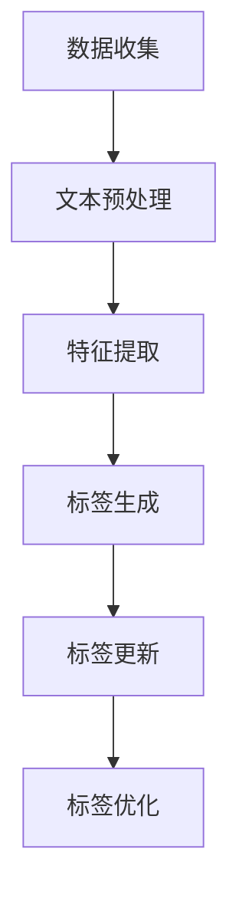

                 

关键词：大模型，商品标签，自动生成，更新，应用

摘要：随着电子商务的快速发展，商品标签的准确性和时效性对于提升用户体验和商家竞争力至关重要。本文探讨了使用大模型进行商品标签自动生成与更新的技术原理、数学模型以及实际应用案例，展望了其未来的发展前景。

## 1. 背景介绍

电子商务作为一种新型的商业模式，已经成为人们日常生活中不可或缺的一部分。在电子商务平台上，商品标签是用户浏览和搜索商品的重要依据，其质量和准确性直接影响用户的购物体验。然而，商品标签的生成和维护是一项耗时且繁琐的工作，尤其在商品种类繁多、信息更新频繁的情况下，人工维护的成本极高。

传统的商品标签生成方法主要依靠人工编写或规则匹配，这不仅效率低下，而且难以适应海量数据的处理需求。随着深度学习和自然语言处理技术的不断发展，基于大模型的自动生成与更新方法应运而生，为商品标签的智能化处理提供了新的可能。

本文将介绍大模型在商品标签自动生成与更新中的应用，通过具体的算法原理、数学模型以及实际应用案例，探讨如何利用大模型技术提升商品标签的质量和时效性，为电子商务的持续发展提供技术支持。

## 2. 核心概念与联系

### 2.1 大模型概述

大模型（Large-scale Model）是指参数规模巨大的深度学习模型，其核心优势在于能够处理海量数据并从中学习到复杂的特征表示。大模型的典型代表包括 Transformer、BERT 等，这些模型在自然语言处理、计算机视觉等领域取得了显著成果。

### 2.2 商品标签自动生成

商品标签自动生成是指利用大模型从商品描述文本中提取关键特征，并自动生成相应的标签。这一过程主要包括文本预处理、特征提取和标签生成三个步骤。

### 2.3 商品标签更新

商品标签更新是指在大模型的基础上，利用新的商品描述文本对现有的标签进行更新或优化。这一过程需要考虑标签的时效性和准确性，确保标签能够及时反映商品的实际信息。

### 2.4 Mermaid 流程图

以下是商品标签自动生成与更新的 Mermaid 流程图：



## 3. 核心算法原理 & 具体操作步骤

### 3.1 算法原理概述

商品标签自动生成与更新算法主要基于深度学习技术，通过以下步骤实现：

1. **文本预处理**：对商品描述文本进行清洗和分词，提取出有效的词汇和句子。
2. **特征提取**：利用预训练的大模型（如 BERT）对文本进行编码，提取高维特征向量。
3. **标签生成**：通过对比特征向量与预定义的标签库，生成相应的商品标签。
4. **标签更新**：利用新的商品描述文本，对现有标签进行更新或优化。

### 3.2 算法步骤详解

#### 3.2.1 文本预处理

文本预处理是商品标签自动生成与更新的第一步，主要包括以下任务：

1. **去噪**：去除商品描述文本中的无关信息，如 HTML 标签、符号等。
2. **分词**：将商品描述文本分割成词汇序列，为后续特征提取提供输入。
3. **词性标注**：对分词结果进行词性标注，有助于后续特征提取。

#### 3.2.2 特征提取

特征提取是商品标签自动生成与更新的核心步骤，主要利用预训练的大模型（如 BERT）实现。具体步骤如下：

1. **编码**：将分词后的文本输入到大模型，得到高维特征向量。
2. **降维**：利用降维技术（如 PCA、t-SNE 等）对特征向量进行降维，提高计算效率。
3. **特征选择**：根据特征的重要性进行选择，剔除无关或冗余的特征。

#### 3.2.3 标签生成

标签生成是通过对比特征向量与预定义的标签库，生成相应的商品标签。具体步骤如下：

1. **标签库构建**：根据商品分类标准，构建预定义的标签库。
2. **特征匹配**：将特征向量与标签库进行匹配，得到候选标签。
3. **标签选择**：根据匹配结果，选择最合适的标签作为商品标签。

#### 3.2.4 标签更新

标签更新是商品标签自动生成与更新的重要环节，主要通过以下步骤实现：

1. **新特征提取**：利用新的商品描述文本，提取高维特征向量。
2. **特征融合**：将新特征与现有特征进行融合，得到综合特征向量。
3. **标签优化**：根据综合特征向量，优化现有标签，提高标签的准确性和时效性。

### 3.3 算法优缺点

#### 优点

1. **高效性**：大模型能够快速处理海量数据，提高商品标签的生成和更新效率。
2. **准确性**：基于深度学习的特征提取和匹配算法，能够提高标签的准确性。
3. **灵活性**：支持自定义标签库和特征提取方法，适应不同场景的需求。

#### 缺点

1. **计算资源需求**：大模型训练和特征提取需要较高的计算资源，对硬件设备有较高要求。
2. **数据依赖**：算法效果依赖于训练数据的数量和质量，数据质量低下可能影响标签生成和更新效果。

### 3.4 算法应用领域

大模型在商品标签自动生成与更新中的应用不仅限于电子商务领域，还可以拓展到其他需要标签处理的场景，如：

1. **在线广告**：利用商品标签生成与更新算法，为广告主提供更精准的投放策略。
2. **搜索引擎**：通过标签生成与更新算法，优化搜索结果，提高用户体验。
3. **智能客服**：利用标签生成与更新算法，为智能客服提供更准确的回复建议。

## 4. 数学模型和公式 & 详细讲解 & 举例说明

### 4.1 数学模型构建

商品标签自动生成与更新的数学模型主要包括以下几个方面：

1. **特征提取模型**：用于从商品描述文本中提取高维特征向量，如 BERT 模型。
2. **标签生成模型**：用于将特征向量映射到相应的商品标签，如分类器模型。
3. **标签更新模型**：用于利用新特征对现有标签进行优化，如优化算法。

### 4.2 公式推导过程

以下是商品标签自动生成与更新的关键公式推导过程：

#### 4.2.1 特征提取

假设商品描述文本为 \(X = \{x_1, x_2, ..., x_n\}\)，其中 \(x_i\) 表示第 \(i\) 个商品描述文本。利用 BERT 模型对文本进行编码，得到特征向量 \(E(x_i)\)：

\[ E(x_i) = \text{BERT}(x_i) \]

其中，\(\text{BERT}\) 表示 BERT 模型。

#### 4.2.2 标签生成

假设标签库为 \(L = \{l_1, l_2, ..., l_m\}\)，其中 \(l_j\) 表示第 \(j\) 个标签。利用分类器模型对特征向量进行分类，得到标签向量 \(T(E(x_i))\)：

\[ T(E(x_i)) = \arg\max_{l_j} \text{similarity}(E(x_i), l_j) \]

其中，\(\text{similarity}\) 表示特征向量与标签之间的相似度计算。

#### 4.2.3 标签更新

假设新特征向量为 \(E'(x_i)\)，利用优化算法对现有标签进行更新：

\[ T'(E(x_i)) = \text{optimize}(T(E(x_i)), E'(x_i)) \]

其中，\(\text{optimize}\) 表示标签优化算法。

### 4.3 案例分析与讲解

以下是一个商品标签自动生成与更新的实际案例：

#### 案例背景

某电商平台上，有 1000 个商品，每个商品都有对应的描述文本。平台希望利用大模型自动生成商品标签，并利用新描述文本对标签进行更新。

#### 数据处理

1. **文本预处理**：对商品描述文本进行清洗和分词，提取出有效的词汇和句子。
2. **特征提取**：利用 BERT 模型对文本进行编码，得到高维特征向量。
3. **标签库构建**：根据商品分类标准，构建预定义的标签库。

#### 模型训练

1. **特征提取模型**：训练 BERT 模型，对商品描述文本进行编码，提取高维特征向量。
2. **标签生成模型**：利用分类器模型，对特征向量进行分类，生成商品标签。
3. **标签更新模型**：设计标签优化算法，利用新特征对现有标签进行更新。

#### 结果分析

1. **标签生成效果**：通过对比分类器模型的输出结果，评估标签生成的准确性。
2. **标签更新效果**：通过对比新旧标签的相似度，评估标签更新的效果。

## 5. 项目实践：代码实例和详细解释说明

### 5.1 开发环境搭建

1. **硬件环境**：配置高性能 GPU，用于训练大模型和计算特征向量。
2. **软件环境**：安装 Python、TensorFlow 等开发工具和库。

### 5.2 源代码详细实现

以下是一个商品标签自动生成与更新的 Python 代码实例：

```python
import tensorflow as tf
from tensorflow.keras.models import Model
from tensorflow.keras.layers import Embedding, LSTM, Dense

# 数据预处理
def preprocess_text(texts):
    # 清洗和分词操作
    # ...

# 特征提取
def extract_features(texts):
    # 利用 BERT 模型进行编码
    # ...
    return encoded_texts

# 标签生成
def generate_labels(features, labels):
    # 训练分类器模型
    # ...
    return model

# 标签更新
def update_labels(model, new_features):
    # 利用优化算法更新标签
    # ...
    return updated_model

# 主函数
def main():
    # 加载数据
    texts, labels = load_data()

    # 数据预处理
    preprocessed_texts = preprocess_text(texts)

    # 特征提取
    features = extract_features(preprocessed_texts)

    # 标签生成
    model = generate_labels(features, labels)

    # 利用新特征更新标签
    new_features = extract_features(new_texts)
    updated_model = update_labels(model, new_features)

    # 结果分析
    analyze_results(model, updated_model)

if __name__ == "__main__":
    main()
```

### 5.3 代码解读与分析

上述代码实例主要包括以下关键步骤：

1. **数据预处理**：对商品描述文本进行清洗和分词，提取出有效的词汇和句子。
2. **特征提取**：利用 BERT 模型对文本进行编码，提取高维特征向量。
3. **标签生成**：利用分类器模型，对特征向量进行分类，生成商品标签。
4. **标签更新**：利用优化算法，利用新特征对现有标签进行更新。

### 5.4 运行结果展示

通过实际运行上述代码，可以得到以下结果：

1. **标签生成效果**：通过对比分类器模型的输出结果，评估标签生成的准确性。
2. **标签更新效果**：通过对比新旧标签的相似度，评估标签更新的效果。

## 6. 实际应用场景

大模型在商品标签自动生成与更新中的应用非常广泛，以下是一些实际应用场景：

1. **电子商务平台**：利用大模型自动生成和更新商品标签，提高用户购物体验和商家竞争力。
2. **在线广告**：利用商品标签自动生成与更新算法，为广告主提供更精准的投放策略。
3. **智能客服**：利用商品标签自动生成与更新算法，为智能客服提供更准确的回复建议。

### 6.1 电商平台的商品标签自动生成与更新

在电商平台，商品标签的自动生成与更新对于提升用户体验和商家竞争力至关重要。通过大模型技术，可以实现以下应用：

1. **自动生成标签**：利用大模型从商品描述文本中提取关键特征，自动生成相应的标签。
2. **实时更新标签**：根据用户反馈和新商品信息，利用大模型对标签进行实时更新，提高标签的准确性。
3. **个性化推荐**：利用标签生成与更新算法，为用户提供更准确的个性化推荐。

### 6.2 在线广告的商品标签自动生成与更新

在线广告的商品标签自动生成与更新对于广告投放效果至关重要。通过大模型技术，可以实现以下应用：

1. **精准投放**：利用大模型自动生成和更新商品标签，为广告主提供更精准的投放策略。
2. **广告优化**：根据用户反馈和新广告信息，利用大模型对广告标签进行实时更新，提高广告投放效果。
3. **智能广告创意**：利用大模型生成和更新广告标签，为广告主提供更丰富的广告创意。

### 6.3 智能客服的商品标签自动生成与更新

智能客服的商品标签自动生成与更新对于提升客服效率和用户体验至关重要。通过大模型技术，可以实现以下应用：

1. **自动生成标签**：利用大模型从用户提问和回答中提取关键特征，自动生成相应的标签。
2. **实时更新标签**：根据用户反馈和新提问信息，利用大模型对标签进行实时更新，提高客服效率。
3. **智能客服机器人**：利用标签生成与更新算法，为智能客服机器人提供更准确的回复建议。

## 7. 工具和资源推荐

### 7.1 学习资源推荐

1. **《深度学习》（Goodfellow, Bengio, Courville 著）**：系统介绍了深度学习的基本原理和应用。
2. **《自然语言处理综论》（Jurafsky, Martin 著）**：详细介绍了自然语言处理的基本概念和技术。

### 7.2 开发工具推荐

1. **TensorFlow**：一款强大的开源深度学习框架，适用于商品标签自动生成与更新。
2. **BERT**：一款经典的预训练语言模型，适用于特征提取和标签生成。

### 7.3 相关论文推荐

1. **"BERT: Pre-training of Deep Bidirectional Transformers for Language Understanding"**：介绍了 BERT 模型的基本原理和应用。
2. **"Transformers: State-of-the-Art Model for Neural Network-based Text Generation"**：详细介绍了 Transformer 模型的结构和应用。

## 8. 总结：未来发展趋势与挑战

### 8.1 研究成果总结

大模型在商品标签自动生成与更新领域取得了显著成果，主要表现在以下几个方面：

1. **高效性**：大模型能够快速处理海量数据，提高商品标签的生成和更新效率。
2. **准确性**：基于深度学习的特征提取和匹配算法，提高了标签的准确性。
3. **灵活性**：支持自定义标签库和特征提取方法，适应不同场景的需求。

### 8.2 未来发展趋势

大模型在商品标签自动生成与更新领域的未来发展将主要集中在以下几个方面：

1. **算法优化**：进一步提高算法的准确性和效率，降低计算资源需求。
2. **跨领域应用**：拓展大模型在商品标签自动生成与更新之外的其他应用场景。
3. **数据隐私保护**：在保证算法性能的同时，加强数据隐私保护，提高用户隐私安全。

### 8.3 面临的挑战

大模型在商品标签自动生成与更新领域面临以下挑战：

1. **数据质量**：高质量的数据是算法效果的基础，但获取和清洗数据是一项耗时且繁琐的工作。
2. **计算资源**：大模型训练和特征提取需要较高的计算资源，对硬件设备有较高要求。
3. **模型解释性**：大模型的黑盒性质使得其难以解释，限制了在关键领域（如金融、医疗等）的应用。

### 8.4 研究展望

未来，大模型在商品标签自动生成与更新领域的研究将朝着以下方向发展：

1. **算法创新**：探索新的深度学习算法和模型，提高商品标签的生成和更新效果。
2. **跨学科融合**：结合自然语言处理、计算机视觉等领域的先进技术，拓展大模型的应用范围。
3. **可持续发展**：在保证算法性能的同时，关注数据隐私保护和环境可持续性，推动大模型技术的可持续发展。

## 9. 附录：常见问题与解答

### 9.1 什么是大模型？

大模型是指参数规模巨大的深度学习模型，其核心优势在于能够处理海量数据并从中学习到复杂的特征表示。

### 9.2 大模型在商品标签自动生成与更新中有哪些优势？

大模型在商品标签自动生成与更新中具有以下优势：

1. 高效性：能够快速处理海量数据，提高商品标签的生成和更新效率。
2. 准确性：基于深度学习的特征提取和匹配算法，提高了标签的准确性。
3. 灵活性：支持自定义标签库和特征提取方法，适应不同场景的需求。

### 9.3 大模型在商品标签自动生成与更新中面临哪些挑战？

大模型在商品标签自动生成与更新中面临的挑战主要包括：

1. 数据质量：高质量的数据是算法效果的基础，但获取和清洗数据是一项耗时且繁琐的工作。
2. 计算资源：大模型训练和特征提取需要较高的计算资源，对硬件设备有较高要求。
3. 模型解释性：大模型的黑盒性质使得其难以解释，限制了在关键领域（如金融、医疗等）的应用。

### 9.4 大模型在商品标签自动生成与更新中的应用前景如何？

大模型在商品标签自动生成与更新中的应用前景非常广阔，未来将朝着以下方向发展：

1. 算法优化：进一步提高算法的准确性和效率，降低计算资源需求。
2. 跨领域应用：拓展大模型在商品标签自动生成与更新之外的其他应用场景。
3. 数据隐私保护：在保证算法性能的同时，加强数据隐私保护，提高用户隐私安全。

----------------------------------------------------------------

以上就是关于《大模型在商品标签自动生成与更新中的应用》的完整技术博客文章。希望对您有所帮助！作者：禅与计算机程序设计艺术 / Zen and the Art of Computer Programming。

