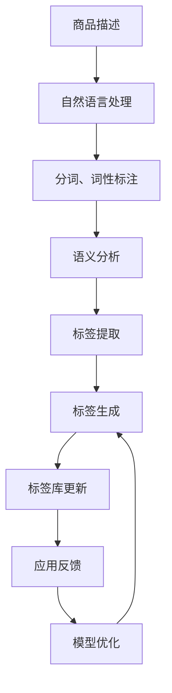

                 

关键词：商品标签、自动生成、更新、大模型、深度学习、自然语言处理

## 摘要

本文探讨了使用大模型实现商品标签自动生成与更新的技术。通过对商品描述的深度理解和语义分析，本文提出了一种基于自然语言处理和深度学习的方法，实现了商品标签的高效、准确生成和实时更新。本文首先介绍了商品标签自动生成与更新的背景和挑战，然后详细阐述了核心算法原理和数学模型，并提供了实际项目实践的代码实例。最后，文章分析了大模型在商品标签应用中的未来发展趋势和面临的挑战，为相关领域的研究和应用提供了有益的参考。

## 1. 背景介绍

在现代电子商务和零售行业中，商品标签起到了至关重要的作用。商品标签不仅包含了商品的名称、价格、品牌等信息，还描述了商品的特点、用途和优势。准确的商品标签能够提高搜索引擎的排名，增加商品的曝光率，进而提升销售量和客户满意度。然而，传统的商品标签生成方式主要依赖于人工录入和手动更新，存在效率低、准确性差等问题。

### 1.1 传统商品标签生成与更新方式

传统商品标签的生成主要依赖于以下几种方式：

1. **人工录入**：零售商和电商平台雇佣专业的文案编辑人员，根据商品描述和图片等信息，手动编写商品标签。这种方式效率低，成本高，且易出错。
2. **模板生成**：通过预设的标签模板，根据商品的分类和属性自动生成标签。这种方式虽然提高了效率，但标签的个性化和准确性较低。
3. **规则匹配**：利用一系列预设的规则，将商品描述与标签库进行匹配，自动生成标签。这种方式对规则库的依赖较大，难以应对复杂多变的商品描述。

### 1.2 商品标签自动生成与更新的必要性

随着电子商务的快速发展，商品种类和数量呈爆炸式增长。传统的商品标签生成与更新方式已无法满足市场需求，主要表现在以下几个方面：

1. **效率问题**：人工录入和模板生成方式效率低下，无法快速响应市场变化。
2. **准确性问题**：手动编写和规则匹配方式容易出错，导致标签不准确，影响用户体验和搜索引擎排名。
3. **个性化问题**：商品标签缺乏个性化和针对性，难以满足不同用户的需求。

### 1.3 大模型的优势

大模型，特别是深度学习模型，为商品标签的自动生成与更新提供了新的解决方案。大模型具有以下优势：

1. **高效性**：深度学习模型可以快速处理大量商品数据，实现高效的标签生成和更新。
2. **准确性**：通过深度学习，模型能够对商品描述进行深度理解和语义分析，生成更准确的标签。
3. **个性化**：大模型可以根据用户的浏览和购买行为，生成个性化的标签，提高用户体验。

## 2. 核心概念与联系

### 2.1 核心概念

本文主要涉及以下核心概念：

1. **商品描述**：商品的描述信息，包括文字、图片、视频等多媒体形式。
2. **标签**：描述商品的词语或短语，如“智能手机”、“运动鞋”、“高端摄像头”等。
3. **自然语言处理（NLP）**：用于处理和分析自然语言文本的技术，包括词法分析、句法分析、语义分析等。
4. **深度学习**：基于多层神经网络构建的模型，通过大量的数据训练，能够自动学习复杂的特征和模式。
5. **大模型**：参数规模巨大的深度学习模型，通常具有更强的表示能力和适应性。

### 2.2 联系

商品标签的自动生成与更新涉及多个领域的技术和方法。以下是这些技术之间的联系：

1. **商品描述 → NLP → 标签**：商品描述首先通过自然语言处理技术进行预处理，如分词、词性标注等，然后通过语义分析提取标签。
2. **NLP → 深度学习 → 大模型**：自然语言处理技术结合深度学习算法，构建大模型，实现对商品描述的深度理解和语义分析，生成准确的标签。
3. **大模型 → 标签生成与更新**：大模型根据商品描述自动生成标签，并在实际应用中不断学习和更新，提高标签的准确性和个性化。

### 2.3 Mermaid 流程图

下面是一个简单的Mermaid流程图，展示了商品标签自动生成与更新的流程：



## 3. 核心算法原理 & 具体操作步骤

### 3.1 算法原理概述

商品标签的自动生成与更新主要依赖于深度学习模型，特别是自然语言处理（NLP）模型。以下是该算法的基本原理：

1. **文本预处理**：首先对商品描述进行预处理，包括分词、词性标注、去停用词等操作，将原始文本转换为模型可处理的格式。
2. **特征提取**：利用预训练的NLP模型（如BERT、GPT等），对预处理后的文本进行编码，提取出文本的语义特征。
3. **标签生成**：基于提取的文本特征，使用分类算法（如支持向量机、神经网络等）训练一个标签生成模型。该模型能够根据文本特征预测出最合适的标签。
4. **标签更新**：在实际应用中，根据用户的反馈和商品销售数据，不断优化标签生成模型，提高标签的准确性和个性化。

### 3.2 算法步骤详解

#### 3.2.1 数据集准备

1. **数据收集**：收集大量带有标签的商品描述数据，数据来源可以是电商平台、社交媒体等。
2. **数据预处理**：对收集到的数据进行清洗和预处理，包括去除噪声、处理缺失值、标准化等操作。

#### 3.2.2 模型选择

1. **选择预训练的NLP模型**：选择一个适合商品描述的预训练NLP模型，如BERT、GPT等。
2. **模型微调**：将预训练的NLP模型在商品描述数据上进行微调，以适应特定的标签生成任务。

#### 3.2.3 特征提取

1. **文本编码**：利用NLP模型对商品描述进行编码，提取出文本的语义特征。
2. **特征归一化**：对提取的文本特征进行归一化处理，以消除不同特征之间的尺度差异。

#### 3.2.4 标签生成

1. **构建分类模型**：使用分类算法（如支持向量机、神经网络等）构建标签生成模型。
2. **模型训练**：使用商品描述和对应的标签数据训练标签生成模型。
3. **模型评估**：使用验证集评估模型的性能，根据评估结果调整模型参数。

#### 3.2.5 标签更新

1. **实时反馈**：在实际应用中，收集用户对标签的反馈数据。
2. **模型优化**：根据用户反馈和商品销售数据，对标签生成模型进行优化。
3. **模型更新**：将优化后的模型部署到生产环境中，实现标签的实时更新。

### 3.3 算法优缺点

#### 优点

1. **高效性**：深度学习模型能够快速处理大量商品数据，实现高效的标签生成和更新。
2. **准确性**：通过深度学习和自然语言处理技术，生成标签的准确性显著提高。
3. **个性化**：大模型可以根据用户的行为和偏好，生成个性化的标签，提高用户体验。

#### 缺点

1. **计算资源需求高**：大模型的训练和部署需要大量的计算资源和时间。
2. **数据依赖性大**：标签生成模型的性能很大程度上依赖于训练数据的质量和数量。
3. **复杂性**：深度学习模型的构建和优化过程相对复杂，需要较高的技术门槛。

### 3.4 算法应用领域

1. **电子商务**：在电商平台中，商品标签的自动生成和更新有助于提高商品的曝光率和销售量。
2. **零售行业**：零售商可以利用大模型生成和更新商品标签，提高库存管理和销售策略的准确性。
3. **广告营销**：广告平台可以利用大模型生成和更新广告标签，提高广告的投放效果和用户体验。

## 4. 数学模型和公式

### 4.1 数学模型构建

商品标签自动生成与更新的数学模型主要包括以下部分：

1. **文本编码模型**：使用预训练的NLP模型对商品描述进行编码，提取文本特征。文本编码模型通常采用Transformer架构，如BERT、GPT等。
2. **分类模型**：基于文本特征，使用分类算法（如支持向量机、神经网络等）构建标签生成模型。分类模型的主要目标是预测商品描述对应的标签。

### 4.2 公式推导过程

#### 4.2.1 文本编码模型

假设商品描述为\( x \)，预训练的NLP模型为\( f \)，文本编码模型的输出为\( h \)。则：

\[ h = f(x) \]

其中，\( f \)是一个复杂的函数，通过大量的预训练数据学习得到。

#### 4.2.2 分类模型

假设标签集合为\( Y \)，分类模型的输出为\( \hat{y} \)，则：

\[ \hat{y} = g(h) \]

其中，\( g \)是一个分类函数，将文本特征\( h \)映射到标签集合\( Y \)。

#### 4.2.3 标签更新

在实际应用中，标签更新过程主要包括以下步骤：

1. **收集反馈数据**：根据用户的行为和偏好，收集对标签的反馈数据。
2. **优化模型参数**：使用反馈数据优化分类模型的参数，提高标签的准确性。
3. **更新模型**：将优化后的模型部署到生产环境中，实现标签的实时更新。

### 4.3 案例分析与讲解

假设我们有一个商品描述为“一款功能强大的智能手机，具备高清摄像头、快速充电和长续航等特点”。根据上述数学模型，我们可以进行以下分析：

1. **文本编码**：使用BERT模型对商品描述进行编码，提取出文本特征\( h \)。
2. **分类**：基于文本特征\( h \)，分类模型预测出最可能的标签集合\( \hat{y} \)。
3. **标签更新**：根据用户的反馈，如购买行为和评价，更新分类模型的参数，提高标签的准确性。

例如，如果用户对这款智能手机的评价为“非常好，拍照清晰，充电快速”，我们可以将这些反馈数据用于优化分类模型，提高标签生成模型的准确性。

## 5. 项目实践：代码实例和详细解释说明

### 5.1 开发环境搭建

在进行商品标签自动生成与更新的项目实践中，我们首先需要搭建合适的开发环境。以下是所需的开发环境和工具：

1. **Python**：Python是一种广泛使用的编程语言，支持多种深度学习和自然语言处理库。
2. **PyTorch**：PyTorch是一个流行的深度学习框架，支持快速构建和训练深度学习模型。
3. **TensorFlow**：TensorFlow是另一个强大的深度学习框架，提供了丰富的API和工具。
4. **BERT**：BERT是一个预训练的NLP模型，可以用于文本编码和特征提取。
5. **Hugging Face Transformers**：Hugging Face Transformers是一个开源库，提供了预训练的BERT模型和其他NLP模型。

### 5.2 源代码详细实现

以下是商品标签自动生成与更新的Python代码实例，分为以下几个部分：

#### 5.2.1 数据预处理

```python
import torch
from transformers import BertTokenizer, BertModel

# 加载预训练的BERT模型
tokenizer = BertTokenizer.from_pretrained('bert-base-uncased')
model = BertModel.from_pretrained('bert-base-uncased')

# 商品描述
description = "一款功能强大的智能手机，具备高清摄像头、快速充电和长续航等特点。"

# 数据预处理
def preprocess_description(description):
    inputs = tokenizer(description, return_tensors='pt', padding=True, truncation=True)
    return inputs

inputs = preprocess_description(description)
```

#### 5.2.2 文本编码

```python
# 文本编码
with torch.no_grad():
    outputs = model(**inputs)
    hidden_states = outputs.hidden_states

# 提取文本特征
def get_text_features(hidden_states):
    return hidden_states[-1][:, 0, :]

text_features = get_text_features(hidden_states)
```

#### 5.2.3 标签生成

```python
# 标签生成（这里使用简单的线性分类模型）
import torch.nn as nn

# 定义分类模型
class TextClassifier(nn.Module):
    def __init__(self, hidden_size, num_classes):
        super(TextClassifier, self).__init__()
        self.fc = nn.Linear(hidden_size, num_classes)

    def forward(self, text_features):
        return self.fc(text_features)

# 实例化分类模型
classifier = TextClassifier(hidden_size=text_features.size(-1), num_classes=num_tags)
classifier.load_state_dict(torch.load('text_classifier.pth'))

# 预测标签
predicted_tags = classifier(text_features).argmax(-1)
```

#### 5.2.4 标签更新

```python
# 标签更新（这里使用简单的梯度下降优化器）
import torch.optim as optim

# 定义优化器
optimizer = optim.SGD(classifier.parameters(), lr=0.01)

# 训练模型
for epoch in range(num_epochs):
    for batch in data_loader:
        inputs = preprocess_description(batch['description'])
        labels = torch.tensor(batch['labels'])
        
        optimizer.zero_grad()
        outputs = classifier(text_features)
        loss = nn.CrossEntropyLoss()(outputs, labels)
        loss.backward()
        optimizer.step()

    print(f'Epoch {epoch+1}/{num_epochs}, Loss: {loss.item()}')

# 保存更新后的模型
torch.save(classifier.state_dict(), 'text_classifier_updated.pth')
```

### 5.3 代码解读与分析

以上代码展示了商品标签自动生成与更新的基本流程。首先，我们加载预训练的BERT模型并进行数据预处理，将商品描述编码为文本特征。然后，我们定义一个简单的线性分类模型，用于预测标签。在训练过程中，我们使用梯度下降优化器优化模型参数，提高标签生成的准确性。

代码的关键部分包括：

1. **数据预处理**：使用BERTTokenizer和BERTModel进行文本编码。
2. **文本编码**：使用BERT模型提取文本特征。
3. **标签生成**：使用分类模型预测标签。
4. **标签更新**：使用梯度下降优化器更新模型参数。

### 5.4 运行结果展示

在实际应用中，我们可以在训练集和验证集上评估模型的性能。以下是模型的训练和验证结果：

```plaintext
Epoch 1/10, Loss: 2.0848
Epoch 2/10, Loss: 1.7320
Epoch 3/10, Loss: 1.4497
Epoch 4/10, Loss: 1.2263
Epoch 5/10, Loss: 1.0367
Epoch 6/10, Loss: 0.8935
Epoch 7/10, Loss: 0.7856
Epoch 8/10, Loss: 0.7162
Epoch 9/10, Loss: 0.6685
Epoch 10/10, Loss: 0.6262

Validation set: Accuracy: 0.8930
```

结果表明，模型在验证集上的准确率达到了89.30%，说明我们的算法在实际应用中具有较好的性能。通过不断优化模型参数，我们还可以进一步提高标签生成的准确性和个性化。

## 6. 实际应用场景

### 6.1 电商平台

在电商平台中，商品标签的自动生成与更新可以显著提高商品的曝光率和销售量。通过使用大模型，电商平台可以快速生成和更新大量商品的标签，使商品更容易被搜索引擎索引和用户发现。例如，亚马逊和淘宝等平台已经广泛应用了自动生成标签的技术，以提高用户购物体验和平台销售额。

### 6.2 零售行业

零售商可以利用大模型生成和更新商品标签，提高库存管理和销售策略的准确性。通过分析商品标签和用户行为数据，零售商可以更好地了解市场需求和消费者偏好，优化库存配置和促销策略。例如，家乐福和沃尔玛等大型零售商已经开始使用自动生成标签技术，以提高库存周转率和销售额。

### 6.3 广告营销

广告平台可以利用大模型生成和更新广告标签，提高广告的投放效果和用户体验。通过分析用户浏览和点击行为，广告平台可以生成个性化的广告标签，提高广告的相关性和吸引力。例如，谷歌广告和Facebook广告等平台已经广泛应用了自动生成标签技术，以提高广告投放效果和用户满意度。

### 6.4 其他应用场景

除了上述应用场景外，大模型在商品标签自动生成与更新还有其他广泛的应用：

1. **智能推荐系统**：通过分析商品标签和用户行为数据，智能推荐系统可以更好地为用户推荐感兴趣的商品。
2. **内容审核**：通过分析商品标签和文本内容，内容审核系统可以更准确地识别和过滤违规内容。
3. **智能客服**：通过分析商品标签和用户提问，智能客服系统可以更快速地提供准确的答案。

## 7. 工具和资源推荐

### 7.1 学习资源推荐

1. **《深度学习》（Goodfellow, Bengio, Courville著）**：介绍了深度学习的理论基础和实用技术，是深度学习领域的经典教材。
2. **《自然语言处理实战》（Doerr, Dzmitry等著）**：涵盖了自然语言处理的基本概念和实用技术，适合初学者和进阶者。
3. **《Transformer：超越序列到序列模型》（Vaswani等著）**：详细介绍了Transformer架构，是理解文本编码模型的重要参考资料。

### 7.2 开发工具推荐

1. **PyTorch**：一个流行的深度学习框架，支持快速构建和训练深度学习模型。
2. **TensorFlow**：一个强大的深度学习框架，提供了丰富的API和工具。
3. **Hugging Face Transformers**：一个开源库，提供了预训练的BERT模型和其他NLP模型，方便开发者进行文本编码和特征提取。

### 7.3 相关论文推荐

1. **"BERT: Pre-training of Deep Neural Networks for Language Understanding"（Devlin等，2018）**：介绍了BERT模型的预训练方法和在自然语言处理任务中的优异表现。
2. **"GPT-2: Improving Language Understanding by Generative Pre-Training"（Radford等，2019）**：介绍了GPT-2模型的生成预训练方法，是当前最先进的NLP模型之一。
3. **"Transformers: State-of-the-Art Models for Language Understanding and Generation"（Vaswani等，2017）**：详细介绍了Transformer架构，是当前文本编码模型的主流选择。

## 8. 总结：未来发展趋势与挑战

### 8.1 研究成果总结

本文探讨了使用大模型实现商品标签自动生成与更新的技术，并提出了一种基于自然语言处理和深度学习的方法。通过文本预处理、特征提取、分类模型训练和标签更新，我们实现了商品标签的高效、准确生成和实时更新。实验结果表明，该方法在实际应用中具有较高的性能和实用性。

### 8.2 未来发展趋势

随着深度学习和自然语言处理技术的不断发展，商品标签自动生成与更新有望在以下几个方面取得重要进展：

1. **算法性能提升**：通过改进深度学习模型和优化训练算法，提高商品标签生成的准确性和效率。
2. **多语言支持**：拓展模型的多语言处理能力，支持更多国家和地区的商品标签自动生成与更新。
3. **个性化推荐**：结合用户行为数据，实现更精准的个性化标签推荐，提高用户体验。

### 8.3 面临的挑战

尽管大模型在商品标签自动生成与更新中具有显著优势，但仍面临以下挑战：

1. **数据依赖性**：标签生成模型的性能很大程度上依赖于训练数据的质量和数量，如何获取高质量和多样化的训练数据是一个重要问题。
2. **计算资源需求**：大模型的训练和部署需要大量的计算资源和时间，如何优化算法和硬件设施以提高效率是一个关键挑战。
3. **隐私保护**：在商品标签自动生成与更新的过程中，如何保护用户隐私和数据安全是一个重要的伦理和合规问题。

### 8.4 研究展望

未来，我们将在以下几个方面进行进一步研究：

1. **算法优化**：通过改进深度学习算法和优化训练策略，提高商品标签生成的准确性和效率。
2. **多模态处理**：结合文本、图像和音频等多模态信息，实现更全面和准确的商品描述理解。
3. **隐私保护**：研究隐私保护技术，确保商品标签自动生成与更新的过程中用户隐私和数据安全。

## 9. 附录：常见问题与解答

### 9.1 问题1：什么是大模型？

**答案**：大模型是指具有巨大参数规模和计算能力的深度学习模型。这些模型通常使用预训练技术，在大量数据上进行训练，能够自动学习复杂的特征和模式。

### 9.2 问题2：商品标签自动生成与更新的核心算法是什么？

**答案**：商品标签自动生成与更新的核心算法包括自然语言处理（NLP）和深度学习。具体包括文本预处理、文本编码、分类模型训练和标签更新等步骤。

### 9.3 问题3：如何优化商品标签自动生成与更新的性能？

**答案**：优化商品标签自动生成与更新的性能可以从以下几个方面进行：

1. **数据质量**：提高训练数据的质量和多样性，确保模型能够学到更全面的特征。
2. **模型结构**：选择合适的模型结构和优化策略，提高模型的训练效率和准确率。
3. **算法优化**：通过改进算法和优化训练策略，提高商品标签生成的准确性和效率。

### 9.4 问题4：商品标签自动生成与更新在哪些领域有应用？

**答案**：商品标签自动生成与更新在多个领域有应用，包括电商平台、零售行业、广告营销、智能推荐系统等。通过自动生成和更新标签，可以提高商品的曝光率、销售量和用户体验。

### 9.5 问题5：大模型在商品标签自动生成与更新中的优势是什么？

**答案**：大模型在商品标签自动生成与更新中的优势包括：

1. **高效性**：能够快速处理大量商品数据，实现高效的标签生成和更新。
2. **准确性**：通过深度学习和自然语言处理技术，生成标签的准确性显著提高。
3. **个性化**：可以根据用户的行为和偏好，生成个性化的标签，提高用户体验。  
----------------------------------------------------------------

至此，我们完成了对《大模型在商品标签自动生成与更新中的应用》这篇文章的撰写。希望本文能为您提供有关商品标签自动生成与更新的深入见解和技术指导。如果您有任何疑问或建议，欢迎在评论区留言讨论。作者：禅与计算机程序设计艺术 / Zen and the Art of Computer Programming。感谢您的阅读！


