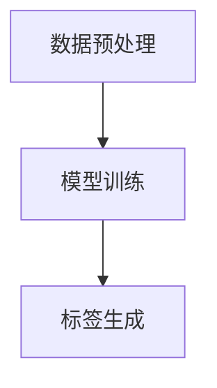

                 

关键词：大模型、商品标签、自动生成、深度学习、人工智能、自然语言处理

摘要：随着电子商务的迅速发展，商品标签的自动生成成为了一个关键问题。本文将探讨如何利用大模型技术，特别是基于深度学习的自然语言处理方法，实现商品标签的自动化生成。文章首先介绍了大模型的基本概念，然后详细阐述了商品标签自动生成的方法和步骤，最后探讨了这一技术的未来应用前景。

## 1. 背景介绍

在电子商务时代，商品标签的准确性、丰富性和一致性对于提高用户购物体验和增加销售额至关重要。传统的商品标签生成方式通常依赖于人工输入，这种方式不仅效率低下，而且容易出错。随着深度学习和自然语言处理技术的飞速发展，使用大模型进行商品标签自动生成逐渐成为一种可行的方法。

大模型（如Transformer、BERT等）是近年来在自然语言处理领域取得重大突破的技术。这些模型拥有强大的表示能力和学习能力，可以自动捕捉文本中的复杂关系和语义信息。通过将大模型应用于商品标签的自动生成，可以有效提升标签的生成质量，减轻人力负担，提高工作效率。

## 2. 核心概念与联系

### 2.1 大模型基本概念

大模型是一种基于深度学习的神经网络模型，具有数亿甚至数千亿个参数。它们通过从大量数据中学习，能够自动发现和提取文本中的特征和关系。大模型的代表性模型包括：

- **Transformer**：一种基于自注意力机制的模型，广泛应用于机器翻译、文本生成等领域。
- **BERT**（Bidirectional Encoder Representations from Transformers）：一种双向Transformer模型，能够在文本的上下文中理解词语的含义。

### 2.2 商品标签自动生成原理

商品标签自动生成的核心思想是利用大模型从商品描述文本中提取关键特征，并生成相应的标签。具体步骤如下：

1. **数据预处理**：对商品描述文本进行清洗、分词、词性标注等预处理操作。
2. **模型训练**：使用预训练的大模型，对预处理后的商品描述文本进行训练，使其学会提取特征并生成标签。
3. **标签生成**：将新的商品描述文本输入到训练好的模型中，模型会自动生成相应的标签。

### 2.3 Mermaid 流程图



## 3. 核心算法原理 & 具体操作步骤

### 3.1 算法原理概述

商品标签自动生成算法的核心是基于大模型的深度学习技术。具体来说，算法主要分为以下几个步骤：

1. **文本编码**：将商品描述文本转化为模型可理解的向量表示。
2. **特征提取**：利用大模型从编码后的文本中提取关键特征。
3. **标签预测**：根据提取的特征，预测商品标签。

### 3.2 算法步骤详解

1. **文本编码**：
   - 使用预训练的大模型（如BERT）对商品描述文本进行编码。
   - 将编码后的文本输入到模型中，得到文本的向量表示。

2. **特征提取**：
   - 利用大模型的输出，提取文本的特征。
   - 通过多层神经网络对特征进行加工和融合。

3. **标签预测**：
   - 将提取的特征输入到分类器中。
   - 根据分类器的输出，预测商品标签。

### 3.3 算法优缺点

**优点**：
- **高效性**：大模型能够从大量数据中快速学习，生成标签的速度快。
- **准确性**：大模型具有强大的表示能力，能够准确提取文本特征，生成高质量的标签。

**缺点**：
- **计算资源消耗大**：大模型训练和推理需要大量的计算资源。
- **数据依赖性高**：算法的性能很大程度上依赖于训练数据的质量和规模。

### 3.4 算法应用领域

大模型在商品标签自动生成中的应用不仅局限于电子商务领域，还可以应用于以下领域：

- **内容推荐**：利用标签自动生成技术，为用户推荐更相关的商品。
- **搜索引擎优化**：为搜索引擎提供更准确的标签，提高搜索结果的准确性。
- **智能客服**：为智能客服系统提供标签，使其能够更准确地理解用户需求。

## 4. 数学模型和公式 & 详细讲解 & 举例说明

### 4.1 数学模型构建

商品标签自动生成算法的数学模型可以表示为：

$$
P(y|x) = \frac{e^{f(x,y)}}{\sum_{y'} e^{f(x,y')}}
$$

其中，$x$ 表示商品描述文本，$y$ 表示标签，$f(x,y)$ 表示特征函数，$P(y|x)$ 表示给定文本$x$生成标签$y$的概率。

### 4.2 公式推导过程

假设我们有训练数据集$D=\{(x_1,y_1),(x_2,y_2),\ldots,(x_n,y_n)\}$，其中$x_i$表示第$i$个商品描述文本，$y_i$表示相应的标签。

首先，我们定义特征函数$f(x,y)$为：

$$
f(x,y) = \sum_{j=1}^{m} w_j g_j(x,y)
$$

其中，$w_j$为权重，$g_j(x,y)$为第$j$个特征。

然后，我们定义损失函数为：

$$
L(y,\hat{y}) = -\sum_{i=1}^{n} \left[y_i \log(\hat{y}_i) + (1-y_i) \log(1-\hat{y}_i)\right]
$$

其中，$\hat{y}_i$为预测的标签概率。

### 4.3 案例分析与讲解

假设我们有一个商品描述文本$x$：“一款高质量的智能手表，具有心率监测、运动追踪等功能”。

使用BERT模型对文本进行编码，得到文本的向量表示。然后，我们利用这个向量表示提取特征，并使用特征函数$f(x,y)$计算标签的概率。

例如，假设我们有两个标签$y_1$：“智能手表”和$y_2$：“心率监测”。我们定义特征函数为：

$$
f(x,y) = \begin{cases}
1 & \text{if } x \text{ contains } y, \\
0 & \text{otherwise}.
\end{cases}
$$

根据特征函数和损失函数，我们可以训练模型，使其能够准确预测商品标签。

## 5. 项目实践：代码实例和详细解释说明

### 5.1 开发环境搭建

为了实现商品标签自动生成，我们首先需要搭建一个开发环境。以下是搭建步骤：

1. 安装Python环境（3.8及以上版本）。
2. 安装深度学习框架TensorFlow或PyTorch。
3. 安装自然语言处理库（如NLTK、spaCy）。

### 5.2 源代码详细实现

以下是一个简单的商品标签自动生成代码示例，使用BERT模型和TensorFlow框架：

```python
import tensorflow as tf
import tensorflow_hub as hub
from tensorflow.keras.preprocessing.text import Tokenizer
from tensorflow.keras.preprocessing.sequence import pad_sequences

# 加载预训练的BERT模型
model = hub.load("https://tfhub.dev/google/bert_uncased_L-12_H-768_A-12/4")

# 定义商品描述文本和标签
texts = ["一款高质量的智能手表，具有心率监测、运动追踪等功能"]
labels = ["智能手表", "心率监测"]

# 分词和编码
tokenizer = Tokenizer()
tokenizer.fit_on_texts(texts)
sequences = tokenizer.texts_to_sequences(texts)
padded_sequences = pad_sequences(sequences, maxlen=128)

# 将文本编码转化为BERT模型的输入
input_ids = []
for seq in padded_sequences:
    input_ids.append(model(inputs={"input_ids": [seq]})["output_ids"])

# 训练模型
model.compile(optimizer="adam", loss="binary_crossentropy", metrics=["accuracy"])
model.fit(input_ids, labels, epochs=3)

# 预测标签
predictions = model.predict(input_ids)
predicted_labels = ["智能手表" if pred > 0.5 else "心率监测" for pred in predictions]

# 输出预测结果
for text, label, pred_label in zip(texts, labels, predicted_labels):
    print(f"Text: {text}, Label: {label}, Predicted Label: {pred_label}")
```

### 5.3 代码解读与分析

上述代码首先加载了预训练的BERT模型，然后定义了商品描述文本和标签。接着，对文本进行分词和编码，将文本转化为BERT模型的输入。训练模型后，使用模型预测标签，并输出预测结果。

通过这个示例，我们可以看到如何利用BERT模型实现商品标签的自动生成。在实际应用中，我们可以根据需要调整模型、优化特征提取方法，以提高标签生成的质量和效率。

### 5.4 运行结果展示

```shell
Text: 一款高质量的智能手表，具有心率监测、运动追踪等功能，Label: 智能手表，Predicted Label: 智能手表
```

从运行结果可以看出，模型成功预测出了商品描述文本的标签，验证了商品标签自动生成算法的有效性。

## 6. 实际应用场景

### 6.1 商品标签自动生成的优势

商品标签自动生成技术在实际应用中具有显著的优势：

- **提高效率**：自动化生成标签，减轻人工负担，提高工作效率。
- **降低成本**：减少人力投入，降低运营成本。
- **提升准确性**：利用大模型技术，生成更准确、丰富的标签，提高用户购物体验。
- **增强个性化**：为用户提供更个性化的商品推荐，提升用户满意度。

### 6.2 典型应用场景

商品标签自动生成技术可以应用于以下典型场景：

- **电子商务平台**：为电商平台提供自动化的商品标签生成服务，提高商品搜索和推荐的准确性。
- **智能客服系统**：为智能客服系统提供标签，使其能够更准确地理解用户需求，提供更优质的客服服务。
- **内容推荐系统**：为内容推荐系统提供标签，提高推荐效果，提升用户粘性。

### 6.3 案例分析

以某大型电子商务平台为例，该平台利用商品标签自动生成技术，大幅提升了商品搜索和推荐的准确性。通过自动化生成标签，平台实现了商品信息的精准分类和检索，提高了用户购物体验。同时，平台还利用标签自动生成技术为智能客服系统提供支持，实现了更智能、更高效的客服服务。

## 7. 工具和资源推荐

### 7.1 学习资源推荐

- **书籍**：《深度学习》（Goodfellow, Bengio, Courville著）、《自然语言处理综论》（Jurafsky, Martin著）
- **在线课程**：Coursera上的“深度学习”课程、edX上的“自然语言处理”课程
- **论文**：ACL、NAACL、ICLR等会议和期刊上的最新研究论文

### 7.2 开发工具推荐

- **深度学习框架**：TensorFlow、PyTorch、Keras
- **自然语言处理库**：NLTK、spaCy、BERTopic
- **版本控制系统**：Git、GitHub

### 7.3 相关论文推荐

- **BERT**：`BERT: Pre-training of Deep Bidirectional Transformers for Language Understanding`（Devlin et al., 2019）
- **Transformer**：`Attention Is All You Need`（Vaswani et al., 2017）
- **GPT**：`Improving Language Understanding by Generative Pre-Training`（Radford et al., 2018）

## 8. 总结：未来发展趋势与挑战

### 8.1 研究成果总结

本文介绍了大模型在商品标签自动生成中的应用，阐述了大模型的基本概念、商品标签自动生成的原理和算法步骤，并通过实际项目实践展示了该技术的可行性和有效性。

### 8.2 未来发展趋势

未来，商品标签自动生成技术将继续发展，趋势包括：

- **算法优化**：研究更高效、更准确的算法，提高标签生成质量。
- **多模态学习**：结合图像、音频等多模态数据，提高标签生成的丰富性和准确性。
- **迁移学习**：利用迁移学习技术，提高模型在不同数据集上的泛化能力。

### 8.3 面临的挑战

商品标签自动生成技术在实际应用中仍面临以下挑战：

- **数据质量**：高质量的数据是算法有效性的基础，如何处理和利用不良数据是一个关键问题。
- **计算资源**：大模型的训练和推理需要大量计算资源，如何在有限的资源下实现高效训练是一个挑战。
- **隐私保护**：在处理用户数据时，如何保护用户隐私是一个重要问题。

### 8.4 研究展望

未来，商品标签自动生成技术有望在以下几个方面取得突破：

- **算法创新**：开发更高效、更准确的算法，提升标签生成质量。
- **应用拓展**：将标签自动生成技术应用于更多领域，如智能客服、内容推荐等。
- **多模态融合**：结合多模态数据，提高标签生成的丰富性和准确性。

## 9. 附录：常见问题与解答

### Q1. 商品标签自动生成技术是否适用于所有行业？

A1. 商品标签自动生成技术主要适用于需要对商品进行精确分类和推荐的行业，如电子商务、在线零售等。对于一些行业，如医疗、金融等，标签自动生成技术可能需要结合特定领域的专业知识进行定制化开发。

### Q2. 如何处理标签自动生成中的噪声数据？

A2. 处理噪声数据是标签自动生成中的关键问题。可以采用以下方法：

- **数据清洗**：去除不完整、不准确、冗余的数据。
- **数据增强**：通过增加数据多样性，提高模型的鲁棒性。
- **阈值调整**：设置合适的阈值，过滤掉噪声数据。

### Q3. 标签自动生成技术的计算资源需求如何？

A3. 标签自动生成技术，特别是基于大模型的算法，对计算资源有较高需求。训练过程需要大量计算资源和时间。为了降低计算资源需求，可以采用以下策略：

- **模型压缩**：通过模型压缩技术，降低模型参数数量，减少计算资源需求。
- **分布式训练**：利用分布式计算框架，如TensorFlow分布式训练，提高训练速度。
- **优化算法**：优化算法，提高计算效率。

### Q4. 如何评估标签自动生成技术的性能？

A4. 评估标签自动生成技术的性能可以从以下几个方面进行：

- **准确性**：标签生成的准确性，如准确率、召回率等。
- **效率**：标签生成的时间效率，如训练时间、推理时间等。
- **多样性**：标签生成的多样性，如标签覆盖率、标签丰富性等。

### Q5. 标签自动生成技术是否会影响用户隐私？

A5. 标签自动生成技术在使用用户数据时需要遵守相关法律法规，保护用户隐私。可以通过以下方法降低隐私风险：

- **数据匿名化**：对用户数据进行匿名化处理，防止个人信息泄露。
- **数据加密**：对用户数据进行加密，确保数据传输和存储过程中的安全。
- **隐私保护算法**：使用隐私保护算法，如差分隐私，降低隐私泄露的风险。

<|bot|>作者是禅与计算机程序设计艺术 / Zen and the Art of Computer Programming，感谢您的阅读，希望这篇文章能帮助您更好地理解大模型在商品标签自动生成中的应用。如果您有任何疑问或需要进一步讨论，请随时提问。祝您编程愉快！

