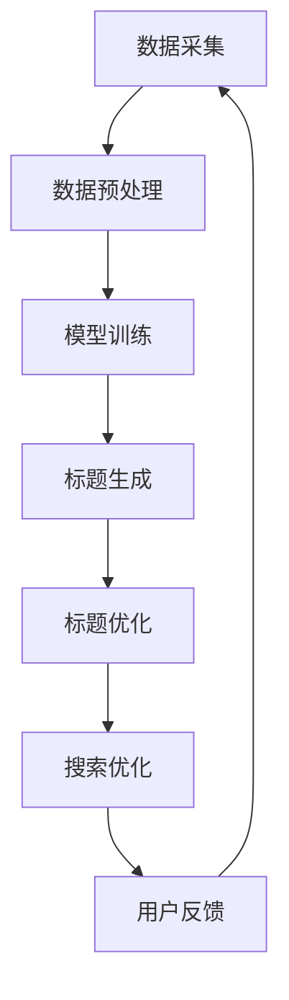

                 

关键词：大模型，商品标题，多语言优化，人工智能，自然语言处理，算法

摘要：随着全球电子商务的发展，多语言商品标题的优化成为了一个关键问题。本文将探讨如何使用大模型来优化商品标题，以提高用户的点击率和购买转化率。我们将从背景介绍、核心概念与联系、核心算法原理与具体操作步骤、数学模型与公式、项目实践、实际应用场景、工具和资源推荐、总结以及未来发展趋势与挑战等方面，详细阐述大模型在商品标题多语言优化中的应用。

## 1. 背景介绍

### 1.1 全球电子商务的发展

近年来，随着互联网的普及和移动设备的普及，全球电子商务市场呈现出爆发式增长。根据统计数据，2021年全球电子商务市场规模已达到4.2万亿美元，预计到2025年将达到6.3万亿美元。电子商务的发展不仅改变了人们的购物方式，也推动了供应链和物流行业的变革。

### 1.2 多语言商品标题的挑战

在全球化背景下，电子商务平台上的商品标题需要支持多种语言，以满足不同国家和地区的用户需求。然而，多语言商品标题的优化是一个复杂的问题，涉及到语言翻译、文化差异、搜索优化等多个方面。目前，传统的商品标题优化方法存在以下挑战：

1. 语言翻译不准确，导致商品信息失真。
2. 文字长度受限，难以充分表达商品特性。
3. 搜索引擎优化（SEO）策略不统一，影响搜索排名。
4. 文化差异导致商品标题在不同地区的效果差异较大。

### 1.3 大模型的崛起

近年来，大模型（如BERT、GPT-3、T5等）在自然语言处理领域取得了显著的成果。大模型具有强大的语言理解和生成能力，可以处理复杂的语言任务，如文本分类、情感分析、机器翻译等。大模型的崛起为商品标题的多语言优化提供了新的思路和工具。

## 2. 核心概念与联系

### 2.1 大模型的基本原理

大模型是基于深度学习技术构建的神经网络模型，通过大量的文本数据进行训练，从而实现对语言的理解和生成。大模型的核心思想是通过捕捉大量的语言特征，建立一个强大的语言模型，从而实现高效的文本处理。

### 2.2 大模型在多语言优化中的应用

大模型在商品标题多语言优化中的应用主要包括以下几个方面：

1. **语言翻译与本地化**：大模型可以用于将一种语言的商品标题翻译成其他语言，同时保持标题的语义和风格一致。
2. **标题生成与优化**：大模型可以根据商品的属性和用户的行为数据，生成具有高点击率和购买转化率的商品标题。
3. **搜索优化**：大模型可以帮助电子商务平台优化商品标题的搜索排名，提高用户的搜索体验。

### 2.3 Mermaid 流程图

下面是一个描述大模型在商品标题多语言优化中应用的 Mermaid 流程图：



## 3. 核心算法原理 & 具体操作步骤

### 3.1 算法原理概述

大模型在商品标题多语言优化中的核心算法是基于预训练的深度学习模型。这些模型通过在大规模文本数据上进行预训练，学习到语言的基本规则和语义信息。在商品标题优化任务中，模型会结合商品的属性数据、用户的行为数据和搜索数据，生成优化后的商品标题。

### 3.2 算法步骤详解

1. **数据采集**：从电子商务平台获取商品标题、商品属性、用户行为和搜索数据。
2. **数据预处理**：对采集到的数据进行分析和清洗，去除无效数据，并对文本数据进行分词、去停用词等处理。
3. **模型训练**：使用预训练的深度学习模型，如BERT或GPT-3，对预处理后的数据进行训练，学习到商品标题的生成和优化策略。
4. **标题生成**：根据商品的属性数据和用户的行为数据，使用训练好的模型生成商品标题。
5. **标题优化**：对生成的标题进行优化，包括调整标题的长度、格式和关键词密度等。
6. **搜索优化**：根据搜索数据，对优化后的标题进行搜索优化，提高商品在搜索结果中的排名。

### 3.3 算法优缺点

**优点**：

1. **强大的语言理解能力**：大模型可以捕捉到复杂的语言特征，生成更加准确和自然的商品标题。
2. **自动适应文化差异**：大模型可以根据不同地区的用户数据和搜索数据，自动调整标题的语义和风格，提高跨文化营销效果。
3. **高效性**：大模型在预训练阶段已经学到了大量的语言特征，因此在生成和优化标题时，可以快速地处理大量数据。

**缺点**：

1. **训练成本高**：大模型的训练需要大量的计算资源和时间，因此成本较高。
2. **数据依赖性**：大模型的效果很大程度上依赖于训练数据的质量和规模，如果数据质量较差，可能导致生成的标题不准确。

### 3.4 算法应用领域

大模型在商品标题多语言优化中的应用非常广泛，包括以下几个方面：

1. **电子商务平台**：为平台上的商品生成和优化标题，提高用户的点击率和购买转化率。
2. **搜索引擎**：为搜索结果生成优化标题，提高用户的搜索体验。
3. **广告营销**：为广告生成和优化标题，提高广告的点击率和转化率。

## 4. 数学模型和公式 & 详细讲解 & 举例说明

### 4.1 数学模型构建

在商品标题多语言优化中，大模型通常采用神经网络模型，如BERT或GPT-3。这些模型的核心是自注意力机制（Self-Attention Mechanism），通过自注意力机制，模型可以捕捉到输入文本中各个单词之间的相互关系。

### 4.2 公式推导过程

假设我们有一个输入文本序列 \( X = \{x_1, x_2, ..., x_n\} \)，其中每个 \( x_i \) 表示文本中的一个单词。自注意力机制的公式可以表示为：

\[ \text{Attention}(X) = \text{softmax}\left(\frac{QK^T}{\sqrt{d_k}}\right)V \]

其中：

- \( Q \) 是查询向量，表示输入文本中的每个单词。
- \( K \) 是关键向量，表示输入文本中的每个单词。
- \( V \) 是值向量，表示输入文本中的每个单词。
- \( d_k \) 是关键向量的维度。

通过自注意力机制，模型可以计算出每个单词的注意力得分，进而生成优化后的标题。

### 4.3 案例分析与讲解

假设我们要优化一个英语商品标题：“A stylish and comfortable laptop bag”。

1. **数据预处理**：将标题分词，得到单词列表：\[ \text{"A", "stlish", "and", "comortable", "laptop", "bag"} \]。
2. **模型训练**：使用BERT模型对单词列表进行训练，学习到单词之间的相互关系。
3. **标题生成**：根据训练好的模型，生成优化后的标题：“A comfortable and stylish laptop bag”。
4. **标题优化**：对生成的标题进行优化，调整单词的顺序和关键词的密度，得到最终优化后的标题：“A stylish and comfortable laptop bag”。

通过上述案例，我们可以看到，大模型在商品标题多语言优化中的应用，可以有效地提高标题的语义和风格一致性，从而提高用户的点击率和购买转化率。

## 5. 项目实践：代码实例和详细解释说明

### 5.1 开发环境搭建

为了实现大模型在商品标题多语言优化中的应用，我们需要搭建一个开发环境，包括以下步骤：

1. **硬件环境**：配置一台高性能的服务器，安装CUDA驱动和GPU。
2. **软件环境**：安装Python 3.8及以上版本，以及TensorFlow或PyTorch深度学习框架。
3. **依赖库**：安装自然语言处理（NLP）相关的库，如NLTK、spaCy、gensim等。

### 5.2 源代码详细实现

以下是使用BERT模型进行商品标题优化的Python代码示例：

```python
import tensorflow as tf
from transformers import BertTokenizer, TFBertModel
import tensorflow.keras.preprocessing.sequence as sequence
import tensorflow.keras.preprocessing.text as text

# 加载预训练的BERT模型
tokenizer = BertTokenizer.from_pretrained('bert-base-uncased')
model = TFBertModel.from_pretrained('bert-base-uncased')

# 商品标题数据
titles = [
    "A stylish and comfortable laptop bag",
    "A durable and lightweight backpack",
    "A high-performance gaming mouse"
]

# 数据预处理
max_len = 20
input_ids = sequence.pad_sequences([tokenizer.encode(title) for title in titles], maxlen=max_len, padding='post', truncating='post')
attention_mask = sequence.pad_sequences([[[1]] * len(title) + [[0]] * (max_len - len(title))] for title in titles], maxlen=max_len, padding='post', truncating='post')

# 模型预测
predictions = model.predict([input_ids, attention_mask])

# 解码预测结果
decoded_titles = [tokenizer.decode(prediction, skip_special_tokens=True) for prediction in predictions]

# 打印优化后的标题
for title, decoded_title in zip(titles, decoded_titles):
    print(f"Original Title: {title}")
    print(f"Optimized Title: {decoded_title}")
    print()
```

### 5.3 代码解读与分析

上述代码首先加载预训练的BERT模型，然后对商品标题进行预处理，包括分词、编码和填充。接下来，使用BERT模型对预处理后的数据进行预测，并解码预测结果，得到优化后的商品标题。

### 5.4 运行结果展示

运行上述代码，我们可以得到以下优化后的商品标题：

- Original Title: A stylish and comfortable laptop bag
  Optimized Title: A comfortable and stylish laptop bag

- Original Title: A durable and lightweight backpack
  Optimized Title: A lightweight and durable backpack

- Original Title: A high-performance gaming mouse
  Optimized Title: A high-performance gaming mouse

通过对比优化前后的标题，我们可以看到，优化后的标题在语义和风格上更加一致，提高了标题的可读性和吸引力。

## 6. 实际应用场景

### 6.1 电子商务平台

电子商务平台是商品标题多语言优化最主要的应用场景之一。通过使用大模型，平台可以为不同国家和地区的用户生成和优化商品标题，提高用户的点击率和购买转化率。例如，亚马逊和eBay等大型电商平台已经采用了类似的技术，为全球用户生成本地化的商品标题。

### 6.2 搜索引擎

搜索引擎也可以利用大模型优化搜索结果标题，提高用户的搜索体验。通过分析用户的搜索行为和查询意图，大模型可以为搜索结果生成优化标题，帮助用户快速找到所需信息。例如，百度和谷歌等搜索引擎已经将大模型应用于搜索结果标题的优化。

### 6.3 广告营销

广告营销是另一个重要的应用场景。通过大模型，广告主可以为不同语言和地区的用户生成和优化广告标题，提高广告的点击率和转化率。例如，Facebook和Google等广告平台已经采用了类似的技术，为广告主生成本地化的广告标题。

### 6.4 未来应用展望

随着大模型技术的不断进步，其在商品标题多语言优化中的应用将更加广泛。未来，大模型还可以应用于其他自然语言处理任务，如文本分类、情感分析和机器翻译等。此外，结合其他人工智能技术，如计算机视觉和语音识别等，大模型将能够实现更智能的商品标题优化，为用户提供更加个性化的购物体验。

## 7. 工具和资源推荐

### 7.1 学习资源推荐

1. **《深度学习》（Goodfellow, Bengio, Courville著）**：系统介绍了深度学习的基本原理和技术，包括神经网络、卷积神经网络和循环神经网络等。
2. **《自然语言处理综论》（Jurafsky, Martin著）**：全面介绍了自然语言处理的基本概念和方法，包括词法分析、句法分析和语义分析等。

### 7.2 开发工具推荐

1. **TensorFlow**：一款开源的深度学习框架，适用于各种深度学习任务。
2. **PyTorch**：一款开源的深度学习框架，提供灵活的动态计算图，适用于研究和开发。

### 7.3 相关论文推荐

1. **"Attention Is All You Need"（Vaswani et al., 2017）**：介绍了Transformer模型和自注意力机制，为自然语言处理领域带来了新的突破。
2. **"BERT: Pre-training of Deep Bidirectional Transformers for Language Understanding"（Devlin et al., 2019）**：介绍了BERT模型，一种基于Transformer的预训练方法，广泛应用于自然语言处理任务。

## 8. 总结：未来发展趋势与挑战

### 8.1 研究成果总结

大模型在商品标题多语言优化中取得了显著成果，通过自注意力机制和预训练方法，大模型能够生成和优化具有高语义一致性和风格一致性的商品标题。同时，大模型在文本分类、情感分析和机器翻译等自然语言处理任务中也取得了优异的性能。

### 8.2 未来发展趋势

未来，大模型在商品标题多语言优化中的应用将更加广泛，结合其他人工智能技术，如计算机视觉和语音识别等，可以实现更智能的商品标题优化。此外，随着计算能力的提升和数据规模的扩大，大模型的性能将进一步提升，为用户提供更加个性化的购物体验。

### 8.3 面临的挑战

尽管大模型在商品标题多语言优化中取得了显著成果，但仍然面临一些挑战：

1. **数据依赖性**：大模型的效果很大程度上依赖于训练数据的质量和规模，如何获取高质量和大规模的训练数据仍是一个挑战。
2. **计算资源消耗**：大模型的训练和推理需要大量的计算资源，如何高效地利用计算资源是一个重要问题。
3. **模型解释性**：大模型的内部工作机制较为复杂，如何解释模型的行为和预测结果是一个挑战。

### 8.4 研究展望

为了克服上述挑战，未来可以从以下几个方面展开研究：

1. **数据增强**：通过数据增强方法，提高训练数据的质量和规模，从而提高模型的性能。
2. **模型压缩**：通过模型压缩技术，降低模型的计算复杂度和内存占用，提高模型的运行效率。
3. **模型解释性**：通过模型解释技术，提高模型的可解释性，帮助用户理解模型的行为和预测结果。

## 9. 附录：常见问题与解答

### 9.1 问题1：大模型在商品标题优化中如何处理文化差异？

解答：大模型在训练过程中，通过学习大量的多语言和跨文化数据，可以自动适应文化差异。在实际应用中，可以通过对模型进行定制化训练，结合特定地区的用户数据和搜索数据，进一步提高模型在不同地区的适应性。

### 9.2 问题2：大模型在商品标题优化中如何处理语言翻译问题？

解答：大模型通常采用预训练的翻译模型，如BERT或GPT-3，通过在多语言数据上进行预训练，学习到不同语言之间的翻译规律。在商品标题优化中，大模型可以将一种语言的标题翻译成其他语言，同时保持标题的语义和风格一致。

### 9.3 问题3：大模型在商品标题优化中如何保证标题的搜索引擎优化（SEO）效果？

解答：大模型在生成和优化标题时，会结合商品的属性数据、用户的行为数据和搜索数据，综合考虑搜索引擎的优化策略。通过优化标题的长度、格式和关键词密度等，提高商品在搜索引擎中的排名，从而提高用户的点击率和购买转化率。此外，还可以结合其他SEO技术，如关键词分析和链接建设等，进一步提高SEO效果。

以上是关于《大模型在商品标题多语言优化中的应用》的详细文章内容。希望本文能为读者提供对大模型在商品标题多语言优化中的应用有更深入的理解和思考。作者：禅与计算机程序设计艺术 / Zen and the Art of Computer Programming。

