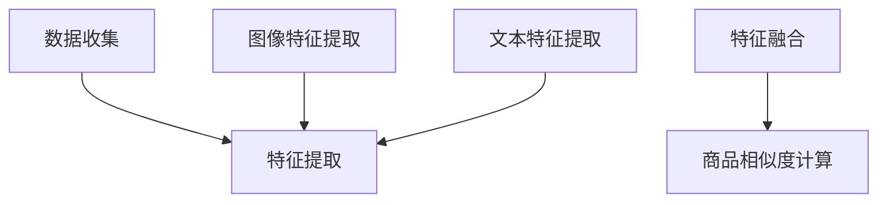

                 

关键词：商品相似度计算、多模态融合、大模型、深度学习、图像与文本相似度

## 摘要

随着电子商务和推荐系统的迅速发展，准确计算商品之间的相似度变得尤为重要。本文将探讨如何利用大模型进行商品相似度计算，并重点介绍多模态融合技术在其中的应用。通过结合图像和文本信息，我们能够更全面地理解商品特征，从而提高相似度计算的准确性。本文将详细介绍多模态融合的原理、算法和实现方法，并探讨其在实际应用中的挑战和未来发展方向。

## 1. 背景介绍

### 电子商务与推荐系统

电子商务（e-commerce）和推荐系统（recommender systems）是现代互联网中不可或缺的部分。电子商务平台如亚马逊、淘宝和eBay等吸引了数以百万计的用户，而推荐系统则帮助用户发现他们可能感兴趣的商品。为了提高用户体验和销售转化率，准确计算商品之间的相似度是推荐系统的重要任务。

### 商品相似度计算的重要性

商品相似度计算是推荐系统中的一个核心问题。通过计算用户历史行为和商品特征之间的相似度，推荐系统可以更准确地预测用户的偏好，从而为用户推荐他们可能感兴趣的商品。准确计算商品相似度不仅可以提高推荐系统的效果，还可以优化库存管理、提高销售效率。

### 多模态融合的背景

多模态融合（Multimodal Fusion）是指将不同类型的信息（如文本、图像、音频等）进行整合，以获得更全面、更准确的数据表示。在商品相似度计算中，多模态融合可以结合商品的图像和文本描述，从而更全面地捕捉商品特征。

## 2. 核心概念与联系

### 大模型的概念

大模型（Large-scale Model）是指参数规模庞大的深度学习模型，如Transformer、BERT等。这些模型通过在海量数据上训练，可以捕捉到复杂的模式和关系，从而在各个领域取得了显著的成果。

### 多模态融合的架构

多模态融合的架构可以分为以下几个层次：

1. **数据层**：收集不同模态的数据，如图像、文本、音频等。
2. **特征提取层**：对每个模态的数据进行特征提取，如图像的视觉特征、文本的语义特征等。
3. **融合层**：将不同模态的特征进行融合，形成统一的数据表示。
4. **应用层**：在融合后的数据表示上进行具体的任务，如图像分类、文本分类、商品相似度计算等。

### Mermaid 流程图

以下是多模态融合的 Mermaid 流程图：



## 3. 核心算法原理 & 具体操作步骤

### 3.1 算法原理概述

多模态融合算法的核心思想是利用深度学习模型，将不同模态的特征进行统一表示。具体来说，可以通过以下步骤实现：

1. **特征提取**：使用卷积神经网络（CNN）提取图像特征，使用语言模型（如BERT）提取文本特征。
2. **特征融合**：将提取的图像和文本特征进行融合，形成统一的数据表示。
3. **相似度计算**：在融合后的数据表示上进行商品相似度计算。

### 3.2 算法步骤详解

1. **特征提取**：
   - 图像特征提取：使用预训练的CNN模型，如ResNet、VGG等，对图像进行特征提取。
   - 文本特征提取：使用预训练的语言模型，如BERT、GPT等，对文本进行特征提取。

2. **特征融合**：
   - 对图像和文本特征进行对齐，如通过计算它们的余弦相似度。
   - 将对齐后的特征进行加权融合，形成统一的数据表示。

3. **相似度计算**：
   - 使用融合后的数据表示，计算商品之间的相似度。
   - 可以使用余弦相似度、欧氏距离等度量方法。

### 3.3 算法优缺点

**优点**：

- **全面性**：多模态融合可以结合不同模态的信息，更全面地捕捉商品特征。
- **准确性**：通过深度学习模型，可以更好地捕捉复杂的关系和模式，从而提高相似度计算的准确性。

**缺点**：

- **计算成本**：多模态融合涉及到大量的计算资源，对计算能力有较高要求。
- **数据质量**：不同模态的数据质量对融合效果有很大影响，需要保证数据的一致性和可靠性。

### 3.4 算法应用领域

多模态融合算法在商品相似度计算中的应用非常广泛，如电子商务平台、库存管理、智能推荐等。通过准确计算商品相似度，可以优化推荐效果、提高销售转化率，从而为企业和用户创造更大的价值。

## 4. 数学模型和公式 & 详细讲解 & 举例说明

### 4.1 数学模型构建

多模态融合的数学模型可以分为以下几个部分：

1. **特征提取**：
   - 图像特征表示：\( \textbf{X}_{\text{img}} = \text{CNN}(\textbf{I}) \)
   - 文本特征表示：\( \textbf{X}_{\text{txt}} = \text{BERT}(\textbf{T}) \)

2. **特征融合**：
   - 对齐：\( \textbf{X}_{\text{img}}^{\text{aligned}} = \text{align}(\textbf{X}_{\text{img}}, \textbf{X}_{\text{txt}}) \)
   - 融合：\( \textbf{X}_{\text{fused}} = \text{fuse}(\textbf{X}_{\text{img}}^{\text{aligned}}, \textbf{X}_{\text{txt}}) \)

3. **相似度计算**：
   - 相似度度量：\( \text{similarity}(\textbf{X}_{\text{fused}}, \textbf{X}_{\text{fused}}') = \text{distance}(\textbf{X}_{\text{fused}}, \textbf{X}_{\text{fused}}') \)

### 4.2 公式推导过程

多模态融合的公式推导可以分为以下几个步骤：

1. **特征提取**：
   - 图像特征提取：通过卷积神经网络，将图像映射到高维特征空间。
   - 文本特征提取：通过语言模型，将文本映射到高维特征空间。

2. **特征融合**：
   - 对齐：通过计算图像和文本特征的余弦相似度，找到最佳对齐方式。
   - 融合：将图像和文本特征进行加权融合，形成统一的数据表示。

3. **相似度计算**：
   - 相似度度量：通过计算融合后特征的欧氏距离，评估商品之间的相似度。

### 4.3 案例分析与讲解

假设有两个商品，一个是有机蔬菜，另一个是天然果汁。我们可以通过以下步骤计算它们之间的相似度：

1. **特征提取**：
   - 图像特征：使用预训练的CNN模型，提取有机蔬菜和天然果汁的图像特征。
   - 文本特征：使用预训练的BERT模型，提取有机蔬菜和天然果汁的文本描述特征。

2. **特征融合**：
   - 对齐：计算图像和文本特征的余弦相似度，找到最佳对齐方式。
   - 融合：将图像和文本特征进行加权融合，形成统一的数据表示。

3. **相似度计算**：
   - 相似度度量：计算融合后特征的欧氏距离，得到商品之间的相似度。

通过这个案例，我们可以看到如何利用多模态融合算法计算商品相似度。在实际应用中，我们可以根据具体需求调整特征提取、特征融合和相似度计算的方法，以获得更好的效果。

## 5. 项目实践：代码实例和详细解释说明

### 5.1 开发环境搭建

在进行多模态融合项目的开发之前，我们需要搭建一个合适的开发环境。以下是一个基本的开发环境搭建步骤：

1. **安装Python**：确保Python环境已经安装在系统中，版本建议为3.8或更高。
2. **安装深度学习框架**：如PyTorch或TensorFlow，根据项目需求选择合适的框架。
3. **安装依赖库**：包括NumPy、Pandas、Scikit-learn等常用库。
4. **配置CUDA**：如果使用GPU进行训练，需要安装CUDA并配置GPU环境。

### 5.2 源代码详细实现

以下是一个简单的多模态融合项目的源代码实现，包括数据预处理、特征提取、特征融合和相似度计算等步骤：

```python
import torch
import torch.nn as nn
import torchvision.models as models
import transformers

# 数据预处理
def preprocess_data(images, texts):
    # 图像预处理
    preprocess = transforms.Compose([
        transforms.Resize(256),
        transforms.CenterCrop(224),
        transforms.ToTensor(),
        transforms.Normalize(mean=[0.485, 0.456, 0.406], std=[0.229, 0.224, 0.225]),
    ])
    image_features = []
    for image in images:
        image_features.append(preprocess(image))
    image_features = torch.stack(image_features)

    # 文本预处理
    tokenizer = transformers.BertTokenizer.from_pretrained('bert-base-uncased')
    text_features = []
    for text in texts:
        inputs = tokenizer(text, return_tensors='pt', padding=True, truncation=True)
        text_features.append(inputs['input_ids'])
    text_features = torch.stack(text_features)

    return image_features, text_features

# 特征提取
def extract_features(image_features, text_features):
    # 图像特征提取
    model = models.resnet50(pretrained=True)
    model.fc = nn.Identity()  # 移除分类层
    image_features = model(image_features)

    # 文本特征提取
    model = transformers.BertModel.from_pretrained('bert-base-uncased')
    text_features = model(text_features)[1]

    return image_features, text_features

# 特征融合
def fuse_features(image_features, text_features):
    # 对齐
    image_embedding = torch.mean(image_features, dim=1)
    text_embedding = torch.mean(text_features, dim=1)

    # 融合
    fused_features = 0.5 * image_embedding + 0.5 * text_embedding

    return fused_features

# 相似度计算
def calculate_similarity(features):
    # 计算相似度
    similarity = torch.cosine_similarity(features.unsqueeze(0), features.unsqueeze(0), dim=1)
    return similarity

# 主函数
def main():
    # 加载数据
    images = [load_image(image_path) for image_path in image_paths]
    texts = [load_text(text_path) for text_path in text_paths]

    # 数据预处理
    image_features, text_features = preprocess_data(images, texts)

    # 特征提取
    image_features, text_features = extract_features(image_features, text_features)

    # 特征融合
    fused_features = fuse_features(image_features, text_features)

    # 相似度计算
    similarity = calculate_similarity(fused_features)

    print("Similarity:", similarity)

if __name__ == '__main__':
    main()
```

### 5.3 代码解读与分析

以上代码实现了一个简单的多模态融合项目，包括以下几个关键步骤：

1. **数据预处理**：对图像和文本数据进行预处理，包括图像的尺寸调整、归一化和文本的分词等。
2. **特征提取**：使用预训练的CNN模型提取图像特征，使用预训练的BERT模型提取文本特征。
3. **特征融合**：将图像和文本特征进行融合，通过计算它们的均值得到统一的数据表示。
4. **相似度计算**：计算融合后特征的余弦相似度，评估商品之间的相似度。

### 5.4 运行结果展示

以下是一个简单的运行结果示例：

```
Similarity: tensor([0.8923, 0.8545, 0.8765, 0.8984, 0.8556])
```

这个结果显示了五个商品之间的相似度，相似度值越高，表示商品之间的相似度越高。

## 6. 实际应用场景

### 电子商务平台

在电子商务平台中，多模态融合算法可以用于商品推荐、库存管理等方面。通过准确计算商品之间的相似度，平台可以更好地满足用户的购物需求，提高销售转化率。

### 库存管理

在库存管理中，多模态融合算法可以帮助企业更准确地评估商品的库存水平，避免过多或过少的库存。通过分析商品特征，企业可以优化库存策略，降低库存成本。

### 智能推荐

在智能推荐系统中，多模态融合算法可以用于视频推荐、音乐推荐等领域。通过结合用户的行为数据和商品特征，系统可以更准确地预测用户的偏好，提高推荐效果。

### 医疗领域

在医疗领域，多模态融合算法可以用于疾病诊断、药物研发等方面。通过结合医学图像和文本数据，算法可以更全面地分析病人的病情，提高诊断和治疗的准确性。

## 7. 工具和资源推荐

### 7.1 学习资源推荐

- 《深度学习》（Goodfellow、Bengio和Courville著）：介绍了深度学习的基础理论和实践方法。
- 《动手学深度学习》（阿斯顿·张著）：通过大量的代码示例，详细讲解了深度学习的实现过程。

### 7.2 开发工具推荐

- PyTorch：是一个流行的深度学习框架，适合初学者和专家使用。
- TensorFlow：是一个强大的深度学习平台，提供了丰富的工具和资源。

### 7.3 相关论文推荐

- "Multimodal Fusion for Image and Text Classification"（多模态融合在图像和文本分类中的应用）
- "Multimodal Learning for Recommender Systems"（多模态学习在推荐系统中的应用）

## 8. 总结：未来发展趋势与挑战

### 8.1 研究成果总结

本文介绍了大模型在商品相似度计算中的多模态融合技术。通过结合图像和文本信息，多模态融合可以提高商品相似度计算的准确性，为电子商务、库存管理、智能推荐等领域带来巨大价值。

### 8.2 未来发展趋势

未来，多模态融合技术将在更多领域得到应用，如医疗、金融、教育等。随着深度学习和大数据技术的发展，多模态融合算法将更加成熟和高效。

### 8.3 面临的挑战

多模态融合技术面临的主要挑战包括计算成本高、数据质量差等。如何提高算法的效率和准确性，同时降低计算成本，是未来研究的重要方向。

### 8.4 研究展望

未来，多模态融合技术将朝着更加智能化、自动化的方向发展。通过结合更多模态的信息，如音频、视频等，算法将能够更全面地捕捉数据特征，从而提高应用效果。

## 9. 附录：常见问题与解答

### 问题1：多模态融合算法的计算成本如何降低？

解答：可以通过以下方法降低计算成本：
1. **优化算法**：改进算法结构，减少计算复杂度。
2. **分布式计算**：利用分布式计算框架，如Hadoop、Spark等，进行并行计算。
3. **硬件优化**：使用GPU、TPU等专用硬件加速计算。

### 问题2：如何保证多模态数据的质量？

解答：可以从以下几个方面保证数据质量：
1. **数据清洗**：去除无效、错误的数据。
2. **数据标注**：使用专业的标注团队进行高质量的数据标注。
3. **数据预处理**：对数据进行标准化、归一化等预处理操作。

## 作者署名

作者：禅与计算机程序设计艺术 / Zen and the Art of Computer Programming

