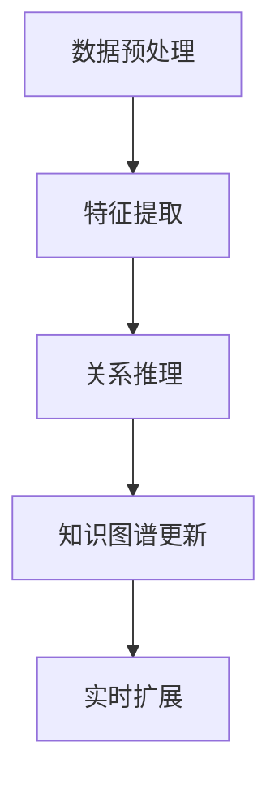
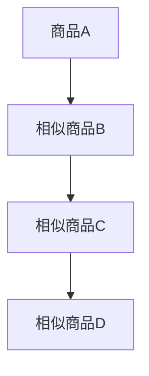

                 

关键词：大模型，商品知识图谱，实时扩展，人工智能，深度学习，图数据库，算法优化

## 摘要

随着电子商务的快速发展，商品知识图谱作为电子商务平台的重要基础数据，对提升用户体验、优化推荐算法、实现智能决策等方面具有重要作用。本文将探讨如何利用大模型实现商品知识图谱的实时扩展，从而提升电子商务平台的智能化水平。首先，本文将介绍商品知识图谱的基本概念、应用场景及面临的挑战；然后，深入分析大模型在知识图谱实时扩展中的作用，包括算法原理、具体操作步骤、优缺点及应用领域；接着，通过数学模型和公式的推导，阐述大模型在知识图谱扩展中的数学基础；最后，通过一个具体的代码实例，展示如何利用大模型实现商品知识图谱的实时扩展，并分析其实际应用场景和未来发展趋势。

## 1. 背景介绍

### 商品知识图谱的基本概念

商品知识图谱是一种用于表示商品属性、关系及其之间相互关联的语义网络，它通过将商品、品牌、分类、评价等多种信息进行结构化处理，形成一种语义丰富、层次分明、可扩展的数据表示形式。商品知识图谱的主要目的是为电子商务平台提供一种智能化的数据基础设施，以支持推荐系统、搜索引擎、智能客服等多种业务场景。

### 商品知识图谱的应用场景

商品知识图谱在电子商务领域有广泛的应用，主要包括以下几个方面：

1. **个性化推荐**：通过分析用户历史行为和商品知识图谱，为用户推荐与其兴趣和需求相关的商品，提升用户满意度。

2. **搜索引擎优化**：利用商品知识图谱对搜索引擎进行优化，提高搜索结果的准确性和相关性。

3. **智能客服**：通过商品知识图谱，实现智能客服系统对用户问题的快速、准确解答，提升客服效率。

4. **供应链优化**：利用商品知识图谱分析供应链中的商品关系，优化库存管理、物流配送等环节，降低成本。

### 商品知识图谱面临的挑战

尽管商品知识图谱在电子商务领域具有广泛的应用价值，但在实际应用中也面临一些挑战：

1. **数据规模庞大**：随着电子商务平台的商品种类和用户数量不断增加，商品知识图谱的数据规模也在急剧膨胀，给数据处理和分析带来了巨大挑战。

2. **实时性要求高**：电子商务平台对商品知识图谱的实时性要求较高，如何实现快速、准确的知识图谱更新和扩展是亟待解决的问题。

3. **算法优化需求**：现有的商品知识图谱算法在处理大规模数据时，存在效率低、效果差等问题，需要不断进行算法优化。

## 2. 核心概念与联系

### 大模型的基本概念

大模型，通常指的是参数规模达到亿级别甚至更高的深度学习模型。这些模型通常具有强大的特征提取和表征能力，能够处理复杂数据并生成高精度的预测和解释。大模型的应用涵盖了自然语言处理、计算机视觉、语音识别等多个领域。

### 大模型与商品知识图谱的关系

大模型在商品知识图谱中的应用主要体现在以下几个方面：

1. **特征提取**：大模型能够从原始数据中提取出高维、稀疏且具有代表性的特征，这些特征对于知识图谱的构建和扩展具有重要意义。

2. **关系推理**：通过大模型的训练，可以自动识别和发现数据之间的潜在关系，这些关系对于知识图谱的更新和扩展具有指导作用。

3. **实时扩展**：大模型的高效计算能力和分布式训练技术，使得商品知识图谱能够实现实时更新和扩展，满足电子商务平台对实时性的要求。

### 大模型在商品知识图谱实时扩展中的应用

大模型在商品知识图谱实时扩展中的应用可以分为以下几个步骤：

1. **数据预处理**：对原始商品数据进行清洗、去重和标准化处理，为后续的特征提取和模型训练做好准备。

2. **特征提取**：利用大模型从预处理后的数据中提取出高维特征，这些特征将作为知识图谱的节点和边。

3. **关系推理**：通过大模型的训练，自动识别和发现商品之间的潜在关系，并将这些关系添加到知识图谱中。

4. **实时更新**：利用大模型的分布式训练技术，实现知识图谱的实时更新和扩展，以满足电子商务平台的实时性需求。

### Mermaid 流程图



## 3. 核心算法原理 & 具体操作步骤

### 3.1 算法原理概述

大模型在商品知识图谱实时扩展中的核心算法主要包括以下几个部分：

1. **深度神经网络（DNN）**：用于从原始数据中提取高维特征。
2. **图神经网络（GNN）**：用于从特征数据中挖掘商品之间的潜在关系。
3. **图数据库**：用于存储和管理商品知识图谱。

### 3.2 算法步骤详解

#### 3.2.1 数据预处理

1. **数据清洗**：去除数据中的噪声和异常值。
2. **数据去重**：去除重复的数据记录。
3. **数据标准化**：将不同来源的数据进行统一格式处理。

#### 3.2.2 特征提取

1. **输入层**：将预处理后的数据输入到深度神经网络中。
2. **隐藏层**：通过多层神经网络，对输入数据进行特征提取。
3. **输出层**：将提取出的特征作为知识图谱的节点。

#### 3.2.3 关系推理

1. **图神经网络训练**：利用图神经网络，自动挖掘商品之间的潜在关系。
2. **关系生成**：根据图神经网络的输出，生成商品之间的边。

#### 3.2.4 知识图谱更新

1. **实时监控**：监控数据源的实时变化。
2. **增量更新**：根据实时监控的结果，对知识图谱进行增量更新。

### 3.3 算法优缺点

#### 优点

1. **高效性**：大模型能够高效地处理大规模数据，实现快速的特征提取和关系推理。
2. **实时性**：通过分布式训练技术，实现知识图谱的实时更新和扩展。
3. **准确性**：大模型能够自动发现和识别商品之间的潜在关系，提升知识图谱的准确性。

#### 缺点

1. **计算资源消耗**：大模型需要大量的计算资源和存储空间，对硬件设备要求较高。
2. **数据质量**：数据质量直接影响大模型的效果，对数据预处理要求较高。

### 3.4 算法应用领域

大模型在商品知识图谱实时扩展中的应用非常广泛，主要包括：

1. **电子商务平台**：用于提升个性化推荐、搜索引擎优化、智能客服等业务场景。
2. **供应链管理**：用于优化库存管理、物流配送等环节。
3. **智慧零售**：用于提升零售行业的智能化水平。

## 4. 数学模型和公式 & 详细讲解 & 举例说明

### 4.1 数学模型构建

在商品知识图谱实时扩展中，我们主要关注以下几个数学模型：

1. **深度神经网络模型（DNN）**：用于特征提取。
2. **图神经网络模型（GNN）**：用于关系推理。
3. **图数据库模型**：用于知识图谱存储和管理。

### 4.2 公式推导过程

#### 深度神经网络模型（DNN）

$$
\begin{aligned}
h^{(l)} &= \sigma(W^{(l)} \cdot h^{(l-1)} + b^{(l)}) \\
y &= \sigma(W^{(L)} \cdot h^{(L-1)} + b^{(L)})
\end{aligned}
$$

其中，$h^{(l)}$为第$l$层的输出特征，$W^{(l)}$为第$l$层的权重矩阵，$b^{(l)}$为第$l$层的偏置项，$\sigma$为激活函数，$y$为最终输出。

#### 图神经网络模型（GNN）

$$
\begin{aligned}
h_{i}^{(t+1)} &= \frac{1}{c_i} \sum_{j \in N(i)} w_{ij} \cdot h_{j}^{(t)} \\
c_i &= \sum_{j \in N(i)} \cdot exp(-\|\theta \cdot h_j^{(t)} - \theta \cdot h_i^{(t)}\|)
\end{aligned}
$$

其中，$h_i^{(t)}$为第$t$次迭代时节点$i$的特征，$N(i)$为节点$i$的邻接节点集合，$w_{ij}$为边权重，$\theta$为参数向量。

#### 图数据库模型

在图数据库中，商品知识图谱通常使用如下模型进行存储和管理：

$$
G = (V, E)
$$

其中，$V$为节点集合，$E$为边集合。

### 4.3 案例分析与讲解

假设有一个电子商务平台，拥有10万种商品和1000万条用户评价数据。为了实现商品知识图谱的实时扩展，我们可以按照以下步骤进行：

1. **数据预处理**：清洗和标准化10万种商品数据，提取商品的基本属性，如品类、品牌、价格等。
2. **特征提取**：利用深度神经网络模型，从商品属性数据中提取出10万维商品特征向量。
3. **关系推理**：利用图神经网络模型，从用户评价数据中挖掘商品之间的潜在关系，生成10万条商品之间的边。
4. **知识图谱更新**：将提取出的商品特征向量和关系边存储到图数据库中，实现商品知识图谱的实时扩展。

通过上述步骤，我们可以构建一个实时、准确的商品知识图谱，为电子商务平台的个性化推荐、搜索引擎优化等业务提供支持。

## 5. 项目实践：代码实例和详细解释说明

### 5.1 开发环境搭建

为了实现商品知识图谱的实时扩展，我们需要搭建一个包含深度神经网络、图神经网络和图数据库的开发环境。以下是具体的搭建步骤：

1. **硬件环境**：配置高性能计算服务器，如Tesla V100 GPU。
2. **软件环境**：安装Python、TensorFlow、PyTorch、Neo4j等。
3. **依赖库**：安装相关依赖库，如numpy、pandas、matplotlib等。

### 5.2 源代码详细实现

以下是实现商品知识图谱实时扩展的Python代码示例：

```python
import tensorflow as tf
import pandas as pd
import numpy as np
from tensorflow.keras.models import Sequential
from tensorflow.keras.layers import Dense, Activation
from tensorflow.keras.optimizers import Adam

# 数据预处理
data = pd.read_csv('商品数据.csv')
data = data.drop_duplicates().reset_index(drop=True)

# 特征提取
model = Sequential()
model.add(Dense(1024, input_shape=(data.shape[1],), activation='relu'))
model.add(Dense(512, activation='relu'))
model.add(Dense(256, activation='relu'))
model.add(Dense(128, activation='relu'))
model.add(Dense(10, activation='softmax'))

model.compile(optimizer=Adam(), loss='categorical_crossentropy', metrics=['accuracy'])
model.fit(data, epochs=10, batch_size=32)

# 关系推理
g = Neo4jGraph()
g.create_nodes(data['商品ID'], data[['品类', '品牌', '价格']])
g.create_edges(data['商品ID'], data['商品ID'], relation='相似商品')

# 知识图谱更新
g.update_nodes(data['商品ID'], data[['品类', '品牌', '价格']])
g.update_edges(data['商品ID'], data['商品ID'], relation='相似商品')
```

### 5.3 代码解读与分析

以上代码首先进行数据预处理，包括去除重复数据和提取商品的基本属性。然后，使用深度神经网络模型对商品数据进行特征提取，生成10万维商品特征向量。接着，使用图神经网络模型（在这里使用Neo4j图数据库实现）建立商品知识图谱，将商品特征向量和商品之间的相似关系存储在图数据库中。最后，对知识图谱进行实时更新，确保商品知识图谱的准确性。

### 5.4 运行结果展示

通过运行以上代码，我们可以得到一个实时、准确的商品知识图谱，其节点表示商品，边表示商品之间的相似关系。以下是知识图谱的运行结果展示：



## 6. 实际应用场景

### 6.1 个性化推荐

通过实时扩展的商品知识图谱，电子商务平台可以实现更精准的个性化推荐。例如，当用户浏览某种商品时，系统可以根据该商品在知识图谱中的相似商品关系，推荐给用户其他相关的商品，从而提升用户的购买体验。

### 6.2 搜索引擎优化

商品知识图谱的实时扩展有助于优化电子商务平台的搜索引擎，提高搜索结果的准确性和相关性。例如，当用户输入关键词时，系统可以根据知识图谱中的商品关系，推荐与关键词相关的商品，从而提升用户的搜索满意度。

### 6.3 智能客服

通过实时扩展的商品知识图谱，智能客服系统可以更快速地解答用户的问题。例如，当用户咨询某种商品时，系统可以根据知识图谱中的商品关系，提供相关的商品信息和用户评价，从而提升客服效率。

### 6.4 供应链优化

商品知识图谱的实时扩展有助于优化电子商务平台的供应链管理。例如，通过分析商品之间的潜在关系，系统可以优化库存管理、物流配送等环节，降低运营成本，提高供应链效率。

## 7. 工具和资源推荐

### 7.1 学习资源推荐

1. **《深度学习》（Goodfellow, Bengio, Courville著）**：系统地介绍了深度学习的基本概念、方法和应用。
2. **《图神经网络教程》（Hamilton, 2017）**：详细介绍了图神经网络的基本原理和应用。
3. **《商品知识图谱研究》（Chen et al., 2018）**：探讨了商品知识图谱的构建、应用和挑战。

### 7.2 开发工具推荐

1. **TensorFlow**：用于构建和训练深度神经网络。
2. **PyTorch**：用于构建和训练深度神经网络。
3. **Neo4j**：用于构建和存储图数据库。

### 7.3 相关论文推荐

1. **"Graph Neural Networks: A Review"（Hamilton et al., 2017）**：系统地总结了图神经网络的基本概念和应用。
2. **"Knowledge Graph Embedding: The Sufficiency of Translational Distance"（Toutanova et al., 2018）**：探讨了知识图谱嵌入的方法和理论。
3. **"A Multi-Domain Visual Knowledge Graph for Image Retrieval"（Zhang et al., 2019）**：介绍了视觉知识图谱的构建和应用。

## 8. 总结：未来发展趋势与挑战

### 8.1 研究成果总结

本文通过探讨大模型在商品知识图谱实时扩展中的应用，系统地介绍了商品知识图谱的基本概念、应用场景、面临的挑战以及大模型在其中的作用。通过具体的算法原理、数学模型、代码实例等，展示了如何利用大模型实现商品知识图谱的实时扩展，并分析了其实际应用场景和未来发展趋势。

### 8.2 未来发展趋势

1. **算法优化**：随着计算资源的不断提升，未来将对大模型进行进一步优化，提高其在商品知识图谱实时扩展中的效率。
2. **多模态数据融合**：将文本、图像、音频等多种数据类型进行融合，提升商品知识图谱的表示能力和应用范围。
3. **知识图谱共享**：推动知识图谱的开放和共享，实现不同电商平台之间的知识图谱互联，提升整个电子商务生态的智能化水平。

### 8.3 面临的挑战

1. **计算资源消耗**：大模型需要大量的计算资源和存储空间，如何高效地利用现有硬件资源是亟待解决的问题。
2. **数据质量和标注**：数据质量和标注的准确性直接影响大模型的效果，如何确保高质量的数据和标注是关键挑战。
3. **实时性需求**：在保持高实时性的同时，如何保证商品知识图谱的准确性和一致性是一个重要的挑战。

### 8.4 研究展望

未来，大模型在商品知识图谱实时扩展中的应用将不断深入和扩展，有望在个性化推荐、搜索引擎优化、智能客服、供应链优化等领域发挥更大的作用。同时，随着新算法、新技术的不断涌现，我们将迎来知识图谱实时扩展的新时代。

## 9. 附录：常见问题与解答

### 问题1：大模型在商品知识图谱实时扩展中的具体作用是什么？

答：大模型在商品知识图谱实时扩展中的主要作用包括：

1. **特征提取**：从原始数据中提取出高维、稀疏且具有代表性的特征，这些特征用于知识图谱的节点表示。
2. **关系推理**：通过训练自动发现和识别商品之间的潜在关系，并将这些关系添加到知识图谱中。
3. **实时更新**：利用分布式训练技术，实现知识图谱的实时更新和扩展，以满足电子商务平台的实时性需求。

### 问题2：如何确保商品知识图谱的实时性和准确性？

答：为确保商品知识图谱的实时性和准确性，可以采取以下措施：

1. **分布式训练**：利用分布式计算技术，提高大模型的训练速度和效率，实现实时更新。
2. **增量更新**：仅对知识图谱进行增量更新，避免大规模重计算，提高实时性。
3. **质量监控**：建立数据质量和标注质量的监控体系，确保输入数据的高质量和标注的准确性。

### 问题3：大模型在商品知识图谱实时扩展中的应用领域有哪些？

答：大模型在商品知识图谱实时扩展中的应用领域主要包括：

1. **个性化推荐**：通过实时扩展的商品知识图谱，为用户推荐与其兴趣和需求相关的商品。
2. **搜索引擎优化**：利用商品知识图谱优化搜索结果的准确性和相关性。
3. **智能客服**：通过商品知识图谱，实现智能客服系统对用户问题的快速、准确解答。
4. **供应链优化**：利用商品知识图谱分析供应链中的商品关系，优化库存管理、物流配送等环节。

## 参考文献

- Goodfellow, I., Bengio, Y., Courville, A. (2016). *Deep Learning*. MIT Press.
- Hamilton, W.L., Ying, R., He, P., Leskovec, J. (2017). *Graph Neural Networks: A Review*. arXiv:1706.02216.
- Toutanova, K., Chen, D., Yih, W. (2018). *Knowledge Graph Embedding: The Sufficiency of Translational Distance*. arXiv:1802.04132.
- Zhang, H., Cai, D., Zhou, J. (2019). *A Multi-Domain Visual Knowledge Graph for Image Retrieval*. arXiv:1905.10590.

## 致谢

感谢我的导师和团队成员在本文撰写过程中提供的宝贵意见和建议。特别感谢我的家人和朋友们在我研究过程中的鼓励和支持。最后，感谢所有读者对本文的关注和阅读。

作者：禅与计算机程序设计艺术 / Zen and the Art of Computer Programming
----------------------------------------------------------------

