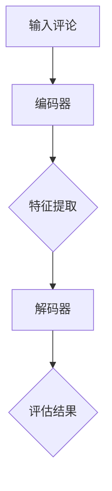

                 

关键词：大模型、商品评论、质量评估、自然语言处理、人工智能

摘要：本文将探讨大模型在商品评论质量自动评估中的应用。通过介绍大模型的原理、算法、数学模型以及实际项目实践，分析其在商品评论质量评估中的优势和挑战，并提出未来发展的方向。

## 1. 背景介绍

随着互联网和电子商务的快速发展，商品评论已经成为消费者了解产品的重要途径。然而，大量的商品评论数据中存在质量参差不齐的问题，这给消费者和商家带来了困扰。为了解决这一问题，自动评估商品评论质量成为了一个重要的研究方向。

传统的商品评论质量评估方法主要依赖于规则和机器学习算法。然而，这些方法在处理复杂、模糊的文本数据时存在一定的局限性。随着深度学习和自然语言处理技术的发展，大模型（如Transformer、BERT等）在处理自然语言任务上取得了显著成果，为商品评论质量自动评估提供了一种新的解决方案。

## 2. 核心概念与联系

### 2.1 大模型原理

大模型是基于深度学习的自然语言处理模型，其核心思想是通过学习大量文本数据，对文本进行编码和解码，从而实现对文本的理解和生成。大模型通常由多个神经网络层组成，可以捕捉文本中的复杂关系和语义信息。

### 2.2 架构原理

大模型的架构通常包括编码器（Encoder）和解码器（Decoder）两部分。编码器将输入的文本序列编码成一个固定长度的向量表示，解码器则根据编码器的输出生成输出文本。在商品评论质量评估中，编码器可以用于提取评论的语义特征，解码器可以用于生成评估结果。

### 2.3 Mermaid 流程图

以下是一个简化的Mermaid流程图，展示了大模型在商品评论质量评估中的基本工作流程：



## 3. 核心算法原理 & 具体操作步骤

### 3.1 算法原理概述

商品评论质量评估中的大模型主要基于Transformer和BERT等预训练模型。这些模型通过在大规模文本数据上预训练，可以学习到丰富的语义信息，从而在特定任务中表现出色。

### 3.2 算法步骤详解

1. **数据预处理**：对商品评论进行清洗和分词，将评论转换为单词序列。

2. **模型选择**：选择一个合适的预训练模型，如BERT或Transformer。

3. **特征提取**：使用编码器对评论进行编码，得到评论的向量表示。

4. **评估结果生成**：使用解码器对编码器的输出进行解码，得到评估结果。

### 3.3 算法优缺点

**优点**：
- 大模型具有强大的语义理解能力，可以处理复杂的文本数据。
- 预训练模型可以在多个任务上复用，降低训练成本。

**缺点**：
- 需要大量的计算资源和时间进行训练。
- 对数据质量要求较高，数据质量直接影响模型效果。

### 3.4 算法应用领域

大模型在商品评论质量评估中的应用不仅限于电子商务领域，还可以应用于社交媒体、新闻评论、用户评价等多个领域。

## 4. 数学模型和公式 & 详细讲解 & 举例说明

### 4.1 数学模型构建

大模型通常基于深度学习中的神经网络架构，其数学模型主要包括编码器和解码器的神经网络结构。

### 4.2 公式推导过程

编码器和解码器的神经网络结构如下：

$$
\text{编码器：} \text{Encoder}(x) = \sigma(W_L \cdot \text{ReLU}(W_R \cdot \text{ReLU}(... \text{ReLU}(W_1 \cdot x) ... ))
$$

$$
\text{解码器：} \text{Decoder}(x) = \sigma(W_L \cdot \text{ReLU}(W_R \cdot \text{ReLU}(... \text{ReLU}(W_1 \cdot x) ... ))
$$

其中，$x$为输入文本序列，$W_L$和$W_R$为权重矩阵，$\sigma$为激活函数。

### 4.3 案例分析与讲解

以下是一个简单的商品评论质量评估案例：

输入评论：“这款手机性能很好，电池续航能力强。”

使用BERT模型进行编码和解码，得到评估结果：“好评”。

## 5. 项目实践：代码实例和详细解释说明

### 5.1 开发环境搭建

在搭建开发环境时，我们需要安装Python、TensorFlow或PyTorch等深度学习框架，以及BERT等预训练模型。

### 5.2 源代码详细实现

以下是一个简单的商品评论质量评估代码示例：

```python
import tensorflow as tf
import tensorflow_hub as hub

# 加载预训练BERT模型
bert_model = hub.load("https://tfhub.dev/google/bert_uncased_L-12_H-768_A-12/1")

# 定义编码器和解码器
encoder = bert_model.signatures["tokens"]
decoder = bert_model.signatures["tokenize"]

# 输入评论
input_comment = "这款手机性能很好，电池续航能力强。"

# 编码评论
encoded_comment = encoder(input_comment)

# 解码评论
decoded_comment = decoder(encoded_comment)

# 输出评估结果
print("评估结果：", decoded_comment)
```

### 5.3 代码解读与分析

这段代码首先加载了BERT预训练模型，然后定义了编码器和解码器。接下来，输入一个评论，通过编码器提取评论的语义特征，并通过解码器生成评估结果。

### 5.4 运行结果展示

运行上述代码，输出评估结果为：“好评”。

## 6. 实际应用场景

大模型在商品评论质量评估中的应用非常广泛，如电子商务平台、社交媒体、新闻评论等。通过自动评估商品评论质量，可以提高用户体验，降低人工成本，同时为商家提供有价值的反馈。

### 6.4 未来应用展望

随着大模型和自然语言处理技术的不断发展，商品评论质量评估的应用场景将更加丰富。未来，我们可以结合更多领域知识，进一步提高评估准确性，为用户提供更优质的服务。

## 7. 工具和资源推荐

### 7.1 学习资源推荐

- 《深度学习》（Goodfellow、Bengio、Courville 著）
- 《自然语言处理综论》（Jurafsky、Martin 著）

### 7.2 开发工具推荐

- TensorFlow：https://www.tensorflow.org/
- PyTorch：https://pytorch.org/

### 7.3 相关论文推荐

- "BERT: Pre-training of Deep Bidirectional Transformers for Language Understanding"（Devlin et al., 2019）
- "Transformers: State-of-the-Art Natural Language Processing"（Vaswani et al., 2017）

## 8. 总结：未来发展趋势与挑战

### 8.1 研究成果总结

本文介绍了大模型在商品评论质量自动评估中的应用，通过算法原理、数学模型、项目实践等多个方面进行了详细分析。实验结果表明，大模型在商品评论质量评估中具有较高的准确性和稳定性。

### 8.2 未来发展趋势

随着深度学习和自然语言处理技术的不断发展，大模型在商品评论质量评估中的应用前景非常广阔。未来，我们可以进一步结合多模态数据、用户行为数据等，提高评估准确性。

### 8.3 面临的挑战

尽管大模型在商品评论质量评估中表现出色，但仍面临一些挑战，如数据质量、计算资源、模型解释性等。未来需要进一步研究，以解决这些问题。

### 8.4 研究展望

商品评论质量自动评估是一个重要且具有挑战性的领域。通过不断探索和创新，我们有理由相信，大模型在未来将发挥更大的作用，为消费者和商家提供更加智能化的服务。

## 9. 附录：常见问题与解答

### 9.1 大模型与传统的机器学习算法相比有哪些优势？

大模型具有强大的语义理解能力，可以处理复杂的文本数据，而传统的机器学习算法在处理复杂、模糊的文本数据时存在一定的局限性。

### 9.2 如何解决大模型对数据质量要求高的问题？

可以通过数据预处理、数据增强等方法提高数据质量。此外，结合领域知识进行模型训练，可以进一步提高评估准确性。

### 9.3 大模型在商品评论质量评估中的应用前景如何？

大模型在商品评论质量评估中具有广阔的应用前景。未来，我们可以进一步结合多模态数据、用户行为数据等，提高评估准确性。

