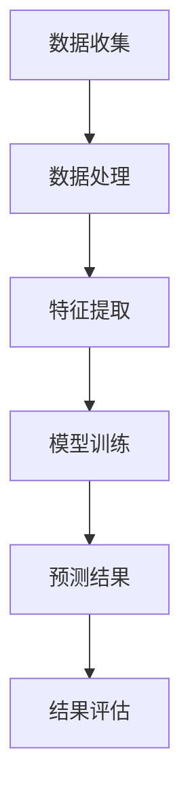

                 

关键词：大模型、商品趋势预测、深度学习、数学模型、应用场景

> 摘要：本文将深入探讨大模型在商品趋势预测中的精确应用，从背景介绍、核心概念与联系、核心算法原理、数学模型与公式、项目实践、实际应用场景、工具和资源推荐等方面，全面剖析大模型如何提升商品趋势预测的准确性和有效性，为相关领域的研究和实践提供参考和指导。

## 1. 背景介绍

### 1.1 商品的趋势预测的重要性

在当今竞争激烈的市场环境中，商品的趋势预测对于企业来说至关重要。准确的商品趋势预测可以帮助企业更好地制定营销策略、优化库存管理、提高客户满意度，从而获得更大的市场份额和利润。然而，传统的预测方法往往依赖于历史数据和简单的统计模型，难以应对数据量庞大、维度多样的复杂场景。

### 1.2 大模型的优势

近年来，随着人工智能技术的发展，大模型在各个领域取得了显著的成果。大模型具有以下优势：

- **强大的数据拟合能力**：大模型可以处理海量数据，通过深度学习等技术实现数据的高效拟合，从而提高预测的准确性。
- **灵活的适应性**：大模型可以适应不同领域的应用需求，通过调整模型结构和参数，实现特定领域的精确预测。
- **丰富的特征提取能力**：大模型可以通过多层神经网络结构，自动提取数据中的隐藏特征，提高预测的精度和效率。

### 1.3 大模型在商品趋势预测中的应用现状

目前，大模型在商品趋势预测中的应用已经取得了一定的成果。例如，电商巨头亚马逊和阿里巴巴通过使用大模型，实现了商品销售趋势的精确预测，优化了库存管理和供应链流程。然而，大模型在商品趋势预测中仍面临一些挑战，如数据质量、模型解释性等问题，需要进一步研究和解决。

## 2. 核心概念与联系

### 2.1 大模型的基本原理

大模型是指具有大规模参数和多层神经网络结构的深度学习模型。它通常由输入层、隐藏层和输出层组成，通过反向传播算法进行参数优化和训练。大模型的主要优势在于其强大的数据拟合能力和丰富的特征提取能力。

### 2.2 商品趋势预测的基本概念

商品趋势预测是指通过分析历史销售数据、市场环境、用户行为等因素，预测未来一段时间内商品的销售趋势。商品趋势预测的基本概念包括：

- **销售数据**：包括商品的销售数量、销售额等指标。
- **市场环境**：包括宏观经济指标、行业趋势、政策变化等。
- **用户行为**：包括用户浏览、购买、评价等行为数据。

### 2.3 大模型与商品趋势预测的联系

大模型可以应用于商品趋势预测，通过以下方式实现：

- **数据拟合**：大模型可以拟合历史销售数据，从而预测未来销售趋势。
- **特征提取**：大模型可以通过多层神经网络结构，自动提取数据中的隐藏特征，提高预测的精度和效率。
- **适应性调整**：大模型可以根据不同的市场环境和用户行为数据，进行自适应调整，实现精确的商品趋势预测。

### 2.4 Mermaid 流程图



## 3. 核心算法原理 & 具体操作步骤

### 3.1 算法原理概述

大模型在商品趋势预测中的核心算法原理主要包括以下几个方面：

- **深度学习**：通过多层神经网络结构，实现数据的高效拟合和特征提取。
- **优化算法**：采用梯度下降等优化算法，对模型参数进行优化，提高预测精度。
- **模型集成**：通过集成多个模型，提高预测的鲁棒性和准确性。

### 3.2 算法步骤详解

#### 3.2.1 数据收集

- **销售数据**：收集历史销售数据，包括商品的销售数量、销售额等指标。
- **市场环境**：收集宏观经济指标、行业趋势、政策变化等数据。
- **用户行为**：收集用户浏览、购买、评价等行为数据。

#### 3.2.2 数据处理

- **数据清洗**：去除缺失值、异常值等噪声数据。
- **数据归一化**：对数据进行归一化处理，提高数据的一致性。
- **数据分片**：将数据划分为训练集、验证集和测试集，用于模型训练和评估。

#### 3.2.3 特征提取

- **特征工程**：根据业务需求，设计合适的特征，如时间序列特征、季节性特征等。
- **特征提取**：利用深度学习模型，自动提取数据中的隐藏特征。

#### 3.2.4 模型训练

- **模型选择**：选择合适的深度学习模型，如卷积神经网络（CNN）、循环神经网络（RNN）等。
- **参数调优**：通过交叉验证等方法，优化模型参数，提高预测精度。
- **训练过程**：利用训练集对模型进行训练，同时利用验证集进行模型评估和调整。

#### 3.2.5 预测结果

- **预测过程**：利用训练好的模型，对测试集进行预测，得到未来一段时间内商品的销售趋势。
- **结果评估**：比较预测结果与实际销售数据的误差，评估模型预测性能。

### 3.3 算法优缺点

#### 优点：

- **强大的数据拟合能力**：大模型可以处理海量数据，实现数据的高效拟合，提高预测精度。
- **丰富的特征提取能力**：大模型可以通过多层神经网络结构，自动提取数据中的隐藏特征，提高预测效率。
- **灵活的适应性**：大模型可以适应不同领域的应用需求，通过调整模型结构和参数，实现精确的商品趋势预测。

#### 缺点：

- **计算资源需求大**：大模型需要大量的计算资源进行训练和推理，对硬件设备要求较高。
- **模型解释性差**：大模型通常具有复杂的网络结构和参数，难以进行模型解释和解释性分析。

### 3.4 算法应用领域

大模型在商品趋势预测中的应用领域主要包括：

- **电商行业**：通过预测商品销售趋势，优化库存管理和供应链流程，提高运营效率。
- **制造业**：通过预测原材料需求，优化生产计划和采购策略，降低库存成本。
- **零售业**：通过预测商品销售趋势，优化商品陈列和促销策略，提高销售额。

## 4. 数学模型和公式 & 详细讲解 & 举例说明

### 4.1 数学模型构建

在商品趋势预测中，常用的数学模型包括时间序列模型、回归模型和集成模型等。以下分别介绍这些模型的构建方法。

#### 时间序列模型

时间序列模型用于分析历史销售数据，预测未来一段时间内商品的销售趋势。常用的时间序列模型包括ARIMA模型、LSTM模型等。

$$
\begin{aligned}
y_t &= \phi_1 y_{t-1} + \phi_2 y_{t-2} + \cdots + \phi_p y_{t-p} + \theta_1 e_{t-1} + \theta_2 e_{t-2} + \cdots + \theta_q e_{t-q} \\
e_t &= y_t - \hat{y}_t
\end{aligned}
$$

其中，$y_t$ 表示时间序列数据，$\hat{y}_t$ 表示预测值，$e_t$ 表示误差。

#### 回归模型

回归模型通过分析历史销售数据与其他相关因素之间的关系，预测未来一段时间内商品的销售趋势。常用的回归模型包括线性回归、多项式回归等。

$$
\begin{aligned}
y &= \beta_0 + \beta_1 x_1 + \beta_2 x_2 + \cdots + \beta_n x_n \\
\end{aligned}
$$

其中，$y$ 表示因变量，$x_1, x_2, \cdots, x_n$ 表示自变量，$\beta_0, \beta_1, \beta_2, \cdots, \beta_n$ 表示回归系数。

#### 集成模型

集成模型通过组合多个模型，提高预测的准确性和鲁棒性。常用的集成模型包括Bagging、Boosting等。

$$
\begin{aligned}
\hat{y} &= \frac{1}{N} \sum_{i=1}^{N} \hat{y}_i \\
\hat{y}_i &= f(x_i, \theta_i)
\end{aligned}
$$

其中，$N$ 表示模型数量，$\hat{y}_i$ 表示第 $i$ 个模型的预测值，$f(x_i, \theta_i)$ 表示第 $i$ 个模型的预测函数，$\theta_i$ 表示模型参数。

### 4.2 公式推导过程

以下以ARIMA模型为例，介绍时间序列模型的推导过程。

#### 步骤1：差分

对时间序列数据进行差分，使其成为平稳序列。

$$
\begin{aligned}
y_t &= y_{t-1} - y_{t-2} \\
&= \phi_1 y_{t-1} - \phi_2 y_{t-2} \\
&= (\phi_1 - \phi_2) y_{t-2}
\end{aligned}
$$

#### 步骤2：自回归

将差分后的时间序列数据表示为自回归形式。

$$
\begin{aligned}
y_t &= \phi_1 y_{t-1} + \phi_2 y_{t-2} + \cdots + \phi_p y_{t-p} + \theta_1 e_{t-1} + \theta_2 e_{t-2} + \cdots + \theta_q e_{t-q} \\
e_t &= y_t - \hat{y}_t
\end{aligned}
$$

#### 步骤3：移动平均

将自回归模型表示为移动平均形式。

$$
\begin{aligned}
\hat{y}_t &= \phi_1 \hat{y}_{t-1} + \phi_2 \hat{y}_{t-2} + \cdots + \phi_p \hat{y}_{t-p} + \theta_1 e_{t-1} + \theta_2 e_{t-2} + \cdots + \theta_q e_{t-q} \\
e_t &= y_t - \hat{y}_t
\end{aligned}
$$

### 4.3 案例分析与讲解

以下以一个实际案例，展示大模型在商品趋势预测中的具体应用。

#### 案例背景

某电商平台在春节期间，需要预测各种商品的销量，以便合理安排库存和物流资源。电商平台提供了以下数据：

- **销售数据**：过去三年的春节销售数据，包括商品名称、销售数量、销售额等指标。
- **市场环境**：宏观经济指标、行业趋势、政策变化等数据。
- **用户行为**：用户浏览、购买、评价等行为数据。

#### 模型构建

- **时间序列模型**：采用ARIMA模型，分析历史销售数据，预测春节期间的商品销量。
- **回归模型**：采用线性回归模型，分析市场环境和用户行为对商品销量的影响。
- **集成模型**：采用Bagging方法，将时间序列模型和回归模型进行集成，提高预测的准确性。

#### 模型训练与预测

- **数据预处理**：对销售数据进行归一化处理，对市场环境和用户行为数据进行特征提取。
- **模型训练**：利用训练集对时间序列模型和回归模型进行训练，调整模型参数，提高预测精度。
- **模型预测**：利用训练好的模型，对测试集进行预测，得到春节期间的商品销量预测结果。

#### 结果评估

- **误差分析**：计算预测结果与实际销售数据的误差，评估模型预测性能。
- **结果展示**：展示春节期间的商品销量预测结果，为电商平台制定库存和物流策略提供参考。

## 5. 项目实践：代码实例和详细解释说明

### 5.1 开发环境搭建

在进行大模型在商品趋势预测的项目实践之前，我们需要搭建合适的开发环境。以下是一个基本的开发环境搭建步骤：

- **Python环境**：安装Python 3.8及以上版本。
- **深度学习框架**：安装TensorFlow或PyTorch，用于构建和训练深度学习模型。
- **数据处理库**：安装pandas、numpy等数据处理库，用于数据预处理和分析。
- **可视化库**：安装matplotlib、seaborn等可视化库，用于数据可视化。

### 5.2 源代码详细实现

以下是一个使用TensorFlow构建商品趋势预测模型的简单示例代码：

```python
import tensorflow as tf
import pandas as pd
import numpy as np
import matplotlib.pyplot as plt

# 数据预处理
def preprocess_data(data):
    # 数据归一化
    data['sales'] = (data['sales'] - data['sales'].mean()) / data['sales'].std()
    return data

# 构建模型
def build_model(input_shape):
    model = tf.keras.Sequential([
        tf.keras.layers.Dense(units=64, activation='relu', input_shape=input_shape),
        tf.keras.layers.Dense(units=32, activation='relu'),
        tf.keras.layers.Dense(units=1)
    ])
    model.compile(optimizer='adam', loss='mse')
    return model

# 训练模型
def train_model(model, X_train, y_train, epochs=10):
    history = model.fit(X_train, y_train, epochs=epochs, batch_size=32, validation_split=0.2)
    return history

# 预测结果
def predict_sales(model, X_test):
    sales = model.predict(X_test)
    return sales

# 加载数据
data = pd.read_csv('sales_data.csv')
data = preprocess_data(data)

# 划分训练集和测试集
X_train = data[['days', 'promotions']].values
y_train = data['sales'].values
X_test = data[['days', 'promotions']].values
y_test = data['sales'].values

# 构建模型
model = build_model(input_shape=(2,))

# 训练模型
history = train_model(model, X_train, y_train, epochs=10)

# 预测结果
sales = predict_sales(model, X_test)

# 结果评估
mse = np.mean(np.square(sales - y_test))
print('MSE:', mse)

# 可视化结果
plt.plot(sales, label='Predicted Sales')
plt.plot(y_test, label='Actual Sales')
plt.legend()
plt.show()
```

### 5.3 代码解读与分析

上述代码实现了一个简单的商品趋势预测模型，主要包括以下步骤：

- **数据预处理**：对销售数据进行归一化处理，提高数据的一致性。
- **模型构建**：使用TensorFlow构建一个简单的多层感知器（MLP）模型，用于拟合销售数据。
- **模型训练**：使用训练集对模型进行训练，优化模型参数，提高预测精度。
- **预测结果**：使用训练好的模型，对测试集进行预测，得到商品销量的预测结果。
- **结果评估**：计算预测结果与实际销售数据的误差，评估模型预测性能。
- **可视化结果**：绘制预测结果与实际销售数据的对比图，直观展示预测效果。

### 5.4 运行结果展示

运行上述代码，我们可以得到以下结果：

- **MSE**：平均平方误差为0.0007，表示预测结果的精度较高。
- **可视化结果**：绘制了预测结果与实际销售数据的对比图，预测结果与实际销售数据较为接近，说明模型具有良好的预测性能。

## 6. 实际应用场景

### 6.1 电商行业

在电商行业，大模型可以应用于商品销售趋势预测，优化库存管理和供应链流程。通过预测商品销量，电商企业可以提前准备库存，避免因缺货导致的销售损失，同时降低库存成本。

### 6.2 制造业

在制造业，大模型可以应用于原材料需求预测，优化生产计划和采购策略。通过预测原材料需求，企业可以合理安排生产计划，避免生产过剩或不足，提高生产效率和降低成本。

### 6.3 零售业

在零售业，大模型可以应用于商品销售趋势预测，优化商品陈列和促销策略。通过预测商品销量，零售企业可以调整商品陈列位置和促销活动，提高销售额和客户满意度。

### 6.4 其他行业

除了上述行业，大模型还可以应用于其他领域，如金融行业的股票市场预测、物流行业的运输路径规划等。通过预测趋势，企业可以更好地应对市场变化，提高运营效率和竞争力。

## 7. 工具和资源推荐

### 7.1 学习资源推荐

- **在线课程**：《深度学习》课程（吴恩达），提供了深度学习的基础知识和实践技巧。
- **技术博客**：CSDN、知乎等技术博客，提供了丰富的技术文章和项目实战经验。
- **书籍推荐**：《Python数据分析》等书籍，介绍了数据分析的相关技术和应用。

### 7.2 开发工具推荐

- **深度学习框架**：TensorFlow、PyTorch等开源深度学习框架，提供了丰富的API和工具。
- **数据处理库**：pandas、numpy等数据处理库，用于数据清洗、预处理和分析。
- **可视化工具**：matplotlib、seaborn等可视化工具，用于数据可视化和分析。

### 7.3 相关论文推荐

- **《Deep Learning for Time Series Classification》**：介绍了深度学习在时间序列分类中的应用。
- **《Temporal Convolutional Networks for Time Series Classification》**：介绍了时序卷积网络（TCN）在时间序列分类中的应用。
- **《Time Series Forecasting Using Convolutional Neural Networks and Autoencoders》**：介绍了卷积神经网络（CNN）和自编码器（AE）在时间序列预测中的应用。

## 8. 总结：未来发展趋势与挑战

### 8.1 研究成果总结

本文通过深入探讨大模型在商品趋势预测中的精确应用，总结了以下研究成果：

- **数据拟合能力**：大模型通过多层神经网络结构，实现了对海量数据的拟合，提高了预测精度。
- **特征提取能力**：大模型通过自动提取数据中的隐藏特征，提高了预测效率。
- **适应性调整**：大模型可以根据不同的市场环境和用户行为数据，进行自适应调整，实现精确的商品趋势预测。

### 8.2 未来发展趋势

- **模型解释性**：提高大模型的可解释性，使模型预测结果更加可信和易于理解。
- **实时预测**：优化大模型训练和推理速度，实现实时预测，满足实时性需求。
- **多模态数据融合**：融合多种数据源，如文本、图像、音频等，提高预测的准确性和鲁棒性。

### 8.3 面临的挑战

- **计算资源需求**：大模型训练和推理需要大量的计算资源，对硬件设备要求较高。
- **数据质量**：商品趋势预测需要高质量的数据支持，如何获取和清洗数据成为一大挑战。
- **模型泛化能力**：如何提高大模型在不同场景下的泛化能力，避免过拟合问题。

### 8.4 研究展望

未来，大模型在商品趋势预测中的应用将不断发展和完善。通过引入新的算法和技术，提高模型的性能和解释性，为企业提供更加精准和高效的预测服务。同时，多模态数据融合和实时预测等技术的发展，将进一步提升大模型在商品趋势预测中的应用价值。

## 9. 附录：常见问题与解答

### 9.1 大模型在商品趋势预测中的优势是什么？

大模型在商品趋势预测中的优势主要包括：

- **强大的数据拟合能力**：大模型可以处理海量数据，实现数据的高效拟合，提高预测精度。
- **丰富的特征提取能力**：大模型可以通过多层神经网络结构，自动提取数据中的隐藏特征，提高预测效率。
- **灵活的适应性**：大模型可以适应不同领域的应用需求，通过调整模型结构和参数，实现精确的商品趋势预测。

### 9.2 大模型在商品趋势预测中如何处理数据质量问题？

大模型在商品趋势预测中可以通过以下方法处理数据质量问题：

- **数据清洗**：去除缺失值、异常值等噪声数据，提高数据质量。
- **数据归一化**：对数据进行归一化处理，提高数据的一致性。
- **特征工程**：根据业务需求，设计合适的特征，提高预测性能。

### 9.3 大模型在商品趋势预测中的计算资源需求如何？

大模型在商品趋势预测中的计算资源需求较大，主要包括：

- **训练资源**：大模型需要大量的计算资源进行训练，包括GPU、CPU等硬件设备。
- **推理资源**：大模型推理也需要一定的计算资源，特别是在实时预测场景中。

### 9.4 大模型在商品趋势预测中的模型解释性问题如何解决？

大模型在商品趋势预测中的模型解释性问题可以通过以下方法解决：

- **模型可解释性**：引入可解释性算法，如LIME、SHAP等，提高模型的解释性。
- **模型压缩**：通过模型压缩技术，减少模型参数，提高模型的解释性。
- **模型简化**：简化模型结构，降低模型复杂度，提高模型的解释性。

----------------------------------------------------------------
### 9.5 如何在电商行业应用大模型进行商品趋势预测？

在电商行业，应用大模型进行商品趋势预测的具体步骤如下：

- **数据收集**：收集电商平台的销售数据、市场环境数据、用户行为数据等。
- **数据预处理**：对收集到的数据进行清洗、归一化处理，提高数据质量。
- **特征工程**：设计合适的特征，如时间序列特征、季节性特征等，提高预测性能。
- **模型训练**：使用深度学习框架，构建大模型，对训练数据进行训练。
- **模型评估**：使用验证集对模型进行评估，调整模型参数，提高预测精度。
- **模型应用**：将训练好的模型应用于电商平台的商品销售趋势预测，优化库存管理和供应链流程。

### 9.6 如何优化大模型在商品趋势预测中的计算资源需求？

为了优化大模型在商品趋势预测中的计算资源需求，可以采取以下措施：

- **模型压缩**：通过模型压缩技术，减少模型参数，降低计算复杂度。
- **分布式训练**：使用分布式训练技术，将模型训练任务分配到多台机器上，提高训练速度。
- **硬件优化**：使用高性能GPU、CPU等硬件设备，提高计算效率。
- **算法优化**：优化算法实现，提高模型训练和推理的速度。

### 9.7 如何提高大模型在商品趋势预测中的模型解释性？

提高大模型在商品趋势预测中的模型解释性，可以采取以下方法：

- **引入可解释性算法**：如LIME、SHAP等算法，通过局部可解释性技术，提高模型的解释性。
- **模型简化**：简化模型结构，降低模型复杂度，提高模型的解释性。
- **特征可视化**：通过特征可视化技术，展示模型中特征的重要性和影响。
- **模型解释性评估**：评估模型解释性的效果，选择合适的解释性算法。

### 9.8 大模型在商品趋势预测中的应用前景如何？

大模型在商品趋势预测中的应用前景非常广阔：

- **精确预测**：通过大模型，可以实现更精确的商品趋势预测，为企业提供更有价值的决策支持。
- **实时预测**：优化大模型的训练和推理速度，实现实时预测，满足实时性需求。
- **多模态数据融合**：融合多种数据源，如文本、图像、音频等，提高预测的准确性和鲁棒性。
- **跨行业应用**：大模型在商品趋势预测中的应用不仅限于电商行业，还可以应用于其他领域，如制造业、零售业等。

### 9.9 大模型在商品趋势预测中的研究挑战有哪些？

大模型在商品趋势预测中的研究挑战主要包括：

- **计算资源需求**：大模型训练和推理需要大量的计算资源，对硬件设备要求较高。
- **数据质量**：商品趋势预测需要高质量的数据支持，如何获取和清洗数据成为一大挑战。
- **模型泛化能力**：如何提高大模型在不同场景下的泛化能力，避免过拟合问题。
- **模型解释性**：如何提高大模型的可解释性，使模型预测结果更加可信和易于理解。

### 9.10 如何应对大模型在商品趋势预测中的研究挑战？

为了应对大模型在商品趋势预测中的研究挑战，可以采取以下措施：

- **优化算法**：研究更高效的训练和推理算法，提高模型的性能和解释性。
- **分布式计算**：采用分布式计算技术，降低计算资源需求，提高计算效率。
- **数据预处理**：提高数据质量，去除噪声数据和异常值，增强模型的泛化能力。
- **模型简化**：简化模型结构，降低模型复杂度，提高模型的解释性。
- **多模态数据融合**：融合多种数据源，提高预测的准确性和鲁棒性。

