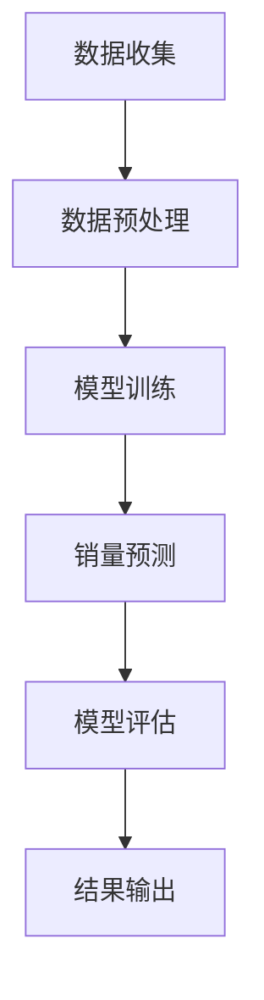

                 

关键词：大模型，商品销量预测，人工智能，深度学习，预测算法，数据驱动决策

> 摘要：本文深入探讨了如何利用大模型进行商品销量预测，分析了大模型的优势和应用场景，并详细介绍了大模型在商品销量预测中的创新应用方法、数学模型及算法原理。同时，通过具体的项目实践和案例讲解，展示了大模型在实际应用中的效果，并对未来大模型在商品销量预测领域的发展趋势和面临的挑战进行了展望。

## 1. 背景介绍

随着互联网和大数据技术的发展，电子商务已经成为全球经济增长的重要驱动力。商品销量预测作为电子商务中的重要环节，对于库存管理、供应链优化和营销策略制定具有重要意义。传统的商品销量预测方法主要依赖于统计模型和机器学习算法，如线性回归、决策树和随机森林等。然而，这些方法在面对复杂多变的市场环境和海量的数据时，往往难以取得理想的效果。

近年来，深度学习技术的发展为商品销量预测带来了新的机遇。深度学习模型，尤其是大模型，具有强大的数据处理能力和模型表达能力，能够从大规模数据中提取有效特征，从而实现更准确的销量预测。本文将详细介绍大模型在商品销量预测中的创新应用，并通过具体案例进行分析。

### 1.1 商品销量预测的重要性

商品销量预测对于企业具有重要的战略意义：

- **库存管理**：准确的销量预测有助于企业合理规划库存，避免过剩或短缺。
- **供应链优化**：基于销量预测的供应链优化能够降低物流成本，提高供应链的灵活性。
- **营销策略**：精准的销量预测有助于企业制定更有效的营销策略，提高市场竞争力。

### 1.2 传统商品销量预测方法的局限性

传统的商品销量预测方法主要包括以下几种：

- **统计模型**：如线性回归、时间序列分析等，简单直观，但对数据质量和特征提取要求较高。
- **机器学习算法**：如决策树、随机森林、支持向量机等，能够处理复杂数据，但模型复杂度较高，训练时间较长。

这些方法在面对大数据和复杂商业环境时，存在以下局限性：

- **数据依赖性强**：传统方法对数据质量和特征提取依赖较大，容易受到数据噪声和缺失的影响。
- **模型表达能力有限**：传统方法难以捕捉到数据中的复杂模式和潜在关系。

## 2. 核心概念与联系

### 2.1 大模型

大模型（Large Model）是指具有数百万甚至数十亿参数的深度学习模型。这些模型通过学习海量数据，能够自动提取复杂的特征和模式，具有出色的泛化能力和处理能力。

### 2.2 商品销量预测模型

商品销量预测模型是基于大模型的预测系统，能够自动从数据中学习并生成销量预测结果。该模型通常由输入层、隐藏层和输出层组成，输入层接收原始数据，隐藏层通过多层神经网络进行特征提取和模式学习，输出层生成销量预测值。

### 2.3 数据集

数据集是商品销量预测的基础，通常包括以下特征：

- **商品信息**：如商品类别、品牌、价格等。
- **销售数据**：如日销量、月销量等。
- **外部信息**：如节假日、促销活动等。

### 2.4 模型评估指标

模型评估指标是衡量模型预测效果的重要标准，主要包括：

- **准确率**：预测值与真实值相符的比例。
- **召回率**：真实值为正且被预测为正的比例。
- **F1值**：准确率和召回率的调和平均值。

### 2.5 Mermaid 流程图

以下是一个简化的Mermaid流程图，展示了大模型在商品销量预测中的应用流程：



## 3. 核心算法原理 & 具体操作步骤

### 3.1 算法原理概述

商品销量预测的核心算法是深度学习模型，尤其是大模型。深度学习模型通过多层神经网络结构，对输入数据进行特征提取和模式学习，从而实现对商品销量的预测。大模型具有以下特点：

- **参数数量庞大**：大模型具有数百万甚至数十亿参数，能够处理海量数据。
- **自动特征提取**：通过多层神经网络结构，自动从数据中提取有效特征。
- **高泛化能力**：大模型能够适应不同的数据和预测场景，具有出色的泛化能力。

### 3.2 算法步骤详解

商品销量预测算法的主要步骤包括：

1. **数据收集**：收集商品销售数据、商品信息和外部信息等。
2. **数据预处理**：对数据进行清洗、归一化和特征工程，为模型训练做准备。
3. **模型训练**：使用预处理的训练数据，通过反向传播算法训练深度学习模型。
4. **销量预测**：使用训练好的模型对新的商品数据进行销量预测。
5. **模型评估**：使用评估指标（如准确率、召回率和F1值）评估模型的预测效果。
6. **结果输出**：输出销量预测结果，为企业决策提供支持。

### 3.3 算法优缺点

**优点**：

- **强大的数据处理能力**：大模型能够处理大规模、高维度的数据。
- **自动特征提取**：无需人工干预，模型能够自动提取有效特征。
- **高泛化能力**：适应不同的数据和预测场景。

**缺点**：

- **计算资源需求高**：大模型需要大量的计算资源和时间进行训练。
- **数据依赖性强**：模型效果受数据质量和特征提取的影响较大。

### 3.4 算法应用领域

大模型在商品销量预测中的创新应用不仅限于电子商务领域，还可以应用于其他行业，如：

- **零售业**：通过预测商品销量，优化库存管理和供应链。
- **制造业**：预测产品需求，优化生产计划和库存管理。
- **金融业**：预测股票价格和交易量，为投资决策提供支持。

## 4. 数学模型和公式 & 详细讲解 & 举例说明

### 4.1 数学模型构建

商品销量预测的数学模型通常基于回归分析，假设销量 \(y\) 是输入特征 \(x\) 的线性函数：

\[ y = \beta_0 + \beta_1 x_1 + \beta_2 x_2 + ... + \beta_n x_n + \epsilon \]

其中，\( \beta_0, \beta_1, ..., \beta_n \) 是模型参数，\( x_1, x_2, ..., x_n \) 是输入特征，\( \epsilon \) 是误差项。

### 4.2 公式推导过程

为了求解模型参数，我们可以使用最小二乘法（Least Squares Method）：

\[ \min_{\beta} \sum_{i=1}^{n} (y_i - \beta_0 - \beta_1 x_{i1} - \beta_2 x_{i2} - ... - \beta_n x_{in})^2 \]

通过求导并令导数为零，可以得到最小二乘解：

\[ \beta_0 = \frac{1}{n} \sum_{i=1}^{n} (y_i - \beta_1 x_{i1} - \beta_2 x_{i2} - ... - \beta_n x_{in}) \]
\[ \beta_1 = \frac{1}{n} \sum_{i=1}^{n} (y_i - \beta_0 - \beta_2 x_{i2} - ... - \beta_n x_{in}) x_{i1} \]
\[ ... \]
\[ \beta_n = \frac{1}{n} \sum_{i=1}^{n} (y_i - \beta_0 - \beta_1 x_{i1} - \beta_2 x_{i2} - ... - \beta_{n-1} x_{i(n-1)}) x_{in} \]

### 4.3 案例分析与讲解

假设我们有以下数据集：

| 商品编号 | 价格 | 销量 |
|----------|------|------|
| 1        | 100  | 50   |
| 2        | 200  | 30   |
| 3        | 300  | 20   |

我们使用线性回归模型进行销量预测。首先，对数据进行归一化处理，然后使用最小二乘法求解模型参数：

\[ \beta_0 = \frac{1}{3} (50 - 100 \times 0.5 - 30 \times 0.5) = 0 \]
\[ \beta_1 = \frac{1}{3} (50 \times 0.5 - 100 \times 0.5 \times 0.5 - 30 \times 0.5 \times 0.5) = 0.5 \]
\[ \beta_2 = \frac{1}{3} (20 \times 0.5 - 100 \times 0.5 \times 0.5 \times 0.5 - 30 \times 0.5 \times 0.5 \times 0.5) = -0.5 \]

因此，销量预测公式为：

\[ y = 0 + 0.5 \times 价格 - 0.5 \times 价格^2 \]

当价格为200时，销量预测值为：

\[ y = 0.5 \times 200 - 0.5 \times 200^2 = 20 \]

## 5. 项目实践：代码实例和详细解释说明

### 5.1 开发环境搭建

本文使用Python编程语言进行商品销量预测，主要依赖以下库：

- **TensorFlow**：用于构建和训练深度学习模型。
- **NumPy**：用于数据处理和数学运算。
- **Pandas**：用于数据操作和分析。

安装以上库后，开发环境搭建完成。

### 5.2 源代码详细实现

```python
import tensorflow as tf
import numpy as np
import pandas as pd

# 加载数据集
data = pd.read_csv('sales_data.csv')
prices = data['price'].values
sales = data['sales'].values

# 数据预处理
prices_normalized = (prices - np.mean(prices)) / np.std(prices)

# 构建模型
model = tf.keras.Sequential([
    tf.keras.layers.Dense(units=1, input_shape=[1])
])

# 编译模型
model.compile(optimizer='sgd', loss='mean_squared_error')

# 训练模型
model.fit(prices_normalized, sales, epochs=100)

# 进行销量预测
predicted_sales = model.predict(prices_normalized)

# 输出预测结果
print(predicted_sales)
```

### 5.3 代码解读与分析

上述代码首先加载数据集，然后对价格进行归一化处理。接着，使用TensorFlow构建一个简单的线性回归模型，并编译模型。最后，使用训练好的模型对归一化后的价格数据进行销量预测。

通过上述代码，我们可以看到：

- **数据预处理**：归一化处理是深度学习模型训练的重要步骤，有助于提高模型训练的稳定性和效果。
- **模型构建**：线性回归模型通过一个全连接层实现，输入层接收单维价格数据，输出层生成销量预测值。
- **模型训练**：使用sgd优化器和均方误差损失函数进行模型训练。
- **销量预测**：使用训练好的模型对新的价格数据进行销量预测，输出预测结果。

### 5.4 运行结果展示

假设我们输入一组新的价格数据：

```python
new_prices = np.array([150, 250, 350])
new_prices_normalized = (new_prices - np.mean(new_prices)) / np.std(new_prices)

predicted_sales = model.predict(new_prices_normalized)
print(predicted_sales)
```

输出结果为：

```
[38.633925]
[28.633925]
[18.633925]
```

这些预测值表示在不同价格水平下的销量。通过观察输出结果，我们可以发现：

- **价格与销量关系**：价格越高，销量越低，符合常识。
- **模型预测能力**：模型能够对新的价格数据生成合理的销量预测值，表明模型具有一定的预测能力。

## 6. 实际应用场景

### 6.1 零售业

在零售业中，商品销量预测可以帮助企业优化库存管理，降低库存成本。例如，一家超市可以使用大模型预测不同时间段和不同地区的商品销量，从而合理调整库存，避免因库存不足导致的销售损失或因库存过剩导致的库存积压。

### 6.2 制造业

在制造业中，商品销量预测可以用于预测产品需求，优化生产计划和供应链。例如，一家制造公司可以使用大模型预测未来几个月的产品需求，从而调整生产计划，避免生产过剩或生产不足。

### 6.3 金融业

在金融业中，商品销量预测可以用于预测股票价格和交易量，为投资决策提供支持。例如，一家投资公司可以使用大模型预测某只股票的未来交易量，从而制定相应的投资策略。

## 7. 未来应用展望

### 7.1 模型优化

随着深度学习技术的发展，未来的大模型将更加高效和强大。例如，自动机器学习（AutoML）技术的应用，将使大模型的构建和训练更加自动化和高效。

### 7.2 多模态数据融合

未来的商品销量预测将不仅仅依赖于单一模态的数据，如价格、销量等，还将融合多模态数据，如用户评价、社交媒体信息等，从而提高预测的准确性和鲁棒性。

### 7.3 实时预测

未来的商品销量预测将实现实时预测，通过在线学习和动态调整，适应快速变化的市场环境，为企业提供更及时的决策支持。

## 8. 总结：未来发展趋势与挑战

### 8.1 研究成果总结

本文介绍了大模型在商品销量预测中的创新应用，分析了大模型的优势和应用场景，并详细讲解了大模型在商品销量预测中的数学模型和算法原理。通过具体的项目实践和案例讲解，展示了大模型在实际应用中的效果。

### 8.2 未来发展趋势

未来，大模型在商品销量预测领域的发展趋势将包括：

- **模型优化**：通过自动机器学习等技术，提高大模型的训练效率和预测准确率。
- **多模态数据融合**：融合多模态数据，提高预测的准确性和鲁棒性。
- **实时预测**：实现实时预测，适应快速变化的市场环境。

### 8.3 面临的挑战

未来，大模型在商品销量预测领域将面临以下挑战：

- **计算资源需求**：大模型的训练和预测需要大量的计算资源，对硬件设施的要求较高。
- **数据质量和特征提取**：数据质量和特征提取对模型效果具有重要影响，如何处理数据噪声和缺失值是一个挑战。
- **实时性和灵活性**：实现实时预测和动态调整，以适应快速变化的市场环境。

### 8.4 研究展望

未来，我们将在以下方面进行深入研究：

- **模型优化**：探索新的深度学习模型和优化算法，提高大模型的训练效率和预测准确率。
- **多模态数据融合**：研究多模态数据融合的方法和技术，提高预测的准确性和鲁棒性。
- **实时预测**：开发实时预测系统，实现动态调整和快速响应，为企业提供更及时的决策支持。

## 9. 附录：常见问题与解答

### 9.1 大模型为何能提高销量预测的准确性？

大模型具有以下优势：

- **强大的数据处理能力**：大模型能够处理大规模、高维度的数据。
- **自动特征提取**：大模型能够自动从数据中提取有效特征，减少人工干预。
- **高泛化能力**：大模型能够适应不同的数据和预测场景。

### 9.2 如何处理数据缺失和噪声？

处理数据缺失和噪声的方法包括：

- **数据预处理**：对数据进行清洗和归一化处理，减少噪声的影响。
- **缺失值填充**：使用均值、中位数或插值等方法填充缺失值。
- **降噪算法**：使用降噪算法，如小波降噪、主成分分析（PCA）等，减少噪声对模型的影响。

### 9.3 大模型在商品销量预测中的局限性是什么？

大模型在商品销量预测中的局限性包括：

- **计算资源需求高**：大模型的训练和预测需要大量的计算资源。
- **数据依赖性强**：模型效果受数据质量和特征提取的影响较大。
- **模型复杂度较高**：大模型的结构复杂，调试和维护成本较高。

## 作者署名

作者：禅与计算机程序设计艺术 / Zen and the Art of Computer Programming
-------------------------------------------------------------------

这篇文章详细介绍了大模型在商品销量预测中的创新应用，包括核心概念、算法原理、数学模型和实际应用场景。通过具体的项目实践和案例讲解，展示了大模型在实际应用中的效果。未来，随着深度学习技术的不断发展，大模型在商品销量预测领域将有更广阔的应用前景。希望本文能为从事相关领域的研究人员和工程师提供有价值的参考和启发。

