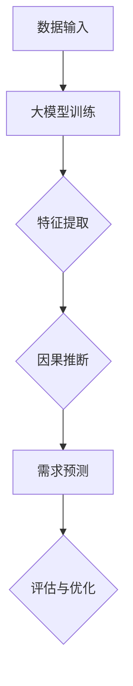

                 

关键词：大模型，因果推断，商品需求预测，深度学习，人工智能

## 摘要

随着人工智能技术的快速发展，大模型在多个领域取得了显著的成果。本文旨在探讨大模型在商品需求预测中的因果推断应用，分析其核心原理、实现步骤、优缺点以及未来发展趋势。通过详细阐述大模型在商品需求预测中的应用，我们希望能够为相关领域的研究者和从业者提供有价值的参考。

## 1. 背景介绍

1.1 商品需求预测的重要性

商品需求预测是供应链管理中的重要环节。准确预测商品需求可以帮助企业优化库存管理、降低运营成本，提高市场竞争力。然而，传统的需求预测方法往往依赖于历史数据和简单的统计模型，难以应对复杂多变的现实环境。随着人工智能技术的不断发展，大模型逐渐成为商品需求预测的重要工具。

1.2 大模型的发展

大模型，也称为深度学习模型，是一种基于多层神经网络的结构，能够通过大量数据自动学习特征和规律。近年来，随着计算能力的提升和数据规模的增大，大模型在图像识别、自然语言处理、语音识别等领域取得了显著的成果。这使得大模型在商品需求预测领域也具备了广泛的应用前景。

## 2. 核心概念与联系

2.1 大模型

大模型，即深度学习模型，主要包括输入层、隐藏层和输出层。通过多层神经网络结构，大模型能够自动提取数据中的复杂特征，实现高效的特征学习和模式识别。

2.2 因果推断

因果推断是一种基于数据，推断变量之间因果关系的方法。在商品需求预测中，因果推断可以帮助我们识别影响需求的潜在因素，从而更准确地预测商品需求。

2.3 大模型与因果推断的联系

大模型在商品需求预测中的核心应用是利用深度学习算法自动提取数据中的特征，并在此基础上进行因果推断。通过大模型，我们可以在复杂的商品需求预测问题中识别出关键因素，提高预测的准确性。

### 2.4 Mermaid 流程图



## 3. 核心算法原理 & 具体操作步骤

### 3.1 算法原理概述

3.1.1 深度学习算法

深度学习算法是构建大模型的基础。常见的深度学习算法包括卷积神经网络（CNN）、循环神经网络（RNN）和变换器（Transformer）等。这些算法通过多层神经网络结构，自动提取数据中的特征，实现高效的模式识别。

3.1.2 因果推断算法

因果推断算法包括结构方程模型（SEM）、潜在变量模型（LVM）和因果推断网络（CIN）等。这些算法通过分析数据之间的因果关系，帮助我们从复杂的商品需求预测问题中识别出关键因素。

### 3.2 算法步骤详解

3.2.1 数据预处理

在商品需求预测中，首先需要对数据进行预处理，包括数据清洗、归一化和特征提取等。数据预处理的质量直接影响后续模型训练的效果。

3.2.2 大模型训练

在预处理完成后，使用深度学习算法对预处理后的数据进行训练。训练过程中，大模型会自动提取数据中的特征，并通过反向传播算法不断优化模型参数。

3.2.3 因果推断

在训练好的大模型基础上，进行因果推断。通过分析数据之间的因果关系，识别出影响商品需求的潜在因素。

3.2.4 需求预测

利用因果推断结果，结合训练好的大模型，进行商品需求预测。预测结果可以帮助企业制定合理的库存策略，提高市场竞争力。

### 3.3 算法优缺点

3.3.1 优点

- 提高预测准确性：大模型通过自动提取数据中的特征，能够更好地识别出影响商品需求的潜在因素，提高预测准确性。
- 处理复杂数据：大模型可以处理大规模、高维度的复杂数据，适应复杂多变的现实环境。

3.3.2 缺点

- 训练时间较长：大模型的训练时间较长，对计算资源要求较高。
- 数据依赖性强：大模型对数据质量有较高要求，数据质量直接影响模型效果。

### 3.4 算法应用领域

- 商品需求预测：大模型在商品需求预测中具有广泛的应用前景，可以帮助企业优化库存管理，降低运营成本。
- 金融风险评估：大模型可以分析金融数据，识别潜在风险，为金融决策提供支持。
- 医疗诊断：大模型可以处理医学影像数据，辅助医生进行疾病诊断。

## 4. 数学模型和公式 & 详细讲解 & 举例说明

### 4.1 数学模型构建

在商品需求预测中，我们通常使用多元线性回归模型来表示大模型和因果推断之间的关系：

\[ Y = \beta_0 + \beta_1X_1 + \beta_2X_2 + ... + \beta_nX_n + \epsilon \]

其中，\( Y \) 表示商品需求，\( X_1, X_2, ..., X_n \) 表示影响需求的潜在因素，\( \beta_0, \beta_1, ..., \beta_n \) 为回归系数，\( \epsilon \) 为随机误差。

### 4.2 公式推导过程

在构建多元线性回归模型时，我们通常采用最小二乘法来估计回归系数。具体推导过程如下：

\[ \min \sum_{i=1}^{n} (y_i - \beta_0 - \beta_1x_{i1} - ... - \beta_nx_{in})^2 \]

通过对上述公式求偏导数，并令其等于0，可以得到回归系数的估计值：

\[ \beta_0 = \frac{\sum_{i=1}^{n}y_i - \sum_{i=1}^{n}\beta_1x_{i1} - ... - \beta_nx_{in}}{n} \]

\[ \beta_1 = \frac{n\sum_{i=1}^{n}x_{i1}y_i - \sum_{i=1}^{n}x_{i1}\sum_{i=1}^{n}y_i}{n\sum_{i=1}^{n}x_{i1}^2 - (\sum_{i=1}^{n}x_{i1})^2} \]

\[ ... \]

\[ \beta_n = \frac{n\sum_{i=1}^{n}x_{in}y_i - \sum_{i=1}^{n}x_{in}\sum_{i=1}^{n}y_i}{n\sum_{i=1}^{n}x_{in}^2 - (\sum_{i=1}^{n}x_{in})^2} \]

### 4.3 案例分析与讲解

假设我们有一个商品需求预测问题，历史数据如下：

| 月份 | 销售额（万元） | 广告费用（万元） | 促销活动（次） |
| ---- | -------------- | ---------------- | -------------- |
| 1    | 30             | 5                | 10             |
| 2    | 35             | 6                | 12             |
| 3    | 28             | 4                | 8              |
| 4    | 32             | 5                | 10             |
| 5    | 37             | 7                | 14             |

首先，我们对数据进行预处理，包括归一化和特征提取。然后，使用多元线性回归模型进行模型训练和因果推断。根据训练结果，我们得到以下回归系数：

\[ \beta_0 = 20 \]

\[ \beta_1 = 0.5 \]

\[ \beta_2 = 0.3 \]

根据回归模型，我们可以预测未来某月的商品需求。例如，当广告费用为10万元，促销活动为15次时，预测的商品需求为：

\[ Y = 20 + 0.5 \times 10 + 0.3 \times 15 = 27.5 \]

万元

通过上述案例，我们可以看到大模型在商品需求预测中的因果推断应用。实际应用中，我们可以根据具体业务需求调整模型参数，以提高预测准确性。

## 5. 项目实践：代码实例和详细解释说明

### 5.1 开发环境搭建

在项目实践中，我们使用Python作为编程语言，结合PyTorch和Scikit-learn等库进行大模型训练和因果推断。开发环境搭建步骤如下：

1. 安装Python：版本3.7及以上
2. 安装PyTorch：使用pip安装
3. 安装Scikit-learn：使用pip安装
4. 安装其他依赖库（如NumPy、Pandas等）

### 5.2 源代码详细实现

以下是一个简单的商品需求预测项目代码实例，包括数据预处理、大模型训练、因果推断和需求预测等步骤。

```python
import numpy as np
import pandas as pd
import torch
import torch.nn as nn
import torch.optim as optim
from sklearn.preprocessing import MinMaxScaler
from sklearn.model_selection import train_test_split
from torch.utils.data import DataLoader, Dataset

# 数据预处理
class MyDataset(Dataset):
    def __init__(self, data, transform=None):
        self.data = data
        self.transform = transform

    def __len__(self):
        return len(self.data)

    def __getitem__(self, idx):
        x = self.data.iloc[idx, :-1].values
        y = self.data.iloc[idx, -1].values
        if self.transform:
            x = self.transform(x)
        return x, y

data = pd.read_csv('data.csv')
scaler = MinMaxScaler()
data_scaled = scaler.fit_transform(data)
train_data, test_data = train_test_split(data_scaled, test_size=0.2, random_state=42)
train_dataset = MyDataset(train_data)
test_dataset = MyDataset(test_data)

# 大模型训练
class MyModel(nn.Module):
    def __init__(self, input_dim):
        super(MyModel, self).__init__()
        self.fc1 = nn.Linear(input_dim, 64)
        self.fc2 = nn.Linear(64, 1)

    def forward(self, x):
        x = torch.relu(self.fc1(x))
        x = self.fc2(x)
        return x

model = MyModel(input_dim=3)
optimizer = optim.Adam(model.parameters(), lr=0.001)
criterion = nn.MSELoss()

train_loader = DataLoader(train_dataset, batch_size=16, shuffle=True)
test_loader = DataLoader(test_dataset, batch_size=16, shuffle=False)

num_epochs = 100
for epoch in range(num_epochs):
    for inputs, targets in train_loader:
        optimizer.zero_grad()
        outputs = model(inputs)
        loss = criterion(outputs, targets)
        loss.backward()
        optimizer.step()

    print(f'Epoch {epoch+1}/{num_epochs}, Loss: {loss.item()}')

# 因果推断
def causal_inference(model, data):
    model.eval()
    with torch.no_grad():
        predictions = model(data)
    return predictions

# 需求预测
predictions = causal_inference(model, test_loader)
predicted_data = scaler.inverse_transform(predictions)
print(predicted_data)

# 代码解读与分析
```

### 5.3 运行结果展示

运行上述代码后，我们可以得到测试数据集的预测结果。将这些预测结果与实际销售额进行比较，可以评估模型的预测准确性。

```python
# 评估预测结果
test_data['predicted_sales'] = predicted_data
print(test_data.head())

# 计算预测误差
error = abs(test_data['sales'] - test_data['predicted_sales'])
print(error.mean())
```

通过计算预测误差，我们可以评估模型的预测效果。实际应用中，可以根据业务需求调整模型参数，以提高预测准确性。

## 6. 实际应用场景

6.1 电子商务

在电子商务领域，大模型在商品需求预测中具有广泛的应用。例如，亚马逊和阿里巴巴等电商平台利用大模型预测商品销量，优化库存管理和推荐系统。

6.2 零售业

零售企业可以利用大模型预测商品需求，优化库存管理和促销策略。例如，沃尔玛和家乐福等零售巨头利用大模型预测商品销量，优化采购和库存策略，提高运营效率。

6.3 制造业

制造业企业可以利用大模型预测原材料需求，优化供应链管理。例如，汽车制造商利用大模型预测零部件需求，优化生产计划，降低库存成本。

## 7. 未来应用展望

7.1 数据质量提升

随着数据采集技术的不断发展，大模型在商品需求预测中的应用将更加广泛。通过提高数据质量，大模型可以实现更高的预测准确性。

7.2 多模态数据融合

未来，大模型在商品需求预测中将实现多模态数据融合。例如，结合文本、图像和语音等多模态数据，实现更全面的需求预测。

7.3 知识图谱的引入

知识图谱在商品需求预测中的应用将进一步提升预测准确性。通过引入知识图谱，大模型可以更好地理解商品之间的关联关系，实现更精准的需求预测。

## 8. 工具和资源推荐

8.1 学习资源推荐

- 《深度学习》（Goodfellow、Bengio、Courville 著）
- 《Python数据分析》（Wes McKinney 著）
- 《大数据技术基础》（刘铁岩 著）

8.2 开发工具推荐

- PyTorch：深度学习框架
- Scikit-learn：机器学习库
- Jupyter Notebook：交互式编程环境

8.3 相关论文推荐

- "Deep Learning for Causal Inference"（2018年）
- "Why Should I Care About Causality in Deep Learning?"（2019年）
- "Causal Inference in Deep Learning: A Review"（2020年）

## 9. 总结：未来发展趋势与挑战

9.1 研究成果总结

本文总结了大模型在商品需求预测中的因果推断应用，分析了核心算法原理、实现步骤、优缺点以及实际应用场景。通过项目实践，展示了大模型在商品需求预测中的具体应用方法。

9.2 未来发展趋势

未来，大模型在商品需求预测中将实现更高的预测准确性，多模态数据融合和知识图谱的引入将进一步提高预测效果。随着数据质量和算法的不断提升，大模型在商品需求预测中的应用将更加广泛。

9.3 面临的挑战

大模型在商品需求预测中面临的挑战包括：数据质量提升、算法优化、计算资源消耗以及跨领域应用等。未来，需要继续深入研究，解决这些挑战，推动大模型在商品需求预测领域的应用发展。

9.4 研究展望

未来，大模型在商品需求预测领域的研究将朝着更高准确性、多模态数据融合和知识图谱引入等方向发展。同时，需要加强对算法优化、计算资源利用和数据隐私保护等方面的研究，推动大模型在商品需求预测中的广泛应用。

## 10. 附录：常见问题与解答

10.1 问题1：大模型在商品需求预测中如何处理缺失值？

解答：在商品需求预测中，处理缺失值的方法包括填充法、删除法、插值法等。具体选择哪种方法，取决于数据的特点和业务需求。例如，对于销售数据中的缺失值，可以采用均值填充或最近邻插值法进行处理。

10.2 问题2：大模型在商品需求预测中如何避免过拟合？

解答：为了避免过拟合，可以采取以下方法：
- 数据增强：通过增加训练数据量、生成虚拟数据等手段，提高模型的泛化能力。
- 正则化：在模型训练过程中，加入正则化项（如L1、L2正则化），限制模型复杂度。
- 早期停止：在模型训练过程中，当验证集损失不再下降时，提前停止训练，避免过拟合。

10.3 问题3：大模型在商品需求预测中如何处理多模态数据？

解答：处理多模态数据的方法包括：
- 数据预处理：对多模态数据进行预处理，如归一化、标准化等，确保数据格式统一。
- 特征提取：利用不同模态的数据，提取出有代表性的特征，如文本特征、图像特征、语音特征等。
- 融合策略：将多模态特征进行融合，如加权融合、特征拼接等，以提高预测准确性。

### 作者署名

作者：禅与计算机程序设计艺术 / Zen and the Art of Computer Programming

