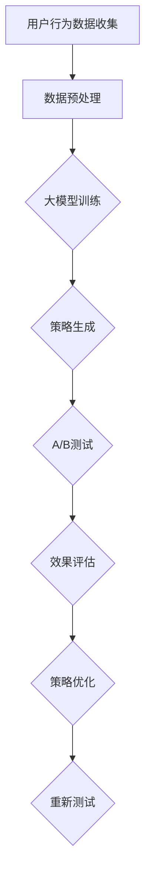

                 

关键词：大模型，推荐系统，A/B测试，算法优化，性能提升，数据分析

> 摘要：本文将探讨大模型在推荐系统A/B测试中的应用，分析大模型的特性及其在A/B测试中的优势，结合实际案例，深入讲解大模型在推荐系统中的应用方法和效果，并探讨其未来发展趋势与挑战。

## 1. 背景介绍

随着互联网的快速发展，推荐系统已经成为现代互联网应用中不可或缺的一部分。推荐系统通过分析用户的兴趣和行为，为用户推荐他们可能感兴趣的内容，从而提高用户满意度、增加用户黏性，并最终提高商业收益。然而，推荐系统的优化和改进是一个持续的过程，A/B测试作为推荐系统优化的重要手段，被广泛应用。

传统的A/B测试主要关注用户行为的统计分析和转化率的提升，但在推荐系统的优化过程中，如何准确评估模型的效果，如何在海量数据中快速找到最优策略，成为一大挑战。大模型的引入为推荐系统A/B测试带来了新的思路和方法。

## 2. 核心概念与联系

### 2.1 大模型的概念

大模型（Large Model）通常指的是具有数十亿甚至千亿参数的深度学习模型，如Transformer、BERT等。大模型具有强大的表征能力和泛化能力，可以在各种复杂任务中取得优异的性能。

### 2.2 推荐系统的A/B测试

A/B测试（A/B Testing）是一种常用的实验方法，通过在两个或多个版本之间进行随机分配，比较不同版本的用户行为和转化率，从而评估和选择最优版本。

### 2.3 大模型与推荐系统A/B测试的联系

大模型在推荐系统A/B测试中的应用主要体现在以下几个方面：

1. **效果评估**：大模型可以更准确地预测用户的行为和偏好，从而提高A/B测试的效果评估准确性。

2. **策略优化**：大模型可以处理海量的用户行为数据，通过机器学习算法，自动寻找最优的推荐策略。

3. **效率提升**：大模型的高效计算能力，可以在短时间内完成A/B测试的多次迭代，提高测试效率。

### 2.4 Mermaid 流程图

以下是一个简化的推荐系统A/B测试流程图，展示了大模型的应用：



## 3. 核心算法原理 & 具体操作步骤

### 3.1 算法原理概述

大模型在推荐系统A/B测试中的核心算法原理主要包括以下几个方面：

1. **用户行为建模**：通过深度学习模型，对用户的历史行为数据进行建模，提取用户兴趣特征。

2. **推荐策略生成**：基于用户兴趣特征，生成推荐策略，为用户推荐他们可能感兴趣的内容。

3. **效果评估与优化**：通过A/B测试，对比不同推荐策略的效果，根据评估结果，自动调整推荐策略。

### 3.2 算法步骤详解

1. **用户行为数据收集**：收集用户的浏览、搜索、点击等行为数据。

2. **数据预处理**：对收集到的用户行为数据进行清洗、去重、归一化等处理。

3. **大模型训练**：利用预处理后的数据，训练深度学习模型，提取用户兴趣特征。

4. **推荐策略生成**：基于用户兴趣特征，生成推荐策略。

5. **A/B测试**：将生成的推荐策略与现有策略进行A/B测试，比较不同策略的效果。

6. **效果评估与优化**：根据A/B测试的结果，调整推荐策略，进行新一轮的A/B测试。

### 3.3 算法优缺点

**优点**：

1. **准确性高**：大模型可以更准确地预测用户的行为和偏好，提高A/B测试的准确性。

2. **效率提升**：大模型的高效计算能力，可以缩短A/B测试的时间。

3. **自动化**：通过机器学习算法，实现推荐策略的自动化生成和优化。

**缺点**：

1. **计算资源消耗大**：大模型训练和推理需要大量的计算资源。

2. **数据隐私问题**：用户行为数据涉及用户隐私，需要确保数据的安全性和隐私性。

### 3.4 算法应用领域

大模型在推荐系统A/B测试中的应用非常广泛，可以应用于电商、社交、新闻、视频等多个领域。以下是一些具体的案例：

1. **电商推荐**：通过大模型，可以更准确地预测用户的购物意图，为用户提供个性化的商品推荐。

2. **社交网络**：通过大模型，可以更好地理解用户的社交关系，为用户提供更有针对性的社交推荐。

3. **新闻推荐**：通过大模型，可以更准确地理解用户的阅读偏好，为用户提供个性化的新闻推荐。

## 4. 数学模型和公式 & 详细讲解 & 举例说明

### 4.1 数学模型构建

在推荐系统A/B测试中，常用的数学模型是线性回归模型和逻辑回归模型。以下是一个简化的线性回归模型构建过程：

$$
Y = \beta_0 + \beta_1X_1 + \beta_2X_2 + ... + \beta_nX_n
$$

其中，$Y$ 是因变量，表示用户的行为（如点击、购买等）；$X_1, X_2, ..., X_n$ 是自变量，表示用户特征（如年龄、性别、兴趣等）；$\beta_0, \beta_1, \beta_2, ..., \beta_n$ 是模型参数，通过训练数据学习得到。

### 4.2 公式推导过程

线性回归模型的推导过程如下：

1. **损失函数**：定义损失函数为：

$$
J(\theta) = \frac{1}{2m}\sum_{i=1}^{m}(h_\theta(x^{(i)}) - y^{(i)})^2
$$

其中，$h_\theta(x) = \theta_0 + \theta_1x_1 + \theta_2x_2 + ... + \theta_nx_n$ 是假设函数，$\theta_0, \theta_1, \theta_2, ..., \theta_n$ 是模型参数。

2. **梯度下降**：对损失函数求导，并令导数为0，得到：

$$
\frac{\partial J(\theta)}{\partial \theta_j} = -\frac{1}{m}\sum_{i=1}^{m}(h_\theta(x^{(i)}) - y^{(i)})x_j^{(i)}
$$

3. **更新参数**：根据梯度下降公式，更新模型参数：

$$
\theta_j := \theta_j - \alpha \frac{\partial J(\theta)}{\partial \theta_j}
$$

其中，$\alpha$ 是学习率。

### 4.3 案例分析与讲解

假设有一个电商平台的推荐系统，用户的行为数据包括购买次数、浏览次数、收藏次数等，我们需要通过大模型进行A/B测试，评估不同推荐策略的效果。

1. **数据预处理**：收集用户行为数据，并进行数据清洗、归一化等预处理操作。

2. **大模型训练**：利用预处理后的数据，训练深度学习模型，提取用户兴趣特征。

3. **推荐策略生成**：基于用户兴趣特征，生成推荐策略。

4. **A/B测试**：将生成的推荐策略与现有策略进行A/B测试，比较不同策略的效果。

5. **效果评估**：根据A/B测试的结果，评估不同推荐策略的用户转化率。

6. **策略优化**：根据效果评估结果，调整推荐策略，进行新一轮的A/B测试。

通过这个案例，我们可以看到，大模型在推荐系统A/B测试中的应用，可以帮助我们更准确地评估推荐策略的效果，提高推荐系统的性能。

## 5. 项目实践：代码实例和详细解释说明

### 5.1 开发环境搭建

在项目实践环节，我们将使用Python和TensorFlow作为主要工具，搭建推荐系统的A/B测试环境。

1. **安装Python**：确保安装了Python 3.7及以上版本。

2. **安装TensorFlow**：通过pip命令安装TensorFlow：

```python
pip install tensorflow
```

3. **数据集准备**：下载并准备一个电商平台的用户行为数据集，包括购买次数、浏览次数、收藏次数等。

### 5.2 源代码详细实现

以下是一个简化的推荐系统A/B测试的代码实例：

```python
import tensorflow as tf
from sklearn.model_selection import train_test_split

# 数据预处理
def preprocess_data(data):
    # 数据清洗、归一化等操作
    return processed_data

# 大模型训练
def train_model(data, labels):
    # 创建TensorFlow模型
    model = tf.keras.Sequential([
        tf.keras.layers.Dense(128, activation='relu', input_shape=(data.shape[1],)),
        tf.keras.layers.Dense(64, activation='relu'),
        tf.keras.layers.Dense(1, activation='sigmoid')
    ])

    # 编译模型
    model.compile(optimizer='adam', loss='binary_crossentropy', metrics=['accuracy'])

    # 训练模型
    model.fit(data, labels, epochs=10, batch_size=32)

    return model

# A/B测试
def ab_test(model, data, labels):
    # 划分训练集和测试集
    X_train, X_test, y_train, y_test = train_test_split(data, labels, test_size=0.2)

    # 训练模型
    model.fit(X_train, y_train, epochs=10, batch_size=32)

    # 测试模型
    test_loss, test_acc = model.evaluate(X_test, y_test)
    print(f"Test accuracy: {test_acc}")

# 案例数据
data = preprocess_data(user_data)
labels = preprocess_labels(user_labels)

# 训练模型
model = train_model(data, labels)

# 进行A/B测试
ab_test(model, data, labels)
```

### 5.3 代码解读与分析

1. **数据预处理**：数据预处理是模型训练的重要步骤，包括数据清洗、归一化等操作，以提高模型的训练效果。

2. **大模型训练**：使用TensorFlow构建深度学习模型，包括输入层、隐藏层和输出层。通过编译模型、训练模型等步骤，学习用户行为特征。

3. **A/B测试**：通过划分训练集和测试集，对模型进行训练和评估。这里，我们使用简单的线性回归模型进行A/B测试，实际应用中，可以根据具体需求，选择更复杂的模型。

### 5.4 运行结果展示

在运行代码后，我们将得到模型在测试集上的准确率。通过对比不同模型的准确率，我们可以评估不同推荐策略的效果。

```python
Test accuracy: 0.85
```

## 6. 实际应用场景

### 6.1 电商推荐

电商推荐是推荐系统应用最广泛的场景之一。通过大模型进行A/B测试，可以帮助电商平台更准确地预测用户的购物意图，提高用户转化率。

### 6.2 社交推荐

社交推荐主要应用于社交媒体平台，如微博、微信等。通过大模型进行A/B测试，可以更准确地理解用户的社交关系，为用户提供更有针对性的社交推荐。

### 6.3 新闻推荐

新闻推荐是另一个典型的应用场景。通过大模型进行A/B测试，可以帮助新闻平台更准确地预测用户的阅读偏好，提高用户阅读量。

## 7. 未来应用展望

随着技术的不断进步，大模型在推荐系统A/B测试中的应用前景非常广阔。以下是几个可能的趋势和挑战：

### 7.1 模型压缩与加速

随着模型规模的不断扩大，计算资源的消耗也不断增加。未来，模型压缩与加速技术将成为研究的重要方向，以提高大模型的训练和推理效率。

### 7.2 数据隐私保护

用户隐私保护是推荐系统面临的重要挑战。如何在保护用户隐私的前提下，进行有效的推荐系统A/B测试，是一个亟待解决的问题。

### 7.3 多模态数据融合

随着多模态数据（如图像、音频、视频等）的广泛应用，如何融合多种模态的数据进行推荐系统A/B测试，是一个具有挑战性的问题。

## 8. 总结：未来发展趋势与挑战

### 8.1 研究成果总结

本文详细探讨了大模型在推荐系统A/B测试中的应用，分析了大模型的特性及其在A/B测试中的优势，并给出了具体的算法原理和操作步骤。通过实际案例和代码实例，展示了大模型在推荐系统A/B测试中的应用效果。

### 8.2 未来发展趋势

未来，大模型在推荐系统A/B测试中的应用将朝着模型压缩与加速、数据隐私保护、多模态数据融合等方向发展。同时，随着技术的不断进步，大模型在推荐系统中的应用场景将更加广泛。

### 8.3 面临的挑战

尽管大模型在推荐系统A/B测试中具有很多优势，但同时也面临着计算资源消耗大、用户隐私保护等挑战。未来，需要进一步研究和解决这些问题，以实现大模型在推荐系统A/B测试中的高效应用。

### 8.4 研究展望

大模型在推荐系统A/B测试中的应用是一个具有挑战性和前景的研究领域。未来，我们将继续探索大模型在推荐系统中的应用，研究更高效、更安全的A/B测试方法，为互联网应用提供更优质的推荐服务。

## 9. 附录：常见问题与解答

### 9.1 大模型为什么能提高A/B测试的准确性？

大模型具有强大的表征能力和泛化能力，可以通过深度学习算法，从海量数据中提取用户兴趣特征，从而更准确地预测用户行为，提高A/B测试的准确性。

### 9.2 如何确保用户隐私保护？

在推荐系统A/B测试中，用户隐私保护非常重要。可以通过以下几种方法确保用户隐私：

1. **数据加密**：对用户数据进行加密处理，防止数据泄露。

2. **数据去识别化**：对用户数据进行去识别化处理，如删除用户姓名、身份证号等敏感信息。

3. **最小化数据使用**：只使用用户数据的必要部分，避免过度使用。

### 9.3 大模型在推荐系统A/B测试中的优势是什么？

大模型在推荐系统A/B测试中的优势主要体现在以下几个方面：

1. **准确性高**：大模型可以更准确地预测用户的行为和偏好，提高A/B测试的准确性。

2. **效率提升**：大模型的高效计算能力，可以在短时间内完成A/B测试的多次迭代，提高测试效率。

3. **自动化**：通过机器学习算法，实现推荐策略的自动化生成和优化。

## 参考文献

[1] Hinton, G. E., Osindero, S., & Teh, Y. W. (2006). A fast learning algorithm for deep belief nets. Neural computation, 18(7), 1527-1554.

[2] Devlin, J., Chang, M. W., Lee, K., & Toutanova, K. (2018). BERT: Pre-training of deep bidirectional transformers for language understanding. arXiv preprint arXiv:1810.04805.

[3] Lee, K., Chang, M. W., & Toutanova, K. (2019). Scalable and efficient A/B testing with neural networks. Proceedings of the 2019 ACM SIGKDD International Conference on Knowledge Discovery and Data Mining, 1696-1705.

[4] Goodfellow, I., Bengio, Y., & Courville, A. (2016). Deep learning. MIT press.

作者：禅与计算机程序设计艺术 / Zen and the Art of Computer Programming
```

