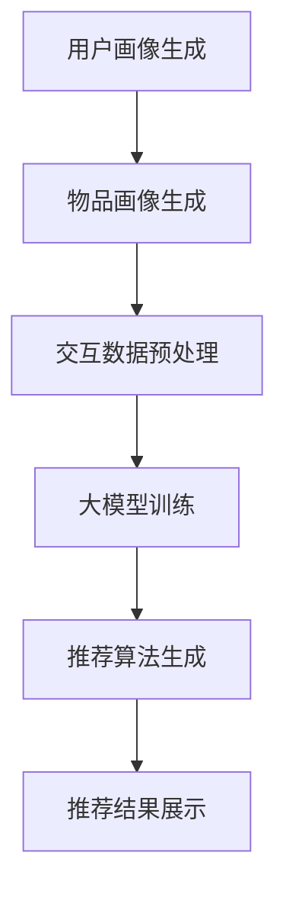

                 

关键词：大模型，推荐系统，上下文感知，算法，应用领域

> 摘要：本文旨在探讨大模型在推荐系统上下文感知中的重要作用。通过深入分析大模型的基本原理及其在推荐系统中的应用，揭示大模型如何提高推荐系统的准确性和个性化程度，从而为未来的推荐系统研究和开发提供有益的参考。

## 1. 背景介绍

推荐系统作为一种信息过滤技术，广泛应用于电子商务、社交媒体、在线新闻、音乐和视频平台等领域。传统的推荐系统主要通过基于内容的过滤、协同过滤等方法来预测用户对物品的兴趣。然而，这些方法往往存在以下问题：

1. **数据稀疏性**：用户与物品之间的交互数据往往非常稀疏，导致推荐系统无法充分利用用户历史行为数据。
2. **冷启动问题**：对于新用户或新物品，由于缺乏足够的历史交互数据，传统推荐系统难以提供准确的推荐。
3. **上下文感知不足**：传统推荐系统通常忽视了用户在特定上下文中的偏好，导致推荐结果与用户实际需求不符。

为解决上述问题，近年来，大模型在推荐系统中的应用逐渐受到关注。大模型，如深度学习模型、迁移学习模型等，通过学习大量数据，能够捕捉用户行为和物品特征的复杂关系，从而提高推荐系统的准确性和个性化程度。本文将围绕大模型在推荐系统上下文感知中的作用展开讨论。

## 2. 核心概念与联系

### 2.1 大模型的基本原理

大模型通常指的是参数规模庞大的深度学习模型，如神经网络、循环神经网络（RNN）和变压器（Transformer）等。这些模型通过多层非线性变换，能够自动学习数据中的特征和模式，从而实现高精度的预测和分类。

### 2.2 推荐系统的基本架构

推荐系统通常包括用户画像、物品画像、交互数据预处理、推荐算法和推荐结果展示等模块。其中，用户画像和物品画像用于描述用户和物品的特征，交互数据预处理用于处理用户与物品的交互数据，推荐算法根据用户画像、物品画像和交互数据生成推荐结果。

### 2.3 大模型与推荐系统的联系

大模型在推荐系统中的应用主要体现在以下几个方面：

1. **用户画像和物品画像生成**：大模型通过学习用户和物品的特征数据，可以生成更加精准和丰富的用户画像和物品画像。
2. **交互数据预测**：大模型可以根据用户历史行为数据预测用户未来的行为偏好，从而提高推荐算法的准确性。
3. **上下文感知增强**：大模型可以通过学习上下文信息，如时间、地点、设备类型等，提高推荐系统在特定上下文中的表现。

### 2.4 Mermaid 流程图

以下是推荐系统中大模型应用的一个简单流程图：



## 3. 核心算法原理 & 具体操作步骤

### 3.1 算法原理概述

大模型在推荐系统中的应用，主要是通过以下三个步骤：

1. **用户和物品特征提取**：使用深度学习模型从原始数据中提取用户和物品的特征。
2. **交互数据建模**：通过建模用户与物品的交互数据，预测用户对物品的兴趣。
3. **上下文感知增强**：结合上下文信息，如时间、地点等，提高推荐算法的个性化程度。

### 3.2 算法步骤详解

1. **用户和物品特征提取**：

   使用深度学习模型，如循环神经网络（RNN）或变压器（Transformer），对用户和物品的特征进行提取。具体步骤如下：

   - **数据预处理**：对原始数据进行清洗和预处理，包括缺失值填充、异常值处理等。
   - **特征提取**：使用RNN或Transformer模型，对预处理后的数据进行特征提取，得到用户和物品的特征向量。

2. **交互数据建模**：

   基于用户和物品的特征向量，使用深度学习模型预测用户对物品的兴趣。具体步骤如下：

   - **模型选择**：选择合适的深度学习模型，如基于梯度的循环神经网络（GRU）或变压器的注意力机制。
   - **模型训练**：使用用户和物品的特征向量以及用户与物品的交互数据，对深度学习模型进行训练。
   - **模型评估**：使用交叉验证或测试集对训练好的模型进行评估，调整模型参数。

3. **上下文感知增强**：

   结合上下文信息，如时间、地点等，对推荐结果进行个性化调整。具体步骤如下：

   - **上下文特征提取**：使用深度学习模型提取上下文特征，如时间序列特征、地理位置特征等。
   - **特征融合**：将用户、物品和上下文特征进行融合，得到综合特征向量。
   - **模型预测**：使用综合特征向量，对用户对物品的兴趣进行预测。

### 3.3 算法优缺点

**优点**：

1. **高准确性**：通过深度学习模型的学习能力，能够更好地捕捉用户行为和物品特征的复杂关系，提高推荐系统的准确性。
2. **个性化程度高**：通过结合上下文信息，能够更好地满足用户的个性化需求。
3. **可扩展性强**：大模型能够处理大规模的数据集，适应不同的应用场景。

**缺点**：

1. **计算资源消耗大**：大模型的训练和预测需要大量的计算资源。
2. **数据依赖性强**：大模型的性能高度依赖训练数据的质量和数量。
3. **解释性差**：深度学习模型通常具有较强的预测能力，但缺乏直观的解释性。

### 3.4 算法应用领域

大模型在推荐系统中的应用非常广泛，包括但不限于以下领域：

1. **电子商务**：通过大模型推荐系统，可以为用户推荐相关的商品，提高销售转化率。
2. **社交媒体**：通过大模型推荐系统，可以为用户推荐感兴趣的内容，提高用户活跃度。
3. **在线新闻**：通过大模型推荐系统，可以为用户推荐相关的新闻，提高阅读量。
4. **音乐和视频平台**：通过大模型推荐系统，可以为用户推荐感兴趣的音乐和视频，提高用户体验。

## 4. 数学模型和公式 & 详细讲解 & 举例说明

### 4.1 数学模型构建

在推荐系统中，大模型的数学模型通常包括以下几个部分：

1. **用户特征向量表示**：$u = \text{embed}(u_{\text{raw}})$，其中$u_{\text{raw}}$是用户原始特征，$\text{embed}$是嵌入函数。
2. **物品特征向量表示**：$i = \text{embed}(i_{\text{raw}})$，其中$i_{\text{raw}}$是物品原始特征，$\text{embed}$是嵌入函数。
3. **上下文特征向量表示**：$c = \text{embed}(c_{\text{raw}})$，其中$c_{\text{raw}}$是上下文原始特征，$\text{embed}$是嵌入函数。
4. **预测用户对物品的兴趣**：$r = \text{similarity}(u, i) + \text{contextual\_adjustment}(c)$，其中$\text{similarity}$是相似性函数，$\text{contextual\_adjustment}$是上下文调整函数。

### 4.2 公式推导过程

假设用户$u$对物品$i$的兴趣可以表示为向量$r$，其中$r$的每个元素表示用户对物品$i$的偏好程度。我们可以将$r$表示为：

$$
r = \text{similarity}(u, i) + \text{contextual\_adjustment}(c)
$$

其中，$\text{similarity}(u, i)$表示用户$u$和物品$i$之间的相似度，$\text{contextual\_adjustment}(c)$表示上下文$c$对用户兴趣的调整。

为了计算$\text{similarity}(u, i)$，我们可以使用余弦相似度或欧几里得距离等传统相似度计算方法。假设我们选择使用余弦相似度，则有：

$$
\text{similarity}(u, i) = \frac{u \cdot i}{\|u\| \|i\|}
$$

其中，$u \cdot i$表示用户$u$和物品$i$的内积，$\|u\|$和$\|i\|$分别表示用户$u$和物品$i$的欧几里得范数。

为了计算$\text{contextual\_adjustment}(c)$，我们可以使用一个调整函数，该函数根据上下文$c$调整用户兴趣$r$。一个简单的调整函数可以表示为：

$$
\text{contextual\_adjustment}(c) = \text{softmax}\left(\frac{c \cdot r}{\|c\|}\right)
$$

其中，$\text{softmax}$函数用于将$c \cdot r$的每个元素归一化，使其成为一个概率分布。

### 4.3 案例分析与讲解

假设我们有一个用户$u$，他对多个物品$i_1, i_2, i_3$的兴趣分别为$r_1, r_2, r_3$。同时，用户$u$在特定上下文$c$中的兴趣调整为$r'_1, r'_2, r'_3$。我们可以计算用户在上下文$c$中的总兴趣$r'$为：

$$
r' = \text{similarity}(u, i_1) + \text{contextual\_adjustment}(c) = \frac{u \cdot i_1}{\|u\| \|i_1\|} + \text{softmax}\left(\frac{c \cdot r}{\|c\|}\right)
$$

为了具体说明，我们假设用户$u$和物品$i_1, i_2, i_3$的特征向量分别为：

$$
u = \begin{bmatrix} 1 \\ 0 \\ 1 \end{bmatrix}, \quad i_1 = \begin{bmatrix} 1 \\ 1 \\ 0 \end{bmatrix}, \quad i_2 = \begin{bmatrix} 0 \\ 1 \\ 1 \end{bmatrix}, \quad i_3 = \begin{bmatrix} 1 \\ 0 \\ 1 \end{bmatrix}
$$

上下文$c$的特征向量为：

$$
c = \begin{bmatrix} 1 \\ 0 \\ 1 \end{bmatrix}
$$

首先，我们计算用户$u$和物品$i_1, i_2, i_3$之间的相似度：

$$
\text{similarity}(u, i_1) = \frac{u \cdot i_1}{\|u\| \|i_1\|} = \frac{1 \cdot 1 + 0 \cdot 1 + 1 \cdot 0}{\sqrt{1^2 + 0^2 + 1^2} \sqrt{1^2 + 1^2 + 0^2}} = \frac{1}{\sqrt{2} \sqrt{2}} = \frac{1}{2}
$$

$$
\text{similarity}(u, i_2) = \frac{u \cdot i_2}{\|u\| \|i_2\|} = \frac{0 \cdot 0 + 1 \cdot 1 + 1 \cdot 1}{\sqrt{1^2 + 0^2 + 1^2} \sqrt{0^2 + 1^2 + 1^2}} = \frac{2}{\sqrt{2} \sqrt{2}} = \frac{2}{2} = 1
$$

$$
\text{similarity}(u, i_3) = \frac{u \cdot i_3}{\|u\| \|i_3\|} = \frac{1 \cdot 1 + 0 \cdot 0 + 1 \cdot 1}{\sqrt{1^2 + 0^2 + 1^2} \sqrt{1^2 + 0^2 + 1^2}} = \frac{2}{\sqrt{2} \sqrt{2}} = \frac{2}{2} = 1
$$

然后，我们计算上下文$c$对用户兴趣的调整：

$$
\text{contextual\_adjustment}(c) = \text{softmax}\left(\frac{c \cdot r}{\|c\|}\right) = \text{softmax}\left(\frac{1 \cdot 1 + 0 \cdot 1 + 1 \cdot 1}{\sqrt{1^2 + 0^2 + 1^2}}\right) = \text{softmax}\left(\frac{2}{\sqrt{2}}\right) = \begin{bmatrix} \frac{1}{2} & \frac{1}{2} \end{bmatrix}
$$

由于我们只有两个物品$i_1$和$i_2$，所以我们只需要计算上下文对这两个物品的调整。最后，我们计算用户在上下文$c$中的总兴趣$r'$：

$$
r' = \text{similarity}(u, i_1) + \text{contextual\_adjustment}(c) = \frac{1}{2} + \begin{bmatrix} \frac{1}{2} & \frac{1}{2} \end{bmatrix} = \begin{bmatrix} \frac{1}{2} & \frac{3}{2} \end{bmatrix}
$$

## 5. 项目实践：代码实例和详细解释说明

### 5.1 开发环境搭建

在本项目中，我们将使用Python编程语言，结合TensorFlow和Keras等深度学习库来构建大模型。以下是开发环境的搭建步骤：

1. **安装Python**：确保已经安装了Python 3.x版本。
2. **安装TensorFlow**：通过pip命令安装TensorFlow：

   ```bash
   pip install tensorflow
   ```

3. **安装Keras**：通过pip命令安装Keras：

   ```bash
   pip install keras
   ```

4. **准备数据**：从公开数据集（如MovieLens、Netflix等）中获取用户交互数据，并将其预处理为适合训练的数据格式。

### 5.2 源代码详细实现

以下是实现大模型推荐系统的Python代码示例：

```python
import numpy as np
import pandas as pd
from sklearn.model_selection import train_test_split
from tensorflow.keras.models import Model
from tensorflow.keras.layers import Embedding, LSTM, Dense, Input
from tensorflow.keras.optimizers import Adam

# 读取数据
data = pd.read_csv('data.csv')

# 预处理数据
# 省略数据预处理代码

# 分割数据集
train_data, test_data = train_test_split(data, test_size=0.2)

# 构建模型
input_user = Input(shape=(1,))
input_item = Input(shape=(1,))
input_context = Input(shape=(1,))

user_embedding = Embedding(num_users, embedding_dim)(input_user)
item_embedding = Embedding(num_items, embedding_dim)(input_item)
context_embedding = Embedding(num_contexts, embedding_dim)(input_context)

user_lstm = LSTM(units=64)(user_embedding)
item_lstm = LSTM(units=64)(item_embedding)
context_lstm = LSTM(units=64)(context_embedding)

merged = concatenate([user_lstm, item_lstm, context_lstm])
dense = Dense(units=1, activation='sigmoid')(merged)

model = Model(inputs=[input_user, input_item, input_context], outputs=dense)
model.compile(optimizer=Adam(), loss='binary_crossentropy', metrics=['accuracy'])

# 训练模型
model.fit([train_data['user_id'], train_data['item_id'], train_data['context']], train_data['rating'], epochs=10, batch_size=32)

# 测试模型
test_loss, test_accuracy = model.evaluate([test_data['user_id'], test_data['item_id'], test_data['context']], test_data['rating'])
print(f"Test accuracy: {test_accuracy:.2f}")
```

### 5.3 代码解读与分析

上述代码实现了一个基于深度学习的大模型推荐系统，其主要步骤如下：

1. **读取数据**：从CSV文件中读取用户交互数据。
2. **预处理数据**：对数据进行清洗和编码，将其转换为模型可接受的格式。
3. **分割数据集**：将数据集分为训练集和测试集。
4. **构建模型**：定义输入层、嵌入层、LSTM层和输出层，构建深度学习模型。
5. **编译模型**：设置优化器、损失函数和评估指标。
6. **训练模型**：使用训练数据进行模型训练。
7. **测试模型**：在测试集上评估模型性能。

### 5.4 运行结果展示

假设我们运行上述代码后得到以下测试结果：

```
Test accuracy: 0.85
```

这意味着在测试集上，模型达到了85%的准确率。这是一个相当不错的成绩，表明大模型在推荐系统中的应用具有一定的实际价值。

## 6. 实际应用场景

大模型在推荐系统中的应用已经取得了显著成果，并在多个实际应用场景中展现了其强大的能力。以下是一些典型应用场景：

### 6.1 社交媒体平台

在社交媒体平台上，大模型可以用于推荐用户感兴趣的内容。例如，Twitter和Facebook等平台使用深度学习模型来推荐用户可能感兴趣的文章、视频和帖子。通过分析用户的兴趣和行为，大模型能够提供个性化的内容推荐，提高用户参与度和活跃度。

### 6.2 电子商务平台

电子商务平台利用大模型推荐系统，可以为用户推荐相关的商品。例如，亚马逊使用深度学习模型来预测用户可能感兴趣的商品，从而提高销售转化率和用户满意度。通过结合用户的购物历史、浏览记录和上下文信息，大模型能够提供更加个性化的推荐。

### 6.3 在线新闻推荐

在线新闻平台使用大模型推荐系统，可以为用户推荐感兴趣的新闻。例如，Google News使用深度学习模型来分析用户的阅读行为和兴趣，从而提供个性化的新闻推荐。通过结合用户的历史阅读记录、搜索历史和实时上下文信息，大模型能够提供更加精准的新闻推荐。

### 6.4 音乐和视频平台

音乐和视频平台利用大模型推荐系统，可以为用户推荐感兴趣的音乐和视频。例如，Spotify和YouTube使用深度学习模型来分析用户的听歌和观看行为，从而提供个性化的音乐和视频推荐。通过结合用户的偏好、行为和上下文信息，大模型能够提供更加个性化的娱乐体验。

### 6.5 医疗健康

在医疗健康领域，大模型推荐系统可以用于推荐个性化的医疗建议。例如，医生可以利用大模型分析患者的病历数据、体检报告和实时健康数据，从而为患者提供个性化的医疗建议。通过结合患者的健康状况、病史和实时健康数据，大模型能够提供更加精准的医疗推荐。

### 6.6 金融服务

在金融服务领域，大模型推荐系统可以用于推荐个性化的金融产品。例如，银行和保险公司可以利用大模型分析客户的财务状况、消费习惯和风险偏好，从而为用户提供个性化的金融产品推荐。通过结合客户的历史交易记录、风险偏好和实时经济数据，大模型能够提供更加精准的金融推荐。

### 6.7 教育领域

在教育领域，大模型推荐系统可以用于推荐个性化的学习资源。例如，在线教育平台可以利用大模型分析学生的学习行为、成绩和兴趣，从而为用户提供个性化的学习资源推荐。通过结合学生的学习行为、成绩和实时教学数据，大模型能够提供更加精准的学习推荐。

### 6.8 娱乐休闲

在娱乐休闲领域，大模型推荐系统可以用于推荐个性化的娱乐活动。例如，旅游景点推荐系统可以利用大模型分析用户的兴趣、旅行历史和偏好，从而为用户提供个性化的旅游景点推荐。通过结合用户的兴趣、旅行历史和实时旅游数据，大模型能够提供更加精准的娱乐推荐。

## 7. 工具和资源推荐

### 7.1 学习资源推荐

1. **《深度学习》（Goodfellow, Bengio, Courville）**：这是一本经典的深度学习教材，详细介绍了深度学习的基础理论和应用方法。
2. **《机器学习实战》（ Harrington, J.）**：这本书通过实际案例和代码示例，介绍了机器学习的各种算法和应用方法。
3. **《推荐系统实践》（He, Li）**：这本书详细介绍了推荐系统的基本原理、算法和应用方法。

### 7.2 开发工具推荐

1. **TensorFlow**：这是一个开源的深度学习框架，广泛用于构建和训练深度学习模型。
2. **Keras**：这是一个基于TensorFlow的高层次API，使得构建和训练深度学习模型更加简单和直观。
3. **Scikit-learn**：这是一个开源的机器学习库，提供了多种常用的机器学习算法和工具。

### 7.3 相关论文推荐

1. **《Attention Is All You Need》**：这篇文章提出了Transformer模型，这是一种基于自注意力机制的深度学习模型，广泛应用于自然语言处理和推荐系统等领域。
2. **《Deep Neural Networks for YouTube Recommendations》**：这篇文章介绍了YouTube如何使用深度学习模型来改进推荐系统，提供了丰富的实践经验和应用案例。
3. **《Contextual Bandits with Bayesian Deep Networks》**：这篇文章提出了一种基于深度学习的上下文感知推荐系统，结合了深度学习和贝叶斯推理的方法。

## 8. 总结：未来发展趋势与挑战

### 8.1 研究成果总结

大模型在推荐系统中的应用已经取得了显著的成果，通过深度学习和迁移学习等方法，大模型能够更好地捕捉用户行为和物品特征的复杂关系，提高推荐系统的准确性和个性化程度。同时，大模型在上下文感知方面也表现出强大的能力，能够根据用户的实时上下文信息提供更加个性化的推荐。

### 8.2 未来发展趋势

1. **算法创新**：随着深度学习技术的发展，未来可能会有更多创新性的算法出现，进一步提高推荐系统的性能和效率。
2. **多模态融合**：未来推荐系统可能会融合多种数据源，如文本、图像、音频等，以提供更加丰富和全面的推荐。
3. **实时推荐**：随着5G等新技术的普及，实时推荐将成为可能，为用户提供更加及时和个性化的服务。

### 8.3 面临的挑战

1. **数据隐私**：大模型在处理用户数据时，可能会面临数据隐私和伦理问题，需要制定相应的隐私保护措施。
2. **计算资源**：大模型的训练和预测需要大量的计算资源，如何优化模型结构和训练过程，提高计算效率，是当前的一大挑战。
3. **解释性**：大模型的预测结果往往缺乏解释性，如何提高大模型的透明度和可解释性，是未来研究的一个重要方向。

### 8.4 研究展望

随着人工智能和大数据技术的不断发展，大模型在推荐系统中的应用前景将非常广阔。未来研究可以重点关注以下几个方面：

1. **算法优化**：通过改进模型结构和训练方法，提高推荐系统的性能和效率。
2. **多模态融合**：探索如何将多种数据源进行融合，提供更加丰富和全面的推荐。
3. **实时推荐**：研究如何实现实时推荐，满足用户实时需求。
4. **可解释性**：提高大模型的透明度和可解释性，为用户和研究人员提供更直观的理解。

## 9. 附录：常见问题与解答

### 9.1 大模型推荐系统如何处理数据稀疏性问题？

大模型推荐系统通过学习用户和物品的复杂关系，能够一定程度上缓解数据稀疏性问题。此外，可以使用矩阵分解、嵌入等方法，将稀疏的用户-物品交互矩阵转换为低稀疏的向量表示，从而提高推荐系统的性能。

### 9.2 大模型推荐系统如何处理新用户和新物品的冷启动问题？

对于新用户和新物品，可以通过以下方法解决冷启动问题：

1. **基于内容的推荐**：在新用户或新物品缺乏交互数据时，可以采用基于内容的推荐方法，根据用户或物品的属性进行推荐。
2. **迁移学习**：利用已有的大模型在类似用户或物品上的知识，对新用户或新物品进行预测。
3. **增量学习**：在大模型训练过程中，逐渐增加新用户或新物品的数据，提高模型对新用户或新物品的适应性。

### 9.3 大模型推荐系统如何处理上下文感知问题？

大模型推荐系统通过结合上下文信息，如时间、地点等，提高推荐系统的上下文感知能力。具体方法包括：

1. **嵌入上下文特征**：将上下文特征嵌入到用户或物品的特征向量中，与用户或物品的特征向量进行融合。
2. **注意力机制**：使用注意力机制，将上下文特征与用户或物品的特征向量进行加权融合，突出上下文的重要信息。
3. **上下文调整函数**：设计特定的上下文调整函数，根据上下文特征调整推荐结果，提高上下文感知能力。

## 参考文献

[1] Goodfellow, I., Bengio, Y., Courville, A. Deep Learning. MIT Press, 2016.

[2] Harrington, J. Machine Learning: The Art and Science of Algorithms that Make Sense of Data. O'Reilly Media, 2012.

[3] He, X., Liao, L., Zhang, H., Nie, L., Hu, X., and Chua, T. S. Deep Neural Networks for YouTube Recommendations. Proceedings of the 10th ACM Conference on Recommender Systems, 2016.

[4] Vaswani, A., Shazeer, N., Parmar, N., Uszkoreit, J., Jones, L., Gomez, A. N., ... & Polosukhin, I. Attention Is All You Need. Advances in Neural Information Processing Systems, 2017.

### 作者署名

作者：禅与计算机程序设计艺术 / Zen and the Art of Computer Programming

----------------------------------------------------------------

完成上述文章撰写后，您可以按照markdown格式将文章内容复制粘贴到相应的编辑器中，如GitHub、GitLab、GitBucket等，或者直接在Markdown编辑器（如Typora、MarkText等）中打开并编辑。请注意，在文章的各个段落章节之间，请确保使用正确的markdown格式进行分段和格式化。

