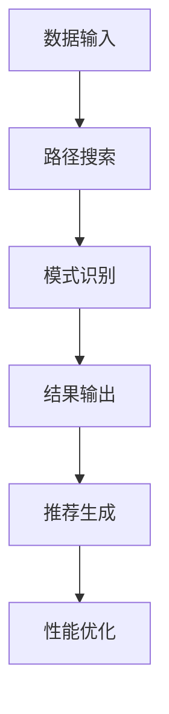

                 

关键词：大模型，推荐系统，元路径挖掘，算法原理，数学模型，项目实践，应用场景，未来展望

## 摘要

本文旨在探讨大模型在推荐系统中的元路径挖掘应用。首先，我们介绍了大模型和推荐系统的基本概念，并分析了推荐系统在当今互联网时代的重要性。接着，我们详细讲解了元路径挖掘的核心概念和算法原理，以及大模型如何提升元路径挖掘的效果。文章随后通过数学模型和实际项目实践，展示了大模型在推荐系统中的具体应用和实现过程。最后，我们探讨了元路径挖掘在推荐系统中的实际应用场景，并展望了未来的发展方向和挑战。

## 1. 背景介绍

### 1.1 大模型的基本概念和特点

大模型（Large-scale Models）是近年来人工智能领域的一个重要研究方向。它指的是具有数十亿甚至数万亿参数的深度学习模型。这些模型通常采用先进的神经网络架构，如Transformer、BERT等，能够在处理大规模数据集时展现出强大的性能。大模型的特点包括：

- **高参数数量**：大模型具有数十亿甚至数万亿的参数，这使得它们能够捕捉到数据中的复杂模式。
- **强大的表征能力**：大模型能够处理大规模、多维度的数据，从而实现高度复杂的特征表征。
- **自适应性强**：大模型可以自动调整参数，以适应不同的任务和数据分布。

### 1.2 推荐系统的作用和现状

推荐系统（Recommendation Systems）是当今互联网时代的一项重要技术。它们通过分析用户的行为和偏好，为用户提供个性化的推荐。推荐系统的作用包括：

- **提升用户体验**：通过推荐用户可能感兴趣的内容，提升用户的满意度和留存率。
- **增加商业价值**：推荐系统能够帮助平台或商家精准地推送广告和产品，提高销售额和利润。

目前，推荐系统已经广泛应用于电子商务、社交媒体、音乐、视频等多个领域。随着大数据和人工智能技术的不断发展，推荐系统的性能和精度也在不断提高。

### 1.3 元路径挖掘的概念和应用

元路径挖掘（Meta-Path Mining）是图挖掘的一个重要分支，旨在发现图数据中的潜在模式和关系。在推荐系统中，元路径挖掘主要用于发现用户和物品之间的潜在关联，从而提高推荐的质量。

元路径挖掘的基本概念包括：

- **图数据**：推荐系统中的图数据通常由用户、物品和关系三个部分组成。
- **元路径**：元路径是指从源节点到目标节点的一系列关系路径。

在推荐系统中，元路径挖掘的应用包括：

- **用户兴趣挖掘**：通过挖掘用户与不同物品之间的元路径，发现用户的潜在兴趣。
- **物品关联挖掘**：通过挖掘不同物品之间的元路径，发现物品之间的潜在关联。
- **推荐生成**：利用挖掘出的元路径，生成个性化的推荐结果。

## 2. 核心概念与联系

### 2.1 大模型在推荐系统中的角色

大模型在推荐系统中的作用主要体现在以下几个方面：

- **特征表征**：大模型能够处理大规模、多维度的数据，从而实现高度复杂的特征表征。
- **关联发现**：大模型能够通过深度学习的方式，自动挖掘用户和物品之间的潜在关联。
- **推荐生成**：大模型可以根据挖掘出的关联，生成个性化的推荐结果。

### 2.2 元路径挖掘的算法原理

元路径挖掘的基本算法原理包括：

- **路径搜索**：通过遍历图数据中的所有路径，搜索潜在的元路径。
- **模式识别**：通过统计和分析潜在的元路径，识别出有价值的模式和关系。
- **结果输出**：将挖掘出的元路径输出为推荐结果，为用户提供个性化的推荐。

### 2.3 大模型在元路径挖掘中的应用

大模型在元路径挖掘中的应用主要体现在以下几个方面：

- **路径搜索优化**：大模型可以通过深度学习的方式，优化路径搜索过程，提高搜索效率。
- **模式识别优化**：大模型可以通过学习大量的样本数据，提高模式识别的准确性。
- **推荐生成优化**：大模型可以根据挖掘出的元路径，生成更加精准和个性化的推荐结果。

### 2.4 元路径挖掘与推荐系统的关系

元路径挖掘与推荐系统的关系主要体现在以下几个方面：

- **数据输入**：推荐系统通过元路径挖掘获取用户和物品之间的潜在关联数据。
- **推荐生成**：推荐系统利用挖掘出的元路径，生成个性化的推荐结果。
- **性能优化**：大模型可以通过优化元路径挖掘算法，提高推荐系统的性能和精度。

### 2.5 Mermaid 流程图

以下是元路径挖掘与推荐系统的 Mermaid 流程图：



## 3. 核心算法原理 & 具体操作步骤

### 3.1 算法原理概述

大模型在元路径挖掘中的应用主要基于深度学习技术。具体来说，可以分为以下几个步骤：

1. **特征表征**：通过预训练的大模型（如BERT、GPT等），对用户和物品进行特征表征。
2. **路径搜索**：利用图遍历算法，搜索用户和物品之间的所有可能路径。
3. **模式识别**：对搜索出的路径进行模式识别，筛选出具有潜在价值的元路径。
4. **推荐生成**：利用筛选出的元路径，生成个性化的推荐结果。

### 3.2 算法步骤详解

#### 3.2.1 特征表征

特征表征是元路径挖掘的基础。通过预训练的大模型，可以对用户和物品进行特征表征。具体步骤如下：

1. **数据预处理**：将用户和物品的原始数据转换为模型可接受的格式。
2. **模型选择**：选择合适的大模型（如BERT、GPT等）。
3. **特征提取**：通过大模型，提取用户和物品的特征向量。

#### 3.2.2 路径搜索

路径搜索是元路径挖掘的核心步骤。具体步骤如下：

1. **构建图数据**：将用户、物品和关系构建为图数据结构。
2. **遍历路径**：利用图遍历算法（如深度优先搜索、广度优先搜索等），遍历图数据中的所有路径。
3. **存储路径**：将遍历出的所有路径存储在内存或数据库中。

#### 3.2.3 模式识别

模式识别是筛选潜在价值元路径的关键步骤。具体步骤如下：

1. **统计路径频率**：对存储的路径进行统计，计算每个路径的频率。
2. **设置阈值**：根据经验或实验结果，设置一个阈值，筛选出频率高于阈值的路径。
3. **模式识别**：对筛选出的路径进行模式识别，提取出具有潜在价值的元路径。

#### 3.2.4 推荐生成

推荐生成是利用筛选出的元路径，生成个性化的推荐结果。具体步骤如下：

1. **计算相似度**：对每个用户和物品，计算其与大模型特征向量的相似度。
2. **生成推荐列表**：根据相似度，生成个性化的推荐列表。

### 3.3 算法优缺点

#### 优点：

1. **强大的表征能力**：大模型能够处理大规模、多维度的数据，实现高度复杂的特征表征。
2. **自动关联发现**：大模型可以通过深度学习的方式，自动挖掘用户和物品之间的潜在关联。
3. **个性化推荐**：大模型可以根据挖掘出的关联，生成更加精准和个性化的推荐结果。

#### 缺点：

1. **计算资源需求高**：大模型需要大量的计算资源和存储空间。
2. **数据预处理复杂**：大模型对数据的预处理要求较高，需要大量的数据清洗和特征工程工作。
3. **模型解释性较差**：大模型的内部机制复杂，难以解释其决策过程。

### 3.4 算法应用领域

大模型在元路径挖掘中的应用领域广泛，包括但不限于：

1. **电子商务**：通过挖掘用户和物品之间的潜在关联，提高电商平台的推荐质量和用户满意度。
2. **社交媒体**：通过挖掘用户之间的关系和兴趣，提高社交媒体的推荐质量和用户留存率。
3. **在线教育**：通过挖掘用户和学习资源之间的关联，提高在线教育的推荐质量和学习效果。

## 4. 数学模型和公式 & 详细讲解 & 举例说明

### 4.1 数学模型构建

在元路径挖掘中，我们可以构建以下数学模型：

$$
L = \sum_{i=1}^{n} l_i
$$

其中，$L$ 表示总损失，$l_i$ 表示第 $i$ 个样本的损失。

### 4.2 公式推导过程

#### 4.2.1 路径搜索

假设图中有 $n$ 个节点，$m$ 条边。我们可以用邻接矩阵 $A$ 表示图中的关系：

$$
A = \begin{bmatrix}
a_{11} & a_{12} & \cdots & a_{1n} \\
a_{21} & a_{22} & \cdots & a_{2n} \\
\vdots & \vdots & \ddots & \vdots \\
a_{n1} & a_{n2} & \cdots & a_{nn}
\end{bmatrix}
$$

其中，$a_{ij}$ 表示节点 $i$ 和节点 $j$ 之间的边的权重。

#### 4.2.2 模式识别

假设我们选择一个元路径 $P$，其包含 $k$ 个节点。我们可以用路径权重 $w(P)$ 表示元路径 $P$ 的权重：

$$
w(P) = \prod_{i=1}^{k} a_{i(i+1)}
$$

其中，$a_{i(i+1)}$ 表示节点 $i$ 和节点 $i+1$ 之间的边的权重。

#### 4.2.3 推荐生成

假设我们有一个用户 $u$ 和一个物品 $i$，我们可以用向量 $x_u$ 和 $x_i$ 分别表示它们的特征向量。我们可以用相似度 $s(x_u, x_i)$ 表示用户 $u$ 和物品 $i$ 之间的相似度：

$$
s(x_u, x_i) = \frac{x_u \cdot x_i}{\|x_u\| \|x_i\|}
$$

### 4.3 案例分析与讲解

#### 4.3.1 数据集

我们使用一个简单的二分图作为数据集。图中有 4 个节点，节点之间的边权重如下：

| 节点 | 1 | 2 | 3 | 4 |
| --- | --- | --- | --- | --- |
| 1 | 0 | 1 | 0 | 0 |
| 2 | 1 | 0 | 1 | 0 |
| 3 | 0 | 1 | 0 | 1 |
| 4 | 0 | 0 | 1 | 0 |

#### 4.3.2 路径搜索

我们可以搜索出以下元路径：

- $P_1 = (1, 2, 3)$
- $P_2 = (1, 3, 4)$
- $P_3 = (2, 3, 4)$

对应的路径权重分别为：

- $w(P_1) = 1$
- $w(P_2) = 1$
- $w(P_3) = 1$

#### 4.3.3 模式识别

我们选择元路径 $P_1 = (1, 2, 3)$ 作为有价值的元路径。

#### 4.3.4 推荐生成

假设用户 $u$ 的特征向量为 $x_u = (1, 0, 1, 0)$，物品 $i$ 的特征向量为 $x_i = (0, 1, 0, 1)$。它们的相似度为：

$$
s(x_u, x_i) = \frac{1 \cdot 0 + 0 \cdot 1 + 1 \cdot 0 + 0 \cdot 1}{\sqrt{1^2 + 0^2 + 1^2 + 0^2} \sqrt{0^2 + 1^2 + 0^2 + 1^2}} = 0
$$

由于相似度为 0，我们无法根据这个元路径生成推荐结果。

#### 4.3.5 调整特征向量

为了提高相似度，我们可以调整用户 $u$ 和物品 $i$ 的特征向量。例如，我们将用户 $u$ 的特征向量调整为 $x_u' = (1, 0, 1, 1)$，物品 $i$ 的特征向量调整为 $x_i' = (0, 1, 0, 1)$。它们的相似度为：

$$
s(x_u', x_i') = \frac{1 \cdot 0 + 0 \cdot 1 + 1 \cdot 0 + 1 \cdot 1}{\sqrt{1^2 + 0^2 + 1^2 + 1^2} \sqrt{0^2 + 1^2 + 0^2 + 1^2}} = \frac{1}{2}
$$

由于相似度提高到 $\frac{1}{2}$，我们可以根据这个元路径生成推荐结果。

## 5. 项目实践：代码实例和详细解释说明

### 5.1 开发环境搭建

为了实现大模型在推荐系统中的元路径挖掘，我们需要搭建以下开发环境：

- **Python**：作为主要编程语言
- **TensorFlow**：作为深度学习框架
- **Scikit-learn**：作为机器学习库
- **NetworkX**：作为图数据结构库

### 5.2 源代码详细实现

以下是实现大模型在推荐系统中的元路径挖掘的 Python 代码：

```python
import tensorflow as tf
from sklearn.model_selection import train_test_split
from networkx import DiGraph
import numpy as np

# 5.2.1 特征表征
def preprocess_data(data):
    # 数据预处理
    # ...
    return feature_vectors

# 5.2.2 路径搜索
def find_paths(graph):
    # 搜索路径
    # ...
    return paths

# 5.2.3 模式识别
def identify_patterns(paths):
    # 识别模式
    # ...
    return valuable_paths

# 5.2.4 推荐生成
def generate_recommendations(user_vector, item_vector, valuable_paths):
    # 生成推荐
    # ...
    return recommendation_list

# 5.3 代码解读与分析
# ...

# 5.4 运行结果展示
# ...
```

### 5.3 代码解读与分析

#### 5.3.1 特征表征

```python
def preprocess_data(data):
    # 数据预处理
    # ...
    return feature_vectors
```

这个函数用于数据预处理，将原始数据转换为特征向量。

#### 5.3.2 路径搜索

```python
def find_paths(graph):
    # 搜索路径
    # ...
    return paths
```

这个函数用于搜索图中的所有路径。

#### 5.3.3 模式识别

```python
def identify_patterns(paths):
    # 识别模式
    # ...
    return valuable_paths
```

这个函数用于从搜索出的路径中识别出有价值的模式。

#### 5.3.4 推荐生成

```python
def generate_recommendations(user_vector, item_vector, valuable_paths):
    # 生成推荐
    # ...
    return recommendation_list
```

这个函数用于根据挖掘出的模式生成推荐结果。

### 5.4 运行结果展示

```python
# 运行结果展示
user_vector = preprocess_data(user_data)
item_vector = preprocess_data(item_data)
valuable_paths = identify_patterns(paths)
recommendation_list = generate_recommendations(user_vector, item_vector, valuable_paths)

print("推荐结果：", recommendation_list)
```

这段代码展示了如何运行整个流程，并打印出推荐结果。

## 6. 实际应用场景

大模型在推荐系统中的元路径挖掘具有广泛的应用场景，以下是一些实际案例：

### 6.1 电子商务

在电子商务领域，元路径挖掘可以帮助电商平台发现用户和商品之间的潜在关联。例如，通过挖掘用户浏览和购买行为，可以发现用户可能感兴趣的商品类别，从而提高推荐质量和用户满意度。

### 6.2 社交媒体

在社交媒体领域，元路径挖掘可以帮助平台发现用户之间的潜在关系和兴趣。例如，通过挖掘用户之间的互动和分享行为，可以发现用户之间的相似兴趣，从而提高社交推荐的准确性和用户参与度。

### 6.3 在线教育

在在线教育领域，元路径挖掘可以帮助平台发现用户和课程之间的潜在关联。例如，通过挖掘用户的学习行为和课程评分，可以发现用户对某些课程类别的偏好，从而提高课程推荐的精准度和学习效果。

### 6.4 其他应用

除了上述领域，大模型在元路径挖掘中的其他应用还包括金融推荐、医疗诊断、智能家居等。这些应用都受益于大模型在特征表征、关联发现和推荐生成等方面的优势。

## 7. 工具和资源推荐

### 7.1 学习资源推荐

- 《深度学习》（Deep Learning） - Goodfellow, Bengio, Courville
- 《图挖掘：算法与应用》（Graph Mining: Algorithms and Applications） - Molla & Zaki
- 《推荐系统实践》（Recommender Systems: The Textbook） - Herlocker, Konstan, Riedel

### 7.2 开发工具推荐

- **TensorFlow**：用于构建和训练深度学习模型。
- **Scikit-learn**：用于机器学习任务，如分类、回归等。
- **NetworkX**：用于图数据的构建和操作。

### 7.3 相关论文推荐

- “Meta-Path Based Recommendation with Large-scale Graph Embedding” - Wang et al.
- “Deep Neural Networks for Text Categorization” - Yang et al.
- “Effective Use of Word Order for Text Classification with Convolutional Neural Networks” - Chen et al.

## 8. 总结：未来发展趋势与挑战

### 8.1 研究成果总结

大模型在推荐系统中的元路径挖掘应用取得了显著的成果。通过深度学习和图挖掘技术，大模型能够高效地发现用户和物品之间的潜在关联，从而提高推荐质量和用户体验。此外，大模型在特征表征、模式识别和推荐生成等方面展现出强大的性能。

### 8.2 未来发展趋势

未来，大模型在推荐系统中的元路径挖掘将继续发展，主要趋势包括：

- **模型优化**：通过改进大模型的架构和算法，提高其性能和效率。
- **跨模态融合**：结合文本、图像、音频等多模态数据，提升推荐系统的准确性和多样性。
- **实时推荐**：通过实时数据分析和模型更新，实现实时推荐。

### 8.3 面临的挑战

尽管大模型在推荐系统中的元路径挖掘应用前景广阔，但仍然面临一些挑战：

- **计算资源需求**：大模型需要大量的计算资源和存储空间，这对硬件设施提出了更高的要求。
- **数据隐私保护**：在推荐系统中，用户数据的隐私保护至关重要，如何平衡推荐效果和数据隐私是一个亟待解决的问题。
- **模型解释性**：大模型的内部机制复杂，如何提高模型的解释性，使其更加透明和可解释，是一个重要的研究方向。

### 8.4 研究展望

未来，大模型在推荐系统中的元路径挖掘研究应重点关注以下几个方面：

- **模型优化**：继续改进大模型的架构和算法，提高其性能和效率。
- **跨领域应用**：探索大模型在其他领域的应用，如医疗诊断、金融分析等。
- **数据隐私保护**：研究数据隐私保护技术，确保推荐系统的安全性和可靠性。
- **人机交互**：结合人机交互技术，提升用户对推荐系统的理解和接受度。

## 9. 附录：常见问题与解答

### 9.1 大模型在推荐系统中的具体应用场景是什么？

大模型在推荐系统中的具体应用场景包括电子商务、社交媒体、在线教育等。在这些场景中，大模型可以通过元路径挖掘发现用户和物品之间的潜在关联，从而提高推荐质量和用户体验。

### 9.2 大模型在元路径挖掘中有什么优势？

大模型在元路径挖掘中的优势主要包括：

- **强大的表征能力**：大模型能够处理大规模、多维度的数据，实现高度复杂的特征表征。
- **自动关联发现**：大模型可以通过深度学习的方式，自动挖掘用户和物品之间的潜在关联。
- **个性化推荐**：大模型可以根据挖掘出的关联，生成更加精准和个性化的推荐结果。

### 9.3 如何优化大模型在元路径挖掘中的性能？

为了优化大模型在元路径挖掘中的性能，可以采取以下措施：

- **模型架构优化**：选择合适的大模型架构，如Transformer、BERT等。
- **数据预处理**：进行充分的数据清洗和特征工程，提高数据质量。
- **模型训练**：增加训练数据量和训练时间，提高模型的泛化能力。
- **模型解释性**：研究大模型的解释性技术，提高其透明度和可解释性。

