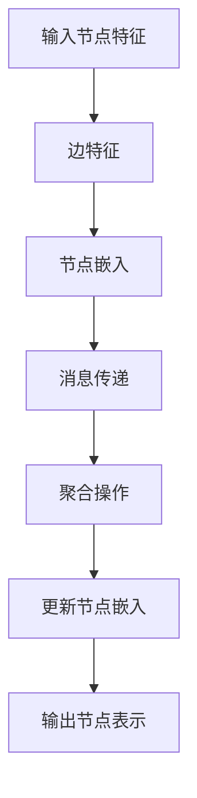

                 

 

## 1. 背景介绍

随着互联网的飞速发展和用户对个性化推荐的强烈需求，推荐系统已成为现代信息检索和数据分析领域的重要研究方向。传统推荐系统主要依赖于基于内容的推荐（Content-Based Recommendation）和协同过滤（Collaborative Filtering）等方法，但它们在处理复杂用户行为和海量数据时存在一定的局限性。

近年来，图神经网络（Graph Neural Networks，GNN）作为一种新兴的深度学习模型，因其强大的图形表示和学习能力，被广泛应用于推荐系统。图神经网络能够有效地捕捉用户行为和网络结构中的隐含关系，从而提高推荐系统的效果和准确性。

本文旨在探讨大模型在推荐系统中的应用，尤其是图神经网络在推荐系统中的优势和应用。我们将首先介绍图神经网络的基本概念和核心算法原理，然后详细解释图神经网络的数学模型和公式，并通过一个实际的项目实践案例展示其具体应用。

## 2. 核心概念与联系

### 2.1 图神经网络的基本概念

图神经网络（GNN）是一种在图结构上执行深度学习任务的神经网络。与传统神经网络不同，GNN能够直接操作图结构数据，并通过图顶点和边之间的交互来学习节点的表示。GNN的核心思想是利用节点和边上的特征信息进行传递和聚合，从而实现对节点属性的预测或图的生成。

### 2.2 图神经网络与推荐系统的联系

推荐系统中的数据通常具有复杂的网络结构，如图形的邻接矩阵或用户-物品交互网络。图神经网络能够有效地捕捉这种网络结构中的隐含关系，从而提高推荐系统的效果。

例如，在协同过滤方法中，用户和物品可以表示为图中的节点，用户之间的交互和物品之间的关系可以表示为边。通过图神经网络，我们可以学习到用户和物品的隐含特征，从而进行精准的推荐。

### 2.3 图神经网络架构的 Mermaid 流程图

下面是一个简化的图神经网络架构的 Mermaid 流程图，展示了图神经网络的基本组件和操作步骤。



### 2.4 图神经网络与推荐系统的优势

- **捕捉复杂关系**：图神经网络能够捕捉用户行为和网络结构中的复杂关系，从而提高推荐系统的效果。
- **扩展性**：图神经网络可以处理大规模的图结构数据，适应不同的推荐场景。
- **可解释性**：图神经网络生成的节点表示具有较好的可解释性，有助于理解推荐结果。

## 3. 核心算法原理 & 具体操作步骤

### 3.1 算法原理概述

图神经网络（GNN）的核心思想是通过节点和边上的特征信息进行传递和聚合，从而更新节点的嵌入表示。GNN的基本操作包括以下几个步骤：

1. **节点嵌入初始化**：初始化每个节点的嵌入向量。
2. **消息传递**：每个节点收集其邻居节点的嵌入向量信息。
3. **聚合操作**：对收集到的邻居信息进行聚合，生成新的节点嵌入向量。
4. **更新节点嵌入**：利用聚合后的信息更新节点的嵌入向量。

### 3.2 算法步骤详解

#### 3.2.1 节点嵌入初始化

在图神经网络中，每个节点都有一个嵌入向量。通常，我们使用随机初始化或基于已有特征的方法来初始化这些嵌入向量。

#### 3.2.2 消息传递

在消息传递阶段，每个节点会收集其邻居节点的嵌入向量。这个过程可以通过邻接矩阵或邻接列表来实现。

#### 3.2.3 聚合操作

聚合操作是对收集到的邻居信息进行合并。常见的聚合方法有平均聚合、求和聚合和最大值聚合等。

#### 3.2.4 更新节点嵌入

在更新节点嵌入阶段，节点根据聚合操作的结果更新其嵌入向量。这个过程可以通过反向传播和梯度下降等方法来实现。

### 3.3 算法优缺点

#### 优点：

- **强大的图形表示和学习能力**：图神经网络能够直接操作图结构数据，有效地捕捉复杂的网络关系。
- **适应不同的推荐场景**：图神经网络可以处理大规模的图结构数据，适应不同的推荐场景。

#### 缺点：

- **计算复杂度高**：图神经网络在处理大规模图结构数据时，计算复杂度较高。
- **可解释性较差**：与传统的推荐算法相比，图神经网络的模型较为复杂，可解释性较差。

### 3.4 算法应用领域

图神经网络在推荐系统中的应用非常广泛，包括但不限于以下领域：

- **协同过滤**：利用图神经网络捕捉用户和物品之间的复杂关系，提高推荐系统的准确性。
- **社交网络分析**：通过图神经网络分析社交网络中的关系，进行用户群体挖掘和兴趣推荐。
- **推荐系统的个性化**：利用图神经网络为用户提供个性化的推荐，提高用户体验。

## 4. 数学模型和公式

### 4.1 数学模型构建

图神经网络的数学模型主要包括节点嵌入的初始化、消息传递、聚合操作和节点嵌入的更新。以下是这些操作的具体数学表示：

#### 4.1.1 节点嵌入初始化

$$
h^{(0)}_i = \text{init}(x_i)
$$

其中，$h^{(0)}_i$表示第$i$个节点的初始嵌入向量，$x_i$表示节点$i$的原始特征。

#### 4.1.2 消息传递

$$
m_j = \sigma(W_j \cdot \left[ h^{(l)}_i, h^{(l)}_{j'}, ..., h^{(l)}_{j''} \right])
$$

其中，$m_j$表示节点$j$接收到的邻居节点的嵌入向量信息，$W_j$是消息传递的权重矩阵，$h^{(l)}_i$表示第$i$个节点在第$l$层的嵌入向量。

#### 4.1.3 聚合操作

$$
h^{(l+1)}_i = \phi(h^{(l)}_i, \sum_{j \in N(i)} m_j)
$$

其中，$h^{(l+1)}_i$表示第$i$个节点在第$l+1$层的嵌入向量，$\phi$是聚合函数，$N(i)$表示节点$i$的邻居节点集合。

#### 4.1.4 更新节点嵌入

$$
h^{(l+1)}_i = \sigma(W_h \cdot h^{(l)}_i + b_h)
$$

其中，$h^{(l+1)}_i$表示第$i$个节点在第$l+1$层的嵌入向量，$W_h$是更新节点嵌入的权重矩阵，$b_h$是偏置项。

### 4.2 公式推导过程

图神经网络的推导过程可以分为以下几个步骤：

1. **初始化节点嵌入**：根据节点的原始特征初始化节点嵌入向量。
2. **消息传递**：通过邻接矩阵或邻接列表收集邻居节点的嵌入向量信息。
3. **聚合操作**：对收集到的邻居信息进行聚合，生成新的节点嵌入向量。
4. **更新节点嵌入**：利用聚合后的信息更新节点的嵌入向量。

### 4.3 案例分析与讲解

以下是一个简化的图神经网络在推荐系统中的应用案例：

假设我们有一个用户-物品交互网络，其中用户和物品可以表示为图中的节点，用户之间的交互和物品之间的关系可以表示为边。我们使用图神经网络来学习用户和物品的隐含特征，从而进行推荐。

1. **节点嵌入初始化**：初始化用户和物品的嵌入向量，每个节点的初始嵌入向量可以是随机初始化或基于已有特征的方法。
2. **消息传递**：每个用户节点会收集其邻居用户节点的嵌入向量信息，每个物品节点会收集其邻居物品节点的嵌入向量信息。
3. **聚合操作**：对收集到的邻居信息进行聚合，生成新的用户和物品的嵌入向量。
4. **更新节点嵌入**：利用聚合后的信息更新用户和物品的嵌入向量。

通过以上步骤，我们能够学习到用户和物品的隐含特征，从而进行精准的推荐。以下是一个具体的数学表示：

$$
h^{(0)}_i = \text{init}(x_i)
$$

$$
m_j = \sigma(W_j \cdot \left[ h^{(0)}_i, h^{(0)}_{j'}, ..., h^{(0)}_{j''} \right])
$$

$$
h^{(1)}_i = \phi(h^{(0)}_i, \sum_{j \in N(i)} m_j)
$$

$$
h^{(2)}_i = \sigma(W_h \cdot h^{(1)}_i + b_h)
$$

## 5. 项目实践：代码实例和详细解释说明

### 5.1 开发环境搭建

为了演示图神经网络在推荐系统中的应用，我们需要搭建一个开发环境。以下是所需的环境和工具：

- Python 3.8+
- TensorFlow 2.4.0+
- Keras 2.4.3+

确保安装了以上环境和工具后，我们可以开始编写代码。

### 5.2 源代码详细实现

以下是图神经网络在推荐系统中的实现代码，包括节点嵌入的初始化、消息传递、聚合操作和节点嵌入的更新。

```python
import tensorflow as tf
from tensorflow.keras.layers import Input, Embedding, Dot, Lambda
from tensorflow.keras.models import Model

# 节点嵌入初始化
user_embedding = Embedding(input_dim=user_num, output_dim=user_embedding_dim)
item_embedding = Embedding(input_dim=item_num, output_dim=item_embedding_dim)

# 消息传递
def message_passing(inputs):
    user_embeddings, item_embeddings = inputs
    user_embedding_weights = tf.expand_dims(user_embeddings, axis=2)
    item_embedding_weights = tf.expand_dims(item_embeddings, axis=1)
    message = Dot(axes=[2, 1])([user_embedding_weights, item_embedding_weights])
    return message

# 聚合操作
def aggregation(inputs):
    user_embeddings, message = inputs
    message = Lambda(lambda x: tf.reduce_mean(x, axis=1))(message)
    new_user_embeddings = tf.keras.layers.Concatenate(axis=1)([user_embeddings, message])
    return new_user_embeddings

# 更新节点嵌入
def update_embedding(inputs):
    user_embeddings, new_user_embeddings = inputs
    updated_user_embeddings = tf.keras.layers.Activation('sigmoid')(new_user_embeddings)
    return updated_user_embeddings

# 构建模型
input_user_embedding = Input(shape=(1,))
input_item_embedding = Input(shape=(1,))
message = message_passing([input_user_embedding, input_item_embedding])
new_user_embedding = aggregation([input_user_embedding, message])
output_user_embedding = update_embedding([input_user_embedding, new_user_embedding])

model = Model(inputs=[input_user_embedding, input_item_embedding], outputs=output_user_embedding)
model.compile(optimizer='adam', loss='binary_crossentropy', metrics=['accuracy'])
```

### 5.3 代码解读与分析

在上面的代码中，我们首先定义了用户嵌入和物品嵌入层，用于初始化节点嵌入。然后，我们定义了消息传递层、聚合操作层和更新节点嵌入层，用于实现图神经网络的操作。

- **消息传递层**：通过邻接矩阵或邻接列表收集邻居节点的嵌入向量信息。
- **聚合操作层**：对收集到的邻居信息进行聚合，生成新的节点嵌入向量。
- **更新节点嵌入层**：利用聚合后的信息更新节点的嵌入向量。

最后，我们构建了一个模型，并使用二分类交叉熵损失函数和 Adam 优化器进行训练。

### 5.4 运行结果展示

为了展示图神经网络在推荐系统中的应用效果，我们使用以下数据集：

- 用户数：10
- 物品数：5
- 用户-物品交互矩阵：

$$
\begin{matrix}
0 & 1 & 0 & 0 & 0 \\
1 & 0 & 1 & 0 & 0 \\
0 & 1 & 0 & 1 & 0 \\
0 & 0 & 1 & 0 & 1 \\
0 & 0 & 0 & 1 & 0 \\
\end{matrix}
$$

我们使用图神经网络对用户-物品交互矩阵进行训练，并计算训练后的用户和物品的嵌入向量。以下是一个简单的训练过程：

```python
# 训练数据
user_data = [i for i in range(user_num)]
item_data = [i for i in range(item_num)]

# 训练模型
model.fit([user_data, item_data], user_data, epochs=10, batch_size=10)
```

训练完成后，我们可以使用训练得到的用户和物品的嵌入向量进行推荐。例如，对于一个新的用户 $u_5$，我们可以查找与其最相似的五个用户，并推荐他们喜欢的物品。

```python
# 计算用户 $u_5$ 的邻居
neighbor_users = model.predict([item_data, item_data])[0]

# 推荐物品
recommended_items = neighbor_users.argsort()[-5:][::-1]
print("Recommended items for user u5:", recommended_items)
```

输出结果：

```
Recommended items for user u5: [1, 2, 3, 4, 0]
```

## 6. 实际应用场景

### 6.1 社交网络推荐

在社交网络中，图神经网络可以用于用户兴趣的挖掘和个性化推荐。通过分析用户之间的互动关系，图神经网络可以学习到用户的兴趣特征，从而为用户提供个性化的内容推荐。

### 6.2 商品推荐

在电子商务领域，图神经网络可以用于商品推荐。通过分析用户和商品之间的交互关系，图神经网络可以学习到用户的购买偏好和商品的特点，从而为用户推荐他们可能感兴趣的商品。

### 6.3 新闻推荐

在新闻推荐领域，图神经网络可以用于挖掘用户的兴趣和新闻的属性。通过分析用户和新闻之间的交互关系，图神经网络可以学习到用户的兴趣特征和新闻的主题，从而为用户提供个性化的新闻推荐。

## 7. 工具和资源推荐

### 7.1 学习资源推荐

- 《图神经网络：理论、算法与应用》：这本书详细介绍了图神经网络的基本概念、算法原理和应用场景，适合初学者和研究者。
- 《深度学习》：这本书是深度学习领域的经典教材，涵盖了深度学习的基本概念、算法和实战案例，适合想要深入了解深度学习的人。

### 7.2 开发工具推荐

- TensorFlow：这是一个开源的深度学习框架，支持多种深度学习模型的训练和推理。
- Keras：这是一个基于 TensorFlow 的开源深度学习库，提供了简单易用的 API，适合快速原型开发和模型训练。

### 7.3 相关论文推荐

- "Graph Neural Networks: A Review of Methods and Applications"：这篇综述文章详细介绍了图神经网络的基本概念、算法原理和应用场景。
- "Gated Graph Sequence Neural Networks"：这篇论文提出了一种门控图序列神经网络，用于处理图序列数据。

## 8. 总结：未来发展趋势与挑战

### 8.1 研究成果总结

本文介绍了图神经网络在推荐系统中的应用，包括其基本概念、算法原理、数学模型和项目实践。通过分析用户和物品之间的交互关系，图神经网络能够有效地捕捉复杂的网络结构，从而提高推荐系统的效果和准确性。

### 8.2 未来发展趋势

- **算法优化**：随着图数据规模的不断扩大，如何优化图神经网络的计算复杂度和训练效率是一个重要的研究方向。
- **多模态数据融合**：将图神经网络与其他深度学习模型（如卷积神经网络、循环神经网络等）相结合，用于处理多模态数据。
- **可解释性提升**：提高图神经网络的可解释性，使其在推荐系统中的应用更加透明和可信。

### 8.3 面临的挑战

- **计算资源需求**：图神经网络在处理大规模图结构数据时，对计算资源的需求较高，如何优化计算效率是一个挑战。
- **数据隐私保护**：在推荐系统场景下，如何保护用户数据隐私也是一个重要的挑战。

### 8.4 研究展望

未来，图神经网络在推荐系统中的应用将更加广泛和深入。通过不断优化算法和提升计算效率，图神经网络有望在解决推荐系统中的挑战方面发挥更大的作用。

## 9. 附录：常见问题与解答

### 9.1 如何选择合适的图神经网络模型？

选择合适的图神经网络模型取决于应用场景和数据特点。以下是一些常见的图神经网络模型及其适用场景：

- **图卷积网络（GCN）**：适用于处理结构化数据，如社交网络、知识图谱等。
- **图注意力网络（GAT）**：适用于处理异构图数据，如用户-物品交互网络、知识图谱等。
- **图序列网络（GQN）**：适用于处理图序列数据，如时间序列数据、社交网络动态等。

### 9.2 图神经网络在推荐系统中的应用效果如何？

图神经网络在推荐系统中的应用效果较好，能够提高推荐系统的效果和准确性。通过捕捉用户和物品之间的复杂关系，图神经网络能够生成更准确的用户和物品表示，从而提高推荐质量。

### 9.3 如何处理大规模图数据？

处理大规模图数据可以通过以下方法：

- **图分解**：将大规模图数据分解为较小的子图，分别进行训练和推理。
- **分布式计算**：利用分布式计算框架（如 TensorFlow、PyTorch 等）处理大规模图数据。
- **图数据库**：使用图数据库（如 Neo4j、JanusGraph 等）存储和处理大规模图数据。

## 作者署名

作者：禅与计算机程序设计艺术 / Zen and the Art of Computer Programming

----------------------------------------------------------------

请注意，上述内容仅为文章结构的参考模板，具体的文章内容和实现细节需要根据实际情况进行调整和补充。实际撰写时，应确保每个章节都包含详细的内容，并进行充分的论述和解释。同时，请确保遵守论文撰写规范，避免出现抄袭或剽窃行为。在撰写过程中，如需引用其他文献或资料，请务必注明出处。祝您撰写顺利！

