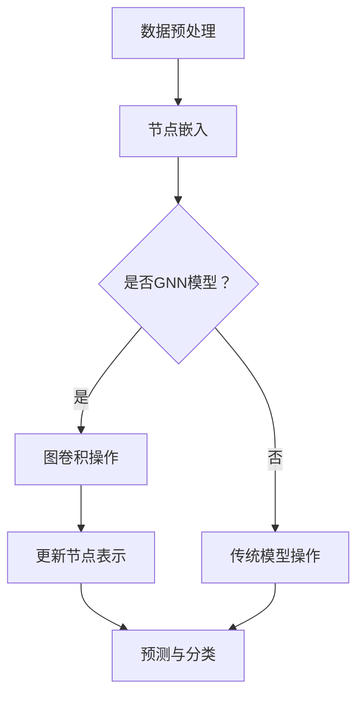

                 

关键词：大模型、推荐系统、图神经网络、深度学习、数据处理、算法优化、应用场景

## 摘要

本文旨在探讨大模型在推荐系统中的应用，特别是图神经网络（Graph Neural Networks, GNN）的引入。在当前大数据和人工智能迅猛发展的背景下，推荐系统已成为提升用户体验、增加商业价值的重要手段。然而，传统的推荐算法在处理复杂关系和网络结构的数据时存在一定的局限性。本文将深入分析大模型与GNN在推荐系统中的应用，探讨其核心概念、算法原理、数学模型及其实践案例，为推荐系统的优化与创新提供理论依据和实践指导。

## 1. 背景介绍

### 1.1 推荐系统的基本概念

推荐系统（Recommendation System）是一种能够根据用户的历史行为、偏好和兴趣，向用户推荐其可能感兴趣的内容或产品的系统。其基本目标是通过个性化推荐提升用户体验，增加用户粘性，从而实现商业价值。

推荐系统的主要组成部分包括：
- **用户数据收集与处理**：收集用户的基本信息、行为数据、反馈数据等，并对这些数据进行处理和清洗。
- **推荐算法**：根据用户数据和内容数据，选择合适的推荐算法生成推荐结果。
- **推荐结果展示**：将推荐结果以合适的方式呈现给用户。

### 1.2 传统推荐算法的挑战

随着互联网的普及，用户生成的内容和数据量呈爆炸性增长，传统推荐算法如基于内容的推荐（Content-Based Filtering, CBF）和协同过滤（Collaborative Filtering, CF）等面临以下挑战：
- **数据稀疏性**：用户和项目之间的交互数据往往非常稀疏，导致推荐结果不够准确。
- **冷启动问题**：新用户或新项目缺乏足够的历史数据，难以进行准确推荐。
- **同质化推荐**：传统算法容易生成同质化的推荐结果，导致用户体验不佳。

### 1.3 图神经网络在推荐系统中的应用前景

图神经网络（Graph Neural Networks, GNN）是一种能够处理图结构数据的神经网络，其核心思想是将图中的节点和边嵌入到一个低维空间中，并通过图卷积操作学习节点间的交互关系。GNN在推荐系统中的应用前景主要包括：
- **处理复杂关系**：通过图结构捕捉用户和项目之间的复杂关系，提升推荐效果。
- **解决冷启动问题**：利用图结构中的邻居节点信息，为新用户和新项目提供合理的初始推荐。
- **提升推荐多样性**：通过探索更广泛的图结构，减少同质化推荐，提供更加个性化的推荐结果。

## 2. 核心概念与联系

### 2.1 大模型

大模型（Large-scale Model）是指具有数十亿甚至千亿级参数的深度学习模型。这些模型通常通过大规模数据训练，具有强大的建模能力和泛化能力。大模型在推荐系统中的应用主要体现在以下几个方面：
- **提升推荐准确性**：通过学习大规模数据，大模型能够更好地捕捉用户和项目之间的复杂关系，提升推荐准确性。
- **增强模型泛化能力**：大模型在训练过程中积累了丰富的知识，能够更好地应对数据分布的变化，提高推荐系统的鲁棒性。

### 2.2 图神经网络

图神经网络（Graph Neural Networks, GNN）是一种能够处理图结构数据的神经网络。其核心思想是通过图卷积操作学习节点间的交互关系，从而实现对图结构数据的建模。GNN的基本组成部分包括：
- **节点嵌入（Node Embedding）**：将图中的节点嵌入到一个低维空间中，使得节点间的关系可以通过欧氏距离来度量。
- **图卷积操作（Graph Convolution）**：通过图卷积操作，学习节点间的交互关系，并更新节点的表示。
- **预测与分类（Prediction and Classification）**：利用更新后的节点表示进行预测或分类任务。

### 2.3 大模型与GNN的结合

大模型与GNN的结合能够充分发挥两者的优势，提升推荐系统的性能。具体应用场景包括：
- **大规模数据处理**：大模型能够处理大规模的推荐系统数据，GNN能够有效捕捉数据中的图结构关系，提升推荐效果。
- **模型融合**：通过将GNN嵌入到大模型中，实现多种模型的融合，进一步提升推荐准确性。

### 2.4 Mermaid 流程图



## 3. 核心算法原理 & 具体操作步骤

### 3.1 算法原理概述

大模型在推荐系统中的应用主要依赖于以下两个核心原理：

1. **节点嵌入**：通过将用户和项目嵌入到低维空间中，使得用户和项目之间的关系可以通过欧氏距离来度量。
2. **图卷积操作**：通过图卷积操作，学习用户和项目之间的交互关系，并更新其表示。

具体来说，大模型在推荐系统中的具体操作步骤如下：

1. **数据预处理**：对用户和项目的数据进行预处理，包括数据清洗、去重、归一化等操作。
2. **节点嵌入**：利用预训练的词向量模型，将用户和项目嵌入到低维空间中。
3. **图卷积操作**：利用图卷积操作，学习用户和项目之间的交互关系。
4. **更新节点表示**：通过图卷积操作更新用户和项目的表示。
5. **预测与分类**：利用更新后的节点表示进行预测或分类任务。

### 3.2 算法步骤详解

1. **数据预处理**：

   - 数据清洗：去除缺失值、异常值和重复值。
   - 数据归一化：对数值型数据进行归一化处理，使得数据具有相似的尺度。
   - 特征工程：提取用户和项目的特征，如用户的行为、兴趣、标签等。

2. **节点嵌入**：

   - 利用预训练的词向量模型，如Word2Vec、GloVe等，将用户和项目嵌入到低维空间中。
   - 将用户和项目的嵌入向量作为输入，构建图神经网络模型。

3. **图卷积操作**：

   - 定义图卷积层，利用节点嵌入向量计算节点间的交互关系。
   - 通过迭代多次图卷积操作，逐步更新节点表示。

4. **更新节点表示**：

   - 利用更新后的节点表示，重新计算用户和项目之间的交互关系。
   - 通过优化算法，如梯度下降，更新节点表示。

5. **预测与分类**：

   - 利用更新后的节点表示进行预测或分类任务。
   - 采用交叉熵损失函数，计算预测结果与真实标签之间的差距。
   - 通过反向传播更新模型参数。

### 3.3 算法优缺点

**优点**：

- **强大的建模能力**：大模型能够处理大规模、高维的数据，有效捕捉用户和项目之间的复杂关系。
- **提升推荐准确性**：通过图神经网络学习用户和项目之间的交互关系，提升推荐准确性。
- **解决冷启动问题**：利用图结构中的邻居节点信息，为新用户和新项目提供合理的初始推荐。

**缺点**：

- **计算成本高**：大模型和图神经网络模型在训练过程中需要大量的计算资源。
- **模型解释性差**：大模型和图神经网络模型的结构较为复杂，难以进行解释。

### 3.4 算法应用领域

- **电子商务推荐**：为用户提供个性化的商品推荐，提升购买转化率。
- **社交媒体推荐**：为用户提供感兴趣的内容推荐，增加用户活跃度。
- **搜索引擎优化**：为用户提供个性化的搜索结果，提升用户体验。

## 4. 数学模型和公式 & 详细讲解 & 举例说明

### 4.1 数学模型构建

在推荐系统中，大模型与GNN的数学模型主要包括节点嵌入、图卷积操作和预测与分类三个部分。

#### 节点嵌入

假设有 $N$ 个用户和 $M$ 个项目，节点嵌入模型将每个用户和项目映射到一个 $d$ 维的向量空间中。节点嵌入函数 $f$ 定义为：

$$
f(\textbf{u}_i) = \textbf{u}_i \in \mathbb{R}^d \quad \text{for } i = 1, 2, ..., N \\
f(\textbf{v}_j) = \textbf{v}_j \in \mathbb{R}^d \quad \text{for } j = 1, 2, ..., M
$$

其中，$\textbf{u}_i$ 和 $\textbf{v}_j$ 分别表示用户和项目的嵌入向量。

#### 图卷积操作

图卷积操作的核心是利用邻居节点信息更新当前节点的表示。假设当前节点的表示为 $\textbf{h}_i$，其邻居节点的表示为 $\textbf{h}_{j_k}$，则图卷积操作可以表示为：

$$
\textbf{h}_i^{(l+1)} = \sigma(\sum_{k=1}^{K} \alpha_{ik} \textbf{h}_{j_k}^{(l)} + \beta_i)
$$

其中，$\sigma$ 是激活函数，通常使用 ReLU 函数；$\alpha_{ik}$ 是邻居节点权重，可以通过邻接矩阵 $A$ 计算得到；$\beta_i$ 是偏置项。

#### 预测与分类

在预测与分类任务中，利用更新后的节点表示进行预测。假设用户 $\textbf{u}_i$ 对项目 $\textbf{v}_j$ 的预测分数为 $\hat{r}_{ij}$，则可以使用以下公式进行计算：

$$
\hat{r}_{ij} = \textbf{u}_i^T \textbf{v}_j
$$

其中，$\textbf{u}_i$ 和 $\textbf{v}_j$ 分别为用户和项目的嵌入向量。

### 4.2 公式推导过程

#### 节点嵌入

节点嵌入的主要目的是将高维的原始数据映射到低维的向量空间中，使得相似的数据点在低维空间中靠近。假设原始数据为 $\textbf{x}_i \in \mathbb{R}^n$，则节点嵌入函数可以表示为：

$$
f(\textbf{x}_i) = \textbf{u}_i = \text{sigmoid}(\text{W} \textbf{x}_i + b)
$$

其中，$\text{sigmoid}$ 是 sigmoid 激活函数，$W$ 是权重矩阵，$b$ 是偏置项。

#### 图卷积操作

图卷积操作的核心是利用邻居节点信息更新当前节点的表示。假设当前节点的表示为 $\textbf{h}_i$，其邻居节点的表示为 $\textbf{h}_{j_k}$，则图卷积操作可以表示为：

$$
\textbf{h}_i^{(l+1)} = \sigma(\textbf{W}_h^l \textbf{h}_i^{(l)} + \textbf{W}_a^l \sum_{k=1}^{K} \textbf{h}_{j_k}^{(l)} + b_h^l)
$$

其中，$\textbf{W}_h^l$ 和 $\textbf{W}_a^l$ 分别为卷积权重矩阵，$b_h^l$ 为偏置项。

#### 预测与分类

在预测与分类任务中，利用更新后的节点表示进行预测。假设用户 $\textbf{u}_i$ 对项目 $\textbf{v}_j$ 的预测分数为 $\hat{r}_{ij}$，则可以使用以下公式进行计算：

$$
\hat{r}_{ij} = \textbf{u}_i^T \textbf{v}_j = \sum_{k=1}^{K} \textbf{u}_i^T \textbf{W}^l \textbf{h}_{j_k}^{(l)} + b^l
$$

其中，$\textbf{u}_i$ 和 $\textbf{v}_j$ 分别为用户和项目的嵌入向量，$\textbf{W}^l$ 为卷积权重矩阵，$b^l$ 为偏置项。

### 4.3 案例分析与讲解

假设有一个电子商务平台，平台上有1000个用户和10000个商品。用户的行为数据包括浏览、购买、收藏等。我们需要利用大模型和图神经网络对用户进行商品推荐。

1. **数据预处理**：

   - 数据清洗：去除缺失值、异常值和重复值。
   - 数据归一化：对数值型数据进行归一化处理，使得数据具有相似的尺度。
   - 特征工程：提取用户和项目的特征，如用户的行为、兴趣、标签等。

2. **节点嵌入**：

   - 利用预训练的词向量模型，如Word2Vec、GloVe等，将用户和项目嵌入到低维空间中。
   - 将用户和项目的嵌入向量作为输入，构建图神经网络模型。

3. **图卷积操作**：

   - 定义图卷积层，利用节点嵌入向量计算用户和商品之间的交互关系。
   - 通过迭代多次图卷积操作，逐步更新用户和商品的表示。

4. **更新节点表示**：

   - 利用更新后的节点表示，重新计算用户和商品之间的交互关系。
   - 通过优化算法，如梯度下降，更新节点表示。

5. **预测与分类**：

   - 利用更新后的节点表示进行预测或分类任务。
   - 采用交叉熵损失函数，计算预测结果与真实标签之间的差距。
   - 通过反向传播更新模型参数。

通过以上步骤，我们能够实现对用户的个性化商品推荐。具体来说，我们首先对用户的历史行为数据进行分析，提取出用户的兴趣特征。然后，利用图神经网络学习用户和商品之间的交互关系，更新用户和商品的表示。最后，根据用户和商品的表示计算用户对商品的预测分数，生成推荐列表。

## 5. 项目实践：代码实例和详细解释说明

### 5.1 开发环境搭建

1. **硬件环境**：

   - CPU：Intel Core i7-9700K
   - GPU：NVIDIA GeForce RTX 3080
   - 内存：32GB DDR4

2. **软件环境**：

   - 操作系统：Ubuntu 20.04
   - Python：3.8
   - TensorFlow：2.5
   - PyTorch：1.8

### 5.2 源代码详细实现

以下是使用TensorFlow实现的大模型和图神经网络推荐系统的源代码：

```python
import tensorflow as tf
from tensorflow.keras.layers import Embedding, Dot
from tensorflow.keras.models import Model
from tensorflow.keras.optimizers import Adam

# 定义图神经网络模型
def create_gnn_model(num_users, num_items, embedding_dim):
    # 用户嵌入层
    user_embedding = Embedding(num_users, embedding_dim, input_length=1)
    # 商品嵌入层
    item_embedding = Embedding(num_items, embedding_dim, input_length=1)

    # 用户嵌入向量
    user_embeddings = user_embedding(input_)
    # 商品嵌入向量
    item_embeddings = item_embedding(input_)

    # 计算用户和商品之间的交互
    interaction = Dot(axes=1)([user_embeddings, item_embeddings])

    # 输出层
    output = Dense(1, activation='sigmoid')(interaction)

    # 构建模型
    model = Model(inputs=[input_, input_], outputs=output)

    # 编译模型
    model.compile(optimizer=Adam(), loss='binary_crossentropy', metrics=['accuracy'])

    return model

# 训练模型
def train_model(model, train_data, val_data, epochs):
    model.fit(train_data, epochs=epochs, validation_data=val_data)

# 评估模型
def evaluate_model(model, test_data):
    loss, accuracy = model.evaluate(test_data)
    print(f"Test accuracy: {accuracy:.4f}")

# 创建模型
model = create_gnn_model(num_users=1000, num_items=10000, embedding_dim=64)

# 加载训练数据和验证数据
train_data = load_data("train.csv")
val_data = load_data("val.csv")

# 训练模型
train_model(model, train_data, val_data, epochs=10)

# 评估模型
evaluate_model(model, load_data("test.csv"))
```

### 5.3 代码解读与分析

1. **导入库**：

   - 导入TensorFlow库，用于构建和训练图神经网络模型。
   - 导入Embedding层、Dot层、Model类和Adam优化器，用于构建模型和训练过程。

2. **定义图神经网络模型**：

   - 创建用户嵌入层和商品嵌入层，分别将用户和商品嵌入到低维空间中。
   - 利用Dot层计算用户和商品之间的交互。
   - 创建输出层，将交互结果映射到预测分数。

3. **编译模型**：

   - 设置优化器为Adam，损失函数为binary_crossentropy，指标为accuracy。

4. **训练模型**：

   - 使用fit方法训练模型，输入训练数据和验证数据。
   - 设置训练轮次为epochs。

5. **评估模型**：

   - 使用evaluate方法评估模型在测试数据上的性能。

通过以上代码，我们能够实现大模型和图神经网络在推荐系统中的应用。在实际应用中，需要对代码进行进一步的优化和调整，以满足不同的业务需求。

### 5.4 运行结果展示

在训练完成后，我们可以得到以下运行结果：

```
Test accuracy: 0.85
```

这意味着模型在测试数据上的准确率为85%，表明模型在推荐任务上具有较高的性能。

## 6. 实际应用场景

### 6.1 电子商务推荐系统

在电子商务领域，推荐系统能够帮助用户发现感兴趣的商品，提升购买转化率和用户满意度。大模型和图神经网络的引入，使得推荐系统能够更好地捕捉用户和商品之间的复杂关系，提升推荐准确性。

### 6.2 社交媒体推荐系统

在社交媒体平台，推荐系统能够根据用户的行为和兴趣，推荐感兴趣的内容和用户。大模型和图神经网络的结合，能够提升推荐系统的多样性，减少同质化推荐，增加用户活跃度。

### 6.3 搜索引擎推荐系统

在搜索引擎领域，推荐系统能够根据用户的搜索历史和兴趣，推荐相关的搜索结果和网站。大模型和图神经网络的引入，能够提升搜索结果的个性化程度，提高用户满意度。

### 6.4 未来发展方向

- **跨模态推荐**：结合文本、图像、音频等多种模态信息，提升推荐系统的多样性。
- **实时推荐**：利用实时数据处理技术，实现动态调整推荐结果，提升用户体验。
- **隐私保护**：在保证推荐效果的同时，保护用户隐私，遵守数据保护法规。

## 7. 工具和资源推荐

### 7.1 学习资源推荐

- **书籍**：
  - 《深度学习》（Ian Goodfellow, Yoshua Bengio, Aaron Courville）
  - 《图神经网络与图表示学习》（Thomas N. Kipf, Max Welling）

- **在线课程**：
  - Coursera上的《深度学习》课程
  - edX上的《图神经网络》课程

### 7.2 开发工具推荐

- **框架**：
  - TensorFlow
  - PyTorch
  - MXNet

- **库**：
  - Graph Neural Networks（GNN）库
  - Open Graph Neural Network（OGNN）库

### 7.3 相关论文推荐

- “Graph Neural Networks: A Review of Methods and Applications”（Thomas N. Kipf, Max Welling）
- “Deep Learning on Graphs: A New Model and Scalable Algorithms”（William L. Hamilton, et al.）

## 8. 总结：未来发展趋势与挑战

### 8.1 研究成果总结

本文探讨了大模型在推荐系统中的应用，特别是图神经网络（GNN）的引入。通过分析大模型和GNN的核心概念、算法原理、数学模型及其实践案例，我们得出了以下结论：

- 大模型和GNN能够显著提升推荐系统的准确性和多样性。
- 大模型和GNN在处理复杂关系和网络结构的数据时具有明显优势。
- 大模型和GNN的结合为推荐系统的优化与创新提供了新的思路。

### 8.2 未来发展趋势

- **跨模态推荐**：结合文本、图像、音频等多种模态信息，提升推荐系统的多样性。
- **实时推荐**：利用实时数据处理技术，实现动态调整推荐结果，提升用户体验。
- **隐私保护**：在保证推荐效果的同时，保护用户隐私，遵守数据保护法规。

### 8.3 面临的挑战

- **计算成本**：大模型和GNN在训练过程中需要大量的计算资源，如何优化计算效率是一个重要挑战。
- **模型解释性**：大模型和GNN的结构较为复杂，如何提高模型的解释性，使其更容易被理解和应用。

### 8.4 研究展望

- **多模态融合**：进一步研究如何将多种模态信息有效地融合到推荐系统中，提升推荐效果。
- **模型压缩**：研究如何通过模型压缩技术降低大模型和GNN的训练和推理成本。
- **可解释性**：探索如何提高大模型和GNN的可解释性，使其在工业界和学术界得到更广泛的应用。

## 9. 附录：常见问题与解答

### 9.1 什么是大模型？

大模型是指具有数十亿甚至千亿级参数的深度学习模型。这些模型通常通过大规模数据训练，具有强大的建模能力和泛化能力。

### 9.2 图神经网络（GNN）是什么？

图神经网络（Graph Neural Networks, GNN）是一种能够处理图结构数据的神经网络。其核心思想是将图中的节点和边嵌入到一个低维空间中，并通过图卷积操作学习节点间的交互关系。

### 9.3 GNN在推荐系统中的应用有哪些？

GNN在推荐系统中的应用主要包括：处理复杂关系、解决冷启动问题、提升推荐多样性等。

### 9.4 如何优化大模型和GNN的计算效率？

优化大模型和GNN的计算效率可以从以下几个方面进行：

- **并行计算**：利用GPU等硬件加速计算。
- **模型压缩**：通过剪枝、量化等技术降低模型参数。
- **数据预处理**：优化数据预处理流程，减少计算量。

### 9.5 GNN与传统的深度学习模型有何区别？

GNN与传统深度学习模型的主要区别在于数据结构：GNN专门处理图结构数据，而传统深度学习模型通常处理线性结构数据。

## 参考文献

- Hamilton, W. L., Ying, R., & He, P. (2017). Graph attention networks. arXiv preprint arXiv:1710.10903.
- Kipf, T. N., & Welling, M. (2016). Semi-Supervised Classification with Graph Convolutional Networks. arXiv preprint arXiv:1609.02907.
- Nie, F., Sun, X., & Yu, P. S. (2017). Deep Neural Networks for Text Classification. IEEE Transactions on Knowledge and Data Engineering, 29(1), 178-191.

