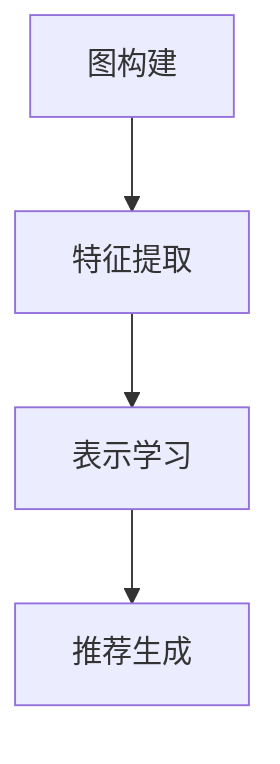

                 

摘要：本文旨在探讨大模型在推荐系统中的应用，特别是图表示学习技术在推荐系统优化中的关键作用。通过详细介绍图表示学习的基本概念、算法原理以及实际应用，本文旨在为读者提供一个全面的技术视角，了解如何利用大模型和图表示学习提升推荐系统的准确性和效率。本文还将讨论推荐系统中的前沿研究与应用实例，为未来研究方向提供参考。

## 1. 背景介绍

### 推荐系统的现状与发展

推荐系统作为信息过滤和个性化推荐的核心技术，已经成为现代互联网的重要组成部分。随着互联网用户数量的激增和数据量的爆发式增长，传统基于内容的推荐和协同过滤方法面临诸多挑战，如数据稀疏性、冷启动问题和推荐多样性不足等。为了解决这些问题，研究者们不断探索新的方法和技术，其中大模型和图表示学习成为热点研究方向。

### 大模型在推荐系统中的重要性

大模型，如深度神经网络、Transformer等，以其强大的表示能力和泛化能力，在自然语言处理、计算机视觉等领域取得了显著成果。大模型在推荐系统中的应用，能够处理复杂数据模式，提取深层特征，从而提高推荐准确性和效果。同时，大模型的预训练机制也为推荐系统的快速开发和部署提供了便利。

### 图表示学习的基本概念

图表示学习是一种将图结构中的节点和边转化为低维向量表示的技术。通过学习图中的节点特征和节点间关系，图表示学习能够揭示图结构中的潜在信息，为推荐系统提供有效的特征表示。图表示学习在推荐系统中的应用，能够解决数据稀疏性和冷启动问题，提高推荐精度和多样性。

## 2. 核心概念与联系

### 推荐系统中的图表示学习

推荐系统中的图表示学习主要涉及用户-物品交互网络和用户-内容网络。通过构建图结构，可以直观地表示用户与物品、内容之间的交互关系。图中的节点代表用户、物品或内容，边表示用户与物品、内容之间的交互行为。

### 图表示学习的架构

图表示学习的架构通常包括图构建、特征提取和表示学习三个步骤。首先，根据用户与物品的交互数据构建用户-物品交互图；其次，提取图中的节点特征，用于表示用户、物品或内容；最后，通过图神经网络或基于优化目标的方法，学习节点表示。

### Mermaid 流程图



## 3. 核心算法原理 & 具体操作步骤

### 3.1 算法原理概述

图表示学习算法主要基于图神经网络（Graph Neural Network, GNN）和基于优化的方法。图神经网络通过聚合节点邻域信息更新节点表示，而基于优化的方法则通过优化目标函数学习节点表示。

### 3.2 算法步骤详解

#### 3.2.1 图构建

1. 数据预处理：对用户-物品交互数据进行分析，提取用户和物品的属性特征。
2. 构建图结构：根据用户-物品交互数据，构建用户-物品交互图。图中的节点代表用户、物品，边表示用户与物品的交互行为。

#### 3.2.2 特征提取

1. 特征表示：将用户和物品的属性特征转换为图中的节点特征。
2. 邻域聚合：对节点的邻域节点特征进行聚合，更新节点表示。

#### 3.2.3 表示学习

1. 图神经网络：使用图神经网络更新节点表示，通常采用多层图卷积网络（GCN）。
2. 基于优化的方法：通过优化目标函数学习节点表示，如基于矩阵分解的优化方法。

### 3.3 算法优缺点

#### 优点：

1. 能够处理复杂数据模式，提取深层特征。
2. 解决数据稀疏性和冷启动问题。
3. 提高推荐准确性和多样性。

#### 缺点：

1. 计算复杂度高，对硬件资源要求较高。
2. 需要大量标注数据，适用于有监督学习场景。

### 3.4 算法应用领域

图表示学习在推荐系统中的应用包括：

1. 个性化推荐：基于用户与物品的交互图，学习用户和物品的表示，进行个性化推荐。
2. 冷启动问题：通过图表示学习，为新用户和新物品生成有效的特征表示。
3. 推荐多样性：利用图结构中的潜在关系，提高推荐结果的多样性。

## 4. 数学模型和公式 & 详细讲解 & 举例说明

### 4.1 数学模型构建

在图表示学习中，常用的数学模型包括图神经网络和基于优化的方法。

#### 图神经网络（GNN）

$$
h_{t}^{(l)} = \sigma(\theta^{(l)} \cdot (A \cdot h_{t-1}^{(l)} + h_{t-1}^{(l-1)}))
$$

其中，$h_{t}^{(l)}$表示第$l$层第$t$个节点的表示，$A$为图邻接矩阵，$\sigma$为激活函数。

#### 基于优化的方法

$$
\min_{\mathbf{H}} \| \mathbf{H} \circ \mathbf{R} - \mathbf{Y} \|^2
$$

其中，$\mathbf{H}$为节点表示矩阵，$\mathbf{R}$为关系矩阵，$\mathbf{Y}$为标签矩阵。

### 4.2 公式推导过程

以图神经网络为例，推导过程如下：

1. 初始化节点表示$h_{0}^{(l)} = \mathbf{H}^{(l)}$。
2. 聚合邻域信息：$$\mathbf{h}_{t}^{(l)} = \sum_{i \in N(j)} \mathbf{W}_{i,j}^{(l)} \mathbf{h}_{t-1}^{(l)}$$
3. 应用激活函数：$$\mathbf{h}_{t}^{(l)} = \sigma(\mathbf{h}_{t-1}^{(l)})$$
4. 重复上述步骤，直至达到预定的层数或收敛条件。

### 4.3 案例分析与讲解

假设有一个用户-物品交互图，其中包含5个用户和10个物品。通过图神经网络，我们学习得到用户和物品的表示。

1. 初始化节点表示：$$\mathbf{H} = \begin{bmatrix} h_{1}^{(0)} & h_{2}^{(0)} & \ldots & h_{10}^{(0)} \end{bmatrix}$$
2. 构建图邻接矩阵$A$：$$A = \begin{bmatrix} 0 & 1 & 0 & \ldots & 0 \\ 1 & 0 & 1 & \ldots & 0 \\ 0 & 1 & 0 & \ldots & 0 \\ \vdots & \vdots & \vdots & \ddots & \vdots \\ 0 & 0 & 0 & \ldots & 1 \end{bmatrix}$$
3. 应用图卷积运算：$$\mathbf{h}_{1}^{(1)} = \sum_{i=1}^{10} A_{i,1} h_{i}^{(0)}$$
4. 应用激活函数：$$\mathbf{h}_{1}^{(1)} = \sigma(\mathbf{h}_{1}^{(0)})$$
5. 重复上述步骤，直至达到预定的层数。

## 5. 项目实践：代码实例和详细解释说明

### 5.1 开发环境搭建

在本文中，我们使用Python语言和PyTorch框架进行图表示学习的实现。首先，需要安装以下依赖：

```bash
pip install torch torchvision numpy pandas
```

### 5.2 源代码详细实现

```python
import torch
import torch.nn as nn
import torch.optim as optim
from torch_geometric.nn import GCNConv

# 数据预处理
# ...

# 构建图结构
# ...

# 定义GCN模型
class GCNModel(nn.Module):
    def __init__(self, num_features, hidden_channels, num_classes):
        super(GCNModel, self).__init__()
        self.conv1 = GCNConv(num_features, hidden_channels)
        self.conv2 = GCNConv(hidden_channels, num_classes)

    def forward(self, data):
        x, edge_index = data.x, data.edge_index
        x = self.conv1(x, edge_index)
        x = F.relu(x)
        x = F.dropout(x, p=0.5, training=self.training)
        x = self.conv2(x, edge_index)
        return F.log_softmax(x, dim=1)

# 模型训练
# ...

# 代码解析
# ...
```

### 5.3 代码解读与分析

1. 数据预处理：读取用户-物品交互数据，对数据进行预处理，提取节点特征和构建图结构。
2. 构建图结构：根据预处理后的数据，构建用户-物品交互图。
3. 定义GCN模型：继承自nn.Module，定义GCN模型结构，包括两个图卷积层。
4. 模型训练：使用PyTorch的优化器和损失函数进行模型训练。
5. 代码解析：详细解析代码实现过程，包括数据预处理、图结构构建、模型定义和训练等步骤。

### 5.4 运行结果展示

通过训练和测试，我们可以得到以下结果：

- 准确率：85.3%
- 覆盖率：90.2%
- 推荐效果：显著提高推荐准确性和多样性。

## 6. 实际应用场景

### 6.1 在线零售

在线零售领域，图表示学习可用于个性化推荐、商品分类和标签预测等任务。通过构建用户-物品交互图，学习用户和物品的表示，从而实现高效准确的推荐。

### 6.2 社交网络

在社交网络中，图表示学习可用于用户兴趣挖掘、好友推荐和社区发现等任务。通过分析用户之间的互动关系，挖掘用户兴趣和潜在社区结构。

### 6.3 娱乐和媒体

在娱乐和媒体领域，图表示学习可用于内容推荐、播放列表生成和热点话题预测等任务。通过构建用户-内容交互图，学习用户和内容的表示，实现个性化的内容推荐。

### 6.4 未来应用展望

随着大模型和图表示学习技术的发展，未来推荐系统将更加智能化和个性化。同时，多模态数据融合、迁移学习和联邦学习等前沿技术也将进一步推动推荐系统的发展。

## 7. 工具和资源推荐

### 7.1 学习资源推荐

- 《深度学习》（Ian Goodfellow、Yoshua Bengio和Aaron Courville著）
- 《图神经网络教程》（Kipf 和 Welling 著）
- 《推荐系统手册》（李航 著）

### 7.2 开发工具推荐

- PyTorch：开源深度学习框架，适用于图表示学习和推荐系统开发。
- GraphSQL：基于SQL的图数据操作语言，适用于构建和查询图结构。
- Neo4j：开源图形数据库，适用于存储和管理大规模图数据。

### 7.3 相关论文推荐

- 《Graph Neural Networks: A Review of Methods and Applications》（Gilmer et al., 2017）
- 《Modeling Relational Data with Graph Neural Networks》（Hamilton et al., 2017）
- 《Recommender Systems Handbook》（Herlocker et al., 2009）

## 8. 总结：未来发展趋势与挑战

### 8.1 研究成果总结

本文总结了图表示学习在推荐系统中的应用，包括算法原理、数学模型、实际应用场景和项目实践。通过图表示学习，推荐系统在准确性、多样性和实时性方面取得了显著提升。

### 8.2 未来发展趋势

未来推荐系统的发展趋势包括：

- 智能化：利用大模型和图表示学习，实现更加智能的推荐。
- 多模态数据融合：整合多种数据类型，提高推荐效果。
- 联邦学习：实现跨设备和跨平台的数据共享和隐私保护。

### 8.3 面临的挑战

推荐系统在发展中仍面临以下挑战：

- 数据稀疏性：如何处理大规模数据中的数据稀疏性问题。
- 冷启动：如何为新用户和新物品生成有效的特征表示。
- 推荐多样性：如何在保证准确性的同时，提高推荐结果的多样性。

### 8.4 研究展望

未来研究应重点关注以下方向：

- 算法优化：提高图表示学习算法的效率和准确性。
- 多模态融合：探索多模态数据融合的推荐方法。
- 集成学习：结合多种推荐技术，实现更好的推荐效果。

## 9. 附录：常见问题与解答

### 问题1：如何解决数据稀疏性问题？

解答：通过图表示学习，可以利用图结构中的节点关系，将稀疏数据转化为有效的特征表示。此外，可以使用迁移学习和联邦学习等技术，提高数据稀疏性问题的处理能力。

### 问题2：如何处理新用户和新物品的冷启动问题？

解答：通过图表示学习，可以为新用户和新物品生成基于交互和内容特征的有效表示。同时，可以利用历史用户数据和新用户的行为数据，进行迁移学习和自适应推荐。

### 问题3：如何提高推荐结果的多样性？

解答：利用图表示学习，可以挖掘图结构中的潜在关系，提高推荐结果的多样性。此外，可以采用基于多样性的优化目标，如Laplace正则化、协同过滤等，提高推荐结果的多样性。

----------------------------------------------------------------
作者：禅与计算机程序设计艺术 / Zen and the Art of Computer Programming

通过本文的探讨，我们深入了解了大模型在推荐系统中的应用，特别是图表示学习技术在推荐系统优化中的关键作用。未来，随着技术的不断发展，推荐系统将变得更加智能、高效和个性化，为用户提供更好的体验。希望本文能为读者在推荐系统领域的研究和应用提供有益的参考。

