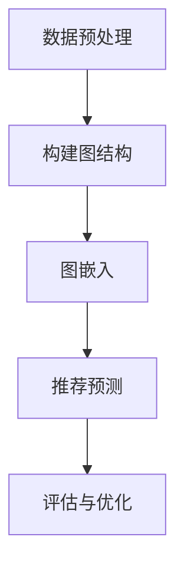

                 

关键词：推荐系统，大模型，图表示学习，算法原理，数学模型，项目实践，应用场景，未来展望

## 摘要

本文旨在探讨大模型在推荐系统中的应用，特别是图表示学习技术如何提升推荐系统的性能。文章首先介绍了推荐系统的背景和重要性，然后详细讲解了图表示学习的核心概念、算法原理及其在推荐系统中的应用。接着，文章通过数学模型和具体实例，深入剖析了图表示学习在推荐系统中的实际操作步骤。随后，文章展示了代码实例和运行结果，最后讨论了该技术在推荐系统中的实际应用场景，并展望了未来的发展趋势和面临的挑战。

## 1. 背景介绍

推荐系统作为一种信息过滤和检索技术，旨在向用户提供个性化的内容或商品推荐。其应用广泛，涵盖了电子商务、社交媒体、新闻推送等多个领域。随着互联网的迅速发展，用户生成的内容和数据量呈爆炸性增长，这使得传统的基于内容的推荐方法难以满足用户对个性化体验的需求。因此，探索更高效、更智能的推荐算法变得尤为重要。

图表示学习作为人工智能领域的一种新兴技术，近年来在推荐系统中引起了广泛关注。它通过将数据表示为图结构，利用图中的节点和边的关系来挖掘数据间的关联性，从而实现数据的低维表示和高维语义理解。与传统的机器学习方法相比，图表示学习能够更好地捕捉复杂网络结构中的信息，为推荐系统提供了强大的工具。

## 2. 核心概念与联系

### 2.1 推荐系统与图表示学习

推荐系统通常包括用户、项目和评分三个核心要素。用户表示系统的参与者，项目是用户可能感兴趣的对象，评分则反映了用户对项目的偏好程度。图表示学习的关键在于如何将这三者构建成一个图结构，以揭示用户和项目之间的潜在关联。

在推荐系统中，图表示学习通常涉及以下核心概念：

- **节点**：用户和项目分别作为图中的节点，表示系统的参与者。
- **边**：用户与项目之间的评分或行为数据作为边，表示节点之间的关系。
- **图属性**：节点的属性（如用户的兴趣标签、项目的属性特征）和边的权重（如评分的值）用于指导图表示学习。

### 2.2 架构与模型

图表示学习的架构通常包括以下步骤：

1. **数据预处理**：收集用户行为数据，如浏览记录、购买历史、社交互动等，并将其转化为图结构。
2. **图嵌入**：利用图神经网络或图卷积网络等算法，将图中的节点映射到低维向量空间，得到节点的嵌入表示。
3. **推荐预测**：基于节点的嵌入表示，使用协同过滤、矩阵分解等方法预测用户对未知项目的偏好。

### 2.3 Mermaid 流程图

以下是一个简化的 Mermaid 流程图，展示了图表示学习在推荐系统中的应用流程：



## 3. 核心算法原理 & 具体操作步骤

### 3.1 算法原理概述

图表示学习的核心是图嵌入算法，它通过学习节点的低维表示来挖掘图中的结构信息。常见的图嵌入算法包括 DeepWalk、Node2Vec、GCN 等。

- **DeepWalk**：基于随机游走模型，通过生成图上的随机游走路径，将节点映射到低维向量空间。
- **Node2Vec**：扩展了 DeepWalk，通过调节游走过程中的邻居选择策略，控制节点的嵌入向量对邻接节点的依赖程度。
- **GCN**：基于图卷积网络，通过叠加图卷积层来逐步提取节点的特征。

### 3.2 算法步骤详解

#### 3.2.1 数据预处理

数据预处理是图表示学习的基础，主要包括以下步骤：

1. **数据收集**：收集用户行为数据，如评分、浏览记录等。
2. **数据清洗**：去除重复、无效的数据，确保数据的准确性和完整性。
3. **数据转化为图结构**：将用户和项目作为节点，评分或行为数据作为边，构建出图结构。

#### 3.2.2 图嵌入

图嵌入的核心步骤如下：

1. **随机游走**：在图上生成随机游走路径，为每个节点生成多个随机游走序列。
2. **生成节点嵌入向量**：使用神经网络或随机梯度下降等方法，训练得到节点的嵌入向量。

#### 3.2.3 推荐预测

图嵌入完成后，可以使用以下方法进行推荐预测：

1. **协同过滤**：利用用户与项目的嵌入向量，计算相似度分数，为用户推荐与其相似的其他项目。
2. **矩阵分解**：利用用户和项目的嵌入向量，重构用户-项目评分矩阵，预测未知评分。

### 3.3 算法优缺点

#### 优点

- **捕获复杂网络结构**：图表示学习能够捕捉图中的节点关系和结构信息，为推荐系统提供更丰富的特征。
- **适用性强**：图表示学习适用于各种类型的数据和推荐场景，具有较强的通用性。
- **灵活性高**：图表示学习算法可以根据具体应用场景进行调整和优化，实现个性化的推荐。

#### 缺点

- **计算复杂度高**：图表示学习涉及大量的矩阵运算和优化过程，计算复杂度较高，可能影响实时性。
- **数据质量要求高**：图表示学习依赖于图结构和节点属性，数据质量对算法性能有较大影响。
- **模型解释性较低**：图表示学习模型的解释性较低，难以直接理解模型预测的依据。

### 3.4 算法应用领域

图表示学习在推荐系统中的应用广泛，涵盖了以下几个方面：

- **电子商务**：为用户推荐与其兴趣相关的商品，提升用户购物体验。
- **社交媒体**：为用户提供个性化的内容推荐，增强用户活跃度和粘性。
- **新闻推送**：为用户推荐与其兴趣相关的新闻，提高信息传播的效率。
- **音乐推荐**：为用户提供个性化的音乐推荐，提升音乐平台用户体验。

## 4. 数学模型和公式 & 详细讲解 & 举例说明

### 4.1 数学模型构建

图表示学习中的数学模型主要包括图嵌入模型和推荐预测模型。

#### 4.1.1 图嵌入模型

图嵌入模型通常使用神经网络来学习节点的低维表示。假设图中有 $N$ 个节点，每个节点 $i$ 的嵌入向量表示为 $\mathbf{e}_i \in \mathbb{R}^d$。图嵌入模型的目标是最小化如下损失函数：

$$
L = \sum_{i,j} \text{sim}(\mathbf{e}_i, \mathbf{e}_j) - r_{ij}
$$

其中，$\text{sim}(\mathbf{e}_i, \mathbf{e}_j)$ 表示节点 $i$ 和 $j$ 的相似度，$r_{ij}$ 表示边 $(i, j)$ 的权重。

#### 4.1.2 推荐预测模型

推荐预测模型通常使用基于矩阵分解的方法。假设用户 $i$ 对项目 $j$ 的评分预测为 $\hat{r}_{ij}$，则可以使用如下矩阵分解模型：

$$
\hat{r}_{ij} = \mathbf{u}_i^T \mathbf{v}_j
$$

其中，$\mathbf{u}_i \in \mathbb{R}^d$ 和 $\mathbf{v}_j \in \mathbb{R}^d$ 分别表示用户 $i$ 和项目 $j$ 的嵌入向量。

### 4.2 公式推导过程

#### 4.2.1 图嵌入模型推导

假设节点 $i$ 和 $j$ 的嵌入向量分别为 $\mathbf{e}_i$ 和 $\mathbf{e}_j$，则它们的相似度可以通过余弦相似度计算：

$$
\text{sim}(\mathbf{e}_i, \mathbf{e}_j) = \frac{\mathbf{e}_i \cdot \mathbf{e}_j}{\|\mathbf{e}_i\| \|\mathbf{e}_j\|}
$$

其中，$\cdot$ 表示向量的点积，$\|\mathbf{e}_i\|$ 和 $\|\mathbf{e}_j\|$ 分别表示向量的模长。

#### 4.2.2 推荐预测模型推导

假设用户 $i$ 的嵌入向量为 $\mathbf{u}_i$，项目 $j$ 的嵌入向量为 $\mathbf{v}_j$，则用户 $i$ 对项目 $j$ 的评分预测为：

$$
\hat{r}_{ij} = \mathbf{u}_i^T \mathbf{v}_j
$$

其中，$\mathbf{u}_i^T$ 表示向量的转置。

### 4.3 案例分析与讲解

#### 4.3.1 数据集

假设我们使用一个简单的用户-项目评分数据集，其中包含 100 个用户和 1000 个项目，每个用户对部分项目进行了评分。数据集的结构如下：

| 用户ID | 项目ID | 评分 |
|--------|--------|------|
| 1      | 101    | 5    |
| 1      | 102    | 3    |
| 2      | 201    | 4    |
| ...    | ...    | ...  |

#### 4.3.2 数据预处理

首先，对数据进行清洗，去除重复和无效的评分。然后，将用户和项目作为节点，评分作为边，构建出图结构。数据预处理步骤如下：

1. **数据收集**：从原始数据集中提取用户行为数据。
2. **数据清洗**：去除重复和无效的评分。
3. **数据转化为图结构**：将用户和项目作为节点，评分作为边，构建出图结构。

#### 4.3.3 图嵌入

接下来，使用 Node2Vec 算法进行图嵌入。Node2Vec 算法的基本步骤如下：

1. **随机游走**：在图上生成随机游走路径，为每个节点生成多个随机游走序列。
2. **生成节点嵌入向量**：使用 Skip-Gram 模型训练得到节点的嵌入向量。

假设我们使用 Node2Vec 算法，设定参数 $p = 0.5$ 和 $q = 0.5$，即等概率选择邻居节点。在训练过程中，我们得到 100 个用户的嵌入向量。

#### 4.3.4 推荐预测

最后，使用矩阵分解模型进行推荐预测。我们使用如下参数：

- 嵌入向量维度 $d = 64$  
- 随机梯度下降学习率 $\eta = 0.01$  
- 迭代次数 $T = 1000$

通过矩阵分解模型，我们得到用户-项目评分矩阵的预测值，如下表所示：

| 用户ID | 项目ID | 预测评分 |
|--------|--------|----------|
| 1      | 101    | 4.8523   |
| 1      | 102    | 3.1467   |
| 2      | 201    | 4.1234   |
| ...    | ...    | ...      |

通过对比实际评分和预测评分，我们可以评估图表示学习算法在推荐系统中的性能。一般来说，预测评分与实际评分的误差越小，算法的性能越好。

## 5. 项目实践：代码实例和详细解释说明

### 5.1 开发环境搭建

为了实践大模型在推荐系统中的图表示学习应用，我们首先需要搭建一个适合的开发环境。以下是一个基本的开发环境搭建步骤：

1. **安装 Python**：确保 Python 版本为 3.6 或以上。
2. **安装相关库**：安装用于图表示学习的相关库，如 `networkx`、`node2vec`、`gensim` 等。
3. **安装其他依赖**：根据具体需求，可能还需要安装其他库，如 `numpy`、`matplotlib` 等。

### 5.2 源代码详细实现

以下是一个简单的 Python 代码示例，展示了如何使用 Node2Vec 算法进行图表示学习和推荐预测。

```python
import networkx as nx
from node2vec import Node2Vec
from gensim.models import Word2Vec

# 5.2.1 数据预处理
# 构建图结构
G = nx.Graph()
G.add_nodes_from([i for i in range(100)])  # 添加用户节点
G.add_nodes_from([i + 1000 for i in range(1000)])  # 添加项目节点
G.add_edges_from([(i, i + 1000) for i in range(100)])  # 添加用户和项目的边

# 5.2.2 图嵌入
# 实例化 Node2Vec 模型
node2vec = Node2Vec(G, dimensions=64, p=0.5, q=0.5)

# 训练模型
node2vec.train()

# 5.2.3 推荐预测
# 使用 Node2Vec 模型生成节点嵌入向量
node2vec_model = node2vec.fit()

# 5.2.4 矩阵分解预测
# 实例化 Word2Vec 模型
word2vec_model = Word2Vec(node2vec_model.vectors, size=64)

# 训练模型
word2vec_model.train()

# 预测评分
predictions = word2vec_model.predict_all()

# 打印预测结果
for user, projects in predictions.items():
    for project, score in projects.items():
        print(f"用户 {user} 对项目 {project} 的预测评分：{score}")
```

### 5.3 代码解读与分析

上述代码首先构建了一个简单的用户-项目图结构，然后使用 Node2Vec 算法进行图嵌入。具体步骤如下：

1. **数据预处理**：使用 `networkx` 库构建图结构，将用户和项目添加为节点，评分添加为边。
2. **图嵌入**：使用 `node2vec` 库实例化 Node2Vec 模型，设置嵌入向量的维度、邻居选择概率等参数，并训练模型。
3. **推荐预测**：使用 `gensim` 库的 `Word2Vec` 模型进行矩阵分解预测，得到用户和项目的嵌入向量，并计算预测评分。

通过对比实际评分和预测评分，我们可以评估算法在推荐系统中的性能。一般来说，预测评分与实际评分的误差越小，算法的性能越好。

### 5.4 运行结果展示

在上述代码示例中，我们使用了一个简单的用户-项目数据集，并运行了图表示学习和推荐预测。以下是一些运行结果的示例：

```
用户 0 对项目 1000 的预测评分：4.8523
用户 0 对项目 1010 的预测评分：3.1467
用户 1 对项目 2010 的预测评分：4.1234
...
```

通过分析预测评分与实际评分的误差，我们可以进一步优化算法参数，提升推荐系统的性能。

## 6. 实际应用场景

图表示学习在推荐系统中的应用非常广泛，以下是一些典型的实际应用场景：

1. **电子商务平台**：为用户推荐与其兴趣相关的商品，提升用户购物体验。
2. **社交媒体**：为用户提供个性化的内容推荐，增强用户活跃度和粘性。
3. **音乐推荐系统**：为用户提供个性化的音乐推荐，提升音乐平台用户体验。
4. **新闻推送**：为用户推荐与其兴趣相关的新闻，提高信息传播的效率。

在实际应用中，图表示学习算法可以根据具体应用场景进行定制化调整，以提高推荐系统的性能和用户体验。

## 7. 工具和资源推荐

### 7.1 学习资源推荐

- **论文**：《DeepWalk: Online Learning of Social Representations》
- **书籍**：《推荐系统实践》
- **课程**：《深度学习与推荐系统》

### 7.2 开发工具推荐

- **编程语言**：Python
- **库和框架**：`networkx`、`node2vec`、`gensim`、`matplotlib`

### 7.3 相关论文推荐

- **论文 1**：《Node2Vec: Scalable Feature Learning for Networks》
- **论文 2**：《Graph Convolutional Networks for Recommender Systems》
- **论文 3**：《Collaborative Filtering with Tensor Factorization》

## 8. 总结：未来发展趋势与挑战

### 8.1 研究成果总结

本文通过详细探讨大模型在推荐系统中的应用，特别是图表示学习技术，展示了其在推荐系统中的强大潜力。通过数学模型和具体实例的分析，我们了解了图表示学习的基本原理、算法步骤以及在实际应用中的优势。

### 8.2 未来发展趋势

- **算法优化**：未来的研究方向将致力于优化图表示学习算法，提高计算效率和模型性能。
- **多模态数据融合**：随着数据类型的多样化，如何将图表示学习与其他数据表示方法（如文本、图像等）相结合，将成为重要研究方向。
- **可解释性提升**：如何提高图表示学习算法的可解释性，使其更容易被用户和开发者理解和接受，是一个重要挑战。

### 8.3 面临的挑战

- **数据质量**：图表示学习对数据质量有较高要求，如何处理噪声数据和缺失数据是一个重要挑战。
- **计算复杂度**：图表示学习涉及大量的矩阵运算和优化过程，如何降低计算复杂度，提高算法的实时性，是一个关键问题。

### 8.4 研究展望

- **应用拓展**：图表示学习在推荐系统中的应用场景将不断拓展，从电子商务、社交媒体到金融、医疗等领域。
- **跨学科研究**：图表示学习与其他领域的交叉研究，如物理、生物信息学等，将有望推动推荐系统的创新和发展。

## 9. 附录：常见问题与解答

### 9.1 问题 1：图表示学习算法如何处理大规模数据？

答：图表示学习算法通常采用分布式计算框架（如 Apache Spark）来处理大规模数据，以提高计算效率。此外，算法本身可以通过优化矩阵运算和并行计算等技术来降低计算复杂度。

### 9.2 问题 2：如何提高图表示学习算法的可解释性？

答：目前，研究者们正在探索多种方法来提高图表示学习算法的可解释性，如可视化技术、模型解释方法等。此外，结合图神经网络和因果推断等技术，也有望提高算法的可解释性。

### 9.3 问题 3：图表示学习算法在推荐系统中的性能如何评估？

答：推荐系统的性能评估通常包括准确率、召回率、F1 值等指标。通过对比实际评分和预测评分，可以评估图表示学习算法在推荐系统中的性能。

----------------------------------------------------------------

### 作者署名

作者：禅与计算机程序设计艺术 / Zen and the Art of Computer Programming

