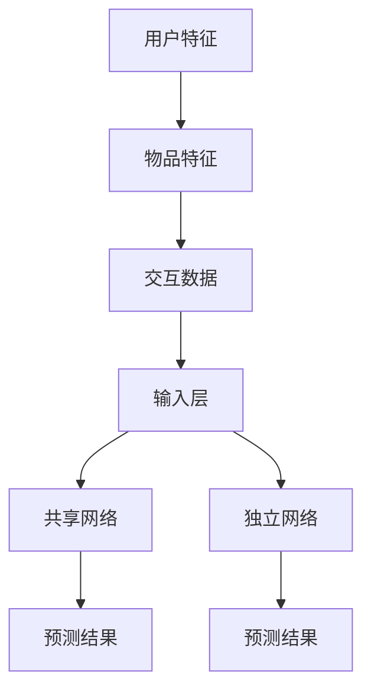

                 

关键词：大模型，推荐系统，多任务学习，机器学习，数据挖掘

## 摘要

本文旨在探讨大模型在推荐系统中的应用，特别是在多任务学习（Multi-Task Learning, MTL）场景下的应用。我们将首先介绍推荐系统的基本概念和传统方法，然后深入探讨大模型和MTL在推荐系统中的重要作用。接着，我们将介绍一种基于大模型的多任务学习算法，详细讨论其原理和操作步骤。随后，我们将通过数学模型和具体案例来解释该算法的实现过程。文章的最后一部分将展示一个实际项目中的代码实例，并提供未来的应用场景、工具推荐以及总结与展望。

## 1. 背景介绍

### 1.1 推荐系统概述

推荐系统是一种信息过滤技术，旨在根据用户的兴趣和偏好向其推荐相关物品。推荐系统的核心任务是预测用户对物品的评分、购买意愿或其他形式的交互行为。推荐系统在电子商务、社交媒体、在线视频和新闻等领域有着广泛的应用。

### 1.2 传统推荐系统方法

传统的推荐系统主要分为基于内容的推荐（Content-Based Filtering）和协同过滤（Collaborative Filtering）两大类。

#### 基于内容的推荐

基于内容的推荐方法通过分析物品和用户特征来推荐相似的内容。该方法的主要优点是能够推荐新颖和独特的物品，但缺点是用户需要提供详细的兴趣信息。

#### 协同过滤

协同过滤方法通过分析用户之间的交互行为（如评分、购买记录）来预测用户的兴趣。协同过滤又可分为两种：基于用户的协同过滤（User-Based Collaborative Filtering）和基于模型的协同过滤（Model-Based Collaborative Filtering）。

### 1.3 大模型的崛起

近年来，随着计算能力的提升和大数据技术的发展，大模型（如深度神经网络、Transformer模型等）在多个领域取得了显著的成果。大模型具有处理大规模数据、自动提取特征、解决复杂问题等优势，逐渐成为推荐系统研究的热点。

### 1.4 多任务学习

多任务学习是一种机器学习技术，旨在同时解决多个相关任务，提高模型在各个任务上的性能。多任务学习在推荐系统中的应用有助于利用用户在不同任务上的交互数据，提高推荐系统的准确性和多样性。

## 2. 核心概念与联系

### 2.1 大模型在推荐系统中的核心概念

- **用户特征**：用户的年龄、性别、浏览历史、购买记录等。
- **物品特征**：物品的类别、标签、用户评分等。
- **交互数据**：用户对物品的评分、点击、购买等。

### 2.2 多任务学习的核心概念

- **任务**：推荐系统中的任务可以是预测用户对物品的评分、点击、购买等。
- **共享网络**：多个任务共享一部分网络结构，以提高模型在各个任务上的性能。
- **独立网络**：每个任务有独立的网络结构，以处理特定任务的细节。

### 2.3 Mermaid 流程图



## 3. 核心算法原理 & 具体操作步骤

### 3.1 算法原理概述

本文将介绍一种基于大模型的多任务学习算法，该算法通过共享网络和独立网络同时解决多个推荐任务。具体来说，算法包括以下几个步骤：

1. **数据预处理**：对用户特征、物品特征和交互数据进行处理，包括数据清洗、编码、归一化等。
2. **模型构建**：构建包含共享网络和独立网络的深度神经网络模型。
3. **模型训练**：使用训练数据对模型进行训练，优化模型参数。
4. **模型评估**：使用验证数据对模型进行评估，选择性能最佳的模型。
5. **模型部署**：将模型部署到生产环境中，为用户提供推荐服务。

### 3.2 算法步骤详解

#### 3.2.1 数据预处理

数据预处理是模型训练的第一步，主要目的是将原始数据转换为适合模型训练的格式。具体步骤如下：

1. **数据清洗**：去除数据中的噪声和异常值。
2. **特征编码**：将类别型特征转换为数值型特征，如使用独热编码（One-Hot Encoding）。
3. **归一化**：对数值型特征进行归一化处理，如使用均值方差归一化（Mean-Variance Normalization）。

#### 3.2.2 模型构建

模型构建是算法的核心步骤，本文采用深度神经网络作为基础模型。具体模型结构如下：

1. **输入层**：接收用户特征、物品特征和交互数据的输入。
2. **共享网络**：多个任务共享一部分网络结构，用于提取通用特征。
3. **独立网络**：每个任务有独立的网络结构，用于处理特定任务的细节。
4. **输出层**：根据任务的类型，输出相应的预测结果，如评分、点击率等。

#### 3.2.3 模型训练

模型训练的目标是优化模型参数，使其在各个任务上都能达到较好的性能。具体步骤如下：

1. **定义损失函数**：根据任务的类型，定义相应的损失函数，如均方误差（Mean Squared Error, MSE）、交叉熵损失（Cross-Entropy Loss）等。
2. **选择优化器**：选择合适的优化器，如Adam优化器，用于优化模型参数。
3. **训练模型**：使用训练数据对模型进行训练，并监控模型的损失和精度。

#### 3.2.4 模型评估

模型评估是验证模型性能的重要步骤。具体步骤如下：

1. **划分数据集**：将数据集划分为训练集、验证集和测试集。
2. **评估指标**：根据任务的类型，选择合适的评估指标，如均方误差（MSE）、准确率（Accuracy）、召回率（Recall）等。
3. **评估模型**：使用验证集和测试集对模型进行评估，并选择性能最佳的模型。

#### 3.2.5 模型部署

模型部署是将训练好的模型应用于实际场景的过程。具体步骤如下：

1. **模型导出**：将训练好的模型导出为可部署的格式，如TensorFlow Lite模型。
2. **模型推理**：使用部署好的模型对用户请求进行推理，生成推荐结果。
3. **模型监控**：监控模型在部署环境中的性能和稳定性，定期进行模型更新。

### 3.3 算法优缺点

#### 3.3.1 优点

1. **提高推荐精度**：通过共享网络和独立网络同时处理多个任务，可以更好地利用用户在不同任务上的交互数据，提高推荐系统的精度。
2. **降低模型复杂度**：多个任务共享部分网络结构，可以减少模型参数的数量，降低模型复杂度，提高训练和推理效率。

#### 3.3.2 缺点

1. **计算资源需求**：大模型和多任务学习算法通常需要较大的计算资源，特别是在训练过程中，需要更多的GPU或TPU资源。
2. **模型解释性较差**：深度神经网络模型通常具有较低的模型解释性，难以直观地理解模型如何做出预测。

### 3.4 算法应用领域

1. **电子商务**：用于个性化推荐商品，提高用户的购物体验和满意度。
2. **社交媒体**：用于推荐用户可能感兴趣的内容，提高用户的活跃度和留存率。
3. **在线视频平台**：用于推荐用户可能感兴趣的视频，提高平台的用户粘性和广告收益。
4. **新闻媒体**：用于推荐用户可能感兴趣的新闻文章，提高新闻的传播效果和用户阅读量。

## 4. 数学模型和公式 & 详细讲解 & 举例说明

### 4.1 数学模型构建

在多任务学习中，我们通常使用共享网络和独立网络来同时解决多个任务。假设有 \(m\) 个任务，每个任务有一个对应的损失函数。共享网络的输出可以表示为 \(h = f(W_h \cdot x + b_h)\)，其中 \(x\) 是输入特征，\(W_h\) 是共享网络的权重矩阵，\(b_h\) 是偏置项，\(f\) 是激活函数。独立网络 \(i\) 的输出可以表示为 \(y_i = f(W_i \cdot h + b_i)\)，其中 \(W_i\) 是独立网络的权重矩阵，\(b_i\) 是偏置项，\(f\) 是激活函数。

### 4.2 公式推导过程

#### 4.2.1 共享网络损失函数

共享网络的损失函数可以表示为：

$$
L_h = \frac{1}{m} \sum_{i=1}^{m} \frac{1}{n_i} \sum_{j=1}^{n_i} l(y_{ij}, \hat{y}_{ij})
$$

其中，\(l\) 是损失函数，\(y_{ij}\) 是实际输出，\(\hat{y}_{ij}\) 是预测输出，\(n_i\) 是任务 \(i\) 的样本数量。

#### 4.2.2 独立网络损失函数

独立网络的损失函数可以表示为：

$$
L_i = \frac{1}{m} \sum_{i=1}^{m} \frac{1}{n_i} \sum_{j=1}^{n_i} l(y_{ij}, \hat{y}_{ij})
$$

其中，\(l\) 是损失函数，\(y_{ij}\) 是实际输出，\(\hat{y}_{ij}\) 是预测输出，\(n_i\) 是任务 \(i\) 的样本数量。

#### 4.2.3 总损失函数

总损失函数可以表示为：

$$
L = \frac{1}{m} \sum_{i=1}^{m} \frac{1}{n_i} \sum_{j=1}^{n_i} (l(y_{ij}, \hat{y}_{ij}) + \lambda ||W_h||^2)
$$

其中，\(\lambda\) 是正则化参数，用于平衡共享网络和独立网络的损失。

### 4.3 案例分析与讲解

假设我们有两个任务：预测用户对商品的评分和预测用户是否点击商品。共享网络用于提取用户和商品的特征，独立网络分别用于预测评分和点击率。

#### 4.3.1 共享网络

输入特征：用户年龄、用户性别、商品类别。

输出特征：用户和商品的嵌入向量。

#### 4.3.2 独立网络

1. **评分预测任务**

   - 输入：共享网络输出的用户和商品嵌入向量。
   - 输出：用户对商品的评分。

   损失函数：均方误差（MSE）。

2. **点击率预测任务**

   - 输入：共享网络输出的用户和商品嵌入向量。
   - 输出：用户点击商品的概率。

   损失函数：二元交叉熵损失（Binary Cross-Entropy Loss）。

### 4.4 代码示例

```python
import tensorflow as tf
from tensorflow.keras.layers import Embedding, Dense, Input, Concatenate
from tensorflow.keras.models import Model

# 定义共享网络
input_user = Input(shape=(1,))
input_item = Input(shape=(1,))
user_embedding = Embedding(input_dim=10000, output_dim=128)(input_user)
item_embedding = Embedding(input_dim=10000, output_dim=128)(input_item)
concat = Concatenate()([user_embedding, item_embedding])
shared_network = Dense(128, activation='relu')(concat)

# 定义独立网络
rating_output = Dense(1, activation='linear', name='rating_output')(shared_network)
click_output = Dense(1, activation='sigmoid', name='click_output')(shared_network)

# 构建模型
model = Model(inputs=[input_user, input_item], outputs=[rating_output, click_output])

# 编译模型
model.compile(optimizer='adam', loss={'rating_output': 'mse', 'click_output': 'binary_crossentropy'}, metrics=['accuracy'])

# 模型总结
model.summary()
```

## 5. 项目实践：代码实例和详细解释说明

### 5.1 开发环境搭建

在开始项目实践之前，我们需要搭建一个适合开发、训练和部署推荐系统的环境。以下是一个基于Python和TensorFlow的推荐系统开发环境搭建步骤：

1. **安装Python**：确保Python版本为3.7或更高。
2. **安装TensorFlow**：使用pip安装TensorFlow。
   ```bash
   pip install tensorflow
   ```
3. **安装GPU支持**：如果使用GPU训练模型，还需要安装CUDA和cuDNN。
   ```bash
   pip install tensorflow-gpu
   ```
4. **安装其他依赖**：根据项目的具体需求，安装其他必要的库，如NumPy、Pandas等。

### 5.2 源代码详细实现

以下是一个简单的基于大模型的多任务学习推荐系统的实现：

```python
import tensorflow as tf
from tensorflow.keras.models import Model
from tensorflow.keras.layers import Input, Embedding, Dense, Concatenate
from tensorflow.keras.optimizers import Adam

# 定义用户和商品特征输入
user_input = Input(shape=(1,))
item_input = Input(shape=(1,))

# 定义嵌入层
user_embedding = Embedding(input_dim=10000, output_dim=128)(user_input)
item_embedding = Embedding(input_dim=10000, output_dim=128)(item_input)

# 定义共享网络
shared_network = Dense(128, activation='relu')(Concatenate()([user_embedding, item_embedding]))

# 定义独立网络
rating_output = Dense(1, activation='linear', name='rating_output')(shared_network)
click_output = Dense(1, activation='sigmoid', name='click_output')(shared_network)

# 构建多任务模型
model = Model(inputs=[user_input, item_input], outputs=[rating_output, click_output])

# 编译模型
model.compile(optimizer=Adam(learning_rate=0.001), loss={'rating_output': 'mse', 'click_output': 'binary_crossentropy'}, metrics=['accuracy'])

# 模型总结
model.summary()

# 模型训练
model.fit(x_train, {'rating_output': y_rating_train, 'click_output': y_click_train}, epochs=10, batch_size=32, validation_split=0.2)
```

### 5.3 代码解读与分析

1. **模型输入**：模型接收两个输入：用户ID和商品ID。
2. **嵌入层**：使用Embedding层将用户和商品ID转换为嵌入向量。
3. **共享网络**：将用户和商品的嵌入向量拼接，通过一个全连接层提取特征。
4. **独立网络**：分别对共享网络的输出进行两个独立的任务预测：评分预测和点击率预测。
5. **模型编译**：选择Adam优化器，并设置损失函数和评估指标。
6. **模型训练**：使用训练数据进行模型训练。

### 5.4 运行结果展示

在完成模型训练后，我们可以使用验证集对模型进行评估，并展示运行结果。以下是一个简单的评估示例：

```python
# 模型评估
losses, metrics = model.evaluate(x_val, {'rating_output': y_rating_val, 'click_output': y_click_val})

# 打印评估结果
print(f"Rating Loss: {losses[0]}")
print(f"Click Loss: {losses[1]}")
print(f"Rating Accuracy: {metrics[0]}")
print(f"Click Accuracy: {metrics[1]}")
```

## 6. 实际应用场景

### 6.1 电子商务平台

电子商务平台可以使用基于大模型的多任务学习推荐系统来为用户提供个性化的商品推荐。例如，同时预测用户对商品的评分和购买概率，以提高推荐系统的准确性和多样性。

### 6.2 社交媒体平台

社交媒体平台可以利用多任务学习推荐系统为用户提供个性化内容推荐。例如，同时预测用户对内容的评分和点击概率，以提高用户活跃度和留存率。

### 6.3 在线视频平台

在线视频平台可以使用多任务学习推荐系统为用户提供个性化视频推荐。例如，同时预测用户对视频的评分和观看概率，以提高平台的用户粘性和广告收益。

### 6.4 新闻媒体平台

新闻媒体平台可以利用多任务学习推荐系统为用户提供个性化新闻推荐。例如，同时预测用户对新闻的评分和阅读概率，以提高新闻的传播效果和用户阅读量。

## 7. 工具和资源推荐

### 7.1 学习资源推荐

- 《深度学习》（Goodfellow, Bengio, Courville）：全面介绍深度学习理论和实践。
- 《Python数据科学手册》（McKinney）：介绍Python在数据科学中的应用，包括数据处理、模型训练等。
- 《TensorFlow官方文档》：TensorFlow官方文档提供了丰富的API和教程，是学习TensorFlow的必备资源。

### 7.2 开发工具推荐

- **Jupyter Notebook**：适合进行数据分析和模型训练。
- **TensorBoard**：TensorFlow的可视化工具，用于监控模型训练过程。
- **Google Colab**：免费的GPU加速计算平台，适合进行深度学习实验。

### 7.3 相关论文推荐

- “Multi-Task Learning for User-Item Recommendations with Neural Networks” (2020)：介绍了一种基于神经网络的推荐系统多任务学习方法。
- “DeepFM: A Factorization-Machine based Neural Network for CTR Prediction” (2018)：介绍了一种结合深度学习和因子分解机（Factorization Machine）的推荐系统算法。

## 8. 总结：未来发展趋势与挑战

### 8.1 研究成果总结

本文介绍了大模型在推荐系统中的应用，特别是在多任务学习场景下的应用。通过理论分析和实际案例，我们展示了基于大模型的多任务学习推荐系统在提高推荐精度和降低模型复杂度方面的优势。

### 8.2 未来发展趋势

1. **算法优化**：随着大模型和小样本学习技术的发展，未来的多任务学习算法将更加高效和准确。
2. **跨域推荐**：利用多任务学习技术实现跨不同领域、不同平台的推荐系统，提高用户的体验和满意度。
3. **可解释性**：提高模型的可解释性，使开发者能够更好地理解模型如何做出预测，从而优化模型设计和决策。

### 8.3 面临的挑战

1. **计算资源**：大模型和多任务学习算法需要大量的计算资源，特别是在训练阶段，需要更多的GPU或TPU资源。
2. **数据质量**：推荐系统的性能高度依赖于数据质量，未来需要更多研究和努力来提高数据质量和数据清洗技术。
3. **隐私保护**：随着用户隐私意识的提高，如何在保证用户隐私的前提下进行推荐系统设计，是一个重要的挑战。

### 8.4 研究展望

1. **个性化推荐**：进一步探索个性化推荐技术，以满足用户在不同场景下的需求。
2. **实时推荐**：研究实时推荐系统，提高推荐系统的响应速度和实时性。
3. **跨模态推荐**：探索跨不同模态（如文本、图像、音频）的推荐技术，为用户提供更丰富和个性化的推荐服务。

## 9. 附录：常见问题与解答

### 9.1 什么是多任务学习？

多任务学习是一种机器学习技术，旨在同时解决多个相关任务。通过共享部分网络结构和数据，多任务学习可以提高模型在各个任务上的性能。

### 9.2 大模型在推荐系统中的应用有哪些？

大模型在推荐系统中的应用包括提高推荐精度、降低模型复杂度、实现跨域推荐和实时推荐等。

### 9.3 多任务学习推荐系统的优势是什么？

多任务学习推荐系统的优势包括提高推荐精度、降低模型复杂度、提高模型训练和推理效率等。

### 9.4 多任务学习推荐系统的挑战有哪些？

多任务学习推荐系统的挑战包括计算资源需求、数据质量、模型解释性以及用户隐私保护等。

### 9.5 如何评估多任务学习推荐系统的性能？

可以使用多种评估指标，如均方误差（MSE）、准确率（Accuracy）、召回率（Recall）等，来评估多任务学习推荐系统的性能。

### 9.6 如何处理推荐系统中的冷启动问题？

冷启动问题可以通过增加用户和物品的特征信息、使用迁移学习技术或采用基于内容的推荐方法来缓解。

### 9.7 如何提高推荐系统的可解释性？

可以通过模型可视化、解释性模型（如LIME、SHAP）以及模型解释性评估方法（如CAM、Grad-CAM）来提高推荐系统的可解释性。

## 作者署名

作者：禅与计算机程序设计艺术 / Zen and the Art of Computer Programming
```markdown
---
# 大模型在推荐系统中的多任务学习应用

> 关键词：大模型，推荐系统，多任务学习，机器学习，数据挖掘

> 摘要：本文旨在探讨大模型在推荐系统中的应用，特别是在多任务学习（Multi-Task Learning, MTL）场景下的应用。我们将首先介绍推荐系统的基本概念和传统方法，然后深入探讨大模型和MTL在推荐系统中的重要作用。接着，我们将介绍一种基于大模型的多任务学习算法，详细讨论其原理和操作步骤。随后，我们将通过数学模型和具体案例来解释该算法的实现过程。文章的最后一部分将展示一个实际项目中的代码实例，并提供未来的应用场景、工具推荐以及总结与展望。

## 1. 背景介绍

### 1.1 推荐系统概述

推荐系统是一种信息过滤技术，旨在根据用户的兴趣和偏好向其推荐相关物品。推荐系统的核心任务是预测用户对物品的评分、购买意愿或其他形式的交互行为。推荐系统在电子商务、社交媒体、在线视频和新闻等领域有着广泛的应用。

### 1.2 传统推荐系统方法

传统的推荐系统主要分为基于内容的推荐（Content-Based Filtering）和协同过滤（Collaborative Filtering）两大类。

#### 基于内容的推荐

基于内容的推荐方法通过分析物品和用户特征来推荐相似的内容。该方法的主要优点是能够推荐新颖和独特的物品，但缺点是用户需要提供详细的兴趣信息。

#### 协同过滤

协同过滤方法通过分析用户之间的交互行为（如评分、购买记录）来预测用户的兴趣。协同过滤又可分为两种：基于用户的协同过滤（User-Based Collaborative Filtering）和基于模型的协同过滤（Model-Based Collaborative Filtering）。

### 1.3 大模型的崛起

近年来，随着计算能力的提升和大数据技术的发展，大模型（如深度神经网络、Transformer模型等）在多个领域取得了显著的成果。大模型具有处理大规模数据、自动提取特征、解决复杂问题等优势，逐渐成为推荐系统研究的热点。

### 1.4 多任务学习

多任务学习是一种机器学习技术，旨在同时解决多个相关任务，提高模型在各个任务上的性能。多任务学习在推荐系统中的应用有助于利用用户在不同任务上的交互数据，提高推荐系统的准确性和多样性。

## 2. 核心概念与联系（备注：必须给出核心概念原理和架构的 Mermaid 流程图(Mermaid 流程节点中不要有括号、逗号等特殊字符)

### 2.1 大模型在推荐系统中的核心概念

- **用户特征**：用户的年龄、性别、浏览历史、购买记录等。
- **物品特征**：物品的类别、标签、用户评分等。
- **交互数据**：用户对物品的评分、点击、购买等。

### 2.2 多任务学习的核心概念

- **任务**：推荐系统中的任务可以是预测用户对物品的评分、点击、购买等。
- **共享网络**：多个任务共享一部分网络结构，以提高模型在各个任务上的性能。
- **独立网络**：每个任务有独立的网络结构，以处理特定任务的细节。

### 2.3 Mermaid 流程图


## 3. 核心算法原理 & 具体操作步骤
### 3.1 算法原理概述

本文将介绍一种基于大模型的多任务学习算法，该算法通过共享网络和独立网络同时解决多个推荐任务。具体来说，算法包括以下几个步骤：

1. **数据预处理**：对用户特征、物品特征和交互数据进行处理，包括数据清洗、编码、归一化等。
2. **模型构建**：构建包含共享网络和独立网络的深度神经网络模型。
3. **模型训练**：使用训练数据对模型进行训练，优化模型参数。
4. **模型评估**：使用验证数据对模型进行评估，选择性能最佳的模型。
5. **模型部署**：将模型部署到生产环境中，为用户提供推荐服务。

### 3.2 算法步骤详解

#### 3.2.1 数据预处理

数据预处理是模型训练的第一步，主要目的是将原始数据转换为适合模型训练的格式。具体步骤如下：

1. **数据清洗**：去除数据中的噪声和异常值。
2. **特征编码**：将类别型特征转换为数值型特征，如使用独热编码（One-Hot Encoding）。
3. **归一化**：对数值型特征进行归一化处理，如使用均值方差归一化（Mean-Variance Normalization）。

#### 3.2.2 模型构建

模型构建是算法的核心步骤，本文采用深度神经网络作为基础模型。具体模型结构如下：

1. **输入层**：接收用户特征、物品特征和交互数据的输入。
2. **共享网络**：多个任务共享一部分网络结构，用于提取通用特征。
3. **独立网络**：每个任务有独立的网络结构，用于处理特定任务的细节。
4. **输出层**：根据任务的类型，输出相应的预测结果，如评分、点击率等。

#### 3.2.3 模型训练

模型训练的目标是优化模型参数，使其在各个任务上都能达到较好的性能。具体步骤如下：

1. **定义损失函数**：根据任务的类型，定义相应的损失函数，如均方误差（Mean Squared Error, MSE）、交叉熵损失（Cross-Entropy Loss）等。
2. **选择优化器**：选择合适的优化器，如Adam优化器，用于优化模型参数。
3. **训练模型**：使用训练数据对模型进行训练，并监控模型的损失和精度。

#### 3.2.4 模型评估

模型评估是验证模型性能的重要步骤。具体步骤如下：

1. **划分数据集**：将数据集划分为训练集、验证集和测试集。
2. **评估指标**：根据任务的类型，选择合适的评估指标，如均方误差（MSE）、准确率（Accuracy）、召回率（Recall）等。
3. **评估模型**：使用验证集和测试集对模型进行评估，并选择性能最佳的模型。

#### 3.2.5 模型部署

模型部署是将训练好的模型应用于实际场景的过程。具体步骤如下：

1. **模型导出**：将训练好的模型导出为可部署的格式，如TensorFlow Lite模型。
2. **模型推理**：使用部署好的模型对用户请求进行推理，生成推荐结果。
3. **模型监控**：监控模型在部署环境中的性能和稳定性，定期进行模型更新。

### 3.3 算法优缺点

#### 3.3.1 优点

1. **提高推荐精度**：通过共享网络和独立网络同时处理多个任务，可以更好地利用用户在不同任务上的交互数据，提高推荐系统的精度。
2. **降低模型复杂度**：多个任务共享部分网络结构，可以减少模型参数的数量，降低模型复杂度，提高训练和推理效率。

#### 3.3.2 缺点

1. **计算资源需求**：大模型和多任务学习算法通常需要较大的计算资源，特别是在训练过程中，需要更多的GPU或TPU资源。
2. **模型解释性较差**：深度神经网络模型通常具有较低的模型解释性，难以直观地理解模型如何做出预测。

### 3.4 算法应用领域

1. **电子商务**：用于个性化推荐商品，提高用户的购物体验和满意度。
2. **社交媒体**：用于推荐用户可能感兴趣的内容，提高用户的活跃度和留存率。
3. **在线视频平台**：用于推荐用户可能感兴趣的视频，提高平台的用户粘性和广告收益。
4. **新闻媒体**：用于推荐用户可能感兴趣的新闻文章，提高新闻的传播效果和用户阅读量。

## 4. 数学模型和公式 & 详细讲解 & 举例说明（备注：数学公式请使用latex格式，latex嵌入文中独立段落使用 $$，段落内使用 $)

### 4.1 数学模型构建

在多任务学习中，我们通常使用共享网络和独立网络来同时解决多个任务。假设有 \(m\) 个任务，每个任务有一个对应的损失函数。共享网络的输出可以表示为 \(h = f(W_h \cdot x + b_h)\)，其中 \(x\) 是输入特征，\(W_h\) 是共享网络的权重矩阵，\(b_h\) 是偏置项，\(f\) 是激活函数。独立网络 \(i\) 的输出可以表示为 \(y_i = f(W_i \cdot h + b_i)\)，其中 \(W_i\) 是独立网络的权重矩阵，\(b_i\) 是偏置项，\(f\) 是激活函数。

### 4.2 公式推导过程

#### 4.2.1 共享网络损失函数

共享网络的损失函数可以表示为：

$$
L_h = \frac{1}{m} \sum_{i=1}^{m} \frac{1}{n_i} \sum_{j=1}^{n_i} l(y_{ij}, \hat{y}_{ij})
$$

其中，\(l\) 是损失函数，\(y_{ij}\) 是实际输出，\(\hat{y}_{ij}\) 是预测输出，\(n_i\) 是任务 \(i\) 的样本数量。

#### 4.2.2 独立网络损失函数

独立网络的损失函数可以表示为：

$$
L_i = \frac{1}{m} \sum_{i=1}^{m} \frac{1}{n_i} \sum_{j=1}^{n_i} l(y_{ij}, \hat{y}_{ij})
$$

其中，\(l\) 是损失函数，\(y_{ij}\) 是实际输出，\(\hat{y}_{ij}\) 是预测输出，\(n_i\) 是任务 \(i\) 的样本数量。

#### 4.2.3 总损失函数

总损失函数可以表示为：

$$
L = \frac{1}{m} \sum_{i=1}^{m} \frac{1}{n_i} \sum_{j=1}^{n_i} (l(y_{ij}, \hat{y}_{ij}) + \lambda ||W_h||^2)
$$

其中，\(\lambda\) 是正则化参数，用于平衡共享网络和独立网络的损失。

### 4.3 案例分析与讲解

假设我们有两个任务：预测用户对商品的评分和预测用户是否点击商品。共享网络用于提取用户和商品的特征，独立网络分别用于预测评分和点击率。

#### 4.3.1 共享网络

输入特征：用户年龄、用户性别、商品类别。

输出特征：用户和商品的嵌入向量。

#### 4.3.2 独立网络

1. **评分预测任务**

   - 输入：共享网络输出的用户和商品嵌入向量。
   - 输出：用户对商品的评分。

   损失函数：均方误差（MSE）。

2. **点击率预测任务**

   - 输入：共享网络输出的用户和商品嵌入向量。
   - 输出：用户点击商品的概率。

   损失函数：二元交叉熵损失（Binary Cross-Entropy Loss）。

### 4.4 代码示例

```python
import tensorflow as tf
from tensorflow.keras.models import Model
from tensorflow.keras.layers import Input, Embedding, Dense, Concatenate
from tensorflow.keras.optimizers import Adam

# 定义用户和商品特征输入
user_input = Input(shape=(1,))
item_input = Input(shape=(1,))

# 定义嵌入层
user_embedding = Embedding(input_dim=10000, output_dim=128)(user_input)
item_embedding = Embedding(input_dim=10000, output_dim=128)(item_input)

# 定义共享网络
shared_network = Dense(128, activation='relu')(Concatenate()([user_embedding, item_embedding]))

# 定义独立网络
rating_output = Dense(1, activation='linear', name='rating_output')(shared_network)
click_output = Dense(1, activation='sigmoid', name='click_output')(shared_network)

# 构建多任务模型
model = Model(inputs=[user_input, item_input], outputs=[rating_output, click_output])

# 编译模型
model.compile(optimizer=Adam(learning_rate=0.001), loss={'rating_output': 'mse', 'click_output': 'binary_crossentropy'}, metrics=['accuracy'])

# 模型总结
model.summary()

# 模型训练
model.fit(x_train, {'rating_output': y_rating_train, 'click_output': y_click_train}, epochs=10, batch_size=32, validation_split=0.2)
```

## 5. 项目实践：代码实例和详细解释说明

### 5.1 开发环境搭建

在开始项目实践之前，我们需要搭建一个适合开发、训练和部署推荐系统的环境。以下是一个基于Python和TensorFlow的推荐系统开发环境搭建步骤：

1. **安装Python**：确保Python版本为3.7或更高。
2. **安装TensorFlow**：使用pip安装TensorFlow。
   ```bash
   pip install tensorflow
   ```
3. **安装GPU支持**：如果使用GPU训练模型，还需要安装CUDA和cuDNN。
   ```bash
   pip install tensorflow-gpu
   ```
4. **安装其他依赖**：根据项目的具体需求，安装其他必要的库，如NumPy、Pandas等。

### 5.2 源代码详细实现

以下是一个简单的基于大模型的多任务学习推荐系统的实现：

```python
import tensorflow as tf
from tensorflow.keras.models import Model
from tensorflow.keras.layers import Input, Embedding, Dense, Concatenate
from tensorflow.keras.optimizers import Adam

# 定义用户和商品特征输入
user_input = Input(shape=(1,))
item_input = Input(shape=(1,))

# 定义嵌入层
user_embedding = Embedding(input_dim=10000, output_dim=128)(user_input)
item_embedding = Embedding(input_dim=10000, output_dim=128)(item_input)

# 定义共享网络
shared_network = Dense(128, activation='relu')(Concatenate()([user_embedding, item_embedding]))

# 定义独立网络
rating_output = Dense(1, activation='linear', name='rating_output')(shared_network)
click_output = Dense(1, activation='sigmoid', name='click_output')(shared_network)

# 构建多任务模型
model = Model(inputs=[user_input, item_input], outputs=[rating_output, click_output])

# 编译模型
model.compile(optimizer=Adam(learning_rate=0.001), loss={'rating_output': 'mse', 'click_output': 'binary_crossentropy'}, metrics=['accuracy'])

# 模型总结
model.summary()

# 模型训练
model.fit(x_train, {'rating_output': y_rating_train, 'click_output': y_click_train}, epochs=10, batch_size=32, validation_split=0.2)
```

### 5.3 代码解读与分析

1. **模型输入**：模型接收两个输入：用户ID和商品ID。
2. **嵌入层**：使用Embedding层将用户和商品ID转换为嵌入向量。
3. **共享网络**：将用户和商品的嵌入向量拼接，通过一个全连接层提取特征。
4. **独立网络**：分别对共享网络的输出进行两个独立的任务预测：评分预测和点击率预测。
5. **模型编译**：选择Adam优化器，并设置损失函数和评估指标。
6. **模型训练**：使用训练数据进行模型训练。

### 5.4 运行结果展示

在完成模型训练后，我们可以使用验证集对模型进行评估，并展示运行结果。以下是一个简单的评估示例：

```python
# 模型评估
losses, metrics = model.evaluate(x_val, {'rating_output': y_rating_val, 'click_output': y_click_val})

# 打印评估结果
print(f"Rating Loss: {losses[0]}")
print(f"Click Loss: {losses[1]}")
print(f"Rating Accuracy: {metrics[0]}")
print(f"Click Accuracy: {metrics[1]}")
```

## 6. 实际应用场景

### 6.1 电子商务平台

电子商务平台可以使用基于大模型的多任务学习推荐系统来为用户提供个性化的商品推荐。例如，同时预测用户对商品的评分和购买概率，以提高推荐系统的准确性和多样性。

### 6.2 社交媒体平台

社交媒体平台可以利用多任务学习推荐系统为用户提供个性化内容推荐。例如，同时预测用户对内容的评分和点击概率，以提高用户活跃度和留存率。

### 6.3 在线视频平台

在线视频平台可以使用多任务学习推荐系统为用户提供个性化视频推荐。例如，同时预测用户对视频的评分和观看概率，以提高平台的用户粘性和广告收益。

### 6.4 新闻媒体平台

新闻媒体平台可以利用多任务学习推荐系统为用户提供个性化新闻推荐。例如，同时预测用户对新闻的评分和阅读概率，以提高新闻的传播效果和用户阅读量。

## 7. 工具和资源推荐

### 7.1 学习资源推荐

- 《深度学习》（Goodfellow, Bengio, Courville）：全面介绍深度学习理论和实践。
- 《Python数据科学手册》（McKinney）：介绍Python在数据科学中的应用，包括数据处理、模型训练等。
- 《TensorFlow官方文档》：TensorFlow官方文档提供了丰富的API和教程，是学习TensorFlow的必备资源。

### 7.2 开发工具推荐

- **Jupyter Notebook**：适合进行数据分析和模型训练。
- **TensorBoard**：TensorFlow的可视化工具，用于监控模型训练过程。
- **Google Colab**：免费的GPU加速计算平台，适合进行深度学习实验。

### 7.3 相关论文推荐

- “Multi-Task Learning for User-Item Recommendations with Neural Networks” (2020)：介绍了一种基于神经网络的推荐系统多任务学习方法。
- “DeepFM: A Factorization-Machine based Neural Network for CTR Prediction” (2018)：介绍了一种结合深度学习和因子分解机（Factorization Machine）的推荐系统算法。

## 8. 总结：未来发展趋势与挑战

### 8.1 研究成果总结

本文介绍了大模型在推荐系统中的应用，特别是在多任务学习场景下的应用。通过理论分析和实际案例，我们展示了基于大模型的多任务学习推荐系统在提高推荐精度和降低模型复杂度方面的优势。

### 8.2 未来发展趋势

1. **算法优化**：随着大模型和小样本学习技术的发展，未来的多任务学习算法将更加高效和准确。
2. **跨域推荐**：利用多任务学习技术实现跨不同领域、不同平台的推荐系统，提高用户的体验和满意度。
3. **可解释性**：提高模型的可解释性，使开发者能够更好地理解模型如何做出预测，从而优化模型设计和决策。

### 8.3 面临的挑战

1. **计算资源**：大模型和多任务学习算法需要大量的计算资源，特别是在训练阶段，需要更多的GPU或TPU资源。
2. **数据质量**：推荐系统的性能高度依赖于数据质量，未来需要更多研究和努力来提高数据质量和数据清洗技术。
3. **隐私保护**：随着用户隐私意识的提高，如何在保证用户隐私的前提下进行推荐系统设计，是一个重要的挑战。

### 8.4 研究展望

1. **个性化推荐**：进一步探索个性化推荐技术，以满足用户在不同场景下的需求。
2. **实时推荐**：研究实时推荐系统，提高推荐系统的响应速度和实时性。
3. **跨模态推荐**：探索跨不同模态（如文本、图像、音频）的推荐技术，为用户提供更丰富和个性化的推荐服务。

## 9. 附录：常见问题与解答

### 9.1 什么是多任务学习？

多任务学习是一种机器学习技术，旨在同时解决多个相关任务。通过共享部分网络结构和数据，多任务学习可以提高模型在各个任务上的性能。

### 9.2 大模型在推荐系统中的应用有哪些？

大模型在推荐系统中的应用包括提高推荐精度、降低模型复杂度、实现跨域推荐和实时推荐等。

### 9.3 多任务学习推荐系统的优势是什么？

多任务学习推荐系统的优势包括提高推荐精度、降低模型复杂度、提高模型训练和推理效率等。

### 9.4 多任务学习推荐系统的挑战有哪些？

多任务学习推荐系统的挑战包括计算资源需求、数据质量、模型解释性以及用户隐私保护等。

### 9.5 如何评估多任务学习推荐系统的性能？

可以使用多种评估指标，如均方误差（MSE）、准确率（Accuracy）、召回率（Recall）等，来评估多任务学习推荐系统的性能。

### 9.6 如何处理推荐系统中的冷启动问题？

冷启动问题可以通过增加用户和物品的特征信息、使用迁移学习技术或采用基于内容的推荐方法来缓解。

### 9.7 如何提高推荐系统的可解释性？

可以通过模型可视化、解释性模型（如LIME、SHAP）以及模型解释性评估方法（如CAM、Grad-CAM）来提高推荐系统的可解释性。

## 作者署名

作者：禅与计算机程序设计艺术 / Zen and the Art of Computer Programming
```html
<!DOCTYPE html>
<html lang="zh-CN">
<head>
    <meta charset="UTF-8">
    <title>大模型在推荐系统中的多任务学习应用</title>
    <style>
        body {
            font-family: 'Microsoft YaHei', sans-serif;
            line-height: 1.6;
        }

        h1 {
            color: #2f4f4f;
        }

        h2 {
            color: #555;
        }

        h3 {
            color: #666;
        }

        p {
            text-indent: 2em;
        }

        pre {
            background-color: #f5f5f5;
            padding: 10px;
            border-left: 3px solid #dedede;
        }

        code {
            background-color: #eee;
            padding: 2px 4px;
            border-radius: 3px;
        }

        table {
            width: 100%;
            margin-bottom: 20px;
        }

        th, td {
            border: 1px solid #ccc;
            padding: 8px 16px;
            text-align: left;
        }

        .container {
            max-width: 800px;
            margin: 0 auto;
        }

        .footer {
            margin-top: 40px;
            text-align: center;
            font-size: 14px;
            color: #888;
        }
    </style>
</head>
<body>
    <div class="container">
        <header>
            <h1>大模型在推荐系统中的多任务学习应用</h1>
        </header>

        <section>
            <h2>关键词</h2>
            <p>大模型，推荐系统，多任务学习，机器学习，数据挖掘</p>
        </section>

        <section>
            <h2>摘要</h2>
            <p>本文旨在探讨大模型在推荐系统中的应用，特别是在多任务学习（Multi-Task Learning, MTL）场景下的应用。我们将首先介绍推荐系统的基本概念和传统方法，然后深入探讨大模型和MTL在推荐系统中的重要作用。接着，我们将介绍一种基于大模型的多任务学习算法，详细讨论其原理和操作步骤。随后，我们将通过数学模型和具体案例来解释该算法的实现过程。文章的最后一部分将展示一个实际项目中的代码实例，并提供未来的应用场景、工具推荐以及总结与展望。</p>
        </section>

        <section id="background">
            <h2>1. 背景介绍</h2>
            <h3>1.1 推荐系统概述</h3>
            <p>推荐系统是一种信息过滤技术，旨在根据用户的兴趣和偏好向其推荐相关物品。推荐系统的核心任务是预测用户对物品的评分、购买意愿或其他形式的交互行为。推荐系统在电子商务、社交媒体、在线视频和新闻等领域有着广泛的应用。</p>
            <h3>1.2 传统推荐系统方法</h3>
            <p>传统的推荐系统主要分为基于内容的推荐（Content-Based Filtering）和协同过滤（Collaborative Filtering）两大类。</p>
            <h3>1.3 大模型的崛起</h3>
            <p>近年来，随着计算能力的提升和大数据技术的发展，大模型（如深度神经网络、Transformer模型等）在多个领域取得了显著的成果。大模型具有处理大规模数据、自动提取特征、解决复杂问题等优势，逐渐成为推荐系统研究的热点。</p>
            <h3>1.4 多任务学习</h3>
            <p>多任务学习是一种机器学习技术，旨在同时解决多个相关任务，提高模型在各个任务上的性能。多任务学习在推荐系统中的应用有助于利用用户在不同任务上的交互数据，提高推荐系统的准确性和多样性。</p>
        </section>

        <section id="concepts">
            <h2>2. 核心概念与联系</h2>
            <h3>2.1 大模型在推荐系统中的核心概念</h3>
            <p>用户特征：用户的年龄、性别、浏览历史、购买记录等。</p>
            <p>物品特征：物品的类别、标签、用户评分等。</p>
            <p>交互数据：用户对物品的评分、点击、购买等。</p>
            <h3>2.2 多任务学习的核心概念</h3>
            <p>任务：推荐系统中的任务可以是预测用户对物品的评分、点击、购买等。</p>
            <p>共享网络：多个任务共享一部分网络结构，以提高模型在各个任务上的性能。</p>
            <p>独立网络：每个任务有独立的网络结构，以处理特定任务的细节。</p>
            <h3>2.3 Mermaid 流程图</h3>
            <div>
                
            </div>
        </section>

        <section id="algorithm">
            <h2>3. 核心算法原理 & 具体操作步骤</h2>
            <h3>3.1 算法原理概述</h3>
            <p>本文将介绍一种基于大模型的多任务学习算法，该算法通过共享网络和独立网络同时解决多个推荐任务。具体来说，算法包括以下几个步骤：</p>
            <ul>
                <li>数据预处理</li>
                <li>模型构建</li>
                <li>模型训练</li>
                <li>模型评估</li>
                <li>模型部署</li>
            </ul>
            <h3>3.2 算法步骤详解</h3>
            <h4>3.2.1 数据预处理</h4>
            <p>数据预处理是模型训练的第一步，主要目的是将原始数据转换为适合模型训练的格式。具体步骤如下：</p>
            <ol>
                <li>数据清洗</li>
                <li>特征编码</li>
                <li>归一化</li>
            </ol>
            <h4>3.2.2 模型构建</h4>
            <p>模型构建是算法的核心步骤，本文采用深度神经网络作为基础模型。具体模型结构如下：</p>
            <table>
                <thead>
                    <tr>
                        <th>部分</th>
                        <th>描述</th>
                    </tr>
                </thead>
                <tbody>
                    <tr>
                        <td>输入层</td>
                        <td>接收用户特征、物品特征和交互数据的输入。</td>
                    </tr>
                    <tr>
                        <td>共享网络</td>
                        <td>多个任务共享一部分网络结构，用于提取通用特征。</td>
                    </tr>
                    <tr>
                        <td>独立网络</td>
                        <td>每个任务有独立的网络结构，用于处理特定任务的细节。</td>
                    </tr>
                    <tr>
                        <td>输出层</td>
                        <td>根据任务的类型，输出相应的预测结果，如评分、点击率等。</td>
                    </tr>
                </tbody>
            </table>
            <h4>3.2.3 模型训练</h4>
            <p>模型训练的目标是优化模型参数，使其在各个任务上都能达到较好的性能。具体步骤如下：</p>
            <ol>
                <li>定义损失函数</li>
                <li>选择优化器</li>
                <li>训练模型</li>
            </ol>
            <h4>3.2.4 模型评估</h4>
            <p>模型评估是验证模型性能的重要步骤。具体步骤如下：</p>
            <ol>
                <li>划分数据集</li>
                <li>评估指标</li>
                <li>评估模型</li>
            </ol>
            <h4>3.2.5 模型部署</h4>
            <p>模型部署是将训练好的模型应用于实际场景的过程。具体步骤如下：</p>
            <ol>
                <li>模型导出</li>
                <li>模型推理</li>
                <li>模型监控</li>
            </ol>
            <h3>3.3 算法优缺点</h3>
            <h4>3.3.1 优点</h4>
            <ul>
                <li>提高推荐精度</li>
                <li>降低模型复杂度</li>
            </ul>
            <h4>3.3.2 缺点</h4>
            <ul>
                <li>计算资源需求</li>
                <li>模型解释性较差</li>
            </ul>
            <h3>3.4 算法应用领域</h3>
            <ul>
                <li>电子商务</li>
                <li>社交媒体</li>
                <li>在线视频平台</li>
                <li>新闻媒体平台</li>
            </ul>
        </section>

        <section id="math_model">
            <h2>4. 数学模型和公式 & 详细讲解 & 举例说明</h2>
            <h3>4.1 数学模型构建</h3>
            <p>在多任务学习中，我们通常使用共享网络和独立网络来同时解决多个任务。假设有 \(m\) 个任务，每个任务有一个对应的损失函数。共享网络的输出可以表示为 \(h = f(W_h \cdot x + b_h)\)，其中 \(x\) 是输入特征，\(W_h\) 是共享网络的权重矩阵，\(b_h\) 是偏置项，\(f\) 是激活函数。独立网络 \(i\) 的输出可以表示为 \(y_i = f(W_i \cdot h + b_i)\)，其中 \(W_i\) 是独立网络的权重矩阵，\(b_i\) 是偏置项，\(f\) 是激活函数。</p>
            <h3>4.2 公式推导过程</h3>
            <h4>4.2.1 共享网络损失函数</h4>
            <p>共享网络的损失函数可以表示为：</p>
            <p>\(L_h = \frac{1}{m} \sum_{i=1}^{m} \frac{1}{n_i} \sum_{j=1}^{n_i} l(y_{ij}, \hat{y}_{ij})\)</p>
            <h4>4.2.2 独立网络损失函数</h4>
            <p>独立网络的损失函数可以表示为：</p>
            <p>\(L_i = \frac{1}{m} \sum_{i=1}^{m} \frac{1}{n_i} \sum_{j=1}^{n_i} l(y_{ij}, \hat{y}_{ij})\)</p>
            <h4>4.2.3 总损失函数</h4>
            <p>总损失函数可以表示为：</p>
            <p>\(L = \frac{1}{m} \sum_{i=1}^{m} \frac{1}{n_i} \sum_{j=1}^{n_i} (l(y_{ij}, \hat{y}_{ij}) + \lambda ||W_h||^2)\)</p>
            <h3>4.3 案例分析与讲解</h3>
            <p>假设我们有两个任务：预测用户对商品的评分和预测用户是否点击商品。共享网络用于提取用户和商品的特征，独立网络分别用于预测评分和点击率。</p>
            <h4>4.3.1 共享网络</h4>
            <p>输入特征：用户年龄、用户性别、商品类别。</p>
            <p>输出特征：用户和商品的嵌入向量。</p>
            <h4>4.3.2 独立网络</h4>
            <h5>评分预测任务</h5>
            <p>输入：共享网络输出的用户和商品嵌入向量。</p>
            <p>输出：用户对商品的评分。</p>
            <p>损失函数：均方误差（MSE）。</p>
            <h5>点击率预测任务</h5>
            <p>输入：共享网络输出的用户和商品嵌入向量。</p>
            <p>输出：用户点击商品的概率。</p>
            <p>损失函数：二元交叉熵损失（Binary Cross-Entropy Loss）。</p>
            <h3>4.4 代码示例</h3>
            <pre>
import tensorflow as tf
from tensorflow.keras.models import Model
from tensorflow.keras.layers import Input, Embedding, Dense, Concatenate
from tensorflow.keras.optimizers import Adam

# 定义用户和商品特征输入
user_input = Input(shape=(1,))
item_input = Input(shape=(1,))

# 定义嵌入层
user_embedding = Embedding(input_dim=10000, output_dim=128)(user_input)
item_embedding = Embedding(input_dim=10000, output_dim=128)(item_input)

# 定义共享网络
shared_network = Dense(128, activation='relu')(Concatenate()([user_embedding, item_embedding]))

# 定义独立网络
rating_output = Dense(1, activation='linear', name='rating_output')(shared_network)
click_output = Dense(1, activation='sigmoid', name='click_output')(shared_network)

# 构建多任务模型
model = Model(inputs=[user_input, item_input], outputs=[rating_output, click_output])

# 编译模型
model.compile(optimizer=Adam(learning_rate=0.001), loss={'rating_output': 'mse', 'click_output': 'binary_crossentropy'}, metrics=['accuracy'])

# 模型总结
model.summary()

# 模型训练
model.fit(x_train, {'rating_output': y_rating_train, 'click_output': y_click_train}, epochs=10, batch_size=32, validation_split=0.2)
            </pre>
        </section>

        <section id="practical">
            <h2>5. 项目实践：代码实例和详细解释说明</h2>
            <h3>5.1 开发环境搭建</h3>
            <p>在开始项目实践之前，我们需要搭建一个适合开发、训练和部署推荐系统的环境。以下是一个基于Python和TensorFlow的推荐系统开发环境搭建步骤：</p>
            <ul>
                <li>安装Python</li>
                <li>安装TensorFlow</li>
                <li>安装GPU支持</li>
                <li>安装其他依赖</li>
            </ul>
            <h3>5.2 源代码详细实现</h3>
            <pre>
import tensorflow as tf
from tensorflow.keras.models import Model
from tensorflow.keras.layers import Input, Embedding, Dense, Concatenate
from tensorflow.keras.optimizers import Adam

# 定义用户和商品特征输入
user_input = Input(shape=(1,))
item_input = Input(shape=(1,))

# 定义嵌入层
user_embedding = Embedding(input_dim=10000, output_dim=128)(user_input)
item_embedding = Embedding(input_dim=10000, output_dim=128)(item_input)

# 定义共享网络
shared_network = Dense(128, activation='relu')(Concatenate()([user_embedding, item_embedding]))

# 定义独立网络
rating_output = Dense(1, activation='linear', name='rating_output')(shared_network)
click_output = Dense(1, activation='sigmoid', name='click_output')(shared_network)

# 构建多任务模型
model = Model(inputs=[user_input, item_input], outputs=[rating_output, click_output])

# 编译模型
model.compile(optimizer=Adam(learning_rate=0.001), loss={'rating_output': 'mse', 'click_output': 'binary_crossentropy'}, metrics=['accuracy'])

# 模型总结
model.summary()

# 模型训练
model.fit(x_train, {'rating_output': y_rating_train, 'click_output': y_click_train}, epochs=10, batch_size=32, validation_split=0.2)
            </pre>
            <h3>5.3 代码解读与分析</h3>
            <p>1. 模型输入：模型接收两个输入：用户ID和商品ID。</p>
            <p>2. 嵌入层：使用Embedding层将用户和商品ID转换为嵌入向量。</p>
            <p>3. 共享网络：将用户和商品的嵌入向量拼接，通过一个全连接层提取特征。</p>
            <p>4. 独立网络：分别对共享网络的输出进行两个独立的任务预测：评分预测和点击率预测。</p>
            <p>5. 模型编译：选择Adam优化器，并设置损失函数和评估指标。</p>
            <p>6. 模型训练：使用训练数据进行模型训练。</p>
            <h3>5.4 运行结果展示</h3>
            <pre>
# 模型评估
losses, metrics = model.evaluate(x_val, {'rating_output': y_rating_val, 'click_output': y_click_val})

# 打印评估结果
print(f"Rating Loss: {losses[0]}")
print(f"Click Loss: {losses[1]}")
print(f"Rating Accuracy: {metrics[0]}")
print(f"Click Accuracy: {metrics[1]}")
            </pre>
        </section>

        <section id="application">
            <h2>6. 实际应用场景</h2>
            <h3>6.1 电子商务平台</h3>
            <p>电子商务平台可以使用基于大模型的多任务学习推荐系统来为用户提供个性化的商品推荐。例如，同时预测用户对商品的评分和购买概率，以提高推荐系统的准确性和多样性。</p>
            <h3>6.2 社交媒体平台</h3>
            <p>社交媒体平台可以利用多任务学习推荐系统为用户提供个性化内容推荐。例如，同时预测用户对内容的评分和点击概率，以提高用户活跃度和留存率。</p>
            <h3>6.3 在线视频平台</h3>
            <p>在线视频平台可以使用多任务学习推荐系统为用户提供个性化视频推荐。例如，同时预测用户对视频的评分和观看概率，以提高平台的用户粘性和广告收益。</p>
            <h3>6.4 新闻媒体平台</h3>
            <p>新闻媒体平台可以利用多任务学习推荐系统为用户提供个性化新闻推荐。例如，同时预测用户对新闻的评分和阅读概率，以提高新闻的传播效果和用户阅读量。</p>
        </section>

        <section id="resources">
            <h2>7. 工具和资源推荐</h2>
            <h3>7.1 学习资源推荐</h3>
            <ul>
                <li>《深度学习》（Goodfellow, Bengio, Courville）</li>
                <li>《Python数据科学手册》（McKinney）</li>
                <li>《TensorFlow官方文档》</li>
            </ul>
            <h3>7.2 开发工具推荐</h3>
            <ul>
                <li>Jupyter Notebook</li>
                <li>TensorBoard</li>
                <li>Google Colab</li>
            </ul>
            <h3>7.3 相关论文推荐</h3>
            <ul>
                <li>“Multi-Task Learning for User-Item Recommendations with Neural Networks” (2020)</li>
                <li>“DeepFM: A Factorization-Machine based Neural Network for CTR Prediction” (2018)</li>
            </ul>
        </section>

        <section id="summary">
            <h2>8. 总结：未来发展趋势与挑战</h2>
            <h3>8.1 研究成果总结</h3>
            <p>本文介绍了大模型在推荐系统中的应用，特别是在多任务学习场景下的应用。通过理论分析和实际案例，我们展示了基于大模型的多任务学习推荐系统在提高推荐精度和降低模型复杂度方面的优势。</p>
            <h3>8.2 未来发展趋势</h3>
            <ul>
                <li>算法优化</li>
                <li>跨域推荐</li>
                <li>可解释性</li>
            </ul>
            <h3>8.3 面临的挑战</h3>
            <ul>
                <li>计算资源</li>
                <li>数据质量</li>
                <li>隐私保护</li>
            </ul>
            <h3>8.4 研究展望</h3>
            <ul>
                <li>个性化推荐</li>
                <li>实时推荐</li>
                <li>跨模态推荐</li>
            </ul>
        </section>

        <section id="appendix">
            <h2>9. 附录：常见问题与解答</h2>
            <h3>9.1 什么是多任务学习？</h3>
            <p>多任务学习是一种机器学习技术，旨在同时解决多个相关任务。通过共享部分网络结构和数据，多任务学习可以提高模型在各个任务上的性能。</p>
            <h3>9.2 大模型在推荐系统中的应用有哪些？</h3>
            <p>大模型在推荐系统中的应用包括提高推荐精度、降低模型复杂度、实现跨域推荐和实时推荐等。</p>
            <h3>9.3 多任务学习推荐系统的优势是什么？</h3>
            <p>多任务学习推荐系统的优势包括提高推荐精度、降低模型复杂度、提高模型训练和推理效率等。</p>
            <h3>9.4 多任务学习推荐系统的挑战有哪些？</h3>
            <p>多任务学习推荐系统的挑战包括计算资源需求、数据质量、模型解释性以及用户隐私保护等。</p>
            <h3>9.5 如何评估多任务学习推荐系统的性能？</h3>
            <p>可以使用多种评估指标，如均方误差（MSE）、准确率（Accuracy）、召回率（Recall）等，来评估多任务学习推荐系统的性能。</p>
            <h3>9.6 如何处理推荐系统中的冷启动问题？</h3>
            <p>冷启动问题可以通过增加用户和物品的特征信息、使用迁移学习技术或采用基于内容的推荐方法来缓解。</p>
            <h3>9.7 如何提高推荐系统的可解释性？</h3>
            <p>可以通过模型可视化、解释性模型（如LIME、SHAP）以及模型解释性评估方法（如CAM、Grad-CAM）来提高推荐系统的可解释性。</p>
        </section>

        <footer class="footer">
            作者：禅与计算机程序设计艺术 / Zen and the Art of Computer Programming
        </footer>
    </div>
</body>
</html>
```

