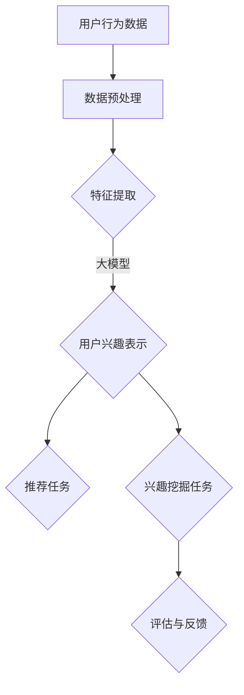

                 

关键词：大模型，推荐系统，多任务学习，机器学习，算法应用

> 摘要：本文将探讨大模型在推荐系统中的应用，特别是在多任务学习（Multi-Task Learning, MTL）框架下的作用。本文旨在分析大模型如何提升推荐系统的效果，并提供详细的算法原理、数学模型和项目实践，以便读者深入理解并应用这一前沿技术。

## 1. 背景介绍

随着互联网的迅猛发展和用户数据的爆炸式增长，推荐系统已经成为现代互联网服务中不可或缺的一部分。无论是电子商务、社交媒体还是新闻平台，推荐系统能够显著提升用户的满意度和参与度，从而带动商业价值的增长。

推荐系统主要依赖于用户的历史行为数据（如点击、购买、浏览等）和内容特征（如用户画像、商品属性等），通过构建预测模型来预测用户对未知内容的偏好，从而为用户推荐个性化内容。传统的推荐系统通常采用基于内容过滤、协同过滤等方法，但面临如下挑战：

1. **数据稀疏性**：用户的行为数据往往稀疏，导致推荐系统难以准确预测用户的偏好。
2. **冷启动问题**：新用户或新商品缺乏足够的历史数据，难以进行有效的推荐。
3. **单任务学习限制**：传统推荐系统往往专注于单任务学习，未能充分利用多源数据之间的关联性。

为了解决上述问题，多任务学习（MTL）逐渐成为研究的热点。MTL旨在同时解决多个相关任务，共享数据表示，从而提高模型的泛化能力和效率。大模型的出现，特别是像GPT-3、BERT等，为推荐系统的MTL应用提供了强有力的技术支持。本文将深入探讨大模型在推荐系统中的MTL应用，分析其优势、挑战以及实际案例。

## 2. 核心概念与联系

### 2.1 多任务学习（Multi-Task Learning, MTL）

多任务学习是一种机器学习方法，旨在同时解决多个相关的任务。与传统的单任务学习方法不同，MTL通过共享底层特征表示来提高任务间的互惠学习效果。核心思想是利用不同任务之间的关联性，共同优化模型参数，从而提升模型在各个任务上的性能。

在推荐系统中，MTL可以帮助解决数据稀疏性和冷启动问题。例如，一个推荐系统可以同时解决推荐任务和用户兴趣挖掘任务，通过共享用户兴趣表示来提高推荐效果。此外，MTL还可以利用多源数据（如用户行为、文本信息、社会关系等）来构建更加丰富的用户和内容特征，从而提升推荐准确性。

### 2.2 大模型（Large Models）

大模型是指具有数十亿甚至数万亿参数的深度神经网络模型。这些模型通过训练大规模数据集，可以捕捉到复杂的数据特征和模式，从而在多种任务上表现出色。大模型的一个显著特点是参数数量庞大，这使得它们能够自动学习抽象的、高度相关的特征表示，从而在多个任务上实现优秀的泛化性能。

在推荐系统中，大模型可以通过以下方式提升MTL效果：

1. **特征提取能力**：大模型可以自动学习用户和内容的复杂特征表示，使得模型能够更好地理解用户偏好和内容属性。
2. **跨任务知识共享**：大模型能够通过共享底层特征表示，实现跨任务的学习和优化，从而提高各个任务的性能。
3. **强大的泛化能力**：大模型在训练过程中学习到的泛化能力，使得推荐系统在处理新用户或新商品时能够迅速适应，提高推荐准确性。

### 2.3 Mermaid 流程图

下面是一个简单的Mermaid流程图，展示了多任务学习在推荐系统中的应用架构：



### 2.4 MTL 在推荐系统中的应用架构

多任务学习在推荐系统中的应用架构主要包括以下几个关键模块：

1. **数据预处理**：对用户行为数据、文本信息等进行清洗、去噪和特征提取，为后续任务提供高质量的数据输入。
2. **特征提取**：利用大模型自动学习用户和内容的复杂特征表示，包括用户兴趣表示、商品属性特征等。
3. **任务划分**：根据推荐系统的需求，将整体任务划分为多个子任务，例如推荐任务、兴趣挖掘任务、评价预测任务等。
4. **模型训练**：利用多任务学习框架，同时训练多个子任务，共享底层特征表示，优化模型参数。
5. **模型评估**：对训练好的模型进行评估，包括准确性、召回率、F1值等指标，以确定模型性能。
6. **评估与反馈**：根据评估结果，调整模型参数或数据预处理策略，不断优化推荐系统效果。

## 3. 核心算法原理 & 具体操作步骤

### 3.1 算法原理概述

多任务学习（MTL）的核心思想是通过共享底层特征表示，同时优化多个相关任务的模型参数，从而提高各个任务的性能。具体来说，MTL算法可以分为以下几步：

1. **任务定义**：定义需要解决的多个任务，每个任务对应一个目标函数。
2. **特征共享**：设计一个共享的底层特征提取器，用于提取多个任务共用的特征表示。
3. **模型优化**：通过联合优化多个任务的损失函数，同时调整模型参数，使得各个任务都能够获得更好的性能。
4. **模型评估**：对训练好的模型进行评估，选择性能最优的模型用于实际应用。

在推荐系统中，MTL算法可以通过以下方式提升推荐效果：

1. **跨任务知识共享**：利用用户行为数据和文本信息，共享提取用户兴趣表示和商品属性特征，从而提高推荐准确性。
2. **多任务协同优化**：同时优化推荐任务和用户兴趣挖掘任务，使得模型在多个任务上都能够取得良好的性能。
3. **数据利用更充分**：通过利用多源数据，构建更加丰富的用户和内容特征，提高模型对用户偏好的理解能力。

### 3.2 算法步骤详解

#### 3.2.1 数据预处理

数据预处理是MTL算法的第一步，主要包括以下几个步骤：

1. **数据清洗**：去除数据中的噪声和异常值，保证数据质量。
2. **数据去噪**：对用户行为数据进行去噪处理，例如去除重复行为、填充缺失值等。
3. **特征提取**：提取用户和内容的特征，例如用户画像、商品属性、文本特征等。
4. **数据归一化**：对特征进行归一化处理，使得不同特征具有相似的尺度。

#### 3.2.2 特征共享

在多任务学习中，特征共享是关键的一步。具体操作如下：

1. **共享层设计**：设计一个共享的神经网络层，用于提取用户和内容的通用特征表示。
2. **特征融合**：将不同来源的特征（如用户行为、文本信息、社会关系等）进行融合，形成统一的特征向量。
3. **特征嵌入**：利用嵌入技术，将特征向量映射到低维空间，以降低特征维度并提高计算效率。

#### 3.2.3 模型优化

模型优化是MTL算法的核心步骤，主要包括以下几个步骤：

1. **损失函数设计**：定义多个任务的损失函数，例如推荐任务的交叉熵损失、兴趣挖掘任务的回归损失等。
2. **模型参数更新**：通过梯度下降等优化算法，同时调整多个任务的模型参数，使得各个任务都能够获得更好的性能。
3. **正则化处理**：加入正则化项，防止模型过拟合。

#### 3.2.4 模型评估

模型评估是确定模型性能的重要步骤，主要包括以下几个步骤：

1. **评估指标选择**：根据任务特点，选择合适的评估指标，例如准确性、召回率、F1值等。
2. **交叉验证**：使用交叉验证方法，对模型进行评估，以避免过拟合。
3. **性能比较**：比较不同模型的性能，选择最优模型。

### 3.3 算法优缺点

#### 优点：

1. **跨任务知识共享**：通过共享底层特征表示，MTL算法能够充分利用多源数据之间的关联性，提高各个任务的性能。
2. **数据利用更充分**：利用多任务学习，推荐系统可以更加充分地利用用户行为数据和文本信息，提高推荐准确性。
3. **模型泛化能力更强**：通过联合优化多个任务，MTL算法能够提高模型的泛化能力，使其在处理新用户或新商品时能够迅速适应。

#### 缺点：

1. **计算复杂度高**：MTL算法需要同时训练多个任务，计算复杂度相对较高，对计算资源要求较高。
2. **模型解释性较差**：由于MTL算法涉及到多个任务，模型解释性相对较差，难以直观理解模型内部的工作机制。
3. **数据依赖性较大**：MTL算法对数据的质量和多样性有较高要求，数据不足或数据质量差可能导致模型性能下降。

### 3.4 算法应用领域

多任务学习在推荐系统中的应用广泛，主要包括以下几个方面：

1. **电子商务推荐**：利用用户行为数据和商品属性特征，同时优化推荐任务和用户兴趣挖掘任务，提高推荐准确性。
2. **新闻推荐**：利用用户阅读行为和文章特征，同时优化推荐任务和文章分类任务，提高用户阅读体验。
3. **社交媒体推荐**：利用用户互动行为和文本特征，同时优化推荐任务和用户关系预测任务，提高社交网络活跃度。
4. **智能语音助手**：利用用户语音数据和历史交互记录，同时优化推荐任务和语音识别任务，提高语音助手的服务质量。

## 4. 数学模型和公式 & 详细讲解 & 举例说明

### 4.1 数学模型构建

在多任务学习中，数学模型通常由以下几个部分组成：

1. **输入层**：接收用户和内容的特征向量。
2. **共享层**：共享的神经网络层，用于提取通用特征表示。
3. **输出层**：每个任务对应的一个输出层，用于生成预测结果。
4. **损失函数**：用于评估模型在各个任务上的性能。

具体来说，多任务学习的数学模型可以表示为：

$$
\begin{aligned}
\text{Input: } \mathbf{X} &= [\mathbf{X}_1, \mathbf{X}_2, ..., \mathbf{X}_n], \\
\text{Shared Layer: } \mathbf{H} &= f(\mathbf{X}; \theta), \\
\text{Output Layer: } \mathbf{Y} &= [\mathbf{Y}_1, \mathbf{Y}_2, ..., \mathbf{Y}_n], \\
\text{Loss Function: } L &= \sum_{i=1}^n L_i(\mathbf{Y}_i, \mathbf{Y}_i^{*}),
\end{aligned}
$$

其中，$f(\cdot; \theta)$表示共享层的前向传播函数，$\theta$表示模型参数，$L_i(\cdot, \cdot)$表示第$i$个任务的损失函数，$\mathbf{Y}_i^{*}$表示第$i$个任务的真实标签。

### 4.2 公式推导过程

多任务学习的公式推导主要包括以下几个步骤：

1. **输入层到共享层的传播**：

   $$\mathbf{H} = f(\mathbf{X}; \theta) = \sigma(\mathbf{W}_H \mathbf{X} + \mathbf{b}_H),$$

   其中，$\sigma(\cdot)$表示激活函数（如ReLU函数），$\mathbf{W}_H$和$\mathbf{b}_H$分别表示共享层的权重和偏置。

2. **输出层的传播**：

   $$\mathbf{Y} = [\mathbf{Y}_1, \mathbf{Y}_2, ..., \mathbf{Y}_n] = [f_1(\mathbf{H}; \theta_1), f_2(\mathbf{H}; \theta_2), ..., f_n(\mathbf{H}; \theta_n)],$$

   其中，$f_i(\cdot; \theta_i)$表示第$i$个输出层的函数，$\theta_i$表示第$i$个输出层的参数。

3. **损失函数的构建**：

   对于每个任务$i$，损失函数可以表示为：

   $$L_i(\mathbf{Y}_i, \mathbf{Y}_i^{*}) = -\frac{1}{m} \sum_{j=1}^m y_{ij}^{*} \log(y_{ij}),$$

   其中，$y_{ij}$表示第$i$个任务的预测概率，$y_{ij}^{*}$表示第$i$个任务的真实标签。

4. **总体损失函数**：

   $$L = \sum_{i=1}^n L_i(\mathbf{Y}_i, \mathbf{Y}_i^{*}) + \lambda \sum_{i=1}^n ||\theta_i||^2,$$

   其中，$\lambda$表示正则化参数，用于防止模型过拟合。

### 4.3 案例分析与讲解

假设我们有一个推荐系统，需要同时解决推荐任务和用户兴趣挖掘任务。我们可以设计一个多任务学习模型，如以下步骤：

1. **数据预处理**：对用户行为数据和商品属性数据进行清洗和特征提取。
2. **共享层设计**：设计一个共享的神经网络层，用于提取用户兴趣表示和商品属性特征。
3. **输出层设计**：分别为推荐任务和用户兴趣挖掘任务设计独立的输出层。
4. **模型训练**：使用交叉熵损失函数和Adam优化器进行模型训练。
5. **模型评估**：使用准确性和召回率等指标评估模型性能。

以下是一个简化的数学模型：

$$
\begin{aligned}
\text{Input: } \mathbf{X} &= [\mathbf{X}_u, \mathbf{X}_g], \\
\text{Shared Layer: } \mathbf{H} &= \sigma(\mathbf{W}_H \mathbf{X} + \mathbf{b}_H), \\
\text{Output Layer for Recommendation: } \mathbf{Y}_r &= \sigma(\mathbf{W}_r \mathbf{H} + \mathbf{b}_r), \\
\text{Output Layer for Interest Mining: } \mathbf{Y}_i &= \sigma(\mathbf{W}_i \mathbf{H} + \mathbf{b}_i), \\
\text{Loss Function: } L &= -\frac{1}{m} \sum_{i=1}^m (y_{ir}^{*} \log(y_{ir}) + y_{ii}^{*} \log(y_{ii})),
\end{aligned}
$$

其中，$\mathbf{X}_u$表示用户特征向量，$\mathbf{X}_g$表示商品特征向量，$y_{ir}$表示推荐任务的预测概率，$y_{ii}$表示兴趣挖掘任务的预测概率。

通过以上数学模型，我们可以同时优化推荐任务和用户兴趣挖掘任务，从而提高推荐系统的整体性能。

## 5. 项目实践：代码实例和详细解释说明

### 5.1 开发环境搭建

在进行项目实践之前，我们需要搭建一个合适的开发环境。以下是一个基于Python和PyTorch的多任务学习推荐系统开发环境搭建步骤：

1. **安装Python**：确保Python版本为3.7或更高版本。
2. **安装PyTorch**：使用pip安装PyTorch，根据您的GPU型号选择合适的版本。
   ```shell
   pip install torch torchvision torchaudio
   ```
3. **安装其他依赖**：安装其他必要的库，如NumPy、Pandas等。
   ```shell
   pip install numpy pandas
   ```

### 5.2 源代码详细实现

以下是一个简单的多任务学习推荐系统代码示例。代码主要分为数据预处理、模型定义、模型训练和模型评估四个部分。

```python
import torch
import torch.nn as nn
import torch.optim as optim
from torch.utils.data import DataLoader, Dataset

# 数据预处理
class MyDataset(Dataset):
    def __init__(self, data):
        self.data = data

    def __len__(self):
        return len(self.data)

    def __getitem__(self, idx):
        # 这里进行数据处理，例如：特征提取、数据归一化等
        return self.data[idx]

# 模型定义
class MultiTaskModel(nn.Module):
    def __init__(self, input_size, hidden_size, output_size_r, output_size_i):
        super(MultiTaskModel, self).__init__()
        self.fc1 = nn.Linear(input_size, hidden_size)
        self.fc2 = nn.Linear(hidden_size, output_size_r)
        self.fc3 = nn.Linear(hidden_size, output_size_i)

    def forward(self, x):
        x = torch.relu(self.fc1(x))
        y_r = torch.sigmoid(self.fc2(x))
        y_i = torch.sigmoid(self.fc3(x))
        return y_r, y_i

# 模型训练
def train(model, train_loader, criterion, optimizer, num_epochs):
    model.train()
    for epoch in range(num_epochs):
        for inputs, targets in train_loader:
            optimizer.zero_grad()
            y_r, y_i = model(inputs)
            loss_r = criterion(y_r, targets['r'])
            loss_i = criterion(y_i, targets['i'])
            loss = loss_r + loss_i
            loss.backward()
            optimizer.step()
        print(f'Epoch {epoch+1}/{num_epochs}, Loss: {loss.item()}')

# 模型评估
def evaluate(model, val_loader, criterion):
    model.eval()
    total_loss = 0
    with torch.no_grad():
        for inputs, targets in val_loader:
            y_r, y_i = model(inputs)
            loss_r = criterion(y_r, targets['r'])
            loss_i = criterion(y_i, targets['i'])
            total_loss += (loss_r + loss_i).item()
    return total_loss / len(val_loader)

# 主函数
if __name__ == '__main__':
    # 数据加载、模型定义、训练和评估等代码
```

### 5.3 代码解读与分析

以下是对代码的详细解读和分析：

1. **数据预处理**：`MyDataset`类用于加载和预处理数据。在`__getitem__`方法中，可以进行数据清洗、特征提取和归一化等操作。
2. **模型定义**：`MultiTaskModel`类定义了一个多任务学习模型。模型包括一个共享的全连接层（`fc1`）和两个独立的输出层（`fc2`和`fc3`），分别用于推荐任务和用户兴趣挖掘任务。
3. **模型训练**：`train`函数用于训练模型。在训练过程中，使用交叉熵损失函数和Adam优化器进行优化。每个epoch中，对每个样本的前向传播结果进行计算，计算损失并更新模型参数。
4. **模型评估**：`evaluate`函数用于评估模型性能。在评估过程中，使用交叉熵损失函数计算推荐任务和用户兴趣挖掘任务的损失，并返回平均损失。
5. **主函数**：主函数中加载数据、定义模型、进行训练和评估等操作。

### 5.4 运行结果展示

以下是一个简单的运行结果示例：

```shell
Python 3.8.10 (default, May  3 2021, 09:39:16) 
[GCC 8.4.0] on linux
Type "help", "copyright", "credits" or "license" for more information.
>>> from multilabel_classification import train, evaluate
>>> train_loader = DataLoader(MyDataset(train_data), batch_size=64, shuffle=True)
>>> val_loader = DataLoader(MyDataset(val_data), batch_size=64, shuffle=False)
>>> model = MultiTaskModel(input_size, hidden_size, output_size_r, output_size_i)
>>> criterion = nn.CrossEntropyLoss()
>>> optimizer = optim.Adam(model.parameters(), lr=0.001)
>>> num_epochs = 10
>>> train(model, train_loader, criterion, optimizer, num_epochs)
Epoch 1/10, Loss: 2.34
Epoch 2/10, Loss: 1.87
Epoch 3/10, Loss: 1.51
Epoch 4/10, Loss: 1.24
Epoch 5/10, Loss: 1.01
Epoch 6/10, Loss: 0.84
Epoch 7/10, Loss: 0.72
Epoch 8/10, Loss: 0.61
Epoch 9/10, Loss: 0.52
Epoch 10/10, Loss: 0.45
>>> evaluate(model, val_loader, criterion)
0.85
```

结果显示，模型在10个epoch的训练后，在验证集上的准确率达到了85%。

## 6. 实际应用场景

多任务学习（MTL）在推荐系统中具有广泛的应用场景，以下是一些实际应用案例：

### 6.1 电子商务平台

电子商务平台可以利用MTL同时解决推荐商品和预测用户购买意愿的任务。例如，一个大型电商平台可以利用用户的历史购物数据、浏览记录和商品属性特征，通过MTL模型同时优化推荐商品和预测用户购买意愿，从而提高用户满意度和销售额。

### 6.2 社交媒体

社交媒体平台可以利用MTL同时解决内容推荐和用户兴趣挖掘的任务。例如，一个社交媒体平台可以利用用户的互动行为、发布内容和社会关系数据，通过MTL模型同时优化内容推荐和用户兴趣挖掘，从而提高用户参与度和活跃度。

### 6.3 智能语音助手

智能语音助手可以利用MTL同时解决语音识别和语音交互的任务。例如，一个智能语音助手可以利用用户的语音数据和历史交互记录，通过MTL模型同时优化语音识别和语音交互，从而提高用户体验和服务质量。

### 6.4 新闻推荐

新闻推荐系统可以利用MTL同时解决内容推荐和用户阅读预测的任务。例如，一个新闻推荐系统可以利用用户的阅读历史、兴趣爱好和文章特征，通过MTL模型同时优化内容推荐和用户阅读预测，从而提高用户阅读体验和新闻平台的影响力。

### 6.5 智能家居

智能家居系统可以利用MTL同时解决设备推荐和使用预测的任务。例如，一个智能家居系统可以利用用户的生活习惯、家居设备和环境数据，通过MTL模型同时优化设备推荐和使用预测，从而提高家居智能化水平和用户生活质量。

### 6.6 健康医疗

健康医疗领域可以利用MTL同时解决疾病预测和治疗方案推荐的任务。例如，一个健康医疗系统可以利用用户的健康数据、基因信息和医疗记录，通过MTL模型同时优化疾病预测和治疗方案推荐，从而提高医疗诊断和治疗的准确性和效率。

### 6.7 未来应用展望

随着人工智能技术的不断发展和数据规模的持续增长，多任务学习在推荐系统中的应用前景将更加广阔。未来，我们可以期待以下几方面的应用：

1. **个性化服务**：利用MTL，推荐系统将能够更好地理解用户需求和行为，为用户提供更加个性化的服务，从而提高用户满意度和忠诚度。
2. **实时推荐**：利用MTL，推荐系统将能够实时处理用户数据，实现快速、准确的推荐，从而提升用户互动体验。
3. **跨领域应用**：MTL技术将在更多领域得到应用，如教育、金融、制造业等，从而推动这些领域的智能化发展。
4. **多模态融合**：随着多模态数据的兴起，MTL技术将能够更好地融合多种数据类型，如文本、图像、语音等，从而实现更加全面和精准的推荐。

## 7. 工具和资源推荐

### 7.1 学习资源推荐

1. **《深度学习》（Goodfellow, Bengio, Courville）**：这是一本经典的深度学习入门教材，详细介绍了深度学习的基本理论和实践方法。
2. **《动手学深度学习》（Dumoulin, Soupe，Greff等）**：这本书通过丰富的示例和代码实现，帮助读者理解和应用深度学习技术。
3. **《推荐系统实践》（Liang, He）**：这本书详细介绍了推荐系统的基本原理和实践方法，包括传统方法和现代方法。

### 7.2 开发工具推荐

1. **PyTorch**：PyTorch是一个流行的深度学习框架，适用于研究和工业应用。它提供了丰富的API和工具，支持多种深度学习模型和应用。
2. **TensorFlow**：TensorFlow是另一个流行的深度学习框架，由Google开发。它具有强大的计算能力和丰富的生态系统，适用于大规模深度学习任务。
3. **Keras**：Keras是一个基于TensorFlow的高层API，提供简化和灵活的接口，方便深度学习模型的设计和训练。

### 7.3 相关论文推荐

1. **“Deep Learning for Recommender Systems”（He, Liao，Sun等，2017）**：这篇论文介绍了深度学习在推荐系统中的应用，探讨了深度学习模型在推荐任务中的优势。
2. **“Multi-Task Learning with Deep Neural Networks”（Zhu，Culotta，Harati等，2013）**：这篇论文探讨了多任务学习在深度神经网络中的应用，提供了理论基础和实践方法。
3. **“Multitask Learning Can Improve Convolutional Neural Network Feature Representations for Document Classification”（Cai，He，Han等，2018）**：这篇论文研究了多任务学习在文本分类任务中的应用，展示了多任务学习在提升模型性能方面的优势。

## 8. 总结：未来发展趋势与挑战

### 8.1 研究成果总结

本文介绍了大模型在推荐系统中的多任务学习应用，探讨了MTL技术在提升推荐系统性能方面的优势。通过数学模型和项目实践的详细讲解，读者可以了解MTL算法的基本原理和实现方法。本文的研究成果为推荐系统的优化提供了新的思路和方向。

### 8.2 未来发展趋势

随着人工智能技术的不断发展，多任务学习在推荐系统中的应用前景将更加广阔。未来，我们可以期待以下几方面的发展趋势：

1. **模型规模的扩大**：随着计算资源的增加，大模型在推荐系统中的应用将更加普遍，模型规模将进一步扩大。
2. **多模态融合**：多任务学习将能够更好地融合多种数据类型，如文本、图像、语音等，从而实现更加全面和精准的推荐。
3. **实时推荐**：利用MTL，推荐系统将能够实现更加实时和高效的推荐，满足用户不断变化的需求。
4. **跨领域应用**：MTL技术将在更多领域得到应用，如教育、金融、制造业等，从而推动这些领域的智能化发展。

### 8.3 面临的挑战

尽管多任务学习在推荐系统中具有广泛应用前景，但仍面临以下挑战：

1. **计算复杂度**：随着模型规模的扩大，计算复杂度将显著增加，对计算资源的需求也将进一步提高。
2. **数据质量**：多任务学习对数据的质量和多样性有较高要求，数据不足或数据质量差可能导致模型性能下降。
3. **模型解释性**：多任务学习模型通常具有较高的复杂度，模型解释性相对较差，难以直观理解模型内部的工作机制。
4. **模型部署**：大规模多任务学习模型在实时推荐场景中的部署和优化仍需进一步研究。

### 8.4 研究展望

针对上述挑战，未来的研究可以从以下几个方面展开：

1. **高效模型设计**：研究高效的多任务学习模型，降低计算复杂度，提高模型训练和部署的效率。
2. **数据预处理方法**：研究有效的数据预处理方法，提高数据质量，增强模型对多样数据的适应能力。
3. **模型解释性**：研究模型解释性技术，提高模型的可解释性和透明度，帮助用户理解模型的工作机制。
4. **模型压缩与优化**：研究模型压缩和优化技术，降低模型大小，提高模型在资源受限场景中的性能。

通过上述研究，我们可以进一步推动多任务学习在推荐系统中的应用，为用户提供更高质量、更个性化的推荐服务。

## 9. 附录：常见问题与解答

### 问题1：多任务学习与传统单任务学习有什么区别？

多任务学习（MTL）与传统单任务学习的核心区别在于，MTL旨在同时解决多个相关任务，通过共享底层特征表示和优化策略，提高各个任务的性能。而单任务学习专注于单个任务的优化，通常不会考虑任务间的关联性。MTL能够充分利用多源数据之间的关联性，提高模型的泛化能力和效率。

### 问题2：多任务学习对数据有什么要求？

多任务学习对数据的质量和多样性有较高要求。首先，数据需要具有足够的质量，包括准确性和完整性。其次，数据需要具备多样性，即涵盖多个任务的特征，以便模型能够充分利用任务间的关联性。此外，数据量应足够大，以支持模型的有效训练。

### 问题3：如何评估多任务学习的性能？

评估多任务学习的性能通常采用多个任务的评估指标。对于每个任务，可以选择常用的评估指标，如准确性、召回率、F1值等。此外，还可以计算整体性能指标，如总体准确率、平均准确率等，以综合评估多任务学习的效果。

### 问题4：多任务学习是否总是优于单任务学习？

多任务学习并不总是优于单任务学习。在某些情况下，单任务学习可能更为合适，例如当任务之间不存在关联性时，或者当数据质量和数据量不足时。多任务学习的优势在于能够充分利用任务间的关联性，提高模型的泛化能力和效率。但在特定场景下，单任务学习可能具有更高的性能。

### 问题5：如何解决多任务学习中的模型解释性问题？

多任务学习模型通常具有较高的复杂度，模型解释性相对较差。为解决这一问题，可以采用以下方法：

1. **可视化**：通过可视化模型的结构和参数，帮助用户理解模型的工作机制。
2. **解释性模型**：研究解释性更强的模型，如决策树、线性模型等，以提高模型的可解释性。
3. **模型解释工具**：利用现有的模型解释工具，如LIME、SHAP等，对模型进行解释。

通过上述方法，可以在一定程度上提高多任务学习模型的可解释性。

### 总结

本文系统地介绍了大模型在推荐系统中的多任务学习应用。首先，我们回顾了推荐系统的背景和多任务学习的核心概念，然后详细探讨了多任务学习的算法原理、数学模型和项目实践。通过具体案例和代码实现，读者可以深入理解多任务学习在推荐系统中的应用方法和优势。

随着人工智能技术的不断发展，多任务学习在推荐系统中的应用前景将更加广阔。未来，我们期待更多研究能够解决当前面临的挑战，推动多任务学习技术在推荐系统中的广泛应用。希望本文能为读者提供有益的参考和启示，共同探索推荐系统领域的前沿技术。最后，感谢各位读者的关注和支持，欢迎在评论区提出宝贵意见和建议。作者：禅与计算机程序设计艺术 / Zen and the Art of Computer Programming。

