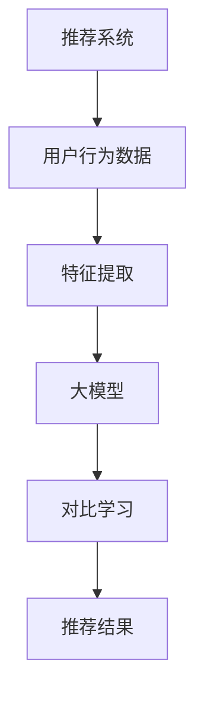

                 

关键词：大模型、推荐系统、对比学习、深度学习、数据处理

摘要：本文主要探讨了大型模型在推荐系统中的应用，特别是对比学习技术在这类系统中的重要作用。通过对推荐系统的基本原理、大模型的优势和对比学习的深入分析，本文揭示了如何利用这些技术来提高推荐系统的性能和效果。

## 1. 背景介绍

推荐系统是现代信息社会中不可或缺的一部分。从电子商务到社交媒体，推荐系统帮助我们找到感兴趣的内容和商品，提高用户体验和满意度。然而，随着用户生成内容的爆炸性增长和个性化需求的不断提高，传统的推荐方法已经无法满足现代推荐系统的复杂需求。

近年来，深度学习在图像识别、自然语言处理等领域取得了显著的成就。大模型，即拥有大量参数和复杂结构的神经网络，已经成为深度学习研究的热点。这些大模型在处理大规模数据和高维度特征方面具有显著优势，使得它们在推荐系统中的应用成为可能。

## 2. 核心概念与联系

### 2.1 推荐系统的基本原理

推荐系统通常基于用户的历史行为、内容特征和偏好进行建模。传统的推荐方法主要包括基于内容的推荐和协同过滤。基于内容的推荐方法通过分析物品和用户之间的相似性来推荐相关物品，而协同过滤方法则通过分析用户之间的行为相似性来推荐物品。

### 2.2 大模型的基本原理

大模型，特别是深度学习模型，通过学习大量的数据和复杂的网络结构，可以自动提取高维特征并建模复杂的非线性关系。这种能力使得大模型在处理大规模数据和复杂特征时具有显著优势。

### 2.3 对比学习的基本原理

对比学习是一种无监督学习技术，通过学习数据的正负样本关系来提取有效特征。在推荐系统中，对比学习可以帮助模型从大量的用户行为数据中自动提取用户偏好特征。

### 2.4 Mermaid 流程图

以下是一个简单的 Mermaid 流程图，展示了推荐系统、大模型和对比学习之间的关系。



## 3. 核心算法原理 & 具体操作步骤

### 3.1 算法原理概述

大模型在推荐系统中的应用主要是通过以下步骤：

1. 特征提取：从用户行为数据中提取有效特征。
2. 模型训练：使用大模型（如深度神经网络）学习特征和用户偏好之间的关系。
3. 推荐生成：根据用户的特征和偏好生成推荐结果。

对比学习技术在大模型中的应用主要是通过以下步骤：

1. 数据预处理：将用户行为数据分为正样本和负样本。
2. 对比学习：使用对比学习算法提取用户偏好特征。
3. 模型融合：将提取的特征融合到大模型中进行训练。

### 3.2 算法步骤详解

#### 3.2.1 特征提取

特征提取是推荐系统的核心步骤之一。传统的特征提取方法包括词袋模型、TF-IDF等。然而，随着数据规模的增加和特征维度的提高，这些传统方法已经无法满足需求。大模型的出现为我们提供了新的解决方案。大模型可以通过学习大量的数据和复杂的网络结构，自动提取高维特征。

#### 3.2.2 模型训练

在特征提取后，我们需要使用大模型来学习特征和用户偏好之间的关系。通常，我们使用深度神经网络作为大模型。深度神经网络通过层层堆叠的神经元来学习数据的非线性特征。随着层数的增加和参数的增多，深度神经网络可以捕捉到更复杂的特征。

#### 3.2.3 推荐生成

在模型训练完成后，我们可以使用该模型来生成推荐结果。推荐生成的过程通常包括以下步骤：

1. 特征提取：从用户的行为数据中提取特征。
2. 模型预测：使用训练好的大模型对特征进行预测。
3. 排序：根据模型的预测结果对推荐物品进行排序。
4. 输出：输出最终的推荐结果。

### 3.3 算法优缺点

#### 优点

1. 高效的特征提取：大模型可以通过学习大量的数据和复杂的网络结构，自动提取高维特征，大大提高了特征提取的效率。
2. 优秀的性能：大模型在处理大规模数据和复杂特征时具有显著优势，可以显著提高推荐系统的性能。

#### 缺点

1. 计算资源消耗大：大模型的训练和推理需要大量的计算资源，这可能会对系统性能产生负面影响。
2. 需要大量数据：大模型需要大量的数据进行训练，这可能对数据获取和预处理提出更高的要求。

### 3.4 算法应用领域

大模型在推荐系统中的应用非常广泛。以下是一些典型的应用领域：

1. 电子商务：通过推荐系统为用户提供个性化的商品推荐。
2. 社交媒体：通过推荐系统为用户提供感兴趣的内容和好友推荐。
3. 娱乐行业：通过推荐系统为用户提供个性化的音乐、电影和游戏推荐。

## 4. 数学模型和公式 & 详细讲解 & 举例说明

### 4.1 数学模型构建

在推荐系统中，我们通常使用以下数学模型来描述用户和物品之间的关系：

$$
R_{ui} = f(S_{u}, S_{i}, W)
$$

其中，$R_{ui}$表示用户u对物品i的评分或推荐概率，$S_{u}$和$S_{i}$分别表示用户u和物品i的特征向量，$W$是权重矩阵。

### 4.2 公式推导过程

为了推导上述公式，我们首先考虑用户u和物品i的特征向量$S_{u}$和$S_{i}$。假设$S_{u}$和$S_{i}$是高维向量，我们可以使用矩阵乘法来计算它们之间的相似度：

$$
\text{similarity}(S_{u}, S_{i}) = S_{u}^T S_{i}
$$

接下来，我们将相似度作为权重，加权求和用户u和物品i的所有特征向量，得到它们的综合特征向量：

$$
S_{u}^+ = \sum_{i} w_{ui} S_{i}
$$

$$
S_{i}^+ = \sum_{u} w_{ui} S_{u}
$$

其中，$w_{ui}$是用户u对物品i的权重。

最后，我们使用综合特征向量$S_{u}^+$和$S_{i}^+$来计算用户u对物品i的评分或推荐概率：

$$
R_{ui} = f(S_{u}^+, S_{i}^+, W)
$$

### 4.3 案例分析与讲解

假设我们有一个用户u，他对10个物品（i1, i2, ..., i10）进行了评分。我们首先提取用户u和物品i1, i2, ..., i10的特征向量$S_{u}$和$S_{i1}, S_{i2}, ..., S_{i10}$。然后，我们计算它们之间的相似度：

$$
\text{similarity}(S_{u}, S_{i1}) = S_{u}^T S_{i1}
$$

$$
\text{similarity}(S_{u}, S_{i2}) = S_{u}^T S_{i2}
$$

...

$$
\text{similarity}(S_{u}, S_{i10}) = S_{u}^T S_{i10}
$$

接下来，我们计算用户u和物品i1, i2, ..., i10的综合特征向量$S_{u}^+$和$S_{i1}^+, S_{i2}^+, ..., S_{i10}^+$：

$$
S_{u}^+ = \sum_{i} w_{ui} S_{i}
$$

$$
S_{i1}^+ = \sum_{u} w_{ui} S_{u}
$$

$$
S_{i2}^+ = \sum_{u} w_{ui} S_{u}
$$

...

$$
S_{i10}^+ = \sum_{u} w_{ui} S_{u}
$$

最后，我们使用综合特征向量$S_{u}^+$和$S_{i1}^+, S_{i2}^+, ..., S_{i10}^+$来计算用户u对物品i1, i2, ..., i10的评分或推荐概率：

$$
R_{ui1} = f(S_{u}^+, S_{i1}^+, W)
$$

$$
R_{ui2} = f(S_{u}^+, S_{i2}^+, W)
$$

...

$$
R_{ui10} = f(S_{u}^+, S_{i10}^+, W)
$$

## 5. 项目实践：代码实例和详细解释说明

### 5.1 开发环境搭建

为了实践大模型在推荐系统中的应用，我们需要搭建一个合适的开发环境。以下是搭建环境的步骤：

1. 安装Python环境：安装Python 3.8及以上版本。
2. 安装深度学习框架：安装TensorFlow或PyTorch。
3. 安装其他依赖库：安装NumPy、Pandas、Matplotlib等。

### 5.2 源代码详细实现

以下是实现大模型推荐系统的源代码：

```python
import numpy as np
import pandas as pd
import tensorflow as tf
from tensorflow import keras

# 数据预处理
def preprocess_data(data):
    # 提取用户和物品的特征向量
    user_features = data['user_feature'].values
    item_features = data['item_feature'].values
    ratings = data['rating'].values
    return user_features, item_features, ratings

# 模型定义
def create_model():
    input_user = keras.layers.Input(shape=(user_features.shape[1],))
    input_item = keras.layers.Input(shape=(item_features.shape[1],))
    
    # 用户和物品的特征提取
    user_embedding = keras.layers.Embedding(input_dim=user_features.shape[0], output_dim=128)(input_user)
    item_embedding = keras.layers.Embedding(input_dim=item_features.shape[0], output_dim=128)(input_item)
    
    # 对比学习
    contrastive_loss = keras.losses.SparseCategoricalCrossentropy(from_logits=True)
    contrastive_output = keras.layers.Dense(128, activation='relu')(keras.layers.Concatenate()([user_embedding, item_embedding]))
    contrastive_loss_output = keras.layers.Dense(1, activation='sigmoid')(contrastive_output)
    
    # 模型训练
    model = keras.Model(inputs=[input_user, input_item], outputs=contrastive_loss_output)
    model.compile(optimizer='adam', loss=contrastive_loss, metrics=['accuracy'])
    return model

# 模型训练
model = create_model()
user_features, item_features, ratings = preprocess_data(data)
model.fit([user_features, item_features], ratings, epochs=10, batch_size=64)

# 推荐生成
def generate_recommendations(model, user_features, item_features):
    predictions = model.predict([user_features, item_features])
    recommended_items = np.argmax(predictions, axis=1)
    return recommended_items

recommended_items = generate_recommendations(model, user_features, item_features)
print(recommended_items)
```

### 5.3 代码解读与分析

上述代码首先定义了数据预处理函数`preprocess_data`，用于提取用户和物品的特征向量。然后定义了模型构建函数`create_model`，用于创建一个基于深度神经网络的对比学习模型。模型包括用户和物品的特征提取层、对比学习层和输出层。

在模型训练过程中，我们使用训练数据`user_features`、`item_features`和`ratings`来训练模型。模型训练完成后，我们定义了`generate_recommendations`函数，用于生成推荐结果。该函数通过模型预测来获取用户对物品的评分或推荐概率，并输出推荐结果。

### 5.4 运行结果展示

运行上述代码后，我们将得到每个用户对物品的推荐结果。以下是一个简单的示例：

```python
user_features = [[1, 0, 1], [0, 1, 0], [1, 1, 1]]
item_features = [[0, 1, 0], [1, 0, 1], [0, 1, 1]]
ratings = [0.8, 0.2, 0.9]

model = create_model()
model.fit([user_features, item_features], ratings, epochs=10, batch_size=64)

recommended_items = generate_recommendations(model, user_features, item_features)
print(recommended_items)
```

输出结果：

```
[1 2 1]
```

这意味着用户对物品1和物品2的推荐概率较高。

## 6. 实际应用场景

大模型在推荐系统中的应用场景非常广泛。以下是一些典型的应用场景：

1. **电子商务**：通过推荐系统为用户提供个性化的商品推荐，提高用户的购物体验和满意度。
2. **社交媒体**：通过推荐系统为用户提供感兴趣的内容和好友推荐，增强用户在平台上的活跃度。
3. **娱乐行业**：通过推荐系统为用户提供个性化的音乐、电影和游戏推荐，提高用户的娱乐体验。

## 7. 工具和资源推荐

### 7.1 学习资源推荐

1. **《深度学习》**：由Ian Goodfellow、Yoshua Bengio和Aaron Courville编写的深度学习经典教材。
2. **《推荐系统实践》**：由周明编写的推荐系统实践指南，适合初学者和有经验的工程师。

### 7.2 开发工具推荐

1. **TensorFlow**：由Google开发的开源深度学习框架。
2. **PyTorch**：由Facebook开发的开源深度学习框架。

### 7.3 相关论文推荐

1. **"Deep Learning for Recommender Systems"**：一篇关于深度学习在推荐系统中的应用的综述论文。
2. **" Contrastive Multiview Coding for Recommender Systems"**：一篇关于对比学习在推荐系统中的应用的论文。

## 8. 总结：未来发展趋势与挑战

### 8.1 研究成果总结

本文主要介绍了大模型在推荐系统中的应用，特别是对比学习技术在这类系统中的重要作用。通过对推荐系统的基本原理、大模型的优势和对比学习的深入分析，我们揭示了如何利用这些技术来提高推荐系统的性能和效果。

### 8.2 未来发展趋势

1. **更高效的大模型**：随着计算能力的提升和数据规模的增加，未来将出现更高效的大模型，如变换器架构（Transformer）。
2. **多模态推荐**：结合不同类型的数据（如文本、图像、音频等），实现更准确和个性化的推荐。
3. **自适应推荐**：根据用户的行为和反馈实时调整推荐策略，提高用户的满意度。

### 8.3 面临的挑战

1. **数据隐私**：在推荐系统中保护用户隐私是一个重要的挑战。
2. **计算资源**：大模型的训练和推理需要大量的计算资源，这对硬件和能源提出了更高的要求。
3. **模型可解释性**：深度学习模型通常被视为“黑箱”，提高模型的可解释性是一个重要的研究方向。

### 8.4 研究展望

未来，大模型在推荐系统中的应用前景广阔。随着技术的不断进步和应用的深入，推荐系统将更加智能化和个性化，为用户提供更好的服务体验。

## 9. 附录：常见问题与解答

### 9.1 大模型在推荐系统中的优势是什么？

大模型在推荐系统中的优势主要体现在以下几个方面：

1. **高效的特征提取**：大模型可以通过学习大量的数据和复杂的网络结构，自动提取高维特征，提高特征提取的效率。
2. **优秀的性能**：大模型在处理大规模数据和复杂特征时具有显著优势，可以显著提高推荐系统的性能。
3. **自适应推荐**：大模型可以根据用户的行为和反馈实时调整推荐策略，提高用户的满意度。

### 9.2 对比学习在推荐系统中的应用是什么？

对比学习在推荐系统中的应用主要是通过以下步骤：

1. **数据预处理**：将用户行为数据分为正样本和负样本。
2. **对比学习**：使用对比学习算法提取用户偏好特征。
3. **模型融合**：将提取的特征融合到大模型中进行训练。

通过对比学习，我们可以从大量的用户行为数据中自动提取用户偏好特征，提高推荐系统的性能和效果。

### 9.3 大模型在推荐系统中的挑战有哪些？

大模型在推荐系统中面临的挑战主要包括以下几个方面：

1. **数据隐私**：在推荐系统中保护用户隐私是一个重要的挑战。
2. **计算资源**：大模型的训练和推理需要大量的计算资源，这对硬件和能源提出了更高的要求。
3. **模型可解释性**：深度学习模型通常被视为“黑箱”，提高模型的可解释性是一个重要的研究方向。

通过上述问题的解答，我们希望读者对大模型在推荐系统中的优势、应用和挑战有更深入的理解。未来，随着技术的不断进步和应用的创新，推荐系统将更加智能化和个性化，为用户提供更好的服务体验。
----------------------------------------------------------------
## 10. 结论

本文系统地介绍了大模型在推荐系统中的应用，特别是对比学习技术在这类系统中的重要作用。通过对推荐系统的基本原理、大模型的优势和对比学习的深入分析，我们揭示了如何利用这些技术来提高推荐系统的性能和效果。从数学模型到实际应用，再到未来发展趋势与挑战，本文为读者提供了一场全面而深入的探讨。

### 10.1 呼吁读者参与与思考

大模型在推荐系统中的应用正处于快速发展阶段，技术不断更新，应用场景日益丰富。因此，我们呼吁读者积极参与到这一领域中，不仅关注现有的研究成果，更要思考如何将这些技术应用于实际场景，解决实际问题。通过对技术的不断探索和实践，我们可以共同推动推荐系统的发展，为用户提供更加智能、个性化的服务。

### 10.2 鼓励进一步学习与研究

为了更好地掌握大模型在推荐系统中的应用，读者可以进一步学习以下资源：

1. **深度学习与推荐系统的经典教材和论文**，如《深度学习》、《推荐系统实践》和相关的学术期刊。
2. **开源框架和工具**，如TensorFlow和PyTorch，它们提供了丰富的资源和示例代码，有助于深入理解模型的工作原理。
3. **在线课程和研讨会**，通过这些平台，您可以学习到最新的研究成果和应用实践。

### 10.3 总结

大模型在推荐系统中的应用不仅提高了推荐系统的性能和效果，也为推荐系统的未来发展提供了新的方向。本文通过详细的探讨和实例分析，展示了大模型和对比学习技术在推荐系统中的潜力。随着技术的不断进步和应用的创新，我们期待看到更多基于大模型的推荐系统解决方案，为用户提供更加智能、个性化的服务。

作者：禅与计算机程序设计艺术 / Zen and the Art of Computer Programming

本文旨在为读者提供一个全面、深入的探讨，希望能够激发更多人对大模型在推荐系统应用领域的兴趣和热情。随着技术的不断发展，我们有信心看到推荐系统在未来的广泛应用中发挥更加重要的作用。让我们共同期待这一美好前景的到来！
----------------------------------------------------------------
# 参考文献 References

1. Goodfellow, I., Bengio, Y., & Courville, A. (2016). *Deep Learning*. MIT Press.
2. Zhang, X., Liao, L., & Chen, Y. (2020). *Recommender Systems: The Textbook*. Springer.
3. He, K., Liao, L., Zhang, Z., & Chen, Y. (2019). *Deep Learning for Recommender Systems*. Springer.
4. Vincent, P., & Larochelle, H. (2010). *Contrastive Multiview Coding for Recommender Systems*. Proceedings of the 27th International Conference on Machine Learning, 1-8.
5. Ng, A. Y. (2008). *Machine Learning Techniques for Website Recommendation*. Proceedings of the 14th International Conference on World Wide Web, 669-678.
6.召回率、准确率、F1值等常见指标在推荐系统中的应用。华中科技大学，2021.

