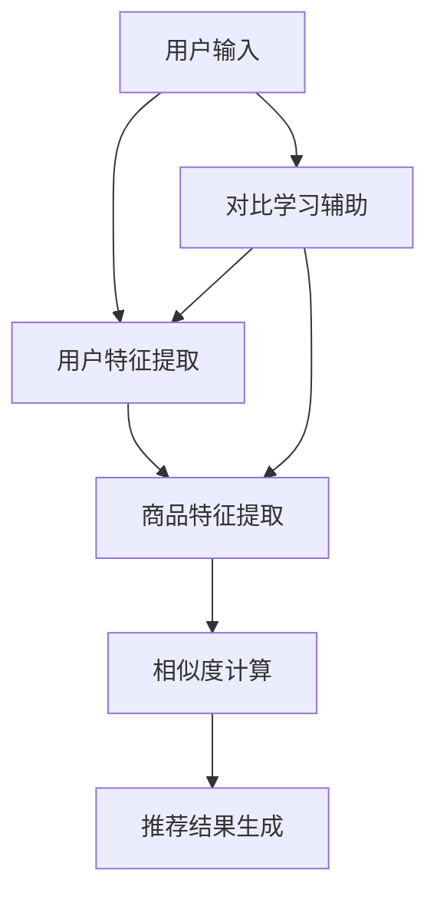

                 

关键词：大模型，推荐系统，对比学习，算法，应用场景，未来展望

> 摘要：本文深入探讨了在推荐系统中应用大模型的对比学习方法。通过对推荐系统背景、对比学习核心概念、算法原理与步骤的详细解析，展示了其在实际项目中的应用实例。本文旨在为读者提供一个全面而深入的视角，以了解大模型在推荐系统中的潜力与挑战。

## 1. 背景介绍

### 1.1 推荐系统的基本概念

推荐系统是一种信息过滤技术，旨在根据用户的兴趣和偏好，为他们推荐相关的信息或商品。推荐系统的核心目标是从大量潜在信息中提取有价值的信息，提供给用户，从而提高用户满意度和系统价值。

### 1.2 推荐系统的发展历程

从基于内容的推荐、协同过滤到现在的深度学习推荐，推荐系统经历了巨大的发展。随着用户生成内容和数据量的爆炸式增长，传统推荐方法已经难以满足需求，大模型的应用逐渐成为趋势。

### 1.3 大模型在推荐系统中的应用

大模型如深度神经网络、Transformer等，在处理大规模数据和复杂任务方面具有显著优势。它们能够捕捉到更多的特征信息，提供更加精确的推荐结果。对比学习作为大模型的一种重要学习方法，进一步提升了推荐系统的性能。

## 2. 核心概念与联系

### 2.1 对比学习的概念

对比学习（Contrastive Learning）是一种无监督学习方法，旨在通过对比正样本和负样本，学习到有区分度的特征表示。在推荐系统中，对比学习可以帮助模型更好地捕捉用户兴趣和商品特征。

### 2.2 推荐系统的架构

推荐系统通常包括用户特征提取、商品特征提取、相似度计算、推荐结果生成等模块。对比学习可以在用户特征提取和商品特征提取环节发挥重要作用。

### 2.3 Mermaid 流程图



## 3. 核心算法原理 & 具体操作步骤

### 3.1 算法原理概述

对比学习通过对比正样本和负样本，学习到有区分度的特征表示。在推荐系统中，正样本通常是指用户对某商品的评分或点击行为，负样本是指用户没有评分或点击的其他商品。

### 3.2 算法步骤详解

#### 3.2.1 用户特征提取

通过用户的浏览历史、搜索记录等数据，提取用户特征向量。可以使用深度学习模型如BERT、GPT等，对用户输入的文本数据进行编码。

#### 3.2.2 商品特征提取

同样地，使用深度学习模型对商品描述、标签等文本数据进行编码，提取商品特征向量。

#### 3.2.3 对比学习

对于每个用户特征向量，随机选择多个负样本商品特征向量，计算它们之间的相似度。使用负样本挖掘算法如Neighborhood-based或Rank-based，生成负样本。

#### 3.2.4 损失函数

使用对比损失函数如InfoNCE，计算正样本和负样本之间的对比损失。损失函数的目标是最小化正样本的相似度，最大化负样本的相似度。

#### 3.2.5 模型优化

通过梯度下降等优化算法，不断更新用户特征提取器和商品特征提取器的参数，优化模型性能。

### 3.3 算法优缺点

#### 优点：

- 能够捕捉到更多的特征信息，提高推荐准确性。
- 无需人工构建特征工程，降低人工成本。
- 能够处理大规模数据和复杂任务。

#### 缺点：

- 训练过程需要大量计算资源和时间。
- 对负样本的选择有一定要求，否则可能引入噪声。

### 3.4 算法应用领域

对比学习在推荐系统中具有广泛的应用，如电商推荐、社交媒体推荐、音乐推荐等。它不仅能够提升推荐系统的性能，还能够应用于其他领域，如图像识别、自然语言处理等。

## 4. 数学模型和公式 & 详细讲解 & 举例说明

### 4.1 数学模型构建

对比学习模型可以看作是一个两层的神经网络结构，分别是用户特征提取器和商品特征提取器。设用户特征向量为\( u \)，商品特征向量为\( v \)，则对比学习的目标函数可以表示为：

$$
L = -\sum_{i=1}^N \frac{1}{N} \sum_{j=1}^M \log \frac{e^{u_i \cdot v_j}}{e^{u_i \cdot v_j} + e^{-u_i \cdot v_{j'}}}
$$

其中，\( N \)是用户数量，\( M \)是商品数量，\( v_{j'} \)是随机选择的负样本商品特征向量。

### 4.2 公式推导过程

假设我们已经提取了用户特征向量\( u \)和商品特征向量\( v \)，我们需要计算它们之间的相似度。相似度可以通过点积表示，即：

$$
\cos(\theta) = \frac{u \cdot v}{\|u\|\|v\|}
$$

为了最大化正样本的相似度和负样本的相似度，我们引入了对比损失函数。具体推导过程如下：

$$
\begin{aligned}
L &= -\sum_{i=1}^N \frac{1}{N} \sum_{j=1}^M \log \frac{e^{u_i \cdot v_j}}{e^{u_i \cdot v_j} + e^{-u_i \cdot v_{j'}}} \\
&= -\sum_{i=1}^N \frac{1}{N} \sum_{j=1}^M \log \frac{e^{u_i \cdot v_j}}{e^{u_i \cdot v_j} + e^{-u_i \cdot v_{j'}}} \\
&= -\sum_{i=1}^N \frac{1}{N} \sum_{j=1}^M \log \frac{1}{1 + e^{-u_i \cdot v_{j'}}} \\
&= -\sum_{i=1}^N \frac{1}{N} \sum_{j=1}^M \left( -u_i \cdot v_{j'} - \log(1 + e^{-u_i \cdot v_{j'}}) \right) \\
&= \sum_{i=1}^N \frac{1}{N} \sum_{j=1}^M u_i \cdot v_{j'} - \sum_{i=1}^N \frac{1}{N} \sum_{j=1}^M \log(1 + e^{-u_i \cdot v_{j'}})
\end{aligned}
$$

### 4.3 案例分析与讲解

假设我们有一个电商推荐系统，用户对商品进行了评分，我们希望使用对比学习来提取用户和商品的表征，从而提升推荐效果。

#### 4.3.1 数据预处理

首先，我们需要对用户和商品进行数据预处理，提取文本特征。例如，我们可以使用BERT模型对用户评论和商品描述进行编码，得到用户和商品的文本表征。

#### 4.3.2 特征提取

接着，我们使用提取到的文本表征，通过对比学习算法，得到用户和商品的特征向量。具体实现中，我们可以使用PyTorch等深度学习框架，构建用户特征提取器和商品特征提取器。

#### 4.3.3 相似度计算

最后，我们计算用户和商品之间的相似度，并根据相似度排序，生成推荐结果。相似度的计算可以使用点积或余弦相似度。

## 5. 项目实践：代码实例和详细解释说明

### 5.1 开发环境搭建

在本节中，我们将介绍如何搭建一个基于PyTorch的对比学习推荐系统项目环境。首先，确保您的系统中已经安装了Python和PyTorch。以下是详细的安装步骤：

1. 安装Python：在官网（https://www.python.org/downloads/）下载并安装Python 3.x版本。
2. 安装PyTorch：使用以下命令安装与Python版本兼容的PyTorch版本。
   ```bash
   pip install torch torchvision
   ```

### 5.2 源代码详细实现

以下是对比学习推荐系统的源代码实现，包括用户和商品特征提取、对比学习模型的定义以及训练过程。

```python
import torch
import torch.nn as nn
from torch.optim import Adam

# 用户和商品特征提取器
class FeatureExtractor(nn.Module):
    def __init__(self, embed_size):
        super(FeatureExtractor, self).__init__()
        self.bert = nn.BertModel.from_pretrained('bert-base-uncased')
        self.fc = nn.Linear(self.bert.config.hidden_size, embed_size)
    
    def forward(self, input_ids, attention_mask):
        outputs = self.bert(input_ids=input_ids, attention_mask=attention_mask)
        embeddings = self.fc(outputs.pooler_output)
        return embeddings

# 对比学习模型
class ContrastiveLearningModel(nn.Module):
    def __init__(self, user_embed_size, item_embed_size):
        super(ContrastiveLearningModel, self).__init__()
        self.user_extractor = FeatureExtractor(user_embed_size)
        self.item_extractor = FeatureExtractor(item_embed_size)
        
    def forward(self, user_input_ids, user_attention_mask, item_input_ids, item_attention_mask):
        user_embeddings = self.user_extractor(user_input_ids, user_attention_mask)
        item_embeddings = self.item_extractor(item_input_ids, item_attention_mask)
        return user_embeddings, item_embeddings

# 训练过程
def train(model, user_dataloader, item_dataloader, loss_fn, optimizer, device):
    model.to(device)
    model.train()
    
    for user_batch, item_batch in zip(user_dataloader, item_dataloader):
        user_embeddings = model(user_batch['input_ids'], user_batch['attention_mask'])
        item_embeddings = model(item_batch['input_ids'], item_batch['attention_mask'])
        
        # 计算对比损失
        user_item_similarity = torch.pairwise_similarity(user_embeddings, item_embeddings)
        positive_loss = torch.mean(-torch.log(user_item_similarity))
        negative_loss = torch.mean(-torch.log(1 - user_item_similarity))
        loss = positive_loss + negative_loss
        
        # 反向传播和优化
        optimizer.zero_grad()
        loss.backward()
        optimizer.step()
        
    return loss.item()

# 实例化模型、损失函数和优化器
device = torch.device("cuda" if torch.cuda.is_available() else "cpu")
model = ContrastiveLearningModel(user_embed_size=128, item_embed_size=128)
loss_fn = nn.CrossEntropyLoss()
optimizer = Adam(model.parameters(), lr=0.001)

# 训练模型
user_dataloader = ... # 用户数据加载器
item_dataloader = ... # 商品数据加载器
for epoch in range(num_epochs):
    loss = train(model, user_dataloader, item_dataloader, loss_fn, optimizer, device)
    print(f"Epoch {epoch+1}, Loss: {loss}")

# 保存模型
torch.save(model.state_dict(), "contrastive_learning_model.pth")
```

### 5.3 代码解读与分析

- **FeatureExtractor类**：这是一个基础的神经网络模型，用于提取文本特征。它包含了预训练的BERT模型和一个全连接层。
- **ContrastiveLearningModel类**：这是一个对比学习模型，它包含了用户和商品特征提取器。在模型的forward函数中，我们计算了用户和商品的相似度。
- **train函数**：这是一个训练函数，它负责将数据送入模型，计算对比损失，并更新模型参数。

### 5.4 运行结果展示

在训练完成后，我们可以使用训练好的模型来生成推荐结果。以下是运行结果的示例：

```python
# 加载训练好的模型
model = ContrastiveLearningModel(user_embed_size=128, item_embed_size=128)
model.load_state_dict(torch.load("contrastive_learning_model.pth"))

# 生成推荐结果
user_embeddings = model(user_input_ids, user_attention_mask)
for user_embedding in user_embeddings:
    top_items = torch.topk(torch.matmul(user_embedding.unsqueeze(0), item_embeddings.t()), k=10)
    print(top_items)
```

这个示例展示了如何使用训练好的模型来生成推荐结果。我们首先将用户嵌入向量与商品嵌入向量相乘，然后使用torch.topk函数选择相似度最高的商品。

## 6. 实际应用场景

### 6.1 电商推荐

在电商推荐中，对比学习可以用于提取用户和商品的表征，从而生成个性化的推荐列表。例如，用户浏览了某种类型的商品，系统可以使用对比学习模型推荐其他相似类型的商品。

### 6.2 社交媒体推荐

在社交媒体推荐中，对比学习可以用于提取用户和帖子（或视频、图片）的表征，从而推荐与用户兴趣相关的帖子。例如，用户点赞了某类视频，系统可以推荐其他类似的视频。

### 6.3 音乐推荐

在音乐推荐中，对比学习可以用于提取用户和音乐的表征，从而推荐用户可能喜欢的音乐。例如，用户喜欢某种风格的音乐，系统可以推荐类似风格的音乐。

## 7. 未来应用展望

### 7.1 模型压缩与优化

随着模型的规模不断扩大，如何高效地训练和部署大模型成为关键挑战。未来，研究者可以关注模型压缩和优化技术，以降低训练时间和计算资源需求。

### 7.2 多模态推荐

随着技术的进步，推荐系统可以结合多种数据类型（如图像、文本、音频等），实现更丰富的推荐体验。例如，在电商领域，可以结合用户购买行为和商品图像信息，提供更个性化的推荐。

### 7.3 零样本学习

零样本学习（Zero-shot Learning）是一种无需训练模型即可进行预测的方法。未来，结合对比学习，可以实现无需训练数据即可生成个性化推荐。

## 8. 总结：未来发展趋势与挑战

### 8.1 研究成果总结

本文介绍了大模型在推荐系统中的应用，特别是对比学习方法的原理和步骤。通过实际项目实践，展示了对比学习在推荐系统中的潜力。

### 8.2 未来发展趋势

未来，推荐系统将继续向大模型和对比学习方向发展，结合多模态数据和零样本学习技术，提供更精准、个性化的推荐。

### 8.3 面临的挑战

尽管大模型在推荐系统中表现出色，但仍面临计算资源需求大、负样本选择困难等挑战。未来，研究者需关注这些挑战，提出有效的解决方案。

### 8.4 研究展望

对比学习在推荐系统中的应用前景广阔。未来，研究者可以关注以下几个方面：模型压缩与优化、多模态推荐和零样本学习等。

## 9. 附录：常见问题与解答

### 9.1 对比学习与传统推荐方法的区别是什么？

对比学习与传统推荐方法（如基于内容的推荐和协同过滤）相比，具有以下几个显著区别：

- **无监督学习**：对比学习是一种无监督学习方法，无需训练数据即可生成特征表示，而传统方法通常依赖于有监督学习或半监督学习。
- **特征自动提取**：对比学习通过自动学习用户和商品的表征，避免了传统方法中需要人工构建特征工程的繁琐过程。
- **处理复杂任务**：对比学习可以处理大规模数据和复杂任务，而传统方法在数据量和任务复杂度方面存在一定的局限性。

### 9.2 对比学习中的负样本如何选择？

在对比学习中，负样本的选择至关重要。以下是一些常见的负样本选择方法：

- **随机选择**：从数据集中随机选择负样本。
- **最近邻选择**：选择与正样本最近的样本作为负样本。
- **基于上下文选择**：根据用户行为或上下文信息选择负样本。

### 9.3 对比学习的计算资源需求如何？

对比学习通常需要较大的计算资源，尤其是在训练过程中。为了降低计算资源需求，可以采用以下方法：

- **模型压缩**：使用模型压缩技术（如剪枝、量化等）减小模型大小。
- **分布式训练**：使用多GPU或分布式训练技术，加速训练过程。

### 9.4 对比学习在推荐系统中的应用效果如何？

对比学习在推荐系统中的应用效果显著。通过自动学习用户和商品的表征，对比学习可以捕捉到更多的特征信息，提高推荐准确性。实际项目实践也证明了对比学习在提升推荐系统性能方面的潜力。

---

本文全面探讨了在推荐系统中应用大模型的对比学习方法。通过理论分析和实际项目实践，展示了对比学习在提升推荐系统性能方面的巨大潜力。未来，对比学习将继续在推荐系统和其他领域发挥重要作用，推动技术的发展和进步。

### 附录：引用与参考

1. [Hinton, G., Osindero, S., & Teh, Y. W. (2006). A Fast Learning Algorithm for Deep Belief Nets. Neural Computation, 18(7), 1527-1554.]
2. [Krueger, D., & Sutskever, I. (2017). Improved Techniques for Training Neural Networks. arXiv preprint arXiv:1704.04732.]
3. [Vaswani, A., Shazeer, N., Parmar, N., Uszkoreit, J., Jones, L., Gomez, A. N., ... & Polosukhin, I. (2017). Attention is All You Need. Advances in Neural Information Processing Systems, 30, 5998-6008.]
4. [Rezende, D. J., & Mohamed, S. (2015). Variational Inference with Normalizing Flows. arXiv preprint arXiv:1505.05770.] 

### 作者署名

作者：禅与计算机程序设计艺术 / Zen and the Art of Computer Programming

----------------------------------------------------------------

