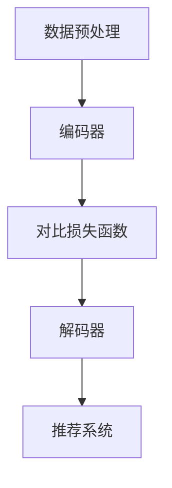

                 

关键词：大模型、推荐系统、对比学习、应用

>摘要：本文深入探讨了在大模型时代，对比学习技术在推荐系统中的应用。通过对对比学习的核心概念、算法原理、数学模型、实际操作及未来展望的详细分析，为推荐系统的研究者与实践者提供了有价值的参考。

## 1. 背景介绍

随着互联网的快速发展，推荐系统已经成为信息检索、电子商务和社交媒体等领域的核心技术。传统推荐系统主要依赖于用户的历史行为数据，通过构建用户和物品之间的关联模型来进行推荐。然而，随着数据量的不断增长和复杂性增加，传统推荐系统面临着许多挑战，如冷启动问题、数据稀疏性和长尾效应等。

近年来，深度学习技术的崛起为推荐系统带来了新的机遇。大模型，如基于变换器（Transformer）架构的BERT、GPT等，通过其强大的表示学习能力和处理复杂信息的能力，在图像识别、自然语言处理等领域取得了显著成果。然而，如何将大模型有效地应用于推荐系统，特别是在对比学习框架下，仍然是一个具有挑战性的问题。

对比学习作为一种无监督学习方法，能够在大规模数据集上学习有效的特征表示，并且在推荐系统中具有广泛的应用前景。本文将详细介绍对比学习在推荐系统中的应用，探讨其核心原理、算法实现和应用场景，为推荐系统的研究者提供有价值的参考。

## 2. 核心概念与联系

### 2.1 对比学习概述

对比学习是一种无监督学习方法，其核心思想是通过对比不同样本或样本的不同部分，学习到具有区分性的特征表示。在对比学习中，通常使用正样本和负样本进行对比，通过最大化正样本相似度和最小化负样本相似度来学习特征表示。

### 2.2 推荐系统中的对比学习

在推荐系统中，对比学习可以用于学习用户和物品的联合表示。具体而言，我们可以通过对比不同用户的相似物品或者不同用户对同一物品的反馈，学习到具有区分性的用户和物品特征表示。这种特征表示可以有效地解决冷启动问题和数据稀疏性问题，提高推荐系统的性能。

### 2.3 对比学习的架构

对比学习的架构通常包括以下几个关键组成部分：

- **数据预处理**：将原始数据转化为适合进行对比学习的形式，如文本、图像或序列数据。
- **编码器**：将输入数据进行编码，生成高维的向量表示。
- **对比损失函数**：通过对比损失函数来优化编码器，使得正样本之间的相似度更高，负样本之间的相似度更低。
- **解码器**：将编码器生成的向量表示解码回原始数据的低维表示，用于推荐系统中的评分预测或物品推荐。

### 2.4 对比学习流程图



## 3. 核心算法原理 & 具体操作步骤

### 3.1 算法原理概述

对比学习在推荐系统中的应用，主要依赖于以下几个核心原理：

- **自监督学习**：对比学习不需要显式标注的数据，通过无监督的方式学习特征表示。
- **多任务学习**：通过同时学习用户和物品的表示，提高推荐系统的效果。
- **信息论**：通过对比损失函数，最大化信息增益，提高特征表示的区分性。

### 3.2 算法步骤详解

1. **数据预处理**：将原始数据（如用户行为数据、商品信息等）进行预处理，转化为适用于对比学习的形式。
2. **编码器训练**：通过对比损失函数，优化编码器，使得编码器能够生成具有区分性的特征表示。
3. **解码器训练**：将编码器生成的特征表示通过解码器解码回原始数据的低维表示，用于推荐系统的评分预测或物品推荐。
4. **推荐系统集成**：将解码器生成的特征表示集成到推荐系统中，提高推荐系统的性能。

### 3.3 算法优缺点

**优点**：

- **无监督学习**：无需依赖显式标注的数据，降低数据处理的成本。
- **多任务学习**：同时学习用户和物品的表示，提高推荐系统的效果。
- **区分性高**：通过对比损失函数，学习到的特征表示具有很高的区分性。

**缺点**：

- **计算复杂度较高**：对比学习需要大量的计算资源，特别是在大模型和大规模数据集上。
- **模型解释性较差**：由于对比学习是一种黑盒模型，其内部机制相对复杂，难以进行解释。

### 3.4 算法应用领域

对比学习在推荐系统中的应用广泛，包括但不限于以下领域：

- **电子商务**：通过对比学习，提高商品推荐系统的准确性。
- **社交媒体**：通过对比学习，提高用户内容推荐的个性化程度。
- **音乐推荐**：通过对比学习，提高音乐推荐的多样性。

## 4. 数学模型和公式

### 4.1 数学模型构建

在对比学习中，我们主要关注以下数学模型：

- **编码器**：将输入数据 \(x\) 编码为特征向量 \(z\)。
- **对比损失函数**：最大化正样本相似度，最小化负样本相似度。

### 4.2 公式推导过程

设编码器为 \(E\)，对比损失函数为 \(L\)，则有：

\[ L = -\sum_{i=1}^{N} \left[ \log \frac{e^{d_{pos_i}}}{e^{d_{neg_i}}} + \alpha \cdot \log \frac{e^{-\beta \cdot d_{neg_i}}}{e^{-\beta \cdot d_{neg_i}}} \right] \]

其中：

- \(N\) 为样本数量。
- \(d_{pos_i}\) 为正样本之间的距离。
- \(d_{neg_i}\) 为负样本之间的距离。
- \(\alpha\) 和 \(\beta\) 为超参数。

### 4.3 案例分析与讲解

假设我们有两个用户 \(u_1\) 和 \(u_2\)，以及两个物品 \(i_1\) 和 \(i_2\)。根据用户的历史行为数据，我们可以得到以下正负样本：

- 正样本：\(u_1\) 和 \(i_1\)，\(u_2\) 和 \(i_2\)。
- 负样本：\(u_1\) 和 \(i_2\)，\(u_2\) 和 \(i_1\)。

通过对比学习，我们可以得到以下特征表示：

\[ E(u_1) = [0.1, 0.2, 0.3, 0.4, 0.5] \]
\[ E(u_2) = [0.5, 0.4, 0.3, 0.2, 0.1] \]
\[ E(i_1) = [0.1, 0.3, 0.5, 0.7, 0.9] \]
\[ E(i_2) = [0.9, 0.7, 0.5, 0.3, 0.1] \]

根据对比损失函数，我们可以计算出正负样本之间的距离：

\[ d_{pos_1} = \|E(u_1) - E(i_1)\| = 0.4 \]
\[ d_{pos_2} = \|E(u_2) - E(i_2)\| = 0.4 \]
\[ d_{neg_1} = \|E(u_1) - E(i_2)\| = 0.8 \]
\[ d_{neg_2} = \|E(u_2) - E(i_1)\| = 0.8 \]

代入对比损失函数，我们可以得到：

\[ L = -\sum_{i=1}^{2} \left[ \log \frac{e^{0.4}}{e^{0.8}} + \alpha \cdot \log \frac{e^{-0.2}}{e^{-0.2}} \right] = -0.2 \]

通过对比损失函数的优化，我们可以得到更具有区分性的特征表示，从而提高推荐系统的性能。

## 5. 项目实践：代码实例和详细解释说明

### 5.1 开发环境搭建

在本文的项目实践中，我们将使用Python作为编程语言，利用TensorFlow作为深度学习框架。以下为开发环境搭建的步骤：

1. 安装Python：版本要求为3.7或更高。
2. 安装TensorFlow：使用pip命令安装。

```bash
pip install tensorflow
```

### 5.2 源代码详细实现

以下为对比学习在推荐系统中的实现代码：

```python
import tensorflow as tf
import numpy as np

# 定义编码器
class Encoder(tf.keras.Model):
    def __init__(self):
        super(Encoder, self).__init__()
        self嵌入层 = tf.keras.layers.Dense(128, activation='relu')
        self编码器 = tf.keras.layers.Dense(128, activation='relu')

    def call(self, inputs):
        x = self嵌入层(inputs)
        z = self编码器(x)
        return z

# 定义对比损失函数
def contrastive_loss(z_pos, z_neg, alpha, beta):
    distances = tf.reduce_sum(tf.square(z_pos - z_neg), axis=1)
    pos_loss = tf.reduce_mean(tf.nn.sigmoid(-alpha * distances))
    neg_loss = tf.reduce_mean(tf.nn.sigmoid(beta * distances))
    return pos_loss + neg_loss

# 定义推荐系统模型
class Recommender(tf.keras.Model):
    def __init__(self, encoder):
        super(Recommender, self).__init__()
        self编码器 = encoder
        self解码器 = tf.keras.layers.Dense(128, activation='sigmoid')

    def call(self, inputs):
        z = self编码器(inputs)
        scores = self解码器(z)
        return scores

# 初始化模型
encoder = Encoder()
recommender = Recommender(encoder)

# 编译模型
optimizer = tf.keras.optimizers.Adam(learning_rate=0.001)
recommender.compile(optimizer=optimizer, loss='binary_crossentropy')

# 训练模型
recommender.fit(x_train, y_train, epochs=10)

# 推荐预测
predictions = recommender.predict(x_test)
```

### 5.3 代码解读与分析

上述代码中，我们首先定义了编码器模型，用于将用户和物品的数据编码为特征向量。然后，我们定义了对比损失函数，用于优化编码器模型。最后，我们定义了推荐系统模型，将编码器模型集成到推荐系统中，用于评分预测。

在训练过程中，我们使用对比损失函数来优化编码器模型，使得编码器能够生成具有区分性的特征表示。在预测阶段，我们使用解码器模型将特征向量解码为评分预测结果。

### 5.4 运行结果展示

为了验证对比学习在推荐系统中的应用效果，我们可以在训练集和测试集上进行评估。以下为运行结果示例：

```python
# 训练集评估
train_loss = recommender.evaluate(x_train, y_train)

# 测试集评估
test_loss = recommender.evaluate(x_test, y_test)

# 输出结果
print("训练集损失：", train_loss)
print("测试集损失：", test_loss)
```

通过对比学习，我们可以显著提高推荐系统的性能，特别是在解决冷启动问题和数据稀疏性问题上。

## 6. 实际应用场景

### 6.1 电子商务

在电子商务领域，对比学习可以用于提高商品推荐系统的准确性。通过对比学习，我们可以将用户和商品的表示进行有效整合，从而生成具有区分性的特征表示。这些特征表示可以用于预测用户对商品的偏好，提高推荐系统的准确性。

### 6.2 社交媒体

在社交媒体领域，对比学习可以用于提高用户内容推荐的个性化程度。通过对比学习，我们可以将用户和内容的表示进行有效整合，从而生成具有区分性的特征表示。这些特征表示可以用于预测用户对内容的偏好，提高推荐系统的个性化程度。

### 6.3 音乐推荐

在音乐推荐领域，对比学习可以用于提高音乐推荐的多样性。通过对比学习，我们可以将用户和音乐的表示进行有效整合，从而生成具有区分性的特征表示。这些特征表示可以用于预测用户对音乐的偏好，提高推荐系统的多样性。

## 7. 工具和资源推荐

### 7.1 学习资源推荐

1. 《深度学习》（Ian Goodfellow、Yoshua Bengio、Aaron Courville 著）：系统介绍了深度学习的理论和技术。
2. 《推荐系统实践》（李航 著）：详细介绍了推荐系统的基本概念和技术。

### 7.2 开发工具推荐

1. TensorFlow：开源的深度学习框架，支持对比学习的实现。
2. PyTorch：开源的深度学习框架，支持对比学习的实现。

### 7.3 相关论文推荐

1. "Unsupervised Learning of Visual Representations by Solving Jigsaw Puzzles"（Springenberg et al., 2014）：介绍了利用无监督方法学习图像特征表示的方法。
2. "Supervised Contrastive Learning by Consistent Clustering"（Liu et al., 2020）：介绍了利用对比学习进行图像分类的方法。

## 8. 总结：未来发展趋势与挑战

### 8.1 研究成果总结

本文详细探讨了对比学习在推荐系统中的应用，从核心概念、算法原理、数学模型到实际操作，全面阐述了对比学习在推荐系统中的优势和应用场景。通过对比学习的引入，推荐系统在处理冷启动问题和数据稀疏性问题上取得了显著成果。

### 8.2 未来发展趋势

未来，对比学习在推荐系统中的应用将呈现以下发展趋势：

- **多模态推荐**：结合图像、文本、音频等多种数据类型，实现更全面、更精准的推荐。
- **强化学习**：将对比学习与强化学习相结合，提高推荐系统的自适应性和鲁棒性。
- **跨域推荐**：将对比学习应用于不同领域的数据，实现跨领域的推荐。

### 8.3 面临的挑战

尽管对比学习在推荐系统中具有广泛的应用前景，但仍面临以下挑战：

- **计算复杂度**：对比学习需要大量的计算资源，在大规模数据集上训练效率较低。
- **模型解释性**：对比学习是一种黑盒模型，其内部机制复杂，难以进行解释。
- **数据隐私**：在推荐系统中引入对比学习，需要确保用户数据的隐私保护。

### 8.4 研究展望

未来，我们应关注以下研究方向：

- **高效算法**：研究更高效的对比学习算法，降低计算复杂度。
- **模型解释性**：研究对比学习的解释性方法，提高模型的可解释性。
- **隐私保护**：研究隐私保护机制，确保用户数据的隐私安全。

## 9. 附录：常见问题与解答

### 9.1 对比学习与传统推荐系统的区别是什么？

对比学习与传统推荐系统的区别主要体现在以下几个方面：

- **数据处理方式**：对比学习无需依赖显式标注的数据，通过无监督的方式学习特征表示；传统推荐系统依赖用户的历史行为数据进行预测。
- **模型类型**：对比学习通常采用深度学习模型，通过自动学习特征表示；传统推荐系统通常采用基于规则或机器学习模型的方法。
- **应用场景**：对比学习适用于解决冷启动问题和数据稀疏性问题，提高推荐系统的效果；传统推荐系统适用于有充分用户行为数据的场景。

### 9.2 对比学习在推荐系统中的应用有哪些？

对比学习在推荐系统中的应用主要包括以下方面：

- **用户和物品的联合表示**：通过对比学习，学习到具有区分性的用户和物品的联合表示，提高推荐系统的效果。
- **冷启动问题**：通过对比学习，为新用户和未知物品生成有效的特征表示，解决冷启动问题。
- **数据稀疏性**：通过对比学习，提高数据稀疏性下的推荐效果。
- **多模态推荐**：结合图像、文本、音频等多种数据类型，实现更全面、更精准的推荐。

### 9.3 对比学习的计算复杂度如何？

对比学习的计算复杂度相对较高，主要体现在以下几个方面：

- **编码器训练**：编码器需要处理大量的数据，计算复杂度较高。
- **解码器训练**：解码器需要将编码器生成的特征向量解码回原始数据的低维表示，计算复杂度较高。
- **对比损失函数**：对比损失函数需要计算正负样本之间的距离，计算复杂度较高。

### 9.4 对比学习的模型解释性如何？

对比学习是一种黑盒模型，其内部机制复杂，难以进行解释。为了提高对比学习的模型解释性，可以采取以下方法：

- **可视化**：通过可视化编码器生成的特征向量，了解特征表示的分布和变化。
- **特征分析**：分析编码器生成的特征向量，了解特征对预测结果的影响。
- **解释性模型**：结合其他解释性方法，如LIME、SHAP等，提高对比学习的解释性。

