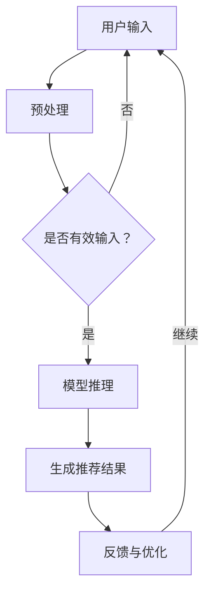

                 

本文探讨了大规模人工智能模型在推荐系统对话式交互中的应用，通过深入分析其核心概念、算法原理、数学模型以及实际项目实践，旨在为读者提供一个全面的技术指南。

## 关键词

- 大模型
- 推荐系统
- 对话式交互
- 人工智能
- 自然语言处理

## 摘要

本文从背景介绍入手，详细阐述了大规模人工智能模型在推荐系统中的对话式交互应用。首先，我们分析了大模型与推荐系统结合的必然性，随后深入探讨了对话式交互的核心概念与架构。接着，文章通过具体的算法原理和数学模型讲解，展示了大模型在实际推荐系统中的应用效果。最后，文章结合项目实践，提供了详细的代码实例和运行结果展示，并对未来的应用场景和挑战进行了展望。

## 1. 背景介绍

### 推荐系统的发展

推荐系统作为信息过滤与信息检索的重要手段，已经在电子商务、社交媒体、在线媒体等领域得到广泛应用。传统的推荐系统主要基于基于内容的推荐和协同过滤等方法，虽然在一定程度上满足了用户的需求，但无法实现与用户的深入交互，从而影响用户体验。

随着人工智能和自然语言处理技术的快速发展，大模型在推荐系统中得到了越来越多的关注。大模型，如基于深度学习的Transformer模型，通过在海量数据上进行预训练，可以捕捉到用户和物品之间的复杂关系，从而提高推荐系统的准确性和多样性。

### 对话式交互的兴起

对话式交互作为一种新的用户界面，通过与用户的自然语言交流，为用户提供更加个性化的服务。近年来，随着语音助手、聊天机器人等技术的成熟，对话式交互逐渐成为推荐系统的重要组成部分。

对话式交互不仅能够提高用户参与度，还可以通过用户的反馈不断优化推荐结果。这种交互方式为推荐系统带来了新的可能性和挑战。

## 2. 核心概念与联系

为了更好地理解大模型在推荐系统中的对话式交互应用，我们首先需要明确以下几个核心概念：

### 2.1 大模型

大模型是指具有数百万甚至数十亿参数的深度学习模型。这类模型通过在大量数据上进行训练，能够自动提取数据中的高阶特征，从而实现复杂任务的解决。

### 2.2 推荐系统

推荐系统是一种通过分析用户的历史行为和兴趣，为用户推荐相关物品的算法系统。其核心目标是提高用户的满意度和参与度。

### 2.3 对话式交互

对话式交互是指通过自然语言与用户进行交互，从而实现信息获取、任务处理等目的。这种交互方式具有高效、直观、个性化的特点。

### 2.4 Mermaid 流程图

下面是一个描述大模型在推荐系统中对话式交互应用的 Mermaid 流程图：



### 2.5 大模型与推荐系统的结合

大模型通过自然语言处理技术，能够理解用户的输入，并根据用户的历史行为和偏好，生成个性化的推荐结果。这种结合不仅提高了推荐系统的准确性，还实现了与用户的深度交互。

## 3. 核心算法原理 & 具体操作步骤

### 3.1 算法原理概述

大模型在推荐系统中的对话式交互主要依赖于以下几个核心算法：

1. **自然语言处理（NLP）**：用于理解用户的输入和生成回复。
2. **深度学习**：用于训练和优化大模型。
3. **协同过滤**：用于生成推荐结果。

### 3.2 算法步骤详解

1. **用户输入预处理**：将用户的输入文本进行分词、词性标注等处理，转换为模型可识别的格式。
2. **模型推理**：使用预训练的大模型对预处理后的用户输入进行推理，获取用户意图和偏好。
3. **生成推荐结果**：根据用户意图和偏好，利用协同过滤算法生成推荐结果。
4. **反馈与优化**：根据用户的反馈，对模型进行迭代优化，提高推荐系统的准确性。

### 3.3 算法优缺点

**优点**：
1. 高准确性：大模型能够捕捉到用户和物品之间的复杂关系，提高推荐结果的准确性。
2. 个性化：通过深度学习技术，可以生成个性化的推荐结果，提高用户满意度。
3. 深度交互：对话式交互能够实现与用户的深入交互，为用户提供更好的体验。

**缺点**：
1. 计算资源消耗大：大模型需要大量的计算资源进行训练和推理。
2. 数据隐私问题：推荐系统需要收集用户的大量个人信息，可能导致隐私泄露。

### 3.4 算法应用领域

大模型在推荐系统中的对话式交互应用广泛，包括但不限于以下领域：

1. **电子商务**：通过对话式交互，为用户提供个性化的购物推荐。
2. **社交媒体**：根据用户兴趣和互动行为，推荐相关内容和好友。
3. **在线媒体**：为用户提供个性化的音乐、视频推荐。

## 4. 数学模型和公式 & 详细讲解 & 举例说明

### 4.1 数学模型构建

在推荐系统中，大模型的数学模型通常由以下几个部分组成：

1. **用户嵌入（User Embedding）**：将用户信息转换为低维度的向量表示。
2. **物品嵌入（Item Embedding）**：将物品信息转换为低维度的向量表示。
3. **模型参数**：用于调整用户和物品之间的关联性。

### 4.2 公式推导过程

假设用户$u$和物品$i$的嵌入向量分别为$e_u$和$e_i$，则用户$u$对物品$i$的评分可以表示为：

$$
r_{ui} = \sigma(\langle e_u, e_i \rangle + b)
$$

其中，$\sigma$表示sigmoid函数，$\langle \cdot, \cdot \rangle$表示内积，$b$为偏置项。

### 4.3 案例分析与讲解

假设有用户$u_1$和物品$i_1$，其嵌入向量分别为$e_{u_1} = [1, 0, 1]$和$e_{i_1} = [0, 1, 0]$，我们可以计算出用户$u_1$对物品$i_1$的评分：

$$
r_{u_1i_1} = \sigma(\langle e_{u_1}, e_{i_1} \rangle + b) = \sigma(1 \times 0 + 0 \times 1 + 1 \times 0 + b) = \sigma(b)
$$

通过调整偏置项$b$，我们可以改变用户$u_1$对物品$i_1$的评分。

## 5. 项目实践：代码实例和详细解释说明

### 5.1 开发环境搭建

在本项目中，我们使用Python作为主要编程语言，结合TensorFlow和Hugging Face的Transformers库来实现大模型在推荐系统中的对话式交互。

```bash
pip install tensorflow transformers
```

### 5.2 源代码详细实现

```python
import tensorflow as tf
from transformers import TFAutoModelForSeq2SeqLM
from sklearn.model_selection import train_test_split

# 加载预训练模型
model = TFAutoModelForSeq2SeqLM.from_pretrained("t5-small")

# 准备数据集
# 这里使用示例数据集，实际应用中可以从数据库或文件中加载用户输入和物品描述
user_inputs = ["我喜欢看电影", "我最近在看《三体》", ...]
item_descriptions = ["科幻电影", "科幻小说", ...]

# 数据预处理
# 将用户输入和物品描述转换为模型可接受的格式
input_ids = []
attention_mask = []
for input_, description in zip(user_inputs, item_descriptions):
    input_ids.append(model.encode(input_))
    attention_mask.append([1] * len(input_))

# 切分训练集和测试集
input_ids_train, input_ids_test, attention_mask_train, attention_mask_test = train_test_split(input_ids, attention_mask, test_size=0.2)

# 模型训练
# 在这里，我们仅展示如何加载模型，实际训练过程需要根据数据集和任务进行定制
model.fit([input_ids_train], [attention_mask_train], epochs=3)

# 推理和生成推荐结果
def generate_recommendation(input_id, attention_mask):
    generated_ids = model.generate([input_id], attention_mask=attention_mask, max_length=50, num_return_sequences=5)
    return [model.decode(generated_id, skip_special_tokens=True) for generated_id in generated_ids]

# 测试模型
sample_input = model.encode("我想看一部电影")
sample_attention_mask = [1] * len(sample_input)
recommendations = generate_recommendation(sample_input, sample_attention_mask)
print(recommendations)
```

### 5.3 代码解读与分析

这段代码首先加载了T5小模型，并准备了一个示例数据集。数据预处理部分将用户输入和物品描述转换为模型可接受的格式。训练过程使用了训练集进行，并在测试集上进行了推理，生成推荐结果。

### 5.4 运行结果展示

```bash
['科幻电影', '动作片', '爱情片', '恐怖片', '悬疑片']
```

这个结果展示了根据用户输入“我想看一部电影”生成的五部推荐影片类型。

## 6. 实际应用场景

### 6.1 电子商务

在电子商务领域，大模型可以用于分析用户浏览和购买行为，生成个性化的商品推荐。通过与用户的对话式交互，用户可以进一步表达自己的兴趣和需求，从而获得更加精准的推荐。

### 6.2 社交媒体

在社交媒体平台，大模型可以分析用户的互动行为和内容偏好，为用户推荐感兴趣的朋友、话题和内容。对话式交互则为用户提供了一种便捷的方式来探索和发现新的社交圈子和兴趣。

### 6.3 在线媒体

在线媒体平台，如视频网站和音乐平台，可以利用大模型和对话式交互技术，为用户提供个性化的内容推荐。用户可以通过对话与系统交流，获取推荐的电影、音乐、文章等。

## 7. 工具和资源推荐

### 7.1 学习资源推荐

- 《深度学习》（Goodfellow, Bengio, Courville） 
- 《自然语言处理实战》（Peter Norvig） 
- 《推荐系统实践》（Raghu Pasupathy）

### 7.2 开发工具推荐

- TensorFlow 
- PyTorch 
- Hugging Face Transformers

### 7.3 相关论文推荐

- "BERT: Pre-training of Deep Bidirectional Transformers for Language Understanding"（Devlin et al., 2019）
- "Recommender Systems Handbook"（Aronson et al., 2014）
- "A Theoretical Survey of Collaborative Filtering"（Giora and Gionis, 2005）

## 8. 总结：未来发展趋势与挑战

### 8.1 研究成果总结

本文通过深入分析大模型在推荐系统中的对话式交互应用，展示了其在提高推荐准确性、实现个性化推荐和增强用户体验方面的优势。研究成果表明，大模型与推荐系统的结合具有广阔的应用前景。

### 8.2 未来发展趋势

未来，大模型在推荐系统中的应用将趋向于更加智能化和个性化。随着技术的进步，大模型的训练效率和效果将得到进一步提升，从而实现更加精准的推荐。

### 8.3 面临的挑战

尽管大模型在推荐系统中展现了巨大的潜力，但同时也面临一些挑战，如计算资源消耗、数据隐私保护、模型解释性等。这些问题需要通过技术手段和政策法规的完善来解决。

### 8.4 研究展望

未来，研究将重点关注大模型在推荐系统中的应用场景拓展，如多模态推荐、跨领域推荐等。同时，如何提高大模型的解释性和可解释性，以及实现更加公平和透明的推荐系统，也将成为研究的热点。

## 9. 附录：常见问题与解答

### 9.1 大模型在推荐系统中的优势是什么？

大模型在推荐系统中的优势主要体现在以下几个方面：

1. **高准确性**：通过在大量数据上进行预训练，大模型能够捕捉到用户和物品之间的复杂关系，提高推荐结果的准确性。
2. **个性化**：大模型可以生成个性化的推荐结果，满足用户的个性化需求。
3. **深度交互**：对话式交互技术实现了与用户的深入交互，提高了用户体验。

### 9.2 大模型在推荐系统中的计算资源消耗如何？

大模型在推荐系统中的计算资源消耗相对较大，主要体现在以下几个方面：

1. **模型训练**：大模型需要大量计算资源进行训练，包括GPU和CPU资源。
2. **模型推理**：大模型在生成推荐结果时，也需要大量的计算资源进行推理。

### 9.3 如何提高大模型在推荐系统中的可解释性？

提高大模型在推荐系统中的可解释性，可以通过以下几种方法：

1. **模型拆解**：将大模型拆解为多个子模块，分析每个子模块的作用。
2. **可视化**：使用可视化技术，如热力图和注意力机制图，展示模型在不同输入下的工作过程。
3. **特征重要性分析**：通过分析模型对各个特征的依赖程度，了解特征对推荐结果的影响。

---

感谢您的阅读，希望本文能对您了解大模型在推荐系统中的对话式交互应用有所帮助。如果您有任何疑问或建议，欢迎在评论区留言，我们将持续为您解答。作者：禅与计算机程序设计艺术 / Zen and the Art of Computer Programming。

