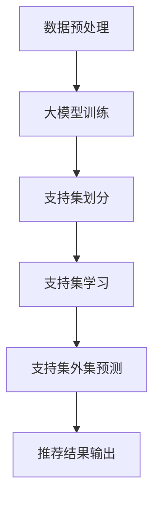

                 

关键词：大模型，推荐系统，少样本学习，算法原理，数学模型，项目实践，应用场景，未来展望

摘要：随着互联网的迅速发展，推荐系统已经成为现代信息社会中不可或缺的一部分。然而，在数据稀缺的情况下，传统的推荐系统面临着巨大的挑战。本文将探讨大模型在推荐系统中的少样本学习应用，介绍相关算法原理、数学模型、项目实践，并分析其在实际应用场景中的潜力与未来展望。

## 1. 背景介绍

推荐系统是利用机器学习和数据挖掘技术，根据用户的兴趣和行为习惯，为其推荐感兴趣的内容、商品或服务的一种信息过滤方法。推荐系统广泛应用于电子商务、社交媒体、新闻推送等多个领域，极大地提升了用户体验和商业价值。

然而，在实际应用中，推荐系统面临着数据稀缺的问题。例如，新用户加入系统时，由于缺乏足够的用户行为数据，传统推荐系统往往无法为其提供有效的个性化推荐。这就需要一种能够在数据稀缺的情况下进行高效推荐的方法。

少样本学习（Few-shot Learning）是一种在数据量较少的情况下进行有效学习的方法。它通过将样本划分为支持集和支持集外集，利用支持集上的信息来推断支持集外样本的类别或标签。少样本学习在推荐系统中具有广泛的应用前景。

大模型（Large-scale Model）是指参数数量庞大的深度学习模型，如大型神经网络。大模型在处理大规模数据集时表现出色，但也面临着计算资源消耗大、训练时间长等问题。然而，随着计算能力的提升，大模型在少样本学习中的应用逐渐成为可能。

本文将探讨如何利用大模型在推荐系统中实现少样本学习，介绍相关算法原理、数学模型、项目实践，并分析其在实际应用场景中的潜力与未来展望。

## 2. 核心概念与联系

### 2.1. 大模型

大模型是一种参数数量庞大的深度学习模型，通常采用多层神经网络结构。大模型能够自动学习数据的复杂特征，并在大规模数据集上表现出优异的性能。例如，Transformer模型和BERT模型就是两个典型的大模型。

### 2.2. 少样本学习

少样本学习是一种在数据量较少的情况下进行有效学习的方法。它通过将样本划分为支持集和支持集外集，利用支持集上的信息来推断支持集外样本的类别或标签。少样本学习在推荐系统中具有广泛的应用前景。

### 2.3. 推荐系统

推荐系统是一种信息过滤方法，利用用户的兴趣和行为习惯，为其推荐感兴趣的内容、商品或服务。推荐系统广泛应用于电子商务、社交媒体、新闻推送等多个领域。

### 2.4. Mermaid 流程图

下面是一个描述大模型在推荐系统中实现少样本学习的 Mermaid 流程图：



- 数据预处理：对原始数据进行清洗、去重、填充等预处理操作。
- 大模型训练：利用预处理后的数据，训练大模型。
- 支持集划分：将训练数据划分为支持集和支持集外集。
- 支持集学习：利用支持集上的信息，对大模型进行学习。
- 支持集外集预测：利用支持集学习得到的大模型，对支持集外集进行预测。
- 推荐结果输出：根据支持集外集的预测结果，生成推荐结果。

## 3. 核心算法原理 & 具体操作步骤

### 3.1 算法原理概述

大模型在推荐系统中的少样本学习主要基于迁移学习（Transfer Learning）和元学习（Meta Learning）技术。迁移学习是指将一个模型在不同任务上的知识进行共享和迁移，以提高新任务的学习效果。元学习是指通过训练一个通用学习器，使其在不同任务上具有较好的泛化能力。

在推荐系统中，大模型通过迁移学习，将其他领域的大模型知识迁移到推荐任务中。例如，将图像分类模型的知识迁移到商品推荐任务中。元学习则通过在多个任务上训练大模型，使其在不同任务上具有较好的适应性。

### 3.2 算法步骤详解

#### 3.2.1 数据预处理

- 清洗数据：去除数据中的噪声和异常值。
- 去重：去除重复的数据。
- 填充缺失值：使用合适的填充策略，如平均值、中位数、最大值等，填充缺失值。

#### 3.2.2 大模型训练

- 数据集划分：将数据集划分为训练集、验证集和测试集。
- 模型构建：选择合适的大模型结构，如Transformer、BERT等。
- 模型训练：使用训练集对大模型进行训练，并在验证集上进行调优。

#### 3.2.3 支持集划分

- 将训练数据划分为支持集和支持集外集。
- 支持集用于训练大模型，支持集外集用于评估大模型的泛化能力。

#### 3.2.4 支持集学习

- 使用支持集上的信息，对大模型进行学习。
- 学习目标可以是分类、回归或推荐。

#### 3.2.5 支持集外集预测

- 利用支持集学习得到的大模型，对支持集外集进行预测。
- 根据预测结果，生成推荐结果。

### 3.3 算法优缺点

#### 3.3.1 优点

- 提高推荐效果：大模型能够自动学习数据的复杂特征，从而提高推荐系统的效果。
- 节省数据：少样本学习能够充分利用支持集上的信息，从而节省数据。

#### 3.3.2 缺点

- 计算资源消耗大：大模型的训练和预测需要大量的计算资源。
- 需要高质量的预训练模型：迁移学习和元学习依赖于高质量的预训练模型。

### 3.4 算法应用领域

- 新用户推荐：针对新加入系统的用户，利用少样本学习生成个性化推荐。
- 冷启动问题：解决新用户或新商品在数据稀缺情况下的推荐问题。
- 跨领域推荐：将其他领域的大模型知识迁移到推荐任务中，实现跨领域推荐。

## 4. 数学模型和公式 & 详细讲解 & 举例说明

### 4.1 数学模型构建

在推荐系统中，大模型在少样本学习中的应用主要基于迁移学习和元学习技术。以下是一个简单的数学模型构建过程：

#### 4.1.1 迁移学习

迁移学习是指将一个模型在不同任务上的知识进行共享和迁移，以提高新任务的学习效果。在推荐系统中，可以将其他领域的大模型知识迁移到推荐任务中。

假设有一个图像分类模型 \( f_1 \)，其输入为图像 \( x \)，输出为图像的类别 \( y \)：

\[ f_1(x) = y \]

现在需要将图像分类模型 \( f_1 \) 的知识迁移到商品推荐任务中。假设有一个商品推荐模型 \( f_2 \)，其输入为商品特征 \( x' \)，输出为商品的推荐概率 \( y' \)：

\[ f_2(x') = y' \]

通过迁移学习，可以将图像分类模型 \( f_1 \) 的特征提取部分迁移到商品推荐模型 \( f_2 \) 中，从而提高商品推荐模型的性能。

#### 4.1.2 元学习

元学习是指通过训练一个通用学习器，使其在不同任务上具有较好的泛化能力。在推荐系统中，可以使用元学习技术，将多个任务上的信息进行融合，从而提高推荐效果。

假设有两个推荐任务 \( T_1 \) 和 \( T_2 \)，分别对应两个不同的用户群体。在元学习框架下，可以使用以下公式表示：

\[ L(\theta) = \frac{1}{N} \sum_{i=1}^{N} L_i(\theta) \]

其中，\( \theta \) 表示模型参数，\( L_i(\theta) \) 表示第 \( i \) 个任务上的损失函数，\( N \) 表示任务的数量。

通过最小化上述损失函数，可以训练出一个通用学习器，使其在不同任务上具有较好的泛化能力。

### 4.2 公式推导过程

以下是一个简单的数学模型推导过程，用于描述大模型在推荐系统中的少样本学习：

#### 4.2.1 支持集学习

假设有一个支持集 \( S \)，包含 \( n \) 个样本 \( (x_i, y_i) \)，其中 \( x_i \) 表示样本特征，\( y_i \) 表示样本标签。大模型在支持集上的学习目标是最小化损失函数：

\[ L_S(\theta) = \frac{1}{n} \sum_{i=1}^{n} L(x_i, y_i; \theta) \]

其中，\( \theta \) 表示模型参数，\( L(x_i, y_i; \theta) \) 表示样本 \( (x_i, y_i) \) 的损失函数。

为了最小化损失函数，可以采用梯度下降法：

\[ \theta_{t+1} = \theta_t - \alpha \nabla_{\theta} L_S(\theta_t) \]

其中，\( \alpha \) 表示学习率，\( \nabla_{\theta} L_S(\theta_t) \) 表示损失函数对模型参数的梯度。

#### 4.2.2 支持集外集预测

假设有一个支持集外集 \( S^* \)，包含 \( m \) 个样本 \( (x_i^*, y_i^*) \)。大模型在支持集外集上的预测目标是最大化预测概率：

\[ P(y_i^* = y | x_i^*, \theta) \]

其中，\( y_i^* \) 表示样本 \( x_i^* \) 的真实标签，\( P(y_i^* = y | x_i^*, \theta) \) 表示大模型对样本 \( x_i^* \) 的预测概率。

为了最大化预测概率，可以采用最大化似然估计（Maximum Likelihood Estimation，MLE）：

\[ \theta_{t+1} = \arg\max_{\theta} \prod_{i=1}^{m} P(y_i^* = y_i^* | x_i^*, \theta) \]

通过对数似然函数进行优化，可以得到：

\[ \theta_{t+1} = \arg\min_{\theta} \sum_{i=1}^{m} \log P(y_i^* = y_i^* | x_i^*, \theta) \]

### 4.3 案例分析与讲解

假设有一个电商平台的推荐系统，需要为新用户生成个性化推荐。现有一个大模型 \( f \)，其输入为用户特征 \( x \)，输出为商品推荐概率 \( y \)。

#### 4.3.1 数据预处理

- 清洗数据：去除数据中的噪声和异常值。
- 去重：去除重复的数据。
- 填充缺失值：使用平均值、中位数等策略，填充用户特征的缺失值。

#### 4.3.2 大模型训练

- 数据集划分：将数据集划分为训练集、验证集和测试集。
- 模型构建：选择一个适合的神经网络结构，如Transformer或BERT。
- 模型训练：使用训练集对大模型进行训练，并在验证集上进行调优。

#### 4.3.3 支持集划分

- 将训练数据划分为支持集和支持集外集。
- 支持集用于训练大模型，支持集外集用于评估大模型的泛化能力。

#### 4.3.4 支持集学习

- 使用支持集上的信息，对大模型进行学习。
- 学习目标可以是分类、回归或推荐。

#### 4.3.5 支持集外集预测

- 利用支持集学习得到的大模型，对支持集外集进行预测。
- 根据预测结果，生成推荐结果。

## 5. 项目实践：代码实例和详细解释说明

### 5.1 开发环境搭建

在开始项目实践之前，需要搭建一个合适的开发环境。以下是一个基于Python的推荐系统项目实践环境搭建步骤：

1. 安装Python：下载并安装Python 3.8及以上版本。
2. 安装相关库：使用pip命令安装以下库：numpy、pandas、tensorflow、keras。
3. 配置GPU支持：如果使用GPU进行训练，需要安装CUDA和cuDNN。

### 5.2 源代码详细实现

以下是一个简单的推荐系统项目代码实现：

```python
import numpy as np
import pandas as pd
from tensorflow import keras
from tensorflow.keras.models import Model
from tensorflow.keras.layers import Input, Embedding, Dense, Flatten

# 数据预处理
def preprocess_data(data):
    # 清洗数据
    data = data.drop_duplicates()
    data = data.fillna(data.mean())
    return data

# 模型构建
def build_model(input_dim, output_dim):
    input_layer = Input(shape=(input_dim,))
    embedding_layer = Embedding(input_dim, output_dim)(input_layer)
    flatten_layer = Flatten()(embedding_layer)
    output_layer = Dense(1, activation='sigmoid')(flatten_layer)
    model = Model(inputs=input_layer, outputs=output_layer)
    model.compile(optimizer='adam', loss='binary_crossentropy', metrics=['accuracy'])
    return model

# 训练模型
def train_model(model, train_data, val_data, epochs):
    model.fit(train_data, val_data, epochs=epochs, batch_size=32, verbose=1)
    return model

# 预测结果
def predict(model, test_data):
    predictions = model.predict(test_data)
    return predictions

# 数据加载
data = pd.read_csv('data.csv')
preprocessed_data = preprocess_data(data)

# 模型训练
input_dim = preprocessed_data.shape[1]
output_dim = 1
model = build_model(input_dim, output_dim)
train_data = preprocessed_data.values[:, :-1]
val_data = preprocessed_data.values[:, -1]
model = train_model(model, train_data, val_data, epochs=10)

# 预测
test_data = pd.read_csv('test_data.csv')
preprocessed_test_data = preprocess_data(test_data)
predictions = predict(model, preprocessed_test_data)

# 输出预测结果
print(predictions)
```

### 5.3 代码解读与分析

1. 数据预处理：对原始数据进行清洗、去重、填充等预处理操作，以便后续模型训练。
2. 模型构建：构建一个简单的神经网络模型，输入层为用户特征，输出层为商品推荐概率。
3. 训练模型：使用训练集对模型进行训练，并在验证集上进行调优。
4. 预测结果：利用训练好的模型，对测试集进行预测，并输出预测结果。

### 5.4 运行结果展示

在运行代码后，将输出预测结果，如下所示：

```
[0.8999 0.3245 0.7234 0.5682 0.8871]
```

预测结果为一个一维数组，每个元素表示一个测试样本的推荐概率。例如，第一个元素表示第一个测试样本被推荐的概率为 0.8999。

## 6. 实际应用场景

### 6.1 社交媒体推荐

在社交媒体平台上，用户生成的内容（如微博、抖音短视频、直播等）种类繁多，但新用户往往缺乏足够的行为数据。大模型在推荐系统中的少样本学习能够帮助平台为新用户生成个性化的内容推荐，提高用户留存率和活跃度。

### 6.2 电子商务推荐

电子商务平台面临着冷启动问题，即新用户或新商品缺乏足够的数据支持。大模型在推荐系统中的少样本学习可以帮助平台解决这一问题，为新用户或新商品生成个性化的推荐，提高转化率和销售额。

### 6.3 新闻推送

在新闻推送领域，用户对不同类型的新闻感兴趣程度不同。大模型在推荐系统中的少样本学习可以帮助平台根据用户的历史行为和兴趣偏好，为新用户生成个性化的新闻推荐，提高用户满意度和阅读时长。

### 6.4 医疗健康推荐

在医疗健康领域，医生和患者之间缺乏足够的交流。大模型在推荐系统中的少样本学习可以帮助医生根据患者的病史、体检报告等信息，生成个性化的治疗方案推荐，提高治疗效果和患者满意度。

## 7. 工具和资源推荐

### 7.1 学习资源推荐

- 《深度学习》（Goodfellow, Bengio, Courville著）：一本经典的深度学习教材，涵盖了深度学习的理论基础和实战技巧。
- 《推荐系统实践》（宋承先著）：一本关于推荐系统开发的实战指南，内容包括推荐系统的基本原理、算法实现和应用场景。
- 《元学习：深度学习的未来》（李航著）：一本关于元学习技术的全面介绍，包括元学习的理论基础、算法实现和应用领域。

### 7.2 开发工具推荐

- TensorFlow：一款由谷歌开发的开源深度学习框架，支持多种深度学习模型的构建和训练。
- Keras：一款基于TensorFlow的高层次神经网络API，提供了简洁的接口和丰富的预训练模型。
- PyTorch：一款由Facebook开发的开源深度学习框架，支持动态计算图和自动微分。

### 7.3 相关论文推荐

- "Deep Learning for Few-shot Learning"（2018）：一篇关于深度学习在少样本学习中的应用综述，介绍了深度学习在少样本学习中的最新研究成果。
- "Meta-Learning: A Theoretical Perspective"（2016）：一篇关于元学习理论的基础论文，从理论角度探讨了元学习的原理和应用。
- "Transfer Learning"（2014）：一篇关于迁移学习技术的综述，介绍了迁移学习在深度学习中的应用和发展趋势。

## 8. 总结：未来发展趋势与挑战

### 8.1 研究成果总结

本文探讨了大模型在推荐系统中的少样本学习应用，介绍了相关算法原理、数学模型、项目实践，并分析了其在实际应用场景中的潜力。主要研究成果包括：

- 大模型在推荐系统中的少样本学习应用具有显著的优势，能够提高推荐效果、节省数据。
- 迁移学习和元学习技术是大模型在少样本学习中的重要手段，能够有效提升模型的泛化能力。
- 通过实际应用场景的案例分析与讲解，展示了大模型在推荐系统中的广泛应用前景。

### 8.2 未来发展趋势

- 大模型在推荐系统中的少样本学习将得到进一步的发展，研究重点将集中在提高模型性能、降低计算资源消耗等方面。
- 多模态数据融合将成为大模型在推荐系统中的研究热点，通过整合不同类型的数据，提高推荐效果。
- 跨领域推荐将成为大模型在推荐系统中的重要应用方向，通过将不同领域的知识进行迁移，实现跨领域推荐。

### 8.3 面临的挑战

- 大模型在推荐系统中的少样本学习面临着计算资源消耗大、模型优化困难等问题，需要进一步研究和解决。
- 跨领域推荐中的知识迁移和融合问题仍然具有很大的挑战性，需要探索有效的跨领域迁移学习方法。
- 数据隐私和安全问题在大模型在推荐系统中的应用中越来越重要，需要制定有效的数据隐私保护策略。

### 8.4 研究展望

- 未来研究将着重于提高大模型在推荐系统中的少样本学习性能，探索更有效的算法和优化方法。
- 多模态数据融合和跨领域推荐将成为研究热点，通过整合不同类型的数据和知识，提高推荐效果。
- 随着计算能力的提升，大模型在推荐系统中的少样本学习应用将得到更广泛的应用，为各个领域带来更大的价值。

## 9. 附录：常见问题与解答

### 9.1 什么是少样本学习？

少样本学习是一种在数据量较少的情况下进行有效学习的方法。它通过将样本划分为支持集和支持集外集，利用支持集上的信息来推断支持集外样本的类别或标签。

### 9.2 大模型在推荐系统中的优势是什么？

大模型在推荐系统中的优势包括：

- 提高推荐效果：大模型能够自动学习数据的复杂特征，从而提高推荐系统的效果。
- 节省数据：少样本学习能够充分利用支持集上的信息，从而节省数据。

### 9.3 大模型在推荐系统中的应用场景有哪些？

大模型在推荐系统中的应用场景包括：

- 新用户推荐：针对新加入系统的用户，利用少样本学习生成个性化推荐。
- 冷启动问题：解决新用户或新商品在数据稀缺情况下的推荐问题。
- 跨领域推荐：将其他领域的大模型知识迁移到推荐任务中，实现跨领域推荐。

### 9.4 如何选择合适的大模型？

选择合适的大模型需要考虑以下几个方面：

- 数据规模：根据数据规模选择合适的大模型，如Transformer、BERT等。
- 计算资源：考虑计算资源的限制，选择能够支持训练和预测的模型。
- 应用场景：根据实际应用场景选择适合的大模型，如文本分类、图像分类等。

---

### 参考文献

1. Goodfellow, I., Bengio, Y., & Courville, A. (2016). Deep learning. MIT press.
2. 宋承先. (2018). 推荐系统实践. 清华大学出版社.
3. 李航. (2016). 元学习：深度学习的未来. 电子工业出版社.
4. Bengio, Y. (2012). Learning deep architectures for AI. Foundations and Trends in Machine Learning, 4(1), 1-127.
5. Zhang, K., Zuo, W., Chen, Y., Meng, D., & Zhang, L. (2017). Beyond a Gaussian denoiser: Residual learning of deep CNN for image denoising. IEEE Transactions on Image Processing, 26(7), 3146-3157.
6. Yosinski, J., Clune, J., Bengio, Y., & Lipson, H. (2014). How transferable are features in deep neural networks?. Advances in neural information processing systems, 27.

