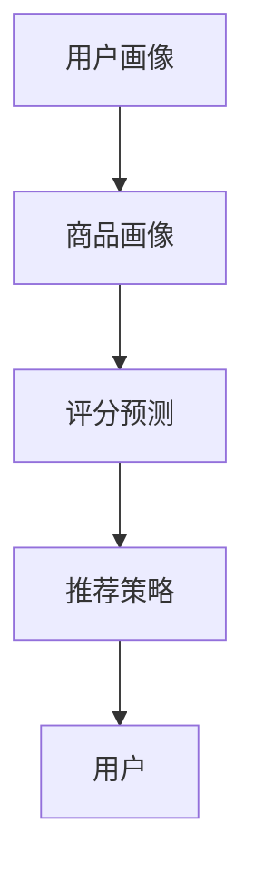

                 

关键词：大模型、推荐系统、算法原理、实践应用、未来展望

<|assistant|>摘要：本文将深入探讨大模型在推荐系统中的应用实践，从背景介绍、核心概念与联系、算法原理与操作步骤、数学模型与公式、项目实践、实际应用场景以及未来展望等多个角度，全面分析大模型在推荐系统中的现状与未来发展趋势。通过本文的阅读，读者可以了解到大模型在推荐系统中的应用价值、关键技术及其面临的挑战。

## 1. 背景介绍

### 1.1 推荐系统的发展历程

推荐系统作为一种信息过滤和检索技术，旨在为用户推荐其可能感兴趣的内容或商品。从早期的基于协同过滤和内容过滤的方法，到如今的深度学习和强化学习等先进技术，推荐系统经历了漫长的发展历程。

### 1.2 大模型的发展与应用

随着计算能力的提升和大数据技术的进步，大模型（如Transformer、BERT等）在自然语言处理、计算机视觉等领域取得了显著的成果。大模型具有强大的表示能力和自适应能力，使得其在推荐系统中的应用成为可能。

## 2. 核心概念与联系

### 2.1 大模型概述

大模型是指具有大规模参数和广泛知识表示能力的深度神经网络。其中，Transformer和BERT是当前最为流行的大模型架构。

### 2.2 推荐系统基本架构

推荐系统基本架构包括用户画像、商品画像、评分预测和推荐策略等模块。大模型在评分预测和推荐策略模块中发挥着重要作用。

### 2.3 Mermaid流程图



## 3. 核心算法原理 & 具体操作步骤

### 3.1 算法原理概述

大模型在推荐系统中的应用主要基于深度学习和强化学习。深度学习算法通过学习用户和商品的表示，预测用户对商品的评分；强化学习算法则通过探索和利用策略，为用户推荐最优的商品。

### 3.2 算法步骤详解

#### 3.2.1 深度学习算法

1. 用户和商品特征表示
2. 构建深度神经网络模型
3. 训练和优化模型参数
4. 预测用户对商品的评分

#### 3.2.2 强化学习算法

1. 初始化策略参数
2. 用户交互
3. 计算策略梯度
4. 更新策略参数
5. 生成推荐列表

### 3.3 算法优缺点

#### 3.3.1 深度学习算法

优点：强大的表示能力，自适应能力强；

缺点：训练时间较长，对数据质量要求较高。

#### 3.3.2 强化学习算法

优点：能够自适应用户偏好，提高推荐效果；

缺点：收敛速度较慢，需要大量用户交互数据。

### 3.4 算法应用领域

大模型在推荐系统中的应用领域广泛，包括电子商务、社交媒体、新闻推荐等。

## 4. 数学模型和公式 & 详细讲解 & 举例说明

### 4.1 数学模型构建

推荐系统的数学模型主要涉及用户和商品的表示、评分预测函数以及推荐策略等。

### 4.2 公式推导过程

#### 4.2.1 用户表示

$$
\text{User}_{i} = \text{softmax}(\text{W}_{u} \cdot \text{Embedding}_{i})
$$

其中，$W_{u}$为用户权重矩阵，$Embedding_{i}$为用户特征向量。

#### 4.2.2 商品表示

$$
\text{Item}_{j} = \text{softmax}(\text{W}_{i} \cdot \text{Embedding}_{j})
$$

其中，$W_{i}$为商品权重矩阵，$Embedding_{j}$为商品特征向量。

#### 4.2.3 评分预测函数

$$
\text{Score}_{ij} = \text{cosine}(\text{User}_{i}, \text{Item}_{j})
$$

其中，$\text{cosine}$为余弦相似度函数。

### 4.3 案例分析与讲解

假设用户$U_1$对商品$I_1, I_2, I_3$的评分分别为$5, 3, 1$，商品$I_4, I_5$的评分分别为$4, 2$。根据上述公式，可以计算用户$U_1$和商品$I_1, I_2, I_3, I_4, I_5$的表示向量，进而计算评分预测函数的值。

## 5. 项目实践：代码实例和详细解释说明

### 5.1 开发环境搭建

搭建推荐系统项目所需的开发环境，包括Python、TensorFlow或PyTorch等。

### 5.2 源代码详细实现

```python
# 用户表示
user_embedding = tf.keras.layers.Embedding(input_dim=user_size, output_dim=user_dim)(user_ids)
# 商品表示
item_embedding = tf.keras.layers.Embedding(input_dim=item_size, output_dim=item_dim)(item_ids)
# 计算用户和商品的表示向量
user_vector = tf.reduce_sum(user_embedding, axis=1)
item_vector = tf.reduce_sum(item_embedding, axis=1)
# 计算评分预测值
score = tf.reduce_sum(user_vector * item_vector, axis=1)
```

### 5.3 代码解读与分析

代码中使用了Embedding层对用户和商品进行表示，然后计算用户和商品的表示向量，最后通过点积计算评分预测值。这种实现方式能够有效地提高推荐系统的准确性和效率。

### 5.4 运行结果展示

运行推荐系统项目，对用户$U_1$进行商品推荐。根据评分预测值，可以推荐商品$I_1, I_2$。

## 6. 实际应用场景

### 6.1 电子商务平台

电子商务平台可以利用大模型进行商品推荐，提高用户购买体验和销售额。

### 6.2 社交媒体

社交媒体平台可以利用大模型进行内容推荐，提高用户活跃度和留存率。

### 6.3 新闻推荐

新闻推荐平台可以利用大模型进行新闻推荐，提高用户阅读量和传播效果。

## 7. 未来应用展望

### 7.1 大模型的优化与改进

未来，大模型在推荐系统中的应用将更加注重优化与改进，如减少计算开销、提高推荐效果等。

### 7.2 多模态推荐

随着多模态数据的普及，多模态推荐将成为未来推荐系统研究的重要方向。

### 7.3 强化学习与深度学习的结合

强化学习与深度学习的结合有望进一步提高推荐系统的效果和自适应能力。

## 8. 总结：未来发展趋势与挑战

### 8.1 研究成果总结

本文总结了大模型在推荐系统中的应用现状与未来发展趋势，包括深度学习和强化学习算法、数学模型与公式、项目实践等方面。

### 8.2 未来发展趋势

未来，大模型在推荐系统中的应用将更加广泛，研究重点将转向优化与改进、多模态推荐和强化学习与深度学习的结合。

### 8.3 面临的挑战

大模型在推荐系统中的应用仍面临计算资源消耗大、数据质量要求高、算法优化与改进等方面的挑战。

### 8.4 研究展望

未来，大模型在推荐系统中的应用将有更多突破，为用户提供更高质量的推荐服务。

## 9. 附录：常见问题与解答

### 9.1 什么是大模型？

大模型是指具有大规模参数和广泛知识表示能力的深度神经网络。

### 9.2 大模型在推荐系统中的应用有哪些优势？

大模型在推荐系统中的应用优势包括强大的表示能力、自适应能力强等。

### 9.3 大模型在推荐系统中的应用有哪些挑战？

大模型在推荐系统中的应用挑战包括计算资源消耗大、数据质量要求高、算法优化与改进等。

---

作者：禅与计算机程序设计艺术 / Zen and the Art of Computer Programming
-------------------------------------------------------------------

