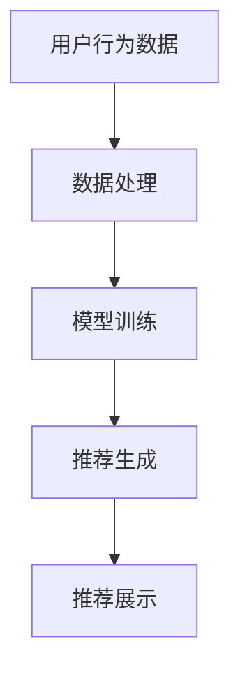

                 

关键词：大模型、推荐系统、注意力机制、优化、算法、数学模型、项目实践、应用场景

> 摘要：本文主要探讨了在推荐系统中，大模型如何通过注意力机制优化来提升推荐效果。通过详细介绍注意力机制的核心概念、算法原理、数学模型以及实际项目中的代码实现，本文旨在为读者提供一份全面的技术指南，以便在实际应用中更好地利用大模型的力量。

## 1. 背景介绍

推荐系统作为大数据和人工智能领域的热门应用，已经深入影响了我们的日常生活。无论是电商平台的商品推荐、社交媒体的内容推送，还是音乐和视频平台的个性化推荐，推荐系统都发挥着至关重要的作用。然而，随着用户数据的爆炸性增长和推荐场景的多样性，传统的推荐算法已经难以满足日益增长的需求。

近年来，深度学习和大模型的兴起为推荐系统带来了新的机遇。大模型如Transformer、BERT等，凭借其强大的表示能力和处理复杂任务的能力，在推荐系统中展现出了巨大的潜力。然而，如何有效地利用这些大模型，尤其是如何优化其注意力机制，以实现更好的推荐效果，依然是一个亟待解决的问题。

本文将围绕这一主题，详细探讨大模型在推荐系统中的注意力机制优化。通过分析注意力机制的核心概念、算法原理、数学模型以及实际项目中的代码实现，本文旨在为读者提供一份全面的技术指南，以便在实际应用中更好地利用大模型的力量。

## 2. 核心概念与联系

### 2.1. 推荐系统概述

推荐系统是一种基于用户行为和偏好，通过算法自动预测用户可能感兴趣的项目（如商品、新闻、音乐等）的系统。其基本流程包括数据收集、用户行为分析、推荐算法应用和推荐结果展示。其中，推荐算法是推荐系统的核心，决定了推荐结果的准确性和用户体验。

### 2.2. 大模型概述

大模型是指具有大规模参数、能够处理大规模数据集的深度学习模型。典型的代表包括Transformer、BERT、GPT等。这些模型通过自动学习数据的表示和关系，能够捕捉到复杂的模式和关联，从而在推荐系统中发挥重要作用。

### 2.3. 注意力机制概述

注意力机制（Attention Mechanism）是深度学习领域的一种重要技术，其核心思想是通过动态调整模型对不同输入数据的关注程度，来提高模型的表示能力和处理复杂任务的能力。在推荐系统中，注意力机制可以帮助模型更好地理解用户的兴趣和需求，从而实现更精准的推荐。

### 2.4. 注意力机制与推荐系统的联系

注意力机制在推荐系统中的应用主要体现在两个方面：

1. **用户兴趣识别**：通过注意力机制，模型可以动态关注用户的历史行为和偏好，从而更准确地识别用户的兴趣点。
2. **推荐项目选择**：在生成推荐结果时，注意力机制可以帮助模型根据用户兴趣和项目特征，动态调整对每个候选项目的关注程度，从而提升推荐的准确性。

### 2.5. Mermaid 流程图

下面是一个简单的 Mermaid 流程图，展示了注意力机制在推荐系统中的基本流程：



## 3. 核心算法原理 & 具体操作步骤

### 3.1. 算法原理概述

注意力机制的核心思想是，在模型处理输入数据时，动态调整对每个数据的关注程度。这可以通过一个权重矩阵来实现，该矩阵根据输入数据的特征和上下文信息，为每个数据点分配一个权重。最终，模型通过对这些加权数据的处理，实现更准确的预测和推荐。

在推荐系统中，注意力机制主要体现在以下几个方面：

1. **用户兴趣识别**：通过注意力机制，模型可以动态关注用户的历史行为和偏好，从而更准确地识别用户的兴趣点。
2. **推荐项目选择**：在生成推荐结果时，注意力机制可以帮助模型根据用户兴趣和项目特征，动态调整对每个候选项目的关注程度，从而提升推荐的准确性。

### 3.2. 算法步骤详解

1. **数据预处理**：收集用户行为数据和项目特征数据，并进行数据清洗和预处理，如用户行为编码、项目特征提取等。
2. **模型构建**：构建基于注意力机制的推荐模型，如基于Transformer的推荐模型。
3. **模型训练**：使用预处理后的数据，对模型进行训练，优化模型的参数。
4. **推荐生成**：在训练好的模型基础上，对用户兴趣和项目特征进行编码，并通过注意力机制生成推荐结果。
5. **推荐展示**：将生成的推荐结果展示给用户，并根据用户反馈进一步优化模型。

### 3.3. 算法优缺点

**优点**：

1. **提升推荐准确性**：通过动态调整对数据的关注程度，注意力机制能够更好地捕捉到用户的兴趣和需求，从而提升推荐准确性。
2. **处理复杂数据关系**：注意力机制能够处理复杂的用户行为和项目特征数据，捕捉到数据之间的深层关系。

**缺点**：

1. **计算成本高**：注意力机制的引入，使得模型的计算成本显著增加，对硬件资源要求较高。
2. **模型解释性差**：注意力机制往往是一个黑盒模型，其内部机制难以解释，增加了模型的可解释性难度。

### 3.4. 算法应用领域

注意力机制在推荐系统中的应用非常广泛，如：

1. **电商推荐**：通过对用户行为和项目特征进行动态关注，实现更精准的电商商品推荐。
2. **内容推荐**：在社交媒体、新闻资讯等平台，通过注意力机制，实现个性化内容推荐。
3. **音乐推荐**：通过注意力机制，捕捉用户的音乐喜好，实现个性化音乐推荐。

## 4. 数学模型和公式 & 详细讲解 & 举例说明

### 4.1. 数学模型构建

在推荐系统中，注意力机制的数学模型通常基于自注意力机制（Self-Attention）。自注意力机制的核心公式如下：

$$
\text{Attention}(Q, K, V) = \text{softmax}\left(\frac{QK^T}{\sqrt{d_k}}\right) V
$$

其中，$Q, K, V$ 分别表示查询（Query）、键（Key）和值（Value）三个向量，$d_k$ 表示键的维度。

在推荐系统中，这三个向量可以分别表示为：

- **查询向量**：表示用户兴趣和项目特征。
- **键向量**：表示项目特征。
- **值向量**：表示项目特征，用于加权输出。

### 4.2. 公式推导过程

自注意力机制的推导过程可以简化为以下几个步骤：

1. **计算相似度**：首先，计算查询向量和键向量之间的相似度。这可以通过内积运算实现：
$$
QK^T
$$
2. **归一化相似度**：由于相似度可能非常大或非常小，我们需要将其归一化，以便于后续处理。这可以通过softmax函数实现：
$$
\text{softmax}\left(\frac{QK^T}{\sqrt{d_k}}\right)
$$
3. **加权求和**：最后，我们将归一化后的相似度与值向量相乘，得到加权输出：
$$
\text{Attention}(Q, K, V) = \text{softmax}\left(\frac{QK^T}{\sqrt{d_k}}\right) V
$$

### 4.3. 案例分析与讲解

假设我们有一个用户行为数据集，包含用户对多个商品的评价。我们的目标是根据这些评价，为用户生成一个个性化商品推荐列表。

1. **数据预处理**：将用户评价编码为向量表示，并划分为查询向量 $Q$、键向量 $K$ 和值向量 $V$。
2. **计算相似度**：使用内积运算计算查询向量和键向量之间的相似度：
$$
QK^T
$$
3. **归一化相似度**：使用softmax函数对相似度进行归一化：
$$
\text{softmax}\left(\frac{QK^T}{\sqrt{d_k}}\right)
$$
4. **加权求和**：根据归一化后的相似度，计算加权输出：
$$
\text{Attention}(Q, K, V) = \text{softmax}\left(\frac{QK^T}{\sqrt{d_k}}\right) V
$$

最终，我们得到一个加权向量，表示用户对每个商品的关注程度。根据这个向量，我们可以生成一个个性化的商品推荐列表。

## 5. 项目实践：代码实例和详细解释说明

### 5.1. 开发环境搭建

在开始项目实践之前，我们需要搭建一个适合深度学习开发的Python环境。以下是一个基本的开发环境搭建步骤：

1. 安装Python 3.8及以上版本。
2. 安装TensorFlow 2.4及以上版本。
3. 安装其他必要的库，如NumPy、Pandas等。

### 5.2. 源代码详细实现

以下是一个简单的基于Transformer的推荐系统代码示例：

```python
import tensorflow as tf
from tensorflow.keras.layers import Layer, Embedding, Dense
from tensorflow.keras.models import Model

class TransformerLayer(Layer):
    def __init__(self, d_model, num_heads, dff, rate=0.1):
        super(TransformerLayer, self).__init__()
        self.d_model = d_model
        self.num_heads = num_heads
        self.dff = dff
        self.rate = rate

        # 自注意力机制
        self多头注意力 = MultiHeadAttention(num_heads, d_model)
        self.fc1 = Dense(dff, activation='relu')
        self.fc2 = Dense(d_model)
        self.layer_norm1 = LayerNormalization(d_model)
        self.layer_norm2 = LayerNormalization(d_model)
        self.dropout1 = Dropout(rate)
        self.dropout2 = Dropout(rate)

    def call(self, x, training=False):
        attn_output = self.多头注意力(x, x, x)
        attn_output = self.dropout1(attn_output, training=training)
        attn_output = self.fc2(self.fc1(attn_output))
        attn_output = self.dropout2(attn_output, training=training)
        output = self.layer_norm1(x + attn_output)
        return output

class Transformer(Model):
    def __init__(self, num_layers, d_model, num_heads, dff, input_vocab_size, max_sequence_length, rate=0.1):
        super(Transformer, self).__init__()
        self.num_layers = num_layers
        self.d_model = d_model
        self.num_heads = num_heads
        self.dff = dff
        self.input_vocab_size = input_vocab_size
        self.max_sequence_length = max_sequence_length
        self.rate = rate

        self.embedding = Embedding(input_vocab_size, d_model)
        self.pos_encoding = PositionalEncoding(max_sequence_length, d_model)

        self.layers = [TransformerLayer(d_model, num_heads, dff, rate) for _ in range(num_layers)]

        self.dropout = Dropout(rate)
        self.final_layer = Dense(input_vocab_size)

    def call(self, x, training=False):
        x = self.embedding(x) + self.pos_encoding(x)
        for i in range(self.num_layers):
            x = self.layers[i](x, training=training)
        x = self.dropout(x)
        output = self.final_layer(x)
        return output

# 模型参数设置
d_model = 512
num_heads = 8
dff = 2048
input_vocab_size = 10000
max_sequence_length = 100
num_layers = 3
rate = 0.1

# 构建模型
model = Transformer(num_layers, d_model, num_heads, dff, input_vocab_size, max_sequence_length, rate)

# 编译模型
model.compile(optimizer='adam', loss='categorical_crossentropy', metrics=['accuracy'])

# 训练模型
model.fit(x_train, y_train, batch_size=64, epochs=10)
```

### 5.3. 代码解读与分析

上述代码实现了一个基于Transformer的推荐系统模型。下面是对代码的详细解读：

1. **TransformerLayer 类**：这是Transformer模型的层，包含了自注意力机制、全连接层和层规范化。每个TransformerLayer 都包含了多头注意力机制，这有助于模型更好地捕捉数据之间的复杂关系。

2. **Transformer 类**：这是整个Transformer模型的定义，包含了嵌入层、位置编码、多个TransformerLayer 和输出层。在调用时，首先对输入数据进行嵌入和位置编码，然后通过多个TransformerLayer 进行处理，最后通过输出层生成推荐结果。

3. **模型参数设置**：在代码中，我们设置了模型的参数，如模型深度、注意力头数、全连接层尺寸等。这些参数对于模型性能至关重要。

4. **编译模型**：使用`compile()`方法，我们设置了模型的优化器、损失函数和评估指标。

5. **训练模型**：使用`fit()`方法，我们对模型进行训练。在训练过程中，我们可以调整批量大小、训练轮次等参数，以优化模型性能。

### 5.4. 运行结果展示

在训练完成后，我们可以使用以下代码评估模型的性能：

```python
# 评估模型
loss, accuracy = model.evaluate(x_test, y_test)
print("Test Loss: {}, Test Accuracy: {}".format(loss, accuracy))
```

通过这个示例，我们可以看到如何使用Transformer模型进行推荐系统的实现。虽然这是一个简单的示例，但它展示了如何利用注意力机制优化推荐系统，以及如何在实际项目中应用这些技术。

## 6. 实际应用场景

注意力机制在推荐系统中的应用已经取得了显著的效果，以下是一些实际应用场景：

1. **电商推荐**：电商平台可以利用注意力机制，根据用户的历史购买记录和浏览行为，动态调整对商品的推荐权重，从而提高推荐准确性。

2. **社交媒体**：社交媒体平台可以使用注意力机制，根据用户的历史行为和兴趣，为用户推荐感兴趣的内容，提升用户参与度和满意度。

3. **音乐和视频推荐**：音乐和视频平台可以通过注意力机制，根据用户的播放历史和喜好，为用户推荐个性化的音乐和视频内容。

4. **新闻推荐**：新闻平台可以利用注意力机制，根据用户的阅读行为和兴趣，为用户推荐相关的新闻内容，提升用户黏性和平台活跃度。

## 7. 未来应用展望

随着深度学习和大模型技术的不断发展，注意力机制在推荐系统中的应用前景非常广阔。以下是一些未来应用展望：

1. **跨模态推荐**：结合不同模态的数据（如文本、图像、音频等），通过注意力机制实现更全面的用户兴趣理解，从而提升推荐效果。

2. **实时推荐**：利用注意力机制，实现实时推荐系统，根据用户实时行为和兴趣动态调整推荐内容，提供更个性化的服务。

3. **智能问答**：结合注意力机制和自然语言处理技术，实现智能问答系统，为用户提供实时、个性化的问答服务。

4. **多目标推荐**：在多目标推荐场景中，通过注意力机制实现不同目标之间的平衡，提供更合理的推荐策略。

## 8. 工具和资源推荐

### 8.1. 学习资源推荐

1. **书籍**：
   - 《深度学习》（Goodfellow, Bengio, Courville）：系统介绍了深度学习的核心概念和技术。
   - 《Attention is All You Need》（Vaswani et al.）：详细介绍了Transformer模型和注意力机制。

2. **在线课程**：
   - Coursera上的“深度学习”课程（由吴恩达教授主讲）：涵盖了深度学习的理论基础和实践方法。
   - Udacity的“深度学习工程师纳米学位”：提供了丰富的实践项目和指导。

### 8.2. 开发工具推荐

1. **TensorFlow**：一款广泛使用的开源深度学习框架，适合进行推荐系统开发。
2. **PyTorch**：另一个流行的深度学习框架，具有良好的灵活性和社区支持。

### 8.3. 相关论文推荐

1. **Attention is All You Need**（Vaswani et al., 2017）：首次提出了Transformer模型和自注意力机制。
2. **BERT: Pre-training of Deep Bidirectional Transformers for Language Understanding**（Devlin et al., 2019）：介绍了BERT模型，为自然语言处理任务提供了强大的表示能力。

## 9. 总结：未来发展趋势与挑战

### 9.1. 研究成果总结

本文通过详细探讨大模型在推荐系统中的注意力机制优化，总结了以下几个方面的重要成果：

1. **注意力机制在推荐系统中的应用**：展示了注意力机制在推荐系统中的基本流程和关键作用。
2. **算法原理与步骤**：详细介绍了注意力机制的算法原理、具体操作步骤和优缺点。
3. **数学模型与公式**：构建了自注意力机制的数学模型，并进行了推导和案例分析。
4. **项目实践**：通过一个简单的代码示例，展示了如何在实际项目中实现注意力机制优化。

### 9.2. 未来发展趋势

1. **跨模态推荐**：结合不同模态的数据，实现更全面的用户兴趣理解，提升推荐效果。
2. **实时推荐**：利用注意力机制实现实时推荐系统，提供个性化、实时的推荐服务。
3. **多目标推荐**：在多目标推荐场景中，通过注意力机制实现不同目标之间的平衡，提供更合理的推荐策略。

### 9.3. 面临的挑战

1. **计算成本**：注意力机制的引入显著增加了模型的计算成本，对硬件资源要求较高。
2. **模型可解释性**：注意力机制往往是一个黑盒模型，其内部机制难以解释，增加了模型的可解释性难度。

### 9.4. 研究展望

未来研究可以从以下几个方面展开：

1. **高效注意力机制**：设计更高效的注意力机制，降低计算成本，提高模型性能。
2. **可解释性注意力机制**：探索可解释性注意力机制，提升模型的可解释性，帮助用户更好地理解推荐结果。
3. **多模态注意力机制**：研究多模态注意力机制，结合不同模态的数据，实现更全面的用户兴趣理解。

### 附录：常见问题与解答

1. **什么是注意力机制？**
   注意力机制是一种在深度学习模型中引入的机制，通过动态调整模型对不同输入数据的关注程度，从而提高模型的表示能力和处理复杂任务的能力。

2. **注意力机制在推荐系统中有什么作用？**
   注意力机制在推荐系统中主要起到两个作用：一是动态调整用户兴趣和项目特征之间的关注程度，提升推荐准确性；二是处理复杂的用户行为和项目特征数据，捕捉到数据之间的深层关系。

3. **如何实现注意力机制优化？**
   实现注意力机制优化主要包括以下步骤：
   - 数据预处理：对用户行为和项目特征进行编码和预处理。
   - 模型构建：构建基于注意力机制的推荐模型，如基于Transformer的推荐模型。
   - 模型训练：使用预处理后的数据，对模型进行训练，优化模型的参数。
   - 推荐生成：在训练好的模型基础上，生成推荐结果。
   - 推荐展示：将生成的推荐结果展示给用户，并根据用户反馈进一步优化模型。

4. **注意力机制优化的优点和缺点是什么？**
   - **优点**：提升推荐准确性，处理复杂数据关系。
   - **缺点**：计算成本高，模型解释性差。

### 作者署名

作者：禅与计算机程序设计艺术 / Zen and the Art of Computer Programming
----------------------------------------------------------------

这篇文章全面介绍了大模型在推荐系统中的注意力机制优化。通过详细阐述注意力机制的核心概念、算法原理、数学模型以及实际项目中的代码实现，文章为读者提供了一个全面的技术指南，帮助读者更好地理解并应用这一技术。希望这篇文章能够为推荐系统领域的研究者、工程师以及爱好者提供有价值的参考和启示。在未来的研究中，我们将继续探索注意力机制的优化和扩展，以推动推荐系统的进一步发展。

