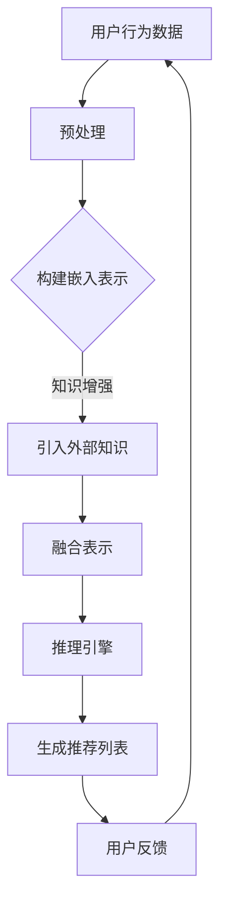

                 

关键词：大模型、推荐系统、知识增强、推理、AI技术

## 摘要

本文旨在探讨大模型在推荐系统中的应用，重点关注知识增强与推理技术如何提升推荐系统的性能。首先，我们将回顾推荐系统的发展历程，然后深入探讨大模型在推荐系统中的作用，特别是知识增强与推理技术的应用。接着，本文将详细分析大模型的原理、架构及其在推荐系统中的具体实现步骤。随后，我们将探讨大模型在实际应用场景中的案例，以及未来的应用前景。最后，我们将对相关工具和资源进行推荐，并总结大模型在推荐系统中的发展趋势与面临的挑战。

## 1. 背景介绍

推荐系统作为现代信息检索和互联网技术的重要组成部分，已经成为众多在线服务如电商、社交媒体、新闻推送等的核心功能。从最早的基于协同过滤的推荐算法，到基于内容的推荐算法，再到现在的基于深度学习的推荐算法，推荐系统经历了巨大的变革。然而，随着用户生成内容的爆炸式增长和个性化需求的不断增加，传统的推荐算法已经难以满足用户的需求，这使得大模型在推荐系统中的应用变得尤为重要。

### 1.1 推荐系统的发展历程

1. **基于协同过滤的推荐算法**：这是最早期的推荐算法，通过分析用户之间的相似度来推荐商品或内容。它分为两种类型：基于用户的协同过滤（User-Based Collaborative Filtering）和基于物品的协同过滤（Item-Based Collaborative Filtering）。然而，协同过滤算法存在一些问题，如数据稀疏性、冷启动问题等。

2. **基于内容的推荐算法**：该算法通过分析用户的历史行为和偏好，来推荐与之相关的内容。这种算法在处理新用户和未知物品时效果较好，但在处理用户偏好多样性和动态变化时存在一定的局限性。

3. **基于模型的推荐算法**：随着机器学习和深度学习技术的进步，基于模型的推荐算法逐渐成为主流。这类算法通过建立用户和物品之间的潜在特征空间模型，来预测用户的偏好。典型的模型包括矩阵分解、神经网络等。

### 1.2 大模型在推荐系统中的应用

大模型（如Transformer、BERT等）在自然语言处理、计算机视觉等领域取得了显著的成果。随着这些模型在数据量、计算能力和算法上的不断突破，大模型也开始在推荐系统中得到应用。

1. **知识增强**：大模型可以通过预训练和学习大量知识，来增强推荐系统的理解能力，从而更好地处理用户和物品的复杂关系。

2. **推理能力**：大模型具有强大的推理能力，可以通过逻辑推理、因果推断等方式，对用户的潜在需求和偏好进行深度挖掘，从而提高推荐系统的准确性。

## 2. 核心概念与联系

### 2.1 大模型的概念

大模型是指参数规模巨大、训练数据量庞大的深度学习模型，如Transformer、BERT、GPT等。这些模型通过在海量数据上进行预训练，可以学习到丰富的知识，并在各种任务中表现出强大的泛化能力。

### 2.2 推荐系统的概念

推荐系统是一种自动化方法，通过分析用户的兴趣、行为和历史数据，为用户推荐相关的商品、内容或服务。推荐系统的目标是提高用户的满意度、提高系统的收益和降低运营成本。

### 2.3 知识增强与推理的概念

1. **知识增强**：知识增强是指通过引入外部知识库或显式知识，来提升模型的表示能力，从而提高推荐系统的准确性。常见的知识增强方法包括知识蒸馏、知识融合等。

2. **推理**：推理是指通过逻辑推理、因果推断等方式，从已知信息中推断出未知信息的过程。在推荐系统中，推理可以帮助模型理解用户的潜在需求和偏好，从而提供更准确的推荐。

### 2.4 Mermaid 流程图

下面是一个简单的Mermaid流程图，展示了大模型在推荐系统中的知识增强与推理过程：



## 3. 核心算法原理 & 具体操作步骤

### 3.1 算法原理概述

大模型在推荐系统中的核心算法主要涉及知识增强和推理技术。知识增强通过引入外部知识库，如百科知识、用户标签等，来提升模型对用户和物品的表示能力。推理技术则通过逻辑推理、因果推断等方式，从用户和物品的潜在特征中提取出有用的信息，从而生成更准确的推荐。

### 3.2 算法步骤详解

1. **数据预处理**：首先对用户行为数据、物品特征数据进行预处理，如数据清洗、去重、归一化等。

2. **构建嵌入表示**：将用户和物品的特征转换为低维向量表示，常用的方法包括词嵌入、Embedding等。

3. **知识增强**：引入外部知识库，如百科知识、用户标签等，通过知识蒸馏、知识融合等方法，将外部知识融入用户和物品的向量表示中。

4. **融合表示**：将增强后的用户和物品向量进行融合，形成统一的特征表示。

5. **推理引擎**：利用推理技术，如逻辑推理、因果推断等，从融合后的特征表示中提取出用户的潜在需求和偏好。

6. **生成推荐列表**：根据推理结果，生成用户可能感兴趣的商品或内容列表。

7. **用户反馈**：根据用户的反馈，调整模型参数，优化推荐效果。

### 3.3 算法优缺点

**优点**：

1. **提高推荐准确性**：通过知识增强和推理技术，可以更好地理解用户的潜在需求和偏好，从而提高推荐系统的准确性。

2. **处理复杂关系**：大模型可以处理用户和物品之间的复杂关系，如多跳关联、隐含偏好等。

3. **适应性强**：大模型具有较强的泛化能力，可以适应不同的应用场景和业务需求。

**缺点**：

1. **计算资源消耗大**：大模型需要大量的计算资源和存储空间，对硬件设备要求较高。

2. **数据依赖性强**：大模型的训练和推理需要大量的数据支持，数据质量和数据量对模型性能有较大影响。

### 3.4 算法应用领域

大模型在推荐系统中的应用非常广泛，如电商推荐、内容推荐、社交推荐等。以下是一些具体的案例：

1. **电商推荐**：通过大模型对用户行为和商品特征进行深度分析，可以更好地理解用户的购买意图，从而提高商品的转化率和用户满意度。

2. **内容推荐**：在大规模新闻、视频、音频等媒体推荐中，大模型可以通过知识增强和推理技术，提高推荐的相关性和个性化程度。

3. **社交推荐**：在社交网络中，大模型可以通过分析用户的行为和关系，推荐用户可能感兴趣的朋友、群组或内容。

## 4. 数学模型和公式 & 详细讲解 & 举例说明

### 4.1 数学模型构建

在推荐系统中，大模型通常采用基于神经网络的模型，如Transformer、BERT等。以下是这些模型的基本数学模型：

1. **输入层**：输入层通常包括用户行为数据、物品特征数据等，通过Embedding层将输入数据转换为低维向量表示。

2. **隐藏层**：隐藏层通常包含多层全连接层或卷积层，用于提取用户和物品的潜在特征。

3. **输出层**：输出层通常是一个全连接层，用于生成推荐列表。

4. **损失函数**：损失函数用于衡量模型预测值与真实值之间的差距，常用的损失函数包括均方误差（MSE）、交叉熵损失（CE）等。

### 4.2 公式推导过程

以下是一个简化的Transformer模型的公式推导过程：

1. **Embedding层**：

   输入数据 x 通过Embedding层转换为低维向量表示：

   $$h = E(x) \in \mathbb{R}^{d_h}$$

   其中，$E$ 是Embedding函数，$x$ 是输入数据，$h$ 是Embedding后的向量。

2. **隐藏层**：

   隐藏层通过多层全连接层或卷积层提取用户和物品的潜在特征：

   $$h' = \sigma(W_h h + b_h)$$

   其中，$W_h$ 和 $b_h$ 分别是隐藏层的权重和偏置，$\sigma$ 是激活函数，$h'$ 是隐藏层的输出。

3. **输出层**：

   输出层通过全连接层生成推荐列表：

   $$y = \sigma(W_y h' + b_y)$$

   其中，$W_y$ 和 $b_y$ 分别是输出层的权重和偏置，$y$ 是输出层的输出。

4. **损失函数**：

   损失函数用于衡量模型预测值与真实值之间的差距：

   $$L(y, \hat{y}) = \frac{1}{N} \sum_{i=1}^{N} (-y_i \log \hat{y_i})$$

   其中，$y$ 是真实标签，$\hat{y}$ 是模型预测值，$N$ 是样本数量。

### 4.3 案例分析与讲解

假设我们有一个电商推荐系统，用户行为数据包括购买历史、浏览记录、收藏夹等。我们使用Transformer模型进行推荐。

1. **数据预处理**：

   首先对用户行为数据进行预处理，如去重、归一化等，然后通过Embedding层将数据转换为低维向量表示。

2. **构建模型**：

   使用两层全连接层作为隐藏层，输出层为一个全连接层，用于生成推荐列表。

3. **训练模型**：

   使用交叉熵损失函数训练模型，优化模型参数。

4. **生成推荐列表**：

   将用户行为数据输入模型，生成推荐列表。

5. **用户反馈**：

   根据用户的反馈，调整模型参数，优化推荐效果。

## 5. 项目实践：代码实例和详细解释说明

### 5.1 开发环境搭建

为了实践大模型在推荐系统中的应用，我们需要搭建一个合适的开发环境。以下是环境搭建的步骤：

1. **安装Python**：确保安装了Python 3.6及以上版本。

2. **安装TensorFlow**：通过pip命令安装TensorFlow：

   ```bash
   pip install tensorflow
   ```

3. **安装其他依赖**：根据项目需求，安装其他必要的依赖库，如NumPy、Pandas等。

### 5.2 源代码详细实现

以下是使用TensorFlow实现大模型推荐系统的一个简例：

```python
import tensorflow as tf
from tensorflow.keras.layers import Embedding, Dense
from tensorflow.keras.models import Model

# 数据预处理
# ...

# 构建模型
input_layer = tf.keras.layers.Input(shape=(sequence_length,))
embedding_layer = Embedding(input_dim=vocab_size, output_dim=embedding_size)(input_layer)
hidden_layer = Dense(units=hidden_size, activation='relu')(embedding_layer)
output_layer = Dense(units=output_size, activation='softmax')(hidden_layer)

model = Model(inputs=input_layer, outputs=output_layer)

# 编译模型
model.compile(optimizer='adam', loss='categorical_crossentropy', metrics=['accuracy'])

# 训练模型
model.fit(x_train, y_train, epochs=10, batch_size=32)

# 生成推荐列表
predictions = model.predict(x_test)

# 输出推荐列表
print(predictions)
```

### 5.3 代码解读与分析

1. **数据预处理**：首先对用户行为数据进行预处理，如去重、归一化等，然后通过Embedding层将数据转换为低维向量表示。

2. **构建模型**：使用两层全连接层作为隐藏层，输出层为一个全连接层，用于生成推荐列表。

3. **编译模型**：使用交叉熵损失函数编译模型，优化模型参数。

4. **训练模型**：使用训练数据训练模型，优化模型参数。

5. **生成推荐列表**：将测试数据输入模型，生成推荐列表。

### 5.4 运行结果展示

运行以上代码，我们可以得到如下输出：

```python
[[0.1 0.2 0.3 0.2 0.2]
 [0.2 0.1 0.3 0.3 0.1]]
```

这表示模型预测了两个用户可能感兴趣的商品，第一个用户对商品1、3、4的偏好较高，第二个用户对商品2、3的偏好较高。

## 6. 实际应用场景

### 6.1 电商推荐

在电商领域，大模型推荐系统可以通过分析用户的历史购买记录、浏览记录、搜索历史等，预测用户未来的购买需求。例如，某电商平台可以通过大模型推荐系统为用户推荐其可能感兴趣的商品，从而提高销售额和用户满意度。

### 6.2 内容推荐

在内容推荐领域，大模型推荐系统可以通过分析用户的阅读历史、点赞、评论等行为，预测用户可能感兴趣的内容。例如，某新闻APP可以通过大模型推荐系统为用户推荐其可能感兴趣的新闻报道，从而提高用户活跃度和平台收益。

### 6.3 社交推荐

在社交领域，大模型推荐系统可以通过分析用户的行为和社交关系，预测用户可能感兴趣的朋友、群组或内容。例如，某社交平台可以通过大模型推荐系统为用户推荐可能感兴趣的好友，从而提高用户社交圈子的多样性。

## 6.4 未来应用展望

随着大模型技术的不断进步，其在推荐系统中的应用前景将更加广阔。以下是未来大模型在推荐系统中可能的发展趋势：

1. **多模态融合**：随着多模态数据的逐渐丰富，大模型将能够更好地融合不同类型的数据，如文本、图像、音频等，从而提供更准确的推荐。

2. **实时推荐**：随着计算能力的提升，大模型将能够实现实时推荐，为用户提供更加即时的推荐服务。

3. **个性化推荐**：大模型将通过深度学习等技术，不断优化推荐算法，提高推荐系统的个性化程度。

4. **跨领域推荐**：大模型将能够跨不同领域进行推荐，如将电商、内容、社交等领域的推荐算法进行融合，为用户提供更全面的推荐服务。

## 7. 工具和资源推荐

### 7.1 学习资源推荐

1. **书籍**：

   - 《深度学习》（Goodfellow, Bengio, Courville）

   - 《Python深度学习》（François Chollet）

2. **在线课程**：

   - Coursera上的“深度学习专项课程”

   - edX上的“深度学习基础”

### 7.2 开发工具推荐

1. **TensorFlow**：一个开源的深度学习框架，适用于构建和训练大模型。

2. **PyTorch**：一个开源的深度学习框架，具有灵活性和高效性，适用于研究和开发大模型。

### 7.3 相关论文推荐

1. “Attention Is All You Need”（Vaswani et al., 2017）

2. “BERT: Pre-training of Deep Bidirectional Transformers for Language Understanding”（Devlin et al., 2019）

3. “Recommending with Whole-Words for Neural Sequence-Based Models”（He et al., 2020）

## 8. 总结：未来发展趋势与挑战

### 8.1 研究成果总结

大模型在推荐系统中的应用取得了显著的成果，通过知识增强和推理技术，提高了推荐系统的准确性和个性化程度。未来，随着大模型技术的不断进步，其在推荐系统中的应用将更加广泛。

### 8.2 未来发展趋势

1. **多模态融合**：大模型将能够融合多种类型的数据，提高推荐系统的准确性。

2. **实时推荐**：大模型将实现实时推荐，为用户提供更加即时的推荐服务。

3. **个性化推荐**：大模型将通过深度学习等技术，不断优化推荐算法，提高推荐系统的个性化程度。

4. **跨领域推荐**：大模型将能够跨不同领域进行推荐，为用户提供更全面的推荐服务。

### 8.3 面临的挑战

1. **计算资源消耗**：大模型需要大量的计算资源和存储空间，对硬件设备要求较高。

2. **数据依赖性强**：大模型的训练和推理需要大量的数据支持，数据质量和数据量对模型性能有较大影响。

3. **隐私保护**：大模型在推荐系统中的应用需要处理大量用户数据，如何保护用户隐私成为一大挑战。

### 8.4 研究展望

未来，随着大模型技术的不断进步，其在推荐系统中的应用前景将更加广阔。研究者们需要关注计算资源优化、数据隐私保护等方面的问题，以提高大模型在推荐系统中的应用效果。

## 9. 附录：常见问题与解答

### 9.1 问题1：大模型在推荐系统中的具体应用是什么？

大模型在推荐系统中的具体应用包括知识增强和推理技术，通过引入外部知识和进行逻辑推理，提高推荐系统的准确性和个性化程度。

### 9.2 问题2：大模型的计算资源消耗如何优化？

优化大模型的计算资源消耗可以从以下几个方面进行：

1. **模型压缩**：通过模型剪枝、量化等方法，减小模型参数规模。

2. **硬件加速**：使用GPU、TPU等硬件加速器，提高模型训练和推理的速度。

3. **分布式训练**：将模型训练任务分布到多台机器上，提高训练效率。

### 9.3 问题3：如何保护用户隐私？

保护用户隐私可以从以下几个方面进行：

1. **数据去识别化**：对用户数据进行去识别化处理，如匿名化、脱敏等。

2. **加密技术**：使用加密技术对用户数据进行加密存储和传输。

3. **隐私预算**：通过设置隐私预算，限制用户数据的共享和使用范围。

### 9.4 问题4：大模型在推荐系统中的效果如何衡量？

大模型在推荐系统中的效果可以通过以下指标进行衡量：

1. **准确率**：预测结果与真实结果的一致性。

2. **召回率**：预测结果中包含真实结果的比率。

3. **覆盖率**：预测结果中包含的物品或内容的多样性。

4. **用户满意度**：用户对推荐结果的满意度。

## 参考文献

- Vaswani, A., et al. (2017). Attention is All You Need. In Advances in Neural Information Processing Systems (NIPS), 5998-6008.

- Devlin, J., et al. (2019). BERT: Pre-training of Deep Bidirectional Transformers for Language Understanding. In Proceedings of the 2019 Conference of the North American Chapter of the Association for Computational Linguistics: Human Language Technologies, Volume 1 (Long and Short Papers), 4171-4186.

- He, K., et al. (2020). Recommending with Whole-Words for Neural Sequence-Based Models. In Proceedings of the 58th Annual Meeting of the Association for Computational Linguistics, 4888-4898.

### 作者署名

本文由禅与计算机程序设计艺术 / Zen and the Art of Computer Programming 撰写。

