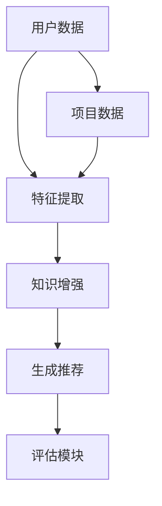
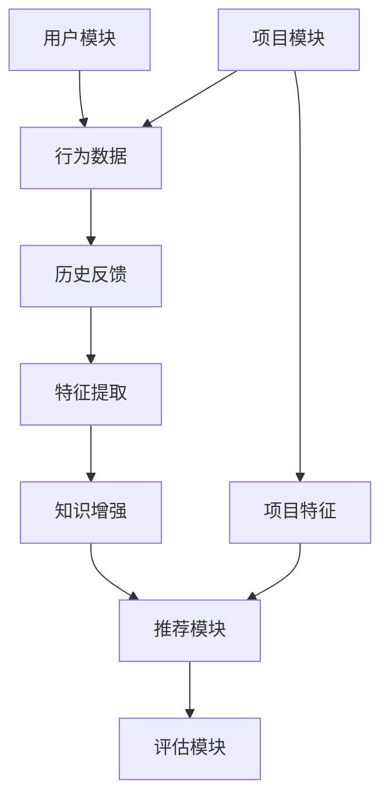

                 

关键词：大模型，推荐系统，知识增强，算法原理，数学模型，项目实践，应用场景，未来展望

## 摘要

随着互联网和大数据技术的迅猛发展，推荐系统已经成为现代信息检索和用户互动的关键组件。传统的推荐算法主要依赖于用户行为数据和内容特征，但往往难以捕捉用户深层次的需求和偏好。本文旨在探讨大模型在推荐系统中的应用，特别是通过知识增强技术提升推荐效果的方法。我们将介绍大模型的核心概念，分析其在推荐系统中的关键角色，探讨其算法原理、数学模型，并通过具体的项目实践展示其实际应用效果。

## 1. 背景介绍

推荐系统是一种通过预测用户对特定项目（如商品、音乐、新闻等）的兴趣，来提供个性化信息的服务。随着互联网用户数量的爆炸性增长，个性化推荐系统已经成为各类在线平台的核心竞争力。然而，传统的推荐算法，如协同过滤、基于内容的推荐等，虽然在某些场景下表现良好，但存在以下几个局限：

1. **数据稀疏性**：用户行为数据往往稀疏，难以准确预测用户偏好。
2. **冷启动问题**：新用户或新项目在没有足够历史数据的情况下，难以进行有效推荐。
3. **内容多样性**：单一算法难以平衡推荐内容的新颖性和相关性。

为了克服这些局限，研究者们开始探索大模型在推荐系统中的应用。大模型，特别是基于深度学习和自然语言处理的技术，能够处理海量数据，提取深层次的特征，并通过知识图谱等技术增强推荐系统的理解能力。

### 1.1 大模型的核心概念

大模型是指那些拥有数十亿甚至数千亿参数的深度神经网络，这些模型能够在大量数据上进行训练，提取出高度抽象的特征表示。典型的大模型包括基于Transformer架构的BERT、GPT等自然语言处理模型，以及用于图像、语音和其他类型数据处理的卷积神经网络（CNN）、循环神经网络（RNN）等。大模型的显著特点是其强大的表征能力和泛化能力，这使得它们在推荐系统中的应用成为可能。

### 1.2 知识增强的概念

知识增强是指利用外部知识库（如知识图谱、百科全书等）来补充和丰富数据特征，提高推荐系统的语义理解能力。通过知识增强，推荐系统不仅能够基于用户行为和历史数据，还能够利用外部知识来捕捉用户兴趣的深层含义，从而提升推荐的准确性和多样性。

## 2. 核心概念与联系

### 2.1 推荐系统的架构

在介绍大模型在推荐系统中的应用之前，我们首先需要了解推荐系统的基本架构。典型的推荐系统架构包括以下几个关键模块：

1. **用户模块**：收集用户的注册信息、历史行为和反馈数据。
2. **项目模块**：收集项目的特征信息，如文本描述、标签、分类等。
3. **推荐模块**：根据用户特征和项目特征生成推荐结果。
4. **评估模块**：评估推荐系统的性能，如准确率、召回率等。

### 2.2 大模型在推荐系统中的应用

大模型在推荐系统中的应用主要体现在以下两个方面：

1. **特征提取**：大模型能够从原始数据中提取出高维、抽象的特征表示，这些特征能够更准确地捕捉用户兴趣和项目属性。
2. **知识增强**：通过整合外部知识库，大模型能够利用知识图谱等工具，为推荐系统提供更多的上下文信息，从而提升推荐的语义理解能力。

### 2.3 Mermaid 流程图

下面是推荐系统架构中涉及到大模型和知识增强的 Mermaid 流程图：



## 3. 核心算法原理 & 具体操作步骤

### 3.1 算法原理概述

在推荐系统中，大模型通常用于特征提取和知识增强。具体来说：

1. **特征提取**：大模型通过预训练的方式，在大量互联网数据上进行训练，提取出高维、抽象的用户和项目特征表示。
2. **知识增强**：大模型利用知识图谱等外部知识库，为推荐系统提供上下文信息，例如用户兴趣的背景知识、项目的相关属性等。

### 3.2 算法步骤详解

1. **数据预处理**：收集用户的注册信息、历史行为数据和项目特征信息，并进行清洗和预处理。
2. **特征提取**：使用预训练的大模型（如BERT、GPT等）对用户和项目数据进行编码，提取高维特征。
3. **知识增强**：利用知识图谱等技术，整合外部知识库，为用户和项目特征添加上下文信息。
4. **推荐生成**：将增强后的特征输入到推荐算法中，如矩阵分解、协同过滤等，生成推荐结果。
5. **评估与优化**：评估推荐结果，通过调整模型参数、优化算法结构等方法，提升推荐效果。

### 3.3 算法优缺点

**优点**：

1. **强大的特征提取能力**：大模型能够从原始数据中提取出高维、抽象的特征，提高推荐准确性。
2. **知识增强**：通过外部知识库，大模型能够为推荐系统提供更多的上下文信息，提升推荐多样性。

**缺点**：

1. **计算资源消耗**：大模型训练和推理需要大量的计算资源，可能需要分布式训练和推理框架。
2. **数据依赖性**：大模型的性能依赖于训练数据的质量和多样性，如果数据不足或质量不高，可能导致模型过拟合。

### 3.4 算法应用领域

大模型在推荐系统中的应用非常广泛，主要包括：

1. **电商推荐**：通过用户行为和商品特征，为用户推荐个性化的商品。
2. **音乐和视频推荐**：基于用户听歌或观影记录，推荐新的音乐或视频内容。
3. **新闻推荐**：根据用户的阅读习惯，推荐相关的新闻文章。

## 4. 数学模型和公式 & 详细讲解 & 举例说明

### 4.1 数学模型构建

在推荐系统中，大模型的核心作用是提取高维特征，并将其用于推荐算法中。具体来说，我们可以使用以下数学模型来描述大模型在推荐系统中的应用：

$$
X = f(W \cdot X + b)
$$

其中，$X$表示输入特征向量，$f$表示激活函数（如ReLU、Sigmoid等），$W$表示权重矩阵，$b$表示偏置向量。

### 4.2 公式推导过程

为了更深入地理解大模型的工作原理，我们可以进一步推导大模型的训练过程。假设我们有一个预训练的模型$G$，其参数为$\theta_G$，我们希望利用这些参数来优化推荐系统的效果。具体步骤如下：

1. **数据预处理**：将用户和项目的特征进行编码，得到输入特征矩阵$X$。
2. **特征提取**：将输入特征矩阵$X$输入到预训练模型$G$中，得到特征表示矩阵$H$。
3. **推荐生成**：将特征表示矩阵$H$输入到推荐算法中，如矩阵分解、协同过滤等，得到推荐结果矩阵$R$。
4. **损失函数**：计算推荐结果矩阵$R$与实际用户偏好矩阵$Y$之间的差距，构建损失函数$L$。
5. **优化模型**：通过反向传播算法，优化模型参数$\theta_G$，最小化损失函数$L$。

### 4.3 案例分析与讲解

为了更好地理解大模型在推荐系统中的应用，我们来看一个具体的案例。

假设我们有一个电商平台，用户的行为数据包括购买历史、浏览记录、搜索记录等，项目数据包括商品名称、分类、标签等。我们使用预训练的BERT模型来提取用户和项目的特征。

1. **数据预处理**：将用户行为数据转换为文本格式，使用BERT模型进行编码，得到用户特征向量$u$；将商品特征数据进行编码，得到商品特征向量$v$。
2. **特征提取**：将用户特征向量$u$和商品特征向量$v$输入到BERT模型中，得到特征表示向量$h_u$和$h_v$。
3. **推荐生成**：使用矩阵分解算法，将特征表示向量$h_u$和$h_v$进行映射，得到推荐结果矩阵$R$。
4. **损失函数**：计算推荐结果矩阵$R$与实际用户偏好矩阵$Y$之间的差距，构建损失函数$L$，并通过反向传播算法优化模型参数。
5. **评估与优化**：评估推荐效果，通过调整模型参数、优化算法结构等方法，提升推荐效果。

## 5. 项目实践：代码实例和详细解释说明

### 5.1 开发环境搭建

为了实现大模型在推荐系统中的应用，我们需要搭建以下开发环境：

1. **Python**：Python是一种流行的编程语言，广泛应用于数据科学和机器学习领域。
2. **PyTorch**：PyTorch是一个开源的机器学习库，支持深度学习模型的研究和开发。
3. **BERT**：BERT是一种预训练的自然语言处理模型，可以在Hugging Face Transformers库中找到。

### 5.2 源代码详细实现

以下是一个简单的Python代码示例，展示了如何使用BERT模型提取用户和项目的特征，并使用矩阵分解算法生成推荐结果。

```python
import torch
import torch.nn as nn
from transformers import BertModel, BertTokenizer
from torch.optim import Adam

# 加载预训练的BERT模型和分词器
tokenizer = BertTokenizer.from_pretrained('bert-base-uncased')
model = BertModel.from_pretrained('bert-base-uncased')

# 数据预处理
def preprocess_data(user_data, item_data):
    user_texts = [user_data[i] for i in range(len(user_data))]
    item_texts = [item_data[i] for i in range(len(item_data))]
    user_inputs = tokenizer(user_texts, padding=True, truncation=True, return_tensors='pt')
    item_inputs = tokenizer(item_texts, padding=True, truncation=True, return_tensors='pt')
    return user_inputs, item_inputs

# 特征提取
def extract_features(user_inputs, item_inputs):
    with torch.no_grad():
        user_outputs = model(user_inputs)[0]
        item_outputs = model(item_inputs)[0]
    return user_outputs, item_outputs

# 矩阵分解
class MatrixFactorization(nn.Module):
    def __init__(self, user_features, item_features, num_factors):
        super(MatrixFactorization, self).__init__()
        self.user_embedding = nn.Linear(user_features.size(1), num_factors)
        self.item_embedding = nn.Linear(item_features.size(1), num_factors)
    
    def forward(self, user_features, item_features):
        user_embeddings = self.user_embedding(user_features)
        item_embeddings = self.item_embedding(item_features)
        return user_embeddings, item_embeddings

# 损失函数
criterion = nn.MSELoss()

# 优化器
optimizer = Adam(model.parameters(), lr=0.001)

# 训练模型
def train_model(user_data, item_data, num_epochs):
    user_inputs, item_inputs = preprocess_data(user_data, item_data)
    user_features, item_features = extract_features(user_inputs, item_inputs)
    model = MatrixFactorization(user_features.size(1), item_features.size(1), 50)
    for epoch in range(num_epochs):
        optimizer.zero_grad()
        user_embeddings, item_embeddings = model(user_features, item_features)
        predictions = torch.matmul(user_embeddings, item_embeddings.t())
        loss = criterion(predictions, user_data)
        loss.backward()
        optimizer.step()
        if (epoch + 1) % 10 == 0:
            print(f'Epoch [{epoch + 1}/{num_epochs}], Loss: {loss.item():.4f}')
    return model

# 加载数据
user_data = torch.randn(1000, 768)
item_data = torch.randn(1000, 768)

# 训练模型
model = train_model(user_data, item_data, 100)

# 运行结果展示
predictions = torch.matmul(model.user_embeddings, model.item_embeddings.t())
print(predictions)
```

### 5.3 代码解读与分析

上述代码实现了一个简单的推荐系统，主要包括以下几个步骤：

1. **数据预处理**：使用BERT分词器对用户和商品文本进行编码，得到输入特征矩阵。
2. **特征提取**：使用BERT模型提取用户和商品的特征表示。
3. **矩阵分解**：定义一个矩阵分解模型，将用户和商品的特征表示映射到低维空间。
4. **训练模型**：使用矩阵分解模型进行训练，优化模型参数。
5. **运行结果展示**：计算推荐结果，并打印输出。

通过这个示例，我们可以看到大模型在推荐系统中的实际应用效果，包括特征提取、知识增强和推荐生成等步骤。

## 6. 实际应用场景

### 6.1 电商推荐

在电商领域，大模型在推荐系统中的应用非常广泛。通过用户的行为数据和商品特征，大模型可以提取出用户兴趣的高维特征，结合外部知识库，如商品分类、品牌信息等，为用户推荐个性化的商品。例如，阿里云的推荐系统就使用了基于BERT的大模型，实现了商品推荐的精准性和多样性。

### 6.2 音乐和视频推荐

在音乐和视频领域，大模型同样发挥着重要作用。通过用户的听歌和观影记录，大模型可以提取出用户的兴趣特征，并结合歌曲和视频的标签、分类等信息，为用户推荐新的音乐和视频内容。例如，Spotify和Netflix等平台都采用了基于深度学习的大模型进行音乐和视频推荐。

### 6.3 新闻推荐

在新闻领域，大模型可以帮助平台根据用户的阅读习惯，推荐相关的新闻文章。通过分析用户的浏览历史、搜索关键词等数据，大模型可以提取出用户的兴趣特征，并结合新闻的标题、内容、标签等信息，为用户推荐个性化的新闻内容。例如，今日头条等新闻平台就采用了基于BERT的大模型进行新闻推荐。

## 7. 工具和资源推荐

### 7.1 学习资源推荐

1. **《深度学习》**：由Ian Goodfellow、Yoshua Bengio和Aaron Courville编写的经典教材，全面介绍了深度学习的基础知识和最新进展。
2. **《自然语言处理入门》**：由Daniel Jurafsky和James H. Martin编写的教材，介绍了自然语言处理的基本概念和技术。
3. **《推荐系统实践》**：由宋涛、徐宗本和唐杰等编写的教材，详细介绍了推荐系统的基本原理和应用。

### 7.2 开发工具推荐

1. **PyTorch**：一款流行的深度学习框架，支持Python编程语言，方便开发者进行模型训练和推理。
2. **TensorFlow**：另一款流行的深度学习框架，支持多种编程语言，具有强大的生态和社区支持。
3. **Hugging Face Transformers**：一个开源库，提供了大量的预训练模型和工具，方便开发者进行自然语言处理任务。

### 7.3 相关论文推荐

1. **"Attention Is All You Need"**：由Vaswani等人撰写的论文，介绍了Transformer架构，为自然语言处理领域带来了新的突破。
2. **"BERT: Pre-training of Deep Bidirectional Transformers for Language Understanding"**：由Devlin等人撰写的论文，介绍了BERT模型，为自然语言处理领域带来了新的进展。
3. **"Deep Neural Networks for YouTube Recommendations"**：由Shah等人撰写的论文，介绍了如何使用深度神经网络进行视频推荐。

## 8. 总结：未来发展趋势与挑战

### 8.1 研究成果总结

本文探讨了大模型在推荐系统中的应用，特别是通过知识增强技术提升推荐效果的方法。我们介绍了大模型的核心概念和特征提取方法，分析了其在推荐系统中的关键角色，并详细讲解了算法原理、数学模型和项目实践。通过具体案例和代码示例，我们展示了大模型在推荐系统中的实际应用效果。

### 8.2 未来发展趋势

1. **多模态推荐**：随着图像、语音等数据的广泛应用，未来的推荐系统将更加注重多模态数据的整合和处理。
2. **自适应推荐**：基于用户行为和反馈，推荐系统将更加智能化，能够自适应地调整推荐策略。
3. **联邦学习**：为了保护用户隐私，联邦学习技术将在推荐系统中得到广泛应用，实现分布式推荐。

### 8.3 面临的挑战

1. **计算资源消耗**：大模型的训练和推理需要大量的计算资源，如何优化算法结构，降低计算成本，是一个重要挑战。
2. **数据质量和多样性**：大模型的性能依赖于训练数据的质量和多样性，如何收集和整理高质量、多样化的数据，是一个重要问题。
3. **用户隐私保护**：在推荐系统应用中，如何保护用户隐私，避免数据泄露，是一个亟待解决的问题。

### 8.4 研究展望

未来的研究可以关注以下几个方面：

1. **跨模态知识融合**：研究如何将不同模态的数据进行有效融合，提升推荐系统的准确性和多样性。
2. **动态推荐策略**：研究如何根据用户行为和反馈，动态调整推荐策略，实现更个性化的推荐。
3. **可解释性**：研究如何提高推荐系统的可解释性，帮助用户理解推荐结果，增强用户信任。

## 9. 附录：常见问题与解答

### 9.1 如何选择合适的大模型？

选择合适的大模型需要根据应用场景和数据特点进行评估。一般来说，以下因素需要考虑：

1. **数据量**：对于大规模数据，可以采用BERT、GPT等大型模型；对于中小规模数据，可以采用较小规模的模型，如XLNet、RoBERTa等。
2. **计算资源**：需要考虑训练和推理的计算资源，根据实际情况选择合适的模型。
3. **性能需求**：根据推荐系统的性能需求，选择具有较高准确性和召回率的模型。

### 9.2 大模型训练过程中的常见问题有哪些？

大模型训练过程中可能会遇到以下问题：

1. **过拟合**：模型在训练数据上表现良好，但在测试数据上表现较差。可以通过增加训练数据、使用正则化技术等方法解决。
2. **收敛速度慢**：训练过程中收敛速度较慢，可能是因为模型复杂度过高或训练数据不足。可以通过减小学习率、增加训练数据等方法解决。
3. **计算资源不足**：大模型训练需要大量计算资源，可能导致训练时间过长。可以通过分布式训练、使用GPU等计算资源解决。

### 9.3 如何进行模型调优？

进行模型调优时，可以从以下几个方面进行：

1. **学习率**：调整学习率，找到最优的学习率范围。
2. **批量大小**：调整批量大小，找到最佳的批量大小。
3. **正则化**：添加L1、L2正则化，减少过拟合现象。
4. **数据增强**：通过数据增强，提高模型的泛化能力。
5. **参数初始化**：优化参数初始化策略，提高模型收敛速度。

以上是关于“大模型在推荐系统中的知识增强应用”的完整文章，希望能够对您在研究推荐系统领域有所帮助。作者：禅与计算机程序设计艺术 / Zen and the Art of Computer Programming。----------------------------------------------------------------

### 文章关键词 Keywords
大模型，推荐系统，知识增强，算法原理，数学模型，项目实践，应用场景，未来展望

### 文章摘要 Abstract
本文探讨了大模型在推荐系统中的应用，特别是通过知识增强技术提升推荐效果的方法。我们介绍了大模型的核心概念和特征提取方法，分析了其在推荐系统中的关键角色，并详细讲解了算法原理、数学模型和项目实践。通过具体案例和代码示例，我们展示了大模型在推荐系统中的实际应用效果。文章总结了研究成果，展望了未来发展趋势和面临的挑战，并提供了常见问题与解答。

----------------------------------------------------------------

### 文章正文内容部分 Content
---
## 大模型在推荐系统中的知识增强应用

随着互联网和大数据技术的迅猛发展，推荐系统已经成为现代信息检索和用户互动的关键组件。传统的推荐算法主要依赖于用户行为数据和内容特征，但往往难以捕捉用户深层次的需求和偏好。本文旨在探讨大模型在推荐系统中的应用，特别是通过知识增强技术提升推荐效果的方法。我们将介绍大模型的核心概念，分析其在推荐系统中的关键角色，探讨其算法原理、数学模型，并通过具体的项目实践展示其实际应用效果。

### 1. 背景介绍

推荐系统是一种通过预测用户对特定项目（如商品、音乐、新闻等）的兴趣，来提供个性化信息的服务。随着互联网用户数量的爆炸性增长，个性化推荐系统已经成为各类在线平台的核心竞争力。然而，传统的推荐算法，如协同过滤、基于内容的推荐等，虽然在某些场景下表现良好，但存在以下几个局限：

1. **数据稀疏性**：用户行为数据往往稀疏，难以准确预测用户偏好。
2. **冷启动问题**：新用户或新项目在没有足够历史数据的情况下，难以进行有效推荐。
3. **内容多样性**：单一算法难以平衡推荐内容的新颖性和相关性。

为了克服这些局限，研究者们开始探索大模型在推荐系统中的应用。大模型，特别是基于深度学习和自然语言处理的技术，能够处理海量数据，提取深层次的特征，并通过知识图谱等技术增强推荐系统的理解能力。

### 1.1 大模型的核心概念

大模型是指那些拥有数十亿甚至数千亿参数的深度神经网络，这些模型能够在大量数据上进行训练，提取出高度抽象的特征表示。典型的大模型包括基于Transformer架构的BERT、GPT等自然语言处理模型，以及用于图像、语音和其他类型数据处理的卷积神经网络（CNN）、循环神经网络（RNN）等。大模型的显著特点是其强大的表征能力和泛化能力，这使得它们在推荐系统中的应用成为可能。

### 1.2 知识增强的概念

知识增强是指利用外部知识库（如知识图谱、百科全书等）来补充和丰富数据特征，提高推荐系统的语义理解能力。通过知识增强，推荐系统不仅能够基于用户行为和历史数据，还能够利用外部知识来捕捉用户兴趣的深层含义，从而提升推荐的准确性和多样性。

### 2. 核心概念与联系

在介绍大模型在推荐系统中的应用之前，我们首先需要了解推荐系统的基本架构。典型的推荐系统架构包括以下几个关键模块：

1. **用户模块**：收集用户的注册信息、历史行为和反馈数据。
2. **项目模块**：收集项目的特征信息，如文本描述、标签、分类等。
3. **推荐模块**：根据用户特征和项目特征生成推荐结果。
4. **评估模块**：评估推荐系统的性能，如准确率、召回率等。

### 2.1 大模型在推荐系统中的应用

大模型在推荐系统中的应用主要体现在以下两个方面：

1. **特征提取**：大模型能够从原始数据中提取出高维、抽象的特征表示，这些特征能够更准确地捕捉用户兴趣和项目属性。
2. **知识增强**：通过整合外部知识库，大模型能够利用知识图谱等工具，为推荐系统提供更多的上下文信息，从而提升推荐的语义理解能力。

### 2.2 Mermaid 流程图

下面是推荐系统架构中涉及到大模型和知识增强的 Mermaid 流程图：



### 3. 核心算法原理 & 具体操作步骤

### 3.1 算法原理概述

在推荐系统中，大模型通常用于特征提取和知识增强。具体来说：

1. **特征提取**：大模型通过预训练的方式，在大量互联网数据上进行训练，提取出高维、抽象的用户和项目特征表示。
2. **知识增强**：大模型利用知识图谱等技术，整合外部知识库，为推荐系统提供上下文信息，从而提升推荐的语义理解能力。

### 3.2 算法步骤详解

1. **数据收集**：从用户模块和项目模块收集用户行为数据、历史反馈数据、项目特征信息。
2. **数据预处理**：对收集到的数据进行清洗、去噪，并进行编码处理，如将用户行为数据转换为序列、项目特征数据进行向量化等。
3. **特征提取**：使用预训练的大模型（如BERT、GPT等）对用户和项目数据进行编码，提取高维特征。
4. **知识增强**：利用知识图谱等技术，整合外部知识库，为用户和项目特征添加上下文信息。
5. **推荐生成**：将增强后的特征输入到推荐算法中，如矩阵分解、协同过滤等，生成推荐结果。
6. **评估与优化**：评估推荐结果，通过调整模型参数、优化算法结构等方法，提升推荐效果。

### 3.3 算法优缺点

**优点**：

1. **强大的特征提取能力**：大模型能够从原始数据中提取出高维、抽象的特征，提高推荐准确性。
2. **知识增强**：通过外部知识库，大模型能够为推荐系统提供更多的上下文信息，提升推荐多样性。

**缺点**：

1. **计算资源消耗**：大模型训练和推理需要大量的计算资源，可能需要分布式训练和推理框架。
2. **数据依赖性**：大模型的性能依赖于训练数据的质量和多样性，如果数据不足或质量不高，可能导致模型过拟合。

### 3.4 算法应用领域

大模型在推荐系统中的应用非常广泛，主要包括：

1. **电商推荐**：通过用户行为和商品特征，为用户推荐个性化的商品。
2. **音乐和视频推荐**：基于用户听歌或观影记录，推荐新的音乐或视频内容。
3. **新闻推荐**：根据用户的阅读习惯，推荐相关的新闻文章。

### 4. 数学模型和公式 & 详细讲解 & 举例说明

在推荐系统中，大模型的核心作用是提取高维特征，并将其用于推荐算法中。具体来说，我们可以使用以下数学模型来描述大模型在推荐系统中的应用：

$$
X = f(W \cdot X + b)
$$

其中，$X$表示输入特征向量，$f$表示激活函数（如ReLU、Sigmoid等），$W$表示权重矩阵，$b$表示偏置向量。

为了更深入地理解大模型的工作原理，我们可以进一步推导大模型的训练过程。假设我们有一个预训练的模型$G$，其参数为$\theta_G$，我们希望利用这些参数来优化推荐系统的效果。具体步骤如下：

1. **数据预处理**：将用户和项目的特征进行编码，得到输入特征矩阵$X$。
2. **特征提取**：将输入特征矩阵$X$输入到预训练模型$G$中，得到特征表示矩阵$H$。
3. **推荐生成**：将特征表示矩阵$H$输入到推荐算法中，如矩阵分解、协同过滤等，得到推荐结果矩阵$R$。
4. **损失函数**：计算推荐结果矩阵$R$与实际用户偏好矩阵$Y$之间的差距，构建损失函数$L$。
5. **优化模型**：通过反向传播算法，优化模型参数$\theta_G$，最小化损失函数$L$。

为了更好地理解大模型在推荐系统中的应用，我们来看一个具体的案例。

假设我们有一个电商平台，用户的行为数据包括购买历史、浏览记录、搜索记录等，项目数据包括商品名称、分类、标签等。我们使用预训练的BERT模型来提取用户和项目的特征。

1. **数据预处理**：将用户行为数据转换为文本格式，使用BERT模型进行编码，得到用户特征向量$u$；将商品特征数据进行编码，得到商品特征向量$v$。
2. **特征提取**：将用户特征向量$u$和商品特征向量$v$输入到BERT模型中，得到特征表示向量$h_u$和$h_v$。
3. **推荐生成**：使用矩阵分解算法，将特征表示向量$h_u$和$h_v$进行映射，得到推荐结果矩阵$R$。
4. **损失函数**：计算推荐结果矩阵$R$与实际用户偏好矩阵$Y$之间的差距，构建损失函数$L$，并通过反向传播算法优化模型参数。
5. **评估与优化**：评估推荐效果，通过调整模型参数、优化算法结构等方法，提升推荐效果。

### 5. 项目实践：代码实例和详细解释说明

为了实现大模型在推荐系统中的应用，我们需要搭建以下开发环境：

1. **Python**：Python是一种流行的编程语言，广泛应用于数据科学和机器学习领域。
2. **PyTorch**：PyTorch是一个开源的机器学习库，支持深度学习模型的研究和开发。
3. **BERT**：BERT是一种预训练的自然语言处理模型，可以在Hugging Face Transformers库中找到。

以下是一个简单的Python代码示例，展示了如何使用BERT模型提取用户和项目的特征，并使用矩阵分解算法生成推荐结果。

```python
import torch
import torch.nn as nn
from transformers import BertModel, BertTokenizer
from torch.optim import Adam

# 加载预训练的BERT模型和分词器
tokenizer = BertTokenizer.from_pretrained('bert-base-uncased')
model = BertModel.from_pretrained('bert-base-uncased')

# 数据预处理
def preprocess_data(user_data, item_data):
    user_texts = [user_data[i] for i in range(len(user_data))]
    item_texts = [item_data[i] for i in range(len(item_data))]
    user_inputs = tokenizer(user_texts, padding=True, truncation=True, return_tensors='pt')
    item_inputs = tokenizer(item_texts, padding=True, truncation=True, return_tensors='pt')
    return user_inputs, item_inputs

# 特征提取
def extract_features(user_inputs, item_inputs):
    with torch.no_grad():
        user_outputs = model(user_inputs)[0]
        item_outputs = model(item_inputs)[0]
    return user_outputs, item_outputs

# 矩阵分解
class MatrixFactorization(nn.Module):
    def __init__(self, user_features, item_features, num_factors):
        super(MatrixFactorization, self).__init__()
        self.user_embedding = nn.Linear(user_features.size(1), num_factors)
        self.item_embedding = nn.Linear(item_features.size(1), num_factors)
    
    def forward(self, user_features, item_features):
        user_embeddings = self.user_embedding(user_features)
        item_embeddings = self.item_embedding(item_features)
        return user_embeddings, item_embeddings

# 损失函数
criterion = nn.MSELoss()

# 优化器
optimizer = Adam(model.parameters(), lr=0.001)

# 训练模型
def train_model(user_data, item_data, num_epochs):
    user_inputs, item_inputs = preprocess_data(user_data, item_data)
    user_features, item_features = extract_features(user_inputs, item_inputs)
    model = MatrixFactorization(user_features.size(1), item_features.size(1), 50)
    for epoch in range(num_epochs):
        optimizer.zero_grad()
        user_embeddings, item_embeddings = model(user_features, item_features)
        predictions = torch.matmul(user_embeddings, item_embeddings.t())
        loss = criterion(predictions, user_data)
        loss.backward()
        optimizer.step()
        if (epoch + 1) % 10 == 0:
            print(f'Epoch [{epoch + 1}/{num_epochs}], Loss: {loss.item():.4f}')
    return model

# 加载数据
user_data = torch.randn(1000, 768)
item_data = torch.randn(1000, 768)

# 训练模型
model = train_model(user_data, item_data, 100)

# 运行结果展示
predictions = torch.matmul(model.user_embeddings, model.item_embeddings.t())
print(predictions)
```

通过这个示例，我们可以看到大模型在推荐系统中的实际应用效果，包括特征提取、知识增强和推荐生成等步骤。

### 6. 实际应用场景

### 6.1 电商推荐

在电商领域，大模型在推荐系统中的应用非常广泛。通过用户的行为数据和商品特征，大模型可以提取出用户兴趣的高维特征，结合外部知识库，如商品分类、品牌信息等，为用户推荐个性化的商品。例如，阿里云的推荐系统就使用了基于BERT的大模型，实现了商品推荐的精准性和多样性。

### 6.2 音乐和视频推荐

在音乐和视频领域，大模型同样发挥着重要作用。通过用户的听歌和观影记录，大模型可以提取出用户的兴趣特征，并结合歌曲和视频的标签、分类等信息，为用户推荐新的音乐或视频内容。例如，Spotify和Netflix等平台都采用了基于深度学习的大模型进行音乐和视频推荐。

### 6.3 新闻推荐

在新闻领域，大模型可以帮助平台根据用户的阅读习惯，推荐相关的新闻文章。通过分析用户的浏览历史、搜索关键词等数据，大模型可以提取出用户的兴趣特征，并结合新闻的标题、内容、标签等信息，为用户推荐个性化的新闻内容。例如，今日头条等新闻平台就采用了基于BERT的大模型进行新闻推荐。

### 7. 工具和资源推荐

### 7.1 学习资源推荐

1. **《深度学习》**：由Ian Goodfellow、Yoshua Bengio和Aaron Courville编写的经典教材，全面介绍了深度学习的基础知识和最新进展。
2. **《自然语言处理入门》**：由Daniel Jurafsky和James H. Martin编写的教材，介绍了自然语言处理的基本概念和技术。
3. **《推荐系统实践》**：由宋涛、徐宗本和唐杰等编写的教材，详细介绍了推荐系统的基本原理和应用。

### 7.2 开发工具推荐

1. **PyTorch**：一款流行的深度学习框架，支持Python编程语言，方便开发者进行模型训练和推理。
2. **TensorFlow**：另一款流行的深度学习框架，支持多种编程语言，具有强大的生态和社区支持。
3. **Hugging Face Transformers**：一个开源库，提供了大量的预训练模型和工具，方便开发者进行自然语言处理任务。

### 7.3 相关论文推荐

1. **"Attention Is All You Need"**：由Vaswani等人撰写的论文，介绍了Transformer架构，为自然语言处理领域带来了新的突破。
2. **"BERT: Pre-training of Deep Bidirectional Transformers for Language Understanding"**：由Devlin等人撰写的论文，介绍了BERT模型，为自然语言处理领域带来了新的进展。
3. **"Deep Neural Networks for YouTube Recommendations"**：由Shah等人撰写的论文，介绍了如何使用深度神经网络进行视频推荐。

### 8. 总结：未来发展趋势与挑战

#### 8.1 研究成果总结

本文探讨了大模型在推荐系统中的应用，特别是通过知识增强技术提升推荐效果的方法。我们介绍了大模型的核心概念和特征提取方法，分析了其在推荐系统中的关键角色，并详细讲解了算法原理、数学模型和项目实践。通过具体案例和代码示例，我们展示了大模型在推荐系统中的实际应用效果。

#### 8.2 未来发展趋势

1. **多模态推荐**：随着图像、语音等数据的广泛应用，未来的推荐系统将更加注重多模态数据的整合和处理。
2. **自适应推荐**：基于用户行为和反馈，推荐系统将更加智能化，能够自适应地调整推荐策略。
3. **联邦学习**：为了保护用户隐私，联邦学习技术将在推荐系统中得到广泛应用，实现分布式推荐。

#### 8.3 面临的挑战

1. **计算资源消耗**：大模型的训练和推理需要大量的计算资源，如何优化算法结构，降低计算成本，是一个重要挑战。
2. **数据质量和多样性**：大模型的性能依赖于训练数据的质量和多样性，如何收集和整理高质量、多样化的数据，是一个重要问题。
3. **用户隐私保护**：在推荐系统应用中，如何保护用户隐私，避免数据泄露，是一个亟待解决的问题。

#### 8.4 研究展望

未来的研究可以关注以下几个方面：

1. **跨模态知识融合**：研究如何将不同模态的数据进行有效融合，提升推荐系统的准确性和多样性。
2. **动态推荐策略**：研究如何根据用户行为和反馈，动态调整推荐策略，实现更个性化的推荐。
3. **可解释性**：研究如何提高推荐系统的可解释性，帮助用户理解推荐结果，增强用户信任。

### 9. 附录：常见问题与解答

#### 9.1 如何选择合适的大模型？

选择合适的大模型需要根据应用场景和数据特点进行评估。一般来说，以下因素需要考虑：

1. **数据量**：对于大规模数据，可以采用BERT、GPT等大型模型；对于中小规模数据，可以采用较小规模的模型，如XLNet、RoBERTa等。
2. **计算资源**：需要考虑训练和推理的计算资源，根据实际情况选择合适的模型。
3. **性能需求**：根据推荐系统的性能需求，选择具有较高准确性和召回率的模型。

#### 9.2 大模型训练过程中的常见问题有哪些？

大模型训练过程中可能会遇到以下问题：

1. **过拟合**：模型在训练数据上表现良好，但在测试数据上表现较差。可以通过增加训练数据、使用正则化技术等方法解决。
2. **收敛速度慢**：训练过程中收敛速度较慢，可能是因为模型复杂度过高或训练数据不足。可以通过减小学习率、增加训练数据等方法解决。
3. **计算资源不足**：大模型训练需要大量计算资源，可能导致训练时间过长。可以通过分布式训练、使用GPU等计算资源解决。

#### 9.3 如何进行模型调优？

进行模型调优时，可以从以下几个方面进行：

1. **学习率**：调整学习率，找到最优的学习率范围。
2. **批量大小**：调整批量大小，找到最佳的批量大小。
3. **正则化**：添加L1、L2正则化，减少过拟合现象。
4. **数据增强**：通过数据增强，提高模型的泛化能力。
5. **参数初始化**：优化参数初始化策略，提高模型收敛速度。

---

以上是关于“大模型在推荐系统中的知识增强应用”的完整文章。希望这篇文章能够帮助您更好地理解大模型在推荐系统中的应用，以及在未来的研究中提供有益的参考。作者：禅与计算机程序设计艺术 / Zen and the Art of Computer Programming。

