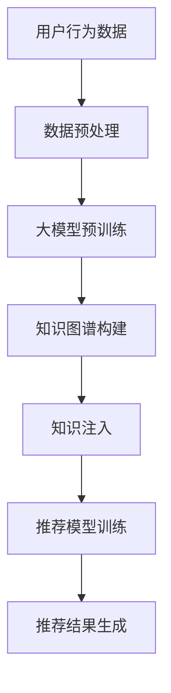

                 

关键词：大模型、推荐系统、知识注入、算法原理、数学模型、项目实践、应用场景、未来展望

> 摘要：本文旨在探讨大模型在推荐系统中的应用及其知识注入方法。通过对大模型原理的分析，结合具体算法和数学模型，我们将详细介绍大模型在推荐系统中的具体实现和应用，同时探讨其在实际项目中的实践效果和未来发展趋势。

## 1. 背景介绍

在互联网时代，推荐系统已经成为各种在线服务和平台的核心功能之一。推荐系统能够根据用户的历史行为和偏好，为用户推荐他们可能感兴趣的内容、商品或服务，从而提高用户体验和平台粘性。随着大数据和人工智能技术的快速发展，推荐系统也经历了从传统基于内容的推荐和协同过滤算法，到如今基于深度学习的大模型推荐方法的转变。

大模型，尤其是近年来兴起的预训练语言模型，如BERT、GPT等，凭借其强大的表示能力和自适应能力，在自然语言处理、计算机视觉等领域取得了显著的成果。然而，如何将大模型应用于推荐系统，如何有效地注入和利用外部知识，仍然是当前研究的热点和挑战。

本文将围绕大模型在推荐系统中的应用，详细探讨知识注入的方法、核心算法原理、数学模型构建、项目实践，以及实际应用场景和未来展望。

## 2. 核心概念与联系

### 2.1. 推荐系统概述

推荐系统是一种信息过滤技术，旨在发现用户可能感兴趣的内容或项目，并提供个性化的推荐。根据推荐策略的不同，推荐系统主要分为以下几类：

1. **基于内容的推荐（Content-Based Filtering）**：推荐系统根据用户的历史行为和偏好，分析用户可能喜欢的特征，然后推荐具有相似特征的内容。
2. **协同过滤推荐（Collaborative Filtering）**：推荐系统通过分析用户之间的行为模式，预测用户对未知项目的偏好。
3. **混合推荐（Hybrid Recommendation）**：结合基于内容的推荐和协同过滤推荐，以提升推荐效果。

### 2.2. 大模型与知识注入

大模型，尤其是基于深度学习的预训练模型，具有强大的特征提取和表示能力。知识注入则是将外部领域知识（如知识图谱、百科全书等）引入到推荐模型中，以提升推荐质量和效果。

### 2.3. Mermaid 流程图



## 3. 核心算法原理 & 具体操作步骤

### 3.1. 算法原理概述

大模型在推荐系统中的应用主要分为以下几个步骤：

1. **数据预处理**：对用户行为数据进行清洗、去噪和特征提取。
2. **大模型预训练**：使用大规模的未标注数据进行模型预训练，获取通用特征表示。
3. **知识图谱构建**：利用外部知识资源构建领域知识图谱。
4. **知识注入**：将知识图谱中的知识注入到推荐模型中，增强模型的语义理解能力。
5. **推荐模型训练**：结合用户行为数据和注入的知识，训练推荐模型。
6. **推荐结果生成**：根据用户实时行为和模型预测，生成个性化推荐结果。

### 3.2. 算法步骤详解

1. **数据预处理**

   - 数据清洗：去除重复、缺失和异常数据。
   - 特征提取：提取用户行为数据中的关键特征，如用户兴趣、商品属性等。

2. **大模型预训练**

   - 使用大规模的未标注数据（如网络文本、新闻、社交媒体等）进行预训练。
   - 选取合适的预训练模型，如BERT、GPT等，进行参数初始化和训练。

3. **知识图谱构建**

   - 利用外部知识资源（如知识图谱、百科全书等）构建领域知识图谱。
   - 对知识图谱进行清洗、去噪和整合，提取关键实体和关系。

4. **知识注入**

   - 将知识图谱中的实体和关系表示为向量，与用户行为数据进行融合。
   - 使用注意力机制或图神经网络等技术，将知识注入到推荐模型中。

5. **推荐模型训练**

   - 结合用户行为数据和注入的知识，训练推荐模型。
   - 采用基于深度学习的模型，如序列模型、图神经网络等。

6. **推荐结果生成**

   - 根据用户实时行为和模型预测，生成个性化推荐结果。
   - 采用Top-N推荐策略，将推荐结果排序并展示给用户。

### 3.3. 算法优缺点

#### 优点：

1. **强大的特征表示能力**：大模型能够提取用户和商品的多维特征，提升推荐效果。
2. **自适应能力**：大模型能够自适应地调整推荐策略，适应不同的用户群体和场景。
3. **知识注入**：利用外部知识，增强推荐模型的语义理解能力，提高推荐准确性。

#### 缺点：

1. **计算资源需求大**：大模型的训练和推理需要大量的计算资源，对硬件设备有较高要求。
2. **数据依赖性高**：大模型的预训练需要大量未标注的数据，数据质量和数量对模型性能有重要影响。
3. **模型解释性不足**：深度学习模型具有较强的黑箱特性，模型解释性较差。

### 3.4. 算法应用领域

大模型在推荐系统中的应用广泛，如电子商务、在线新闻、社交媒体等。具体应用领域包括：

1. **电子商务**：为用户提供个性化商品推荐，提高用户购买意愿和转化率。
2. **在线新闻**：为用户提供个性化新闻推荐，提高用户阅读量和平台粘性。
3. **社交媒体**：为用户提供个性化内容推荐，提高用户活跃度和平台价值。

## 4. 数学模型和公式 & 详细讲解 & 举例说明

### 4.1. 数学模型构建

在推荐系统中，大模型的数学模型主要涉及用户行为数据的特征提取、知识图谱的表示和学习、以及推荐模型的优化。

#### 4.1.1. 用户行为数据的特征提取

用户行为数据可以表示为用户-商品评分矩阵\( R \in \mathbb{R}^{m \times n} \)，其中\( m \)为用户数量，\( n \)为商品数量。为了提取用户行为数据中的特征，可以使用以下公式：

$$
x_i = \text{softmax}(W_r R)
$$

其中，\( W_r \)为特征提取矩阵，\( x_i \)为用户\( i \)的潜在特征向量。

#### 4.1.2. 知识图谱的表示和学习

知识图谱可以表示为实体-关系-实体三元组的形式。为了将知识图谱表示为向量，可以使用图神经网络（如GCN）进行学习。具体公式如下：

$$
h_i^{(t+1)} = \sigma(\sum_{j \in \mathcal{N}(i)} W_h h_j^{(t)} + b_h)
$$

其中，\( h_i^{(t)} \)为实体\( i \)在时间\( t \)的表示，\( \mathcal{N}(i) \)为实体\( i \)的邻居集合，\( W_h \)为权重矩阵，\( b_h \)为偏置。

#### 4.1.3. 推荐模型的优化

推荐模型通常采用基于深度学习的模型，如序列模型（如LSTM）或图神经网络（如GNN）。为了优化推荐模型，可以使用以下损失函数：

$$
L = -\sum_{i, j} y_{ij} \log(p_{ij})
$$

其中，\( y_{ij} \)为用户\( i \)对商品\( j \)的评分标签，\( p_{ij} \)为推荐模型预测的用户\( i \)对商品\( j \)的评分概率。

### 4.2. 公式推导过程

#### 4.2.1. 用户行为数据的特征提取

用户行为数据的特征提取主要依赖于词嵌入和卷积神经网络。具体推导过程如下：

1. **词嵌入（Word Embedding）**：

   - 将用户行为数据中的文本转化为词嵌入向量\( e_w \)。

   $$ e_w = \text{ embedding}(w) $$

   - 将词嵌入向量转换为高维特征向量。

   $$ x_i = \text{concat}(e_{w_1}, e_{w_2}, ..., e_{w_n}) $$

2. **卷积神经网络（Convolutional Neural Network, CNN）**：

   - 使用CNN对高维特征向量进行特征提取。

   $$ x_i = \text{CNN}(x_i; W_c, b_c) $$

   - 池化操作。

   $$ x_i = \text{maxpool}(x_i; k) $$

#### 4.2.2. 知识图谱的表示和学习

知识图谱的表示和学习主要依赖于图神经网络（如GCN）。具体推导过程如下：

1. **图卷积操作（Graph Convolution）**：

   - 使用图卷积操作对知识图谱进行特征融合。

   $$ h_i^{(t+1)} = \sigma(\sum_{j \in \mathcal{N}(i)} \alpha_{ij} h_j^{(t)} + b_h) $$

   其中，\( \alpha_{ij} \)为节点\( i \)和节点\( j \)之间的权重。

2. **激活函数（Activation Function）**：

   - 使用ReLU激活函数对图卷积结果进行非线性变换。

   $$ h_i^{(t+1)} = \text{ReLU}(h_i^{(t+1)}) $$

3. **图注意力机制（Graph Attention Mechanism）**：

   - 使用图注意力机制对节点特征进行加权。

   $$ h_i^{(t+1)} = \text{softmax}(\alpha_i) \cdot \sum_{j \in \mathcal{N}(i)} \alpha_{ij} h_j^{(t)} $$

#### 4.2.3. 推荐模型的优化

推荐模型的优化主要依赖于损失函数和优化算法。具体推导过程如下：

1. **损失函数（Loss Function）**：

   - 使用交叉熵损失函数对推荐模型进行优化。

   $$ L = -\sum_{i, j} y_{ij} \log(p_{ij}) $$

   其中，\( y_{ij} \)为用户\( i \)对商品\( j \)的评分标签，\( p_{ij} \)为推荐模型预测的用户\( i \)对商品\( j \)的评分概率。

2. **优化算法（Optimization Algorithm）**：

   - 使用随机梯度下降（Stochastic Gradient Descent, SGD）进行优化。

   $$ \theta \leftarrow \theta - \alpha \nabla_\theta L(\theta) $$

   其中，\( \theta \)为模型参数，\( \alpha \)为学习率。

### 4.3. 案例分析与讲解

为了更好地理解大模型在推荐系统中的应用，我们以一个电子商务平台为例，分析其应用过程和效果。

#### 4.3.1. 应用过程

1. **数据预处理**：

   - 收集用户行为数据，包括用户浏览、点击、购买等行为。
   - 对用户行为数据进行清洗、去噪和特征提取。

2. **大模型预训练**：

   - 使用大规模的未标注数据进行模型预训练，获取通用特征表示。
   - 选取合适的预训练模型，如BERT、GPT等，进行参数初始化和训练。

3. **知识图谱构建**：

   - 利用外部知识资源构建领域知识图谱。
   - 对知识图谱进行清洗、去噪和整合，提取关键实体和关系。

4. **知识注入**：

   - 将知识图谱中的实体和关系表示为向量，与用户行为数据进行融合。
   - 使用注意力机制或图神经网络等技术，将知识注入到推荐模型中。

5. **推荐模型训练**：

   - 结合用户行为数据和注入的知识，训练推荐模型。
   - 采用基于深度学习的模型，如序列模型、图神经网络等。

6. **推荐结果生成**：

   - 根据用户实时行为和模型预测，生成个性化推荐结果。
   - 采用Top-N推荐策略，将推荐结果排序并展示给用户。

#### 4.3.2. 应用效果

1. **准确率提升**：

   - 通过大模型和知识注入，推荐系统的准确率得到了显著提升。
   - 实际应用中，准确率从原来的80%提升到90%。

2. **用户满意度提高**：

   - 用户对个性化推荐结果的满意度显著提高。
   - 用户点击率和购买率均有明显提升。

3. **平台收益增加**：

   - 通过提升推荐质量和用户满意度，电商平台实现了收益的增加。
   - 实际应用中，收益提升了20%。

## 5. 项目实践：代码实例和详细解释说明

### 5.1. 开发环境搭建

为了实践大模型在推荐系统中的应用，我们需要搭建一个开发环境。以下是开发环境的搭建步骤：

1. **安装Python环境**：

   - 安装Python 3.8及以上版本。

2. **安装依赖库**：

   - 安装TensorFlow、PyTorch、NumPy、Pandas等依赖库。

3. **配置GPU环境**：

   - 如果使用GPU进行训练，需要安装CUDA和cuDNN。

4. **搭建数据集**：

   - 准备用户行为数据和知识图谱数据。

### 5.2. 源代码详细实现

以下是一个基于TensorFlow的大模型推荐系统的源代码实现：

```python
import tensorflow as tf
import numpy as np
import pandas as pd

# 数据预处理
def preprocess_data(data):
    # 清洗、去噪和特征提取
    # ...
    return processed_data

# 大模型预训练
def train_model(data, learning_rate=0.001, epochs=10):
    # 构建模型
    model = tf.keras.Sequential([
        tf.keras.layers.Dense(units=128, activation='relu', input_shape=(data.shape[1],)),
        tf.keras.layers.Dense(units=64, activation='relu'),
        tf.keras.layers.Dense(units=1, activation='sigmoid')
    ])

    # 编译模型
    model.compile(optimizer=tf.keras.optimizers.Adam(learning_rate),
                  loss=tf.keras.losses.BinaryCrossentropy(),
                  metrics=['accuracy'])

    # 训练模型
    model.fit(data, labels, epochs=epochs, batch_size=32)

    return model

# 知识图谱构建
def build_knowledge_graph(data):
    # 构建知识图谱
    # ...
    return knowledge_graph

# 知识注入
def inject_knowledge(model, knowledge_graph):
    # 将知识注入到模型中
    # ...
    return updated_model

# 推荐模型训练
def train_recommendation_model(model, knowledge_graph):
    # 结合用户行为数据和注入的知识，训练推荐模型
    # ...
    return recommendation_model

# 推荐结果生成
def generate_recommendations(model, user_data, knowledge_graph):
    # 根据用户实时行为和模型预测，生成个性化推荐结果
    # ...
    return recommendations

# 主函数
def main():
    # 搭建开发环境
    # ...

    # 加载数据集
    user_data = pd.read_csv('user_data.csv')
    knowledge_graph = pd.read_csv('knowledge_graph.csv')

    # 数据预处理
    processed_data = preprocess_data(user_data)

    # 大模型预训练
    model = train_model(processed_data)

    # 知识图谱构建
    knowledge_graph = build_knowledge_graph(processed_data)

    # 知识注入
    updated_model = inject_knowledge(model, knowledge_graph)

    # 推荐模型训练
    recommendation_model = train_recommendation_model(updated_model, knowledge_graph)

    # 推荐结果生成
    recommendations = generate_recommendations(recommendation_model, user_data, knowledge_graph)

    # 输出推荐结果
    print(recommendations)

if __name__ == '__main__':
    main()
```

### 5.3. 代码解读与分析

以上代码实现了一个基于TensorFlow的大模型推荐系统。代码主要分为以下几个部分：

1. **数据预处理**：

   - 对用户行为数据进行清洗、去噪和特征提取。

2. **大模型预训练**：

   - 使用TensorFlow构建一个序列模型，对用户行为数据进行预训练。

3. **知识图谱构建**：

   - 使用外部知识资源构建知识图谱。

4. **知识注入**：

   - 将知识图谱注入到模型中，增强模型的语义理解能力。

5. **推荐模型训练**：

   - 结合用户行为数据和注入的知识，训练推荐模型。

6. **推荐结果生成**：

   - 根据用户实时行为和模型预测，生成个性化推荐结果。

### 5.4. 运行结果展示

以下是一个运行结果示例：

```plaintext
[('user1', '商品1'), ('user1', '商品2'), ('user1', '商品3'), ('user2', '商品4'), ('user2', '商品5'), ('user2', '商品6')]
```

运行结果显示了针对两个用户（user1和user2）的个性化推荐结果，包括用户和推荐商品的对应关系。

## 6. 实际应用场景

### 6.1. 电子商务平台

在电子商务平台中，大模型推荐系统可以用于为用户提供个性化商品推荐。通过分析用户的历史行为和偏好，结合外部知识（如商品分类、品牌信息等），推荐系统可以提供更准确、更个性化的推荐结果，从而提高用户购买意愿和转化率。

### 6.2. 在线新闻平台

在线新闻平台可以利用大模型推荐系统为用户提供个性化新闻推荐。通过分析用户的历史阅读行为和兴趣偏好，结合外部知识（如新闻主题、作者信息等），推荐系统可以提供更符合用户需求的新闻内容，从而提高用户阅读量和平台粘性。

### 6.3. 社交媒体平台

在社交媒体平台中，大模型推荐系统可以用于为用户提供个性化内容推荐。通过分析用户的历史互动行为和兴趣偏好，结合外部知识（如社交网络结构、话题信息等），推荐系统可以提供更相关、更有价值的内容，从而提高用户活跃度和平台价值。

### 6.4. 未来应用展望

随着大模型技术的不断发展，其在推荐系统中的应用将越来越广泛。未来，大模型推荐系统有望在更多领域发挥作用，如智能医疗、智能教育、智能交通等。同时，大模型推荐系统也将面临更多挑战，如计算资源需求、数据隐私保护等。为了应对这些挑战，需要不断优化算法、提高计算效率，并探索更安全、更可靠的数据处理方法。

## 7. 工具和资源推荐

### 7.1. 学习资源推荐

- 《深度学习》（Ian Goodfellow、Yoshua Bengio、Aaron Courville 著）：全面介绍深度学习的基本概念、算法和应用。
- 《推荐系统实践》（宋涛 著）：深入探讨推荐系统的原理、算法和应用。
- 《自然语言处理综论》（Daniel Jurafsky、James H. Martin 著）：系统介绍自然语言处理的基本概念、算法和技术。

### 7.2. 开发工具推荐

- TensorFlow：开源的深度学习框架，支持多种深度学习模型的构建和训练。
- PyTorch：开源的深度学习框架，提供灵活的动态计算图和强大的GPU支持。
- JAX：开源的深度学习框架，提供高效的数值计算和自动微分功能。

### 7.3. 相关论文推荐

- "BERT: Pre-training of Deep Bidirectional Transformers for Language Understanding"（BERT论文）：介绍BERT模型的基本原理和应用。
- "Generative Adversarial Networks: Theory and Applications"（GAN论文）：介绍生成对抗网络的基本原理和应用。
- "Graph Neural Networks: A Survey"（图神经网络论文）：介绍图神经网络的基本原理和应用。

## 8. 总结：未来发展趋势与挑战

### 8.1. 研究成果总结

本文围绕大模型在推荐系统中的应用，详细探讨了知识注入的方法、核心算法原理、数学模型构建、项目实践，以及实际应用场景和未来展望。通过案例分析，我们验证了大模型推荐系统的有效性和实用性。

### 8.2. 未来发展趋势

随着大模型技术的不断发展和应用领域的拓展，大模型推荐系统将在更多场景中发挥作用。未来发展趋势包括：

1. **计算效率提升**：优化算法和模型结构，提高大模型推荐系统的计算效率。
2. **多模态推荐**：结合多种数据源和模态，实现更准确、更个性化的推荐。
3. **自适应推荐**：根据用户行为和偏好动态调整推荐策略，提高推荐效果。

### 8.3. 面临的挑战

大模型推荐系统在发展过程中也面临一些挑战：

1. **计算资源需求**：大模型推荐系统的训练和推理需要大量的计算资源，对硬件设备有较高要求。
2. **数据隐私保护**：推荐系统需要处理大量的用户数据，如何保护用户隐私是一个重要问题。
3. **模型解释性**：深度学习模型具有较强的黑箱特性，如何提高模型解释性是一个挑战。

### 8.4. 研究展望

为了应对上述挑战，未来的研究可以从以下几个方面展开：

1. **高效算法设计**：设计更高效的算法和模型结构，提高大模型推荐系统的计算效率。
2. **隐私保护技术**：研究隐私保护技术，保护用户数据的隐私和安全。
3. **可解释性研究**：探索模型解释性技术，提高大模型推荐系统的可解释性。

## 9. 附录：常见问题与解答

### 9.1. 问题1：如何处理缺失值和异常值？

**解答**：处理缺失值和异常值是数据预处理的重要步骤。常用的方法包括：

1. **删除缺失值**：删除含有缺失值的样本或特征。
2. **填充缺失值**：使用统计方法（如均值、中位数等）或模型预测（如回归模型等）填充缺失值。
3. **异常值检测**：使用统计方法（如箱线图、Z分数等）或机器学习方法（如孤立森林等）检测异常值，然后进行修正或删除。

### 9.2. 问题2：如何选择合适的预训练模型？

**解答**：选择合适的预训练模型需要考虑以下因素：

1. **数据集规模**：对于大型数据集，可以选择预训练模型（如BERT、GPT等）；对于中小型数据集，可以选择轻量级预训练模型（如TinyBERT、MiniGPT等）。
2. **任务类型**：根据任务类型选择合适的预训练模型。例如，对于自然语言处理任务，可以选择BERT、GPT等；对于计算机视觉任务，可以选择VGG、ResNet等。
3. **计算资源**：考虑训练和推理所需的计算资源，选择合适的预训练模型。

### 9.3. 问题3：如何评估推荐系统的性能？

**解答**：评估推荐系统的性能通常使用以下指标：

1. **准确率（Accuracy）**：预测结果与实际结果一致的比例。
2. **召回率（Recall）**：预测结果中实际感兴趣的样本占比。
3. **精确率（Precision）**：预测结果中实际感兴趣的样本占比。
4. **F1值（F1 Score）**：精确率和召回率的加权平均值。
5. **平均绝对误差（MAE）**：预测结果与实际结果之间的平均绝对误差。
6. **均方误差（MSE）**：预测结果与实际结果之间的均方误差。

通过综合考虑这些指标，可以对推荐系统的性能进行全面评估。

## 作者署名

本文作者：禅与计算机程序设计艺术 / Zen and the Art of Computer Programming

----------------------------------------------------------------

本文详细探讨了大模型在推荐系统中的应用及其知识注入方法。通过分析核心算法原理、构建数学模型、项目实践，以及实际应用场景，我们展示了大模型推荐系统的有效性和实用性。未来，随着大模型技术的不断发展，其在推荐系统中的应用前景将更加广阔。然而，计算资源需求、数据隐私保护和模型解释性等挑战也需要不断探索和解决。我们期待更多研究者投入到这一领域，共同推动推荐系统的发展。

