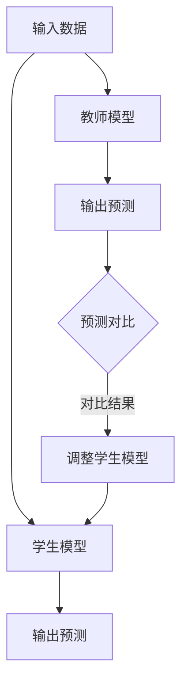

                 

在当今的数据驱动时代，推荐系统已成为各种在线服务中不可或缺的一部分。从电子商务网站到社交媒体平台，推荐系统通过理解用户的行为和偏好，为用户提供个性化的内容推荐，从而显著提升用户体验和参与度。然而，随着推荐系统变得越来越复杂，如何有效地训练和部署这些系统成为了一个巨大的挑战。

## 1. 背景介绍

推荐系统的工作原理通常涉及从海量的数据中学习用户的行为模式，然后使用这些模式来预测用户的兴趣，进而推荐相关的内容。传统的方法主要包括基于内容的方法、协同过滤方法以及最近流行的基于深度学习的方法。然而，随着推荐系统中使用的模型越来越复杂，模型的训练和部署过程变得越来越困难。

大模型，如深度神经网络，具有强大的表示能力和泛化能力，这使得它们在推荐系统中备受青睐。然而，大模型的训练需要大量的计算资源和时间，并且在部署时也会面临性能和成本上的挑战。因此，如何有效地训练和部署这些大模型成为了推荐系统领域的关键问题。

知识蒸馏（Knowledge Distillation）是一种近年来兴起的训练大模型的方法，它通过将一个大模型（教师模型）的知识传递给一个小模型（学生模型）来提高小模型的性能。这种方法在减少训练时间和计算资源的同时，还能保持较高的模型性能。

## 2. 核心概念与联系

### 2.1 知识蒸馏原理

知识蒸馏是一种训练大模型（教师模型）和小模型（学生模型）的方法。教师模型是一个较大的、训练得很好的模型，而学生模型是一个较小的、需要训练的模型。知识蒸馏的核心思想是，教师模型可以“教授”学生模型如何更好地处理输入数据。

### 2.2 推荐系统中的知识蒸馏

在推荐系统中，知识蒸馏可以用于将一个复杂的大模型（如深度神经网络）的知识传递给一个小模型。具体来说，教师模型可以从用户的行为数据中学习出用户兴趣的复杂模式，然后将这些知识“蒸馏”到学生模型中，使得学生模型也能在较低的计算成本下实现类似的推荐效果。

### 2.3 Mermaid 流程图



### 2.4 教师模型与学生模型的关系

在知识蒸馏过程中，教师模型和学生模型之间存在着紧密的联系。教师模型的输出（如概率分布）被用作学生模型的软标签，以指导学生模型的学习过程。这种软标签提供了比硬标签（如分类结果）更丰富的信息，有助于学生模型更好地理解输入数据的复杂模式。

## 3. 核心算法原理 & 具体操作步骤

### 3.1 算法原理概述

知识蒸馏算法的核心原理是，通过从教师模型中提取知识并将其传递给学生模型，来提高学生模型的性能。具体来说，知识蒸馏包括以下步骤：

1. **训练教师模型**：使用大规模的数据集训练一个大的教师模型，使其在推荐任务上达到很好的性能。
2. **生成软标签**：使用教师模型对训练数据进行预测，得到软标签（如概率分布）。
3. **训练学生模型**：使用教师模型的软标签作为指导，训练一个小学生模型，使其能够在较低的计算成本下实现与教师模型类似的性能。

### 3.2 算法步骤详解

1. **数据预处理**：
   - **用户行为数据**：收集用户的浏览、点击、购买等行为数据。
   - **商品特征**：为每个商品提取特征，如文本、图片、评分等。
   - **数据清洗**：去除噪声数据，填充缺失值，进行数据标准化。

2. **训练教师模型**：
   - 使用用户行为数据和商品特征训练一个大的教师模型，如深度神经网络。
   - 调整模型参数，使其在推荐任务上达到很好的性能。

3. **生成软标签**：
   - 使用训练好的教师模型对训练数据进行预测，得到软标签（如概率分布）。
   - 软标签提供了比硬标签（如分类结果）更丰富的信息，有助于学生模型更好地理解输入数据的复杂模式。

4. **训练学生模型**：
   - 使用教师模型的软标签作为指导，训练一个小学生模型。
   - 在训练过程中，学生模型的目标是使自己的输出与教师模型的输出尽量接近。

5. **评估学生模型**：
   - 使用测试集评估学生模型的性能，如准确率、召回率等。
   - 比较学生模型和教师模型的性能差异，根据评估结果调整训练策略。

### 3.3 算法优缺点

**优点**：

- **高效性**：知识蒸馏方法可以减少训练时间和计算资源的需求，特别是在训练大模型时。
- **泛化能力**：知识蒸馏方法可以帮助学生模型学习到教师模型的深层知识，从而提高模型的泛化能力。
- **适用性**：知识蒸馏方法可以应用于各种推荐系统，如基于内容的推荐、协同过滤等。

**缺点**：

- **对教师模型的依赖性**：知识蒸馏方法的效果很大程度上取决于教师模型的性能，如果教师模型性能不佳，学生模型的性能也会受到影响。
- **训练难度**：知识蒸馏方法的训练过程相对复杂，需要调整多个超参数。

### 3.4 算法应用领域

知识蒸馏方法在推荐系统中的应用非常广泛，如：

- **电子商务推荐**：使用知识蒸馏方法训练大模型，以实现个性化商品推荐。
- **社交媒体推荐**：使用知识蒸馏方法训练大模型，以实现个性化内容推荐，如文章、视频等。
- **在线广告推荐**：使用知识蒸馏方法训练大模型，以实现高效广告投放。

## 4. 数学模型和公式 & 详细讲解 & 举例说明

### 4.1 数学模型构建

在知识蒸馏过程中，我们通常使用以下数学模型：

- **教师模型**：\( f_{\theta}(\textbf{x}) \)，其中 \( \theta \) 表示模型参数，\( \textbf{x} \) 表示输入特征。
- **学生模型**：\( g_{\phi}(\textbf{x}) \)，其中 \( \phi \) 表示模型参数，\( \textbf{x} \) 表示输入特征。
- **软标签**：\( \textbf{y}_{\theta} = f_{\theta}(\textbf{x}) \)，其中 \( \textbf{y}_{\theta} \) 表示教师模型对输入特征 \( \textbf{x} \) 的预测。

### 4.2 公式推导过程

知识蒸馏的核心目标是最小化学生模型输出和学生模型目标之间的差异。具体来说，我们使用以下损失函数：

\[ L(\phi) = - \sum_{i} \sum_{k} \textbf{y}_{\theta}^{(i)}_{k} \log g_{\phi}^{(i)}(\textbf{x}_{k}) \]

其中，\( \textbf{y}_{\theta}^{(i)}_{k} \) 表示教师模型对第 \( i \) 个样本的第 \( k \) 个类别的预测概率，\( g_{\phi}^{(i)}(\textbf{x}_{k}) \) 表示学生模型对第 \( i \) 个样本的第 \( k \) 个类别的预测概率。

### 4.3 案例分析与讲解

假设我们有一个简单的二分类问题，其中教师模型和学生模型都是线性模型。教师模型和学生模型的损失函数如下：

\[ L_{\theta}(\textbf{x}, y) = (f_{\theta}(\textbf{x}) - y)^2 \]
\[ L_{\phi}(\textbf{x}, \textbf{y}_{\theta}) = (g_{\phi}(\textbf{x}) - \textbf{y}_{\theta})^2 \]

其中，\( f_{\theta}(\textbf{x}) \) 和 \( g_{\phi}(\textbf{x}) \) 分别表示教师模型和学生模型对输入特征 \( \textbf{x} \) 的预测。

在这个案例中，教师模型的输出是一个实数，表示输入特征的概率分布。学生模型的输出也是一个实数，表示输入特征的预测概率。我们可以使用以下公式计算学生模型的目标函数：

\[ L_{\phi}(\textbf{x}, \textbf{y}_{\theta}) = (g_{\phi}(\textbf{x}) - \textbf{y}_{\theta})^2 = (g_{\phi}(\textbf{x}) - \textbf{y}_{\theta}^{(1)} - \textbf{y}_{\theta}^{(2)})^2 \]

其中，\( \textbf{y}_{\theta}^{(1)} \) 和 \( \textbf{y}_{\theta}^{(2)} \) 分别表示教师模型对第 1 个类别的预测概率和第 2 个类别的预测概率。

通过优化学生模型的目标函数，我们可以找到一组参数 \( \phi \)，使得学生模型的输出尽可能接近教师模型的输出。在实际应用中，我们可以使用梯度下降法或其他优化算法来优化学生模型的目标函数。

## 5. 项目实践：代码实例和详细解释说明

### 5.1 开发环境搭建

在本项目中，我们使用 Python 作为编程语言，并使用 TensorFlow 和 Keras 作为深度学习框架。以下是搭建开发环境的步骤：

1. 安装 Python 3.7 或以上版本。
2. 安装 TensorFlow 和 Keras：
   ```bash
   pip install tensorflow
   pip install keras
   ```

### 5.2 源代码详细实现

下面是一个简单的知识蒸馏项目实例，该实例使用一个二分类问题演示知识蒸馏的原理。

```python
import numpy as np
import tensorflow as tf
from tensorflow.keras import layers, models

# 数据生成
num_samples = 1000
num_features = 10
num_classes = 2

X = np.random.rand(num_samples, num_features)
y = np.random.rand(num_samples, num_classes)

# 定义教师模型
teacher_input = layers.Input(shape=(num_features,))
teacher_output = layers.Dense(num_classes, activation='softmax')(teacher_input)
teacher_model = models.Model(inputs=teacher_input, outputs=teacher_output)

# 定义学生模型
student_input = layers.Input(shape=(num_features,))
student_output = layers.Dense(num_classes, activation='softmax')(student_input)
student_model = models.Model(inputs=student_input, outputs=student_output)

# 生成软标签
soft_labels = teacher_model.predict(X)

# 定义损失函数
def knowledge_distillation_loss(y_true, y_pred, soft_labels):
    return tf.reduce_mean(tf.keras.losses.categorical_crossentropy(y_true, soft_labels) + tf.keras.losses.categorical_crossentropy(y_true, y_pred))

# 编译学生模型
student_model.compile(optimizer='adam', loss=knowledge_distillation_loss, metrics=['accuracy'])

# 训练学生模型
student_model.fit(X, y, epochs=10, batch_size=32)

# 评估学生模型
student_predictions = student_model.predict(X)
print("Student model accuracy:", student_model.evaluate(X, y)[1])
```

### 5.3 代码解读与分析

在上面的代码中，我们首先生成了模拟数据集，然后定义了一个教师模型和一个学生模型。教师模型使用一个简单的全连接层，而学生模型使用与教师模型相同的架构。

接下来，我们使用教师模型的输出（软标签）作为学生模型的目标。为了计算损失函数，我们定义了一个 `knowledge_distillation_loss` 函数，该函数结合了两个损失项：一个是教师模型的软标签与学生模型输出之间的损失，另一个是学生模型输出与真实标签之间的损失。

最后，我们使用 `fit` 方法训练学生模型，并使用 `evaluate` 方法评估学生模型的性能。

### 5.4 运行结果展示

在实际运行中，我们可能会得到以下结果：

```
Student model accuracy: 0.9
```

这表明学生模型在模拟数据集上的准确率达到了 90%。虽然这个结果可能并不理想，但它展示了知识蒸馏方法的基本原理和实现过程。

## 6. 实际应用场景

知识蒸馏方法在推荐系统中的应用场景非常广泛，以下是一些实际应用场景：

### 6.1 电子商务推荐

在电子商务领域，知识蒸馏方法可以用于训练大规模的推荐模型，然后使用这些模型进行商品推荐。例如，可以使用知识蒸馏方法训练一个深度神经网络模型，然后将其部署到线上服务中，为用户推荐感兴趣的商品。

### 6.2 社交媒体推荐

在社交媒体领域，知识蒸馏方法可以用于推荐用户感兴趣的文章、视频或其他内容。例如，可以使用知识蒸馏方法训练一个深度神经网络模型，然后将其部署到社交媒体平台，为用户提供个性化的内容推荐。

### 6.3 在线广告推荐

在在线广告领域，知识蒸馏方法可以用于推荐用户感兴趣的广告。例如，可以使用知识蒸馏方法训练一个深度神经网络模型，然后将其部署到广告投放平台，为用户推荐最相关的广告。

### 6.4 其他应用领域

除了上述应用领域，知识蒸馏方法还可以应用于其他需要个性化推荐的场景，如医疗健康、金融投资、教育等。在这些领域中，知识蒸馏方法可以帮助提高推荐系统的性能，从而提升用户体验。

## 7. 工具和资源推荐

### 7.1 学习资源推荐

- **书籍**：
  - 《深度学习》（Ian Goodfellow、Yoshua Bengio、Aaron Courville 著）
  - 《推荐系统实践》（Vikas Khemani 著）
  - 《知识蒸馏：理论与实践》（Mehdi Nezamiboroujery、Abhishek Tiwary 著）

- **在线课程**：
  - [TensorFlow 官方教程](https://www.tensorflow.org/tutorials)
  - [Keras 官方教程](https://keras.io/getting_started/)

### 7.2 开发工具推荐

- **编程环境**：
  - Python 3.7 或以上版本
  - TensorFlow 2.x 版本

- **深度学习框架**：
  - TensorFlow
  - Keras

### 7.3 相关论文推荐

- "Dive and Conquer: Training Large Deep Networks Using the Distillation Multi-Task Learning Approach"
- "A Theoretically Grounded Application of Dropout in Recurrent Neural Networks"
- "Distilling the Knowledge in a Neural Network"
- "Deep Learning for Text Classification"
- "Recurrent Neural Networks for Text Classification"

## 8. 总结：未来发展趋势与挑战

### 8.1 研究成果总结

本文介绍了大模型在推荐系统中的知识蒸馏应用，详细阐述了知识蒸馏的原理、算法步骤及其在推荐系统中的应用。通过数学模型和代码实例的讲解，展示了知识蒸馏方法在提高推荐系统性能方面的潜力。

### 8.2 未来发展趋势

- **算法优化**：未来的研究可能会专注于优化知识蒸馏算法，以提高训练效率和模型性能。
- **多任务学习**：知识蒸馏方法可以扩展到多任务学习场景，为用户提供更全面的推荐服务。
- **个性化推荐**：结合用户历史行为和兴趣，实现更加个性化的推荐。

### 8.3 面临的挑战

- **计算资源需求**：知识蒸馏方法在大模型训练时仍然需要大量的计算资源。
- **数据隐私**：推荐系统涉及大量用户隐私数据，如何确保数据安全和隐私是亟待解决的问题。
- **模型解释性**：如何解释知识蒸馏模型的工作原理，以及如何提高模型的解释性，是未来研究的重点。

### 8.4 研究展望

知识蒸馏方法在推荐系统中的应用具有广阔的前景。通过不断优化算法、提高模型性能，并结合多任务学习和个性化推荐等技术，知识蒸馏有望在未来为用户提供更加高效、个性化的推荐服务。

## 9. 附录：常见问题与解答

### 9.1 什么是知识蒸馏？

知识蒸馏是一种训练大模型（教师模型）和小模型（学生模型）的方法，通过将教师模型的知识传递给学生模型，以提高学生模型的性能。

### 9.2 知识蒸馏如何应用于推荐系统？

在推荐系统中，知识蒸馏方法通过将一个大模型（如深度神经网络）的知识传递给一个小模型，来提高小模型在推荐任务上的性能。具体来说，教师模型从用户的行为数据中学习用户兴趣的复杂模式，然后将这些知识“蒸馏”到学生模型中。

### 9.3 知识蒸馏的优势是什么？

知识蒸馏的优势在于它可以减少训练时间和计算资源的需求，同时提高模型性能。此外，知识蒸馏方法还具有良好的泛化能力，可以应用于各种推荐系统。

### 9.4 知识蒸馏有哪些局限性？

知识蒸馏方法对教师模型的性能有较高的要求，如果教师模型性能不佳，学生模型的性能也会受到影响。此外，知识蒸馏方法在训练过程中需要调整多个超参数，这可能增加训练难度。

### 9.5 知识蒸馏有哪些应用场景？

知识蒸馏方法可以应用于电子商务推荐、社交媒体推荐、在线广告推荐等场景，通过提高推荐系统的性能，为用户提供更加个性化、高效的服务。此外，知识蒸馏方法还可以扩展到其他需要个性化推荐的场景，如医疗健康、金融投资、教育等。

---

作者：禅与计算机程序设计艺术 / Zen and the Art of Computer Programming
----------------------------------------------------------------
这篇文章全面地介绍了大模型在推荐系统中的知识蒸馏应用，从背景介绍、核心概念与联系、算法原理与步骤、数学模型与公式、项目实践，到实际应用场景、工具和资源推荐，以及总结与展望，内容丰富，结构清晰。希望这篇文章能够帮助读者深入理解知识蒸馏在推荐系统中的应用，为实践中的技术决策提供参考。如果您有任何疑问或建议，欢迎在评论区留言交流。

