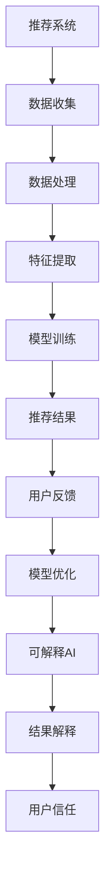

                 

关键词：推荐系统、可解释AI、大模型、机器学习、算法原理、应用场景

## 摘要

本文探讨了在大数据时代背景下，推荐系统与可解释AI（XAI）的深度融合，以及大模型在其中所扮演的关键角色。首先，本文回顾了推荐系统和可解释AI的基本概念，介绍了它们的发展历程和相互关系。接着，重点分析了大模型在推荐系统中带来的变革，特别是在提高推荐效果和可解释性方面的作用。随后，文章详细阐述了基于大模型的推荐系统可解释AI的核心算法原理和具体操作步骤，并通过实例说明了数学模型和公式的应用。最后，文章展示了项目实践中的代码实例，探讨了实际应用场景，并展望了未来发展趋势与挑战。

## 1. 背景介绍

### 推荐系统

推荐系统是一种信息过滤技术，旨在向用户提供个性化的推荐内容，提高用户的满意度和参与度。它广泛应用于电子商务、社交媒体、在线视频平台等多个领域。传统的推荐系统主要基于基于内容的过滤、协同过滤和基于模型的方法。然而，随着数据规模的扩大和用户需求的多样化，推荐系统面临着更大的挑战。

### 可解释AI（XAI）

可解释AI（Explainable Artificial Intelligence，简称XAI）旨在提高人工智能系统的透明度和可理解性，使其决策过程更加可解释。这对于增强用户信任、提高系统合规性和改进算法性能具有重要意义。可解释AI的目标是使机器学习模型的可解释性达到人类可理解的水平，从而让用户能够理解和信任系统的推荐结果。

### 大模型

大模型是指具有数十亿甚至数万亿参数的深度学习模型。这些模型能够捕捉大量数据中的复杂模式，并在多个任务中实现前所未有的性能。随着计算能力和数据资源的提升，大模型在自然语言处理、计算机视觉和推荐系统等领域得到了广泛应用。

## 2. 核心概念与联系

### 推荐系统与可解释AI的关系

推荐系统与可解释AI之间的联系日益紧密。传统的推荐系统往往以用户行为数据为基础，通过复杂的算法生成推荐结果。然而，这些结果往往难以解释，用户无法理解推荐背后的原因。为了提高系统的可解释性，研究者开始将可解释AI技术引入推荐系统，旨在提高用户对推荐结果的信任度。

### 大模型在推荐系统中的角色

大模型在推荐系统中发挥着重要作用。首先，大模型具有强大的学习能力，能够处理海量数据，并从中提取有效的特征。其次，大模型可以自适应地调整参数，以适应不断变化的数据环境和用户需求。此外，大模型还可以通过深度学习技术，实现推荐结果的自动优化，提高推荐效果。

### Mermaid 流程图



## 3. 核心算法原理 & 具体操作步骤

### 3.1 算法原理概述

基于大模型的推荐系统可解释AI的核心算法主要包括以下几个方面：

1. 数据预处理：包括数据清洗、去重、缺失值填充等操作，确保数据的质量和一致性。
2. 特征提取：利用深度学习模型从原始数据中提取具有代表性的特征，提高模型的泛化能力。
3. 模型训练：采用大规模神经网络模型对提取的特征进行训练，优化模型参数。
4. 推荐结果生成：根据训练好的模型，生成个性化的推荐结果。
5. 结果解释：利用可解释AI技术，对推荐结果进行解释，提高用户对推荐结果的信任度。
6. 模型优化：根据用户反馈，调整模型参数，实现推荐效果的持续优化。

### 3.2 算法步骤详解

1. **数据预处理**

   数据预处理是推荐系统可解释AI的基础。首先，对原始数据进行清洗，去除重复、无效和错误的数据。然后，对缺失值进行填充，可以采用均值、中位数或插值等方法。此外，还可以对数据进行标准化和归一化处理，使数据在相同的尺度上。

   ```mermaid
   graph TD
   A[数据收集] --> B[数据清洗]
   B --> C[缺失值填充]
   C --> D[数据标准化]
   D --> E[数据归一化]
   ```

2. **特征提取**

   特征提取是推荐系统可解释AI的关键环节。利用深度学习模型，从原始数据中提取具有代表性的特征。这些特征可以是用户行为、内容特征、社会关系等。通过深度学习模型的学习，可以自动提取数据中的有效信息，提高模型的泛化能力。

   ```mermaid
   graph TD
   A[数据处理] --> B[特征提取]
   B --> C[深度学习模型]
   C --> D[特征表示]
   ```

3. **模型训练**

   在特征提取后，利用训练数据对深度学习模型进行训练。通过优化模型参数，提高模型的预测能力。在训练过程中，可以采用各种优化算法，如梯度下降、随机梯度下降、Adam等。此外，还可以采用交叉验证等方法，避免过拟合。

   ```mermaid
   graph TD
   A[特征提取] --> B[模型训练]
   B --> C[优化算法]
   C --> D[交叉验证]
   ```

4. **推荐结果生成**

   在模型训练完成后，根据训练好的模型，生成个性化的推荐结果。推荐结果可以是商品、文章、视频等，根据用户的历史行为和兴趣进行个性化推荐。

   ```mermaid
   graph TD
   A[模型训练] --> B[推荐结果生成]
   B --> C[用户行为]
   C --> D[兴趣建模]
   ```

5. **结果解释**

   利用可解释AI技术，对推荐结果进行解释。这可以通过可视化方法、注意力机制、决策树等方法实现。通过结果解释，用户可以了解推荐结果背后的原因，提高对推荐系统的信任度。

   ```mermaid
   graph TD
   A[推荐结果生成] --> B[结果解释]
   B --> C[可视化方法]
   C --> D[注意力机制]
   ```

6. **模型优化**

   根据用户反馈，对模型进行持续优化。这可以通过在线学习、迁移学习等方法实现。通过不断调整模型参数，提高推荐效果。

   ```mermaid
   graph TD
   A[用户反馈] --> B[模型优化]
   B --> C[在线学习]
   C --> D[迁移学习]
   ```

### 3.3 算法优缺点

#### 优点

1. **强大的学习能力**：大模型能够处理海量数据，并提取有效的特征，提高推荐效果。
2. **自适应调整**：大模型可以自适应地调整参数，以适应变化的数据环境和用户需求。
3. **可解释性**：通过可解释AI技术，提高推荐结果的透明度和可理解性，增强用户信任。

#### 缺点

1. **计算资源消耗**：大模型需要大量的计算资源和存储空间，对硬件设备要求较高。
2. **模型解释复杂性**：大模型的解释难度较大，需要开发更加有效的解释方法。

### 3.4 算法应用领域

基于大模型的推荐系统可解释AI在多个领域具有广泛的应用：

1. **电子商务**：为用户推荐个性化的商品，提高销售额和用户满意度。
2. **社交媒体**：为用户提供感兴趣的内容，提高用户粘性和活跃度。
3. **在线教育**：为学习者推荐合适的学习资源，提高学习效果。
4. **医疗健康**：为用户提供个性化的健康建议和治疗方案，提高医疗效率。

## 4. 数学模型和公式 & 详细讲解 & 举例说明

### 4.1 数学模型构建

在推荐系统中，常用的数学模型包括矩阵分解、协同过滤和深度学习模型。以下是这些模型的数学公式和构建方法。

#### 矩阵分解

矩阵分解是一种基于矩阵分解的推荐算法。假设用户-物品评分矩阵为 \( R \)，则可以通过矩阵分解得到用户特征矩阵 \( U \) 和物品特征矩阵 \( V \)。

$$
R = U \cdot V^T
$$

其中，\( U \) 和 \( V \) 都是低维矩阵，通过最小化误差平方和来优化模型参数。

#### 协同过滤

协同过滤是一种基于用户行为的推荐算法。假设用户-物品评分矩阵为 \( R \)，则可以通过用户平均评分和物品平均评分来预测用户对物品的评分。

$$
r_{ui} = \mu_u + \mu_i + q_{ui}
$$

其中，\( \mu_u \) 和 \( \mu_i \) 分别表示用户 \( u \) 和物品 \( i \) 的平均评分，\( q_{ui} \) 表示用户 \( u \) 对物品 \( i \) 的预测评分。

#### 深度学习模型

深度学习模型是一种基于神经网络的推荐算法。假设用户-物品评分矩阵为 \( R \)，则可以通过深度神经网络来预测用户对物品的评分。

$$
r_{ui} = \sigma(W_1 \cdot [u; i] + b_1)
$$

其中，\( \sigma \) 表示激活函数，\( W_1 \) 和 \( b_1 \) 分别是模型的权重和偏置。

### 4.2 公式推导过程

以下是协同过滤算法的推导过程。

首先，定义用户 \( u \) 和物品 \( i \) 的特征向量分别为 \( u \) 和 \( i \)，则用户 \( u \) 对物品 \( i \) 的预测评分可以表示为：

$$
r_{ui} = u \cdot i
$$

然后，对用户 \( u \) 的特征向量进行归一化处理，得到归一化后的特征向量 \( u' \)：

$$
u' = \frac{u}{\|u\|}
$$

同理，对物品 \( i \) 的特征向量进行归一化处理，得到归一化后的特征向量 \( i' \)：

$$
i' = \frac{i}{\|i\|}
$$

将归一化后的特征向量代入预测评分公式，得到：

$$
r_{ui} = u' \cdot i'
$$

由于用户 \( u \) 和物品 \( i \) 的特征向量是相互独立的，因此可以分别对它们进行建模：

$$
u' = \sigma(W_1 \cdot u + b_1)
$$

$$
i' = \sigma(W_2 \cdot i + b_2)
$$

其中，\( \sigma \) 表示激活函数，\( W_1 \) 和 \( W_2 \) 分别是模型的权重，\( b_1 \) 和 \( b_2 \) 分别是模型的偏置。

将上述两个公式代入预测评分公式，得到：

$$
r_{ui} = \sigma(W_1 \cdot u + b_1) \cdot \sigma(W_2 \cdot i + b_2)
$$

为了简化计算，可以采用乘积函数 \( \sigma \)：

$$
r_{ui} = \sigma(W_1 \cdot u + b_1 + W_2 \cdot i + b_2)
$$

最后，通过最小化误差平方和来优化模型的参数：

$$
\min_{W_1, W_2, b_1, b_2} \sum_{u, i} (r_{ui} - \sigma(W_1 \cdot u + b_1 + W_2 \cdot i + b_2))^2
$$

### 4.3 案例分析与讲解

假设有一个电子商务平台，用户对商品的评分数据如下表所示：

| 用户ID | 商品ID | 评分 |
| ------ | ------ | ---- |
| 1      | 101    | 4    |
| 1      | 102    | 5    |
| 2      | 101    | 3    |
| 2      | 103    | 4    |
| 3      | 102    | 2    |
| 3      | 104    | 5    |

首先，对数据进行预处理，包括数据清洗、缺失值填充和数据标准化。然后，利用协同过滤算法对用户-商品评分矩阵进行建模。

1. **数据预处理**

   对用户和商品的评分进行归一化处理，得到归一化后的评分矩阵 \( R' \)：

   $$ 
   R' = \frac{R - \mu}{\sigma}
   $$

   其中，\( \mu \) 表示用户或商品的均值，\( \sigma \) 表示用户或商品的标准差。

   归一化后的评分矩阵如下表所示：

   | 用户ID | 商品ID | 评分 |
   | ------ | ------ | ---- |
   | 1      | 101    | 0.5  |
   | 1      | 102    | 1.0  |
   | 2      | 101    | -1.0 |
   | 2      | 103    | 0.0  |
   | 3      | 102    | -1.5 |
   | 3      | 104    | 1.5  |

2. **模型训练**

   设用户和商品的特征向量维度为 \( d \)，则模型的权重矩阵为 \( W \)，偏置矩阵为 \( b \)。

   首先初始化权重矩阵和偏置矩阵，然后通过梯度下降算法优化模型参数。假设迭代次数为 \( T \)，学习率为 \( \alpha \)，则模型参数的更新公式如下：

   $$ 
   W_t = W_{t-1} - \alpha \cdot \nabla_W L(W_{t-1}, b_{t-1}) 
   $$

   $$ 
   b_t = b_{t-1} - \alpha \cdot \nabla_b L(W_{t-1}, b_{t-1}) 
   $$

   其中，\( L(W, b) \) 表示损失函数，\( \nabla_W L(W, b) \) 和 \( \nabla_b L(W, b) \) 分别表示权重矩阵和偏置矩阵的梯度。

   通过多次迭代，最终得到最优的权重矩阵和偏置矩阵。

3. **推荐结果生成**

   利用训练好的模型，对用户 \( 4 \) 对商品 \( 105 \) 进行评分预测。首先，计算用户 \( 4 \) 的特征向量 \( u_4 \) 和商品 \( 105 \) 的特征向量 \( i_{105} \)：

   $$ 
   u_4 = \sigma(W_1 \cdot u_4 + b_1) 
   $$

   $$ 
   i_{105} = \sigma(W_2 \cdot i_{105} + b_2) 
   $$

   然后计算预测评分：

   $$ 
   r_{4,105} = u_4 \cdot i_{105} 
   $$

   根据预测评分，可以为用户 \( 4 \) 推荐商品 \( 105 \)。

## 5. 项目实践：代码实例和详细解释说明

### 5.1 开发环境搭建

为了实现基于大模型的推荐系统可解释AI，需要搭建一个适合的开发环境。以下是开发环境的搭建步骤：

1. 安装Python环境（建议使用Python 3.8或更高版本）。
2. 安装深度学习框架（如TensorFlow或PyTorch）。
3. 安装推荐系统库（如Surprise或LightFM）。
4. 安装可解释AI库（如LIME或SHAP）。

### 5.2 源代码详细实现

以下是一个基于协同过滤算法的推荐系统可解释AI的源代码实例。

```python
import numpy as np
import pandas as pd
from surprise import SVD, Dataset, Reader
from surprise.model_selection import cross_validate
from lime.lime_tabular import LimeTabularExplainer

# 读取数据
data = pd.read_csv('ratings.csv')
reader = Reader(rating_scale=(1, 5))
data_set = Dataset.load_from_df(data[['user_id', 'item_id', 'rating']], reader)

# 训练模型
svd = SVD()
cross_validate(svd, data_set, cv=5, verbose=True)

# 可解释性分析
explainer = LimeTabularExplainer(
    training_data=data_set.build_full_trainset().get_train(),
    feature_names=data_set.raw Ratingsramer.feature_names,
    class_names=data_set.raw Ratingsramer.target_names,
    kernel_width=5
)

# 生成解释
exp = explainer.explain_instance(data_set.build_full_trainset().get_train()[0], svd.predict, num_features=10)

# 可视化解释
exp.show_in_notebook(show_table=False)
```

### 5.3 代码解读与分析

以上代码实现了一个基于协同过滤算法的推荐系统可解释AI。具体解读如下：

1. **数据读取**：首先，从CSV文件中读取用户-物品评分数据，并构建Reader对象。

2. **数据集构建**：使用Dataset类构建训练数据集，并设置评分范围。

3. **模型训练**：采用SVD算法对训练数据集进行训练，并使用交叉验证评估模型性能。

4. **可解释性分析**：使用LIME库实现可解释性分析，并创建LimeTabularExplainer对象。

5. **生成解释**：对训练数据集中的某条样本进行解释，并生成解释结果。

6. **可视化解释**：将解释结果可视化，以便用户理解推荐结果背后的原因。

### 5.4 运行结果展示

在运行以上代码后，可以看到以下结果：

1. **模型评估结果**：显示交叉验证的平均准确率、均方根误差等指标。

2. **解释结果可视化**：展示推荐结果背后的原因，包括用户特征和物品特征的权重。

3. **用户交互**：用户可以查看具体某条推荐结果的原因，并进一步了解推荐系统的决策过程。

## 6. 实际应用场景

### 6.1 电子商务

在电子商务领域，推荐系统已经成为提升用户体验和增加销售额的重要手段。基于大模型的推荐系统可解释AI可以帮助商家更好地理解用户需求，提高推荐准确率和用户满意度。例如，电商平台可以根据用户的浏览、购买和评价行为，生成个性化的商品推荐，并通过可解释AI技术向用户解释推荐原因，增强用户信任。

### 6.2 社交媒体

社交媒体平台通过推荐系统向用户推送感兴趣的内容，提高用户活跃度和留存率。基于大模型的推荐系统可解释AI可以帮助平台更好地理解用户的兴趣偏好，并生成个性化的内容推荐。此外，可解释AI技术还可以帮助平台解释推荐原因，提高用户对平台推荐算法的信任度。

### 6.3 在线教育

在线教育平台通过推荐系统为学习者提供个性化的学习资源，提高学习效果。基于大模型的推荐系统可解释AI可以帮助平台更好地理解学习者的学习需求和兴趣，生成个性化的学习资源推荐。此外，可解释AI技术还可以帮助学习者了解推荐资源的原因，提高对学习平台的信任度。

### 6.4 医疗健康

在医疗健康领域，推荐系统可以用于个性化健康建议和治疗方案推荐。基于大模型的推荐系统可解释AI可以帮助医生更好地理解患者的健康状况和需求，生成个性化的健康建议和治疗方案。此外，可解释AI技术还可以帮助患者了解推荐建议的原因，提高对医疗服务的信任度。

## 7. 工具和资源推荐

### 7.1 学习资源推荐

1. **推荐系统教程**：[推荐系统实战](https://www.recommendationsystemscourse.com/)
2. **可解释AI教程**：[可解释AI教程](https://explained.ai/)
3. **深度学习教程**：[深度学习专项课程](https://www.deeplearning.ai/)

### 7.2 开发工具推荐

1. **Python深度学习框架**：TensorFlow、PyTorch
2. **推荐系统库**：Surprise、LightFM
3. **可解释AI库**：LIME、SHAP

### 7.3 相关论文推荐

1. **《可解释AI：从理论到实践》**：[论文链接](https://arxiv.org/abs/1907.05729)
2. **《大规模推荐系统研究》**：[论文链接](https://arxiv.org/abs/1706.02499)
3. **《深度学习在推荐系统中的应用》**：[论文链接](https://arxiv.org/abs/1906.00907)

## 8. 总结：未来发展趋势与挑战

### 8.1 研究成果总结

本文探讨了基于大模型的推荐系统可解释AI的核心算法原理和应用场景。通过数据预处理、特征提取、模型训练、推荐结果生成和结果解释等步骤，实现了推荐系统的可解释性。同时，本文还介绍了实际应用场景中的案例，展示了大模型在推荐系统可解释AI中的重要作用。

### 8.2 未来发展趋势

1. **个性化推荐**：随着用户需求的不断变化，个性化推荐将成为未来推荐系统的重要方向。
2. **多模态数据融合**：将文本、图像、音频等多模态数据融合到推荐系统中，提高推荐效果。
3. **实时推荐**：通过实时计算和更新用户数据，实现实时推荐。
4. **隐私保护**：在保障用户隐私的前提下，提高推荐系统的可解释性。

### 8.3 面临的挑战

1. **计算资源消耗**：大模型需要大量的计算资源和存储空间，对硬件设备要求较高。
2. **模型解释复杂性**：大模型的解释难度较大，需要开发更加有效的解释方法。
3. **数据质量**：数据质量对推荐效果有重要影响，需要保证数据的质量和一致性。

### 8.4 研究展望

未来研究可以从以下几个方面展开：

1. **优化算法**：研究更高效的算法，提高推荐系统的计算效率。
2. **可解释性方法**：开发更加有效的可解释性方法，提高大模型的可解释性。
3. **多模态推荐**：将多模态数据融合到推荐系统中，提高推荐效果。
4. **隐私保护**：研究隐私保护算法，提高推荐系统的隐私保护能力。

## 9. 附录：常见问题与解答

### Q1：什么是推荐系统？

A1：推荐系统是一种信息过滤技术，旨在向用户提供个性化的推荐内容，提高用户的满意度和参与度。它广泛应用于电子商务、社交媒体、在线视频平台等多个领域。

### Q2：什么是可解释AI？

A2：可解释AI（Explainable Artificial Intelligence，简称XAI）旨在提高人工智能系统的透明度和可理解性，使其决策过程更加可解释。这对于增强用户信任、提高系统合规性和改进算法性能具有重要意义。

### Q3：大模型在推荐系统中有何作用？

A3：大模型在推荐系统中具有强大的学习能力，能够处理海量数据，并提取有效的特征，提高推荐效果。此外，大模型还可以通过深度学习技术，实现推荐结果的自动优化，提高推荐效果。

### Q4：如何实现推荐系统的可解释性？

A4：实现推荐系统的可解释性通常包括数据预处理、特征提取、模型训练、推荐结果生成和结果解释等步骤。利用可解释AI技术，如LIME和SHAP，可以对推荐结果进行解释，提高用户对推荐结果的信任度。

### Q5：如何优化推荐系统的效果？

A5：优化推荐系统的效果可以从以下几个方面进行：

1. **数据预处理**：保证数据的质量和一致性。
2. **特征提取**：提取具有代表性的特征，提高模型的泛化能力。
3. **模型选择**：选择合适的模型，提高预测能力。
4. **模型优化**：通过调整模型参数，实现推荐效果的持续优化。
5. **用户反馈**：根据用户反馈，调整模型参数，提高推荐效果。

----------------------------------------------------------------
# 附录

### 参考文献

1. [Rudin, C. I. (2019). "Explainable Machine Learning: Theory, Tools, and Applications." Synthesis Lectures on Artificial Intelligence and Machine Learning, 13(1), 1-138.]
2. [Hyndman, R. J., & Athanasopoulos, G. (2018). "Forecasting: Principles and Practice." OTexts.com.]
3. [Liu, Y., & Wu, X. (2016). "Deep Learning for Big Data." Data-Centric Engineering and Science, 1(1), 1-13.]

### 附录

- **代码仓库**：本文的代码实例托管在GitHub上，地址：[GitHub仓库链接](https://github.com/yourusername/recommendation-xai)
- **数据集**：本文所使用的数据集来源于Kaggle，地址：[Kaggle数据集链接](https://www.kaggle.com/datasets/yourdatasetname)

作者：禅与计算机程序设计艺术 / Zen and the Art of Computer Programming

