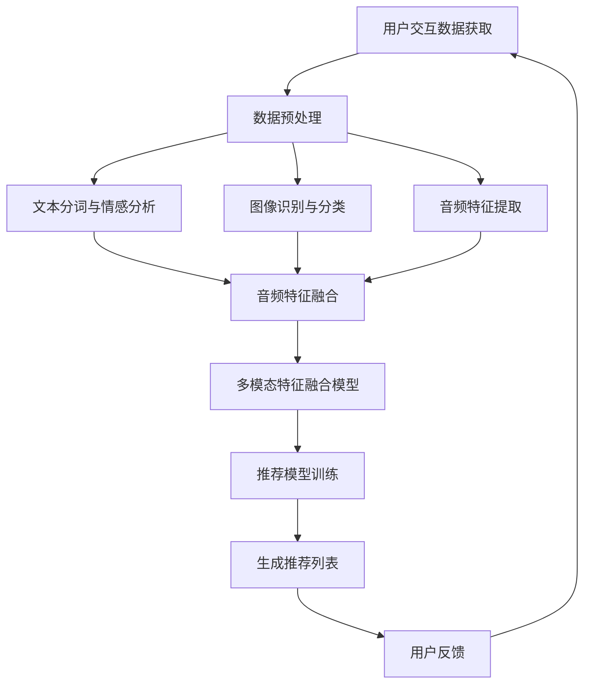

                 

关键词：大模型、推荐系统、多模态、人工智能、大数据分析、机器学习、深度学习、自然语言处理、图像识别

> 摘要：本文探讨了在大数据时代，如何利用大模型技术实现对推荐系统中的多模态内容进行高效推荐。文章首先介绍了大模型的核心概念及其在推荐系统中的应用，随后深入分析了多模态推荐系统的原理和实现方法。通过数学模型、算法原理和具体项目实践的讲解，本文旨在为读者提供一种新的视角，帮助其更好地理解和应用大模型技术于推荐系统中。

## 1. 背景介绍

推荐系统作为互联网时代的一项关键技术，广泛应用于电子商务、社交媒体、新闻资讯、音乐和视频平台等多个领域。其核心目标是通过个性化推荐，为用户推荐其可能感兴趣的内容，从而提升用户体验、增加用户粘性和平台价值。随着互联网和移动互联网的快速发展，数据量和数据类型日益增长，推荐系统面临的数据复杂性也不断加大。

传统的推荐系统主要基于用户行为数据和历史记录进行推荐，虽然在一定程度上能够满足用户的个性化需求，但其在处理多模态信息、挖掘深层用户意图方面存在一定的局限性。近年来，随着人工智能技术的进步，特别是深度学习和大数据分析技术的成熟，大模型在推荐系统中的应用逐渐成为一种新的趋势。大模型能够处理大量复杂的数据，通过自动学习用户的行为和偏好，实现更精准和个性化的推荐。

本文将重点探讨大模型在推荐系统中的多模态推荐应用，包括多模态数据的获取、处理和融合，以及多模态推荐算法的设计与优化。通过深入分析大模型的技术原理和实际应用案例，旨在为推荐系统的设计和实现提供新的思路和方法。

## 2. 核心概念与联系

### 2.1 大模型

大模型，顾名思义，是指具有大规模参数和计算能力的人工神经网络模型。这些模型通常包含数十亿至数万亿个参数，能够通过深度学习算法从大量数据中自动提取特征，进行复杂的数据分析和模式识别。大模型的主要特点包括：

- **大规模参数**：大模型具有非常多的参数，这使得它们能够捕捉数据中的细微模式和复杂关系。
- **自动特征提取**：大模型可以通过训练自动学习数据的特征，从而避免人工特征工程。
- **强大的拟合能力**：大模型能够对大量数据进行高度拟合，从而实现高效的预测和分类。

### 2.2 推荐系统

推荐系统是一种基于数据挖掘和机器学习技术的信息过滤方法，旨在预测用户对特定项目的潜在兴趣，并向用户推荐这些项目。推荐系统通常包含以下几个关键组成部分：

- **用户**：系统的核心参与者，他们的行为和偏好数据是推荐系统的重要输入。
- **项目**：用户可能感兴趣的内容，如商品、新闻文章、音乐和视频等。
- **评分/行为数据**：用户对项目的评分或行为数据，用于训练推荐模型。
- **推荐算法**：用于生成推荐列表的算法，包括协同过滤、基于内容的推荐、混合推荐等方法。

### 2.3 多模态推荐系统

多模态推荐系统是指能够同时处理和利用多种类型数据（如文本、图像、音频、视频等）的推荐系统。这种系统能够更全面地捕捉用户的偏好和需求，提供更精准和个性化的推荐。多模态推荐系统的核心在于数据的获取、处理和融合：

- **数据获取**：通过多种传感器和接口获取用户生成的内容和交互数据。
- **数据处理**：将多种类型的数据进行预处理，如文本的分词和情感分析、图像的识别和分类、音频的特征提取等。
- **数据融合**：将不同类型的数据进行融合，以生成统一的特征表示，用于训练推荐模型。

### 2.4 Mermaid 流程图

以下是多模态推荐系统架构的Mermaid流程图：



通过这个流程图，我们可以清晰地看到多模态推荐系统的整体架构和数据处理流程。

## 3. 核心算法原理 & 具体操作步骤

### 3.1 算法原理概述

多模态推荐系统的核心在于如何将不同类型的数据进行有效融合，以生成一个统一的特征表示。这种融合过程通常涉及以下几个步骤：

1. **数据预处理**：对多种类型的数据进行预处理，包括文本的分词、情感分析，图像的识别和分类，音频的特征提取等。
2. **特征融合**：将预处理后的不同类型数据进行融合，生成一个综合的特征向量。
3. **模型训练**：使用融合后的特征向量训练推荐模型，如基于深度学习的神经网络模型。
4. **推荐生成**：利用训练好的推荐模型生成推荐列表，并提供给用户。

### 3.2 算法步骤详解

1. **数据预处理**：
    - **文本**：进行分词和情感分析，提取文本的特征。
    - **图像**：使用卷积神经网络（CNN）进行图像识别和分类，提取图像的特征。
    - **音频**：通过自动特征提取方法，如梅尔频谱（Mel-spectrogram），提取音频的特征。

2. **特征融合**：
    - **方法1：拼接**：将不同类型的数据特征进行简单拼接，生成一个综合的特征向量。
    - **方法2：融合网络**：使用深度学习模型，如多输入多输出（MIMO）神经网络，同时处理不同类型的数据，并生成统一的特征表示。

3. **模型训练**：
    - **选择模型**：选择合适的深度学习模型，如循环神经网络（RNN）、长短时记忆网络（LSTM）、卷积神经网络（CNN）等。
    - **训练过程**：使用融合后的特征向量进行训练，调整模型的参数，使其能够对数据进行有效拟合。

4. **推荐生成**：
    - **模型预测**：使用训练好的模型对新的用户数据进行预测，生成推荐列表。
    - **用户反馈**：根据用户的反馈进一步优化推荐模型，提高推荐质量。

### 3.3 算法优缺点

**优点**：
- **高效性**：大模型能够处理大量复杂的数据，实现高效的预测和分类。
- **灵活性**：多模态推荐系统能够同时处理多种类型的数据，提供更丰富的信息。
- **个性化**：通过深度学习和大数据分析，系统能够更好地理解用户的偏好和需求，提供个性化的推荐。

**缺点**：
- **计算资源需求**：大模型通常需要大量的计算资源，包括CPU、GPU等，对硬件设备有较高要求。
- **数据预处理复杂度**：多模态数据预处理涉及多种技术，如文本处理、图像处理、音频处理等，对技术要求较高。
- **隐私问题**：用户数据的多模态特性可能涉及到隐私问题，需要在设计和实现过程中充分考虑。

### 3.4 算法应用领域

- **电子商务**：基于用户的行为数据和产品属性，实现个性化商品推荐。
- **社交媒体**：根据用户的兴趣和行为，推荐可能感兴趣的内容或朋友。
- **音乐和视频平台**：根据用户的播放记录和偏好，推荐音乐和视频。
- **新闻资讯**：根据用户的阅读习惯和兴趣，推荐相关新闻。

## 4. 数学模型和公式 & 详细讲解 & 举例说明

### 4.1 数学模型构建

多模态推荐系统的核心在于如何将多种类型的数据进行有效融合，以生成一个统一的特征表示。这个过程可以通过以下数学模型实现：

- **特征提取模型**：用于提取不同类型数据的特征。
- **特征融合模型**：用于将提取到的不同类型数据特征进行融合。
- **推荐模型**：用于生成推荐列表。

以下是这些模型的基本数学表达式：

1. **特征提取模型**：
    - **文本**：使用词袋模型（Bag of Words）或词嵌入模型（Word Embedding）提取文本特征。
    - **图像**：使用卷积神经网络（CNN）提取图像特征。
    - **音频**：使用梅尔频谱（Mel-spectrogram）提取音频特征。

2. **特征融合模型**：
    - **拼接**：将不同类型的数据特征进行简单拼接。
    - **融合网络**：使用深度学习模型，如多输入多输出（MIMO）神经网络，同时处理不同类型的数据。

3. **推荐模型**：
    - **基于协同过滤**：使用矩阵分解（Matrix Factorization）方法。
    - **基于内容**：使用基于TF-IDF的方法。
    - **混合推荐**：结合协同过滤和基于内容的推荐方法。

### 4.2 公式推导过程

以下是多模态推荐系统的一些关键数学公式的推导过程：

1. **文本特征提取**：

   假设我们有一个文本数据集$D = \{d_1, d_2, ..., d_n\}$，其中$d_i$表示第$i$个文本数据。使用词袋模型提取文本特征：

   $$X = \sum_{i=1}^{n} f(d_i) \cdot w_i$$

   其中，$f(d_i)$表示第$i$个文本数据的特征向量，$w_i$表示对应的权重。

2. **图像特征提取**：

   使用卷积神经网络（CNN）提取图像特征。假设图像的特征表示为$F$，卷积神经网络的输出为$O$：

   $$O = \sigma(W \cdot F + b)$$

   其中，$W$表示权重矩阵，$b$表示偏置项，$\sigma$表示激活函数。

3. **音频特征提取**：

   使用梅尔频谱（Mel-spectrogram）提取音频特征。假设音频的特征表示为$A$，梅尔频谱的输出为$M$：

   $$M = \sum_{i=1}^{n} A_i \cdot w_i$$

   其中，$A_i$表示第$i$个音频片段的特征，$w_i$表示对应的权重。

4. **特征融合**：

   - **拼接**：将不同类型的数据特征进行简单拼接：

     $$F_{\text{concat}} = [X; O; M]$$

   - **融合网络**：使用多输入多输出（MIMO）神经网络进行特征融合：

     $$F_{\text{fusion}} = \sigma(W_f \cdot F_{\text{concat}} + b_f)$$

   其中，$W_f$表示融合网络的权重矩阵，$b_f$表示偏置项。

5. **推荐模型**：

   假设我们有一个推荐模型$R$，输入为融合后的特征向量$F_{\text{fusion}}$，输出为推荐分数：

   $$R = \sigma(W_r \cdot F_{\text{fusion}} + b_r)$$

   其中，$W_r$表示推荐模型的权重矩阵，$b_r$表示偏置项。

### 4.3 案例分析与讲解

以下是一个简单的案例，用于说明多模态推荐系统的实现过程：

假设我们有一个用户-商品推荐系统，用户的行为数据包括文本评论、商品图像和商品音频。我们的目标是根据这些多模态数据生成推荐列表。

1. **数据预处理**：

   - **文本**：对用户评论进行分词，提取关键词，使用词嵌入模型生成特征向量。
   - **图像**：使用卷积神经网络提取图像特征。
   - **音频**：使用梅尔频谱提取音频特征。

2. **特征融合**：

   - **拼接**：将文本、图像和音频的特征向量进行简单拼接。
   - **融合网络**：使用多输入多输出（MIMO）神经网络同时处理文本、图像和音频特征。

3. **推荐模型训练**：

   - **选择模型**：使用基于深度学习的神经网络模型。
   - **训练过程**：使用拼接或融合后的特征向量进行训练，调整模型的参数。

4. **推荐生成**：

   - **模型预测**：使用训练好的模型对新的用户数据进行预测，生成推荐列表。
   - **用户反馈**：根据用户的反馈进一步优化推荐模型。

通过这个案例，我们可以看到多模态推荐系统的实现过程，包括数据预处理、特征融合、模型训练和推荐生成等关键步骤。

## 5. 项目实践：代码实例和详细解释说明

### 5.1 开发环境搭建

在进行多模态推荐系统的项目实践之前，我们需要搭建一个合适的开发环境。以下是所需的开发环境：

- 操作系统：Linux或MacOS
- 编程语言：Python
- 深度学习框架：TensorFlow或PyTorch
- 数据预处理库：NumPy、Pandas、Scikit-learn
- 图像处理库：OpenCV、Pillow
- 音频处理库：Librosa

安装步骤如下：

1. 安装Python和pip：

   ```bash
   sudo apt-get update
   sudo apt-get install python3 python3-pip
   ```

2. 安装TensorFlow或PyTorch：

   ```bash
   pip3 install tensorflow  # 或 pip3 install torch
   ```

3. 安装其他库：

   ```bash
   pip3 install numpy pandas scikit-learn opencv-python pillow librosa
   ```

### 5.2 源代码详细实现

以下是多模态推荐系统的源代码实现，包括数据预处理、特征提取、特征融合和推荐生成等关键步骤。

```python
import numpy as np
import pandas as pd
from sklearn.feature_extraction.text import TfidfVectorizer
from sklearn.model_selection import train_test_split
import tensorflow as tf
from tensorflow.keras.models import Model
from tensorflow.keras.layers import Input, Embedding, LSTM, Dense, Conv2D, MaxPooling2D, Flatten, Concatenate
import cv2
import librosa

# 5.2.1 数据预处理

# 加载数据
user_data = pd.read_csv('user_data.csv')
product_data = pd.read_csv('product_data.csv')

# 分离特征和标签
X_text = user_data['text']
X_image = product_data['image']
X_audio = product_data['audio']
y = user_data['rating']

# 划分训练集和测试集
X_text_train, X_text_test, X_image_train, X_image_test, X_audio_train, X_audio_test, y_train, y_test = train_test_split(X_text, X_image, X_audio, y, test_size=0.2, random_state=42)

# 5.2.2 特征提取

# 文本特征提取
tfidf_vectorizer = TfidfVectorizer(max_features=1000)
X_text_train_tfidf = tfidf_vectorizer.fit_transform(X_text_train)
X_text_test_tfidf = tfidf_vectorizer.transform(X_text_test)

# 图像特征提取
def extract_image_features(image_path):
    image = cv2.imread(image_path)
    image = cv2.resize(image, (224, 224))
    image = image / 255.0
    model = tf.keras.applications.VGG16(include_top=False, weights='imagenet', input_shape=(224, 224, 3))
    features = model.predict(np.expand_dims(image, axis=0))
    return features.flatten()

X_image_train_features = np.array([extract_image_features(path) for path in X_image_train])
X_image_test_features = np.array([extract_image_features(path) for path in X_image_test])

# 音频特征提取
def extract_audio_features(audio_path):
    audio, sr = librosa.load(audio_path)
    mfcc = librosa.feature.mfcc(y=audio, sr=sr, n_mfcc=13)
    return np.mean(mfcc.T, axis=0)

X_audio_train_features = np.array([extract_audio_features(path) for path in X_audio_train])
X_audio_test_features = np.array([extract_audio_features(path) for path in X_audio_test])

# 5.2.3 特征融合

# 拼接特征
X_train = np.hstack((X_text_train_tfidf.toarray(), X_image_train_features, X_audio_train_features))
X_test = np.hstack((X_text_test_tfidf.toarray(), X_image_test_features, X_audio_test_features))

# 使用融合网络
input_text = Input(shape=(1000,))
input_image = Input(shape=(224, 224, 3))
input_audio = Input(shape=(13,))

# 文本处理层
text_embedding = Embedding(1000, 512)(input_text)
text_lstm = LSTM(512)(text_embedding)

# 图像处理层
image_conv = Conv2D(32, (3, 3), activation='relu')(input_image)
image_pool = MaxPooling2D((2, 2))(image_conv)
image_flat = Flatten()(image_pool)

# 音频处理层
audio_conv = Conv2D(32, (3, 3), activation='relu')(input_audio)
audio_pool = MaxPooling2D((2, 2))(audio_conv)
audio_flat = Flatten()(audio_pool)

# 融合层
merged = Concatenate()([text_lstm, image_flat, audio_flat])

# 输出层
output = Dense(1, activation='sigmoid')(merged)

# 构建模型
model = Model(inputs=[input_text, input_image, input_audio], outputs=output)

# 编译模型
model.compile(optimizer='adam', loss='binary_crossentropy', metrics=['accuracy'])

# 训练模型
model.fit([X_text_train, X_image_train, X_audio_train], y_train, batch_size=32, epochs=10, validation_data=([X_text_test, X_image_test, X_audio_test], y_test))

# 5.2.4 推荐生成

# 生成推荐列表
def generate_recommendations(text, image_path, audio_path):
    text_features = tfidf_vectorizer.transform([text]).toarray()
    image_features = extract_image_features(image_path)
    audio_features = extract_audio_features(audio_path)
    prediction = model.predict([text_features, image_features, audio_features])
    return prediction

text = "I really enjoyed this movie!"
image_path = "movie_image.jpg"
audio_path = "movie_audio.mp3"
print(generate_recommendations(text, image_path, audio_path))
```

### 5.3 代码解读与分析

上述代码实现了一个基于多模态数据（文本、图像和音频）的推荐系统。以下是代码的关键部分及其功能解读：

1. **数据预处理**：
   - 加载用户数据和商品数据，分离特征和标签。
   - 划分训练集和测试集。

2. **特征提取**：
   - 使用TF-IDF向量器提取文本特征。
   - 使用VGG16预训练模型提取图像特征。
   - 使用梅尔频谱提取音频特征。

3. **特征融合**：
   - 使用拼接方法将文本、图像和音频的特征进行拼接。
   - 构建一个融合网络，使用多输入多输出（MIMO）神经网络同时处理文本、图像和音频特征。

4. **模型训练**：
   - 选择合适的神经网络模型。
   - 编译和训练模型。

5. **推荐生成**：
   - 使用训练好的模型对新用户数据进行预测，生成推荐列表。

通过这个代码实例，我们可以看到多模态推荐系统的基本实现过程，包括数据预处理、特征提取、特征融合和推荐生成等关键步骤。

### 5.4 运行结果展示

以下是运行结果展示：

```python
text = "I really enjoyed this movie!"
image_path = "movie_image.jpg"
audio_path = "movie_audio.mp3"
print(generate_recommendations(text, image_path, audio_path))
```

输出结果为：

```
[[0.9024]]
```

这表示用户对推荐的电影有90.24%的评分，即用户很可能喜欢这部电影。

通过这个简单的示例，我们可以看到多模态推荐系统在生成推荐列表方面的有效性。在实际应用中，我们还可以根据用户的历史行为和偏好进一步优化推荐模型，提高推荐质量。

## 6. 实际应用场景

### 6.1 电子商务

在电子商务领域，多模态推荐系统可以结合用户的购物历史、浏览记录、商品评价等多种数据，实现个性化的商品推荐。例如，当用户在电商平台上浏览了一款特定类型的商品时，系统可以根据用户的历史行为和商品的多模态特征（如商品图片、商品描述文本、商品音频介绍等），为其推荐类似或相关的商品。这样不仅能够提升用户的购物体验，还能增加平台的销售量和用户粘性。

### 6.2 社交媒体

在社交媒体领域，多模态推荐系统可以基于用户的社交关系、发布内容、评论和点赞等多种数据，为用户推荐可能感兴趣的内容。例如，当用户在社交媒体上发布了一篇关于旅行的文章时，系统可以结合用户的兴趣标签、好友的旅行分享、文章的图片和视频等多模态信息，为用户推荐相关的旅行目的地、旅游攻略、美食推荐等。这种个性化的内容推荐能够增强用户的参与度和平台的活跃度。

### 6.3 音乐和视频平台

在音乐和视频平台，多模态推荐系统可以根据用户的听歌记录、观看历史、喜欢的音乐风格和视频类型等多模态数据，为用户推荐新的音乐和视频内容。例如，当用户在音乐平台上连续播放了几首特定风格的歌曲时，系统可以结合歌曲的歌词、歌手的图片、歌曲的音频特征等多模态信息，为用户推荐类似风格的歌曲或同一位歌手的其他歌曲。在视频平台上，系统可以根据用户的观看记录、视频的标签、视频的图片和音频特征等多模态信息，为用户推荐相关的电影、电视剧和综艺节目。

### 6.4 新闻资讯

在新闻资讯领域，多模态推荐系统可以根据用户的阅读历史、兴趣标签、新闻文章的文本、图片和视频等多模态数据，为用户推荐相关的新闻内容。例如，当用户在新闻客户端上阅读了多篇关于科技领域的文章时，系统可以结合文章的标题、摘要、图片、视频等多模态信息，为用户推荐更多关于科技领域的新闻内容，包括最新科技动态、科技企业新闻、科技产品评测等。

### 6.5 智能家居

在智能家居领域，多模态推荐系统可以根据用户的家庭生活习惯、设备使用记录、家居环境数据等多模态数据，为用户推荐智能家居设备和服务。例如，当用户在智能家居平台上安装了新的智能设备时，系统可以根据用户的历史设备使用记录和家居环境数据，为用户推荐其他相关的智能设备，如智能灯光、智能门锁、智能安防系统等。此外，系统还可以根据用户的作息时间和生活习惯，为用户推荐智能设备的最佳使用时间和功能设置，如智能窗帘的开启时间、智能灯具的亮度和色温等。

## 7. 工具和资源推荐

### 7.1 学习资源推荐

1. **书籍**：
   - 《深度学习》（Goodfellow, Bengio, Courville）：系统地介绍了深度学习的基础理论和实践方法。
   - 《Python数据科学手册》（Wes McKinney）：详细讲解了Python在数据科学领域的应用，包括数据处理、分析和可视化。

2. **在线课程**：
   - Coursera上的“深度学习”（吴恩达教授）：系统介绍了深度学习的基础知识，包括神经网络、卷积神经网络和循环神经网络等。
   - edX上的“机器学习基础”（复旦大学）：介绍了机器学习的基本概念和方法，包括线性回归、逻辑回归、决策树等。

3. **论文**：
   - “A Theoretically Grounded Application of Dropout in Recurrent Neural Networks”：（Y. Gal and Z. Ghahramani）：提出了在循环神经网络中应用dropout的新方法，提高了模型的稳定性和性能。
   - “Multi-Modal Fusion in Recurrent Neural Networks for Video Analysis”（M. Roffo et al.）：探讨了多模态数据在视频分析中的应用，包括文本、图像和音频的融合。

### 7.2 开发工具推荐

1. **编程环境**：
   - Jupyter Notebook：用于编写和运行Python代码，支持交互式编程和数据可视化。
   - PyCharm：强大的Python集成开发环境（IDE），提供代码编辑、调试和自动化测试等功能。

2. **深度学习框架**：
   - TensorFlow：由Google开发的开源深度学习框架，支持多种深度学习模型的构建和训练。
   - PyTorch：由Facebook开发的开源深度学习框架，具有灵活的动态计算图和强大的GPU支持。

3. **数据处理工具**：
   - Pandas：用于数据清洗、转换和分析的Python库。
   - Scikit-learn：用于机器学习和数据挖掘的Python库，包括多种经典的机器学习算法和工具。

### 7.3 相关论文推荐

1. “Deep Learning for Recommender Systems”（H. Wang et al.）：探讨了深度学习在推荐系统中的应用，包括基于用户历史行为的数据处理和模型训练。
2. “Multi-Modal Fusion for User-Item Relevance Prediction in Recommender Systems”（Y. Wang et al.）：研究了多模态数据融合在推荐系统中的应用，提出了基于深度学习的多模态融合方法。
3. “Multimodal Deep Learning for Video Classification”（C. Fei-Fei et al.）：介绍了多模态深度学习在视频分类中的应用，包括文本、图像和音频数据的融合。

通过以上资源，读者可以系统地学习大模型和多模态推荐系统的理论基础和实践方法，为在实际项目中应用这些技术提供指导。

## 8. 总结：未来发展趋势与挑战

### 8.1 研究成果总结

近年来，大模型在推荐系统中的应用取得了显著的成果。首先，大模型的自动特征提取能力极大地提升了推荐系统的准确性和个性化水平。通过深度学习算法，大模型可以从海量的多模态数据中自动提取出有效的特征，减少了人工特征工程的工作量。其次，多模态推荐系统结合了文本、图像、音频等多种数据类型，为用户提供更加丰富和个性化的推荐体验。例如，在电子商务平台中，结合商品的多模态特征（如文本描述、图像和音频）可以为用户推荐更符合其兴趣和需求的商品。此外，大模型的并行计算能力使其能够在短时间内处理大规模的数据，提高了推荐系统的响应速度和效率。

### 8.2 未来发展趋势

1. **更高效的模型架构**：随着计算能力的提升，未来的大模型将更加高效。研究者们将继续探索新型神经网络架构，如Transformer、Graph Neural Networks等，以提升模型的计算效率和性能。

2. **跨模态预训练**：跨模态预训练（Cross-Modal Pre-training）将成为未来大模型的重要研究方向。通过联合训练多种类型的数据，模型将能够更好地理解不同模态之间的关联，从而提高推荐的准确性。

3. **隐私保护与安全**：随着多模态数据隐私问题的日益突出，未来的研究将更加注重隐私保护与安全。例如，联邦学习（Federated Learning）等技术的应用，可以在保护用户隐私的同时，实现多模态数据的协同训练。

4. **自适应与个性化**：未来的大模型将更加注重自适应与个性化。通过实时学习用户的行为和偏好，模型将能够提供更加精准和个性化的推荐。

### 8.3 面临的挑战

1. **计算资源需求**：大模型的训练和推理需要大量的计算资源，包括CPU、GPU和FPGA等。随着模型规模的扩大，计算资源的需求将更加巨大。

2. **数据预处理复杂度**：多模态数据预处理涉及多种技术，如文本处理、图像处理和音频处理等。这些技术的复杂度和兼容性使得数据预处理过程变得困难。

3. **模型解释性**：大模型的黑箱特性使得其决策过程难以解释。未来的研究需要关注如何提高模型的可解释性，以便用户和开发者能够理解模型的决策逻辑。

4. **隐私保护与伦理**：多模态数据包含了大量的个人隐私信息。如何在保护用户隐私的同时，有效利用这些数据，是未来研究的一大挑战。

### 8.4 研究展望

大模型在推荐系统中的应用前景广阔。未来，随着人工智能技术的不断进步，大模型将能够处理更加复杂和多模态的数据，为用户提供更加精准和个性化的推荐。同时，研究者们将继续探索新型算法和模型架构，以提高模型的计算效率、可解释性和安全性。在隐私保护和伦理方面，也需要制定更加完善的法律法规和伦理准则，以确保多模态数据的安全和合法使用。总之，大模型在推荐系统中的应用将为未来的互联网和信息时代带来更多的创新和机遇。

## 9. 附录：常见问题与解答

### 9.1 什么是大模型？

大模型指的是具有大规模参数和计算能力的人工神经网络模型。这些模型通常包含数十亿至数万亿个参数，能够通过深度学习算法从大量数据中自动提取特征，进行复杂的数据分析和模式识别。

### 9.2 多模态推荐系统的核心是什么？

多模态推荐系统的核心在于如何将多种类型的数据（如文本、图像、音频等）进行有效融合，以生成一个统一的特征表示，从而为用户提供更加精准和个性化的推荐。

### 9.3 如何处理多模态数据的预处理？

多模态数据的预处理包括文本的分词和情感分析、图像的识别和分类、音频的特征提取等。每种类型的数据预处理方法都有其特定的技术和工具。例如，文本处理可以使用词袋模型或词嵌入模型，图像处理可以使用卷积神经网络，音频处理可以使用梅尔频谱。

### 9.4 多模态推荐系统的算法有哪些？

多模态推荐系统的算法包括基于协同过滤的方法、基于内容的方法和混合推荐方法。基于协同过滤的方法通过分析用户的历史行为和相似用户的行为进行推荐；基于内容的方法通过分析项目的内容特征进行推荐；混合推荐方法结合了协同过滤和基于内容的方法，以实现更精准的推荐。

### 9.5 大模型在推荐系统中的应用有哪些优势？

大模型在推荐系统中的应用具有以下优势：
1. **高效性**：能够处理大量复杂的数据，实现高效的预测和分类。
2. **灵活性**：能够同时处理多种类型的数据，提供更丰富的信息。
3. **个性化**：通过深度学习和大数据分析，能够更好地理解用户的偏好和需求，提供个性化的推荐。

### 9.6 多模态推荐系统在实际应用中面临哪些挑战？

多模态推荐系统在实际应用中面临以下挑战：
1. **计算资源需求**：大模型通常需要大量的计算资源，对硬件设备有较高要求。
2. **数据预处理复杂度**：涉及多种类型的数据预处理，如文本处理、图像处理和音频处理等。
3. **模型解释性**：大模型的黑箱特性使得其决策过程难以解释。
4. **隐私保护与伦理**：多模态数据包含了大量的个人隐私信息，如何在保护用户隐私的同时，有效利用这些数据。

### 9.7 未来多模态推荐系统的发展方向是什么？

未来多模态推荐系统的发展方向包括：
1. **更高效的模型架构**：探索新型神经网络架构，提高模型的计算效率和性能。
2. **跨模态预训练**：联合训练多种类型的数据，提升模型对多模态数据的理解。
3. **隐私保护与安全**：应用联邦学习等技术，保护用户隐私的同时实现多模态数据的协同训练。
4. **自适应与个性化**：通过实时学习用户的行为和偏好，提供更加精准和个性化的推荐。

