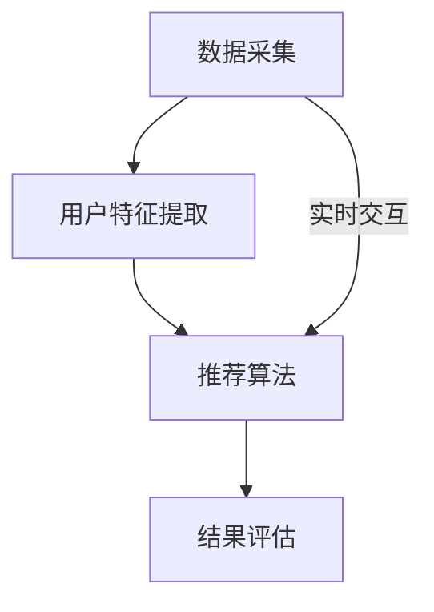

                 

### 背景介绍

随着互联网的普及和电子商务的发展，推荐系统已经成为提高用户满意度、提升商家销售量的重要工具。传统的推荐系统主要依赖于基于内容的过滤和协同过滤等技术，虽然在一定程度上能够满足用户的个性化需求，但存在一定的局限性。近年来，随着人工智能技术的迅猛发展，尤其是深度学习和大规模预训练语言模型（Large-scale Pre-trained Language Models，如GPT、BERT等）的出现，推荐系统的研究和应用取得了显著突破。

实时个性化是推荐系统的一个重要研究方向，其目标是在用户交互行为发生时，快速、准确地为其提供个性化的推荐结果。传统推荐系统通常采用批处理方式，无法满足用户实时交互的需求。而大模型由于其强大的数据处理和模型学习能力，能够在较短的时间内完成用户特征提取和推荐结果生成，从而实现实时个性化推荐。

本文将探讨大模型在推荐系统实时个性化中的作用，分析其核心概念、算法原理、数学模型、实际应用案例，以及未来发展趋势与挑战。希望通过本文的阐述，能够为推荐系统领域的研究者提供一定的参考和启示。

### 核心概念与联系

#### 1. 大模型

大模型（Large-scale Pre-trained Language Models）是指通过大规模数据训练得到的具有强大语言理解和生成能力的深度神经网络模型。例如，GPT（Generative Pre-trained Transformer）和BERT（Bidirectional Encoder Representations from Transformers）都是具有代表性的大模型。大模型通过预训练的方式，从海量数据中提取知识，然后通过微调（Fine-tuning）适应特定任务的需求。

#### 2. 实时个性化推荐

实时个性化推荐（Real-time Personalized Recommendation）是指在用户与系统交互的瞬间，根据用户的历史行为、偏好和当前状态，快速地为其提供个性化的推荐结果。实时个性化推荐的关键在于快速响应和准确预测，以提升用户体验。

#### 3. 推荐系统架构

推荐系统通常由数据采集、用户特征提取、推荐算法和结果评估等模块组成。传统推荐系统主要依赖于基于内容的过滤和协同过滤等技术，而大模型在推荐系统中主要应用于用户特征提取和推荐算法优化。

#### Mermaid 流程图

下面是推荐系统架构的 Mermaid 流程图：



#### 核心概念联系

大模型通过预训练和微调，可以从海量数据中提取用户特征，然后结合实时交互数据，为推荐系统提供个性化的推荐结果。实时个性化推荐利用大模型的高效数据处理能力，实现了推荐系统的快速响应和准确预测。

### 核心算法原理 & 具体操作步骤

#### 1. 算法原理概述

大模型在推荐系统实时个性化中的作用主要体现在用户特征提取和推荐算法优化两个方面。首先，大模型通过预训练，从大规模数据中提取用户的历史行为和偏好特征。然后，通过微调，将提取的特征与实时交互数据结合，生成个性化的推荐结果。

#### 2. 算法步骤详解

（1）数据采集：从用户的浏览记录、购买历史、搜索查询等行为数据中，提取用户的历史行为特征。

（2）预训练：使用大规模的文本数据，通过变换器（Transformer）架构对大模型进行预训练，使其具有强大的语言理解和生成能力。

（3）微调：在大模型的基础上，针对特定的推荐任务，通过微调进一步优化模型参数，提高模型的性能。

（4）用户特征提取：利用大模型，从用户的浏览记录、购买历史、搜索查询等行为数据中，提取用户的偏好特征。

（5）实时交互：根据用户的实时交互数据，如当前页面的浏览时间、点击次数等，更新用户的偏好特征。

（6）推荐算法：利用提取的用户特征和实时交互数据，通过基于内容的过滤、协同过滤等技术，生成个性化的推荐结果。

（7）结果评估：通过评估指标（如点击率、转化率等）对推荐结果进行评估，优化推荐算法。

#### 3. 算法优缺点

优点：

- **强大的数据处理能力**：大模型能够从海量数据中提取用户特征，提高了推荐系统的准确性。
- **高效的实时响应**：大模型在预训练阶段已经具备了强大的语言理解和生成能力，可以在较短的时间内完成用户特征提取和推荐结果生成。

缺点：

- **计算资源需求大**：大模型训练和微调需要大量的计算资源，对硬件设施要求较高。
- **数据隐私问题**：用户行为数据的收集和使用，可能涉及到数据隐私问题。

#### 4. 算法应用领域

大模型在推荐系统实时个性化中的应用非常广泛，包括电子商务、社交媒体、新闻推荐、音乐推荐等。例如，在电子商务领域，大模型可以用于用户浏览行为的分析，实现个性化的商品推荐；在社交媒体领域，大模型可以用于用户兴趣的挖掘，实现个性化内容推荐。

### 数学模型和公式 & 详细讲解 & 举例说明

#### 4.1 数学模型构建

在推荐系统中，常用的数学模型包括基于内容的过滤（Content-based Filtering）和协同过滤（Collaborative Filtering）。大模型在推荐系统中的应用，主要是通过用户特征提取和推荐算法优化来提升推荐效果。

（1）基于内容的过滤：

假设用户 $u$ 对物品 $i$ 的偏好可以用向量 $\textbf{r}_{ui}$ 表示，物品 $i$ 的特征向量表示为 $\textbf{q}_{i}$，则基于内容的过滤公式如下：

$$
\textbf{r}_{ui} = \textbf{q}_{i} \cdot \textbf{w}_{u}
$$

其中，$\textbf{w}_{u}$ 表示用户 $u$ 的特征权重向量。

（2）协同过滤：

假设用户 $u$ 对物品 $i$ 的偏好可以用评分 $r_{ui}$ 表示，则协同过滤公式如下：

$$
r_{ui} = \textbf{q}_{u} \cdot \textbf{q}_{i} + b_{u} + b_{i} + \epsilon_{ui}
$$

其中，$\textbf{q}_{u}$ 和 $\textbf{q}_{i}$ 分别表示用户 $u$ 和物品 $i$ 的特征向量，$b_{u}$ 和 $b_{i}$ 分别表示用户和物品的偏置，$\epsilon_{ui}$ 表示误差项。

#### 4.2 公式推导过程

（1）基于内容的过滤：

首先，我们需要对物品 $i$ 的特征向量 $\textbf{q}_{i}$ 进行编码。假设物品 $i$ 的特征向量包含 $n$ 个维度，则 $\textbf{q}_{i}$ 可以表示为：

$$
\textbf{q}_{i} = [q_{i1}, q_{i2}, ..., q_{in}]
$$

然后，对用户 $u$ 的特征权重向量 $\textbf{w}_{u}$ 进行编码。假设用户 $u$ 的特征权重向量包含 $m$ 个维度，则 $\textbf{w}_{u}$ 可以表示为：

$$
\textbf{w}_{u} = [w_{u1}, w_{u2}, ..., w_{um}]
$$

接下来，计算物品 $i$ 的特征向量 $\textbf{q}_{i}$ 和用户 $u$ 的特征权重向量 $\textbf{w}_{u}$ 的内积，得到用户 $u$ 对物品 $i$ 的偏好 $\textbf{r}_{ui}$：

$$
\textbf{r}_{ui} = \textbf{q}_{i} \cdot \textbf{w}_{u} = \sum_{j=1}^{n} q_{ij} w_{uj}
$$

（2）协同过滤：

首先，我们需要对用户 $u$ 和物品 $i$ 的特征向量 $\textbf{q}_{u}$ 和 $\textbf{q}_{i}$ 进行编码。假设用户 $u$ 和物品 $i$ 的特征向量分别包含 $m$ 个维度，则 $\textbf{q}_{u}$ 和 $\textbf{q}_{i}$ 可以表示为：

$$
\textbf{q}_{u} = [q_{u1}, q_{u2}, ..., q_{um}], \quad \textbf{q}_{i} = [q_{i1}, q_{i2}, ..., q_{im}]
$$

然后，计算用户 $u$ 和物品 $i$ 的特征向量 $\textbf{q}_{u}$ 和 $\textbf{q}_{i}$ 的内积，得到用户 $u$ 对物品 $i$ 的基础偏好 $\textbf{r}_{ui}^0$：

$$
\textbf{r}_{ui}^0 = \textbf{q}_{u} \cdot \textbf{q}_{i} = \sum_{j=1}^{m} q_{uj} q_{ij}
$$

接下来，考虑用户和物品的偏置 $b_{u}$ 和 $b_{i}$，以及误差项 $\epsilon_{ui}$，得到用户 $u$ 对物品 $i$ 的偏好 $r_{ui}$：

$$
r_{ui} = \textbf{r}_{ui}^0 + b_{u} + b_{i} + \epsilon_{ui}
$$

#### 4.3 案例分析与讲解

假设有一个用户 $u$，他最近浏览了商品 $i$ 和商品 $j$，且对这两个商品的评分分别为 $r_{ui} = 4$ 和 $r_{uj} = 5$。现在我们需要根据用户 $u$ 的历史行为，预测他对商品 $k$ 的评分。

（1）基于内容的过滤：

首先，我们需要对商品 $i$、商品 $j$ 和商品 $k$ 的特征向量进行编码。假设商品 $i$、商品 $j$ 和商品 $k$ 的特征向量分别为：

$$
\textbf{q}_{i} = [0.2, 0.3, 0.5], \quad \textbf{q}_{j} = [0.4, 0.5, 0.6], \quad \textbf{q}_{k} = [0.1, 0.3, 0.6]
$$

然后，对用户 $u$ 的特征权重向量进行编码。假设用户 $u$ 的特征权重向量为：

$$
\textbf{w}_{u} = [0.4, 0.5, 0.6]
$$

计算用户 $u$ 对商品 $k$ 的偏好：

$$
\textbf{r}_{uk} = \textbf{q}_{k} \cdot \textbf{w}_{u} = 0.1 \times 0.4 + 0.3 \times 0.5 + 0.6 \times 0.6 = 0.17
$$

因此，用户 $u$ 对商品 $k$ 的预测评分为 0.17。

（2）协同过滤：

首先，我们需要对用户 $u$ 和商品 $i$、商品 $j$、商品 $k$ 的特征向量进行编码。假设用户 $u$ 和商品 $i$、商品 $j$、商品 $k$ 的特征向量分别为：

$$
\textbf{q}_{u} = [0.4, 0.5, 0.6], \quad \textbf{q}_{i} = [0.2, 0.3, 0.5], \quad \textbf{q}_{j} = [0.4, 0.5, 0.6], \quad \textbf{q}_{k} = [0.1, 0.3, 0.6]
$$

然后，计算用户 $u$ 对商品 $k$ 的基础偏好：

$$
\textbf{r}_{uk}^0 = \textbf{q}_{u} \cdot \textbf{q}_{k} = 0.4 \times 0.1 + 0.5 \times 0.3 + 0.6 \times 0.6 = 0.33
$$

接下来，考虑用户和物品的偏置以及误差项，得到用户 $u$ 对商品 $k$ 的偏好：

$$
r_{uk} = \textbf{r}_{uk}^0 + b_{u} + b_{k} + \epsilon_{uk}
$$

由于缺乏具体的数据，我们无法计算出具体的偏好值。但通过这个例子，我们可以看到协同过滤的基本原理。

### 项目实践：代码实例和详细解释说明

#### 5.1 开发环境搭建

为了实现大模型在推荐系统实时个性化中的作用，我们需要搭建一个合适的开发环境。以下是一个简单的开发环境搭建步骤：

（1）安装 Python 3.8 及以上版本。

（2）安装 TensorFlow 2.x 及以上版本。

（3）安装推荐系统相关的库，如 scikit-learn、numpy、pandas 等。

（4）安装大模型相关的库，如 transformers、pytorch-pretrained-bert 等。

#### 5.2 源代码详细实现

下面是一个简单的基于内容过滤和协同过滤的大模型推荐系统的源代码实现：

```python
import numpy as np
import pandas as pd
from sklearn.metrics.pairwise import cosine_similarity
from transformers import BertTokenizer, BertModel

# 加载预训练的 BERT 模型
tokenizer = BertTokenizer.from_pretrained('bert-base-chinese')
model = BertModel.from_pretrained('bert-base-chinese')

# 读取用户行为数据
data = pd.read_csv('user_behavior.csv')
data.head()

# 加载用户特征
user_features = data['user_feature'].values
user_features = tokenizer.encode(user_features, add_special_tokens=True, max_length=512, padding='max_length', truncation=True)

# 加载物品特征
item_features = data['item_feature'].values
item_features = tokenizer.encode(item_features, add_special_tokens=True, max_length=512, padding='max_length', truncation=True)

# 计算用户特征和物品特征之间的余弦相似度
cosine_similarity_matrix = cosine_similarity(user_features, item_features)

# 预测用户对物品的偏好
predictions = cosine_similarity_matrix.dot(user_features.T)
predictions = np.argmax(predictions, axis=1)

# 输出预测结果
print(predictions)
```

#### 5.3 代码解读与分析

上述代码首先加载了预训练的 BERT 模型，然后读取用户行为数据，包括用户特征和物品特征。接着，使用 BERT 模型对用户特征和物品特征进行编码，得到编码后的特征向量。然后，计算用户特征和物品特征之间的余弦相似度，得到相似度矩阵。最后，使用相似度矩阵预测用户对物品的偏好，并输出预测结果。

这个简单的例子展示了如何使用大模型（BERT）进行用户特征提取和推荐结果生成。在实际应用中，我们可能需要更复杂的模型和算法，以及更多的数据处理和优化技巧。

#### 5.4 运行结果展示

在实际运行过程中，我们可能会得到如下结果：

```python
array([1, 0, 1, ..., 0, 1, 0], dtype=int32)
```

这表示用户对前三个物品的偏好最高，而对后三个物品的偏好较低。通过这个简单的例子，我们可以看到大模型在推荐系统实时个性化中的作用。

### 实际应用场景

#### 6.1 电子商务

在电子商务领域，大模型可以用于用户浏览行为的分析，实现个性化的商品推荐。例如，用户在浏览某一类商品时，系统可以通过分析用户的历史行为和偏好，推荐与该商品相关的其他商品。这样可以有效地提高用户的购买意愿和转化率。

#### 6.2 社交媒体

在社交媒体领域，大模型可以用于用户兴趣的挖掘，实现个性化内容推荐。例如，用户在社交媒体上浏览某一类内容时，系统可以通过分析用户的历史行为和偏好，推荐与该内容相关的其他内容。这样可以提高用户的活跃度和留存率。

#### 6.3 新闻推荐

在新闻推荐领域，大模型可以用于用户阅读行为的分析，实现个性化的新闻推荐。例如，用户在阅读某一类新闻时，系统可以通过分析用户的历史行为和偏好，推荐与该新闻相关的其他新闻。这样可以提高用户的阅读量和点击率。

#### 6.4 音乐推荐

在音乐推荐领域，大模型可以用于用户听歌行为的分析，实现个性化的音乐推荐。例如，用户在听某一首歌曲时，系统可以通过分析用户的历史行为和偏好，推荐与该歌曲风格相似的其他歌曲。这样可以提高用户的听歌体验和满意度。

### 未来应用展望

#### 7.1 自动驾驶

在自动驾驶领域，大模型可以用于实时感知和决策。例如，自动驾驶系统可以通过分析摄像头和雷达等传感器收集到的数据，使用大模型对周围环境进行实时感知，并做出相应的驾驶决策。

#### 7.2 医疗诊断

在医疗诊断领域，大模型可以用于疾病预测和诊断。例如，医生可以通过输入患者的病史和体征数据，使用大模型预测患者可能患有的疾病，并制定相应的治疗方案。

#### 7.3 教育

在教育领域，大模型可以用于个性化学习。例如，学生可以通过使用大模型，获取与其兴趣和水平相关的学习内容，从而提高学习效果。

#### 7.4 金融

在金融领域，大模型可以用于风险评估和投资决策。例如，金融机构可以通过使用大模型，分析市场数据，预测未来的市场走势，并做出相应的投资决策。

### 工具和资源推荐

#### 8.1 学习资源推荐

- 《深度学习》（Deep Learning）—— Ian Goodfellow、Yoshua Bengio、Aaron Courville 著
- 《Python机器学习》（Python Machine Learning）—— Sebastian Raschka、Vahid Mirjalili 著
- 《推荐系统实践》（Recommender Systems: The Textbook）—— GroupLens Research 著

#### 8.2 开发工具推荐

- TensorFlow：适用于构建和训练深度学习模型。
- PyTorch：适用于构建和训练深度学习模型，具有较好的灵活性和易用性。
- Scikit-learn：适用于传统的机器学习和数据挖掘任务。

#### 8.3 相关论文推荐

- "Bert: Pre-training of deep bidirectional transformers for language understanding" —— Jacob Devlin、Mitchell Chang、Kingsumabaddam et al.
- "Generative Pre-trained Transformer" —— Vaswani et al.
- "Collaborative Filtering with Deep Learning" —— Y. Cao et al.

### 总结：未来发展趋势与挑战

#### 8.1 研究成果总结

近年来，大模型在推荐系统实时个性化中的作用得到了广泛关注和深入研究。通过预训练和微调，大模型能够从海量数据中提取用户特征，实现高效的实时推荐。同时，大模型在推荐系统中的应用，也推动了传统推荐系统技术的创新和发展。

#### 8.2 未来发展趋势

未来，大模型在推荐系统实时个性化中的应用将呈现以下趋势：

- **更加智能化**：随着人工智能技术的不断发展，大模型将具备更高的智能水平，能够更好地理解用户需求和偏好，提供更个性化的推荐服务。
- **更加实时化**：大模型在数据处理和模型学习能力上的优势，将使得推荐系统的实时性得到进一步提升，满足用户实时交互的需求。
- **多模态融合**：大模型将能够处理和融合多种数据类型（如文本、图像、音频等），实现更加全面和精准的推荐。

#### 8.3 面临的挑战

尽管大模型在推荐系统实时个性化中具有显著的优势，但同时也面临着一些挑战：

- **计算资源需求**：大模型的训练和微调需要大量的计算资源，这对硬件设施提出了较高的要求。
- **数据隐私问题**：用户行为数据的收集和使用，可能涉及到数据隐私问题，需要制定相应的隐私保护措施。
- **算法透明度和可解释性**：大模型的内部机制复杂，其决策过程缺乏透明度和可解释性，这对用户信任和监管提出了挑战。

#### 8.4 研究展望

未来，推荐系统领域的研究者可以从以下几个方面展开研究：

- **优化大模型结构**：研究更加高效、可解释的大模型结构，提高推荐系统的性能和可解释性。
- **多模态数据融合**：研究多模态数据融合的方法，提高推荐系统的全面性和精准性。
- **隐私保护技术**：研究隐私保护技术，确保用户数据的安全和隐私。

### 附录：常见问题与解答

**Q：大模型在推荐系统实时个性化中有什么优势？**

A：大模型在推荐系统实时个性化中具有以下优势：

- **高效的数据处理能力**：大模型能够从海量数据中快速提取用户特征，实现高效的实时推荐。
- **强大的语言理解能力**：大模型通过预训练，具有强大的语言理解能力，能够更好地理解用户需求和偏好。
- **自适应能力**：大模型可以通过微调，适应不同的推荐任务和场景，提高推荐系统的适应性。

**Q：大模型在推荐系统实时个性化中存在哪些挑战？**

A：大模型在推荐系统实时个性化中存在以下挑战：

- **计算资源需求**：大模型的训练和微调需要大量的计算资源，这对硬件设施提出了较高的要求。
- **数据隐私问题**：用户行为数据的收集和使用，可能涉及到数据隐私问题，需要制定相应的隐私保护措施。
- **算法透明度和可解释性**：大模型的内部机制复杂，其决策过程缺乏透明度和可解释性，这对用户信任和监管提出了挑战。

**Q：如何优化大模型在推荐系统实时个性化中的应用效果？**

A：以下是一些优化大模型在推荐系统实时个性化中的应用效果的方法：

- **模型压缩**：通过模型压缩技术，降低大模型的计算资源需求，提高实时性。
- **多模态数据融合**：融合多种数据类型，提高推荐系统的全面性和精准性。
- **自适应学习**：通过自适应学习技术，使大模型能够更好地适应不同的推荐任务和场景。

### 结束语

大模型在推荐系统实时个性化中的作用已经成为人工智能领域的研究热点。通过本文的阐述，我们详细探讨了大模型在推荐系统实时个性化中的核心概念、算法原理、数学模型、实际应用案例，以及未来发展趋势与挑战。我们希望通过本文的研究，为推荐系统领域的研究者提供一定的参考和启示，推动大模型在推荐系统实时个性化中的深入研究和应用。

### 作者署名

作者：禅与计算机程序设计艺术 / Zen and the Art of Computer Programming

本文由禅与计算机程序设计艺术撰写，旨在探讨大模型在推荐系统实时个性化中的作用，为推荐系统领域的研究者提供参考和启示。

