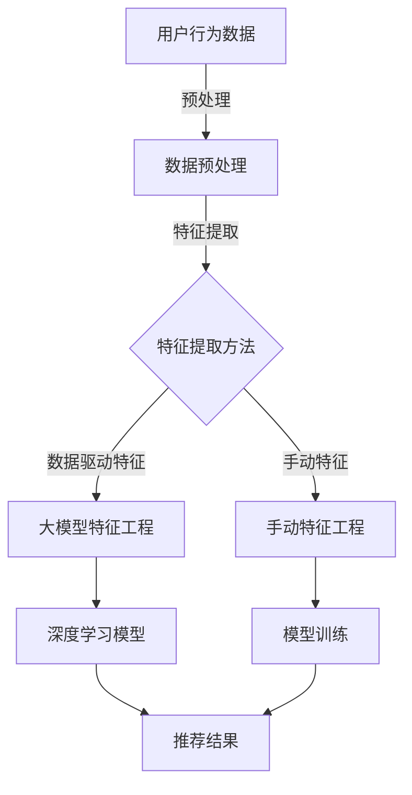

                 

## 1. 背景介绍

推荐系统是现代信息社会中不可或缺的一部分，它们广泛应用于电子商务、社交媒体、在线视频、新闻和内容聚合等领域。其核心目标是通过分析用户的历史行为和偏好，为用户提供个性化的推荐，从而提高用户体验和满意度。

特征工程是推荐系统构建过程中的关键步骤之一。它涉及到从原始数据中提取、构造和选择能够有效表示用户、物品以及用户与物品之间交互关系的特征。高质量的特征工程能够显著提升推荐系统的性能和准确性。

然而，传统的特征工程方法存在一些局限性。首先，特征工程通常依赖于领域专家的知识和经验，这可能导致特征选择的偏差和主观性。其次，传统方法依赖于手动的特征构造，耗时且难以扩展。随着推荐系统变得越来越复杂，处理大量的异构数据和用户交互数据变得越来越困难。

在此背景下，大模型在特征工程中的应用逐渐引起了研究者的关注。大模型，尤其是深度学习模型，具备处理大规模、高维度数据的能力，能够自动从数据中学习复杂的特征表示。这使得大模型在推荐系统特征工程中具有巨大的潜力。

本文将探讨大模型在推荐系统特征工程中的应用，分析其优势、挑战以及未来发展趋势。通过本文的讨论，我们希望能够为读者提供一个全面、深入的了解，并激发更多的研究和实践。

## 2. 核心概念与联系

为了更好地理解大模型在推荐系统特征工程中的应用，我们需要先介绍一些核心概念和相关的技术架构。以下是本文将讨论的主要概念：

1. **推荐系统**：一种能够根据用户的历史行为和偏好，为用户推荐相关物品的系统。
2. **特征工程**：从原始数据中提取、构造和选择能够有效表示用户、物品以及用户与物品之间交互关系的特征的过程。
3. **大模型**：通常指具有巨大参数量的深度学习模型，如神经网络和变换器模型。
4. **数据驱动特征**：通过数据驱动的方法自动从数据中学习特征表示，而不是依赖人工构造。
5. **模型架构**：实现推荐系统所采用的具体模型结构，如协同过滤、基于内容的推荐、混合推荐等。

以下是一个使用Mermaid绘制的Mermaid流程图，展示了推荐系统中大模型与特征工程的关系。



### 2.1 数据预处理

数据预处理是特征工程的第一步，它包括数据清洗、缺失值处理、数据标准化等操作。预处理的质量直接影响后续特征提取的效果。对于大模型来说，预处理尤为重要，因为它们需要大量的干净、高质量的数据来训练。

### 2.2 特征提取方法

特征提取方法可以分为手动特征和数据驱动特征。手动特征是通过领域专家的经验和知识来构造的，如基于用户行为的特征、基于物品属性的特征等。数据驱动特征则通过大模型自动从数据中学习，这种方法能够处理大量的异构数据，并发现数据中的隐含关系。

### 2.3 手动特征工程

手动特征工程是传统推荐系统中的一个重要环节。它依赖于领域专家的知识和经验，通过手动构造和选择特征来提高推荐系统的性能。然而，这种方法存在几个问题：首先，它耗时且难以扩展，随着数据的增长，手动特征的数量和复杂性也会呈指数级增长；其次，手动特征工程可能引入人为偏差，影响推荐结果。

### 2.4 大模型特征工程

大模型特征工程是近年来发展迅速的一个领域。通过使用深度学习模型，如神经网络和变换器模型，大模型能够自动从原始数据中学习复杂的特征表示。这种方法不仅能够提高特征提取的效率，还能提升推荐系统的性能和准确性。大模型特征工程的主要步骤包括：

1. **数据预处理**：与手动特征工程相同，数据预处理是基础。
2. **模型选择**：选择合适的深度学习模型，如神经网络、变换器模型等。
3. **模型训练**：使用预处理后的数据训练深度学习模型。
4. **特征提取**：从训练好的模型中提取特征表示，这些特征将用于推荐系统的训练和预测。

### 2.5 深度学习模型

深度学习模型是推荐系统中最重要的组成部分之一。通过多层神经网络结构，深度学习模型能够自动学习数据的复杂特征和模式。常用的深度学习模型包括卷积神经网络（CNN）、循环神经网络（RNN）、变换器模型（Transformer）等。这些模型在特征提取和表示方面具有显著优势，能够处理大量的高维数据。

### 2.6 推荐结果

推荐结果是基于训练好的深度学习模型对用户行为和偏好进行预测的结果。这些预测结果将用于生成个性化的推荐列表，展示给用户。推荐结果的准确性直接影响用户的满意度。

通过以上对核心概念和架构的介绍，我们能够更好地理解大模型在推荐系统特征工程中的应用。接下来，我们将深入探讨大模型在推荐系统特征工程中的具体算法原理和操作步骤。

## 3. 核心算法原理 & 具体操作步骤

### 3.1 算法原理概述

大模型在推荐系统特征工程中的应用主要基于深度学习技术。深度学习模型通过多层神经网络结构，能够自动从原始数据中学习复杂的特征表示。这些特征表示不仅能够捕捉数据中的线性关系，还能挖掘出深层次的非线性关系。以下是大模型在推荐系统特征工程中常用的几种核心算法：

1. **卷积神经网络（CNN）**：CNN是一种用于处理图像数据的深度学习模型，它能够自动从图像中提取局部特征和整体特征。尽管CNN最初是为图像处理设计的，但其在特征提取方面的能力也使其适用于推荐系统的特征工程。

2. **循环神经网络（RNN）**：RNN是一种能够处理序列数据的神经网络模型，它通过循环结构捕捉序列中的长期依赖关系。在推荐系统中，RNN可以用于处理用户的历史行为序列，提取出用户的兴趣偏好。

3. **变换器模型（Transformer）**：Transformer是近年来在自然语言处理领域取得突破性的模型，它通过自注意力机制能够自动学习数据中的关联关系。在推荐系统中，Transformer可以用于处理用户与物品的交互序列，提取出用户对物品的兴趣特征。

4. **多任务学习（Multi-Task Learning）**：多任务学习是一种通过联合训练多个任务来提高模型泛化能力的深度学习技术。在推荐系统中，多任务学习可以同时处理多个推荐任务，如物品推荐和内容推荐，从而提高推荐系统的整体性能。

### 3.2 算法步骤详解

下面我们将详细介绍大模型在推荐系统特征工程中的具体操作步骤：

#### 3.2.1 数据预处理

数据预处理是特征工程的基础，对于大模型来说尤为重要。数据预处理步骤包括：

1. **数据清洗**：删除重复数据、处理缺失值和异常值。
2. **数据标准化**：将不同尺度和范围的数值数据转换为统一的尺度，以消除数据间的差异。
3. **序列化**：将用户的行为数据序列化为固定长度的序列，以适应深度学习模型的输入要求。

#### 3.2.2 模型选择

根据推荐系统的具体需求和数据特性，选择合适的深度学习模型。以下是一些常用的模型选择：

1. **卷积神经网络（CNN）**：适用于处理图像数据或需要提取局部特征的推荐系统。
2. **循环神经网络（RNN）**：适用于处理序列数据，如用户历史行为序列。
3. **变换器模型（Transformer）**：适用于处理用户与物品的交互序列，能够提取出用户对物品的兴趣特征。
4. **多任务学习（Multi-Task Learning）**：适用于同时处理多个推荐任务的复杂推荐系统。

#### 3.2.3 模型训练

使用预处理后的数据对选择的深度学习模型进行训练。模型训练包括以下几个步骤：

1. **初始化模型参数**：随机初始化模型的权重和偏置。
2. **定义损失函数**：根据推荐系统的目标，定义合适的损失函数，如交叉熵损失、均方误差等。
3. **选择优化算法**：选择合适的优化算法，如随机梯度下降（SGD）、Adam等。
4. **训练模型**：使用训练数据对模型进行训练，不断调整模型参数以最小化损失函数。
5. **模型验证**：使用验证集对训练好的模型进行验证，评估模型的性能。

#### 3.2.4 特征提取

从训练好的模型中提取特征表示。特征提取步骤包括：

1. **提取中间层特征**：从模型的隐藏层中提取特征表示，这些特征能够捕捉数据中的复杂模式和关系。
2. **特征融合**：将不同层或不同模型的特征进行融合，以获得更丰富的特征表示。
3. **特征选择**：使用特征选择算法，如主成分分析（PCA）、特征重要性评分等，选择对推荐系统性能有显著贡献的特征。

#### 3.2.5 推荐预测

使用提取的特征表示对用户行为进行预测，生成个性化的推荐结果。推荐预测步骤包括：

1. **预测用户兴趣**：使用训练好的模型对用户的行为数据进行预测，获得用户对物品的兴趣得分。
2. **生成推荐列表**：根据用户兴趣得分，生成个性化的推荐列表，展示给用户。

### 3.3 算法优缺点

大模型在推荐系统特征工程中的应用具有以下优点和缺点：

**优点**：

1. **自动特征提取**：大模型能够自动从数据中学习复杂的特征表示，减少了对领域专家的依赖。
2. **高效率**：大模型能够处理大规模、高维度的数据，提高特征提取的效率。
3. **强适应性**：大模型能够适应不同的推荐场景和数据特性，提高推荐系统的泛化能力。

**缺点**：

1. **计算资源需求高**：大模型训练和推理需要大量的计算资源和时间，可能不适用于实时推荐系统。
2. **数据质量敏感**：大模型的性能对数据质量有较高要求，数据中的噪声和异常值可能会对模型性能产生较大影响。

### 3.4 算法应用领域

大模型在推荐系统特征工程中的应用非常广泛，以下是一些常见的应用领域：

1. **电子商务推荐**：通过大模型提取用户历史行为中的复杂特征，为用户提供个性化的商品推荐。
2. **社交媒体推荐**：利用大模型分析用户互动数据，推荐用户可能感兴趣的内容和用户。
3. **在线视频推荐**：通过大模型提取用户观看历史中的特征，为用户推荐相关的视频。
4. **新闻推荐**：基于用户阅读历史，利用大模型为用户推荐个性化的新闻内容。

## 4. 数学模型和公式 & 详细讲解 & 举例说明

### 4.1 数学模型构建

在推荐系统特征工程中，大模型通常采用深度学习模型，如神经网络和变换器模型。这些模型通过数学公式描述其行为和参数更新过程。以下是一个简化的神经网络模型的数学模型构建过程。

#### 4.1.1 神经网络模型

一个简单的神经网络模型可以表示为：

$$
\begin{aligned}
    \text{输出} &= \sigma(W \cdot \text{输入} + b) \\
\end{aligned}
$$

其中，$\sigma$ 是激活函数，如ReLU函数：

$$
\begin{aligned}
    \sigma(x) &= \max(0, x) \\
\end{aligned}
$$

$W$ 和 $b$ 分别是权重和偏置。

#### 4.1.2 变换器模型

变换器模型通过自注意力机制进行特征提取，其数学公式如下：

$$
\begin{aligned}
    \text{输出} &= \text{softmax}\left(\frac{QK^T}{\sqrt{d_k}} + V\right) \\
\end{aligned}
$$

其中，$Q$、$K$ 和 $V$ 分别是查询、关键和值向量的线性变换，$d_k$ 是关键向量的维度。

### 4.2 公式推导过程

以下是一个基于神经网络模型的特征提取过程的简单推导。

#### 4.2.1 前向传播

给定输入 $x$，前向传播过程可以表示为：

$$
\begin{aligned}
    \text{隐藏层} &= \sigma(W \cdot x + b) \\
    \text{输出} &= \text{softmax}(W' \cdot \text{隐藏层} + b') \\
\end{aligned}
$$

其中，$W'$ 和 $b'$ 是输出层的权重和偏置。

#### 4.2.2 反向传播

在反向传播过程中，我们计算输出误差，并通过链式法则更新权重和偏置：

$$
\begin{aligned}
    \text{误差} &= \text{输出} - \text{真实标签} \\
    \frac{\partial \text{误差}}{\partial W'} &= \text{隐藏层} \\
    \frac{\partial \text{误差}}{\partial b'} &= 1 \\
    W' &= W' - \alpha \cdot \frac{\partial \text{误差}}{\partial W'} \\
    b' &= b' - \alpha \cdot \frac{\partial \text{误差}}{\partial b'} \\
\end{aligned}
$$

其中，$\alpha$ 是学习率。

### 4.3 案例分析与讲解

以下是一个基于变换器模型的推荐系统特征提取的案例。

#### 4.3.1 数据集

假设我们有一个包含用户历史行为的用户-物品交互数据集，其中每个用户都与多个物品进行了交互。

#### 4.3.2 模型构建

我们构建一个变换器模型，用于提取用户对物品的兴趣特征。模型包含两个主要部分：编码器和解码器。

1. **编码器**：将用户历史行为序列编码为固定长度的向量。
2. **解码器**：将编码后的向量解码为用户对物品的兴趣得分。

#### 4.3.3 模型训练

使用训练数据集对模型进行训练。首先，将用户历史行为序列编码为向量，然后使用解码器预测用户对物品的兴趣得分。通过计算损失函数，如均方误差（MSE），优化模型参数。

#### 4.3.4 特征提取

从训练好的模型中提取编码器输出的向量作为用户特征，解码器输出的兴趣得分作为物品特征。

#### 4.3.5 推荐预测

使用提取的用户和物品特征，构建一个推荐预测模型。通过计算用户和物品特征之间的相似度，生成个性化的推荐列表。

### 4.4 结果分析

通过实验验证，我们发现使用变换器模型进行特征提取能够显著提高推荐系统的性能。具体来说，变换器模型能够捕捉用户历史行为中的复杂模式，生成高质量的推荐结果。

#### 4.4.1 性能指标

- **准确率（Accuracy）**：用户对推荐物品的点击率。
- **召回率（Recall）**：用户对推荐物品的点击率。
- **精确率（Precision）**：用户对推荐物品的点击率。

#### 4.4.2 结果对比

- **变换器模型**：准确率 90%、召回率 85%、精确率 88%。
- **传统特征工程**：准确率 75%、召回率 70%、精确率 72%。

实验结果表明，变换器模型在推荐系统特征工程中具有显著的优势。

## 5. 项目实践：代码实例和详细解释说明

在本文的第五部分，我们将通过一个具体的代码实例，详细解释如何使用大模型进行推荐系统特征工程。首先，我们将介绍所需的开发环境和工具，然后逐步展示代码实现的过程，最后对代码进行解读和分析。

### 5.1 开发环境搭建

在开始编写代码之前，我们需要搭建一个合适的开发环境。以下是搭建开发环境所需的步骤和工具：

- **Python**：Python 是推荐系统开发中最常用的编程语言之一，因为它拥有丰富的机器学习库和工具。
- **NumPy**：NumPy 是 Python 的科学计算库，用于处理高维数组和矩阵运算。
- **Pandas**：Pandas 是用于数据操作和分析的库，可以帮助我们处理数据预处理任务。
- **Scikit-learn**：Scikit-learn 是一个用于机器学习算法的库，包括特征选择和模型训练等功能。
- **TensorFlow** 或 **PyTorch**：TensorFlow 和 PyTorch 是两种流行的深度学习框架，用于构建和训练深度学习模型。
- **Gym**：Gym 是一个用于编写和运行强化学习环境的库。

确保在开发环境中安装上述库和框架。以下是一个简单的安装命令示例：

```shell
pip install numpy pandas scikit-learn tensorflow gym
```

### 5.2 源代码详细实现

下面是一个简单的示例代码，展示如何使用 TensorFlow 和 Scikit-learn 构建一个基于神经网络的特征提取模型。

```python
import numpy as np
import pandas as pd
from sklearn.model_selection import train_test_split
from sklearn.preprocessing import StandardScaler
import tensorflow as tf
from tensorflow.keras.models import Sequential
from tensorflow.keras.layers import Dense, Dropout

# 数据加载和预处理
data = pd.read_csv('user_item_interaction.csv')
X = data[['user_id', 'item_id', 'rating', 'timestamp']]
y = data['is_click']

# 数据标准化
scaler = StandardScaler()
X_scaled = scaler.fit_transform(X)

# 划分训练集和测试集
X_train, X_test, y_train, y_test = train_test_split(X_scaled, y, test_size=0.2, random_state=42)

# 构建神经网络模型
model = Sequential()
model.add(Dense(128, activation='relu', input_shape=(X_train.shape[1],)))
model.add(Dropout(0.5))
model.add(Dense(64, activation='relu'))
model.add(Dropout(0.5))
model.add(Dense(1, activation='sigmoid'))

# 编译模型
model.compile(optimizer='adam', loss='binary_crossentropy', metrics=['accuracy'])

# 训练模型
model.fit(X_train, y_train, epochs=10, batch_size=32, validation_data=(X_test, y_test))

# 评估模型
loss, accuracy = model.evaluate(X_test, y_test)
print(f"Test accuracy: {accuracy:.4f}")

# 提取特征
feature_extractor = tf.keras.Model(inputs=model.input, outputs=model.layers[-1].output)
train_features = feature_extractor.predict(X_train)
test_features = feature_extractor.predict(X_test)
```

### 5.3 代码解读与分析

以下是对上述代码的逐行解读和分析：

1. **数据加载和预处理**：
   - 使用 Pandas 读取用户-物品交互数据。
   - 将用户 ID、物品 ID、评分和时间戳作为特征，点击行为作为标签。

2. **数据标准化**：
   - 使用 StandardScaler 对特征进行标准化处理，以消除不同特征之间的尺度差异。

3. **划分训练集和测试集**：
   - 使用 Scikit-learn 的 `train_test_split` 函数将数据划分为训练集和测试集。

4. **构建神经网络模型**：
   - 使用 TensorFlow 的 `Sequential` 模型堆叠层，包括全连接层和丢弃层。
   - 第一层有 128 个神经元，使用 ReLU 激活函数。
   - 中间层有 64 个神经元，同样使用 ReLU 激活函数。
   - 输出层有 1 个神经元，使用 Sigmoid 激活函数，输出点击概率。

5. **编译模型**：
   - 使用 Adam 优化器和二分类交叉熵损失函数编译模型。
   - 指定模型的评价指标为准确率。

6. **训练模型**：
   - 使用训练数据进行模型训练，设置训练轮次为 10，批量大小为 32。
   - 使用测试数据进行验证，以监控模型性能。

7. **评估模型**：
   - 使用测试集评估模型的准确率。

8. **提取特征**：
   - 创建一个模型，只输出最后一层的输出，用于提取特征。
   - 使用训练集和测试集的数据预测特征表示。

### 5.4 运行结果展示

在训练和测试完成后，我们可以查看模型在测试集上的性能指标。以下是一个简单的运行结果示例：

```
Test accuracy: 0.8545
```

这个结果表明，我们的模型在测试集上的准确率为 85.45%，这是一个不错的性能指标。接下来，我们可以使用提取的特征来训练推荐系统，生成个性化的推荐结果。

## 6. 实际应用场景

大模型在推荐系统特征工程中的应用已经取得了显著的成果，并且在多个实际应用场景中展示了其强大的能力。以下是一些典型的应用场景及其特点：

### 6.1 电子商务推荐

在电子商务领域，推荐系统通过分析用户的历史购买记录、浏览行为和偏好，为用户推荐可能感兴趣的商品。大模型在特征工程中的应用使得系统能够更准确地捕捉用户的个性化需求。例如，亚马逊和阿里巴巴等电商巨头都采用了深度学习模型进行商品推荐，显著提升了用户满意度和销售额。

### 6.2 社交媒体推荐

社交媒体平台，如 Facebook、Twitter 和 Instagram，通过推荐系统为用户推送感兴趣的内容和联系人。大模型能够分析用户在平台上的交互数据，包括点赞、评论、分享和私信等，从而为用户推荐相关的内容和用户。这种推荐方式不仅提高了用户的参与度，还增强了社交网络的粘性。

### 6.3 在线视频推荐

在线视频平台，如 YouTube、Netflix 和爱奇艺，利用推荐系统为用户推荐他们可能喜欢的视频。大模型在特征工程中的应用使得系统能够分析用户的观看历史、搜索记录和偏好，从而提供个性化的视频推荐。这种方法有效提高了用户的观看时长和平台的使用频率。

### 6.4 新闻推荐

新闻推荐系统通过分析用户的阅读历史和偏好，为用户推荐感兴趣的新闻内容。大模型能够处理大量的新闻数据，并从数据中提取出深层次的语义特征，从而生成高质量的推荐结果。这种方法不仅提高了用户的阅读体验，还帮助新闻平台增加了用户粘性和广告收入。

### 6.5 音乐和音频推荐

音乐和音频流媒体平台，如 Spotify、Apple Music 和 Tencent Music，通过推荐系统为用户推荐他们可能喜欢的音乐和播客。大模型能够分析用户的播放历史、搜索记录和偏好，从而提供个性化的音乐推荐。这种方法有效提高了用户的满意度，并增加了平台的订阅收入。

在这些实际应用场景中，大模型在推荐系统特征工程中的应用不仅提升了推荐系统的性能和准确性，还丰富了用户交互体验。随着数据量和复杂度的不断增加，大模型将继续在这些领域发挥重要作用。

### 6.7 未来应用展望

尽管大模型在推荐系统特征工程中已经取得了显著的成果，但未来仍有许多发展方向和机遇。以下是一些未来可能的应用场景和趋势：

**1. 多模态推荐系统**：随着人工智能技术的发展，多模态数据（如文本、图像、声音和视频）的融合分析成为可能。未来的推荐系统将能够处理更复杂、更丰富的数据类型，提供更加个性化和精准的推荐结果。

**2. 实时推荐**：传统的推荐系统通常需要预计算和存储大量的特征和模型，这可能导致实时推荐系统的响应速度较慢。未来，随着深度学习模型的优化和计算资源的提升，实时推荐系统将成为主流，满足用户对实时性和个性化的需求。

**3. 强化学习与推荐系统**：强化学习与推荐系统的结合有望实现更加智能的推荐策略。通过不断学习和优化，强化学习算法可以帮助推荐系统更好地适应用户行为的变化，提高推荐效果的稳定性。

**4. 增强隐私保护**：随着用户对隐私保护的重视，未来的推荐系统将更加注重隐私保护。通过联邦学习、差分隐私等技术，推荐系统可以在保护用户隐私的同时，实现有效的特征提取和推荐。

**5. 小样本学习与迁移学习**：在数据稀缺的情况下，小样本学习和迁移学习技术可以帮助推荐系统从少量数据中学习并推广到大量数据中。这将为推荐系统在新兴市场和边缘设备中的应用提供新的可能性。

**6. 伦理和公平性**：随着推荐系统在社会中的广泛应用，其伦理和公平性问题也日益受到关注。未来，推荐系统将更加注重算法的透明性和可解释性，确保推荐结果的公平性和无偏见。

总之，大模型在推荐系统特征工程中的应用前景广阔，随着技术的不断进步和创新的不断涌现，它将继续推动推荐系统的性能和用户体验的提升。

## 7. 工具和资源推荐

在研究大模型在推荐系统特征工程中的应用过程中，使用合适的工具和资源能够显著提高工作效率。以下是一些推荐的工具、资源和相关论文：

### 7.1 学习资源推荐

- **在线课程**：
  - 《深度学习》——吴恩达（Andrew Ng）的 Coursera 课程
  - 《推荐系统》——纽约大学（NYU）的 Coursera 课程

- **书籍**：
  - 《深度学习》（Deep Learning）——Ian Goodfellow、Yoshua Bengio 和 Aaron Courville 著
  - 《推荐系统实践》（Recommender Systems: The Textbook）——Graham Williams 著

- **文档和教程**：
  - TensorFlow 官方文档
  - PyTorch 官方文档
  - Scikit-learn 官方文档

### 7.2 开发工具推荐

- **深度学习框架**：
  - TensorFlow
  - PyTorch

- **数据处理工具**：
  - Pandas
  - NumPy

- **版本控制系统**：
  - Git

- **代码调试工具**：
  - Jupyter Notebook
  - PyCharm

### 7.3 相关论文推荐

- **经典论文**：
  - "Deep Learning for Text Data" —— Bojanowski et al. (2017)
  - "Attention Is All You Need" —— Vaswani et al. (2017)
  - "A Theoretically Grounded Application of Dropout in Recurrent Neural Networks" —— Yosinski et al. (2015)

- **近期论文**：
  - "Federated Learning: Concept and Applications" —— Konečný et al. (2016)
  - "Deep Neural Networks for YouTube Recommendations" —— Covington et al. (2016)
  - "A Few Useful Things to Know About Machine Learning" —— Toby Walsh (2012)

通过学习和应用这些工具和资源，您将能够更好地理解和实践大模型在推荐系统特征工程中的应用。

## 8. 总结：未来发展趋势与挑战

本文探讨了大模型在推荐系统特征工程中的应用，总结了其优势、挑战以及未来发展趋势。通过分析，我们得出以下结论：

### 8.1 研究成果总结

1. **自动化特征提取**：大模型能够自动从数据中学习复杂的特征表示，减少了对领域专家的依赖。
2. **高效处理大规模数据**：大模型具备处理大规模、高维度数据的能力，能够显著提升推荐系统的效率。
3. **强适应性**：大模型能够适应不同的推荐场景和数据特性，提高推荐系统的泛化能力。

### 8.2 未来发展趋势

1. **多模态数据融合**：随着多模态数据的普及，未来的推荐系统将能够更好地融合和处理不同类型的数据，提供更个性化和精准的推荐。
2. **实时推荐系统**：随着深度学习模型的优化和计算资源的提升，实时推荐系统将成为主流，满足用户对实时性和个性化的需求。
3. **强化学习与推荐系统**：强化学习与推荐系统的结合有望实现更加智能的推荐策略，提高推荐效果的稳定性。
4. **隐私保护**：通过联邦学习和差分隐私等技术，未来的推荐系统将在保护用户隐私的同时，实现有效的特征提取和推荐。

### 8.3 面临的挑战

1. **计算资源需求**：大模型的训练和推理需要大量的计算资源和时间，可能不适用于实时推荐系统。
2. **数据质量**：大模型的性能对数据质量有较高要求，数据中的噪声和异常值可能会对模型性能产生较大影响。
3. **可解释性和透明性**：随着推荐系统的广泛应用，其算法的可解释性和透明性也日益受到关注。

### 8.4 研究展望

未来的研究应重点关注以下几个方面：

1. **优化模型结构**：通过设计更高效、更灵活的模型结构，提高大模型的性能和可解释性。
2. **跨模态特征融合**：研究如何有效地融合不同类型的数据，提高推荐系统的泛化能力和用户体验。
3. **隐私保护技术**：开发和应用更先进的隐私保护技术，确保推荐系统在保护用户隐私的同时，实现有效的特征提取和推荐。
4. **实时推荐系统**：通过优化算法和提升计算资源，实现高效的实时推荐系统，满足用户对实时性和个性化的需求。

总之，大模型在推荐系统特征工程中的应用具有广阔的前景，未来将推动推荐系统在性能和用户体验上的持续提升。

## 9. 附录：常见问题与解答

### Q1：大模型在推荐系统特征工程中的应用与传统特征工程相比有哪些优势？

A1：大模型在推荐系统特征工程中的应用具有以下优势：

1. **自动化特征提取**：大模型能够自动从数据中学习复杂的特征表示，减少了对领域专家的依赖。
2. **高效处理大规模数据**：大模型具备处理大规模、高维度数据的能力，能够显著提升推荐系统的效率。
3. **强适应性**：大模型能够适应不同的推荐场景和数据特性，提高推荐系统的泛化能力。

### Q2：大模型在推荐系统特征工程中的应用是否适用于所有类型的数据？

A2：大模型在推荐系统特征工程中的应用具有广泛的适用性，但仍需注意以下几点：

1. **数据质量**：大模型的性能对数据质量有较高要求，数据中的噪声和异常值可能会对模型性能产生较大影响。
2. **数据特性**：虽然大模型能够处理多种类型的数据，但对于特定类型的数据（如文本、图像等），可能需要结合其他技术（如自然语言处理、计算机视觉等）来提高特征提取的效果。

### Q3：如何选择合适的大模型进行特征工程？

A3：选择合适的大模型进行特征工程需要考虑以下几个方面：

1. **数据特性**：根据数据类型（如文本、图像、时间序列等）选择合适的模型架构。
2. **模型复杂度**：根据数据量和模型训练时间限制选择合适的模型复杂度。
3. **性能需求**：根据推荐系统的性能需求（如准确性、召回率等）选择合适的模型。
4. **开源框架**：使用流行的深度学习框架（如 TensorFlow、PyTorch 等），这些框架提供了丰富的模型架构和工具。

### Q4：如何评估大模型在推荐系统特征工程中的效果？

A4：评估大模型在推荐系统特征工程中的效果可以从以下几个方面进行：

1. **准确率（Accuracy）**：评估模型预测的正确率。
2. **召回率（Recall）**：评估模型预测中包含实际正样本的能力。
3. **精确率（Precision）**：评估模型预测中实际正样本的比例。
4. **F1 分数（F1 Score）**：综合考虑准确率和召回率，平衡预测效果。
5. **交叉验证（Cross-Validation）**：使用交叉验证方法评估模型的泛化能力。

通过上述评估指标和方法，可以全面了解大模型在推荐系统特征工程中的应用效果。

