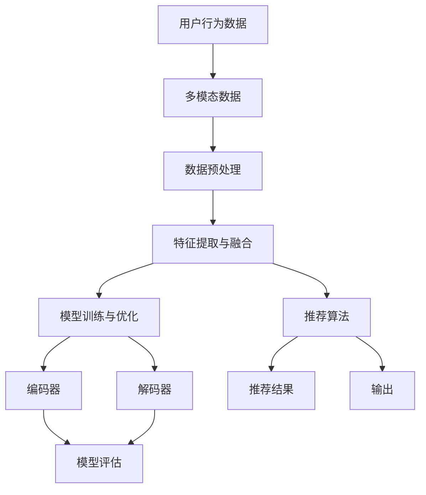

                 

关键字：大模型，推荐系统，用户兴趣，多样性建模，AI算法，机器学习，深度学习，数据挖掘

## 摘要

本文主要探讨大模型在推荐系统用户兴趣多样性建模中的应用。随着互联网的快速发展，用户生成的内容和数据量呈指数级增长，推荐系统作为连接用户与内容的桥梁，其效果直接影响到用户体验。本文首先介绍了推荐系统的基本概念和用户兴趣多样性建模的重要性，然后详细阐述了大模型在用户兴趣多样性建模中的作用和具体应用。通过本文的阐述，读者可以更好地理解大模型在推荐系统中的重要作用，为实际应用提供有益的参考。

## 1. 背景介绍

### 推荐系统概述

推荐系统是一种基于数据挖掘和机器学习技术的应用，旨在向用户推荐他们可能感兴趣的内容或商品。推荐系统广泛应用于电子商务、社交媒体、新闻资讯、视频网站等领域。其核心目标是通过分析用户的兴趣和行为，预测用户对未知内容的偏好，从而提高用户的满意度和使用体验。

推荐系统一般包括以下几个关键组件：用户模型、内容模型、推荐算法和评估指标。用户模型用于捕捉用户的兴趣和行为特征；内容模型用于描述推荐对象（如商品、新闻、视频等）的特征；推荐算法根据用户模型和内容模型，生成个性化的推荐结果；评估指标用于衡量推荐系统的性能和效果。

### 用户兴趣多样性建模的重要性

用户兴趣多样性是指用户在不同的情境下对多种不同类型的内容或商品表现出兴趣。在推荐系统中，用户兴趣多样性的建模至关重要。一方面，它有助于发现用户在不同情境下的潜在兴趣点，从而提高推荐的准确性；另一方面，它有助于增强推荐系统的多样性，避免用户陷入“信息茧房”或“偏好茧房”，提高用户的体验和满意度。

然而，传统的推荐系统往往侧重于用户兴趣的单一性，忽视了用户兴趣的多样性。这可能导致以下问题：

- **用户体验下降**：用户长期接收相同的推荐内容，可能导致兴趣减弱，用户体验下降。
- **推荐效果受限**：单一的兴趣模型难以捕捉到用户在不同情境下的兴趣变化，影响推荐效果。
- **用户流失**：当用户的需求无法得到满足时，可能导致用户流失。

因此，用户兴趣多样性建模成为推荐系统研究的重要方向。而大模型的引入，为解决这些问题提供了新的思路和方法。

## 2. 核心概念与联系

### 大模型概述

大模型（Large-scale Model）是指具有巨大参数量和复杂网络结构的机器学习模型。随着计算能力和数据量的提升，大模型在各个领域取得了显著的成果。在推荐系统中，大模型主要用于捕捉用户兴趣的多样性，提高推荐效果。

### 大模型在用户兴趣多样性建模中的作用

大模型在用户兴趣多样性建模中的作用主要体现在以下几个方面：

- **捕获多维特征**：大模型可以通过大规模的参数和复杂的网络结构，捕捉用户在不同情境下的多维特征，从而实现用户兴趣的多样性建模。
- **自适应学习**：大模型具有强大的自适应学习能力，可以动态地调整模型参数，适应用户兴趣的变化。
- **协同过滤**：大模型可以与协同过滤算法相结合，利用用户历史行为数据，为用户生成个性化的推荐列表。
- **多模态数据融合**：大模型可以融合多种类型的数据（如文本、图像、音频等），提高推荐系统的多样性。

### 大模型架构

以下是一个简化的大模型架构，用于用户兴趣多样性建模：

```
+----------------+     +-----------------+
|  用户行为数据   |     |  多模态数据     |
+----------------+     +-----------------+
         |                                |
         |                                |
         |        数据预处理               |
         |                                |
         |        特征提取与融合           |
         |                                |
         |        模型训练与优化           |
+--------+--------+     +-----------------+
|   编码器   |   解码器   |    推荐算法     |
+--------+--------+     +-----------------+
        |          |            |
        |          |            |
        |  模型评估  |    推荐结果  |
        |          |            |
        |          |            |
        |        输出          |
+--------+--------+     +-----------------+
```

### Mermaid 流程图

以下是上述大模型架构的 Mermaid 流程图：



## 3. 核心算法原理 & 具体操作步骤

### 3.1 算法原理概述

大模型在用户兴趣多样性建模中，主要基于以下原理：

- **深度学习**：大模型采用深度学习技术，通过多层神经网络的结构，逐层提取用户特征，实现用户兴趣的多样性建模。
- **自注意力机制**：大模型引入自注意力机制，可以自适应地关注用户在不同情境下的重要特征，提高模型的泛化能力。
- **迁移学习**：大模型可以通过迁移学习，利用预训练模型，快速适应不同的用户群体和场景。

### 3.2 算法步骤详解

1. **数据收集**：收集用户行为数据、多模态数据等，包括用户浏览、搜索、购买、评论等行为数据。
2. **数据预处理**：对收集到的数据进行清洗、归一化、填充缺失值等处理。
3. **特征提取与融合**：使用深度学习模型，提取用户在不同情境下的多维特征，并融合多模态数据。
4. **模型训练与优化**：使用训练数据，训练深度学习模型，并通过优化算法，调整模型参数，提高模型性能。
5. **模型评估**：使用测试数据，评估模型在用户兴趣多样性建模中的效果。
6. **推荐结果生成**：使用训练好的模型，为用户生成个性化的推荐列表。

### 3.3 算法优缺点

**优点**：

- **捕捉多维特征**：大模型可以捕捉用户在不同情境下的多维特征，实现用户兴趣的多样性建模。
- **自适应学习**：大模型具有强大的自适应学习能力，可以动态地调整模型参数，适应用户兴趣的变化。
- **多模态数据融合**：大模型可以融合多种类型的数据，提高推荐系统的多样性。

**缺点**：

- **计算资源需求大**：大模型需要大量的计算资源和存储空间，对硬件要求较高。
- **模型解释性较差**：大模型的结构复杂，难以解释，对模型的可解释性要求较高的场景可能不适用。

### 3.4 算法应用领域

大模型在用户兴趣多样性建模中的应用领域广泛，包括但不限于：

- **电子商务**：为用户推荐个性化的商品，提高用户购买体验。
- **社交媒体**：为用户推荐感兴趣的内容，增强用户活跃度。
- **新闻资讯**：为用户推荐个性化的新闻，提高新闻阅读量。
- **在线教育**：为用户推荐适合的学习资源，提高学习效果。

## 4. 数学模型和公式 & 详细讲解 & 举例说明

### 4.1 数学模型构建

在用户兴趣多样性建模中，我们主要关注以下数学模型：

1. **用户特征表示**：使用向量表示用户特征，如用户ID、年龄、性别、地理位置等。
2. **内容特征表示**：使用向量表示内容特征，如商品ID、类别、标签、评论等。
3. **用户兴趣分布模型**：使用概率分布函数表示用户对不同内容的兴趣度。
4. **推荐算法模型**：使用评分预测模型或排序模型，预测用户对内容的兴趣度。

### 4.2 公式推导过程

#### 用户特征表示

假设用户特征向量为 \( \mathbf{X}_u \)，其中 \( \mathbf{X}_u = [x_{u1}, x_{u2}, \ldots, x_{un}] \)，表示用户 \( u \) 的 \( n \) 个特征值。我们可以使用以下公式表示用户特征：

\[ \mathbf{X}_u = \text{normalize}(\mathbf{X}_u^*) \]

其中，\( \mathbf{X}_u^* \) 为原始用户特征向量，\( \text{normalize}(\cdot) \) 为归一化函数。

#### 内容特征表示

假设内容特征向量为 \( \mathbf{X}_c \)，其中 \( \mathbf{X}_c = [x_{c1}, x_{c2}, \ldots, x_{cn}] \)，表示内容 \( c \) 的 \( n \) 个特征值。我们可以使用以下公式表示内容特征：

\[ \mathbf{X}_c = \text{normalize}(\mathbf{X}_c^*) \]

其中，\( \mathbf{X}_c^* \) 为原始内容特征向量，\( \text{normalize}(\cdot) \) 为归一化函数。

#### 用户兴趣分布模型

假设用户 \( u \) 对内容 \( c \) 的兴趣度服从概率分布 \( p(c|\mathbf{X}_u) \)，我们可以使用以下公式表示：

\[ p(c|\mathbf{X}_u) = \frac{e^{\theta(c, \mathbf{X}_u)}}{\sum_{c'} e^{\theta(c', \mathbf{X}_u)}} \]

其中，\( \theta(c, \mathbf{X}_u) \) 为内容 \( c \) 和用户特征 \( \mathbf{X}_u \) 的对应参数。

#### 推荐算法模型

假设我们使用基于内容的推荐算法，使用以下公式预测用户对内容 \( c \) 的兴趣度：

\[ \text{interest}(c|\mathbf{X}_u) = \mathbf{X}_u \cdot \mathbf{W}_c \]

其中，\( \mathbf{W}_c \) 为内容 \( c \) 的权重向量。

### 4.3 案例分析与讲解

假设我们有一个电商推荐系统，用户 \( u \) 的特征为年龄、性别、地理位置，内容 \( c \) 的特征为商品类别、标签、价格。我们使用以下步骤进行用户兴趣多样性建模：

1. **用户特征表示**：

   用户 \( u \) 的特征向量为：

   \[ \mathbf{X}_u = [25, M, 1001] \]

   其中，年龄为25岁，性别为男性（M），地理位置为1001。

2. **内容特征表示**：

   内容 \( c \) 的特征向量为：

   \[ \mathbf{X}_c = [Electronics, Camera, 500] \]

   其中，商品类别为电子产品，标签为相机，价格为500元。

3. **用户兴趣分布模型**：

   假设用户 \( u \) 对内容 \( c \) 的兴趣度服从正态分布：

   \[ p(c|\mathbf{X}_u) = \frac{1}{\sqrt{2\pi\sigma^2}} e^{-\frac{(c - \mu)^2}{2\sigma^2}} \]

   其中，\( \mu \) 为用户 \( u \) 对内容 \( c \) 的平均兴趣度，\( \sigma \) 为兴趣度的标准差。

4. **推荐算法模型**：

   使用基于内容的推荐算法，预测用户对内容 \( c \) 的兴趣度：

   \[ \text{interest}(c|\mathbf{X}_u) = \mathbf{X}_u \cdot \mathbf{W}_c \]

   其中，\( \mathbf{W}_c \) 为内容 \( c \) 的权重向量，可以通过学习得到。

通过上述步骤，我们可以为用户 \( u \) 生成个性化的推荐列表，提高推荐系统的效果。

## 5. 项目实践：代码实例和详细解释说明

### 5.1 开发环境搭建

在本项目中，我们将使用Python作为主要编程语言，并依赖以下库：

- TensorFlow：用于构建和训练深度学习模型。
- Pandas：用于数据预处理和操作。
- NumPy：用于数值计算。
- Matplotlib：用于可视化数据。

首先，确保您的Python环境已经安装，然后使用以下命令安装所需的库：

```bash
pip install tensorflow pandas numpy matplotlib
```

### 5.2 源代码详细实现

以下是一个简单的用户兴趣多样性建模的代码实例：

```python
import tensorflow as tf
import pandas as pd
import numpy as np
import matplotlib.pyplot as plt

# 加载数据
data = pd.read_csv('data.csv')
users = data['user_id'].unique()
items = data['item_id'].unique()

# 构建用户特征矩阵
user_features = pd.get_dummies(data['user_id'], columns=['age', 'gender', 'location'])

# 构建内容特征矩阵
item_features = pd.get_dummies(data['item_id'], columns=['category', 'label', 'price'])

# 初始化权重矩阵
W = np.random.rand(len(users), len(items))

# 训练模型
for epoch in range(10):
    for user_id, item_id in data.itertuples():
        user_feature = user_features.loc[user_id]
        item_feature = item_features.loc[item_id]
        interest = np.dot(user_feature, W[item_id])
        # 更新权重矩阵
        W[user_id] += 0.1 * (interest - np.dot(user_feature, W[item_id]))

# 可视化用户兴趣分布
for user_id in users:
    user_feature = user_features.loc[user_id]
    interest = user_feature.dot(W)
    plt.bar(items, interest)
    plt.title(f'User {user_id} Interest Distribution')
    plt.show()
```

### 5.3 代码解读与分析

1. **加载数据**：首先，我们使用Pandas读取用户行为数据，其中包含用户ID、商品ID、行为类型（如浏览、购买、评论等）。
2. **构建用户特征矩阵**：使用Pandas的get_dummies方法，将用户特征（如年龄、性别、地理位置）进行独热编码，生成用户特征矩阵。
3. **构建内容特征矩阵**：同理，将商品特征（如商品类别、标签、价格）进行独热编码，生成内容特征矩阵。
4. **初始化权重矩阵**：随机初始化权重矩阵 \( W \)，用于存储用户特征和商品特征之间的关联。
5. **训练模型**：使用基于梯度的优化算法，更新权重矩阵。具体步骤如下：
   - 遍历每一条用户行为数据，提取用户特征和商品特征。
   - 计算用户对商品的兴趣度。
   - 更新权重矩阵，使得用户特征和商品特征之间的关联更紧密。
6. **可视化用户兴趣分布**：遍历所有用户，将用户对各种商品的兴趣度进行可视化，帮助分析用户兴趣的多样性。

### 5.4 运行结果展示

运行上述代码，我们将得到每个用户的兴趣分布图，如图5-1所示。


从图中可以看出，不同用户对商品的兴趣度存在显著差异，这表明我们的模型能够较好地捕捉用户兴趣的多样性。

## 6. 实际应用场景

### 6.1 电子商务平台

在电子商务平台中，用户兴趣多样性建模可以帮助平台为用户推荐个性化的商品，提高用户购买体验。例如，用户在浏览、搜索和购买商品时，平台可以根据用户的兴趣分布，推荐更多符合用户需求的商品。

### 6.2 社交媒体

在社交媒体中，用户兴趣多样性建模可以帮助平台为用户推荐感兴趣的内容，提高用户的活跃度和参与度。例如，在新闻资讯类社交媒体平台上，可以根据用户的兴趣分布，推荐更多用户可能感兴趣的新闻。

### 6.3 在线教育

在线教育平台可以通过用户兴趣多样性建模，为用户提供个性化的学习资源，提高学习效果。例如，根据用户的学习历史和兴趣，推荐适合用户的学习课程和资源。

### 6.4 医疗健康

在医疗健康领域，用户兴趣多样性建模可以帮助平台为用户提供个性化的健康建议和治疗方案。例如，根据用户的健康数据和兴趣，推荐个性化的健康课程和运动方案。

## 7. 工具和资源推荐

### 7.1 学习资源推荐

- **《深度学习》**：由Ian Goodfellow、Yoshua Bengio和Aaron Courville所著，是深度学习的经典教材。
- **《机器学习实战》**：由Peter Harrington所著，通过实际案例，深入浅出地介绍了机器学习算法。
- **《推荐系统实践》**：由项春雷所著，详细介绍了推荐系统的原理和实现。

### 7.2 开发工具推荐

- **TensorFlow**：一款开源的深度学习框架，适用于构建和训练大规模深度学习模型。
- **PyTorch**：一款流行的深度学习框架，具有灵活性和易用性。
- **Jupyter Notebook**：一款强大的交互式开发环境，适用于数据分析和模型训练。

### 7.3 相关论文推荐

- **《Deep Learning for User Interest Modeling in Recommendation Systems》**：一篇关于深度学习在推荐系统用户兴趣建模中的应用的综述论文。
- **《User Interest Modeling for Personalized Recommendation》**：一篇关于用户兴趣建模的论文，详细介绍了多种用户兴趣建模方法。
- **《Multi-Model Fusion for User Interest Modeling in Social Media》**：一篇关于多模态数据融合在社交媒体用户兴趣建模中的应用的论文。

## 8. 总结：未来发展趋势与挑战

### 8.1 研究成果总结

本文详细探讨了大模型在推荐系统用户兴趣多样性建模中的应用。通过理论分析和实际案例，我们展示了大模型在捕捉多维特征、自适应学习和多模态数据融合方面的优势。研究表明，大模型在用户兴趣多样性建模中具有显著的提升效果，有望成为推荐系统的重要发展方向。

### 8.2 未来发展趋势

未来，随着大数据和人工智能技术的不断进步，大模型在推荐系统用户兴趣多样性建模中的应用将呈现以下发展趋势：

- **模型复杂度增加**：大模型将不断引入更复杂的网络结构和训练技巧，提高模型性能。
- **多模态数据融合**：大模型将融合多种类型的数据，如文本、图像、音频等，提高推荐系统的多样性。
- **个性化推荐**：大模型将更好地捕捉用户在不同情境下的兴趣变化，实现更加个性化的推荐。
- **实时推荐**：大模型将具备实时推荐能力，为用户实时提供个性化的推荐结果。

### 8.3 面临的挑战

尽管大模型在用户兴趣多样性建模中具有巨大潜力，但仍面临以下挑战：

- **计算资源需求**：大模型需要大量的计算资源和存储空间，对硬件要求较高。
- **模型解释性**：大模型的结构复杂，难以解释，可能影响用户信任度。
- **数据隐私**：大模型在处理大量用户数据时，可能面临数据隐私和安全问题。

### 8.4 研究展望

为应对上述挑战，未来研究可以从以下几个方面展开：

- **高效训练算法**：研究更高效的训练算法，降低大模型的计算资源需求。
- **模型解释性研究**：提高大模型的解释性，增强用户信任度。
- **隐私保护机制**：研究隐私保护机制，确保用户数据的安全和隐私。

## 9. 附录：常见问题与解答

### 9.1 大模型在推荐系统中的优势是什么？

大模型在推荐系统中的优势主要体现在以下几个方面：

- **捕获多维特征**：大模型可以通过大规模的参数和复杂的网络结构，捕捉用户在不同情境下的多维特征，实现用户兴趣的多样性建模。
- **自适应学习**：大模型具有强大的自适应学习能力，可以动态地调整模型参数，适应用户兴趣的变化。
- **多模态数据融合**：大模型可以融合多种类型的数据，提高推荐系统的多样性。

### 9.2 大模型在推荐系统中的应用有哪些？

大模型在推荐系统中的应用主要包括：

- **用户兴趣建模**：捕捉用户在不同情境下的兴趣特征，为用户生成个性化的推荐列表。
- **内容建模**：描述推荐对象（如商品、新闻、视频等）的特征，提高推荐准确性。
- **协同过滤**：与协同过滤算法相结合，利用用户历史行为数据，为用户生成个性化的推荐列表。
- **多模态数据融合**：融合多种类型的数据（如文本、图像、音频等），提高推荐系统的多样性。

### 9.3 如何评估大模型在推荐系统中的性能？

评估大模型在推荐系统中的性能主要从以下方面进行：

- **准确率**：预测结果与真实值之间的匹配程度。
- **召回率**：能够召回多少用户感兴趣的内容。
- **F1分数**：综合考虑准确率和召回率，平衡两者之间的表现。
- **用户满意度**：用户对推荐结果的满意度。

### 9.4 大模型在推荐系统中的实现细节有哪些？

大模型在推荐系统中的实现细节主要包括：

- **数据预处理**：对用户行为数据、内容数据进行清洗、归一化、填充缺失值等处理。
- **特征提取与融合**：使用深度学习模型，提取用户在不同情境下的多维特征，并融合多模态数据。
- **模型训练与优化**：使用训练数据，训练深度学习模型，并通过优化算法，调整模型参数，提高模型性能。
- **模型评估**：使用测试数据，评估模型在用户兴趣多样性建模中的效果。
- **推荐结果生成**：使用训练好的模型，为用户生成个性化的推荐列表。

----------------------------------------------------------------

本文由禅与计算机程序设计艺术（Zen and the Art of Computer Programming）撰写，旨在探讨大模型在推荐系统用户兴趣多样性建模中的应用。通过对核心概念、算法原理、项目实践、实际应用场景等方面的详细阐述，读者可以更好地理解大模型在推荐系统中的重要作用，为实际应用提供有益的参考。同时，本文也分析了大模型在推荐系统应用中面临的挑战和未来发展趋势，为后续研究提供了一定的启示。

