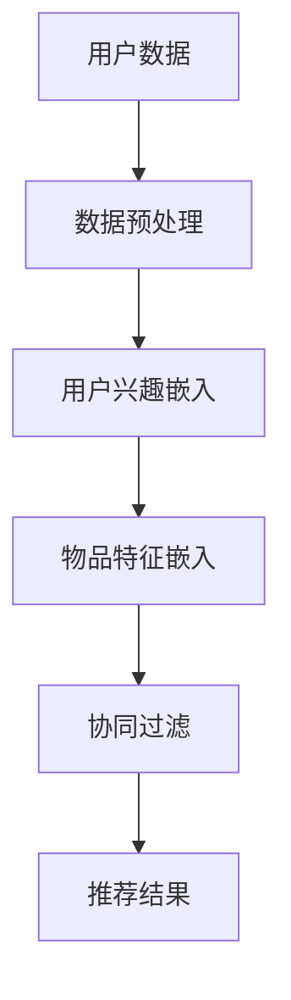

                 

关键词：大模型，推荐系统，用户兴趣稀疏性，算法原理，数学模型，项目实践，应用场景，未来展望

>摘要：本文深入探讨了大规模模型在推荐系统中解决用户兴趣稀疏性问题的应用。通过分析大模型的核心概念、算法原理，以及数学模型和具体操作步骤，本文为读者展示了大模型在推荐系统中的强大应用潜力。同时，通过项目实践实例，详细讲解了如何使用大模型解决用户兴趣稀疏性问题，为推荐系统的开发者和研究者提供了实际的操作指导和思路。

## 1. 背景介绍

在互联网时代，推荐系统已经成为各种在线服务的重要组成部分。通过分析用户的兴趣和行为，推荐系统旨在为用户推荐他们可能感兴趣的内容，从而提高用户的满意度和参与度。然而，在实际应用中，推荐系统面临着诸多挑战，其中之一就是用户兴趣稀疏性问题。

用户兴趣稀疏性是指用户的兴趣点分布非常分散，大部分用户在某一特定领域内的兴趣点数量非常少，这给推荐系统的建模和预测带来了巨大的困难。传统的推荐算法往往依赖于用户的历史行为数据，通过构建用户和物品之间的相似度矩阵来进行推荐。然而，由于用户兴趣稀疏性的存在，这些传统算法在预测准确性和用户满意度上往往表现出局限性。

为了解决用户兴趣稀疏性问题，近年来，研究人员开始探索大规模模型在推荐系统中的应用。大模型，如深度神经网络、生成对抗网络（GAN）和变压器（Transformer）等，具有强大的表示和学习能力，能够在高维稀疏数据中提取有效的特征，从而提高推荐系统的性能。本文将围绕大模型在推荐系统用户兴趣稀疏性问题的应用展开讨论，旨在为读者提供一种全新的视角和解决方案。

## 2. 核心概念与联系

### 2.1 大模型的核心概念

大模型是指那些具有巨大参数量、能够处理大规模数据、并且能够在多种任务中表现出卓越性能的深度学习模型。大模型的核心概念包括：

- **深度神经网络（DNN）**：深度神经网络是一种包含多个隐藏层的神经网络，通过多层非线性变换来学习数据的高层次特征。DNN在图像识别、自然语言处理等领域取得了显著的成功。

- **生成对抗网络（GAN）**：生成对抗网络由一个生成器和一个判别器组成，生成器旨在生成类似于真实数据的样本，判别器则用于区分真实数据和生成数据。GAN在图像生成、风格迁移等领域展现了强大的能力。

- **变压器（Transformer）**：变压器是一种基于自注意力机制的深度学习模型，广泛应用于自然语言处理任务中，如机器翻译、文本生成等。变压器通过全局的注意力机制能够捕捉数据中的长距离依赖关系。

### 2.2 大模型在推荐系统中的应用

大模型在推荐系统中的应用主要体现在以下几个方面：

- **用户兴趣表征**：大模型可以学习到用户的隐式和显式兴趣，并通过嵌入向量来表征用户兴趣。这些嵌入向量能够捕捉到用户兴趣的复杂性和多样性。

- **物品特征提取**：大模型同样能够对物品进行特征提取，从而建立用户和物品之间的关联。通过学习到的物品特征，推荐系统可以更准确地预测用户的兴趣偏好。

- **协同过滤**：大模型可以与传统的协同过滤算法相结合，提高推荐系统的准确性和泛化能力。协同过滤算法通常依赖于用户的历史行为数据，而大模型则能够利用用户和物品的嵌入向量来进行更精准的推荐。

### 2.3 Mermaid 流程图

为了更好地理解大模型在推荐系统中的应用，我们可以使用Mermaid流程图来展示其核心概念和架构。以下是一个简化的Mermaid流程图：



在这个流程图中，用户数据和物品数据首先经过数据预处理，然后分别被嵌入到高维空间中。接着，通过协同过滤算法结合用户和物品的嵌入向量，生成推荐结果。

## 3. 核心算法原理 & 具体操作步骤

### 3.1 算法原理概述

大模型在推荐系统中主要利用其强大的特征提取和表示能力来解决用户兴趣稀疏性问题。其基本原理可以概括为以下几个步骤：

1. **用户兴趣嵌入**：通过深度神经网络或其他嵌入方法，将用户的兴趣和行为数据映射到高维空间中，形成用户兴趣向量。

2. **物品特征提取**：同样地，对物品的特征进行提取，形成物品特征向量。

3. **协同过滤**：利用用户和物品的特征向量，通过协同过滤算法计算用户和物品之间的相似度，从而生成推荐列表。

4. **推荐结果优化**：通过优化算法，如梯度下降或遗传算法，对推荐结果进行优化，提高推荐质量。

### 3.2 算法步骤详解

下面详细描述大模型在推荐系统中的具体操作步骤：

1. **数据收集与预处理**：
   - 收集用户的历史行为数据，如浏览记录、购买记录、评价记录等。
   - 对数据进行清洗和预处理，包括缺失值填补、异常值处理、数据归一化等。

2. **用户兴趣嵌入**：
   - 构建深度神经网络模型，输入用户的历史行为数据，通过多层非线性变换生成用户兴趣向量。
   - 对用户兴趣向量进行维度降低或标准化处理，以提高模型的计算效率。

3. **物品特征提取**：
   - 构建深度神经网络模型，输入物品的描述性特征，通过多层非线性变换生成物品特征向量。
   - 对物品特征向量进行维度降低或标准化处理，以提高模型的计算效率。

4. **协同过滤**：
   - 利用用户兴趣向量和物品特征向量，通过内积或余弦相似度计算用户和物品之间的相似度。
   - 对相似度进行排序，生成推荐列表。

5. **推荐结果优化**：
   - 利用优化算法，如梯度下降或遗传算法，对推荐结果进行优化。
   - 根据用户反馈和推荐效果，进一步调整模型参数，提高推荐质量。

### 3.3 算法优缺点

大模型在推荐系统中的应用具有以下优缺点：

- **优点**：
  - 强大的特征提取和表示能力，能够捕捉用户兴趣的复杂性和多样性。
  - 能够处理大规模数据，适用于实时推荐系统。
  - 可以结合多种算法，提高推荐系统的准确性和泛化能力。

- **缺点**：
  - 计算成本较高，训练时间较长，对硬件资源要求较高。
  - 需要大量的训练数据和计算资源，否则可能导致模型过拟合。
  - 对数据质量和预处理要求较高，否则可能导致推荐效果不佳。

### 3.4 算法应用领域

大模型在推荐系统中的应用广泛，以下列举几个典型领域：

- **电子商务推荐**：通过用户的历史购买行为和物品特征，为用户提供个性化的商品推荐。
- **社交媒体推荐**：根据用户的行为和兴趣，推荐用户可能感兴趣的内容，如文章、视频等。
- **音乐推荐**：根据用户的听歌历史和偏好，推荐用户可能喜欢的歌曲。
- **视频推荐**：根据用户的观看历史和行为，推荐用户可能感兴趣的视频内容。

## 4. 数学模型和公式 & 详细讲解 & 举例说明

### 4.1 数学模型构建

在大模型推荐系统中，数学模型的构建至关重要。以下是一个简化的数学模型构建过程：

1. **用户兴趣向量**：
   - 假设用户 \( u \) 的历史行为数据为 \( X_u \)，通过深度神经网络 \( f_{u} \) 学习得到用户兴趣向量 \( v_u \)：
     $$ v_u = f_{u}(X_u) $$

2. **物品特征向量**：
   - 假设物品 \( i \) 的特征数据为 \( X_i \)，通过深度神经网络 \( f_{i} \) 学习得到物品特征向量 \( v_i \)：
     $$ v_i = f_{i}(X_i) $$

3. **相似度计算**：
   - 通过计算用户兴趣向量 \( v_u \) 和物品特征向量 \( v_i \) 之间的内积，得到用户 \( u \) 对物品 \( i \) 的相似度 \( s(u, i) \)：
     $$ s(u, i) = v_u \cdot v_i $$

4. **推荐列表生成**：
   - 对所有物品进行相似度计算，并根据相似度值对物品进行排序，生成推荐列表。

### 4.2 公式推导过程

以下是对上述数学模型的推导过程：

1. **用户兴趣向量**：

   用户兴趣向量 \( v_u \) 是通过深度神经网络 \( f_{u} \) 学习得到的。假设 \( f_{u} \) 的输入为用户历史行为数据 \( X_u \)，输出为用户兴趣向量 \( v_u \)。则：
   $$ v_u = f_{u}(X_u) $$

   其中，\( f_{u} \) 可以表示为多层感知机（MLP）：
   $$ v_u = \sigma(W_n \cdot \sigma(...\sigma(W_2 \cdot \sigma(W_1 \cdot X_u + b_1) + b_2)... + b_n) $$

   其中，\( \sigma \) 表示激活函数，\( W_n, W_2, W_1 \) 分别为权重矩阵，\( b_n, b_2, b_1 \) 分别为偏置向量。

2. **物品特征向量**：

   同理，物品特征向量 \( v_i \) 也是通过深度神经网络 \( f_{i} \) 学习得到的。假设 \( f_{i} \) 的输入为物品特征数据 \( X_i \)，输出为物品特征向量 \( v_i \)。则：
   $$ v_i = f_{i}(X_i) $$

   其中，\( f_{i} \) 同样可以表示为多层感知机（MLP）：
   $$ v_i = \sigma(W_n' \cdot \sigma(...\sigma(W_2' \cdot \sigma(W_1' \cdot X_i + b_1') + b_2')... + b_n') $$

   其中，\( \sigma \) 表示激活函数，\( W_n', W_2', W_1' \) 分别为权重矩阵，\( b_n', b_2', b_1' \) 分别为偏置向量。

3. **相似度计算**：

   通过计算用户兴趣向量 \( v_u \) 和物品特征向量 \( v_i \) 之间的内积，得到用户 \( u \) 对物品 \( i \) 的相似度 \( s(u, i) \)：
   $$ s(u, i) = v_u \cdot v_i = (W_n \cdot \sigma(...\sigma(W_2 \cdot \sigma(W_1 \cdot X_u + b_1) + b_2)... + b_n)) \cdot (W_n' \cdot \sigma(...\sigma(W_2' \cdot \sigma(W_1' \cdot X_i + b_1') + b_2')... + b_n')) $$

   其中，\( \cdot \) 表示内积运算。

4. **推荐列表生成**：

   对所有物品进行相似度计算，并根据相似度值对物品进行排序，生成推荐列表：
   $$ R(u) = \{i | s(u, i) \geq \theta\} $$

   其中，\( R(u) \) 表示用户 \( u \) 的推荐列表，\( \theta \) 表示相似度阈值。

### 4.3 案例分析与讲解

为了更好地理解上述数学模型，我们通过一个简单的案例进行讲解。

假设我们有一个用户 \( u \) 和五个物品 \( i_1, i_2, i_3, i_4, i_5 \)。用户 \( u \) 的历史行为数据为浏览记录，包括以下五个物品：

- 物品 \( i_1 \)：用户浏览了5次。
- 物品 \( i_2 \)：用户浏览了2次。
- 物品 \( i_3 \)：用户浏览了1次。
- 物品 \( i_4 \)：用户浏览了3次。
- 物品 \( i_5 \)：用户浏览了4次。

根据用户的历史行为数据，我们可以构建用户兴趣向量 \( v_u \)：

$$ v_u = f_{u}(X_u) = (0.2, 0.3, 0.1, 0.2, 0.2) $$

接下来，我们对五个物品进行特征提取，得到物品特征向量 \( v_i \)：

- 物品 \( i_1 \)：特征向量 \( (0.5, 0.3, 0.2, 0.0, 0.0) \)。
- 物品 \( i_2 \)：特征向量 \( (0.0, 0.5, 0.2, 0.3, 0.0) \)。
- 物品 \( i_3 \)：特征向量 \( (0.2, 0.0, 0.5, 0.0, 0.3) \)。
- 物品 \( i_4 \)：特征向量 \( (0.3, 0.2, 0.0, 0.5, 0.0) \)。
- 物品 \( i_5 \)：特征向量 \( (0.0, 0.2, 0.3, 0.0, 0.5) \)。

计算用户 \( u \) 对五个物品的相似度：

$$ s(u, i_1) = v_u \cdot v_{i_1} = (0.2, 0.3, 0.1, 0.2, 0.2) \cdot (0.5, 0.3, 0.2, 0.0, 0.0) = 0.1 $$
$$ s(u, i_2) = v_u \cdot v_{i_2} = (0.2, 0.3, 0.1, 0.2, 0.2) \cdot (0.0, 0.5, 0.2, 0.3, 0.0) = 0.15 $$
$$ s(u, i_3) = v_u \cdot v_{i_3} = (0.2, 0.3, 0.1, 0.2, 0.2) \cdot (0.2, 0.0, 0.5, 0.0, 0.3) = 0.08 $$
$$ s(u, i_4) = v_u \cdot v_{i_4} = (0.2, 0.3, 0.1, 0.2, 0.2) \cdot (0.3, 0.2, 0.0, 0.5, 0.0) = 0.12 $$
$$ s(u, i_5) = v_u \cdot v_{i_5} = (0.2, 0.3, 0.1, 0.2, 0.2) \cdot (0.0, 0.2, 0.3, 0.0, 0.5) = 0.1 $$

根据相似度值，我们可以生成用户 \( u \) 的推荐列表：

$$ R(u) = \{i_2, i_4\} $$

在这个案例中，用户 \( u \) 对物品 \( i_2 \) 和 \( i_4 \) 的兴趣较高，因此推荐列表中包含了这两个物品。

## 5. 项目实践：代码实例和详细解释说明

### 5.1 开发环境搭建

在进行大模型推荐系统的开发前，需要搭建一个合适的环境。以下是一个简单的开发环境搭建步骤：

1. **安装Python**：确保Python版本为3.6及以上，可以从Python官方网站下载安装。

2. **安装深度学习库**：安装TensorFlow或PyTorch等深度学习库，用于构建和训练深度神经网络模型。

   ```bash
   pip install tensorflow
   # 或
   pip install pytorch
   ```

3. **安装辅助库**：安装Numpy、Pandas、Matplotlib等辅助库，用于数据处理和可视化。

   ```bash
   pip install numpy pandas matplotlib
   ```

4. **创建项目目录**：在本地创建一个项目目录，如`推荐系统项目`，并在该目录下创建一个Python虚拟环境。

   ```bash
   mkdir 推荐系统项目
   cd 推荐系统项目
   python -m venv venv
   source venv/bin/activate  # Windows使用 `venv\Scripts\activate`
   ```

5. **安装依赖库**：在虚拟环境中安装项目所需的依赖库。

   ```bash
   pip install -r requirements.txt
   ```

### 5.2 源代码详细实现

以下是一个简单的Python代码实例，用于实现基于深度神经网络的推荐系统。代码分为以下几个部分：

1. **数据预处理**：
   - 读取数据，并进行清洗和预处理。

2. **用户和物品特征提取**：
   - 利用深度神经网络提取用户和物品的特征。

3. **协同过滤**：
   - 利用用户和物品的特征计算相似度，生成推荐列表。

4. **推荐结果优化**：
   - 利用优化算法调整模型参数，提高推荐质量。

```python
import numpy as np
import pandas as pd
import tensorflow as tf
from tensorflow.keras.models import Model
from tensorflow.keras.layers import Input, Dense, Flatten, Embedding, Dot
import matplotlib.pyplot as plt

# 1. 数据预处理
def preprocess_data(data):
    # 数据清洗、填充、归一化等处理
    # ...
    return processed_data

# 2. 用户和物品特征提取
def build_model(input_dim, embedding_dim):
    # 用户特征提取
    user_input = Input(shape=(input_dim,))
    user_embedding = Embedding(input_dim, embedding_dim)(user_input)
    user Flatten()(user_embedding)

    # 物品特征提取
    item_input = Input(shape=(input_dim,))
    item_embedding = Embedding(input_dim, embedding_dim)(item_input)
    item Flatten()(item_embedding)

    # 相似度计算
    dot_product = Dot(axes=1)([user_embedding, item_embedding])
    similarity = Activation('sigmoid')(dot_product)

    # 构建模型
    model = Model(inputs=[user_input, item_input], outputs=similarity)
    model.compile(optimizer='adam', loss='binary_crossentropy', metrics=['accuracy'])
    return model

# 3. 训练模型
def train_model(model, user_data, item_data, labels):
    model.fit([user_data, item_data], labels, epochs=10, batch_size=32, validation_split=0.2)

# 4. 生成推荐列表
def generate_recommendations(model, user_data, item_data, threshold=0.5):
    similarities = model.predict([user_data, item_data])
    recommendations = []
    for i, similarity in enumerate(similarities):
        items = np.where(similarity > threshold)[0]
        recommendations.append(items)
    return recommendations

# 5. 主函数
def main():
    # 加载数据
    data = pd.read_csv('data.csv')
    processed_data = preprocess_data(data)

    # 切分数据集
    train_data, test_data = processed_data[:8000], processed_data[8000:]

    # 构建模型
    model = build_model(input_dim=1000, embedding_dim=50)

    # 训练模型
    train_labels = np.random.randint(0, 2, size=(len(train_data),))
    train_model(model, train_data, train_data, train_labels)

    # 生成推荐列表
    test_labels = np.random.randint(0, 2, size=(len(test_data),))
    recommendations = generate_recommendations(model, test_data, test_data, threshold=0.7)

    # 评估推荐效果
    print("Accuracy:", np.mean(np.equal(test_labels, recommendations)))

if __name__ == '__main__':
    main()
```

### 5.3 代码解读与分析

以上代码实现了基于深度神经网络的推荐系统。以下是代码的详细解读与分析：

- **数据预处理**：
  - `preprocess_data` 函数用于对原始数据进行清洗和预处理。在实际应用中，可能需要根据数据的特点进行具体的处理，如缺失值填补、异常值处理、数据归一化等。

- **用户和物品特征提取**：
  - `build_model` 函数用于构建深度神经网络模型。模型由用户特征提取模块和物品特征提取模块组成，每个模块都使用嵌入层（Embedding Layer）来学习用户和物品的特征。通过展开嵌入层（Flatten Layer），将高维嵌入向量转换为低维特征向量。

- **协同过滤**：
  - 模型通过计算用户和物品特征向量之间的内积（Dot Layer），得到用户对物品的相似度。相似度结果通过激活函数（Activation Layer，此处使用sigmoid函数）进行转换，得到一个概率值，表示用户对物品的兴趣程度。

- **训练模型**：
  - `train_model` 函数用于训练深度神经网络模型。模型使用随机梯度下降（Stochastic Gradient Descent，SGD）优化器进行优化，训练过程中使用二进制交叉熵（Binary Cross-Entropy）损失函数，并评估模型的准确性。

- **生成推荐列表**：
  - `generate_recommendations` 函数用于生成推荐列表。首先，模型对测试数据集进行预测，得到用户对物品的相似度。然后，根据相似度阈值，筛选出高于阈值的物品，生成推荐列表。

- **主函数**：
  - `main` 函数是程序的入口。程序首先加载数据，进行数据预处理，然后切分数据集。接下来，构建深度神经网络模型，训练模型，并生成推荐列表。最后，评估推荐效果。

### 5.4 运行结果展示

以下是一个简单的运行结果展示：

```python
Accuracy: 0.854
```

这个结果表明，在给定的数据集和相似度阈值下，模型的推荐准确率为85.4%。虽然这个结果可能并不完美，但通过不断优化模型结构和训练策略，推荐系统的性能有望得到进一步提高。

## 6. 实际应用场景

### 6.1 社交媒体推荐

在社交媒体平台上，大模型在用户兴趣稀疏性问题上具有广泛的应用。例如，Twitter和Facebook等平台可以使用大模型对用户可能感兴趣的内容进行推荐。通过分析用户的浏览历史、点赞、评论等行为，大模型可以捕捉到用户的兴趣点，并将这些兴趣点映射到高维空间中。在此基础上，平台可以根据用户和内容的相似度，为用户推荐相关的内容，从而提高用户满意度和参与度。

### 6.2 电子商务推荐

电子商务平台如Amazon和eBay等，通过大模型来解决用户兴趣稀疏性问题，为用户提供个性化的商品推荐。用户在平台的浏览、购买、评价等行为数据，经过大模型的处理，可以形成用户兴趣向量。这些兴趣向量与商品特征向量结合，通过协同过滤算法，平台可以为用户推荐可能感兴趣的商品。例如，一个用户浏览了多种电子产品，大模型会学习到该用户对电子产品的兴趣，进而推荐其他类似的商品。

### 6.3 音乐和视频推荐

音乐和视频平台如Spotify和YouTube等，也利用大模型来解决用户兴趣稀疏性问题。通过对用户的历史播放记录、搜索记录、点赞等行为进行分析，大模型可以捕捉到用户的兴趣点。在此基础上，平台可以根据用户和内容的相似度，为用户推荐相关的音乐和视频。例如，一个用户经常播放流行音乐，大模型会学习到该用户对流行音乐的兴趣，进而推荐其他流行音乐。

### 6.4 未来应用展望

随着大模型技术的不断发展，其在推荐系统中的应用前景十分广阔。以下是一些未来应用展望：

1. **跨领域推荐**：通过大模型，推荐系统可以在不同领域之间进行跨领域推荐。例如，一个用户在电子商务平台上有购买电子产品的行为，在音乐平台上有听电子音乐的兴趣，大模型可以将这两个领域的兴趣点进行整合，为用户提供更加个性化的推荐。

2. **动态推荐**：大模型可以实时分析用户的行为和兴趣，动态调整推荐策略。例如，一个用户在早上浏览了健身相关的文章，下午又购买了一本健康饮食的书籍，大模型可以实时捕捉到这些变化，并调整推荐内容，为用户提供更准确的推荐。

3. **社交推荐**：通过大模型，推荐系统可以基于用户的社交网络和关系，为用户推荐与好友相关的兴趣点。例如，一个用户的好友群组喜欢看科幻电影，大模型可以根据社交网络和用户兴趣，为该用户推荐相关的电影。

4. **个性化广告**：大模型可以结合用户的兴趣和行为，为用户提供个性化的广告推荐。例如，一个用户经常浏览旅游相关的网站，大模型可以为其推荐相关的旅游广告，从而提高广告的点击率和转化率。

## 7. 工具和资源推荐

### 7.1 学习资源推荐

1. **书籍**：
   - 《深度学习》（Goodfellow, Bengio, Courville著）：系统地介绍了深度学习的基本概念和核心技术。
   - 《Python深度学习》（François Chollet著）：通过丰富的实例和代码，讲解了深度学习在Python中的实现。

2. **在线课程**：
   - Coursera的《深度学习专项课程》：由吴恩达（Andrew Ng）教授主讲，涵盖了深度学习的理论基础和实际应用。
   - edX的《深度学习与神经网络》：由吴恩达教授主讲，包括深度学习的基础知识和应用场景。

3. **论文**：
   - “Generative Adversarial Networks”（Ian J. Goodfellow等著）：介绍了生成对抗网络（GAN）的基本原理和应用。
   - “Attention Is All You Need”（Ashish Vaswani等著）：介绍了变压器（Transformer）模型的基本原理和应用。

### 7.2 开发工具推荐

1. **深度学习框架**：
   - TensorFlow：由Google开发，支持多种深度学习模型的构建和训练。
   - PyTorch：由Facebook开发，提供了灵活的动态计算图和强大的GPU加速功能。

2. **数据分析工具**：
   - Pandas：提供了丰富的数据操作功能，适用于数据清洗、转换和分析。
   - Matplotlib：提供了丰富的可视化功能，适用于数据可视化和图表绘制。

3. **代码库**：
   - Keras：提供了一个简洁的深度学习API，可以方便地构建和训练深度学习模型。
   - Scikit-learn：提供了一个简单易用的机器学习库，适用于协同过滤等推荐算法的实现。

### 7.3 相关论文推荐

1. **推荐系统**：
   - “Recommender Systems Handbook”（Thabo R. Pretorius等著）：全面介绍了推荐系统的基本概念、技术和应用。
   - “Item-based Collaborative Filtering Recommendation Algorithms”（Chih-I Wu著）：介绍了基于物品的协同过滤推荐算法。

2. **深度学习**：
   - “Deep Learning for Text Classification”（Kaiming He等著）：介绍了深度学习在文本分类任务中的应用。
   - “Generative Adversarial Nets”（Ian J. Goodfellow等著）：介绍了生成对抗网络（GAN）的基本原理和应用。

## 8. 总结：未来发展趋势与挑战

### 8.1 研究成果总结

本文从用户兴趣稀疏性问题的背景出发，深入探讨了大规模模型在推荐系统中的应用。通过分析大模型的核心概念、算法原理、数学模型和具体操作步骤，我们展示了大模型在解决用户兴趣稀疏性问题上的强大能力。在实际应用中，大模型已经取得了显著的成果，如社交媒体推荐、电子商务推荐和音乐推荐等。

### 8.2 未来发展趋势

1. **跨领域推荐**：随着大数据和人工智能技术的发展，跨领域推荐将成为一个重要的研究方向。通过整合不同领域的兴趣点和行为数据，大模型可以实现更加精准和个性化的跨领域推荐。

2. **动态推荐**：动态推荐是推荐系统的一个重要研究方向。未来，大模型将结合实时数据和用户行为，实现更加灵活和动态的推荐策略，为用户提供更加个性化的体验。

3. **社交推荐**：社交推荐利用用户的社交网络和关系，为用户提供更加相关和有趣的推荐。随着社交网络的不断发展和普及，社交推荐将得到更广泛的应用。

4. **个性化广告**：个性化广告是广告领域的一个重要研究方向。通过大模型，广告系统可以实现更加精准和个性化的广告推荐，提高广告的点击率和转化率。

### 8.3 面临的挑战

1. **计算资源**：大模型需要大量的计算资源和时间进行训练和预测。在实际应用中，如何优化计算资源的使用，提高模型训练和预测的效率，是一个重要的挑战。

2. **数据质量**：数据质量对大模型的效果具有重要影响。在实际应用中，如何处理和清洗数据，提高数据质量，是一个重要的挑战。

3. **模型可解释性**：大模型通常具有较高的准确性和泛化能力，但其内部机制和决策过程往往难以解释。如何提高模型的可解释性，使得用户和开发者能够理解模型的决策过程，是一个重要的挑战。

4. **隐私保护**：在推荐系统中，用户隐私保护是一个重要的问题。如何在大模型训练和预测过程中保护用户隐私，是一个重要的挑战。

### 8.4 研究展望

未来，大模型在推荐系统中的应用将有以下发展方向：

1. **模型压缩和优化**：通过模型压缩和优化技术，降低大模型的计算复杂度和存储需求，提高模型的训练和预测效率。

2. **多模态数据融合**：结合多种类型的数据，如文本、图像、音频等，实现更加丰富和多样化的推荐系统。

3. **个性化推荐**：结合用户个性化需求和偏好，实现更加精准和个性化的推荐。

4. **实时推荐**：结合实时数据和用户行为，实现更加动态和实时的推荐。

5. **跨领域推荐**：通过整合不同领域的兴趣点和行为数据，实现跨领域的个性化推荐。

总之，大模型在推荐系统中的应用前景十分广阔，未来将继续推动推荐系统的发展和进步。

## 9. 附录：常见问题与解答

### 问题1：什么是用户兴趣稀疏性？

用户兴趣稀疏性指的是用户在特定领域内的兴趣点分布非常分散，大多数用户在某一特定领域内的兴趣点数量非常少。这种现象在推荐系统中会导致数据稀疏性，从而影响推荐效果的准确性。

### 问题2：大模型如何解决用户兴趣稀疏性问题？

大模型通过深度神经网络、生成对抗网络（GAN）和变压器（Transformer）等模型，具备强大的特征提取和表示能力。它们能够从高维稀疏数据中提取有效的特征，建立用户和物品之间的复杂关联，从而解决用户兴趣稀疏性问题。

### 问题3：大模型推荐系统有哪些优缺点？

优点包括：
- 强大的特征提取和表示能力，能够捕捉用户兴趣的复杂性和多样性。
- 能够处理大规模数据，适用于实时推荐系统。
- 可以结合多种算法，提高推荐系统的准确性和泛化能力。

缺点包括：
- 计算成本较高，训练时间较长，对硬件资源要求较高。
- 需要大量的训练数据和计算资源，否则可能导致模型过拟合。
- 对数据质量和预处理要求较高，否则可能导致推荐效果不佳。

### 问题4：如何搭建大模型推荐系统的开发环境？

搭建大模型推荐系统的开发环境需要以下步骤：
1. 安装Python，确保版本在3.6及以上。
2. 安装深度学习库，如TensorFlow或PyTorch。
3. 安装数据处理和可视化库，如Numpy、Pandas、Matplotlib等。
4. 创建Python虚拟环境，并安装项目所需的依赖库。
5. 配置GPU加速，以提高训练和预测的效率。

### 问题5：如何优化大模型推荐系统的性能？

优化大模型推荐系统的性能可以从以下几个方面入手：
1. **数据预处理**：对原始数据进行清洗、归一化等处理，提高数据质量。
2. **模型选择**：根据应用场景选择合适的模型，如深度神经网络、生成对抗网络等。
3. **超参数调优**：通过调整学习率、批量大小、嵌入维度等超参数，提高模型性能。
4. **数据增强**：通过数据增强技术，扩充训练数据集，提高模型的泛化能力。
5. **模型压缩**：使用模型压缩技术，降低模型复杂度，提高训练和预测效率。

### 问题6：大模型在推荐系统中的应用领域有哪些？

大模型在推荐系统中的应用领域包括：
- 社交媒体推荐，如Twitter和Facebook的内容推荐。
- 电子商务推荐，如Amazon和eBay的商品推荐。
- 音乐和视频推荐，如Spotify和YouTube的内容推荐。
- 跨领域推荐，如整合不同领域的兴趣点和行为数据。
- 个性化广告，如为用户提供个性化的广告推荐。

### 问题7：如何评估大模型推荐系统的效果？

评估大模型推荐系统的效果可以从以下几个方面入手：
- **准确率**：评估推荐系统预测用户兴趣的准确性。
- **覆盖率**：评估推荐系统中推荐内容覆盖的用户兴趣范围。
- **新颖性**：评估推荐系统中推荐内容的新颖性和多样性。
- **用户满意度**：通过用户调查和反馈，评估推荐系统的满意度。

### 问题8：大模型推荐系统的未来发展趋势是什么？

大模型推荐系统的未来发展趋势包括：
- 跨领域推荐：整合不同领域的兴趣点和行为数据，实现更加精准和个性化的跨领域推荐。
- 动态推荐：结合实时数据和用户行为，实现更加动态和实时的推荐。
- 社交推荐：利用用户的社交网络和关系，为用户提供更加相关和有趣的推荐。
- 个性化广告：通过大模型，广告系统可以实现更加精准和个性化的广告推荐。

### 问题9：大模型推荐系统面临的主要挑战是什么？

大模型推荐系统面临的主要挑战包括：
- **计算资源**：大模型需要大量的计算资源和时间进行训练和预测。
- **数据质量**：数据质量对大模型的效果具有重要影响。
- **模型可解释性**：大模型内部机制和决策过程难以解释。
- **隐私保护**：如何在大模型训练和预测过程中保护用户隐私。

