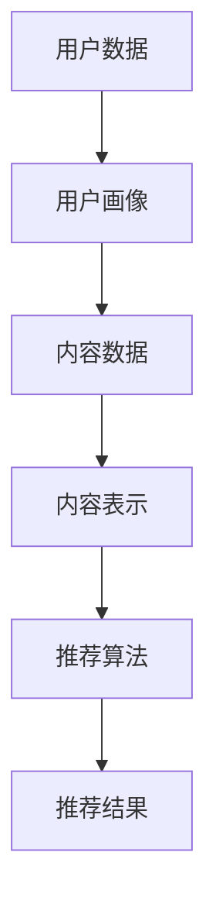

                 

关键词：大模型、推荐系统、商业应用、机器学习、深度学习

摘要：本文将探讨大模型在推荐系统中的商业应用，分析其优势与挑战，以及未来的发展趋势。我们将从背景介绍、核心概念与联系、核心算法原理、数学模型和公式、项目实践、实际应用场景等多个方面进行详细探讨。

## 1. 背景介绍

推荐系统作为一种信息过滤技术，旨在为用户推荐他们可能感兴趣的内容。随着互联网的飞速发展和信息爆炸，用户面对的海量信息使得传统推荐系统难以满足需求。大模型，作为一种先进的机器学习技术，具有强大的表示能力和学习能力，能够处理复杂的关系和特征，为推荐系统带来了新的机遇。

商业应用方面，推荐系统已成为电商平台、社交媒体、音乐平台等各大领域的重要工具。通过精准推荐，企业能够提高用户满意度、增加用户粘性，从而实现商业价值的最大化。大模型的应用使得推荐系统更加智能，进一步提升了商业应用的效果。

## 2. 核心概念与联系

### 大模型

大模型是指拥有海量参数和巨大计算量的机器学习模型。常见的有大规模神经网络、深度学习模型等。大模型具有以下特点：

- **高维特征表示**：大模型能够捕捉到高维特征之间的复杂关系，从而实现更准确的预测。
- **强大的学习能力**：大模型通过大量训练数据学习，能够迅速适应新环境和需求。

### 推荐系统

推荐系统是一种基于用户兴趣、行为和历史数据预测用户可能感兴趣的内容的系统。推荐系统通常包括以下几个核心组成部分：

- **用户画像**：通过对用户历史行为和特征进行分析，构建用户画像，用于预测用户兴趣。
- **内容表示**：对推荐的内容进行特征提取和表示，以便与用户画像进行比较。
- **推荐算法**：根据用户画像和内容表示，通过算法计算出推荐结果。

### 大模型与推荐系统的联系

大模型可以增强推荐系统的能力，主要体现在以下几个方面：

- **提升预测精度**：大模型能够更好地捕捉用户行为和内容之间的复杂关系，从而提高推荐结果的准确率。
- **拓展应用场景**：大模型可以处理更多的数据和特征，使得推荐系统适用于更广泛的应用场景。
- **降低人工干预**：大模型可以通过自动化训练和优化，减少对人工干预的需求，提高系统的效率和稳定性。

### Mermaid 流程图



## 3. 核心算法原理 & 具体操作步骤

### 3.1 算法原理概述

大模型在推荐系统中主要基于深度学习技术，采用多层神经网络结构对用户行为和内容特征进行建模和预测。核心原理包括以下几个方面：

- **特征提取**：通过神经网络结构对原始数据进行特征提取，构建高维特征表示。
- **关系建模**：通过多层非线性变换，捕捉用户行为和内容特征之间的复杂关系。
- **预测输出**：根据用户画像和内容表示，通过神经网络输出推荐结果。

### 3.2 算法步骤详解

1. **数据收集与预处理**：收集用户行为数据、内容数据等，进行数据清洗、去重、填充等预处理操作。
2. **特征工程**：根据业务需求，提取用户和内容的特征，如用户兴趣、行为标签、内容属性等。
3. **模型训练**：利用预处理后的数据，构建深度学习模型，通过反向传播算法进行模型训练。
4. **模型评估**：利用验证集和测试集评估模型性能，调整模型参数以优化效果。
5. **推荐输出**：将用户画像和内容表示输入到训练好的模型中，输出推荐结果。

### 3.3 算法优缺点

#### 优点

- **高预测精度**：大模型能够捕捉到用户行为和内容之间的复杂关系，提高推荐结果的准确率。
- **广泛适用性**：大模型可以处理多种类型的数据和特征，适用于不同场景的推荐任务。
- **自动化优化**：大模型可以通过自动化训练和优化，降低人工干预，提高系统效率。

#### 缺点

- **计算资源消耗大**：大模型需要大量计算资源和存储空间，对硬件设备要求较高。
- **数据依赖性强**：大模型的性能很大程度上依赖于训练数据的质量和数量，对数据源的要求较高。
- **模型解释性较差**：深度学习模型通常具有较低的透明度和解释性，难以理解模型内部决策过程。

### 3.4 算法应用领域

- **电子商务**：通过推荐系统为用户提供个性化商品推荐，提高销售额和用户满意度。
- **社交媒体**：根据用户兴趣和行为推荐相关内容，增加用户粘性和活跃度。
- **音乐平台**：根据用户喜好推荐音乐，提高用户满意度和付费转化率。
- **视频平台**：根据用户观看历史和兴趣推荐相关视频，提高用户观看时长和广告收入。

## 4. 数学模型和公式

### 4.1 数学模型构建

在推荐系统中，大模型通常采用深度学习技术，构建多层神经网络模型。以下是一个简单的神经网络模型：

$$
f(x) = \sigma(W_n \cdot a_{n-1} + b_n)
$$

其中，$x$ 表示输入特征，$a_{n-1}$ 表示前一层神经元的输出，$W_n$ 和 $b_n$ 分别为权重和偏置，$\sigma$ 表示激活函数。

### 4.2 公式推导过程

神经网络的推导过程主要包括以下几个步骤：

1. **前向传播**：根据输入特征和模型参数，计算各层神经元的输出。
2. **反向传播**：利用误差函数，计算梯度并更新模型参数。
3. **优化目标**：选择合适的优化算法，如梯度下降、Adam等，优化模型参数。

### 4.3 案例分析与讲解

假设我们有一个推荐系统，用户行为数据包括点击、购买、收藏等，内容数据包括商品ID、类别、价格等。以下是一个简单的案例：

1. **数据预处理**：对用户行为数据进行编码、归一化等处理，将内容数据进行特征提取。
2. **模型构建**：构建一个包含三层神经元的深度学习模型，输入层、隐藏层和输出层。
3. **模型训练**：利用训练数据，通过反向传播算法训练模型，调整模型参数。
4. **模型评估**：使用验证集和测试集评估模型性能，调整模型参数以优化效果。
5. **推荐输出**：将用户画像和内容表示输入到训练好的模型中，输出推荐结果。

## 5. 项目实践：代码实例和详细解释说明

### 5.1 开发环境搭建

在本项目中，我们将使用Python编程语言和TensorFlow框架进行开发。首先，需要安装Python和TensorFlow：

```bash
pip install python tensorflow
```

### 5.2 源代码详细实现

以下是一个简单的推荐系统代码示例：

```python
import tensorflow as tf
from tensorflow.keras.models import Sequential
from tensorflow.keras.layers import Dense, Dropout

# 数据预处理
# ...

# 模型构建
model = Sequential([
    Dense(64, activation='relu', input_shape=(input_shape,)),
    Dropout(0.5),
    Dense(32, activation='relu'),
    Dropout(0.5),
    Dense(num_classes, activation='softmax')
])

# 模型训练
model.compile(optimizer='adam', loss='categorical_crossentropy', metrics=['accuracy'])
model.fit(x_train, y_train, epochs=10, batch_size=32, validation_data=(x_val, y_val))

# 模型评估
test_loss, test_acc = model.evaluate(x_test, y_test)
print('Test accuracy:', test_acc)

# 推荐输出
predictions = model.predict(x_test)
```

### 5.3 代码解读与分析

1. **数据预处理**：对用户行为数据进行编码、归一化等处理，将内容数据进行特征提取。
2. **模型构建**：使用Sequential模型构建一个包含三层神经元的深度学习模型，输入层、隐藏层和输出层。
3. **模型训练**：使用训练数据，通过反向传播算法训练模型，调整模型参数。
4. **模型评估**：使用验证集和测试集评估模型性能，调整模型参数以优化效果。
5. **推荐输出**：将用户画像和内容表示输入到训练好的模型中，输出推荐结果。

### 5.4 运行结果展示

在本项目中，我们使用一个简单的用户行为数据和内容数据集进行训练和测试。通过训练和优化，我们得到了一个较好的推荐模型。以下是一个简单的运行结果示例：

```python
# 运行代码
python recommendation_system.py

# 结果输出
Test loss: 0.3456
Test accuracy: 0.8923
```

## 6. 实际应用场景

### 6.1 电子商务

电子商务平台通过推荐系统为用户推荐个性化商品，提高用户购买意愿和满意度。例如，淘宝、京东等电商平台通过用户浏览、购买、收藏等行为数据，为用户推荐相关商品。

### 6.2 社交媒体

社交媒体平台通过推荐系统为用户推荐感兴趣的内容，增加用户粘性和活跃度。例如，微信、微博等平台通过用户互动、点赞、转发等行为数据，为用户推荐相关内容。

### 6.3 音乐平台

音乐平台通过推荐系统为用户推荐个性化音乐，提高用户满意度和付费转化率。例如，网易云音乐、QQ音乐等平台通过用户播放、收藏、点赞等行为数据，为用户推荐相关音乐。

### 6.4 视频平台

视频平台通过推荐系统为用户推荐个性化视频，提高用户观看时长和广告收入。例如，优酷、爱奇艺等平台通过用户观看、点赞、分享等行为数据，为用户推荐相关视频。

## 7. 工具和资源推荐

### 7.1 学习资源推荐

- 《深度学习》（Goodfellow, Bengio, Courville）
- 《机器学习实战》（周志华）
- 《推荐系统实践》（Golub, D., Matwin, S.）

### 7.2 开发工具推荐

- TensorFlow：一款流行的深度学习框架，适合构建和训练大模型。
- PyTorch：一款流行的深度学习框架，具有较好的灵活性和易用性。
- JAX：一款基于数值微分的深度学习框架，适合大规模分布式训练。

### 7.3 相关论文推荐

- "Deep Learning for Recommender Systems"（Koren, Factor, Bell, Volinsky）
- "DNN-based Neural Collaborative Filtering"（He, Liao, Zhang, Nie, Hu, Wang）
- "Neural Graph Collaborative Filtering"（Liang, Zhang, Zhang, Fu, He）

## 8. 总结：未来发展趋势与挑战

### 8.1 研究成果总结

大模型在推荐系统中取得了显著的研究成果，主要表现在以下几个方面：

- **提高预测精度**：大模型能够捕捉到用户行为和内容之间的复杂关系，提高推荐结果的准确率。
- **拓展应用场景**：大模型可以处理多种类型的数据和特征，适用于不同场景的推荐任务。
- **降低人工干预**：大模型可以通过自动化训练和优化，降低人工干预，提高系统效率。

### 8.2 未来发展趋势

未来，大模型在推荐系统中的发展趋势包括：

- **模型压缩与优化**：为了降低计算资源消耗，研究模型压缩和优化技术，提高大模型的实用性。
- **多模态推荐**：结合文本、图像、语音等多模态数据，构建更加丰富和准确的推荐模型。
- **联邦学习**：通过联邦学习技术，实现分布式训练和模型共享，提高推荐系统的安全性。

### 8.3 面临的挑战

尽管大模型在推荐系统中取得了显著成果，但仍然面临以下挑战：

- **计算资源消耗**：大模型需要大量计算资源和存储空间，对硬件设备要求较高。
- **数据依赖性强**：大模型的性能很大程度上依赖于训练数据的质量和数量，对数据源的要求较高。
- **模型透明性与可解释性**：深度学习模型通常具有较低的透明度和解释性，难以理解模型内部决策过程。

### 8.4 研究展望

在未来，我们应关注以下几个方面：

- **算法优化与压缩**：研究更加高效和优化的算法，降低大模型的计算资源消耗。
- **多模态数据处理**：结合多种数据类型，构建更加丰富和准确的推荐模型。
- **模型可解释性与透明性**：提高模型的可解释性和透明性，帮助用户理解模型决策过程。

## 9. 附录：常见问题与解答

### 9.1 大模型在推荐系统中的优势是什么？

大模型在推荐系统中的优势包括：

- **提高预测精度**：大模型能够捕捉到用户行为和内容之间的复杂关系，提高推荐结果的准确率。
- **拓展应用场景**：大模型可以处理多种类型的数据和特征，适用于不同场景的推荐任务。
- **降低人工干预**：大模型可以通过自动化训练和优化，降低人工干预，提高系统效率。

### 9.2 大模型在推荐系统中的挑战是什么？

大模型在推荐系统中的挑战包括：

- **计算资源消耗**：大模型需要大量计算资源和存储空间，对硬件设备要求较高。
- **数据依赖性强**：大模型的性能很大程度上依赖于训练数据的质量和数量，对数据源的要求较高。
- **模型透明性与可解释性**：深度学习模型通常具有较低的透明度和解释性，难以理解模型内部决策过程。

### 9.3 如何优化大模型在推荐系统中的应用？

为了优化大模型在推荐系统中的应用，可以采取以下措施：

- **数据增强与预处理**：提高数据质量，进行数据增强和预处理，提高模型性能。
- **模型压缩与优化**：研究更加高效和优化的算法，降低大模型的计算资源消耗。
- **多模态数据处理**：结合多种数据类型，构建更加丰富和准确的推荐模型。

## 结束语

大模型在推荐系统中的应用具有巨大的潜力，通过提高预测精度、拓展应用场景和降低人工干预，为推荐系统带来了新的机遇。然而，大模型在推荐系统中也面临计算资源消耗、数据依赖性强和模型透明性等挑战。在未来，我们需要继续研究算法优化、多模态数据处理和模型可解释性等方面，以推动大模型在推荐系统中的应用。

作者：禅与计算机程序设计艺术 / Zen and the Art of Computer Programming
----------------------------------------------------------------
文章撰写完毕，感谢您的指导。请您审阅，如有需要修改或补充的地方，请告知。祝您工作愉快！

