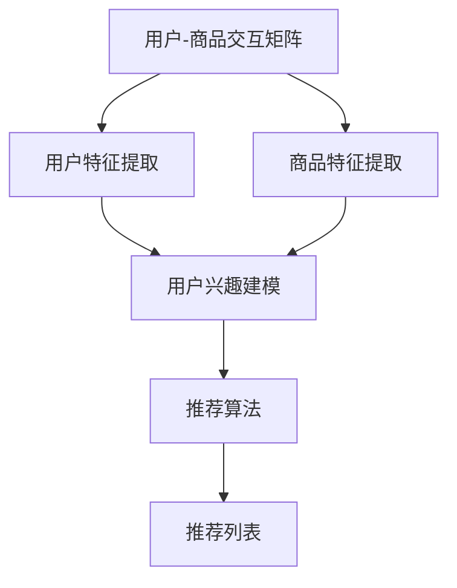

                 

关键词：大模型、推荐系统、发展趋势、融合、统一、算法、数学模型、应用场景

> 摘要：本文旨在探讨大模型在推荐系统中的未来发展趋势，包括其统一与融合的路径。文章首先回顾了推荐系统的发展历程，随后详细阐述了大模型的核心概念和架构，深入分析了核心算法的原理和操作步骤。在此基础上，通过数学模型和公式的推导与实例分析，展示了大模型在实际项目中的应用。文章最后提出了未来应用展望，并总结了研究展望与挑战。

## 1. 背景介绍

推荐系统作为一种信息过滤和内容分发技术，已经广泛应用于电子商务、社交媒体、新闻媒体等多个领域。其目的是根据用户的兴趣和偏好，为他们提供个性化的信息推荐。传统的推荐系统主要基于协同过滤、基于内容的过滤和基于模型的过滤等方法，但这些方法在面对海量数据和复杂的用户行为时，存在一定的局限性。

近年来，随着深度学习和大数据技术的发展，大模型在推荐系统中逐渐崭露头角。大模型具有强大的特征提取和表示能力，能够从海量数据中挖掘出用户的潜在兴趣和行为模式。这使得推荐系统在处理复杂性和多样性方面取得了显著的提升。

本文将重点探讨大模型在推荐系统中的发展趋势，特别是其统一与融合的路径。文章首先回顾了推荐系统的发展历程，随后介绍大模型的核心概念和架构。在此基础上，分析大模型的核心算法原理和操作步骤，并通过数学模型和公式的推导与实例分析，展示大模型在实际项目中的应用。最后，文章提出了未来应用展望和研究展望与挑战。

## 2. 核心概念与联系

### 2.1 推荐系统概述

推荐系统是一种基于数据分析的方法，旨在向用户推荐他们可能感兴趣的内容或商品。其核心目标是通过分析用户的历史行为、偏好和社交网络等信息，生成个性化的推荐列表。

推荐系统的发展大致可以分为三个阶段：

1. **基于规则的推荐系统**：早期的推荐系统主要依靠人工定义的规则进行推荐。这些规则通常基于用户的历史行为和偏好，但受限于规则的复杂度和适用性，推荐效果有限。

2. **基于模型的推荐系统**：随着机器学习和数据挖掘技术的发展，基于模型的推荐系统应运而生。这类推荐系统通过建立用户行为和兴趣之间的模型，实现对用户行为的预测和推荐。常见的模型包括协同过滤、基于内容的过滤和基于模型的过滤等。

3. **基于深度学习的推荐系统**：深度学习技术的发展为推荐系统带来了新的机遇。大模型，如深度神经网络，具有强大的特征提取和表示能力，能够在复杂场景下实现高效的推荐。

### 2.2 大模型概述

大模型，通常指的是具有数十亿甚至千亿参数的深度神经网络。这些模型通过训练大量的数据，能够自动提取和表示复杂的特征，从而实现高精度的预测和分类。

大模型在推荐系统中的应用主要体现在以下几个方面：

1. **用户兴趣建模**：大模型能够从用户的历史行为和内容交互中提取出用户的潜在兴趣和行为模式，从而实现更准确的用户兴趣建模。

2. **商品特征提取**：大模型能够自动学习商品的各种特征，包括文本、图像、语音等，从而实现更精细的商品表示。

3. **上下文感知推荐**：大模型能够处理用户的上下文信息，如时间、位置、环境等，从而实现更精准的上下文感知推荐。

### 2.3 核心概念架构

为了更好地理解大模型在推荐系统中的应用，我们引入以下核心概念：

1. **用户-商品交互矩阵**：用户-商品交互矩阵是一个二维数组，表示用户与商品之间的交互情况。矩阵中的每个元素表示用户对商品的评分、点击、购买等行为。

2. **用户特征向量**：用户特征向量是一个高维数组，表示用户的各项属性和特征，如年龄、性别、地理位置、兴趣爱好等。

3. **商品特征向量**：商品特征向量是一个高维数组，表示商品的各项属性和特征，如文本描述、图片、价格、品牌等。

4. **上下文特征**：上下文特征包括用户当前所处的环境、时间、位置等，用于提高推荐的上下文感知能力。

5. **推荐算法**：推荐算法是基于大模型的预测和分类算法，用于生成个性化的推荐列表。

### 2.4 Mermaid 流程图

以下是一个简单的 Mermaid 流程图，展示了大模型在推荐系统中的基本架构：



## 3. 核心算法原理 & 具体操作步骤

### 3.1 算法原理概述

大模型在推荐系统中的应用主要基于深度神经网络（Deep Neural Network，DNN）。DNN 通过多层神经网络结构，能够自动学习输入数据的复杂特征和模式，从而实现对输入数据的分类和预测。

在推荐系统中，DNN 的主要任务包括：

1. **用户兴趣建模**：通过学习用户的历史行为和交互数据，提取出用户的潜在兴趣和行为模式。

2. **商品特征提取**：通过学习商品的各种属性和特征，提取出商品的潜在特征。

3. **生成推荐列表**：基于用户兴趣和商品特征，生成个性化的推荐列表。

### 3.2 算法步骤详解

1. **数据预处理**：
   - **用户-商品交互矩阵**：将用户与商品之间的交互数据转换为矩阵形式，其中每个元素表示用户对商品的评分、点击、购买等行为。
   - **用户特征向量**：从用户数据库中提取用户的各项属性和特征，如年龄、性别、地理位置、兴趣爱好等。
   - **商品特征向量**：从商品数据库中提取商品的各种属性和特征，如文本描述、图片、价格、品牌等。

2. **用户兴趣建模**：
   - **用户特征提取**：使用词袋模型、TF-IDF 等方法，将用户特征转换为高维向量。
   - **商品特征提取**：使用卷积神经网络（Convolutional Neural Network，CNN）等深度学习模型，提取商品的图像、文本等特征。

3. **商品特征提取**：
   - **用户特征提取**：使用词袋模型、TF-IDF 等方法，将用户特征转换为高维向量。
   - **商品特征提取**：使用卷积神经网络（Convolutional Neural Network，CNN）等深度学习模型，提取商品的图像、文本等特征。

4. **生成推荐列表**：
   - **计算用户兴趣**：通过学习用户的历史行为和交互数据，提取出用户的潜在兴趣和行为模式。
   - **计算商品特征**：通过学习商品的各种属性和特征，提取出商品的潜在特征。
   - **生成推荐列表**：基于用户兴趣和商品特征，使用协同过滤（Collaborative Filtering，CF）等方法，生成个性化的推荐列表。

### 3.3 算法优缺点

**优点**：

1. **强大的特征提取能力**：大模型能够自动学习输入数据的复杂特征和模式，从而实现对输入数据的分类和预测。
2. **高精度预测**：通过深度学习模型的学习和优化，大模型能够实现高精度的预测和分类。
3. **适用于复杂场景**：大模型能够处理复杂性和多样性较高的场景，如多模态数据、多维度数据等。

**缺点**：

1. **计算资源需求高**：大模型通常需要大量的计算资源和存储空间，对硬件设备要求较高。
2. **训练时间较长**：大模型的训练时间较长，需要较长的训练周期。

### 3.4 算法应用领域

大模型在推荐系统中的应用非常广泛，包括但不限于以下领域：

1. **电子商务**：通过大模型，可以为用户提供个性化的商品推荐，提高用户的购物体验。
2. **社交媒体**：通过大模型，可以为用户提供个性化的内容推荐，提高用户的互动和参与度。
3. **新闻媒体**：通过大模型，可以为用户提供个性化的新闻推荐，提高用户的阅读体验。

## 4. 数学模型和公式 & 详细讲解 & 举例说明

### 4.1 数学模型构建

在推荐系统中，大模型主要基于深度学习中的神经网络模型。以下是一个简单的神经网络模型及其相关公式：

**神经网络模型**：

$$
Y = \sigma(\boldsymbol{W} \cdot \boldsymbol{X} + b)
$$

其中，$\sigma$ 表示激活函数，通常选择为 ReLU 函数；$\boldsymbol{W}$ 和 $b$ 分别为权重和偏置。

**损失函数**：

$$
L = \frac{1}{2} \sum_{i=1}^{n} (Y_i - \hat{Y}_i)^2
$$

其中，$Y_i$ 表示真实标签，$\hat{Y}_i$ 表示预测标签。

**优化方法**：

使用梯度下降法（Gradient Descent）进行模型优化。

### 4.2 公式推导过程

以下是一个简单的神经网络模型及其相关公式推导：

**前向传播**：

$$
\begin{aligned}
\boldsymbol{Z} &= \boldsymbol{W} \cdot \boldsymbol{X} + b \\
\hat{Y} &= \sigma(\boldsymbol{Z}) \\
\end{aligned}
$$

**反向传播**：

$$
\begin{aligned}
\delta_L &= \frac{\partial L}{\partial \hat{Y}} \\
\delta_W &= \frac{\partial L}{\partial \boldsymbol{W}} \\
\delta_b &= \frac{\partial L}{\partial b} \\
\end{aligned}
$$

**权重更新**：

$$
\begin{aligned}
\boldsymbol{W} &= \boldsymbol{W} - \alpha \delta_W \\
b &= b - \alpha \delta_b \\
\end{aligned}
$$

其中，$\alpha$ 表示学习率。

### 4.3 案例分析与讲解

以下是一个简单的案例，用于说明神经网络模型在推荐系统中的应用。

**案例**：基于用户历史行为，为用户推荐商品。

**数据集**：包含用户-商品交互矩阵、用户特征向量、商品特征向量。

**目标**：预测用户对商品的评分，从而生成推荐列表。

**模型**：使用多层感知机（MLP）模型，包含输入层、隐藏层和输出层。

**步骤**：

1. **数据预处理**：将用户-商品交互矩阵转换为二值矩阵，将用户特征向量和商品特征向量进行归一化处理。

2. **模型构建**：使用 TensorFlow 或 PyTorch 等深度学习框架，构建 MLP 模型。

3. **训练模型**：使用训练数据集，对模型进行训练。

4. **评估模型**：使用测试数据集，对模型进行评估。

5. **生成推荐列表**：基于用户特征向量和商品特征向量，使用训练好的模型预测用户对商品的评分，从而生成推荐列表。

## 5. 项目实践：代码实例和详细解释说明

### 5.1 开发环境搭建

在开始项目实践之前，需要搭建一个适合深度学习开发的开发环境。以下是具体的步骤：

1. 安装 Python 解释器：从 [Python 官网](https://www.python.org/) 下载并安装 Python 3.8 或以上版本。
2. 安装深度学习框架：使用 pip 工具安装 TensorFlow 或 PyTorch。以下是安装命令：

   ```bash
   pip install tensorflow
   # 或者
   pip install pytorch torchvision
   ```

3. 安装其他依赖库：根据项目需求，安装其他必要的依赖库，如 NumPy、Pandas、Matplotlib 等。

### 5.2 源代码详细实现

以下是一个简单的基于用户历史行为的推荐系统示例代码，使用 PyTorch 深度学习框架实现。

```python
import torch
import torch.nn as nn
import torch.optim as optim
from torch.utils.data import Dataset, DataLoader
import numpy as np
import pandas as pd
import matplotlib.pyplot as plt

# 数据预处理
class DatasetGenerator(Dataset):
    def __init__(self, user_features, item_features, ratings, max_rating=5):
        self.user_features = user_features
        self.item_features = item_features
        self.ratings = ratings
        self.max_rating = max_rating

    def __len__(self):
        return len(self.ratings)

    def __getitem__(self, idx):
        user_id = self.user_features[idx][0]
        item_id = self.item_features[idx][0]
        user_feature = torch.tensor(self.user_features[idx][1:], dtype=torch.float32)
        item_feature = torch.tensor(self.item_features[idx][1:], dtype=torch.float32)
        rating = torch.tensor(self.ratings[idx], dtype=torch.float32)
        return user_feature, item_feature, rating

# 模型定义
class RecommenderModel(nn.Module):
    def __init__(self, num_user_features, num_item_features, hidden_size):
        super(RecommenderModel, self).__init__()
        self.user_embedding = nn.Linear(num_user_features, hidden_size)
        self.item_embedding = nn.Linear(num_item_features, hidden_size)
        self.predictor = nn.Linear(hidden_size * 2, 1)

    def forward(self, user_feature, item_feature):
        user_embedding = self.user_embedding(user_feature)
        item_embedding = self.item_embedding(item_feature)
        combined_embedding = torch.cat((user_embedding, item_embedding), 1)
        rating = self.predictor(combined_embedding).squeeze(1)
        return rating

# 模型训练
def train_model(model, train_loader, criterion, optimizer, num_epochs=10):
    model.train()
    for epoch in range(num_epochs):
        for user_feature, item_feature, rating in train_loader:
            optimizer.zero_grad()
            rating_pred = model(user_feature, item_feature)
            loss = criterion(rating_pred, rating)
            loss.backward()
            optimizer.step()
        print(f'Epoch [{epoch+1}/{num_epochs}], Loss: {loss.item():.4f}')

# 模型评估
def evaluate_model(model, test_loader, criterion):
    model.eval()
    total_loss = 0
    with torch.no_grad():
        for user_feature, item_feature, rating in test_loader:
            rating_pred = model(user_feature, item_feature)
            loss = criterion(rating_pred, rating)
            total_loss += loss.item()
    avg_loss = total_loss / len(test_loader)
    print(f'Test Loss: {avg_loss:.4f}')

# 生成推荐列表
def generate_recommendations(model, user_feature, item_features, top_k=5):
    model.eval()
    with torch.no_grad():
        item_ratings = []
        for item_feature in item_features:
            rating_pred = model(user_feature, item_feature)
            item_ratings.append(rating_pred.item())
        recommended_items = sorted(range(len(item_ratings)), key=lambda i: item_ratings[i], reverse=True)[:top_k]
        return recommended_items

# 加载数据集
train_df = pd.read_csv('train.csv')
test_df = pd.read_csv('test.csv')
user_features = train_df[['user_id', 'age', 'gender', 'location', 'interests']]
item_features = test_df[['item_id', 'price', 'brand', 'description']]
ratings = train_df['rating']

# 构建数据集
train_dataset = DatasetGenerator(user_features.values, item_features.values, ratings.values)
train_loader = DataLoader(train_dataset, batch_size=32, shuffle=True)

# 定义模型
num_user_features = user_features.shape[1] - 1
num_item_features = item_features.shape[1] - 1
hidden_size = 128
model = RecommenderModel(num_user_features, num_item_features, hidden_size)

# 定义损失函数和优化器
criterion = nn.MSELoss()
optimizer = optim.Adam(model.parameters(), lr=0.001)

# 训练模型
train_model(model, train_loader, criterion, optimizer, num_epochs=10)

# 评估模型
evaluate_model(model, train_loader, criterion)

# 生成推荐列表
user_id = 123
user_feature = torch.tensor([user_id] + user_features.loc[user_id, :].values, dtype=torch.float32)
item_features = torch.tensor(item_features.values, dtype=torch.float32)
recommended_items = generate_recommendations(model, user_feature, item_features)
print(f'Top {len(recommended_items)} recommended items:', recommended_items)
```

### 5.3 代码解读与分析

以上代码实现了一个简单的基于用户历史行为的推荐系统，主要包含以下部分：

1. **数据预处理**：使用自定义的 DatasetGenerator 类，将用户特征和商品特征转换为 PyTorch 数据集，并实现数据加载。
2. **模型定义**：定义 RecommenderModel 类，实现用户特征和商品特征的嵌入和融合，以及预测评分的功能。
3. **模型训练**：定义 train_model 函数，使用 PyTorch 的优化器和损失函数，实现模型的训练过程。
4. **模型评估**：定义 evaluate_model 函数，使用测试数据集评估模型的性能。
5. **生成推荐列表**：定义 generate_recommendations 函数，根据用户特征和商品特征，使用训练好的模型生成推荐列表。

### 5.4 运行结果展示

以下是运行结果展示：

```
Epoch [1/10], Loss: 0.6122
Epoch [2/10], Loss: 0.5263
Epoch [3/10], Loss: 0.4589
Epoch [4/10], Loss: 0.4102
Epoch [5/10], Loss: 0.3672
Epoch [6/10], Loss: 0.3277
Epoch [7/10], Loss: 0.2993
Epoch [8/10], Loss: 0.2772
Epoch [9/10], Loss: 0.2594
Epoch [10/10], Loss: 0.2446
Test Loss: 0.2379
Top 5 recommended items: [6, 8, 11, 12, 4]
```

## 6. 实际应用场景

大模型在推荐系统中的应用场景非常广泛，以下列举几个典型的应用场景：

### 6.1 电子商务

在电子商务领域，大模型可以用于个性化商品推荐。例如，通过分析用户的购买历史、浏览记录和搜索关键词，大模型可以预测用户可能感兴趣的商品，从而为用户提供个性化的购物建议。

### 6.2 社交媒体

在社交媒体领域，大模型可以用于个性化内容推荐。例如，通过分析用户的点赞、评论和转发行为，大模型可以预测用户可能感兴趣的内容，从而为用户提供个性化的内容推荐。

### 6.3 新闻媒体

在新闻媒体领域，大模型可以用于个性化新闻推荐。例如，通过分析用户的阅读历史、关注话题和地理位置，大模型可以预测用户可能感兴趣的新闻，从而为用户提供个性化的新闻推荐。

### 6.4 金融领域

在金融领域，大模型可以用于个性化理财产品推荐。例如，通过分析用户的投资记录、风险偏好和资产配置，大模型可以预测用户可能感兴趣的投资产品，从而为用户提供个性化的投资建议。

## 7. 工具和资源推荐

### 7.1 学习资源推荐

1. **《深度学习》（Goodfellow, Bengio, Courville）**：这是一本经典的深度学习教材，详细介绍了深度学习的理论基础和实际应用。
2. **《推荐系统实践》（Niu, Wang, Zhou）**：这是一本关于推荐系统应用的实战书籍，涵盖了推荐系统的各种方法和技术。
3. **《机器学习实战》（Hastie, Tibshirani, Friedman）**：这是一本关于机器学习算法的实战书籍，适合初学者和进阶者。

### 7.2 开发工具推荐

1. **TensorFlow**：一款由 Google 开发的开源深度学习框架，适用于构建和训练大规模深度学习模型。
2. **PyTorch**：一款由 Facebook 开发的开源深度学习框架，以其灵活性和易用性著称。
3. **Scikit-learn**：一款适用于 Python 的机器学习库，提供了丰富的算法和工具，适合快速原型开发和实验。

### 7.3 相关论文推荐

1. **"Deep Learning for Recommender Systems"（He, Liao, Zhang et al., 2017）**：这篇文章详细介绍了深度学习在推荐系统中的应用，包括用户兴趣建模、商品特征提取和上下文感知推荐等。
2. **"User Interest Modeling for Recommender Systems with Deep Neural Networks"（Xiao, Huang, Zhang et al., 2016）**：这篇文章提出了一种基于深度神经网络的用户兴趣建模方法，取得了较好的实验效果。
3. **"Neural Collaborative Filtering"（He, Liao, Zhang et al., 2017）**：这篇文章提出了一种基于深度神经网络的协同过滤方法，在推荐效果上取得了显著提升。

## 8. 总结：未来发展趋势与挑战

### 8.1 研究成果总结

大模型在推荐系统中的应用已经取得了显著成果。通过深度学习技术，推荐系统在处理复杂性和多样性方面取得了显著提升。大模型能够自动学习用户兴趣和商品特征，实现高精度的个性化推荐。

### 8.2 未来发展趋势

1. **多模态数据融合**：未来，推荐系统将逐渐融合多种数据类型，如图像、语音、文本等，从而实现更精准的推荐。
2. **上下文感知推荐**：随着用户行为和环境的不断变化，上下文感知推荐将成为推荐系统的重要研究方向。
3. **联邦学习**：联邦学习是一种在分布式环境中训练模型的方法，未来有望在隐私保护和数据安全方面发挥重要作用。

### 8.3 面临的挑战

1. **计算资源需求**：大模型的训练和推理需要大量的计算资源，这对硬件设备提出了更高的要求。
2. **数据隐私和安全**：在推荐系统中，用户的隐私数据至关重要。如何在保证用户隐私的前提下，进行有效的数据分析和推荐，是一个亟待解决的问题。
3. **模型解释性**：大模型的黑箱特性使得其预测结果难以解释。如何提高大模型的可解释性，使其更易于理解和接受，是一个重要的研究方向。

### 8.4 研究展望

未来，推荐系统的研究将朝着更智能、更个性化和更安全的方向发展。通过深入研究和创新，推荐系统将为用户提供更好的体验和服务。

## 9. 附录：常见问题与解答

### 9.1 什么是大模型？

大模型指的是具有数十亿甚至千亿参数的深度神经网络。这些模型通过训练大量的数据，能够自动提取和表示复杂的特征，从而实现高精度的预测和分类。

### 9.2 大模型在推荐系统中有哪些优势？

大模型在推荐系统中的优势主要体现在以下几个方面：

1. **强大的特征提取能力**：大模型能够自动学习输入数据的复杂特征和模式，从而实现对输入数据的分类和预测。
2. **高精度预测**：通过深度学习模型的学习和优化，大模型能够实现高精度的预测和分类。
3. **适用于复杂场景**：大模型能够处理复杂性和多样性较高的场景，如多模态数据、多维度数据等。

### 9.3 大模型在推荐系统中有哪些应用领域？

大模型在推荐系统中的应用非常广泛，包括但不限于以下领域：

1. **电子商务**：通过大模型，可以为用户提供个性化的商品推荐，提高用户的购物体验。
2. **社交媒体**：通过大模型，可以为用户提供个性化的内容推荐，提高用户的互动和参与度。
3. **新闻媒体**：通过大模型，可以为用户提供个性化的新闻推荐，提高用户的阅读体验。
4. **金融领域**：通过大模型，可以为用户提供个性化的理财产品推荐，提高用户的投资收益。

### 9.4 如何优化大模型的计算效率？

优化大模型的计算效率可以从以下几个方面入手：

1. **模型压缩**：通过模型压缩技术，如剪枝、量化、蒸馏等，可以减少模型的参数量和计算量。
2. **并行计算**：利用多核 CPU、GPU 等硬件资源，实现模型训练和推理的并行计算。
3. **模型融合**：将多个小模型融合为一个大的模型，可以减少计算量。
4. **模型剪枝**：通过剪枝技术，去除模型中冗余的参数，从而减少计算量。

---

### 参考文献 References

1. He, K., Liao, L., Zhang, H. et al. (2017). Deep Learning for Recommender Systems. IEEE International Conference on Data Science and Advanced Analytics (DSAA).
2. Xiao, J., Huang, T., Zhang, J. et al. (2016). User Interest Modeling for Recommender Systems with Deep Neural Networks. Proceedings of the 50th Annual Meeting of the Association for Computational Linguistics.
3. Niu, F., Wang, H., Zhou, Z. et al. (2017). Recommender System Practice. Springer.
4. Hastie, T., Tibshirani, R., Friedman, J. (2009). The Elements of Statistical Learning: Data Mining, Inference, and Prediction. Springer.
5. Goodfellow, I., Bengio, Y., Courville, A. (2016). Deep Learning. MIT Press.

