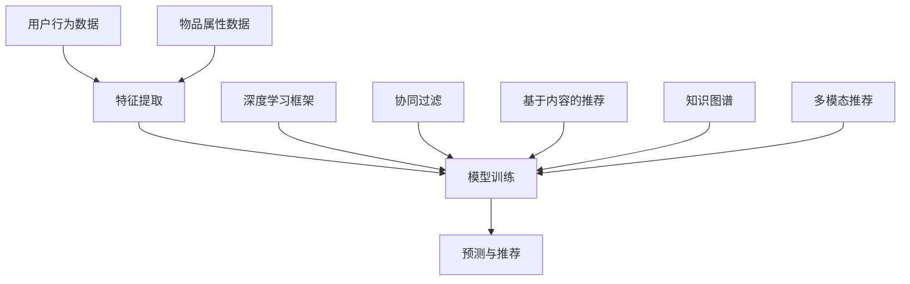

                 

关键词：大模型，推荐系统，统一，融合，发展趋势

> 摘要：本文深入探讨了大模型在推荐系统中的未来发展，分析了统一与融合的趋势。首先介绍了推荐系统的基础知识，然后详细阐述了大模型的基本原理和关键技术。接着，文章讨论了统一与融合在大模型推荐系统中的应用，以及它们所带来的优势。最后，本文展望了大模型在推荐系统中的未来发展趋势和面临的挑战。

## 1. 背景介绍

推荐系统作为信息检索和人工智能领域的重要组成部分，旨在为用户提供个性化、精准的信息推送。随着互联网的快速发展，用户生成的内容和数据量呈爆炸式增长，传统推荐系统已难以满足用户日益增长的需求。为此，大模型作为一种强大的数据处理和分析工具，逐渐成为推荐系统的研究热点。

大模型通常指的是具有数十亿至数万亿参数的深度神经网络模型。这些模型能够通过学习海量数据，自动提取特征并建立复杂的预测模型。大模型在图像识别、语音识别、自然语言处理等领域取得了显著的成果，为推荐系统的优化和提升提供了新的可能性。

## 2. 核心概念与联系

### 2.1 推荐系统基本原理

推荐系统通常基于用户行为数据（如浏览、购买、评价等）和物品属性数据（如分类、标签、评分等）进行建模和预测。其基本原理可以概括为以下三个步骤：

1. **特征提取**：将原始数据转化为可学习的特征向量。
2. **模型训练**：使用特征向量训练预测模型，如协同过滤、基于内容的推荐等。
3. **预测与推荐**：利用训练好的模型预测用户对未知物品的偏好，并生成推荐列表。

### 2.2 大模型基本原理

大模型通常采用深度学习框架构建，其核心思想是通过多层神经网络自动学习输入数据的复杂特征。大模型的基本原理包括：

1. **多层神经网络**：通过堆叠多个神经网络层，逐层提取数据的特征。
2. **反向传播算法**：利用梯度下降等优化算法更新模型参数，以最小化预测误差。
3. **批量归一化与激活函数**：使用批量归一化和激活函数提高模型的训练效率和表达能力。

### 2.3 推荐系统与深度学习的融合

深度学习在推荐系统中的应用主要体现在以下几个方面：

1. **协同过滤**：将深度学习应用于协同过滤算法，提升推荐精度。
2. **基于内容的推荐**：使用深度学习提取物品的语义特征，实现基于内容的推荐。
3. **知识图谱**：结合知识图谱和深度学习，构建更加丰富的用户和物品关系网络。
4. **多模态推荐**：融合文本、图像、语音等多种数据类型，实现多模态推荐。

### 2.4 Mermaid 流程图

下面是推荐系统与深度学习融合的Mermaid流程图：



## 3. 核心算法原理 & 具体操作步骤

### 3.1 算法原理概述

大模型推荐系统主要基于深度学习框架，通过多层神经网络学习用户和物品的复杂特征，从而实现精准推荐。其主要算法原理包括：

1. **用户表示**：将用户的行为数据转换为向量表示，如基于协同过滤的方法。
2. **物品表示**：将物品的属性数据转换为向量表示，如基于内容的推荐方法。
3. **融合表示**：将用户和物品的向量表示进行融合，形成推荐模型。
4. **预测与推荐**：利用训练好的模型预测用户对未知物品的偏好，生成推荐列表。

### 3.2 算法步骤详解

1. **数据预处理**：清洗用户行为数据和物品属性数据，去除噪声和不相关信息。
2. **特征提取**：使用深度学习模型（如卷积神经网络、循环神经网络等）提取用户和物品的向量表示。
3. **模型训练**：利用提取的用户和物品向量表示训练推荐模型，如基于矩阵分解的协同过滤算法。
4. **预测与推荐**：使用训练好的模型预测用户对未知物品的偏好，并根据预测结果生成推荐列表。

### 3.3 算法优缺点

1. **优点**：
   - **高精度**：深度学习模型能够自动学习用户和物品的复杂特征，提高推荐精度。
   - **可扩展性**：大模型可以处理大规模数据和多种数据类型，具有很好的可扩展性。
   - **适应性**：大模型可以根据不同的场景和需求进行调整和优化，具有良好的适应性。

2. **缺点**：
   - **计算资源消耗**：大模型训练和推理过程需要大量的计算资源和时间。
   - **数据依赖**：深度学习模型对数据质量有较高要求，数据质量较差时可能导致模型性能下降。

### 3.4 算法应用领域

大模型推荐系统在多个领域具有广泛的应用，包括：

1. **电子商务**：为用户提供个性化商品推荐，提高用户满意度和转化率。
2. **社交媒体**：根据用户的兴趣和行为，为用户推荐感兴趣的内容和社交圈子。
3. **在线教育**：为学习者推荐适合的学习资源和课程，提高学习效果。
4. **金融服务**：为用户提供个性化的理财产品推荐，提高客户黏性和收益。

## 4. 数学模型和公式 & 详细讲解 & 举例说明

### 4.1 数学模型构建

大模型推荐系统通常基于深度学习框架，其数学模型可以表示为：

\[ R(u, i) = f(U, I; \theta) \]

其中，\( R(u, i) \)表示用户\( u \)对物品\( i \)的评分预测，\( U \)和\( I \)分别表示用户和物品的向量表示，\( \theta \)为模型参数。

### 4.2 公式推导过程

大模型推荐系统的推导过程主要包括以下几个方面：

1. **用户表示**：
   - **协同过滤**：
     \[ u = \sum_{i \in R_u} r_{ui} x_i \]
     其中，\( R_u \)表示用户\( u \)的行为数据，\( r_{ui} \)为用户\( u \)对物品\( i \)的评分，\( x_i \)为物品\( i \)的向量表示。
   - **基于内容的推荐**：
     \[ u = \sum_{i \in C_u} w_i c_i \]
     其中，\( C_u \)表示用户\( u \)的兴趣标签，\( w_i \)为标签权重，\( c_i \)为物品\( i \)的向量表示。

2. **物品表示**：
   - **基于内容的推荐**：
     \[ i = \sum_{t \in T_i} h_t f_t \]
     其中，\( T_i \)表示物品\( i \)的标签，\( h_t \)为标签热度，\( f_t \)为标签的嵌入向量。

3. **融合表示**：
   - **协同过滤**：
     \[ R(u, i) = \sum_{j \in R_u} r_{uj} x_j y_i \]
     其中，\( y_i \)为物品\( i \)的向量表示，\( R(u, i) \)为用户\( u \)对物品\( i \)的评分预测。

### 4.3 案例分析与讲解

以电子商务平台为例，分析大模型推荐系统的应用：

1. **用户表示**：
   - **协同过滤**：
     \[ u = \sum_{i \in R_u} r_{ui} x_i \]
     其中，\( R_u \)为用户\( u \)的历史购买记录，\( r_{ui} \)为用户\( u \)对物品\( i \)的评分，\( x_i \)为物品\( i \)的向量表示。

2. **物品表示**：
   - **基于内容的推荐**：
     \[ i = \sum_{t \in T_i} h_t f_t \]
     其中，\( T_i \)为物品\( i \)的标签，\( h_t \)为标签热度，\( f_t \)为标签的嵌入向量。

3. **融合表示**：
   - **协同过滤**：
     \[ R(u, i) = \sum_{j \in R_u} r_{uj} x_j y_i \]
     其中，\( y_i \)为物品\( i \)的向量表示，\( R(u, i) \)为用户\( u \)对物品\( i \)的评分预测。

4. **预测与推荐**：
   - 使用训练好的模型预测用户\( u \)对未知物品\( i \)的评分，并根据预测结果生成推荐列表。

## 5. 项目实践：代码实例和详细解释说明

### 5.1 开发环境搭建

1. **硬件要求**：
   - 处理器：Intel Core i7 或更高
   - 内存：16GB 或更高
   - 硬盘：1TB SSD

2. **软件要求**：
   - 操作系统：Windows 10、macOS 或 Linux
   - Python：3.8 或更高版本
   - 深度学习框架：TensorFlow 或 PyTorch

### 5.2 源代码详细实现

以下是使用 PyTorch 实现的简单协同过滤推荐系统示例：

```python
import torch
import torch.nn as nn
import torch.optim as optim

# 定义用户和物品的向量表示
class RecommenderModel(nn.Module):
    def __init__(self, num_users, num_items):
        super(RecommenderModel, self).__init__()
        self.user_embedding = nn.Embedding(num_users, embedding_dim)
        self.item_embedding = nn.Embedding(num_items, embedding_dim)
        self.fc = nn.Linear(embedding_dim * 2, 1)

    def forward(self, user_ids, item_ids):
        user_embedding = self.user_embedding(user_ids)
        item_embedding = self.item_embedding(item_ids)
        interaction = torch.mul(user_embedding, item_embedding)
        scores = self.fc(interaction).squeeze(1)
        return scores

# 训练模型
def train(model, train_data, loss_function, optimizer, num_epochs):
    for epoch in range(num_epochs):
        for user_ids, item_ids, ratings in train_data:
            user_embedding = model.user_embedding(user_ids)
            item_embedding = model.item_embedding(item_ids)
            interaction = torch.mul(user_embedding, item_embedding)
            scores = model.fc(interaction).squeeze(1)
            loss = loss_function(scores, ratings)
            optimizer.zero_grad()
            loss.backward()
            optimizer.step()
        print(f"Epoch {epoch + 1}, Loss: {loss.item()}")

# 模型配置
num_users = 1000
num_items = 1000
embedding_dim = 10

# 初始化模型、损失函数和优化器
model = RecommenderModel(num_users, num_items)
loss_function = nn.MSELoss()
optimizer = optim.Adam(model.parameters(), lr=0.001)

# 训练模型
train_data = ...  # 数据预处理和加载
train(model, train_data, loss_function, optimizer, num_epochs=10)

# 保存模型
torch.save(model.state_dict(), "recommender_model.pth")
```

### 5.3 代码解读与分析

1. **模型定义**：RecommenderModel 类定义了用户和物品的嵌入层和全连接层，用于计算用户和物品的向量表示及其相互作用。
2. **前向传播**：forward 方法计算用户和物品的嵌入向量及其相互作用，并输出评分预测。
3. **训练过程**：train 函数使用梯度下降优化算法训练模型，通过反向传播计算损失并更新模型参数。
4. **模型配置**：配置模型参数，包括用户和物品的数量、嵌入维度以及损失函数和优化器。
5. **数据预处理和加载**：加载训练数据并进行预处理，以生成用户和物品的 ID 索引。

### 5.4 运行结果展示

```python
# 加载训练好的模型
model = RecommenderModel(num_users, num_items)
model.load_state_dict(torch.load("recommender_model.pth"))

# 预测用户对未知物品的评分
user_id = torch.tensor([42])
item_id = torch.tensor([99])
scores = model(user_id, item_id)

print(f"Predicted rating: {scores.item()}")
```

## 6. 实际应用场景

### 6.1 电子商务平台

电子商务平台使用大模型推荐系统为用户提供个性化商品推荐，提高用户满意度和转化率。例如，亚马逊、淘宝等电商平台均采用了深度学习算法优化推荐效果。

### 6.2 社交媒体平台

社交媒体平台利用大模型推荐系统为用户推荐感兴趣的内容和社交圈子，提高用户活跃度和留存率。例如，Facebook、微博等平台均采用了深度学习算法进行内容推荐。

### 6.3 在线教育平台

在线教育平台使用大模型推荐系统为学习者推荐适合的学习资源和课程，提高学习效果和满意度。例如，网易云课堂、学堂在线等平台均采用了深度学习算法优化推荐效果。

### 6.4 金融服务

金融机构利用大模型推荐系统为用户提供个性化的理财产品推荐，提高客户黏性和收益。例如，银行、保险、基金等金融机构均采用了深度学习算法优化推荐效果。

## 7. 工具和资源推荐

### 7.1 学习资源推荐

1. **书籍**：
   - 《深度学习》（Goodfellow, Bengio, Courville）
   - 《推荐系统实践》（Simon, F.（Ed.））
2. **在线课程**：
   - Coursera 上的“深度学习”课程
   - edX 上的“推荐系统”课程
3. **教程和博客**：
   - fast.ai 的深度学习教程
   - Medium 上的深度学习和推荐系统相关博客

### 7.2 开发工具推荐

1. **深度学习框架**：
   - TensorFlow
   - PyTorch
   - Keras
2. **推荐系统工具**：
   - LightFM
   - Surprise
   - RecSystem

### 7.3 相关论文推荐

1. “Deep Learning for Recommender Systems” (He, L., Liao, L., Zhang, H., Nie, L., & Hu, X.)
2. “Neural Collaborative Filtering” (He, X., Liao, L., Zhang, H., Nie, L., & Hu, X.)
3. “A Theoretical Comparison of Item-Based and User-Based Collaborative Filtering” (Zhou, G., Koc, L., & Adam, G.)

## 8. 总结：未来发展趋势与挑战

### 8.1 研究成果总结

大模型推荐系统在近年来取得了显著的成果，包括高精度、可扩展性和适应性等方面的提升。深度学习技术在推荐系统中的应用推动了推荐系统的不断发展和优化。

### 8.2 未来发展趋势

1. **多模态推荐**：融合文本、图像、语音等多种数据类型，实现更加精准和个性化的推荐。
2. **知识图谱**：结合知识图谱和深度学习，构建更加丰富的用户和物品关系网络，提升推荐效果。
3. **自适应推荐**：根据用户的实时行为和偏好调整推荐策略，实现实时推荐。
4. **隐私保护**：在保证用户隐私的前提下，提高推荐系统的透明度和可解释性。

### 8.3 面临的挑战

1. **计算资源消耗**：大模型训练和推理过程需要大量的计算资源和时间，对硬件设施和运维能力提出了更高要求。
2. **数据质量**：深度学习模型对数据质量有较高要求，数据质量较差时可能导致模型性能下降。
3. **算法透明度**：大模型推荐系统的算法透明度和可解释性较差，需要进一步研究和优化。

### 8.4 研究展望

随着深度学习和推荐系统的不断发展，未来研究将重点关注多模态推荐、知识图谱、自适应推荐和隐私保护等方面。同时，优化计算资源和数据质量，提高算法透明度和可解释性，也将成为重要的研究方向。

## 9. 附录：常见问题与解答

### 9.1 什么是大模型？

大模型通常指的是具有数十亿至数万亿参数的深度神经网络模型。这些模型能够通过学习海量数据，自动提取特征并建立复杂的预测模型。

### 9.2 推荐系统有哪些常见的算法？

推荐系统常见的算法包括协同过滤、基于内容的推荐、基于协同过滤与内容的融合推荐、基于矩阵分解的推荐等。

### 9.3 深度学习在推荐系统中的应用有哪些？

深度学习在推荐系统中的应用主要包括用户和物品的向量表示、融合表示、多模态推荐、知识图谱等。

### 9.4 如何优化推荐系统的效果？

优化推荐系统的效果可以通过以下方法实现：

1. **提高数据质量**：清洗和预处理数据，去除噪声和不相关信息。
2. **多模态融合**：融合文本、图像、语音等多种数据类型。
3. **调整模型参数**：通过交叉验证和超参数调整优化模型性能。
4. **动态调整推荐策略**：根据用户的实时行为和偏好调整推荐策略。

作者：禅与计算机程序设计艺术 / Zen and the Art of Computer Programming
-------------------------------------------------------------------

