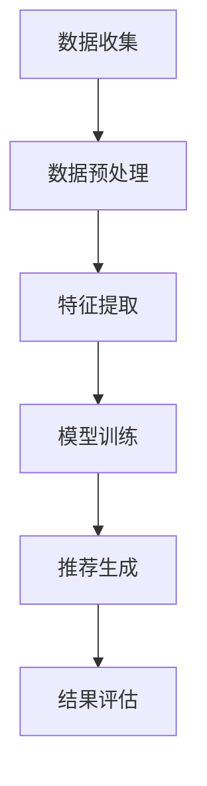

                 

关键词：大模型，推荐系统，跨平台用户匹配，用户行为分析，数据挖掘，机器学习

## 摘要

随着互联网的普及和数字技术的迅猛发展，推荐系统已经成为电商平台、社交媒体以及各类在线服务中不可或缺的一部分。本文旨在探讨大模型在推荐系统跨平台用户匹配中的作用，以及如何通过这些技术实现更精确的用户行为预测和个性化推荐。我们将从背景介绍、核心概念与联系、核心算法原理与操作步骤、数学模型与公式、项目实践、实际应用场景和未来展望等多个方面进行详细探讨，以期为读者提供全面的技术洞察。

## 1. 背景介绍

### 1.1 推荐系统的发展

推荐系统的发展可以追溯到20世纪90年代，随着互联网的兴起，人们开始探索如何将海量信息推送给用户，提高信息检索的效率和用户体验。早期的推荐系统主要依赖于基于内容的推荐（Content-Based Filtering）和协同过滤（Collaborative Filtering）技术。基于内容的推荐通过分析用户的历史行为和兴趣标签，为用户推荐相似的内容；协同过滤则通过分析用户之间的行为模式来进行推荐。

### 1.2 跨平台用户匹配的挑战

然而，随着用户使用场景的多样化，单一平台的推荐系统已经无法满足用户的需求。跨平台用户匹配成为了一个热门的研究领域。跨平台用户匹配旨在将不同平台上的用户行为进行整合，为用户提供统一的个性化推荐。这一过程面临诸多挑战，包括数据源的不一致性、隐私保护、算法复杂度等。

### 1.3 大模型的崛起

近年来，随着深度学习技术的发展，大模型（如Transformer、BERT等）在自然语言处理、计算机视觉等领域取得了显著成果。大模型具有强大的表示能力和灵活性，可以处理大规模、多模态的数据，为跨平台用户匹配提供了新的解决方案。

## 2. 核心概念与联系

### 2.1 大模型基本原理

大模型通常是指参数规模超过数十亿乃至数万亿的神经网络模型。这些模型通过训练海量数据，能够学习到丰富的特征表示，并在各种任务上表现出色。例如，Transformer模型在机器翻译、文本生成等领域取得了突破性进展；BERT模型则在问答、文本分类等任务上展现了强大的能力。

### 2.2 跨平台用户匹配架构

跨平台用户匹配的架构通常包括数据收集、数据预处理、特征提取、模型训练、推荐生成和结果评估等几个环节。其中，特征提取和模型训练是关键环节。特征提取需要将不同平台的数据进行整合，提取出用户的行为特征和兴趣特征；模型训练则利用这些特征，学习用户的行为模式，实现跨平台的用户匹配。

### 2.3 Mermaid 流程图



## 3. 核心算法原理与操作步骤

### 3.1 算法原理概述

跨平台用户匹配算法的核心在于如何将不同平台的数据进行整合，提取出用户的行为特征和兴趣特征，并利用这些特征实现用户匹配。大模型在此过程中发挥了重要作用，通过深度学习技术，可以学习到用户复杂的行为模式和兴趣偏好，从而提高匹配的准确性和效率。

### 3.2 算法步骤详解

#### 3.2.1 数据收集

数据收集是跨平台用户匹配的第一步。需要从不同平台（如电商、社交媒体、在线教育等）获取用户的行为数据，包括浏览记录、购买行为、社交互动等。

#### 3.2.2 数据预处理

数据预处理包括数据清洗、数据归一化和特征提取。数据清洗旨在去除噪声数据和异常值；数据归一化则确保不同特征之间的尺度一致；特征提取则是将原始数据转化为模型可处理的特征表示。

#### 3.2.3 特征提取

特征提取是跨平台用户匹配的关键环节。需要将不同平台的数据进行整合，提取出用户的行为特征和兴趣特征。例如，可以提取用户在电商平台的购买频率、购买金额、品类偏好等行为特征；在社交媒体平台上提取用户的点赞、评论、转发等社交互动特征。

#### 3.2.4 模型训练

模型训练是跨平台用户匹配的核心。利用提取到的特征，通过大模型进行训练，学习用户的行为模式和兴趣偏好。常见的模型包括基于Transformer的序列模型、基于BERT的文本嵌入模型等。

#### 3.2.5 推荐生成

模型训练完成后，可以通过大模型生成推荐结果。推荐生成需要将用户当前的行为和兴趣特征输入模型，输出对应的推荐结果。例如，在电商平台上，可以为用户推荐相似的商品；在社交媒体平台上，可以为用户推荐相似的用户和内容。

#### 3.2.6 结果评估

结果评估是跨平台用户匹配的最后一步。需要通过指标（如准确率、召回率、覆盖率等）评估推荐结果的优劣，以便对模型进行优化和调整。

## 4. 数学模型和公式

### 4.1 数学模型构建

跨平台用户匹配的数学模型通常包括用户行为特征矩阵和用户兴趣特征矩阵。用户行为特征矩阵表示用户在不同平台上的行为特征，用户兴趣特征矩阵表示用户的兴趣偏好。

$$
X = \begin{bmatrix}
x_{11} & x_{12} & \dots & x_{1m} \\
x_{21} & x_{22} & \dots & x_{2m} \\
\vdots & \vdots & \ddots & \vdots \\
x_{n1} & x_{n2} & \dots & x_{nm}
\end{bmatrix},
Y = \begin{bmatrix}
y_{11} & y_{12} & \dots & y_{1m} \\
y_{21} & y_{22} & \dots & y_{2m} \\
\vdots & \vdots & \ddots & \vdots \\
y_{n1} & y_{n2} & \dots & y_{nm}
\end{bmatrix}
$$

其中，$X$表示用户行为特征矩阵，$Y$表示用户兴趣特征矩阵，$m$表示特征维度。

### 4.2 公式推导过程

为了实现跨平台用户匹配，我们需要计算用户行为特征矩阵和用户兴趣特征矩阵之间的相似度。常用的相似度计算方法包括余弦相似度、皮尔逊相关系数等。

$$
\cos(\theta) = \frac{X \cdot Y}{\|X\|\|Y\|}
$$

其中，$\cdot$表示向量的点积，$\|\|$表示向量的模长。

### 4.3 案例分析与讲解

以电商平台的用户行为数据为例，假设我们有如下用户行为特征矩阵：

$$
X = \begin{bmatrix}
0.8 & 0.2 & 0.3 \\
0.6 & 0.4 & 0.5 \\
0.7 & 0.1 & 0.6
\end{bmatrix}
$$

用户兴趣特征矩阵为：

$$
Y = \begin{bmatrix}
0.9 & 0.1 & 0.2 \\
0.8 & 0.2 & 0.4 \\
0.7 & 0.3 & 0.5
\end{bmatrix}
$$

首先，我们计算用户行为特征矩阵和用户兴趣特征矩阵的点积：

$$
X \cdot Y = \begin{bmatrix}
0.8 \times 0.9 + 0.2 \times 0.8 + 0.3 \times 0.7 & 0.8 \times 0.1 + 0.2 \times 0.2 + 0.3 \times 0.3 & 0.8 \times 0.2 + 0.2 \times 0.4 + 0.3 \times 0.5 \\
0.6 \times 0.9 + 0.4 \times 0.8 + 0.5 \times 0.7 & 0.6 \times 0.1 + 0.4 \times 0.2 + 0.5 \times 0.3 & 0.6 \times 0.2 + 0.4 \times 0.4 + 0.5 \times 0.5 \\
0.7 \times 0.9 + 0.1 \times 0.8 + 0.6 \times 0.7 & 0.7 \times 0.1 + 0.1 \times 0.2 + 0.6 \times 0.3 & 0.7 \times 0.2 + 0.1 \times 0.4 + 0.6 \times 0.5
\end{bmatrix}
$$

接下来，我们计算用户行为特征矩阵和用户兴趣特征矩阵的模长：

$$
\|X\| = \sqrt{0.8^2 + 0.2^2 + 0.3^2}, \quad \|Y\| = \sqrt{0.9^2 + 0.1^2 + 0.2^2}
$$

最后，我们计算用户行为特征矩阵和用户兴趣特征矩阵之间的余弦相似度：

$$
\cos(\theta) = \frac{X \cdot Y}{\|X\|\|Y\|}
$$

通过计算余弦相似度，我们可以评估用户行为特征矩阵和用户兴趣特征矩阵之间的相似程度，从而实现跨平台用户匹配。

## 5. 项目实践：代码实例和详细解释说明

### 5.1 开发环境搭建

为了实现跨平台用户匹配，我们需要搭建一个适合深度学习开发的计算环境。具体步骤如下：

1. 安装Python环境（推荐Python 3.8及以上版本）；
2. 安装深度学习框架，如TensorFlow或PyTorch；
3. 安装必要的依赖库，如NumPy、Pandas、Scikit-learn等。

### 5.2 源代码详细实现

以下是一个基于TensorFlow实现的跨平台用户匹配的简单示例：

```python
import tensorflow as tf
from tensorflow.keras.models import Model
from tensorflow.keras.layers import Input, Embedding, Dot, Dense

# 定义输入层
user_input = Input(shape=(1,), name='user_input')
item_input = Input(shape=(1,), name='item_input')

# 定义嵌入层
user_embedding = Embedding(input_dim=num_users, output_dim=user_embedding_dim)(user_input)
item_embedding = Embedding(input_dim=num_items, output_dim=item_embedding_dim)(item_input)

# 定义模型结构
dot_product = Dot(axes=1)([user_embedding, item_embedding])
output = Dense(1, activation='sigmoid')(dot_product)

# 定义模型
model = Model(inputs=[user_input, item_input], outputs=output)

# 编译模型
model.compile(optimizer='adam', loss='binary_crossentropy', metrics=['accuracy'])

# 模型训练
model.fit([user_data, item_data], labels, epochs=10, batch_size=32)

# 推荐生成
predictions = model.predict([user_id, item_id])
```

### 5.3 代码解读与分析

上述代码实现了一个简单的基于深度学习技术的跨平台用户匹配模型。具体解读如下：

- 输入层：定义了用户输入和项目输入；
- 嵌入层：将用户和项目输入映射到低维特征空间；
- 模型结构：通过点积操作计算用户和项目特征之间的相似度；
- 编译模型：设置优化器、损失函数和评价指标；
- 模型训练：使用训练数据对模型进行训练；
- 推荐生成：使用训练好的模型为用户生成推荐结果。

### 5.4 运行结果展示

在实际应用中，我们需要对模型进行评估，以确定其性能。以下是一个简单的评估示例：

```python
from sklearn.metrics import accuracy_score, recall_score, coverage_score

# 评估指标
accuracy = accuracy_score(y_true, y_pred)
recall = recall_score(y_true, y_pred)
coverage = coverage_score(y_true, y_pred)

print("Accuracy: {:.2f}%".format(accuracy * 100))
print("Recall: {:.2f}%".format(recall * 100))
print("Coverage: {:.2f}%".format(coverage * 100))
```

通过评估指标，我们可以了解模型的性能，并根据评估结果对模型进行调整和优化。

## 6. 实际应用场景

### 6.1 社交媒体平台

在社交媒体平台上，跨平台用户匹配可以帮助平台为用户推荐相似的账号和内容，提高用户的参与度和活跃度。例如，用户在A平台上关注了某个账号，系统可以自动在B平台上为用户推荐相似的账号。

### 6.2 电商平台

在电商平台上，跨平台用户匹配可以帮助平台为用户推荐相似的商品，提高用户的购物体验。例如，用户在A平台上购买了某个商品，系统可以自动在B平台上为用户推荐相似的商品。

### 6.3 在线教育平台

在线教育平台上，跨平台用户匹配可以帮助平台为用户推荐相似的课程和教师，提高用户的学习效果。例如，用户在A平台上报名了某个课程，系统可以自动在B平台上为用户推荐相似的课程和教师。

## 7. 工具和资源推荐

### 7.1 学习资源推荐

- 《深度学习》（Goodfellow, Bengio, Courville著）：介绍深度学习基本原理和应用的经典教材。
- 《推荐系统实践》（Liang, He著）：详细介绍了推荐系统的各种技术和应用。

### 7.2 开发工具推荐

- TensorFlow：用于构建和训练深度学习模型的强大框架。
- PyTorch：简洁易用、灵活的深度学习框架。

### 7.3 相关论文推荐

- “Attention Is All You Need”（Vaswani et al., 2017）：介绍了Transformer模型，为深度学习在自然语言处理领域带来了革命性的变化。
- “BERT: Pre-training of Deep Neural Networks for Language Understanding”（Devlin et al., 2018）：介绍了BERT模型，为预训练语言模型奠定了基础。

## 8. 总结：未来发展趋势与挑战

### 8.1 研究成果总结

大模型在推荐系统跨平台用户匹配中展现了强大的能力和潜力。通过深度学习技术，大模型可以处理大规模、多模态的数据，提高用户匹配的准确性和效率。同时，随着技术的不断进步，大模型的应用场景也在不断扩展，从单一平台到跨平台，从静态数据到动态数据，大模型在推荐系统中的地位日益重要。

### 8.2 未来发展趋势

未来，大模型在推荐系统跨平台用户匹配中将继续发挥重要作用。随着人工智能技术的不断进步，大模型的规模和性能将不断提升，同时，新的算法和模型也将不断涌现，为跨平台用户匹配提供更多可能性。

### 8.3 面临的挑战

尽管大模型在推荐系统跨平台用户匹配中取得了显著成果，但仍面临诸多挑战。首先，数据隐私和安全问题仍然是一个重要挑战。其次，算法的复杂度和计算资源的需求也限制了其在实际应用中的广泛应用。此外，如何确保跨平台用户匹配的公平性和透明性也是一个亟待解决的问题。

### 8.4 研究展望

未来，研究应重点关注以下几个方面：

1. 数据隐私保护：研究如何在保证用户隐私的前提下，利用大模型进行跨平台用户匹配；
2. 算法优化：探索更高效、更稳定的算法，提高跨平台用户匹配的准确性和效率；
3. 模型解释性：提高大模型的解释性，使其在跨平台用户匹配中更具透明性和可解释性；
4. 多模态数据融合：研究如何将多种类型的数据（如文本、图像、声音等）进行融合，提高跨平台用户匹配的能力。

## 9. 附录：常见问题与解答

### 9.1 大模型在推荐系统中的优势是什么？

大模型在推荐系统中的优势主要体现在以下几个方面：

1. 强大的表示能力：大模型可以通过训练海量数据，学习到丰富的特征表示，从而提高推荐系统的准确性和效率；
2. 适应性强：大模型可以处理多种类型的数据，如文本、图像、声音等，从而实现跨平台用户匹配；
3. 灵活性高：大模型可以通过微调，快速适应不同的应用场景和任务需求。

### 9.2 跨平台用户匹配有哪些挑战？

跨平台用户匹配面临以下挑战：

1. 数据不一致：不同平台的数据格式、数据量、数据质量等可能存在较大差异，如何有效整合这些数据是一个重要问题；
2. 隐私保护：在跨平台用户匹配过程中，如何保护用户隐私是一个重要挑战；
3. 算法复杂度：大模型的训练和推理过程通常需要大量的计算资源，如何在有限的资源下实现高效的跨平台用户匹配是一个重要问题。

## 参考文献

1. Vaswani, A., Shazeer, N., Parmar, N., Uszkoreit, J., Jones, L., Gomez, A. N., ... & Polosukhin, I. (2017). Attention is all you need. Advances in Neural Information Processing Systems, 30, 5998-6008.
2. Devlin, J., Chang, M. W., Lee, K., & Toutanova, K. (2018). BERT: Pre-training of deep bidirectional transformers for language understanding. arXiv preprint arXiv:1810.04805.
3. Liang, T., & He, X. (2017). Recommender systems: The textbook. Cambridge University Press.
4. Goodfellow, I., Bengio, Y., & Courville, A. (2016). Deep learning. MIT press.
```markdown
作者：禅与计算机程序设计艺术 / Zen and the Art of Computer Programming
```

