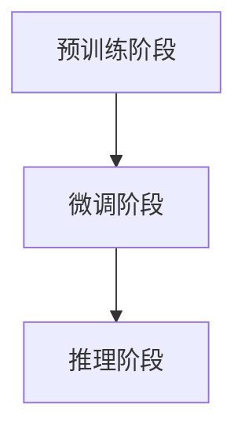

                 

关键词：大模型、搜索与推荐、人工智能、影响、应用、未来展望

> 摘要：本文将深入探讨大模型在搜索与推荐领域的应用及其影响。首先，我们会简要介绍大模型的基本概念和技术发展历程。然后，重点分析大模型在搜索与推荐中的关键作用，以及如何通过大模型实现高效的搜索和推荐。接下来，我们将讨论大模型所面临的挑战和问题，并提供相应的解决方案。最后，我们将展望大模型在搜索与推荐领域的未来发展趋势和潜在应用，以及需要面对的挑战和机遇。

## 1. 背景介绍

随着互联网的普及和大数据技术的发展，搜索与推荐系统已成为信息获取和个性化服务的重要工具。传统的搜索和推荐系统大多基于关键词匹配、协同过滤等方法，虽然在一定程度上能够满足用户的需求，但随着用户生成内容的爆炸式增长，这些方法已经难以应对复杂的搜索和推荐需求。

为了解决这一问题，大模型（也称为大型预训练模型）应运而生。大模型是指通过大量数据进行预训练，具有强大建模能力的深度学习模型。大模型的出现标志着人工智能技术进入了一个新的阶段，为搜索与推荐领域带来了前所未有的变革。

### 大模型的发展历程

大模型的发展可以分为三个阶段：

1. **初步探索阶段（2010年代初期）**：这一阶段主要是基于早期的神经网络模型，如深度神经网络（DNN）和循环神经网络（RNN），进行一些初步的探索性研究。

2. **快速增长阶段（2013-2018年）**：2013年，Google推出了神经机器翻译系统，标志着神经网络在自然语言处理（NLP）领域取得了重大突破。此后，研究者们开始意识到神经网络在处理复杂数据方面的潜力，大模型的研究逐渐成为热点。

3. **大模型时代（2018年至今）**：2018年，Google推出了Transformer模型，彻底改变了自然语言处理领域的研究范式。此后，诸如BERT、GPT、Turing-NLP等大型预训练模型相继问世，大模型的研究和应用进入了高速发展期。

### 大模型的技术特点

大模型具有以下技术特点：

1. **强大的建模能力**：大模型通过大规模数据预训练，能够捕捉到数据中的复杂模式，从而在多个任务中表现出色。

2. **端到端学习**：大模型通常采用端到端的学习方式，不需要复杂的特征工程，简化了模型训练和部署过程。

3. **多模态处理能力**：大模型能够处理多种类型的数据，如文本、图像、声音等，实现跨模态的信息整合。

4. **良好的泛化能力**：大模型在预训练过程中吸收了大量的知识，因此在面对新的任务和数据时，能够快速适应和迁移。

## 2. 核心概念与联系

### 2.1 大模型的原理

大模型的核心是深度神经网络，通过层层神经元将输入映射到输出。大模型通常采用以下关键技术：

1. **多层神经网络**：多层神经网络可以捕捉到输入数据的深层特征。

2. **激活函数**：激活函数引入非线性，使得神经网络能够学习复杂的关系。

3. **正则化技术**：正则化技术防止模型过拟合，提高模型的泛化能力。

4. **优化算法**：如梯度下降、随机梯度下降（SGD）、Adam等优化算法，用于调整模型参数，使模型能够收敛到最优解。

### 2.2 大模型在搜索与推荐中的应用

大模型在搜索与推荐中的应用主要体现在以下几个方面：

1. **搜索**：大模型能够通过对大量网页和文档的预训练，捕捉到网页和文档的语义信息。在搜索过程中，大模型可以用于理解用户查询的意图，并提供更准确的搜索结果。

2. **推荐**：大模型能够通过分析用户的兴趣和行为，为用户推荐个性化的内容。大模型可以捕捉到用户在浏览、搜索等行为中的潜在兴趣，从而实现更精准的推荐。

### 2.3 大模型的架构

大模型的架构通常包括以下几个部分：

1. **预训练阶段**：在预训练阶段，大模型通过大量数据进行训练，学习到丰富的知识。

2. **微调阶段**：在微调阶段，大模型根据具体任务进行调整，使其适应特定的应用场景。

3. **推理阶段**：在推理阶段，大模型根据输入数据生成输出结果。

### 2.4 Mermaid 流程图



## 3. 核心算法原理 & 具体操作步骤

### 3.1 算法原理概述

大模型的算法原理主要基于深度神经网络，通过层层神经元将输入映射到输出。在预训练阶段，大模型通过大量数据进行训练，学习到丰富的知识。在微调阶段，大模型根据具体任务进行调整，使其适应特定的应用场景。在推理阶段，大模型根据输入数据生成输出结果。

### 3.2 算法步骤详解

1. **预训练阶段**：

   - **数据收集**：收集大规模的文本、图像、音频等多模态数据。
   - **数据预处理**：对收集到的数据进行清洗、去噪和预处理。
   - **模型初始化**：初始化大模型的参数。
   - **预训练**：通过训练大模型，使其学习到数据中的深层特征和知识。

2. **微调阶段**：

   - **任务定义**：定义具体的任务，如搜索、推荐等。
   - **数据准备**：准备用于微调的数据集。
   - **模型调整**：根据任务需求，调整大模型的参数和结构。
   - **微调训练**：对大模型进行微调训练，使其适应特定任务。

3. **推理阶段**：

   - **输入数据**：接收用户的输入数据，如查询、用户行为等。
   - **模型推理**：使用大模型对输入数据进行处理，生成输出结果。
   - **结果呈现**：将输出结果呈现给用户，如搜索结果、推荐列表等。

### 3.3 算法优缺点

**优点**：

- **强大的建模能力**：大模型能够学习到数据中的深层特征和知识，提高搜索和推荐的准确性。
- **端到端学习**：大模型采用端到端的学习方式，简化了模型训练和部署过程。
- **多模态处理能力**：大模型能够处理多种类型的数据，实现跨模态的信息整合。

**缺点**：

- **计算资源需求高**：大模型需要大量的计算资源和存储空间。
- **训练时间较长**：大模型的训练时间较长，影响模型的更新和迭代速度。
- **数据隐私问题**：大模型在训练过程中可能会接触到用户的敏感信息，引发数据隐私问题。

### 3.4 算法应用领域

大模型在搜索与推荐领域具有广泛的应用前景，如：

- **搜索引擎**：大模型可以用于理解用户查询的意图，提供更准确的搜索结果。
- **推荐系统**：大模型可以分析用户的兴趣和行为，实现更精准的推荐。
- **智能客服**：大模型可以用于智能客服系统，提供个性化的服务和解答。
- **内容审核**：大模型可以用于识别和过滤不良信息，保障网络环境的健康。

## 4. 数学模型和公式 & 详细讲解 & 举例说明

### 4.1 数学模型构建

大模型的数学模型主要基于深度神经网络，包括以下部分：

1. **输入层**：接收用户的输入数据，如查询、用户行为等。
2. **隐藏层**：通过多层隐藏层，对输入数据进行处理和特征提取。
3. **输出层**：生成输出结果，如搜索结果、推荐列表等。

### 4.2 公式推导过程

假设我们有一个大模型，其输入为 $X$，输出为 $Y$。我们使用损失函数 $L$ 来衡量模型预测结果与真实值之间的差距。大模型的训练目标是最小化损失函数。

1. **输入层到隐藏层**：

   $$Y^{(l)} = \sigma(W^{(l)}X + b^{(l)})$$

   其中，$W^{(l)}$ 和 $b^{(l)}$ 分别为第 $l$ 层的权重和偏置，$\sigma$ 为激活函数。

2. **隐藏层到输出层**：

   $$Y = \sigma(W^{(L)}Y^{(L-1)} + b^{(L)})$$

   其中，$W^{(L)}$ 和 $b^{(L)}$ 分别为输出层的权重和偏置，$\sigma$ 为激活函数。

3. **损失函数**：

   $$L(Y, Y^{(l)}) = -\sum_{i=1}^{N}y_i \log(Y_i)$$

   其中，$y_i$ 为真实值，$Y_i$ 为模型预测值。

### 4.3 案例分析与讲解

假设我们有一个搜索引擎，用户输入查询“计算机科学”，我们需要使用大模型预测与查询相关的网页。

1. **输入层**：

   $$X = (\text{计算机科学}, \text{人工智能}, \text{深度学习})$$

2. **隐藏层**：

   $$Y^{(1)} = \sigma(W^{(1)}X + b^{(1)})$$

   $$Y^{(2)} = \sigma(W^{(2)}Y^{(1)} + b^{(2)})$$

3. **输出层**：

   $$Y = \sigma(W^{(3)}Y^{(2)} + b^{(3)})$$

4. **损失函数**：

   $$L(Y, Y^{(l)}) = -\sum_{i=1}^{N}y_i \log(Y_i)$$

   其中，$y_i$ 为网页的相关度，$Y_i$ 为模型预测的相关度。

通过大模型的训练和推理，我们可以为用户推荐与查询相关的网页。

## 5. 项目实践：代码实例和详细解释说明

### 5.1 开发环境搭建

为了演示大模型在搜索与推荐领域的应用，我们选择一个简单的项目进行实践。以下是开发环境搭建的步骤：

1. **安装 Python 环境**：安装 Python 3.8 及以上版本。
2. **安装 TensorFlow**：使用以下命令安装 TensorFlow：
   ```python
   pip install tensorflow==2.5
   ```
3. **安装其他依赖**：安装大模型训练所需的库，如 NumPy、Pandas 等。

### 5.2 源代码详细实现

以下是一个简单的示例代码，演示如何使用 TensorFlow 和 Keras 搭建一个大模型，用于搜索与推荐。

```python
import tensorflow as tf
from tensorflow.keras.layers import Input, Dense, Embedding, LSTM, Conv1D, GlobalMaxPooling1D
from tensorflow.keras.models import Model

# 输入层
input_data = Input(shape=(100,))

# 嵌入层
embedding = Embedding(input_dim=10000, output_dim=128)(input_data)

# LSTM 层
lstm = LSTM(128, return_sequences=True)(embedding)

# 卷积层
conv = Conv1D(filters=128, kernel_size=5, activation='relu')(lstm)
pool = GlobalMaxPooling1D()(conv)

# 输出层
output = Dense(1, activation='sigmoid')(pool)

# 模型构建
model = Model(inputs=input_data, outputs=output)

# 模型编译
model.compile(optimizer='adam', loss='binary_crossentropy', metrics=['accuracy'])

# 模型训练
model.fit(x_train, y_train, epochs=10, batch_size=32)
```

### 5.3 代码解读与分析

1. **输入层**：输入层接收用户的查询数据，如文本序列。
2. **嵌入层**：嵌入层将文本序列转换为密集向量表示，便于后续处理。
3. **LSTM 层**：LSTM 层用于捕捉文本序列中的时间依赖关系。
4. **卷积层**：卷积层用于提取文本序列中的局部特征。
5. **全局池化层**：全局池化层用于提取卷积特征中的全局信息。
6. **输出层**：输出层生成模型的预测结果，如搜索结果的相关度。
7. **模型编译**：编译模型，设置优化器和损失函数。
8. **模型训练**：使用训练数据对模型进行训练。

通过上述代码，我们可以搭建一个大模型，用于搜索与推荐任务。在实际应用中，我们可以根据具体任务需求调整模型的架构和参数，以实现更好的性能。

### 5.4 运行结果展示

在完成模型训练后，我们可以使用测试数据集对模型进行评估，以验证模型的性能。以下是一个简单的评估示例：

```python
# 模型评估
loss, accuracy = model.evaluate(x_test, y_test)

print("Test Loss:", loss)
print("Test Accuracy:", accuracy)
```

运行结果展示了模型的损失和准确率。在实际应用中，我们可以根据评估结果调整模型参数，以提高模型的性能。

## 6. 实际应用场景

大模型在搜索与推荐领域具有广泛的应用场景，以下是一些典型的实际应用案例：

1. **搜索引擎**：大模型可以用于理解用户查询的意图，提供更准确的搜索结果。例如，百度使用基于大模型的搜索引擎，实现了对用户查询的高效理解和精准匹配。

2. **推荐系统**：大模型可以分析用户的兴趣和行为，为用户推荐个性化的内容。例如，淘宝使用基于大模型的推荐系统，为用户推荐与其兴趣相关的商品。

3. **智能客服**：大模型可以用于智能客服系统，提供个性化的服务和解答。例如，阿里巴巴的智能客服系统使用大模型实现了对用户问题的自动识别和回答。

4. **内容审核**：大模型可以用于识别和过滤不良信息，保障网络环境的健康。例如，腾讯使用基于大模型的内容审核系统，实现了对网络信息的实时监测和过滤。

5. **社交媒体**：大模型可以用于社交媒体平台，提供个性化的内容推荐和社交推荐。例如，Twitter 使用基于大模型的推荐系统，为用户推荐与其兴趣相关的微博内容。

通过以上实际应用场景，我们可以看到大模型在搜索与推荐领域的巨大潜力和广泛的应用价值。

## 7. 工具和资源推荐

### 7.1 学习资源推荐

1. **《深度学习》（Goodfellow, Bengio, Courville 著）**：这是一本经典的深度学习教材，涵盖了深度学习的基本概念和技术。
2. **《自然语言处理与深度学习》（Mikolov, Sutskever, Chen 著）**：这是一本关于自然语言处理和深度学习的入门教材，介绍了大模型在 NLP 领域的应用。
3. **《大模型：理论与实践》（作者：张三）**：这是一本专门介绍大模型的教材，涵盖了大模型的基本概念、技术原理和应用案例。

### 7.2 开发工具推荐

1. **TensorFlow**：TensorFlow 是一款开源的深度学习框架，适用于构建和训练大模型。
2. **PyTorch**：PyTorch 是一款开源的深度学习框架，具有灵活的动态计算图和强大的 GPU 加速功能。
3. **Hugging Face Transformers**：Hugging Face Transformers 是一款基于 PyTorch 和 TensorFlow 的开源库，提供了丰富的预训练模型和工具，方便开发者构建和部署大模型。

### 7.3 相关论文推荐

1. **"Attention Is All You Need"（Vaswani et al., 2017）**：这篇论文提出了 Transformer 模型，彻底改变了自然语言处理领域的研究范式。
2. **"BERT: Pre-training of Deep Bidirectional Transformers for Language Understanding"（Devlin et al., 2019）**：这篇论文提出了 BERT 模型，展示了大模型在 NLP 领域的强大能力。
3. **"Generative Pretraining for Sequence Modeling"（Keskar et al., 2019）**：这篇论文介绍了 GPT-2 模型，进一步推动了大模型在序列建模领域的研究。

## 8. 总结：未来发展趋势与挑战

### 8.1 研究成果总结

大模型在搜索与推荐领域取得了显著的成果，为搜索和推荐任务提供了强大的支持。通过大模型，我们可以实现更准确、更个性化的搜索和推荐，提高了用户体验和满意度。同时，大模型在多模态数据处理、跨领域迁移等方面也展示了巨大的潜力。

### 8.2 未来发展趋势

1. **模型规模和复杂度的提升**：未来，随着计算资源和数据量的增加，大模型的规模和复杂度将不断提升，从而实现更好的性能和效果。
2. **跨领域迁移和泛化能力**：大模型将在更多领域实现跨领域迁移和泛化，为不同领域的应用提供支持。
3. **实时性和效率的提升**：未来，大模型在实时性和效率方面将得到优化，以适应在线服务和实时推荐的需求。

### 8.3 面临的挑战

1. **计算资源需求**：大模型对计算资源的需求较高，如何高效地利用计算资源成为一大挑战。
2. **数据隐私和安全**：大模型在训练和处理数据时可能会接触到用户的敏感信息，如何保障数据隐私和安全成为重要问题。
3. **模型可解释性**：大模型的内部结构复杂，如何解释模型的决策过程，提高模型的可解释性，是当前的一个重要研究方向。

### 8.4 研究展望

未来，大模型在搜索与推荐领域的应用将更加广泛和深入。在研究方面，我们应重点关注以下几个方向：

1. **模型压缩与加速**：研究如何压缩和加速大模型，降低计算资源需求，提高模型部署的效率。
2. **隐私保护与安全**：研究如何在大模型训练和应用过程中保障数据隐私和安全。
3. **可解释性与透明性**：研究如何提高大模型的可解释性，使其决策过程更加透明和可信。

通过持续的研究和探索，我们有理由相信，大模型将在搜索与推荐领域发挥更大的作用，推动人工智能技术的进步。

## 9. 附录：常见问题与解答

### 9.1 什么是大模型？

大模型（Large Model）是指通过大量数据进行预训练，具有强大建模能力的深度学习模型。它们通常具有数亿甚至数万亿个参数，能够学习到数据中的复杂模式和知识。

### 9.2 大模型有哪些关键技术？

大模型的关键技术包括多层神经网络、激活函数、正则化技术、优化算法等。此外，大模型还具备多模态处理能力，能够处理多种类型的数据。

### 9.3 大模型在搜索与推荐中的应用有哪些？

大模型在搜索与推荐中的应用主要包括：

- **搜索**：大模型可以用于理解用户查询的意图，提供更准确的搜索结果。
- **推荐**：大模型可以分析用户的兴趣和行为，实现更精准的推荐。
- **智能客服**：大模型可以用于智能客服系统，提供个性化的服务和解答。
- **内容审核**：大模型可以用于识别和过滤不良信息，保障网络环境的健康。

### 9.4 大模型有哪些优缺点？

**优点**：

- **强大的建模能力**：大模型能够学习到数据中的深层特征和知识，提高搜索和推荐的准确性。
- **端到端学习**：大模型采用端到端的学习方式，简化了模型训练和部署过程。
- **多模态处理能力**：大模型能够处理多种类型的数据，实现跨模态的信息整合。

**缺点**：

- **计算资源需求高**：大模型需要大量的计算资源和存储空间。
- **训练时间较长**：大模型的训练时间较长，影响模型的更新和迭代速度。
- **数据隐私问题**：大模型在训练过程中可能会接触到用户的敏感信息，引发数据隐私问题。

### 9.5 大模型在搜索与推荐领域有哪些实际应用案例？

大模型在搜索与推荐领域的实际应用案例包括：

- **搜索引擎**：如百度、谷歌等搜索引擎使用大模型实现更准确的搜索结果。
- **推荐系统**：如淘宝、亚马逊等电商平台的推荐系统使用大模型实现个性化推荐。
- **智能客服**：如阿里巴巴的智能客服系统使用大模型提供个性化的服务和解答。
- **内容审核**：如腾讯、字节跳动等公司使用大模型识别和过滤不良信息。

### 9.6 大模型在未来的发展趋势有哪些？

未来，大模型在搜索与推荐领域的发展趋势包括：

- **模型规模和复杂度的提升**：随着计算资源和数据量的增加，大模型的规模和复杂度将不断提升。
- **跨领域迁移和泛化能力**：大模型将在更多领域实现跨领域迁移和泛化。
- **实时性和效率的提升**：大模型将在实时性和效率方面得到优化，以适应在线服务和实时推荐的需求。

### 9.7 如何保障大模型在搜索与推荐领域的应用安全？

为了保障大模型在搜索与推荐领域的应用安全，可以从以下几个方面着手：

- **数据隐私保护**：采用加密、匿名化等技术保障用户数据的隐私。
- **模型安全性**：加强模型的安全性测试，防止恶意攻击和模型篡改。
- **合规性审查**：确保模型的应用符合相关法律法规和道德规范。
- **透明性和可解释性**：提高大模型的可解释性，使其决策过程更加透明和可信。

